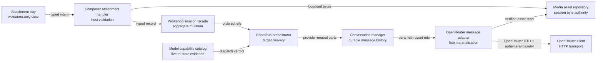

# Workshop Multimodal Composer Architecture Change Runway

**Date:** 2026-09-03
**Status:** Gate 00 complete; implementation gate open
**Decision owner:** Okey
**Prepared by:** Ada Forge
**Scope:** Workshop one-shot attachments, composer paste behavior, retained conversation content, session persistence, and OpenRouter Chat Completions input
**Branch / issue / epic:** [Workshop Multimodal Composer epic](epic-workshop-multimodal-composer.md)
**Audience and reading budget:** Decision owner and implementer; 2-minute map, 10-minute reviewer packet
**Implementation gate:** Open — Gate 00 accepted the ADR and recorded green fitness evidence

## 0. Change Card — 30 seconds

### Change thesis

> Because Workshop's existing one-shot attachment rail is text-only from UI to
> durable conversation history, change the attachment, model-message, asset,
> capability, and persistence contracts together, while preserving host
> authority, commit-on-success, room delivery, and retry invariants, so that long
> paste and local image/audio/video inputs behave like one coherent composer
> feature.

### Architecture moves

| Move | Before | After | Why now | Confidence |
|---|---|---|---|---|
| 1 | `WorkshopMessageAttachment` is an implicit text file with `content: string` | One discriminated composer-artifact family uses the existing `ta-N` lifecycle | Long paste and media are variants of the established one-shot concept | STRONG |
| 2 | Provider and conversation messages require `content: string` | Provider-neutral ordered content parts are stored; one adapter materializes OpenRouter DTOs | Media must survive follow-up turns without coupling orchestration to OpenRouter | STRONG |
| 3 | Session JSON contains all attachment bodies | Text stays in JSON; binary bytes live in a session-scoped asset repository and JSON stores verified refs | Base64 would exceed current bounds and widen sensitive-data exposure | STRONG |
| 4 | Model catalog discards input modalities | Live `input_modalities` becomes a tri-state host capability gate | Support varies by model/provider and must be checked before spend | STRONG |

### Scope and highest risks

| Affected boundary | Why affected | Highest failure mode | Risk |
|---|---|---|---|
| Composer -> IPC -> host aggregate | Paste and files create new attachment variants | Ghost/duplicated pill or lost draft during async staging | HIGH |
| Aggregate -> session files/assets | Media cannot live safely in bounded JSON | Orphaned bytes, dangling refs, or cross-session deletion | CRITICAL |
| Conversation -> provider | History changes from strings to multipart refs | Later turn silently loses the original media | HIGH |
| Model catalog -> dispatch | Modality support is mutable external evidence | Paid request reaches an incompatible model | HIGH |
| Room delivery -> participants | Existing artifacts are room-wide and offset-driven | Media leaks to a private tool or reaches a guest twice | HIGH |

### Accepted Gate 00 decisions

| Decision | Options considered | Accepted decision | Status |
|---|---|---|---|
| Long-paste threshold | Character, word, line, or explicit-only | One paste event >= 2,000 characters | Accepted |
| Attachment-only send | Require prompt text or permit media/text artifact alone | Permit, with honest generated transcript label and no fabricated model instruction | Accepted |
| Initial media limits | Conservative local caps or defer to provider failures | 10 MiB image, 20 MiB audio, 50 MiB video, 60 MiB/message | Accepted |
| Damaged committed asset | Fail entire session, silently omit, or scoped degradation | Visible scoped degradation; block only requests that require it | Accepted |
| Preview depth | Icons only, thumbnails/playback, or host editor open | Icons/metadata only in this epic | Accepted |

### Gate

**State:** `OPEN`
**Blockers:** None. The
[ADR](../../../docs/adr/2026-09-03-durable-multimodal-workshop-messages.md) is
accepted, current behavior is characterized, and the structural fitness
witnesses are green.

## 1. Architecture Delta Map — 2 minutes

### 1.1 Affected tree before

```text
packages/core/src/
├── presentation/webview/
│   ├── components/workshop/WorkshopComposer.tsx     # local string draft + text pills
│   └── hooks/domain/workshop/useWorkshopRoom.ts      # string send/file-stage intents
├── shared/
│   ├── types/messages/workshop/context.ts            # text-shaped attachment snapshot/routes
│   └── types/messages/configuration.ts               # model option lacks modalities
├── application/
│   ├── handlers/domain/workshop/
│   │   ├── WorkshopContextHandler.ts                 # text file read/stage
│   │   └── WorkshopRoomHandler.ts                    # string frame/send/commit
│   └── services/workshop/
│       ├── WorkshopSessionService.ts                 # pending + committed text artifacts
│       ├── WorkshopThreadArtifactFrame.ts            # content: string
│       └── WorkshopSessionStateV1*.ts                # exact text-only grammar
└── infrastructure/
    ├── api/orchestration/
    │   ├── AgentRunEngine.ts                         # userMessage: string
    │   └── ConversationManager.ts                    # imports OpenRouterMessage
    ├── api/providers/
    │   ├── OpenRouterClient.ts                       # content: string
    │   └── OpenRouterModels.ts                       # drops architecture.input_modalities
    └── storage/WorkshopSessionStore.ts               # bounded JSON snapshots only
```

### 1.2 Target tree

Legend: `[+]` add · `[~]` modify · `[>]` move/rename · `[-]` remove · `[=]` important unchanged boundary

```text
packages/core/src/
├── presentation/webview/
│   ├── components/workshop/
│   │   ├── [~] WorkshopComposer.tsx
│   │   └── [+] WorkshopComposerAttachmentTray.tsx
│   └── hooks/domain/workshop/
│       ├── [~] useWorkshopRoom.ts
│       └── [+] controllers/useWorkshopComposerAttachmentSheet.ts
├── shared/
│   ├── types/messages/workshop/
│   │   ├── [~] context.ts
│   │   └── [+] composerAttachments.ts
│   └── types/messages/configuration.ts               # [~] input modalities
├── application/
│   ├── handlers/domain/workshop/
│   │   ├── [~] WorkshopContextHandler.ts             # existing text resources only
│   │   ├── [+] WorkshopComposerAttachmentHandler.ts  # paste/media intent owner
│   │   └── [~] WorkshopRoomHandler.ts                # orchestrates typed send
│   └── services/
│       ├── workshop/
│       │   ├── [~] WorkshopSessionService.ts         # aggregate facade unchanged
│       │   ├── [+] attachments/WorkshopComposerAttachmentLedger.ts
│       │   ├── [~] WorkshopRoomDeliveryService.ts
│       │   ├── [~] WorkshopSessionStateV1*.ts        # retained legacy decoders
│       │   ├── [+] WorkshopSessionStateV2*.ts        # current typed aggregate grammar
│       │   └── [+] WorkshopPersistedSessionV2ToV3Migration.ts
│       └── model/
│           ├── [+] ModelMessage.ts                   # provider-neutral content parts
│           └── [+] ModelInputCapabilityCatalog.ts    # tri-state verdict
└── infrastructure/
    ├── api/orchestration/
    │   ├── [~] AgentRunEngine.ts
    │   └── [~] ConversationManager.ts                # provider-neutral archive v2
    ├── api/providers/
    │   ├── [~] OpenRouterClient.ts
    │   ├── [+] OpenRouterMultimodalMessageAdapter.ts
    │   └── [~] OpenRouterModels.ts
    └── storage/
        ├── [~] WorkshopSessionStore.ts
        └── [+] WorkshopMediaAssetRepository.ts

apps/vscode-extension/src/
└── [=] extension.ts                                  # only composition root
```

File names are proposed ownership names, not current code.

### 1.3 Responsibility ledger

| Module / file | Role stereotype | Primary responsibility before | Responsibility after | Ownership delta | Pattern / smell | Evidence |
|---|---|---|---|---|---|---|
| `WorkshopComposer.tsx` | View | Local draft, controls, text attachment pills | Draft/paste event and composition; delegates attachment tray/sheet state | Loses list rendering; gains threshold event only | Presentational component; current breadth is manageable but media states would crowd it | [Observed] `WorkshopComposer.tsx:119-156`, `:211-250` |
| `useWorkshopRoom.ts` | Presentation transport hook | Mirrors aggregate; posts string/file intents | Posts correlated typed attachment intents and receives metadata/results | Contract widens, remains host-truth mirror | Existing tripartite hook contract | [Observed] `useWorkshopRoom.ts:118-123`, `:423-435`, `:483-489` |
| `WorkshopContextHandler.ts` | Feature handler | Resolves text resources/files and stages text | Keeps standing/configured text context; delegates composer-specific paste/media | Composer lifecycle leaves a context-heavy handler | Current name becomes misleading if media grows here | [Observed] `WorkshopContextHandler.ts:490-548`, `:780-808` |
| `WorkshopSessionService.ts` | Aggregate facade | Owns pending/shipped text artifacts and ids | Preserves mutation boundary, delegates typed ledger | Implementation responsibility extracted, authority unchanged | Facade earns its breadth by whole-session atomicity | [Observed] `WorkshopSessionService.ts:568-610`, `:617-769` |
| `ConversationManager.ts` | Conversation repository | Stores OpenRouter string messages and archive v1 | Stores provider-neutral text/media refs and archive v2 | Removes provider import; clone/validation deepen | Current provider import contradicts provider-neutral comment | [Observed] `ConversationManager.ts:6-8`, `:61-79`, `:534-563` |
| `OpenRouterMultimodalMessageAdapter.ts` | Adapter | Absent | Late-resolves refs and owns exact OpenRouter multipart DTOs | New single provider translation boundary | Adapter pattern; costs one mapping layer | [Proposed] accepted ADR §Decision |
| `WorkshopMediaAssetRepository.ts` | Repository | Absent | Session-scoped binary ingest/read/copy/delete with proof | New durable byte authority | Repository + content-address evidence; costs lifecycle coordination | [Proposed] accepted ADR §Decision |
| `OpenRouterModels.ts` | External catalog adapter | Keeps pricing/context but drops architecture | Retains normalized input modalities as capability evidence | Adds provider metadata used by host policy | Current lossy mapping creates blind dispatch | [Observed] `OpenRouterModels.ts:8-22`; `ConfigurationHandler.ts:386-402` |

### 1.4 Structural view

**Question answered:** Which owner is allowed to see raw bytes, durable refs,
provider-neutral parts, and OpenRouter wire DTOs?
**Scope:** One Workshop composer send.
**Abstraction:** Ownership/dependency view, not temporal behavior.
**Legend:** Solid arrows are allowed dependencies; labels name the exchanged fact.



### 1.5 Representative runtime flow

**Scenario:** Writer attaches an image and sends a question to the host.

```mermaid
sequenceDiagram
    participant UI as Workshop composer
    participant AH as Attachment handler
    participant AS as Asset repository
    participant SS as Session aggregate
    participant RH as Room handler
    participant CC as Capability catalog
    participant CM as Conversation manager
    participant OA as OpenRouter adapter
    participant OR as OpenRouter
    UI->>AH: attach local image intent
    AH->>AS: validate and atomically store bounded bytes
    AS-->>AH: immutable asset ref + digest/size
    AH->>SS: stage ta-N metadata/ref
    SS-->>UI: authoritative metadata snapshot
    UI->>RH: send draft intent
    RH->>CC: supports(selected model, image)?
    CC-->>RH: supported
    RH->>CM: working user turn(text + asset ref)
    CM->>OA: provider-neutral history
    OA->>AS: verified read(asset ref)
    AS-->>OA: bytes
    OA->>OR: text part first, image_url data part
    OR-->>CM: assistant response
    CM->>SS: atomically commit turn/history/delivery
    SS-->>UI: pill consumed; committed turn visible
```

**Notable change:** Binary data is materialized only after the final model
capability check and never becomes presentation or persisted JSON state.

### 1.6 Blast-radius summary

| Dimension | Direct | Indirect | Main failure | Witness | Risk |
|---|---|---|---|---|---|
| Structure | New handler, ledger, asset repository, model-message contract, provider adapter | Composition root and barrels | Duplicate ownership or provider leakage | Architecture import/route tests | MODERATE |
| Runtime | Paste/intake/send/materialize | Streaming, retries, model switching | Send consumes items that never reached the model | Handler + engine transaction tests | HIGH |
| Contract | IPC, snapshots, message/archive types, OpenRouter request | Every assistant tool using the engine | Text-only tools regress | Exact compile/wire compatibility tests | HIGH |
| Data/state | Session v3, archive v2, binary asset tree | Browser/search/duplicate/delete/restore | Dangling ref or wrong-session deletion | Codec, integrity, failure-injection tests | CRITICAL |
| Operations/security | Local media at rest and base64 in memory | Logs/errors/debugging | Sensitive content escapes or unbounded allocation | Leak canary + bound/containment tests | HIGH |
| Tests/docs | Fixtures across layers | Release/package size | False confidence from mocked bytes only | Synthetic formats + opt-in smoke | MODERATE |
| Coordination/evolution | Ordered sprints touch shared Workshop files | Concurrent Workshop epics | Merge drift in persistence/room owner | Integration branch + lock map | HIGH |

## 2. Reviewer Packet — 10 minutes

### 2.1 Working definition and real job

The Workshop composer attachment subsystem owns material deliberately staged by
the writer for exactly one explicit composer send. It validates and represents
that material, keeps it retryable until a successful turn, stamps display-safe
references on the visible turn, and makes committed room artifacts available
once to every participant through existing delivery offsets. It does not own
standing context, model output generation, media editing/transcoding, remote
uploads, or OpenRouter wire syntax.

### 2.2 Declared intent, observed behavior, and open meaning

| Topic | [Declared] | [Observed] | [Inferred] | [Unknown] |
|---|---|---|---|---|
| One-shot scope | Attachment belongs to one room turn and reaches each participant once | Comments and ledger implement `ta-N`, pending, room refs, and offset delivery | Media should extend the rail rather than create another | Whether future artifact surgery will release binary assets |
| Draft ownership | Unsent draft is local; staged attachments are host state | Draft is React state; snapshot hydrates pending attachments | A long-paste pill becomes durable host state by deliberate user action | Whether users expect long-paste content to survive reload (recommend yes) |
| Send eligibility | Current UI/handler require non-empty text | `canSend` and handler both reject empty text | Media-only is an expected multimodal behavior | Exact preferred transcript label |
| Provider input | OpenRouter accepts ordered multipart inputs | Official docs specify `image_url`, `input_audio`, and `video_url`; current client accepts strings only | One adapter can cover streaming and non-streaming request construction | Universal provider size/format limits do not exist |
| Capability | Model response exposes input modalities | Repository model interface drops `architecture`; model option carries no modalities | A tri-state gate avoids false claims from offline fallback | Endpoint-level support can still be narrower than model-level metadata |
| Persistence | Sessions are bounded, inspectable workspace JSON | Exact reads cap at 25 MiB; pending and committed text bodies live in JSON | Binary must be external to the JSON envelope | Long-term portable bundle UX is outside scope |

### 2.3 Contracts and invariants

| Contract / invariant | Current owner | Target owner | Change? | Failure if broken | Witness |
|---|---|---|---|---|---|
| `ta-N` is monotonic and stable | `WorkshopSessionService` | Same facade + attachment ledger | Widen kinds only | Ref collision or wrong artifact delivery | Counter/integrity tests |
| Pending consumes on successful assistant turn only | `WorkshopRoomHandler` + session | Same owners | No | Data loss on cancel/failure | Existing seam tests extended to all kinds |
| Quick actions do not consume composer items | `WorkshopRoomHandler` | Same | No | Wrong turn receives private material | Route transaction tests |
| Room artifacts deliver once per participant | Room delivery + artifact ledger | Same, with media refs | Representation only | Duplicate cost/privacy leak | Offset/catch-up tests |
| Direct tool stays private | Room audience + session | Same | No | Media leaks into room | Audience/integrity tests |
| Webview gets display-safe metadata | Message snapshots | Typed snapshot projector | Widen metadata | Raw bytes/path exposure | Type/serialization leak witness |
| Conversation atomicity | `AgentRunEngine` + manager | Same with deep-cloned parts | Widen content | Partial multipart turn in history | Cancellation/failure tests |
| Old sessions remain readable | v1/v2 decoders | v1/v2 decoders + v2->v3 migrator | Yes | Released user data bricks | Released fixture migration test |
| Stored bytes match immutable identity | Absent | Asset repository | New | Path points to changed/tampered content | Digest/length/kind verification |
| Capability gate precedes fetch | Absent | Room/run policy using capability catalog | New | Paid incompatible request | Mock asserts zero fetch |

#### Payload ownership by artifact kind

| Durable/request location | Text composer attachment | Media composer attachment | Committed widget pill |
|---|---|---|---|
| Pending composer state | Inline bounded string | Immutable asset reference | Not used |
| Committed room thread artifact | Inline bounded string | Immutable asset reference | Inline bounded string plus outer `kind: widget:<registry-id>` |
| Retained participant conversation | Rendered text frame inside the archived user-message string | Provider-neutral media part containing the same asset reference | Rendered text frame inside the archived user-message string |
| OpenRouter request | Text | Ephemeral base64 provider part | Text |

Room text currently duplicates the prompt-bearing string between the artifact
ledger and the addressed participant's archived message. Media preserves those
two ownership facts by repeating only the immutable reference; the asset
repository remains the sole byte owner. Direct-tool attachments skip the room
artifact row and remain private to the tool conversation.

Widgets share the committed thread-artifact and delivery rail, but not the
composer staging transaction: a widget bypasses pending attachments and commits
its writer turn plus artifact synchronously before inference. The existing
outer `WorkshopThreadArtifact.kind` therefore remains widget classification;
the new text/media discriminator belongs in the artifact payload.

### 2.4 Negative space

| Generic owner | May know | Must not know | Next-feature edit surface | Verdict |
|---|---|---|---|---|
| Composer view | Attachment kind, label, bounded display metadata, pending/degraded state | Raw bytes, base64, absolute/source/storage paths, OpenRouter fields | Add renderer for a new accepted kind | Narrow and honest |
| Session aggregate | Artifact lifecycle, ids, refs, participant delivery | Byte encoding, provider DTOs, VS Code URI objects | Add kind-specific record/integrity rule | Preserve facade authority |
| Conversation manager | Provider-neutral message parts and durable asset refs | OpenRouter `image_url`/`input_audio`/`video_url`, file paths | New provider-neutral part only when semantics differ | Remove current provider-type leak |
| Asset repository | Session identity, storage key, bytes, digest, format | Chat target, prompt ordering, model id, React state | Add validator/storage mapping for new binary kind | Single byte authority |
| OpenRouter adapter | Provider-neutral parts, verified byte reader, provider wire format | Workshop turns, pills, session files, VS Code | Add mapping for an accepted provider-neutral part | Correct adapter boundary |
| Model capability catalog | Live normalized modalities and evidence freshness | Composer UI layout, asset bytes, provider request DTO | Add normalized modality/policy evidence | Fail closed, do not infer |

### 2.5 Multidimensional blast radius

| Dimension | Direct impact | Indirect path | Failure modes | Detection / fitness witness | Evidence | Confidence | Risk |
|---|---|---|---|---|---|---|---|
| Structural | Five new focused owners and changes to shared contracts | Composition root and barrels | Cycles or second composition root | `boundaries.test.ts`, route-owner witness | [Declared] repo architecture; [Proposed] target tree | STRONG | MODERATE |
| Runtime | Async stage, send, read, encode, commit | Streaming/correction turns | Race, repeated large allocation, early consume | Failure injection; streaming/nonstream DTO parity | [Observed] current send transaction at `WorkshopRoomHandler.ts:995-1013`, `:1196-1213` | STRONG | HIGH |
| Contract | Multipart model message | All assistant services | Text-only callers forced into media concerns | Compatibility helpers + compile suite | [Observed] string types in `OpenRouterClient.ts:17-28`, `AgentRunEngine.ts:341-369` | STRONG | HIGH |
| Data / persistence | Schema v3, archive v2, asset dirs | Browser/index/duplicate/delete | Bricked legacy file, orphan, dangling ref | Released fixtures; lifecycle matrix | [Observed] exact grammar `WorkshopSessionStateV1Shape.ts:269-286`; 25 MiB cap `WorkshopSessionStore.ts:46-60` | STRONG | CRITICAL |
| Operational / security | Local sensitive media and transient base64 | Logs/errors/memory | Exfiltration, hostile path, OOM | Canary scan; containment/digest/bounds | [Observed] byte-level FileSystem port `FileSystem.ts:47-68` | MODERATE | HIGH |
| Verification | New binary fixtures and wire assertions | Package/CI time | Mocks prove shape but real provider differs | Official-schema fixtures + opt-in live smoke | [Observed] provider-specific limitations in official docs | STRONG | MODERATE |
| Historical / coordination | Extends July artifact/persistence decisions | Context compaction and prompt-cache work | Parallel schema/history edits conflict | Integration branch; merge order | [Observed] ADR 2026-07-18 §§artifact taxonomy/engineering caveats | STRONG | HIGH |
| Evolution | Provider-neutral parts enable future provider | More kinds could tempt open plugin design | Premature generic media platform | Closed union + reproduction test | [Proposed] no URL/PDF/generation | MODERATE | LOW |

### 2.6 Quality scenarios

| Type | Source | Stimulus | Environment | Artifact | Expected response | Response measure |
|---|---|---|---|---|---|---|
| Change | Product engineer | Add PDF input later | Existing multimodal release | Closed attachment union + provider adapter | Add a PDF record/validator/mapping without editing image/audio/video implementations | No provider-specific change outside adapter; existing kind tests unchanged |
| Failure | Writer | Sends image while catalog is offline | Staged asset, unknown capability | Host capability gate | Refuse before fetch; retain draft and `ta-N` pill | Provider mock called zero times; same ids in snapshot |
| Runtime | Late guest | Joins after a room video turn | Restored named session | Turn offsets + asset ref | Guest receives the video once, then retained history references it | One asset materialization for join request; offset advances only after commit |
| Security | Crafted checkpoint | Asset key traverses outside session dir | Hydration/read | Asset repository | Reject/degrade before filesystem read | No read outside canonical asset root |
| Recovery | Workspace file missing | Committed audio asset was removed manually | Session open | Integrity/degradation projection | Open session, mark only that artifact unavailable, explain remedy | Other text turns usable; no silent omission |
| UX | Writer | Pastes 2,500 characters into a short draft | Hydrated idle composer | Paste transaction | Existing draft remains; one pending pill appears | One host-minted id; send waits for acknowledgement |

**Sensitivity points:** file size caps, base64 peak memory, capability freshness,
and whether a media ref stays live for all participant histories.
**Tradeoff points:** portable single-file sessions vs. bounded external assets;
fail-closed certainty vs. custom-model convenience; icons-only privacy vs. rich
preview.
**Risk themes:** durable reference integrity, atomic lifecycle, provider drift,
and accidental sensitive-data propagation.

### 2.7 Alternatives and tradeoffs

| Alternative | Architecture shape | Benefits | Costs / risks | Evidence needed | Verdict |
|---|---|---|---|---|---|
| Minimal patch | Add arrays to `OpenRouterMessage`; inline base64 in existing attachments/session JSON | Few files and fast first request | Blows storage bounds, leaks provider DTOs, weak restore/catch-up, high memory duplication | Would need proof that sessions never exceed 25 MiB and follow-ups need no media | Rejected |
| Recommended | Typed one-shot artifacts + session asset repository + provider-neutral parts + OpenRouter adapter + capability gate | Preserves current semantics and isolates bytes/provider details | Schema/lifecycle migration and more coordination | Current evidence already supports need; Gate 00 locks policy | Recommended |
| More generalized | Media service/plugin registry, remote object store, transform pipeline, arbitrary providers and part plugins | Broad extensibility | Cathedral for one bounded feature; privacy/credentials/operations explode | Concrete second provider/upload/transform requirements | Deferred |

### 2.8 Principle and quality tensions

| Principle / quality | Status | Support | Tension / violation | Consequence | Witness | Confidence |
|---|---|---|---|---|---|---|
| Responsibility / cohesion | Improved | Bytes, aggregate lifecycle, capability policy, and provider mapping have named owners | More collaboration per send | Trace is longer but locally reasoned | Import/route ownership tests | STRONG |
| Naming truthfulness | Improved | `ModelMessage` becomes genuinely provider-neutral | Existing OpenRouter types must migrate broadly | Temporary churn in engine tests | No provider DTO imports in orchestration | STRONG |
| Dependency direction | Improved | Core uses ports; adapter maps outward | Asset repository still uses generic workspace FileSystem | Composition wiring grows | Core `vscode` ban + composition test | STRONG |
| Change isolation / evolvability | Improved | Closed content parts isolate future provider mapping | Session schema changes across slices | Merge order is mandatory | Integration branch/lock map | MODERATE |
| Testability / reliability | Improved | Every boundary accepts deterministic refs/bytes/verdicts | Real provider limits remain external | Automated tests cannot prove every upstream route | Exact wire fixtures + opt-in smoke | STRONG |
| Privacy / inspectability | Mixed | No bytes in IPC/JSON/logs | Binary files still rest in writer workspace | More files and disclosure needed | Canary scans + docs | STRONG |
| Performance | Mixed | Lazy read/encode avoids eager session hydration | Base64 still adds ~33% and one request may retain copies | Video can pressure extension memory | Aggregate caps + peak-memory qualification | MODERATE |

### 2.9 Ranked findings

| ID | Severity | Finding | Evidence | Smallest fix | Blocks |
|---|---|---|---|---|---|
| F1 | CRITICAL | Persisting media in existing JSON would violate bounded session storage and make durable deletion/reference behavior unsafe | `WorkshopSessionStore.ts:46-60`; `WorkshopSessionStateV1.ts:62-69` | Add session-scoped asset repository and schema-v3 refs | enable |
| F2 | HIGH | String-only conversation archives cannot preserve media for follow-up or participant catch-up | `ConversationManager.ts:61-79`, `:534-563`; ADR 2026-07-18:18-21 | Introduce provider-neutral multipart history/archive v2 | enable |
| F3 | HIGH | Current model metadata cannot prove modality support before a paid request | `OpenRouterModels.ts:8-22`; `ConfigurationHandler.ts:386-402`; OpenRouter Models API | Retain normalized input modalities and require tri-state preflight | enable |
| F4 | HIGH | Media added only to the initial target would break established room-wide, once-per-participant artifact semantics | `context.ts:15-20`; `WorkshopSessionService.ts:678-725` | Extend delivery payloads/offset tests to media refs | enable |
| F5 | MEDIUM | Adding paste/media routes to `WorkshopContextHandler` would make its context ownership increasingly false | `WorkshopContextHandler.ts:490-548`, `:780-808` | Extract a composer-attachment handler and ledger | merge |
| F6 | MEDIUM | Existing text-required send gates prevent attachment-only multimodal turns | `WorkshopComposer.tsx:124-133`; `WorkshopRoomHandler.ts:457-481` | Gate on text-or-attachment and separate display copy from model text | enable |
| F7 | MEDIUM | Provider format/size support remains narrower and mutable even after model-level gating | OpenRouter audio/video docs | Keep conservative app allowlist, preserve retry on provider rejection, document uncertainty | release |

**What survived.**

- The existing `ta-N` rail survived the challenge: it already owns one-shot
  staging, stable identity, retry, display refs, room publication, and direct-tool
  privacy. Media changes representation, not lifecycle.
- `WorkshopSessionService` survived as aggregate facade because send, turn,
  artifact, manifest, offset, and checkpoint facts still require one atomic
  mutation boundary. The new ledger is an internal collaborator, not a rival
  aggregate.
- The local-draft rule survived for typed text. A long paste crosses into host
  state only because the writer explicitly performs an attachment-producing
  paste gesture and receives a visible pill.
- The existing `FileSystem`/`Workspace` ports survived. They already provide
  bounded byte I/O primitives and workspace identity; no media-specific host port
  is needed.

### 2.10 Implementation slices

| Slice | Architectural purpose | Files / owners | Contract or behavior change | Verification | Depends on | Rollback seam |
|---|---|---|---|---|---|---|
| Gate 00 | Characterize/decide | ADR, epic, architecture tests, fixtures | None | Current behavior + violating-fixture witnesses | None | Revert docs/tests |
| Sprint 01 | Establish typed state | messages, aggregate records/ledger, model messages, codecs/migration | Session v3 + archive v2; no UX | Released fixtures, shape/integrity/clone tests | Gate 00 | Revert before release; retain decoder after release |
| Sprint 02 | Deliver text UX value | composer, tray, sheet controller, paste routes | Long paste, edit, attachment-only | Component/hook/route/aggregate/accessibility tests | Sprint 01 | Disable interception/route |
| Sprint 03 | Establish byte authority | asset repository, storage/coordinator, media handler/picker | Media stage/persist/lifecycle and finished pill UX; no dispatch | Failure injection + containment/copy/delete/accessibility | Sprint 01 | Hide picker/refuse intake |
| Sprint 04 | Deliver and recover media | model catalog, engine/manager, OpenRouter adapter/client, room delivery/audience/manifest/recovery | Capability-gated multipart dispatch, once-per-participant replay, and degradation | Exact DTO, zero-fetch, host/guest/tool/restore, and failure matrices | Sprint 03 | Close media gate; retain read-only degradation |
| Release Gate 05 | Qualify | docs/tests/package and integrated manual evidence | Ship eligibility only | Full CI, manual UI, optional approved smoke | Sprints 02-04 | Media kill gate; retain long paste independently |

### 2.11 Coordination map

| Workstream | Files owned | Shared lock points | Merge order | Owner |
|---|---|---|---|---|
| Contracts/persistence | message types, state/shape/integrity, migration, conversation archive | `WorkshopSessionService`, persisted envelope | 1 | Sprint 01 implementer |
| Paste UX | composer/tray/controller/routes | attachment snapshot + session mutation API | 2 | Sprint 02 implementer |
| Asset lifecycle | repository/store/coordinator/media handler | session identity, duplicate/delete | 3 | Sprint 03 implementer |
| Provider/capability | models/config, engine/manager, adapter/client | `ModelMessage`, send entry points | 4a | Sprint 04 implementer |
| Room/recovery | room handler/delivery/audience/manifest | artifact ledger, asset reader | 4b | Sprint 04 implementer |
| Qualification | docs/tests/package | all above frozen | 5 | Release gate owner |

Use the epic integration branch. Do not run Sprints 01, 03, or 04 concurrently;
they share persistence and conversation-history lock points. Sprint 04 may use
separate transport and room/recovery commits or PRs, but the capability gate
stays closed until both halves meet the sprint exit criteria.

### 2.12 Unknowns that can reverse the decision

| Unknown | Why it matters | How to resolve | Owner | Decision impact |
|---|---|---|---|---|
| Is single-file portable session export a near-term requirement? | External assets make raw JSON alone incomplete | Product decision and separate bundle UX runway | Okey | If required now, add export bundle before Sprint 03 |
| Must media support remote URLs in v1? | URL ownership/security/provider routing differs from local assets | Product decision; current request says attaching files, so defer | Okey | If yes, add a separate validated URL source union |
| Should identical pasted text deduplicate? | Current source-based duplicate rule does not cover pasted content | Gate 00 UX decision; recommend distinct actions | Okey | Local Sprint 02 behavior only |
| Are model-level modalities sufficient for selected provider routes? | Endpoint routing can be narrower | During Sprint 04, inspect model endpoint metadata and rejection behavior without paid inference where possible | Implementer | Could require endpoint-aware evidence or more conservative unknown |
| What is acceptable extension-host peak memory for video? | Base64 materialization can create multiple copies | Sprint 03 fixture plus release-gate measurement; lower cap if needed | Implementer | May revise limits, not architecture |

## 3. Self-review and Re-plan Verdict

### 3.1 Contradictions found

| Artifact pair | Contradiction | Resolution |
|---|---|---|
| Tree <-> responsibility ledger | Initial sketch left media methods in `WorkshopContextHandler`, while the ledger said context ownership should stay focused | Added `WorkshopComposerAttachmentHandler` and kept configured/standing context in the existing handler |
| Flow <-> contracts | Initial request-only design discarded media after the first call, contradicting retained conversation and room catch-up | Store provider-neutral asset refs in conversation archive v2 and rehydrate at every required request |
| Plan <-> tests | Initial plan treated persistence as late hardening even though media staging is already durable host state | Moved typed persistence to Sprint 01 and asset lifecycle before provider enablement |
| UX <-> authority | Optimistic long-paste pills could become ghost state after host rejection | Require correlated staging and disable send until host acknowledgement |

### 3.2 Prospective failure review

Assume the implementation merged and failed six months later.

| Failure story | Cause | Evidence or missing evidence | Prevention / witness |
|---|---|---|---|
| A saved session opens but its video vanished | Delete/GC ran before a durable ref was retired | Cross-file transaction cannot be atomic on every FS | Commit ordering, compensating cleanup, startup degradation, fault injection |
| Switching models sends an audio file to a text-only model | Capability checked at staging, not dispatch | Model selection is mutable after staging | Dispatch-time tri-state preflight and zero-fetch test |
| A late guest pays for the same video twice | Delivery acknowledgement not atomically tied to committed reply | Existing offsets are text-frame oriented | Prefix acknowledgement tests using media artifact ids |
| Extension host spikes memory on a large video | Bytes, base64 string, JSON DTO, and fetch body coexist | Provider API requires base64 for local video | Conservative cap, single materialization, release-gate peak measurement, lower cap if needed |
| Session A deletion removes Session B media | Content hash used as shared path without refcount | Shared content-address store was tempting | Session-scoped physical copies and containment checks |
| Error telemetry contains a base64 prefix | Whole request serialized into thrown/logged error | Current errors may include response text, not request | Canary payload scan across logs/errors/observations |

### 3.3 Reproduction test

**Plausible next feature / variant:** PDF input through OpenRouter.
**Files it adds:** PDF attachment validator/record and OpenRouter PDF mapping
tests.
**Shared files it must edit:** closed attachment/content-part unions, central
limits/format table, capability normalization, provider adapter registration.
**Existing feature files it must edit:** no image/audio/video validators,
renderers, or tests.
**Verdict:** Pass. The design is extensible through a closed, explicit union
without becoming a dynamic plugin framework.

### 3.4 Re-plan Verdict

**Verdict:** `REFINED`

**Initial plan:**

1. Add media kinds to the current attachment record and picker.
2. Convert files to OpenRouter parts during send.
3. Add long-paste interception and polish persistence afterward.

**Final plan:**

1. Lock semantics and witness current invariants.
2. Establish typed provider-neutral content and explicit persistence migration.
3. Ship long paste as the first usable slice.
4. Add session-scoped media storage before exposing media intake.
5. Enable capability-gated OpenRouter transport and complete room
   replay/degradation under one closed feature gate.
6. Run the release qualification gate.

**What changed and why:** Persistence moved ahead of media UI/transport, and
conversation history now stores durable refs. A request-only implementation
would work once and then fail the Workshop's defining retained-room behavior.
**Evidence that caused the change:** The local conversation manager re-sends the
whole stored array (ADR 2026-07-18:18-21), attachment bodies are persisted and
delivered by offsets (`WorkshopSessionService.ts:617-725`), and current session
files enforce bounded exact reads (`WorkshopSessionStore.ts:46-60`).
**Remaining uncertainty:** Product limits/labels and endpoint-level modality
precision; neither reverses the durable-reference architecture.

### 3.5 Implementation gate

| Gate condition | Pass / fail | Evidence |
|---|---|---|
| No unaccepted critical unknowns | PASS | Accepted ADR product decisions |
| Contract consumers/migration/tests identified | PASS | Delta map, F1-F7, Sprint 01 plan |
| Persistence failure and rescue defined | PASS | Accepted ADR, Sprint 03/Sprint 04 plans, prospective failures |
| Runtime flows owned and testable | PASS | Sequence diagram and quality scenarios |
| Negative-space and reproduction tests pass | PASS | §§2.4 and 3.3 |
| Tree/responsibilities/contracts/slices agree | PASS after self-review | §3.1 resolutions incorporated |
| Human decisions and coordination assigned | PASS | §§0 and 2.11 |

**Final gate:** `OPEN` — Gate 00 recorded green characterization and fitness evidence.

## 4. Evidence Appendix — details on demand

### 4.1 File cards

#### `packages/core/src/presentation/webview/components/workshop/WorkshopComposer.tsx` — `[~]`

- **Layer / role:** Presentation; controlled composer surface.
- **Primary responsibility:** Local unsent draft, submit/cancel controls, and
  attachment affordance.
- **Ownership delta:** Detect long-paste intent; delegate attachment tray and
  preview/edit controller.
- **Pattern tags with intent:** Controlled form—keeps typing local; host-authority
  mirror—renders only acknowledged attachments.
- **Critical entry points:** `sendDraft`, `handleKeyDown`, textarea paste handler.
- **Important dependencies and consumers:** `WorkshopApp`, `useWorkshopRoom`,
  attachment snapshots.
- **State / contract / migration effects:** Send gate becomes text-or-attachment;
  draft stays local.
- **Verification:** Component keyboard/paste/accessibility tests.
- **LOC before / estimated after:** ~330 / ~250 after tray extraction.
- **Evidence / confidence:** [Observed] `WorkshopComposer.tsx:119-156`,
  `:211-250`; STRONG.

#### `packages/core/src/application/services/workshop/WorkshopSessionService.ts` — `[~]`

- **Layer / role:** Application aggregate facade.
- **Primary responsibility:** Whole-session ordered mutation and snapshot/export.
- **Ownership delta:** Delegates typed attachment mechanics while preserving
  atomic turn/artifact/manifest authority.
- **Pattern tags with intent:** Facade—one mutation boundary; ledger
  collaborator—isolates attachment invariants without exposing internals.
- **Critical entry points:** add/collect/remove/commit message attachments,
  record/get room artifacts, export/hydrate.
- **Important dependencies and consumers:** Workshop handlers, delivery,
  persistence coordinator.
- **State / contract / migration effects:** Typed attachments and media refs;
  `ta-N` unchanged.
- **Verification:** Aggregate, integrity, room-delivery, persistence tests.
- **LOC before / estimated after:** Large facade / expected net reduction in
  attachment region after extraction.
- **Evidence / confidence:** [Observed] `WorkshopSessionService.ts:568-769`;
  STRONG.

#### `packages/core/src/infrastructure/storage/WorkshopMediaAssetRepository.ts` — `[+]`

- **Layer / role:** Infrastructure repository behind host-neutral ports.
- **Primary responsibility:** Session-scoped immutable binary storage and
  verified lifecycle operations.
- **Ownership delta:** New sole authority for asset path construction and bytes.
- **Pattern tags with intent:** Repository—hides physical layout; late
  materialization—keeps bytes out of aggregate/provider-neutral history;
  containment guard—re-proves authority on every operation.
- **Critical entry points:** ingest, verify/read, duplicate-session-assets,
  retire-session-assets.
- **Important dependencies and consumers:** `FileSystem`, `Workspace`,
  attachment handler, OpenRouter adapter, persistence coordinator.
- **State / contract / migration effects:** External asset tree paired with
  schema-v3 refs.
- **Verification:** Hostile path, tamper, bound, atomic write, copy/delete faults.
- **LOC before / estimated after:** 0 / 250-400 plus focused tests.
- **Evidence / confidence:** [Proposed], justified by F1; MODERATE until Sprint 03 fault
  experiments.

#### `packages/core/src/infrastructure/api/orchestration/ConversationManager.ts` — `[~]`

- **Layer / role:** Application-facing retained conversation repository.
- **Primary responsibility:** Atomic message history, ids, archive import/export.
- **Ownership delta:** Remove OpenRouter type import; deeply clone/validate
  provider-neutral parts and archive v2 refs.
- **Pattern tags with intent:** Repository—history authority; unit of work—commit
  complete exchanges only.
- **Critical entry points:** `addMessages`, `getMessages`, export/import,
  committed-shape validation.
- **Important dependencies and consumers:** `AgentRunEngine`, persistence
  coordinator through assistant service.
- **State / contract / migration effects:** Multipart history and archive v2.
- **Verification:** Atomicity, mutation isolation, migration, missing-ref tests.
- **LOC before / estimated after:** ~620 / modest growth; codecs may be extracted.
- **Evidence / confidence:** [Observed] current string/provider coupling at
  `ConversationManager.ts:6-8`, `:61-79`, `:534-563`; STRONG.

#### `packages/core/src/infrastructure/api/providers/OpenRouterMultimodalMessageAdapter.ts` — `[+]`

- **Layer / role:** Provider adapter.
- **Primary responsibility:** Translate provider-neutral content to exact
  OpenRouter Chat Completions DTOs after verified asset reads.
- **Ownership delta:** New exclusive owner of multimodal wire syntax/base64.
- **Pattern tags with intent:** Adapter—separates model meaning from protocol;
  anti-corruption layer—prevents provider types entering orchestration.
- **Critical entry points:** build request messages; map each closed content part.
- **Important dependencies and consumers:** OpenRouter client and narrow asset
  byte reader.
- **State / contract / migration effects:** Ephemeral only; none persisted.
- **Verification:** Exact wire fixtures, ordering, audio-vs-data-URL tests, canary
  leak checks.
- **LOC before / estimated after:** 0 / 150-250.
- **Evidence / confidence:** [Proposed], official OpenRouter schema; STRONG.

### 4.2 Method inventory

| File | Method | Current job | Proposed job | State / contract effects | Test |
|---|---|---|---|---|---|
| `WorkshopComposer.tsx` | `sendDraft` | Requires non-empty text and clears local draft | Submit text-or-acknowledged-attachments; clear text only after intent | UX/send eligibility | Component + app recovery |
| `WorkshopContextHandler.ts` | `handleAttachMessageFile` | Pick/read/bound text file | Remain text-file path or delegate by selected kind | Existing behavior preserved | Current route tests |
| `WorkshopSessionService.ts` | `addMessageAttachment` | Source-dedup + item cap + `ta-N` | Validate common/kind rules through ledger | Typed pending state | Aggregate boundary table |
| `WorkshopRoomHandler.ts` | `executeMessage` | Build text frames/string model message | Preflight kinds, build ordered neutral parts, commit same refs | Dispatch and atomicity | Host/guest/tool failure matrix |
| `ConversationManager.ts` | `assertArchivedMessageShape` | Reject non-string content | Validate closed text/ref content grammar | Archive v2 | Codec/round-trip tests |
| `OpenRouterClient.ts` | `createChatCompletion` | Serialize string messages | Consume adapter-built provider DTOs | Wire only | Existing + exact multipart requests |
| `WorkshopSessionStore.ts` | `duplicateNamed`/`deleteNamed` | Mutate JSON/index files | Coordinate with session asset lifecycle via application owner | Multi-file lifecycle | Injected failures |

### 4.3 Genealogy and precedent

| Evidence | What changed historically | Architectural lesson | Confidence |
|---|---|---|---|
| ADR 2026-07-18, lines 47-64 | Established `ta-N`, staged host state, one-send scope, commit-on-success, and text frame storage | Preserve lifecycle; change representation deliberately | STRONG |
| ADR 2026-07-18, lines 93-104 | Distinguished storage shape from provider wire shape and required atomic between-turn mutation | Provider-neutral refs and late adapter mapping fit the existing doctrine | STRONG |
| ADR 2026-07-14, session persistence | Made workspace JSON authoritative, bounded, and transactionally coordinated with conversations | Binary assets must participate in the persistence transaction without entering JSON | STRONG |
| Commit `c0c273e9` | Repaired one-shot artifacts to be room-wide | Initial-target-only media delivery would repeat a known semantic mistake | STRONG |
| Current FileSystem port | Already provides byte read/write/stat/rename/delete behind host abstraction | Reuse ports; no `vscode` media service in core | STRONG |

### 4.4 Fitness witnesses

| Rule | Automated witness | Failure message / signal |
|---|---|---|
| Core never imports VS Code | Existing architecture boundary scan expanded to new files | `packages/core multimodal owner imports vscode` |
| IPC/session JSON never carries media bytes/base64/data URLs | Type scan plus recognizable canary serialized through snapshot/archive | `raw media escaped host byte boundary` |
| Only OpenRouter adapter emits provider part names | Restricted import/token scan outside provider package | `provider multimodal DTO leaked into orchestration` |
| Capability unknown/unsupported makes zero fetches | Handler/engine test with provider spy | `media dispatch occurred without supported verdict` |
| Asset paths remain session-contained | Hostile ref/session ids against fake FileSystem | `Workshop asset path escaped session root` |
| Asset identity matches bytes | Tamper digest/length/kind fixtures | `Workshop media asset integrity mismatch` |
| Rollback retains all kinds and ids | Cancel/error matrix over text/image/audio/video | Pending ids differ before/after failed turn |
| Quick actions consume none | Existing invariant parameterized over kinds | Attachment disappeared after deterministic action |
| Room delivery once; tools private | Host/guest/late-join/direct-tool matrix | Duplicate delivery or private artifact in room ledger |
| Legacy sessions migrate | Released v1 + representative v2 fixtures | Decoder cannot produce canonical v3 |
| Streaming/non-streaming map identically | Same neutral fixture through both request builders | Multipart request shapes diverge |

### 4.5 Accepted ADR

**Context:** Existing one-shot artifacts and retained conversations are string
based; OpenRouter multimodal inputs require multipart content and local base64;
session JSON is bounded and user-owned.
**Decision candidates:** Inline base64 patch; durable refs plus provider adapter;
cloud URL upload/media platform.
**Recommended decision:** Session-scoped asset repository, typed provider-neutral
history, late OpenRouter materialization, and dispatch-time capability gate.
**Consequences:** Explicit session/archive migration and multi-file lifecycle in
exchange for bounded JSON, preserved room semantics, and honest boundaries.
**Unresolved questions:** Endpoint-level capability precision remains an
implementation-time evidence question; it does not reverse the durable-reference
decision. See the accepted
[ADR](../../../docs/adr/2026-09-03-durable-multimodal-workshop-messages.md).

## 5. Reader Terms Appendix — fast reference

### 5.1 Technical terms

| Term | Local meaning in this change | Why the reader needs it | Status / evidence |
|---|---|---|---|
| Provider-neutral model message | A role plus text or ordered semantic content parts whose media entries hold asset refs, never OpenRouter fields | Separates conversation meaning from one API's JSON | proposed |
| OpenRouter message adapter | The only mapper from provider-neutral parts and verified bytes to OpenRouter multipart DTOs | Defines where base64 and provider names may exist | proposed |
| Late materialization | Reading and base64-encoding an asset only while building the outbound request | Prevents bytes from spreading through session/UI/history | proposed |
| Asset repository | Session-scoped durable byte owner with containment/digest/bound checks | JSON cannot safely carry video-sized payloads | proposed |
| Tri-state capability | `supported`, `unsupported`, or `unknown` evidence for one model input modality | Offline/missing metadata must not be mistaken for support | proposed |
| Fitness witness | Automated test or architecture rule that fails when a boundary regresses | Turns the plan's invariants into executable constraints | current pattern; proposed cases |
| Content-address evidence | SHA-256 and byte length prove stored bytes still match the staged identity; physical paths remain session-scoped | Detects tampering without sharing a cross-session blob | proposed |

### 5.2 Domain terms

| Term | Local meaning in this change | Why the reader needs it | Status / evidence |
|---|---|---|---|
| Composer attachment | Writer material staged for the next explicit send: pasted text, text file/resource, image, audio, or video | Umbrella product concept for the epic | proposed name over current message attachment |
| Thread artifact | A one-shot artifact belonging to one room turn and addressable by `ta-N` | Existing room delivery and persistence lifecycle being extended | current; `context.ts:15-20` |
| Standing context | Re-shipped session context managed outside the next-message tray | Prevents media/paste work from changing the wrong rail | current |
| Room delivery | Offset-based catch-up that sends a room turn and its artifacts once to each host/guest | Media must preserve multi-participant continuity | current |
| Direct-tool turn | Private composer message addressed to an analysis tool sidecar | Its attachments must never enter room catch-up | current |
| Attachment-only turn | A writer send with no textarea text and one or more staged artifacts | Requires honest transcript copy without a fabricated model prompt | proposed |
| Degraded asset | Metadata/ref remains, but verified bytes are missing or corrupt | Makes storage damage visible without bricking unrelated session state | proposed |

## Source links

- [OpenRouter multimodal overview](https://openrouter.ai/docs/guides/overview/multimodal/overview)
- [OpenRouter image inputs](https://openrouter.ai/docs/guides/overview/multimodal/image-understanding)
- [OpenRouter audio inputs](https://openrouter.ai/docs/guides/overview/multimodal/audio)
- [OpenRouter video inputs](https://openrouter.ai/docs/guides/overview/multimodal/videos)
- [OpenRouter Models API](https://openrouter.ai/docs/api/api-reference/models/list-all-models-and-their-properties)
