# Feature: Workshop Response Save Names

**Date identified:** 2026-08-06
**Source:** Post-Sprint 06 architecture pressure test
**Status:** Planned — product direction accepted; ADR and implementation deferred until after Sprint 07 architecture closure
**Priority:** Medium
**Decision owner:** Okey Landers
**Prepared by:** Ada Forge
**Branch:** `claude/sprint-07-architecture-closure-orzxq9`
**Scope:** Workshop model-output contract, run settlement, persisted turn metadata,
session/turn save UX, and host-side note filenames
**Audience / reading budget:** Maintainer and implementer; 30 seconds, 2 minutes,
or 10 minutes through progressive sections
**Implementation gate:** Conditional — accepted product decisions are recorded;
Sprint 07 must merge and the persisted-session V1-to-V2 ADR must be accepted
before production code changes.

**Related architecture:**
[Workshop Session Persistence](../../../docs/adr/2026-07-14-workshop-session-persistence.md),
[Conversation Widgets](../../../docs/adr/2026-07-22-conversation-widgets.md),
[Workshop Session Codec Evolution](../../../docs/adr/2026-07-30-workshop-session-codec-evolution.md),
[Sprint 07 Architecture Closure](../../../docs/architecture/2026-08-06-workshop-sprint-07-architecture-closure-runway.md)

---

## 0. Change Card — 30 seconds

### Change thesis

> Because Workshop responses are saveable but only sessions receive an editable
> deterministic title while response notes receive sequential filenames, add a
> trusted per-turn naming request and one bounded private response frame, while
> preserving writer confirmation, aggregate ownership, prompt safety, response
> visibility, and host-controlled paths, so a saved room or response begins with
> a useful model-proposed name without making model output authoritative.

### Architecture moves

| Move | Before | After | Why | Confidence |
|---|---|---|---|---|
| 1 | The model is not told whether a response needs save names | A trusted `<workshop-save-name-request>` says whether the turn title and first-host conversation title are required | “First response” is host state, not a model inference | High |
| 2 | Widget recommendation is the only private response-tail protocol | One exact, versioned save-name frame occupies a defined slot before visible `### Next steps` and the final widget frame | Independent tail appenders would collide | High |
| 3 | `WorkshopRunCompletion` parses findings/widgets separately | The existing completion seam inspects all response controls once, strips private framing, and adopts typed metadata | Keep protocol handling out of handlers and React | High |
| 4 | Session title is deterministic; response notes are sequential | The first host proposal prefills Save Session; each saveable assistant proposal prefills an editable Save Response sheet | The writer remains the decision maker | High |
| 5 | Persisted V1 turns have no naming metadata | V2 stores an optional proposal on assistant turns and projects the first host conversation proposal into snapshots | A proposal must survive reload and bounded turn windows | High |

### Accepted product decisions

| ID | Decision | Accepted direction |
|---|---|---|
| D1 | What “first response” means | The first **successfully retained host-persona response**. Guest introductions and tool responses receive turn titles only. |
| D2 | Which responses receive proposals | Every model-authored assistant turn that offers **Save to notes**: host, guest, tool report, persona synthesis, and direct-tool response. Writer, divider, deterministic system, and non-turn widget artifacts are excluded. |
| D3 | Save experience | Save Session keeps its editable title field. Save to notes opens a small editable Save Response sheet. A separately saved variation derives `Proposed title — Option N`. |
| D4 | Filename authority | The confirmed title is host-sanitized into a bounded slug with collision suffixes. Raw model output never becomes a path. |
| D5 | Failure policy | Missing, duplicated, malformed, oversized, or token-truncated frames are logged and ignored. The response still lands and deterministic titles remain available. |
| D6 | Persistence | Persist the proposal on its assistant turn; derive/project the conversation proposal from the first host turn. Implement a formal persisted-session V1-to-V2 migration. |

### Scope and highest risks

| Boundary | Why affected | Highest failure mode | Risk |
|---|---|---|---|
| Model output protocol | Every eligible response gains a private control | Save-name, Next steps, and widget tails consume or expose one another | High |
| Streaming / retention | Private controls currently need separate stripping | Raw tags flicker in the transcript or re-enter provider history | High |
| Persisted session codec | `WorkshopTurn` is exact-key validated and Marketplace-published | Old sessions fail hydration or new sessions become unreadable without a truthful schema clock | High |
| Snapshot projection | The first host turn may fall outside the 200-turn reload window | Save Session loses the proposal after a long conversation reload | Moderate |
| File adapter | Confirmed titles influence note filenames | Traversal, empty/reserved slugs, or accidental overwrite | High |
| Sprint 07 coordination | Handler/App ownership is being closed and the handler is being renamed | Feature code targets stale owners or conflicts with the closure branch | Moderate |

### Gate

**State:** `READY FOR ADR`
**Blockers before implementation:** merge Sprint 07; accept the V1-to-V2
persisted-session ADR; inventory every saveable model-authored completion path
against the request-frame matrix below.

---

## 1. Architecture Delta Map — 2 minutes

### 1.1 Affected tree before

```text
packages/core/src/
├── application/
│   ├── handlers/domain/workshop/WorkshopHandler.ts
│   └── services/workshop/
│       ├── WorkshopPromptBuilder.ts
│       ├── WorkshopRunCompletion.ts
│       ├── WorkshopActionableFindings.ts
│       ├── WorkshopSessionService.ts
│       ├── WorkshopPersistedSession.ts
│       ├── WorkshopSessionStateV1.ts
│       └── WorkshopSessionStateV1Shape.ts
├── infrastructure/api/services/analysis/AssistantToolService.ts
├── presentation/webview/
│   ├── WorkshopApp.tsx
│   └── components/workshop/
│       ├── WorkshopTurnBubble.tsx
│       └── WorkshopSaveSessionModal.tsx
├── shared/types/messages/
│   ├── results.ts
│   └── workshop/session.ts
└── utils/
    ├── workshopPromptFrames.ts
    └── workshopWidgetRecommendationProtocol.ts
```

### 1.2 Target tree

Legend: `[+]` add · `[~]` modify · `[>]` Sprint 07 rename · `[=]` important
unchanged boundary

```text
packages/core/src/
├── application/
│   ├── handlers/domain/workshop/
│   │   └── [>] WorkshopRoomHandler.ts
│   │       trusted request selection + run orchestration only
│   └── services/workshop/
│       ├── [~] WorkshopPromptBuilder.ts
│       │       builds the trusted per-turn request frame
│       ├── [+] WorkshopResponseSaveNameOperations.ts
│       │       instruction, inspection outcome, normalization policy
│       ├── [~] WorkshopRunCompletion.ts
│       │       inspect → strip → adopt typed proposal
│       ├── [=] WorkshopActionableFindings.ts
│       ├── [~] WorkshopSessionService.ts
│       │       persists the proposal and projects the conversation suggestion
│       ├── [~] WorkshopPersistedSession.ts
│       │       version dispatch; always writes V2
│       ├── [=] WorkshopSessionStateV1.ts / V1Shape.ts
│       │       frozen released reader
│       ├── [+] WorkshopSessionStateV1ToV2.ts
│       │       adjacent migration from an authentic V1 document
│       └── [+] WorkshopSessionStateV2.ts / V2Shape.ts
│               current exact-key persisted aggregate
├── infrastructure/api/services/analysis/
│   └── [~] AssistantToolService.ts
│       injects the shared contract into persona/tool system messages
├── presentation/webview/
│   ├── [~] WorkshopApp.tsx
│   │       derives suggestions and owns simple selected-turn modal state
│   └── components/workshop/
│       ├── [~] WorkshopTurnBubble.tsx
│       ├── [=] WorkshopSaveSessionModal.tsx
│       └── [+] WorkshopSaveResponseModal.tsx
├── shared/types/messages/
│   ├── [~] results.ts
│   └── [~] workshop/session.ts
└── utils/
    ├── [~] workshopPromptFrames.ts
    ├── [+] workshopResponseSaveNameProtocol.ts
    ├── [+] workshopResponseControlProtocol.ts
    └── [=] workshopWidgetRecommendationProtocol.ts
```

`WorkshopHandler.ts` is named above as `WorkshopRoomHandler.ts` because Sprint
07 owns the accepted rename. If this feature begins before that merge, stop and
rebase; do not implement both names or add a compatibility facade.

### 1.3 Responsibility ledger

| Owner | Target responsibility | Must not own | Evidence |
|---|---|---|---|
| `WorkshopRoomHandler` | Select request flags from trusted session/participant state and pass completion inputs | XML parsing, title validation, path construction | [Observed] current first-host knowledge already exists as `createsRetainedConversation` in `WorkshopHandler.ts:879-891` |
| `WorkshopPromptBuilder` | Render the trusted request frame beside the writer turn | Decide whether a proposal was accepted | [Observed] current trusted behavior/time/evidence frames are assembled here (`WorkshopPromptBuilder.ts:134-173`) |
| `WorkshopResponseSaveNameOperations` | Publish the output instruction; map pure parser outcomes to bounded typed proposals | React state, session mutation, file paths | [Analogy] widget recommendation operations own the current contract and inspection entry point (`WorkshopWidgetRecommendationOperations.ts:68-100`) |
| `workshopResponseSaveNameProtocol` | Exact low-level tag parsing, bounds, stripping, and rejection reasons | Aggregate availability or UI behavior | [Proposed] mirrors the pure widget protocol split without knowing widget semantics |
| `workshopResponseControlProtocol` | Define response-tail order and compose stripping for display/streaming/retention | A dynamic plugin registry or feature dispatch | [Observed] streaming and retained history currently call widget-only sanitizers (`WorkshopApp.tsx:365-378`; `AssistantToolService.ts:567-580`) |
| `WorkshopRunCompletion` | Inspect response controls once, log outcomes, strip private controls, and pass trusted metadata into the aggregate | Prompt construction or filesystem naming | [Observed] the settlement boundary already parses findings/widgets before `completeRun` (`WorkshopRunCompletion.ts:201-253`) |
| `WorkshopSessionService` / turn ledger | Own the durable proposal on the committed assistant turn and derive the first-host suggestion from the full ledger | Save-modal editing or model protocol text | [Observed] snapshots are projected from a bounded turn window (`WorkshopSessionService.ts:1911-1943`) |
| `WorkshopApp` + save modals | Present editable suggestions and send the writer-confirmed title | Parse model frames or trust raw proposal text as a path | [Observed] Save Session already accepts an editable suggestion (`WorkshopSaveSessionModal.tsx:63-104`) |
| `FileOperationsHandler` | Sanitize the confirmed title, allocate a collision-safe filename, and write the note | Know Workshop prompt/session semantics | [Observed] it owns assistant note directories and filename allowlisting (`FileOperationsHandler.ts:159-208`) |
| Persisted-session codec | Read frozen V1, migrate V1→V2, validate V2, and write V2 | Development normalizations masquerading as public migrations | [Declared] codec ADR §§Decision/Release gate (`2026-07-30-workshop-session-codec-evolution.md:20-51`) |

### 1.4 Structural view

**Question answered:** Where does untrusted model naming become trusted writer
state?
**Scope:** One eligible Workshop assistant response through later save actions.
**Abstraction:** Components and contract boundaries.
**Legend:** solid arrows are runtime data; dashed arrows are later writer actions.

```mermaid
flowchart LR
    H[WorkshopRoomHandler<br/>trusted first-host/turn flags]
    P[PromptBuilder + AssistantToolService<br/>request and output contracts]
    M[Model response<br/>prose + private save-name frame]
    C[Response control boundary<br/>inspect, bound, strip, log]
    S[WorkshopSessionService<br/>commit typed proposal on turn]
    V[Session snapshot<br/>turn proposal + derived room suggestion]
    UI[Save modals<br/>writer edits/confirms]
    F[FileOperationsHandler<br/>sanitize, collide safely, write]

    H -->|build trusted request| P
    P -->|constrain expected output| M
    M -->|untrusted content| C
    C -->|trusted optional proposal| S
    S -->|persist/project| V
    V -.->|prefill only| UI
    UI -.->|confirmed title| F
```



### 1.5 Runtime scenarios

#### First retained host response

```mermaid
sequenceDiagram
    participant W as Writer
    participant R as WorkshopRoomHandler
    participant A as AssistantToolService
    participant C as WorkshopRunCompletion
    participant S as WorkshopSessionService
    participant U as Workshop UI

    W->>R: send first host message
    R->>A: trusted request(turn=required, conversation=required)
    A-->>C: prose + save-name frame
    C->>C: inspect names/findings/widget; strip private frames
    C->>S: completeRun(display prose, saveNameProposal)
    S-->>U: assistant turn + suggestedSessionTitle projection
    W->>U: Save session
    U-->>W: editable model proposal
```

#### Later response saved alone

```mermaid
sequenceDiagram
    participant R as Host/guest/tool response
    participant C as Completion boundary
    participant U as Save Response modal
    participant F as FileOperationsHandler

    R-->>C: prose + turn-title only
    C-->>U: committed turn with optional proposal
    U->>U: writer edits/confirms title
    U->>F: SAVE_RESULT(content, confirmedTitle, provenance)
    F->>F: sanitize slug; allocate slug or slug-N
    F-->>U: SAVE_RESULT_SUCCESS(relative path)
```

### 1.6 Response-tail contract

The response has one declared order:

```text
visible response prose
<workshop-save-name-proposal version="1">  private; required when requested
  <turn-title>one bounded line</turn-title>
  <conversation-title>one bounded line</conversation-title>  first host only
</workshop-save-name-proposal>
### Next steps                                  optional; visible
- ...
### Try a widget                               optional; private heading
<workshop-widget-recommendation ...>...</...>  must remain final
```

The save-name frame precedes `### Next steps` because the current actionable
findings parser treats non-heading lines following that section as list items
(`WorkshopActionableFindings.ts:45-97`). The widget frame remains final because
its current parser consumes everything after `### Try a widget`
(`WorkshopWidgetRecommendationOperations.ts:95-129`). A composed control
sanitizer strips both private controls from streaming display, final display,
and retained provider history.

### 1.7 Blast-radius summary

| Dimension | Direct impact | Main failure | Witness | Risk |
|---|---|---|---|---|
| Structure | New named protocol/control modules; existing completion owner extended | Generic control module absorbs feature semantics | Boundary/import test plus negative-space review | Moderate |
| Runtime | Every saveable model response requests and parses names | Response fails because naming failed | Completion tests require prose adoption with absent/rejected/truncated frame | High |
| Contract | New trusted request and output frames; `SaveResultMetadata.title` | Frame spoofing or parser disagreement | Protocol exactness and reserved-frame tests | High |
| Data | `WorkshopTurn.saveNameProposal`; persisted session V2 | V1 data loss or unsupported V2 checkpoint | Authentic V1 fixture → V2 migration → round-trip | High |
| Security | Confirmed title reaches host filename adapter | Traversal/overwrite/reserved-name failure | File adapter boundary/collision tests | High |
| UX | New Save Response modal; session prefill changes | Proposal flicker or writer loses edit control | Streaming and component tests; manual keyboard pass | Moderate |
| Coordination | Touches Sprint 07 handler/App hotspots | Merge conflict or stale name | Implement only after Sprint 07 merge | Moderate |

---

## 2. Reviewer Packet — 10 minutes

### 2.1 Working definition and non-goals

A **response save-name proposal** is untrusted model output that becomes an
optional, bounded, typed property of one committed assistant turn only after
host inspection. It can prefill a writer-controlled save action. It is not the
session identity, a filesystem path, a visible transcript heading, a second
model call, a widget, or a general response-metadata plugin system.

Non-goals:

- automatically saving or renaming a session;
- silently renaming an already named session after later turns;
- proposing titles for writer/system/divider turns or generated widget files;
- generating separate titles for every variation in one response;
- exposing raw control frames in the transcript or retained provider history;
- maintaining a dual V1/V2 write path after V2 ships;
- adding a generic extension bag to `WorkshopTurn`.

### 2.2 Contracts and invariants

| Contract / invariant | Owner | Change | Failure if broken | Witness |
|---|---|---|---|---|
| First-host status is host-derived | Room handler/session | Add request flag; never ask model to infer it | Later response overwrites the room suggestion or guest claims room identity | First/later/guest request-frame tests |
| Frame is exact, single, bounded, versioned | Save-name protocol | New | Prompt injection, ambiguous titles, unbounded persisted strings | Parser matrix at 0/1/80/81 chars, duplicate tags, unknown version |
| Naming is non-blocking enrichment | Completion boundary | New invariant | Useful response is discarded because title generation failed | Malformed/truncated frame still commits prose with fallback |
| Private controls do not display or persist in provider history | Response control protocol | Expand widget-only sanitizer | Raw protocol flicker or model starts imitating controls | Streaming/settlement/AgentRunEngine sanitizer tests |
| Accepted proposal belongs to its immutable assistant turn | Session aggregate | Add optional metadata | Suggestion drifts between turns or disappears on reload | Turn-ledger clone, export/hydrate, snapshot tests |
| First-host proposal survives bounded snapshots | Session snapshot projection | Add derived `suggestedSessionTitle?` | Long-room reload falls back despite a valid first turn | >200-turn snapshot test |
| Active named-session title remains authoritative | WorkshopApp | Precedence rule | Model suggestion appears to rename a saved room | `active title > proposal > deterministic fallback` component/integration test |
| Writer confirms the final title | Save modals | New response modal | Model becomes naming authority | Modal submit/edit/cancel/pending tests |
| Filename is host-sanitized and collision-safe | File operations adapter | Extend metadata and naming | Traversal or overwrite | punctuation, Unicode, empty, duplicate, and reserved-name tests |
| Persisted format has one public compatibility clock | Persisted-session codec | V1→V2 | Exact-key readers reject silently evolved V1 | authentic fixture, version dispatch, always-write-V2 tests |

### 2.3 Request matrix

| Response owner/path | Turn title | Conversation title | Fallback |
|---|---:|---:|---|
| First successfully retained host reply | required | required | host/artifact/date deterministic names |
| Later host reply | required | omitted | host/artifact deterministic title |
| Guest reply, including initial join | required | omitted | guest/artifact deterministic title |
| Initial tool report / persona-requested analysis report | required | omitted | tool/report deterministic title |
| Direct retained-tool reply | required | omitted | tool/artifact deterministic title |
| Deterministic capability/system/widget artifact | not requested | omitted | existing artifact naming behavior |

Slice 0 must turn this table into an executable caller inventory. A model path
is not complete merely because it eventually calls `completeWorkshopRun`; its
system/context prompt must also receive the save-name contract and its writer
message must receive the trusted request.

### 2.4 Persistence and migration

`WorkshopTurn.saveNameProposal` is proposed as:

```ts
interface WorkshopSaveNameProposal {
  turnTitle: string;
  conversationTitle?: string;
}
```

Only assistant turns may carry it. `conversationTitle` is additionally valid
only on the first host response. Shape validation enforces strings and bounds;
integrity validation enforces participant/role/first-host placement.

The outer persisted Workshop document is already Marketplace-published as
`schemaVersion: 1` (`WorkshopPersistedSession.ts:49,113-149`). Because the V1
reader uses exact-key recursion (`WorkshopSessionStateV1Shape.ts:438-458`),
writing the new turn key under version 1 would lie about compatibility. The
implementation therefore must:

1. freeze the released V1 reader and an authentic V1 fixture;
2. introduce V2 as the current write shape;
3. migrate V1→V2 by preserving turns unchanged—the new proposal is optional;
4. validate the migrated V2 aggregate before hydration;
5. write only V2 after successful reads/mutations;
6. retain V1 reading permanently after release;
7. never rewrite an external session file merely because it was inspected;
8. preserve the existing degraded/recovery behavior for invalid archives.

If the feature is abandoned before release, the V2 write change can be
reverted. Once V2 is released, rollback may hide the UI but must retain the V2
reader/migration; compatibility is a one-way door.

### 2.5 Negative space and reproduction test

| Generic owner | May know | Must not know | Verdict |
|---|---|---|---|
| `workshopResponseControlProtocol` | Ordered private-control stripping and safe fallback composition | Session naming, widget ids, file slugs, modal copy | Pass if it calls named codecs explicitly and exposes no dynamic registry |
| `WorkshopRunCompletion` | Inspection outcomes and typed values needed to settle a run | XML field mechanics, UI state, save paths | Pass |
| `SaveResultMetadata` | Writer-confirmed optional title | Model frame or first-host semantics | Pass |
| `FileOperationsHandler` | Sanitized confirmed title and allowed tool name | Personas, sessions, prompts, response controls | Pass |

**Plausible next response enrichment:** a model-proposed response summary used
only by search indexing. It would add its own named codec/typed field and one
explicit call at the completion/control boundary. It would not edit the
save-name codec, save modals, or file adapter. If it requires editing the
save-name implementation or registering arbitrary metadata handlers, this
design has become falsely generic.

### 2.6 Quality scenarios

| Type | Stimulus | Environment | Expected response | Measure |
|---|---|---|---|---|
| Use | Writer receives the first host reply and opens Save Session | Normal retained host run | Editable field starts with the conversation proposal | One proposal; no automatic save/rename |
| Use | Writer saves one response variation | Proposal accepted | Save Response starts with `turnTitle — Option N` | Confirmed title reaches host; content is only that variation |
| Failure | Model omits or malforms the name frame | Normal or truncated completion | Visible response lands; save uses deterministic fallback | No error rail; rejection reason logged; no raw tags |
| Composition | Response contains save names, Next steps, and widget recommendation | One streamed response | Findings and widget metadata both survive; only prose/Next steps display | Exact combined fixture passes streaming, settlement, and retention tests |
| Persistence | V1 named session opens after V2 code ships | Cold extension restart | V1 migrates, validates, hydrates, and later writes V2 | Authentic fixture; no lost turns/conversations |
| Bounded reload | First host proposal is older than the turn window | >200 committed turns | Snapshot still supplies derived session suggestion | Old turn absent from `turns`; suggestion present |
| Security | Confirmed title contains separators, dots, emoji, or duplicates | Save to project notes | Safe bounded slug under `prose-minion/assistant`; no overwrite | All resolved paths remain descendants; duplicate gets suffix |

**Sensitivity points:** response-tail order; V1/V2 dispatch; first-host
detection; sanitization/collision behavior.
**Tradeoff points:** editable save sheet adds one click but preserves writer
authority; persisting the proposal adds migration cost but preserves reload
truth; one combined stripper improves consistency but must not become a plugin
framework.
**Risk theme:** private probabilistic output becomes durable only through
deterministic, bounded, observable boundaries.

### 2.7 Alternatives and tradeoffs

| Alternative | Shape | Benefits | Costs / risks | Verdict |
|---|---|---|---|---|
| Minimal patch | Ask for a title, keep it in React, and use it immediately | Few files; no migration | Lost on reload, parsing in presentation, raw model path pressure, first-turn unavailable outside window | Rejected |
| Deterministic-only naming | Improve existing host-generated session/turn titles without a model frame | Cheapest and fully reliable | Cannot name semantic topic; does not provide the requested experience | Valid fallback only |
| Recommended named protocol | Trusted request + one exact frame + completion parsing + typed turn metadata + V2 + editable save | Honest ownership, one model call, durable, testable | Cross-layer implementation and first formal migration | Accepted |
| General response-metadata registry | Dynamic frame/codec registry for names, widgets, findings, future metadata | Appears extensible | Hides distinct failure semantics, premature abstraction, larger security surface | Rejected |
| Second background naming call | Generate names after each response | Separates prose from metadata | Extra cost/latency, correlation/cancellation/race state, two results to settle | Rejected |

### 2.8 Principle and quality tensions

| Principle / quality | Status | Support | Tension | Witness |
|---|---|---|---|---|
| Responsibility / cohesion | Strong | Prompt, parsing, aggregate, UI, and paths retain distinct owners | Completion gains one more enrichment input | Boundary and file-card review |
| Dependency direction | Strong | Infrastructure receives instruction through composition; core owns policy | Shared streaming stripper must remain host-agnostic | Architecture import test |
| Aggregate integrity | Strong | Proposal commits atomically with its assistant turn | First formal codec migration is non-trivial | V1 fixture and V2 round-trip |
| Writer authority | Strong | Proposal is editable and never auto-saves | One extra response-save interaction | Component/manual UX witness |
| Reliability | Acceptable | Deterministic fallback makes naming non-blocking | Model may still omit frames | Malformed/truncated completion tests |
| Security | Strong | Raw model content stops before path construction | Confirmed writer text is still untrusted IPC input | Descendant-path/collision tests |
| Evolvability | Acceptable | Named save-name slice is independently replaceable | One explicit edit at shared completion/control seam is intentional | Reproduction fixture |
| Performance / cost | Strong | No second model request; small prompt/output budget | Every eligible response emits a few extra tokens | Prompt budget exact-value test |

### 2.9 Ranked findings

| ID | Severity | Finding | Evidence | Smallest fix | Blocks |
|---|---|---|---|---|---|
| F1 | High | Persisting a new turn key under schema V1 would violate the published exact-key contract | Codec ADR `:20-51`; `WorkshopPersistedSession.ts:113-149`; shape `:438-458` | Formal V1→V2 reader/migration/writer with authentic fixture | implementation/release |
| F2 | High | Appending an independent final naming frame breaks either Next steps parsing or the widget-final contract | `WorkshopActionableFindings.ts:45-97`; widget operations `:68-129` | One declared tail order and composed inspection/stripping tests | implementation |
| F3 | High | Widget-only streaming/retention sanitizers would expose or retain the new control | `WorkshopApp.tsx:365-378`; `AssistantToolService.ts:567-580,632-645,690-703` | Replace consumers with one response-control sanitizer | implementation |
| F4 | Medium | A proposal stored only on the first turn disappears from bounded webview snapshots | `WorkshopSessionService.ts:1911-1943` | Derive a top-level snapshot suggestion from the full ledger | UX/reload |
| F5 | High | Letting model output select a filename bypasses the current closed-prefix safety posture | `FileOperationsHandler.ts:181-208,256-261` | Writer confirmation plus host slug/collision policy | release |
| F6 | Medium | “Every response” spans persona and tool prompt paths, not one system message | `AssistantToolService.ts:856-912`; `WorkshopAnalysisSidePass.ts:257-263` | Executable request matrix before implementation | implementation |
| F7 | Medium | Sprint 07 owns files and a handler rename this feature would otherwise edit concurrently | Sprint 07 runway and current branch | Merge/rebase after Sprint 07; target final names only | implementation |

**What survived.** The existing `WorkshopRunCompletion` seam remains the right
adoption boundary: it already owns zombie rejection, response enrichment,
display stripping, logging, and atomic handoff to the aggregate. The existing
Save Session modal remains the right conversation-title confirmation surface.
The existing generic `SAVE_RESULT` route remains sufficient once its metadata
accepts a confirmed title; no new message type or Workshop-specific file route
is required. No widget implementation needs to change.

### 2.10 Implementation slices

| Slice | Purpose | Primary files / owners | Verification | Depends on | Rollback seam |
|---|---|---|---|---|---|
| 0 | ADR + characterization | New ADR; current parser/completion/snapshot/file tests | Request-path inventory; authentic V1 fixture; combined-tail failing fixtures | Sprint 07 merged | Docs/tests only |
| 1 | Pure protocol/control composition | New save-name and response-control protocol modules; prompt-frame reserved list; prompt budgets | Exact parser/stripper, injection neutralization, streaming partial-frame fixtures | 0 | Remove new pure modules |
| 2 | Trusted request and prompt delivery | PromptBuilder, RoomHandler, AssistantToolService, AnalysisSidePass, composition root/barrel | First/later/guest/tool request matrix; system instruction appears exactly once | 1 | Requests omitted → deterministic fallback |
| 3 | Completion and aggregate metadata | RunCompletion, session contract, SessionService, TurnLedger | Accepted/rejected/truncated/combined tails; deep clone; zombie/cancel paths | 1–2 | Ignore proposal while retaining parser |
| 4 | Persisted V2 codec | PersistedSession, frozen V1 codec, V1ToV2, V2 codec/shape/integrity, persistence coordinator | Authentic V1→V2, V2 round-trip, invalid-version/degraded recovery, always-write-V2 | 3 + accepted ADR | Before release revert writes; after release retain readers |
| 5 | Save UX and snapshot projection | WorkshopApp, SaveSessionModal input, new SaveResponseModal, TurnBubble variation identity | Precedence, edit/confirm/cancel/pending, >200-turn reload, accessibility | 3–4 | Fall back to deterministic titles |
| 6 | Host note naming | `results.ts`, FileOperationsHandler | Slug bounds, Unicode/empty/reserved inputs, duplicate suffix, descendant path, no overwrite | 5 | Keep sequential filenames while retaining document title |
| 7 | Full witnesses and docs | Architecture boundaries, prompt budgets, focused + full suites, feature status | typecheck, lint, build, full Jest, `git diff --check`, manual stream/save/reload smoke | 1–6 | Do not enable/release until green |

### 2.11 Coordination map

| Workstream | Files owned | Shared lock points | Merge order |
|---|---|---|---|
| Sprint 07 closure | handler rename, WorkshopApp responsibility audit/map | `WorkshopHandler/RoomHandler`, `WorkshopApp`, boundaries tests | First |
| Protocol/prompt | save-name/control codecs, PromptBuilder, prompt frames, AssistantToolService | composition root, prompt budgets | After Sprint 07; before state/UI |
| Aggregate/codec | session types/service/ledger/persisted codecs | `WorkshopTurn`, exact-key validators, persistence coordinator | After protocol shape stabilizes |
| Presentation/file | App, TurnBubble, save modal, result metadata, FileOperationsHandler | `SaveResultMetadata`, snapshot contract | After aggregate contract |

### 2.12 Unknowns that do not reopen the product direction

| Unknown | Why it matters | Resolution | Impact |
|---|---|---|---|
| Exact output-token/prompt-character allowance | Budget tests pin model contracts | Measure final instruction/frame and add explicit constants | Slice 1 sizing only |
| Full list of initial and continued tool-generation call sites | D2 says every saveable model response | Turn request matrix into a failing parameterized test before wiring | Slice 2 file count/order |
| Windows reserved filename handling through the `FileSystem` port | Current ASCII sanitizer does not name device-file policy | Specify/test `con`, `prn`, `aux`, `nul`, `com1`… fallback/suffix behavior | Slice 6 adapter policy |
| Whether the title should also become the Markdown H1 | Filename and document readability can diverge | Default ADR seed: include confirmed title as H1 before Excerpt/Context | File content only; no architecture reversal |

---

## 3. Self-review and Re-plan Verdict

### 3.1 Contradictions found and resolved

| Artifact pair | Contradiction | Resolution |
|---|---|---|
| Product wish ↔ persistence | “Optional field” initially looked development-local, but session V1 is already published and exact-key validated | Plan now includes formal V1→V2 rather than checkpoint normalization |
| Frame order ↔ parser behavior | A new final frame contradicts the widget-final rule; placing it after Next steps poisons the list parser | Save-name frame precedes Next steps; widget remains final; combined fixtures pin order |
| Turn storage ↔ bounded snapshot | First-host turn metadata alone cannot always reach the UI | Aggregate projects `suggestedSessionTitle` from the full ledger |
| Model proposal ↔ path safety | Directly naming saved files would make model text path-adjacent | Writer confirms; file adapter sanitizes and resolves collisions |
| “Every response” ↔ system-message injection | Persona-only injection misses tool reports/continuations | Request matrix and call-site inventory are Slice 0 gates |

### 3.2 Prospective failure review

| Failure story | Cause | Prevention / witness |
|---|---|---|
| Every streamed response briefly shows XML | Final settlement strips frames but accumulated streaming content does not | One composed streaming stripper tested against tag fragments across chunk boundaries |
| V1 session refuses to open after upgrade | Current validator was edited in place without dispatch/migration | Frozen V1 authentic fixture and V1→V2→hydrate integration test |
| Save Session proposes a later guest title | UI scans bounded visible turns rather than aggregate truth | Session-derived first-host projection and precedence test |
| Two responses overwrite the same note | Slug filename uses direct write with no collision allocation | Directory read + deterministic `-2`, `-3` allocator; fail rather than overwrite on race |
| Model omits naming and entire response is shown as an error | Naming is treated as required run validity | Completion test requires ordinary prose adoption for every rejected outcome |
| Future metadata becomes a bag of arbitrary parsers | “Control protocol” is interpreted as a plugin API | Named-codec negative-space architecture test and explicit composition only |

### 3.3 Reproduction test

**Variant:** Add a model-proposed search-summary field for assistant turns.
**Adds:** its own instruction/codec/type/tests.
**Shared edits:** one explicit request/completion/control composition entry and
the persisted current-version contract.
**Must not edit:** save-name codec, save modals, filename adapter, widget codecs.
**Verdict:** Healthy if those boundaries hold. This is an explicit closed
composition seam, not a dynamic plugin promise.

### 3.4 Re-plan Verdict

**Verdict:** `REFINED`

**Initial plan:**

1. Add one conditional save-name frame to model responses.
2. Parse it at run completion and prefill session/turn save actions.

**Final plan:**

1. Add a trusted request plus a versioned named codec in a centrally ordered
   response-control tail; naming failure never fails a response.
2. Persist typed proposals through a formal V1→V2 session migration, project
   first-host truth from the full ledger, and require writer confirmation before
   host-sanitized file naming.

**What changed and why:** The current widget-final and Next steps parsers make
independent tail frames unsafe; the bounded snapshot makes first-turn-only UI
derivation incomplete; the Marketplace-published exact-key V1 codec makes an
optional persisted turn key a real compatibility event.
**Remaining uncertainty:** prompt budget constants, complete tool-call inventory,
Windows reserved-name policy, and Markdown H1 formatting. None changes the
chosen ownership model.

### 3.5 Implementation gate

| Gate condition | Result | Evidence / remaining action |
|---|---|---|
| No unaccepted critical unknowns | Pass | No critical unknown remains |
| Public-contract consumers/migration/tests identified | Conditional | Accept ADR and freeze authentic V1 fixture |
| Persistence failure/rescue defined | Pass | V1 reader retained; V2 current; existing degraded recovery preserved |
| Runtime flows owned and testable | Conditional | Convert request matrix into executable caller inventory |
| Negative-space/reproduction tests pass conceptually | Pass | Named codec; explicit shared composition; no dynamic registry |
| Trees/responsibilities/contracts/slices agree | Pass | Self-review corrections applied |
| Human decisions assigned | Pass | D1–D6 accepted by Okey on 2026-08-06 |
| Coordination assigned | Conditional | Sprint 07 merges first |

**Final gate:** `CONDITIONAL — READY FOR ADR, NOT YET FOR IMPLEMENTATION`

---

## 4. Evidence Appendix — details on demand

### 4.1 Current evidence anchors

| Evidence | What it establishes |
|---|---|
| `WorkshopHandler.ts:879-891` | Current orchestration already knows whether a host conversation is being created |
| `WorkshopRunCompletion.ts:201-278` | One shared settlement machine already parses output controls, rejects zombies, strips display content, commits the turn, and emits completion |
| `WorkshopActionableFindings.ts:45-97` | `### Next steps` consumes non-heading lines as list items, constraining control order |
| `WorkshopWidgetRecommendationOperations.ts:68-129` | Widget contract requires its heading/frame to be final and bounded |
| `workshopWidgetRecommendationProtocol.ts:153-169` | Current display/retention sanitization removes only widget controls |
| `WorkshopApp.tsx:365-378` | Accumulated streaming text is currently sanitized at presentation time |
| `WorkshopApp.tsx:675-698` | Save to notes currently posts generic `SAVE_RESULT` with provenance but no title |
| `WorkshopApp.tsx:757-768` | Save Session currently uses active title or deterministic excerpt/persona/date fallback |
| `WorkshopTurnBubble.tsx:395-419,494-500` | Variations and whole assistant turns are independently saveable |
| `WorkshopSaveSessionModal.tsx:63-104` | Existing session proposal is editable and selected on open |
| `session.ts:330-405` | `WorkshopTurn` is the durable per-response metadata owner |
| `WorkshopSessionStateV1Shape.ts:438-545` | Persisted turns use exact required/optional key validation |
| `WorkshopSessionService.ts:1911-1943` | Reload snapshot windows turns, requiring a derived first-host projection |
| `WorkshopPersistedSession.ts:49,113-149` | Outer session schema is V1 and rejects other versions |
| Codec ADR `:20-51` | Released durable changes require an adjacent schema migration and authentic fixture |
| `FileOperationsHandler.ts:181-208,231-261` | Assistant saves use closed prefixes, sequential allocation, and ASCII slug sanitation |

### 4.2 Proposed file cards

#### `WorkshopResponseSaveNameOperations.ts` — `[+]`

- **Layer / role:** Application policy / named response enrichment.
- **Primary responsibility:** Output instruction, inspection outcome, accepted
  proposal normalization, and bounded rejection logging data.
- **Dependencies:** Pure save-name protocol; prompt-budget constants.
- **State:** None.
- **Verification:** Instruction exactness, outcome matrix, budget witness.
- **Estimated size:** 80–160 lines; moderate confidence.

#### `workshopResponseSaveNameProtocol.ts` — `[+]`

- **Layer / role:** Host-agnostic pure codec.
- **Primary responsibility:** Parse/strip one versioned proposal frame with
  exact single-line title fields and deterministic rejection reasons.
- **Dependencies:** None beyond shared constants/types.
- **State:** None; never mutates model content.
- **Verification:** Duplicate/missing/unknown-version/length/truncation/property
  tests and chunk-fragment stripping fixtures.
- **Estimated size:** 120–220 lines; moderate confidence.

#### `workshopResponseControlProtocol.ts` — `[+]`

- **Layer / role:** Pure explicit composition boundary.
- **Primary responsibility:** Apply named private-control strippers in declared
  order for streaming, final display, and retained model history.
- **Negative space:** No registry, session state, field parsing, or feature ids.
- **Verification:** Combined save-name + Next steps + widget fixtures.
- **Estimated size:** 40–90 lines; high confidence.

#### Persisted-session V2 files — `[+]` / `[~]`

- **Layer / role:** Data codec and adjacent migration.
- **Primary responsibility:** Freeze V1, migrate to/validate V2, write V2.
- **Ownership delta:** Public compatibility clock advances from V1 to V2.
- **Failure/recovery:** Refuse unsupported versions; preserve current degraded
  conversation-archive recovery; never partially hydrate invalid aggregate data.
- **Verification:** Authentic release fixture, migration identity checks, exact
  V2 failures, current-only writes.
- **Estimated size:** 250–600 lines depending on extraction from the current
  V1 validator; low confidence until ADR chooses the frozen-decoder layout.

#### `WorkshopSaveResponseModal.tsx` — `[+]`

- **Layer / role:** Presentation component.
- **Primary responsibility:** Let the writer edit/confirm one selected response
  title before posting the existing save intent.
- **State:** Draft title while open; no durable truth.
- **Verification:** Focus/select, Enter, cancel, pending, fallback, variation
  suffix, and accessible-name tests.
- **Estimated size:** 100–180 lines; moderate confidence.

### 4.3 Fitness witnesses

| Rule | Automated witness |
|---|---|
| Writer/model text cannot forge trusted request frames | `workshopPromptFrames.test.ts` reserved literal and neutralization cases |
| Save-name frame is exact and bounded | `WorkshopResponseSaveNameOperations.test.ts` + protocol tests |
| Combined tails coexist | One fixture asserted by protocol, run completion, streaming, and retention suites |
| Naming never blocks response adoption | `WorkshopRunCompletion.test.ts` outcome table |
| Every eligible path gets the right request | Parameterized handler/AssistantToolService request matrix |
| Proposal is immutable turn metadata | `WorkshopTurnLedger.test.ts` deep-clone/export/hydrate cases |
| First-host suggestion survives windowing | `WorkshopSessionService.test.ts` >200-turn snapshot case |
| V1 sessions remain readable | Authentic Marketplace V1 fixture → V2 migration integration test |
| Only V2 is written | Persistence coordinator assertion after V1 open and new session save |
| Raw protocols never display or re-enter model memory | streaming App test + AgentRunEngine retained-content sanitizer test |
| Confirmed filenames remain safe | FileOperationsHandler descendant/collision/reserved-name tests |
| Widget feature slices stay untouched | Architecture diff/import witness names the allowed shared files |

### 4.4 ADR seed

**Context:** Workshop wants semantic save suggestions from the same model
response, but private output controls already coexist with visible Next steps,
streaming, retained conversations, bounded snapshots, and a published exact-key
session codec.

**Recommended decision:** Introduce one trusted per-turn request and one bounded
versioned save-name proposal frame. Parse and strip it at the shared completion
boundary; persist accepted proposals on V2 assistant turns; derive first-host
conversation suggestion from the aggregate; require writer confirmation; let
the file adapter sanitize the confirmed title.

**Consequences:** No second model call; deterministic fallback; one formal
V1→V2 migration; small extra prompt/output budget; one additional editable
save interaction; explicit response-tail ordering.

**ADR must settle:** frozen V1/current V2 codec file layout, exact title bounds,
Windows reserved-name behavior, and whether confirmed response titles become a
Markdown H1 as well as the filename.

---

## 5. Completion Criteria

- [ ] Accepted ADR defines the request/output frames, response-tail order,
      title bounds, V1→V2 migration, filename/H1 policy, and rollback horizon.
- [ ] First retained host responses request both titles; later host, guest, and
      saveable tool responses request only turn titles.
- [ ] One exact, bounded parser rejects malformed output wholesale without
      rejecting or hiding the response prose.
- [ ] Save-name, Next steps, and widget recommendation controls coexist in one
      tested response; private frames never appear in streaming/final display
      or retained provider history.
- [ ] Accepted proposals persist as typed immutable assistant-turn metadata,
      and the first-host conversation suggestion survives a bounded reload.
- [ ] Active named-session titles outrank proposals; proposals outrank the
      existing deterministic fallback.
- [ ] Save Session and Save Response always leave the final title editable and
      never save automatically.
- [ ] Saved variations derive a stable Option suffix without additional model
      title fields.
- [ ] Confirmed titles produce bounded, collision-safe note paths under the
      assistant directory; traversal, empty/reserved names, and overwrite are
      covered.
- [ ] Authentic V1 sessions migrate, validate, hydrate, and subsequently write
      V2; unsupported/corrupt data retains explicit failure/recovery behavior.
- [ ] Focused tests, full Jest, all TypeScript configurations, lint, build,
      prompt budgets, architecture boundaries, and `git diff --check` pass.
- [ ] Manual smoke covers first host, later host, guest, direct tool, combined
      controls, streaming, Save Session, Save Response, variation save, reload,
      and duplicate filename behavior.

---

## 6. Reader Terms Appendix — fast reference

### Technical terms

| Term | Local meaning | Status |
|---|---|---|
| **Adjacent migration** | A deterministic reader transformation from the immediately prior released persisted schema (V1) to the next one (V2), followed by current-shape validation | Proposed; required by codec ADR |
| **Completion boundary** | `WorkshopRunCompletion`, the shared application seam that decides whether provider output belongs to the live run, extracts trusted metadata, commits the turn, and emits it | Current |
| **Exact-key validation** | Persisted objects may contain only the required/optional keys named by their schema; an unknown optional-looking key is still invalid | Current; `WorkshopSessionStateV1Shape` |
| **Response control** | Private model-output syntax consumed by the host rather than shown as prose; locally narrower than a UI control | `divergent`; widget controls current, save-name control proposed |
| **Response-tail order** | The single declared sequence among private save names, visible Next steps, and the final widget recommendation | Proposed |
| **Trusted request frame** | Extension-authored prompt metadata telling the model which naming fields this turn requires; writer/model text is neutralized so it cannot forge the frame | Proposed |
| **Compatibility clock** | The outer persisted session `schemaVersion`; embedded turn features do not keep independent versions | Current policy |

### Workshop domain terms

| Term | Local meaning | Status |
|---|---|---|
| **Conversation title** | A model-proposed editable name for the whole Workshop room, generated only by the first successfully retained host reply; not the session id | Proposed |
| **Turn title** | A model-proposed editable name for one saveable assistant response; variations derive an Option suffix | Proposed |
| **Named session** | A writer-created durable checkpoint with immutable `sessionId` and editable title, updated by ordered autosave after association | Current |
| **First host response** | The assistant reply that successfully creates/adopts the host's retained provider conversation, not simply the first assistant-looking transcript row | Current state; proposed naming trigger |
| **Save Response** | The proposed editable confirmation sheet opened from the current Save to notes action | Proposed |
| **Next steps** | A visible, strictly parsed Markdown section whose accepted items may become Workshop todos | Current |
| **Widget recommendation** | An optional final private control through which a persona proposes—but never commits—a live Conversation Widget setup | Current |
