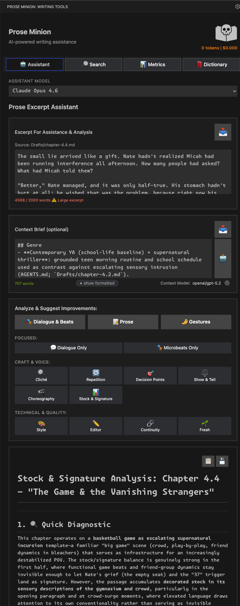
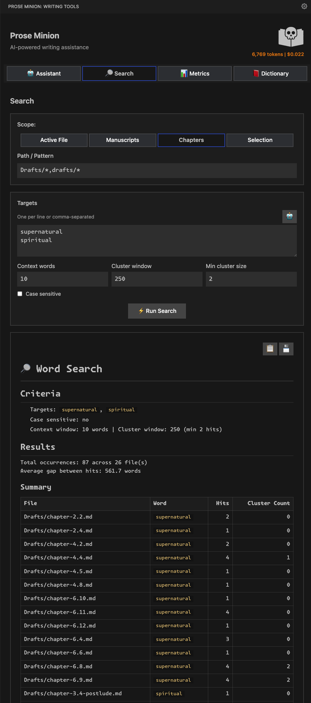
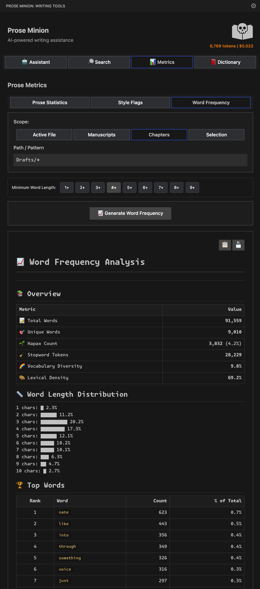
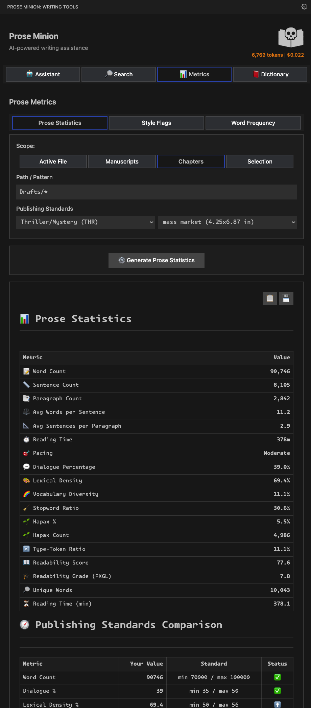
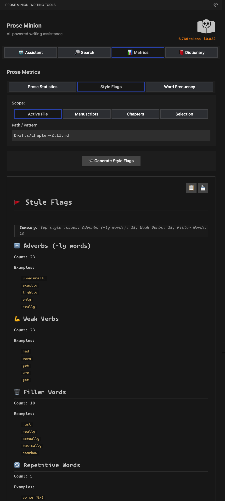
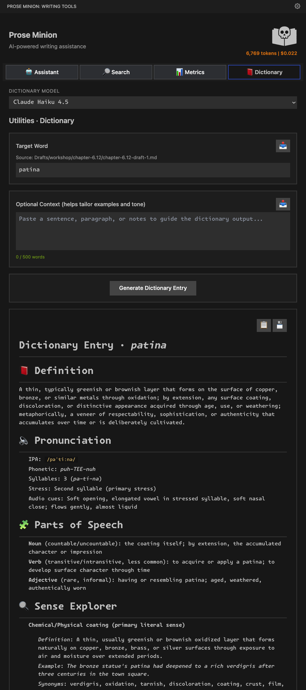

<p align="center">
  
</p>

<p align="center">
  <strong>AI-powered prose analysis and writing assistance for creative writers</strong>
</p>

<p align="center">
  Bring professional-grade prose metrics, AI writing assistance, and contextual analysis directly into your VS Code workflow.
</p>

---
## ✨ Features at a Glance

Prose Minion provides four powerful tool categories in a dedicated sidebar panel:

- **🤖 Assistant** - AI-powered dialogue and prose analysis with contextual suggestions
- **🔍 Search** - Advanced word pattern matching and cluster detection across your manuscript
- **📊 Metrics** - Comprehensive prose statistics, style flags, and word frequency analysis
- **📖 Dictionary** - Fiction-focused word definitions with creative context

> **💡 Tip:** For best experience, **widen your sidebar** to give Prose Minion room to display all its features comfortably.

---

## 🚀 Getting Started

### Installation

1. Install from the [VS Code Marketplace](https://marketplace.visualstudio.com/)
2. Open the Prose Minion panel from the activity bar (book/hexagon icon)
3. Start using **Search** and **Metrics** immediately (no API key needed!)
4. Configure OpenRouter API key for AI features (**Assistant** and **Dictionary**)

### Quick Start

1. **Select text** in your editor or paste into the panel
2. **Choose a tab** - Analysis, Metrics, Search, or Dictionary
3. **Run your analysis** - Metrics and Search work immediately
4. **For AI tools**: Configure OpenRouter API key in Settings (gear icon)

---

## 🔑 OpenRouter API: When You Need It

**Important:** OpenRouter API is **only required for AI-powered tools**:

- ✅ **Metrics** - Works offline, no API key needed
- ✅ **Search** - Works offline, no API key needed
- 🔑 **Assistant** - Requires OpenRouter API key
- 🔑 **Dictionary** - Requires OpenRouter API key

### Setting Up OpenRouter (for AI features)

1. **Get an API Key**:
   - Visit [openrouter.ai](https://openrouter.ai/)
   - Create a pay-as-you-go account
   - Generate an API key

2. **Add Your Key**:
   - Click the **gear icon** in Prose Minion's panel header
   - Paste your key in the "OpenRouter API Key" field
   - Your key is securely stored in your OS keychain
   - Changes save automatically

3. **Choose Your Models** (optional):
   - Select different models for Assistant, Dictionary, and Context workflows
   - Balance cost vs. quality based on your needs
   - Default models work great out of the box

---

## 📖 Tools Overview

### 🤖 Assistant: AI-Powered Writing Suggestions

Get intelligent, context-aware suggestions for your creative writing.



**Key Features:**

- **Prose Excerpt Analysis** - Analyze selected passages (works best with 100-500 words at a time)
- **Dialogue & Action Beats** - Get suggestions for natural dialogue tags and physical beats
- **Context Brief** - Optionally provide genre, themes, and character notes for tailored suggestions
- **Resource Integration** - Click resource pills to load character/location files into context
- **Focused Analysis** - Toggle between "Dialogue Only" and "Microbeats Only" for targeted feedback
- **Quick Diagnostic** - Instant overview of pacing, grounding, and style issues
- **Targeted Suggestions** - Line-by-line improvements with craft rationale

> **⚠️ Important:** The **Excerpt Assistant** is designed for **short passages** (100-500 words). For full chapter analysis, use the **Context Assistant** or **Metrics** tab instead.

**Best Practices:**
- Analyze **excerpts**, not entire chapters (keeps responses focused and affordable)
- Use the **Context Brief** to provide genre, POV, and scene context
- Click **resource pills** to load character/location files for richer context
- For full manuscripts, divide chapters into separate files and use **Context Assistant**

---

### 🔍 Search: Find Patterns Across Your Manuscript

Advanced word search with context windows and cluster detection.



**Key Features:**

- **Scope Options**:
  - **Active File** - Search the currently open editor file
  - **Manuscripts** - Search configured manuscript paths (glob patterns)
  - **Chapters** - Search chapter-specific paths
  - **Selection** - Search only selected text

- **Path/Pattern** - Use glob patterns like `Drafts/**/*.md` to target specific folders
- **Targets** - Enter words/phrases (one per line or comma-separated)
- **Context Words** - Show N words before/after each match (default: 10)
- **Cluster Window** - Group nearby matches within N words (default: 250)
- **Min Cluster Size** - Only report clusters with N+ hits (default: 2)
- **Case Sensitive** - Toggle exact case matching

**Results Show:**
- Total occurrences across all files
- Average gap between hits (for pacing analysis)
- Per-file breakdown with hit counts
- Cluster detection for identifying overuse zones

> **💡 No API key required** - Search works entirely offline

---

### 📊 Metrics: Professional Prose Analysis

Comprehensive statistics and style analysis without any AI or API requirements.

#### Word Frequency Analysis



**Includes:**
- **Overview** - Total words, unique words, hapax count (%), stopword tokens, vocabulary diversity, lexical density
- **Word Length Distribution** - Histogram showing character distribution (1-10+ chars)
- **Top Words** - Ranked list with count and % of total
- **Top Stopwords** - Function words (the, and, of, etc.)
- **Hapax Legomena** - Words appearing exactly once (vocabulary richness indicator)
- **Top Bigrams/Trigrams** - Common 2-word and 3-word phrases
- **Parts of Speech** - POS distribution (uses Wink NLP, works offline)
- **Optional Lemmas** - Root form analysis

**Minimum Word Length Filter:**
- Use tabs (1+, 2+, 3+, 4+, 5+, 6+) to filter out short words
- Great for focusing on content words and reducing noise

---

#### Prose Statistics & Publishing Standards



**Prose Statistics Include:**
- **📝 Word Count** - Total words in selection/file/scope
- **🔤 Sentence Count** - Total sentences
- **📄 Paragraph Count** - Paragraph breakdown
- **⚖️ Avg Words per Sentence** - Pacing indicator
- **📚 Avg Sentences per Paragraph** - Structure analysis
- **⏱️ Reading Time** - Estimated time (configurable WPM)
- **💓 Pacing** - Slow, Moderate, or Fast based on sentence length
- **💬 Dialogue Percentage** - % of text that's dialogue
- **🧬 Lexical Density** - Content word ratio (non-stopwords/total × 100)
- **🌈 Vocabulary Diversity** - Word variety ratio (unique words ÷ total words; higher = more varied vocabulary)
- **🎯 Stopword Ratio** - Function word balance
- **✨ Hapax %** - Unique vocabulary percentage
- **📖 Readability Score** - Flesch Reading Ease
- **🎓 Readability Grade** - Flesch-Kincaid Grade Level

**Publishing Standards Comparison:**
- **Genre Presets** - Romance, Thriller/Mystery, Literary, YA, etc.
- **Trim Size Selection** - Standard book formats (5×8, 6×9, mass market, etc.)
- **Metric Comparison** - See if your stats fall within genre ranges
- **Status Indicators** - ✅ Within range, ⚠️ Outside expected bounds

**Chapter Analysis:**
- When analyzing multiple files, get **per-chapter breakdowns**
- Aggregate statistics across entire manuscript
- Export full reports with chapter details

> **💡 No API key required** - All metrics computed locally

---

#### Style Flags: Identify Writing Patterns



**Automatically Detects:**
- **📘 Adverbs (-ly words)** - Count and examples (unnaturally, exactly, tightly, etc.)
- **💪 Weak Verbs** - Forms of "be" and passive constructions (had, were, get, got, etc.)
- **📦 Filler Words** - Common padding (just, really, actually, basically, somehow, etc.)
- **🔁 Repetitive Words** - Words repeated within close proximity with % frequency
- **📝 Placeholder Words** - Draft markers needing attention
- **🎭 Intensifiers** - Overused emphasis words
- **🤔 Hedges** - Uncertain language patterns

**Summary View:**
- Quick count of top issues (e.g., "Adverbs: 23, Weak Verbs: 23, Filler Words: 10")
- Expandable sections with full examples
- Copy/export functionality

> **💡 No API key required** - Pattern detection runs locally

---

### 📖 Dictionary: Fiction-Focused Word Definitions

Creative writer's dictionary with contextual definitions and usage guidance.



**Features:**
- **Target Word** - Enter any word (auto-fills from selection)
- **Optional Context** - Paste a sentence/paragraph to tailor examples and tone
- **Craft-Aware Definitions** - Explanations focused on narrative usage
- **Pronunciation** - IPA, phonetic spelling, syllables, stress patterns
- **Audio Cues** - Descriptive guidance for character dialogue
- **Parts of Speech** - Full grammatical breakdown with examples
- **Sense Explorer** - Multiple meanings with creative writing examples
- **Synonyms & Related Terms** - Alternative word choices
- **Source Metadata** - Shows where the word came from (file path)

**Best Practices:**
- **Select a word** in your editor - it auto-fills the target field
- **Add context** in the optional field to get tone-specific guidance
- **Model Selection** - Choose different models for cost/quality balance

> **🔑 Requires OpenRouter API key**

---

## 🏗️ Project Structure: Getting the Most from Context Features

The **Assistant** tab's context features work best with a well-organized project structure.

### Recommended Structure

```
MyNovel/
├── Manuscripts/
│   ├── chapter-1.md      (polished/edited versions)
│   ├── chapter-2.md
│   ├── chapter-3.md
│   └── ...
├── Drafts/
│   ├── chapter-1.md      (working drafts)
│   ├── chapter-2.md
│   ├── chapter-3.md
│   └── ...
├── Characters/
│   ├── protagonist.md
│   ├── antagonist.md
│   └── supporting-characters.md
├── Locations/
│   ├── castle-blackwood.md
│   ├── riverside-town.md
│   └── key-places.md
├── Themes/
│   ├── redemption-arc.md
│   └── power-dynamics.md
├── Things/
│   ├── magic-system.md
│   ├── important-artifacts.md
│   └── technology.md
├── ProjectBrief/
│   ├── synopsis.md
│   ├── story-bible.md
│   └── series-overview.md
└── Notes/
    ├── research.md
    ├── plot-outline.md
    └── worldbuilding.md
```

### Why This Matters

1. **Context Assistant Integration**:
   - Configure paths in Settings (e.g., `Characters/**/*.md`)
   - Referenced files appear as **clickable resource pills** in the UI
   - Click pills to load content into context for richer AI suggestions

2. **One Chapter Per File**:
   - ✅ **Do**: Divide your manuscript into separate chapter files
   - ❌ **Don't**: Keep your entire novel in one massive file
   - **Benefit**: Use Context Assistant without hitting token limits
   - **Benefit**: Analyze specific chapters with Metrics/Search scopes

3. **Glob Pattern Support**:
   - Use `Drafts/**/*.md` to recursively match all markdown files in Drafts
   - Use `Characters/*/*.md` for one-level subdirectories
   - Use `Chapters/chapter-*.md` for specific naming patterns

4. **Excerpt Assistant vs Context Assistant**:
   - **Excerpt Assistant**: Best for 100-500 word passages
   - **Context Assistant**: Can handle full chapters when files are reasonably sized
   - **Tip**: Don't try to analyze 100,000-word manuscripts in one go—divide and conquer!

### Configuring Paths

1. Click the **gear icon** in the panel header
2. Navigate to the **Context Paths** section
3. Set glob patterns for:
   - **Manuscript** - Polished/edited chapter files ready for publication
   - **Chapters** - Alternative chapter organization or work-in-progress chapters
   - **Characters** - Character profiles, bios, and development notes
   - **Locations** - Profiles for places & locations that occur in the novel
   - **Themes** - Thematic elements, motifs, and narrative threads
   - **Things** - Magic systems, technology, artifacts, or significant objects
   - **Project Brief** - Synopsis, story bible, series overview, pitch documents
   - **General** - Research, outlines, worldbuilding notes, misc. reference material

4. The extension will discover files matching these patterns
5. When analyzing text, relevant resources appear as **clickable pills**
6. Click any pill to quickly open that used resource.

---

## ⚙️ Settings: Complete Control

Click the **gear icon** in the Prose Minion header for comprehensive settings:

### General Settings
- **OpenRouter API Key** - Securely stored in OS keychain
- **Max Tokens** - Response length limit (default: 10,000)
- **Token Usage Widget** - Toggle header display

### Model Selection
- **Assistant Model** - For prose and dialogue analysis
- **Dictionary Model** - For word definitions
- **Context Model** - For context-aware generation
- Each scope can use a different model to balance cost/quality

### Context Paths

- **Manuscript** - Polished/edited chapter files ready for publication
- **Chapters** - Alternative chapter organization or work-in-progress chapters
- **Characters** - Character profiles, bios, and development notes
- **Locations** - Profiles for places & locations that occur in the novel
- **Themes** - Thematic elements, motifs, and narrative threads
- **Things** - Magic systems, technology, artifacts, or significant objects
- **Project Brief** - Synopsis, story bible, series overview, pitch documents
- **General** - Research, outlines, worldbuilding notes, misc. reference material
- **Visual Examples** - Learn glob syntax with inline help

### Publishing Standards
- **Genre** - Romance, Thriller, Literary, YA, etc.
- **Trim Size** - Book format (5×8, 6×9, mass market, etc.)
- Used in Prose Statistics comparisons

### Word Frequency
- **Minimum Word Length** - Filter short words (1-9+ characters)
- **Show Lemmas** - Toggle root form analysis

### Search
- **Context Words** - Default context window size
- **Cluster Window** - Proximity threshold
- **Min Cluster Size** - Minimum hits for cluster reporting

All settings save automatically and sync with your VSCode preferences.

---

## 🎯 Use Cases

### For Novelists

- ✅ Track chapter-by-chapter metrics across your manuscript
- ✅ Compare prose statistics against genre standards
- ✅ Identify overused words and repetitive patterns
- ✅ Get contextual writing suggestions with character/setting awareness
- ✅ Analyze dialogue distribution and pacing

### For Short Story Writers

- ✅ Analyze pacing and structure
- ✅ Refine dialogue with AI assistance
- ✅ Check vocabulary variety (hapax, TTR)
- ✅ Ensure consistent tone and style

### For Editors and Critique Partners

- ✅ Generate objective prose metrics
- ✅ Identify style patterns and potential issues
- ✅ Compare work against publishing benchmarks
- ✅ Provide data-driven feedback

---

## 🛠️ Technical Details

### Architecture

Built with **Clean Architecture** principles:
- Separation of concerns across layers
- Domain-driven design
- Message-based communication
- Extensible tool system

### Privacy & Security

- **Secure API Key Storage** - Keys stored in OS keychain (Keychain Access, Credential Manager, libsecret) via VSCode SecretStorage
- **Local-First Processing** - Metrics and Search run entirely offline
- **API Calls** - Only Assistant and Dictionary use OpenRouter (you control model and privacy settings)
- **No Logging** - Your writing stays in your workspace
- **No Training** - Configure OpenRouter models to opt-out of training data

### Requirements

- VS Code 1.75.0 or higher
- Node.js 18+ (for development only)
- OpenRouter API account (only for Assistant and Dictionary features)

---

## 📖 Documentation

- **[Developer Guide](docs/DEVELOPER_GUIDE.md)** - Setup, architecture, and development workflow
- **[Architecture](docs/ARCHITECTURE.md)** - System design and principles
- **[Configuration](docs/CONFIGURATION.md)** - Complete settings reference
- **[Tools Reference](docs/TOOLS.md)** - Detailed tool documentation
- **[Prose Stats](docs/PROSE_STATS.md)** - Metrics algorithms and legend

---

## 🔄 Recent Updates

### Latest Features

- **Secure API Key Storage** - OS-level encryption via VSCode SecretStorage (automatic migration)
- **Context Resource Paths** - Configure project structure via Settings overlay
- **Clickable Resource Pills** - Open referenced files directly from UI
- **Word Length Filters** - Tab-based filtering (1+, 2+, 3+, etc.)
- **Context Window Safety** - Silent trimming with color-coded feedback
- **Publishing Standards** - Genre presets with trim size selection
- **Extended Metrics** - Lexical density, hapax analysis, readability scores

### Recent Improvements

- Scoped model selection per tool role (assistant/dictionary/context)
- Verbalized sampling for creative, diverse AI suggestions
- Chapter aggregation for multi-file manuscripts
- Enhanced copy/save with optional chapter details
- Persistent dictionary inputs with source metadata
- Settings overlay with comprehensive inline help

See [CHANGELOG.md](CHANGELOG.md) for complete version history.

---

## 💡 Tips & Best Practices

### Sidebar Width
- **Widen your sidebar** - Prose Minion has a lot of UI elements; give it room to breathe
- Drag the sidebar edge to ~400-600px for optimal layout

### Using the Excerpt Assistant
- ✅ **Best for**: 100-500 word passages
- ❌ **Avoid**: Entire chapters (use Context Assistant or Metrics instead)
- 💡 **Tip**: Select a paragraph or two in your editor for focused analysis

### Project Organization
- ✅ **One chapter per file** - Easier to manage and analyze
- ✅ **Use descriptive filenames** - `chapter-1-opening.md` is clearer than `c1.md`
- ✅ **Organize references** - Keep characters, locations, notes in separate folders
- ✅ **Configure glob patterns** - Let the extension discover your structure

### Cost Management
- 💰 Metrics and Search are **free** (no API calls)
- 💰 Use **cheaper models** for Dictionary (e.g., Claude Haiku)
- 💰 Use **premium models** for Assistant (e.g., Claude Sonnet) when quality matters
- 💰 Monitor token usage in the header widget

### Keyboard Shortcuts
- Select text in your editor and paste into Prose Minion panels
- Use `Cmd+C` / `Ctrl+C` to copy results
- Click resource pills to open files in new editor columns

---

## 🤝 Contributing

We welcome contributions! See the **[Developer Guide](docs/DEVELOPER_GUIDE.md)** for:
- Development setup
- Project architecture
- Testing procedures
- Publishing workflow

---

## 📄 License

**AGPL-3.0 with Commons Clause** - Source-available, no resale, no closed-source derivatives.

This means:
- ✅ Free to use for personal and open-source projects
- ✅ Full source code available
- ✅ Modify and share under the same terms
- ❌ Cannot resell or create proprietary derivatives

See [LICENSE](LICENSE) for complete terms. For commercial licensing inquiries, please open an issue.

---


## 📝 Author's Note: Pairing with Cline for Creative Writing

I originally developed Prose Minion for my own creative writing workflow - specifically to pair with **Cline**: [Web](https://cline.bot) , ([GitHub](https://github.com/cline/cline)), an AI coding assistant for VS Code. While Cline is built for software development, it becomes an incredibly powerful creative writing assistant when customized with `.cline-rules` that focus it on fiction craft instead of code.

**Why this pairing works so well:**

- **Traditional Chat Experience** - Cline provides a familiar chat interface while Prose Minion gives you structured analysis tools
- **Copy Button Integration** - I added the copy buttons throughout Prose Minion so I can easily paste analysis into Cline's chat: metrics, word searches, style flags, and focused excerpt suggestions. While I'm also developing an MCP tool for tighter integration, I've found this manual approach more useful for refining the MCP and guiding Cline on when to call specific analyses
- **File Operations** - Cline can automatically edit your manuscript files and retrieve content when needed
- **OpenRouter Compatible** - Both tools work with OpenRouter, giving you access to the latest models
- **Git Integration** - Set up your writing project as a private GitHub repository to track all changes, maintain version history, and even collaborate with other writers

**My recommendation:** If you're a creative writer using VS Code, try pairing Prose Minion with Cline. Use Prose Minion to analyze your prose (metrics, word frequency, style flags), then copy those insights into Cline to discuss revisions and improvements. It's like having both an analytical editor and a creative writing partner in your sidebar.

I decided to make Prose Minion publicly available in case it helps other writers working with AI tools. Happy writing!

---


## 🙏 Acknowledgments

Built with:
- [OpenRouter](https://openrouter.ai/) - AI model routing
- [VS Code Extension API](https://code.visualstudio.com/api) - Platform
- [React](https://react.dev/) - UI framework
- Open source prose analysis algorithms

Development assisted by:
- [Cline](https://github.com/cline/cline) - AI coding assistant for VS Code
- [Claude Code](https://www.anthropic.com/claude) - AI pair programming
- [OpenAI Codex](https://openai.com/index/openai-codex/) - Code generation and analysis

---

<p align="center">
  <strong>Happy Writing! 📚✨</strong>
</p>

<p align="center">
  <a href="https://marketplace.visualstudio.com/">Install from Marketplace</a> •
  <a href="docs/DEVELOPER_GUIDE.md">Developer Guide</a> •
  <a href="https://github.com/okeylanders/prose-minion-vscode/issues">Report Issue</a>
</p>
