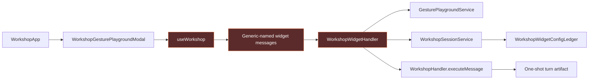
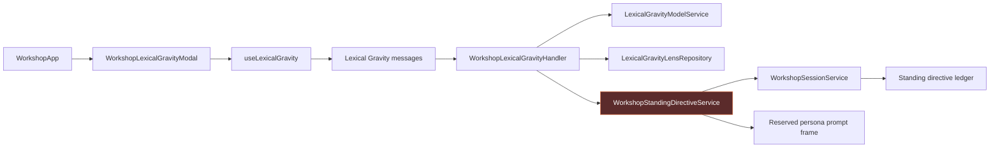
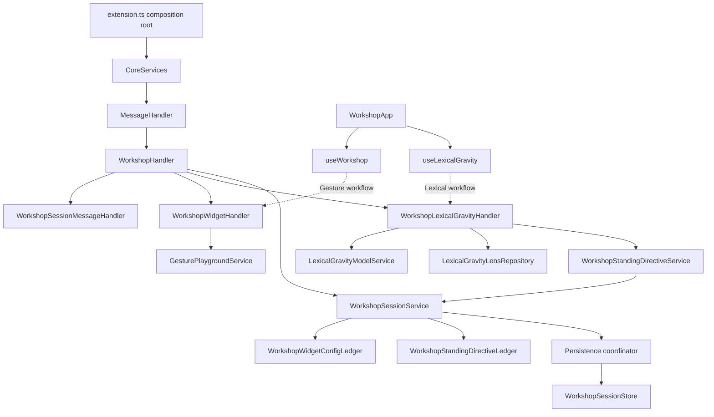
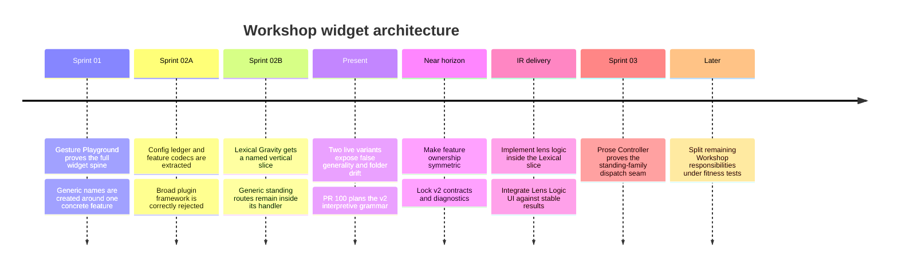
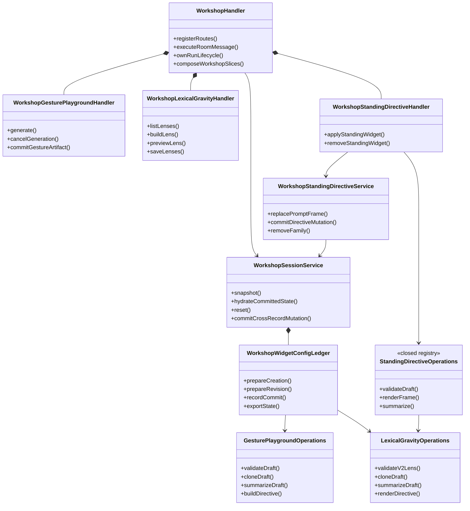
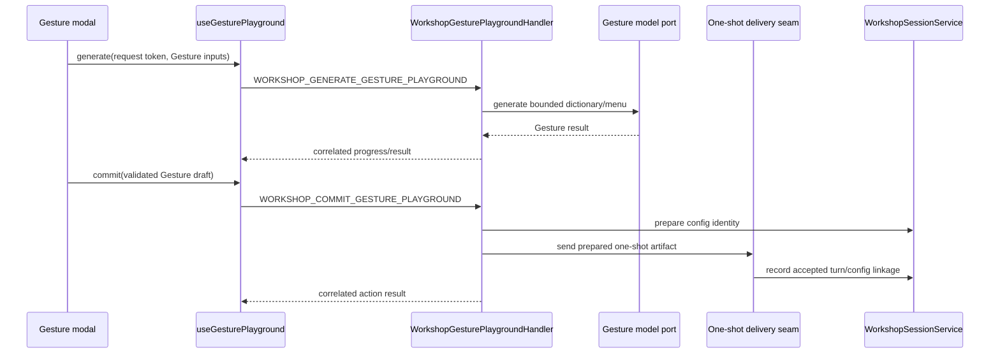
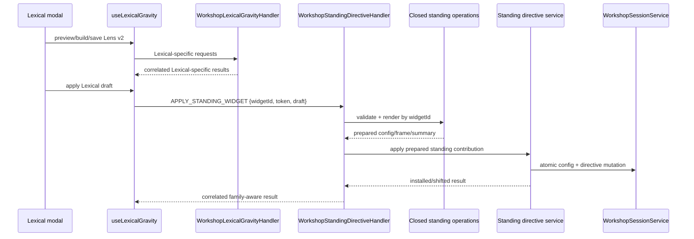

# Workshop Module Semantic Runway and Architecture Horizon

**Date:** 2026-08-03

**Status:** Direction approved by the decision owner; refactor execution gate, pending formal ADR

**Scope:** Workshop Tab across presentation, application, infrastructure, shared contracts, persistence, and tests

**Branch:** `sprint/conversation-widgets-02b-b-lexical-gravity-interpretive-grammar`

**Related PR:** #100, currently a draft with documentation-only changes before this report

**Method:** MR Review v2 semantic-runway method adapted to a module architecture review; four independent scout passes plus current-code, history, ADR, sprint, test, and debt analysis

## Executive conclusion

The concern is valid. The Workshop does not merely contain several large files; it contains a repeatability problem at the Conversation Widget boundary.

Gesture Playground was built as the proving widget. Its feature-specific behavior remained inside names that imply family-wide ownership: `WorkshopWidgetHandler`, `useWorkshop`, `WorkshopWidgetGeneratePayload`, and `WorkshopCommitWidgetPayload`. Lexical Gravity arrived later and received the more honest vertical slice: a named handler, a named hook, feature-specific model/storage collaborators, and a feature folder. The resulting folder asymmetry is historical scar tissue, not a meaningful product distinction.

The reverse leak also exists: Lexical Gravity's specifically named handler owns the family-generic standing apply/remove routes, while the generically named `WorkshopStandingDirectiveService` accepts only Lexical Gravity on apply. A future Prose Controller cannot copy the Lexical Gravity pattern because `MessageRouter` allows only one owner per route.

The recommended correction is not a universal widget plugin framework and not a line-count-driven rewrite. It is a small, closed feature-family architecture:

1. Every live widget owns a named vertical slice for its distinct workflow.
2. Generic Workshop modules own only mechanics shared by every current member of that family.
3. Closed registries dispatch among known feature codecs/renderers where shared lifecycle mechanics require variant knowledge.
4. The Workshop room/session aggregate retains ordering, reset, hydration, and cross-record integrity.
5. Large files are extracted by independently changing responsibility, not by arbitrary size.

The Lexical Gravity v2 interpretive representation remains planned, but feature implementation is frozen until the Workshop refactor reaches its architecture-closure gate. The contract lock and IR work now follow the complete responsibility refactor rather than running in parallel with it.

### Feature freeze and resume rule

As of 2026-08-03, new Workshop feature development is paused. This is not a line-count target or a request to split every large file. The gate exists because the current ownership map is difficult for a maintainer to reconstruct and therefore difficult to review safely.

Feature work resumes only when:

1. presentation, application, shared-contract, persistence, and feature-package responsibilities are explicit and consistently located;
2. Gesture Playground and Lexical Gravity follow the same copyable ownership pattern while retaining honest internal differences;
3. the broad Workshop files have one legible primary responsibility or act as narrow aggregate/composition facades over named collaborators;
4. architecture fitness tests protect route ownership, feature isolation, persistence ownership, and composition direction;
5. current and target responsibility maps agree with the implemented tree; and
6. a reviewer can trace a Workshop action from UI to hook to message to handler to service/persistence without searching unrelated god files.

---

# Part I — Semantic Runway

Evidence labels used below:

- **[Declared]** Explicit in an ADR, sprint, code contract, or tracked decision.
- **[Observed]** Present in current source, tests, history, or PR state.
- **[Inferred]** Best explanation that connects declared intent and observed behavior.
- **[Unknown]** Requires a deliberate decision; evidence does not settle it.
- **[Analogy]** A useful internal or external model, not proof.

## 1. Working Definition & Real Job

**[Declared]** A Conversation Widget is a bounded pre-commit writing interaction that changes no room state until the writer commits, then delivers its influence through a rail selected by lifetime. Gesture Playground is one-shot; Lexical Gravity is standing. The registry owns identity, availability, labels, rail, and grouping (`docs/adr/2026-07-22-conversation-widgets.md:26-64`).

**[Declared]** Sprint 01's real job was to prove the complete widget spine with Gesture Playground and then extract a reusable host (`.todo/epics/epic-conversation-widgets-2026-07-22/sprints/01-widget-host-gesture-playground.md:44-52`).

**[Observed]** The durable config layer now honors that job well: `WorkshopWidgetConfigLedger` owns common lifecycle mechanics, while a closed operations registry delegates feature-specific cloning and summaries.

**[Observed]** The IPC and presentation layers stopped halfway through the same extraction. Gesture Playground still occupies generic names, while Lexical Gravity owns named feature boundaries.

**Working definition:** The Workshop is a room/session application containing multiple independently changing subdomains. Conversation Widgets are one such subdomain family. A widget feature is copyable when a new feature can add its specific workflow without modifying an existing feature's hook, handler, codec, renderer, or model protocol.

## 2. Declared Intent, Observed Behavior & Open Meaning

| Topic | Declared intent | Observed behavior | Open meaning |
|---|---|---|---|
| Widget host | A future one-shot widget adds its surface, validator, registry row, and prompts, touching neither rails nor host (`conversation-widgets.md:462-464`) | The generic generate/commit contracts contain Gesture fields and `WorkshopWidgetHandler` rejects every other id (`workshop.ts:1768-1784`, `1940-1945`; `WorkshopWidgetHandler.ts:140`, `354`) | Whether a shared commit dispatcher is warranted now or only after a second one-shot workflow |
| Presentation ownership | Domain mirroring uses named hooks and handlers | Lexical Gravity has `useLexicalGravity`; Gesture state/actions live in `useWorkshop` (`useWorkshop.ts:528-587`) | Exact minimum interface each independently interactive widget must expose |
| Standing rail | Lexical Gravity and Prose Controller are distinct standing families sharing reserved-frame mechanics | `WorkshopLexicalGravityHandler` owns generic apply/remove routes; generic service apply accepts only Lexical Gravity (`WorkshopLexicalGravityHandler.ts:64-90`; `WorkshopStandingDirectiveService.ts:15-16`) | Whether apply uses one discriminated family route or specific feature routes over a shared transaction service |
| Persistence | Session owns one checkpoint/order/reset boundary; feature codecs own field grammar | This boundary is largely correct | How explicit incompatible-feature diagnostics should travel through session restore |
| Infrastructure | Core remains host-agnostic; services are assembled at the composition root | Both features have specific model services; only Lexical Gravity needs project lens storage | Whether new LG application-owned ports are worth introducing during v2 work |
| Large files | Extract focused collaborators; do not perform deadline-driven god-file surgery | Several files have accumulated independent responsibilities | Which extractions must precede IR and which can remain horizon work |

## 3. Business Story & Rulebook

The writer opens a Workshop room, chooses a feature, experiments locally, inspects the result, and decides whether that influence should enter the conversation. The Workshop owns the room's continuity. The feature owns the meaning and interaction of its experiment. The rail owns how an accepted influence reaches the room.

Rules supported by current decisions and behavior:

1. **[Declared] No pre-commit mutation.** Generate, preview, and build actions do not change room state.
2. **[Declared] Host-owned durable truth.** Session configs, standing directives, and project lens resources are not webview persistence.
3. **[Declared] One session compatibility clock.** Embedded widget configs do not invent independent session schema versions.
4. **[Declared] Exact feature grammar.** Durable drafts are closed discriminated shapes, not `Record<string, unknown>` escape hatches.
5. **[Declared] Lifetime selects rail.** One-shot artifacts enter a turn; standing directives replace a reserved prompt frame and remain killable.
6. **[Declared] Only explicit commit pays the context cost.** Writer experimentation may spend model tokens but must not silently influence room history.
7. **[Declared] LG v2 has no dual runtime.** V1 project resources remain untouched and fail with actionable regeneration guidance (`2026-08-01-lexical-gravity-interpretive-grammar.md:137-145`).
8. **[Inferred] Generic names are promises.** A generic owner may know variant identity and shared lifecycle, but not one feature's nouns, model output grammar, modal workflow, or prose directive vocabulary.

## 4. Narrative Flow: Beginning, Development, Turn & Ending

### Gesture Playground today



Beginning: the modal captures target phrase, instructions, context, character notes, and sources. Development: Gesture generation streams a dictionary and menu. Turn: the writer curates a `WorkshopGestureDraft`. Ending: the handler persists config and sends a one-shot room artifact.

The red nodes are not incorrect behavior. They are ownership mismatches: broad or generic names contain Gesture-specific semantics.

### Lexical Gravity today



Beginning: the modal loads or builds a lens. Development: preview/build/save are token-correlated feature operations. Turn: the writer applies a resolved lens draft. Ending: a standing frame and session config are installed atomically. The red node has the inverse mismatch: its name is generic while apply is Lexical-specific.

### Desired story

The Workshop shell opens a named feature surface. The feature owns all transient workflow state and feature IPC. On acceptance, it hands a validated feature contribution to the appropriate shared rail. The rail owns delivery mechanics and persistence ordering, never feature meaning.

## 5. Codebase Genealogy & Controlling Precedent

1. **[Observed]** Commit `0c59f9e3` created the first widget host spine and `WorkshopWidgetHandler` with Gesture Playground as the sole implementation.
2. **[Observed]** Commit `e4a02721` put Gesture Playground webview behavior into the already broad `useWorkshop` hook.
3. **[Declared]** This was initially reasonable: a reusable boundary should be extracted from a real feature rather than imagined before evidence.
4. **[Observed]** Commit `1cbbe0d4` performed the first earned extraction: generic config ledger plus feature-local codec operations.
5. **[Observed]** Commit `bd441611` introduced Lexical Gravity after that doctrine existed. It received a named handler, named hook, model service, repository, and feature directory, but did not revisit Gesture's earlier handler/hook ownership.
6. **[Observed]** PR #98's review already identified generic files containing Lexical-specific vocabulary, route ownership that blocks Prose Controller, and asymmetric codec placement (`docs/pr-reviews/pr-98-lexical-gravity-standing-rail-2a02727-review-v2.md:528-544`, `695-707`, `741-751`).

The controlling internal precedent is `WorkshopWidgetConfigLedger` plus `WorkshopWidgetConfigOperations`: generic lifecycle, explicit closed dispatch, feature-owned grammar. That is the pattern to reproduce, not a broad open plugin system.

## 6. Structural & Causal Map



Causes of current shape:

- The first widget was both instance and attempted host abstraction.
- Later persistence work extracted only the responsibilities then under direct pressure.
- Lexical Gravity proved a second feature shape but landed under feature deadlines.
- The project correctly avoided a speculative universal plugin framework, but interpreted that caution too broadly and left already-proven feature boundaries asymmetric.
- God-file pressure encourages new behavior to seek the nearest available state/action surface, especially `WorkshopApp`, `useWorkshop`, `WorkshopHandler`, and `workshop.ts`.

## 7. Contracts, Invariants & Negative Space

Contracts worth preserving:

- `extension.ts -> CoreServices -> MessageHandler -> WorkshopHandler` is the single composition path.
- Core remains free of `vscode` imports.
- `WorkshopSessionService` is the only aggregate owner of whole-session checkpoint, reset, and integrity.
- Config IDs and revisions are session-owned and monotonic.
- Hydration prepares all possibly throwing state before install.
- Message routing has exactly one owner per `MessageType`.
- Feature results are correlated to the request that produced them.
- Durable widget configs are exact discriminated unions.

Negative space—the things generic Workshop code should not know:

- Gesture target phrases, dictionaries, menu groups, and character-note semantics.
- Lexical lens logic, axes, roles, dynamics, entailments, or preview schema.
- Feature-specific model output formats.
- Feature-specific modal tabs and draft controls.
- Project repository behavior for features that do not own project resources.
- Feature prose vocabulary or writer-facing display strings outside a feature formatter/registry contribution.

## 8. Forces, Tensions & Design Tradeoffs

### Symmetry versus honest variation

The two features should be symmetric in ownership, not identical in internals. Both deserve a named hook, handler, domain package, contracts, tests, and optional adapters. Only Lexical Gravity needs a project repository. Only Gesture Playground needs a dictionary/menu generation workflow. Forcing identical classes would be architecture theater.

### Generic host versus feature workflows

The family has earned generic identity, config lifecycle, config lookup, rail delivery, action envelopes, and closed dispatch tables. It has not earned a universal `generate`, `preview`, `build`, or `commit` interface. Those verbs hide materially different semantics.

### Aggregate safety versus decomposition

`WorkshopSessionService` should remain the aggregate facade. State machines and ledgers may be extracted behind it, but no feature handler should receive a ledger directly. This preserves ordered persistence and cross-record integrity.

### Refactor coordination versus feature delivery

Feature delivery is paused during the refactor. Multiple refactor workstreams may proceed only with explicit file ownership because moving `useWorkshop`/`WorkshopApp`, handlers, and shared contracts concurrently would create predictable conflicts. Claude Design may contribute presentation refactor work, but Lens Logic feature behavior waits until Phase 7 closes the architecture gate.

### Alpha freedom versus operational kindness

V1 compatibility need not remain, but incompatibility must be explicit. Leaving bytes untouched is data-safe; silently filtering a V1 lens from the catalog is not an actionable user experience.

## 9. Failure, Recovery & Operational Truth

Current and horizon failure paths:

1. **Route collision:** Prose Controller cannot register generic standing routes already owned by `WorkshopLexicalGravityHandler`; duplicate registration throws (`MessageRouter.ts:31-34`).
2. **Cross-feature acknowledgement:** `WorkshopApp` fans generic action results to multiple hooks, while `useLexicalGravity` accepts any `apply-standing` result without checking feature identity (`useLexicalGravity.ts:125-127`).
3. **Wrong no-op identity:** removing an absent future standing family can fall back to `lexical-gravity` in the result.
4. **Invalid type pairing:** `WorkshopCommitWidgetPayload` allows any `WorkshopWidgetId` beside a `WorkshopGestureDraft`; runtime rejection repairs what the type permits.
5. **V1 resource invisibility:** the repository currently logs and filters invalid lens resources, so a future V1 file can disappear instead of producing the ADR's actionable message.
6. **Checkpoint sharp edge:** a v2-only Lexical config validator will make an old LG-bearing checkpoint unreadable. The persistence coordinator protects the file and autosave, but the UI currently has only generic unreadable-checkpoint language.
7. **Hidden failed-commit configs:** failed Gesture commits retain config records but do not give the modal a reusable retry path, allowing unreachable records to accumulate.
8. **Modal race:** token correlation is good today, but generic action results need equivalent correlation before multiple standing features coexist.

Operational requirements for v2:

- Typed incompatibility diagnostics must cross repository -> handler -> UI.
- Project V1 bytes must remain byte-identical after listing and failed load.
- Session restore must remain all-or-nothing and must not overwrite the rescue file.
- Every apply/remove/commit result must include the requested feature identity and correlation token.
- Output-channel logs should name feature, operation, config/directive id, and final disposition without logging prompt-bearing prose.

## 10. Security, Trust & Misuse Surface

This is not primarily a security redesign, but architecture affects trust:

- Project lens paths remain safe only while slug validation is exact and precedes path construction.
- Prompt-bearing excerpt/context remains host-owned and bounded before model spend.
- Feature modules must not bypass the shared prompt budgets or source-reference resolution boundary.
- A generic `unknown` extension bag would weaken persistence and IPC validation; retain closed unions.
- UI explanations for interpretive logic are declarative artifacts, not hidden chain-of-thought.
- Project resources are user-owned. Incompatible files are reported, never rewritten or deleted implicitly.
- Logs must expose lifecycle facts, not source passage content or model prompts.

## 11. Data, Time, Scale & Concurrency Horizon

- Session state is ordered and autosaved; widget config creation and standing replacement participate in that same mutation boundary.
- Generate/preview/build calls are transient and may race with close, regenerate, or a newer request. Request tokens and abort controllers are therefore feature concerns.
- Standing apply is a between-runs operation. It must replace prompt frames before installing session state or roll back coherently.
- Widget catalog growth currently increases root branching, contract size, recommendation prompt cost, and CSS concentration. A registry should grow linearly; central switch statements should not.
- The `workshop.ts` message file is 1,982 lines and already contains multiple independent protocol families. Splitting behind the existing barrel changes no wire behavior and lowers merge pressure.
- `workshop.css` is 6,367 lines and contains shell, session, context, Gesture, and Lexical sections. Feature-owned stylesheets reduce conflict without changing the global token vocabulary.
- V2 lens logic increases persisted lens size and prompt-frame size. Bounds must be shared constants and tested at the exact limit and one over before a model call.

## 12. The Change Genome: Variation & Reproduction

### Stable family genes

Every widget has:

- a canonical `WorkshopWidgetId` and descriptor;
- a lifetime/rail;
- a pre-commit surface;
- a validated feature draft/config;
- a session-owned config identity;
- a display-safe summary;
- an accepted-action result;
- a reopen/edit or clone path appropriate to its lifetime.

### Axes that vary legitimately

| Axis | Gesture Playground | Lexical Gravity | Future consequence |
|---|---|---|---|
| Lifetime | One-shot | Standing | Rail mechanics vary by family |
| Model workflow | Dictionary + menu generate/more | Catalog + build + preview + save | No universal generation interface |
| Durable feature truth | Session config | Session config + project lens resource | Infrastructure is optional by feature |
| Commit semantics | New turn artifact | Apply/shift reserved directive | Distinct feature handlers, shared rail kernels |
| Edit model | Clone and recommit | Edit in place | Config ledger supports both but UI differs |
| Transient state | Generation/progress/menu | Catalog/preview/candidates/save | Named hooks own feature state |
| V2 semantic model | Gesture directions | Interpretive grammar + lexical realization | LG IR remains local |

### Reproduction test

A third feature should be implementable by adding:

- its registry row;
- its feature contracts and codec;
- its named hook and surface;
- its named handler and model/service collaborators;
- one closed-registry entry only where a shared lifecycle needs variant operations;
- its prompts and tests.

It should not edit Gesture Playground or Lexical Gravity implementation files. It may extend a closed union/registry because the application deliberately knows its supported variants.

## 13. Comparative Models & Borrowed Vocabulary

### Internal parallel: domain mirroring

The codebase already pairs `useAnalysis` with `AnalysisHandler`, `useDictionary` with `DictionaryHandler`, and other frontend/backend domains. Nested widget slices extend this convention; they do not replace the Workshop room aggregate pair.

### Internal parallel: widget config operations

`WorkshopWidgetConfigLedger` is a polymorphic mechanism only at the lifecycle boundary. `WorkshopWidgetConfigOperations` is a closed table of feature operations. This is the best model for standing frame preparation and presentation summaries.

### [Analogy] Product-line architecture

Conversation Widgets resemble a small software product line: stable family mechanics plus explicit variation points. The useful vocabulary is **feature slice**, **closed contribution**, **variation axis**, and **fitness function**. The dangerous vocabulary is **plugin** when it implies dynamic discovery or one universal workflow.

### [Analogy] Hexagonal boundary

Feature application logic should depend on narrow model/repository capabilities, while infrastructure implements them. The current composition root is already correct; selective ports may make LG v2 easier to test without requiring a repository-wide rewrite.

## 14. Creative Counterfactuals

### If Gesture Playground had been named specifically on day one

Lexical Gravity would naturally have copied the feature slice, and a generic config ledger/rail would have emerged only where both features demanded it. This is close to the proposed destination.

### If everything were generalized now

A `WorkshopWidgetPlugin<TDraft, TResult, TResource>` would accumulate optional methods for generate, preview, save, apply, clone, and project storage. It would conceal differences rather than model them. Rejected.

### If nothing were changed before Prose Controller

Prose Controller would either invade `WorkshopLexicalGravityHandler`, duplicate generic routes and crash registration, or force a rushed restructure during behavior work. This is the highest-confidence horizon failure.

### If all large files were split immediately

The branch would mix IR behavior, file moves, persistence surgery, UI redesign, and message churn. Reviewability and rollback would collapse. Only widget ownership and contract-lock work belongs on the critical path; other god-file seams can proceed in bounded later phases.

### If frontend and backend evolve without a contract lock

The frontend may model Lens Logic as modal-local display state while the backend returns a different preview artifact. The integration point becomes guesswork. The v2 domain and result shapes must be accepted first.

## 15. Evidence Confidence & Unresolved Questions

### High confidence

- Gesture Playground's generic handler/hook/contracts are feature-specific in current code.
- Lexical Gravity's handler owns routes broader than its name.
- The standing service's apply contract is narrower than its generic name.
- Infrastructure asymmetry is legitimate.
- Multiple Workshop files have independent reasons to change.
- The existing config ledger/operations pattern is a successful internal precedent.
- Prose Controller will force standing route ownership to move.

### Medium confidence

- A dedicated generic standing handler is preferable to feature-specific apply routes. Both can work; the existing generic message types and atomic transaction favor one owner with closed dispatch.
- Narrow application-owned LG model/repository ports would improve isolation, but they are not required to fix the immediate inconsistency.
- Feature-owned CSS files will reduce conflict; exact bundling/file placement should follow the frontend owner's chosen component organization.

### Decisions still needed

1. Does every independently interactive widget require a named hook and handler? **Recommended: yes**, when it owns asynchronous state or a distinct model protocol.
2. Should standing apply remain one discriminated route? **Recommended: yes**, owned by a generic standing handler with closed family operations.
3. Should generic one-shot commit be extracted now? **Recommended: extract the reusable delivery kernel, but keep Gesture-specific IPC until a second one-shot flow proves an identical commit contract.**
4. Does PR #100 remain the long-running implementation branch? **Recommended: no.** Publish the accepted report there, then execute the refactor through bounded sprint branches or independently reviewable commits against a dedicated integration branch.
5. Which presentation-refactor files, if any, are owned by Claude Design? This must be recorded before concurrent refactor work begins; Lens Logic feature behavior remains paused.

## 16. Past → Present → Horizon Synthesis



## 17. Runway Synthesis Brief

The Workshop's conceptual architecture is stronger than its physical layout suggests. The room/session aggregate, composition root, config ledger, standing ledger, prompt-frame discipline, and exact persistence strategy are sound. The inconsistency lives at the feature-family boundary and at several accumulation points.

The smallest durable correction is:

- give Gesture Playground the same named vertical ownership Lexical Gravity already has;
- move standing family routes out of the Lexical-specific handler;
- split feature contracts from the monolithic Workshop message file;
- keep generic modules limited to registry, lifecycle, dispatch, and rail mechanics;
- add architecture witnesses that make the intended reproduction pattern executable;
- then implement LG v2 inside the Lexical slice.

This resolves the user's central rule: there is never only a first. The first feature should teach the family what is shared, then retreat into its own proper name.

---

# Part II — Module Architecture Report

## A. Inventory and change-pressure map

The inspected Workshop surface contains 185 source/test/style files and approximately 66,944 lines. Layer totals include tests and styling where noted:

| Layer | Files | Lines | Interpretation |
|---|---:|---:|---|
| Application | 43 | 17,633 | Main concentration of room/session orchestration and widget ownership |
| Infrastructure | 6 | 2,645 | Small and mostly honest feature-specific adapters |
| Presentation | 49 | 19,276 | Dominated by `workshop.css`, root composition, modal workflows, and broad hook state |
| Shared contracts | 11 | 3,473 | Dominated by one Workshop protocol file |
| Tests | 76 | 23,917 | Strong behavioral coverage, but test organization mirrors current ownership scars |

### Production hotspots

| File | Lines | Pressure | Assessment |
|---|---:|---|---|
| `presentation/webview/workshop.css` | 6,367 | Red | Shell, sessions, context, GP, LG, and later features share one conflict surface |
| `application/handlers/domain/WorkshopHandler.ts` | 2,976 | Red | Run lifecycle, settings, personas, scope/context, files, resources, todos, and child handlers |
| `application/services/workshop/WorkshopSessionService.ts` | 2,894 | Amber/red | Many domain concepts, but still a legitimate aggregate facade; extract ledgers/state machines, not arbitrary chunks |
| `shared/types/messages/workshop.ts` | 1,982 | Red | Multiple independently changing protocol families in one file; false-generic widget contracts live here |
| `presentation/webview/WorkshopApp.tsx` | 1,795 | Red | Shell composition plus session surfaces, modal orchestration, feature branching, and result fan-out |
| `presentation/webview/hooks/domain/useWorkshop.ts` | 1,176 | Red | Room/session state plus named sessions, context, attachments, and GP workflow state |
| `infrastructure/storage/WorkshopSessionStore.ts` | 1,058 | Amber | Large but comparatively cohesive; extract only reader/search/archive policies when they diverge |
| `WorkshopSessionPersistenceCoordinator.ts` | 1,022 | Amber | Cohesive ordered-save/recovery policy; monitor rather than split by size |
| `WorkshopSessionStateV1Shape.ts` | 936 | Amber | Codec grammar; message/domain splitting may reduce imports but its responsibility is coherent |
| `WorkshopGesturePlaygroundModal.tsx` | 873 | Amber | Large, cohesive feature workflow; frontend owner may extract subpanels/controllers |
| `WorkshopWidgetHandler.ts` | 739 | Red | Not the largest file, but the sharpest semantic ownership mismatch |
| `WorkshopLexicalGravityModal.tsx` | 722 | Amber | Large, cohesive workflow; v2 Lens Logic will add pressure |

The priority order is semantic, not numeric. `WorkshopWidgetHandler` is more urgent than several thousand-line persistence files because its name and contract define the copy path for every future widget.

## B. Current consistency matrix

| Responsibility | Gesture Playground | Lexical Gravity | Consistency verdict |
|---|---|---|---|
| Presentation hook | Embedded in `useWorkshop` | `useLexicalGravity` | Inconsistent; GP needs a named hook |
| Modal | Named modal | Named modal | Consistent |
| Application handler | Generic-named `WorkshopWidgetHandler` | Named `WorkshopLexicalGravityHandler` | Inconsistent; GP handler is misnamed |
| Model service | `GesturePlaygroundService` | `LexicalGravityModelService` | Honest variation |
| Project repository | None | `LexicalGravityLensRepository` | Honest variation |
| Config codec location | Directly under `widgets/` | Sibling `lexicalGravity/` directory | Inconsistent package ownership |
| Config lifecycle | Generic ledger + closed operations | Same | Consistent and exemplary |
| Generate/preview contracts | Generic names, Gesture shapes | Lexical-specific names | Inconsistent naming/contracts |
| Standing rail | Not applicable | Generic routes owned by LG handler | Incorrect family ownership |
| Styles | Section in global `workshop.css` | Section in global `workshop.css` | Consistently centralized, but now conflict-prone |
| Hook tests | GP behavior inside `useWorkshop.test.ts` | No focused hook suite found | Inconsistent test ownership |
| Handler tests | Generic-named GP suite | Named LG suite | Inconsistent test ownership |

## C. Target responsibility model

### Ownership rule

> A generic Workshop name may own only behavior that is invariant across every current member of the family. A feature name owns every semantic rule, model protocol, transient workflow, and writer-facing vocabulary that can vary independently.

### Target class/responsibility graphic



### Responsibility ledger

| Owner | Owns | Must not own |
|---|---|---|
| `WorkshopHandler` | Room run/send lifecycle, Workshop slice composition, shared mutation gate | Feature draft validation, model output parsing, modal state, feature rendering |
| `WorkshopSessionService` | Whole-session ordering, reset, hydration, snapshot, cross-record integrity, aggregate facade | Feature field grammar, feature display copy, feature model protocols |
| `WorkshopGesturePlaygroundHandler` | Generate/more/cancel, source resolution for GP, menu protocol, gesture commit preparation | LG lenses, standing-family routing, generic session persistence |
| `WorkshopLexicalGravityHandler` | Catalog/build/preview/save, v2 IR parsing, project diagnostics | Generic standing route registration, Prose Controller semantics |
| `WorkshopStandingDirectiveHandler` | Single ownership of generic apply/remove IPC, correlation, dispatch by closed family | Lens logic, Prose Controller field rules, model calls |
| `WorkshopStandingDirectiveService` | Between-run guard, prompt-frame replacement, atomic session mutation/removal | `family: 'lexical-gravity'` request narrowing |
| Feature hook | Feature transient state, feature requests/results, token/race handling | Room/session durable truth |
| Generic widget presentation host | Catalog/open/reopen identity and common action notification | GP menu state or LG preview state |
| Infrastructure adapter | Provider/filesystem mechanics for one capability | Session aggregate policy or presentation state |

## D. Proposed module layout

This is a destination map, not one giant move commit.

```text
packages/core/src/
├── application/
│   ├── handlers/domain/workshop/
│   │   ├── WorkshopHandler.ts
│   │   ├── WorkshopSessionMessageHandler.ts
│   │   ├── WorkshopScopeContextHandler.ts
│   │   ├── WorkshopStandingDirectiveHandler.ts
│   │   └── widgets/
│   │       ├── gesturePlayground/WorkshopGesturePlaygroundHandler.ts
│   │       └── lexicalGravity/WorkshopLexicalGravityHandler.ts
│   └── services/workshop/
│       ├── session/
│       │   ├── WorkshopSessionService.ts
│       │   └── ...extracted ledgers/state machines as pressure proves them
│       ├── widgets/
│       │   ├── WorkshopWidgetConfigLedger.ts
│       │   ├── WorkshopWidgetConfigOperations.ts
│       │   ├── gesturePlayground/
│       │   │   ├── GesturePlaygroundConfigCodec.ts
│       │   │   └── GesturePlaygroundDirective.ts
│       │   └── lexicalGravity/
│       │       ├── LexicalGravityConfigCodec.ts
│       │       ├── LexicalGravityDirective.ts
│       │       └── LexicalGravityLenses.ts
│       └── directives/
│           ├── WorkshopStandingDirectiveService.ts
│           ├── WorkshopStandingDirectiveLedger.ts
│           ├── WorkshopStandingDirectiveOperations.ts
│           └── WorkshopStandingDirectivePresentation.ts
├── presentation/webview/
│   ├── WorkshopApp.tsx
│   ├── hooks/domain/workshop/
│   │   ├── useWorkshopRoom.ts
│   │   ├── useWorkshopSessions.ts
│   │   ├── useWorkshopWidgetHost.ts
│   │   └── widgets/
│   │       ├── useGesturePlayground.ts
│   │       └── useLexicalGravity.ts
│   └── components/workshop/widgets/
│       ├── gesturePlayground/
│       │   ├── WorkshopGesturePlaygroundModal.tsx
│       │   └── gesturePlayground.css
│       └── lexicalGravity/
│           ├── WorkshopLexicalGravityModal.tsx
│           └── lexicalGravity.css
└── shared/types/messages/workshop/
    ├── index.ts
    ├── session.ts
    ├── context.ts
    ├── participants.ts
    ├── widgets.ts
    ├── gesturePlayground.ts
    ├── lexicalGravity.ts
    └── standingDirectives.ts
```

Folder symmetry applies to feature ownership. It does not require empty files or ceremonial adapters. For example, there should be no Gesture repository merely because Lexical Gravity has one.

## E. Target flows

### Feature-owned one-shot flow



The generic rail does not know what a Gesture Dictionary is. The feature handler does not own whole-session persistence.

### Family-owned standing flow



Prose Controller adds a new operations entry and its own feature handler/hook. It does not modify Lexical Gravity files or register duplicate apply/remove routes.

## F. Large-file extraction horizon

### Refactor gate — feature-family normalization

1. **`WorkshopWidgetHandler` -> `WorkshopGesturePlaygroundHandler`.** Honest rename/extraction; behavior-preserving.
2. **Gesture state/actions -> `useGesturePlayground`.** Frontend-owned; coordinate with Claude Design.
3. **Standing route ownership -> `WorkshopStandingDirectiveHandler`.** Preserve one route owner and prepare for Prose Controller.
4. **Widget service folders -> symmetric feature packages.** Move `lexicalGravity` beneath `widgets`; move Gesture codec beneath `gesturePlayground`.
5. **Workshop message contracts -> domain files behind barrel.** Rename false-generic GP contracts or make exact discriminated pairs.
6. **Feature styles -> feature-owned files.** Presentation-owned and independently reviewable.

### Refactor gate — broad responsibility decomposition

1. Take the existing eight-route `WorkshopScopeContextHandler` pure move from Sprint 02C.
2. Extract `useWorkshopSessions` and a session-surface controller before adding more named-session UI actions.
3. Reduce `WorkshopApp` to shell composition by moving modal controllers and widget launch/reopen dispatch behind hooks/components.
4. Split `WorkshopHandler` by existing route clusters while retaining run/send lifecycle centrally.

### Closure audit — extract only where responsibility evidence supports it

1. `WorkshopSessionService`: scope/shelf state machine, participant roster, turn ledger, todo ledger, and attachment ledger can become internal collaborators one at a time. The aggregate remains the facade.
2. `WorkshopSessionStore`: separate browser/search reader or archive translation only if those policies continue diverging.
3. Persistence coordinator: extract archive/rescue policy only if it becomes independently complex.
4. Feature modals: extract subpanels or controller hooks when v2 UI work demonstrates separate change pressure.

## G. Refactor-first implementation plan

### Phase 0 — Record and protect the architecture

- Accept this report as analysis, then write a focused ADR for Workshop feature-family ownership.
- Add route-owner and feature-boundary architecture witnesses.
- Add characterization tests around current GP commit, LG standing replacement, config identity, and message correlation.
- Record file ownership for any concurrent refactor workstreams.

**Exit:** Existing behavior is pinned and the target seams are accepted.

### Phase 1 — Make names honest without changing behavior

- Rename `WorkshopWidgetHandler` and its tests to Gesture Playground-specific names.
- Move feature services/codecs into symmetric widget subfolders.
- Extract `useGesturePlayground` from `useWorkshop` in the frontend lane.

**Exit:** Both live features expose recognizable vertical slices; no feature behavior changes.

### Phase 2 — Fix shared route and contract ownership

- Introduce `WorkshopStandingDirectiveHandler` as the only apply/remove route owner.
- Split Lexical-specific preparation/rendering from the generic transaction kernel.
- Add exact correlation and family identity to action results.
- Split `workshop.ts` behind a barrel; rename GP-specific generate/result/commit contracts.
- Keep generic config lookup and action envelopes genuinely generic.

**Exit:** A Prose Controller fixture can be registered without editing Lexical Gravity or colliding with `MessageRouter`.

### Phase 3 — Complete presentation responsibility extraction

- Extract `useWorkshopRoom`, `useWorkshopSessions`, `useWorkshopWidgetHost`, and the two feature hooks.
- Reduce `WorkshopApp` to shell composition, route composition, and layout ownership.
- Move session modal control, scope-transition control, and widget open/reopen control behind named presentation collaborators.
- Move widget components and styles into symmetric feature packages.
- Split the global stylesheet by shell/session/context/feature ownership while preserving the token vocabulary and rendered behavior.

**Exit:** A reviewer can follow each presentation workflow through one named hook/controller without reading `WorkshopApp` or `useWorkshop` as a catch-all.

### Phase 4 — Complete application-handler responsibility extraction

- Take the planned `WorkshopScopeContextHandler` route cluster.
- Extract coherent file/resource intake, participant/persona, settings, todo, and other route clusters where they have independent dependencies and tests.
- Keep run/send lifecycle and Workshop-internal collaborator composition in `WorkshopHandler` until a narrower orchestration seam is proved.
- Mirror handler tests under the new responsibility packages.
- Ensure handlers depend on narrow application capabilities rather than reaching across feature implementations.

**Exit:** `WorkshopHandler` is a legible room/run orchestrator and Workshop slice composition owner, not the default home for unrelated IPC behavior.

### Phase 5 — Complete session-aggregate responsibility extraction

- Retain `WorkshopSessionService` as the aggregate facade and sole whole-session mutation boundary.
- Extract named internal collaborators for independently changing concepts such as scope/shelf, attachments, participants, turns, todos, widget configs, and standing directives where the current method/state clusters prove the seam.
- Keep reset, checkpoint ordering, hydration install, and cross-record integrity coordinated by the aggregate.
- Reassess store, search/index, and persistence-coordinator boundaries by responsibility; split only policies with independent change pressure.
- Preserve all-or-nothing hydration and ordered autosave semantics through characterization tests.

**Exit:** The session facade presents a coherent aggregate API while state machines and ledgers have named homes and focused tests.

### Phase 6 — Normalize contracts, tests, and architecture documentation

- Complete the Workshop message-package split behind the existing barrel.
- Make feature-specific message names and payloads exact; retain generic unions only at deliberate family boundaries.
- Reorganize tests to mirror the implemented presentation/application/service packages.
- Add executable import, route-owner, feature-isolation, and composition witnesses.
- Update `docs/ARCHITECTURE.md`, the Workshop feature-family ADR, active debt, and epic/sprint plans to match the implemented tree.
- Archive or rewrite debt entries whose proposed seams have been completed or superseded.

**Exit:** The source tree, tests, and documentation tell the same responsibility story.

### Phase 7 — Architecture closure and feature-resume gate

- Walk every Workshop action end to end and publish the final responsibility map.
- Confirm each generic module owns only proven family behavior and each feature module owns its semantic rules.
- Confirm the destination tree or record any intentional deviations with reasons.
- Run focused and full tests, all TypeScript projects, lint, build/bundle verification, architecture witnesses, and `git diff --check`.
- Perform a fresh maintainability review using filename-first responsibility inventories and representative UI-to-persistence traces.
- Explicitly mark the feature freeze lifted only when the implemented architecture is understandable without reconstructing hidden ownership from large files.

**Exit:** The refactor is complete and Workshop feature development may resume. No arbitrary LOC ceiling is required; the acceptance criterion is coherent responsibility ownership, copyability, traceability, and protected boundaries.

### Phase 8 — Lock and implement Lexical Gravity v2

- Finalize the v2 domain/message contract only after the refactored boundaries are stable.
- Implement built-ins, codec, clone, summary, directive rendering, model parser, prompts, repository diagnostics, handler behavior, and exact boundary tests inside the Lexical Gravity slice.
- Keep transient semantic positioning outside persistence and preserve actionable V1 incompatibility behavior.

**Exit:** Backend produces and persists strict v2 lenses and returns inspectable preview artifacts without changing generic Workshop architecture.

### Phase 9 — Integrate the Lens Logic presentation

- Consume the locked v2 types/results through the refactored Lexical Gravity hook and component package.
- Do not reconstruct semantic interpretation in the webview.
- Preserve fixed modal header/footer and scrolling center behavior.

**Exit:** The writer can inspect lens premise, attention, roles/axes/dynamic, entailment, and rewritten passage before apply.

## H. Post-refactor feature handoff contract

### Shared lock step

After Phase 7 lifts the feature freeze, these files or concepts must be agreed before Lexical Gravity backend/frontend implementation diverges:

- v2 lens and lens-logic types;
- preview result schema;
- incompatibility diagnostic schema;
- action-result correlation/family identity;
- exact bounds exposed to both codec and UI.

### Backend-owned paths after the refactor gate

- `application/services/workshop/widgets/lexicalGravity/**`
- `infrastructure/api/services/widgets/LexicalGravityModelService.ts`
- `infrastructure/storage/LexicalGravityLensRepository.ts`
- Lexical system prompts
- handler/service/codec/repository tests
- standing handler/service changes that do not touch presentation

### Frontend-owned paths after the refactor gate

- `WorkshopLexicalGravityModal.tsx` and its extracted subcomponents
- Lexical/Workshop feature styles
- `useLexicalGravity.ts` and any presentation controller selected by Claude Design
- `WorkshopApp.tsx` wiring required to mount the redesigned surface

### Coordination rule

Do not independently edit the same shared message file. Land the contract lock first, then consume it from both feature lanes. During the current refactor, any Claude Design contribution is limited to explicitly assigned presentation-architecture paths; Lens Logic behavior does not begin before Phase 7 closes.

## I. Architecture fitness functions

Add executable witnesses for these rules:

1. **One route, one owner.** Every Workshop `MessageType` registers exactly once; generic standing routes are not registered by feature handlers.
2. **Specific contracts stay specific.** Generic message modules may not import `WorkshopGestureDraft` or `WorkshopLexicalGravityLensLogic` except in an explicit discriminated family registry.
3. **Feature isolation.** Gesture modules do not import Lexical modules and vice versa.
4. **Approved generic dispatch only.** Root generic widget/directive packages may import feature operations only through named closed registry modules.
5. **Presentation ownership.** `useWorkshop` contains no Gesture- or Lexical-specific async state/actions after extraction.
6. **Third-feature proof.** A minimal standing feature can extend the family without editing `WorkshopLexicalGravityHandler` or `useLexicalGravity`.
7. **Action correlation.** A result for one widget/request cannot settle another feature or stale modal instance.
8. **V1 resource handling.** Incompatible project lenses produce typed actionable diagnostics and remain byte-identical.
9. **V1 checkpoint handling.** Restore is all-or-nothing, rescue remains available, autosave does not overwrite unreadable current state, and the UI receives an exact reason.
10. **V2 persistence boundary.** Resolved lens logic persists; passage-specific semantic positions and previews do not.
11. **Exact prompt budgets.** Test the maximum and maximum-plus-one before model spend for lens logic, preview source/result, and standing frames.
12. **Retry integrity.** Repeated failed Gesture commits produce either no durable config or one reusable config, never multiple unreachable records.
13. **Core boundary.** No `vscode` imports enter core; all adapters remain composed from `extension.ts`.

## J. Recommended ADR decision

Create an ADR that extends the Conversation Widgets and Widget State Ownership decisions with this rule:

> Workshop widget features are explicit vertical slices. Shared Workshop widget code owns only closed catalog identity, session config lifecycle, rail transaction mechanics, and explicit variant dispatch. Feature-specific generation, preview, persistence resources, validation, rendering, transient UI state, and writer-facing vocabulary remain in named feature modules. A new feature may extend closed unions and registries but must not modify another feature's implementation.

The ADR should explicitly supersede the interpretation that `WorkshopWidgetHandler` is already a reusable widget host. It should preserve the earlier rejection of a dynamic/open plugin framework while recording that two live variants now justify symmetric packages and narrow closed registries.

## K. Immediate execution decision for PR #100

Commit and publish this accepted architecture report on PR #100 while the branch remains documentation-only. Then stop feature implementation and execute the Workshop refactor as a dedicated program of bounded, independently reviewable commits or stacked sprint branches:

1. report + formal feature-family ADR and refactor epic;
2. Phase 0 fitness witnesses;
3. Phase 1 package and feature-slice normalization;
4. Phase 2 shared route/contract ownership;
5. Phases 3-5 presentation, handler, and aggregate decomposition;
6. Phase 6 contract/test/document normalization;
7. Phase 7 architecture closure and explicit feature-resume decision;
8. only then, Lexical Gravity v2 and subsequent Conversation Widget features.

Do not begin by adding `logic` fields to the current broad surfaces. The complete Workshop responsibility refactor now blocks IR and all subsequent Workshop feature development by explicit decision-owner direction.

---

## Evidence index

Primary current-code anchors:

- `packages/core/src/presentation/webview/WorkshopApp.tsx:183-184`, `268-310`, `376-393`, `543-579`, `1609-1660`
- `packages/core/src/presentation/webview/hooks/domain/useWorkshop.ts:318-348`, `528-590`
- `packages/core/src/presentation/webview/hooks/domain/useLexicalGravity.ts:21-59`, `73-134`
- `packages/core/src/application/handlers/domain/WorkshopHandler.ts:252-371`, `458-472`
- `packages/core/src/application/handlers/domain/WorkshopWidgetHandler.ts:41-140`, `346-439`, `631`
- `packages/core/src/application/handlers/domain/WorkshopLexicalGravityHandler.ts:44-90`, `248-313`
- `packages/core/src/application/services/workshop/directives/WorkshopStandingDirectiveService.ts:15-95`
- `packages/core/src/application/services/workshop/widgets/WorkshopWidgetConfigLedger.ts`
- `packages/core/src/application/services/workshop/widgets/WorkshopWidgetConfigOperations.ts`
- `packages/core/src/shared/types/messages/workshop.ts:35-60`, `1757-1982`
- `packages/core/src/presentation/webview/workshop.css:5536-5549`, `6111-6128`

Primary declared-intent anchors:

- `docs/adr/2026-07-22-conversation-widgets.md:216-226`, `386-400`, `448-464`
- `docs/adr/2026-07-31-workshop-widget-state-ownership.md:10-33`, `37-92`, `125-129`
- `docs/adr/2026-08-01-lexical-gravity-interpretive-grammar.md:10-40`, `113-145`
- `.todo/epics/epic-conversation-widgets-2026-07-22/sprints/01-widget-host-gesture-playground.md:44-59`
- `.todo/epics/epic-conversation-widgets-2026-07-22/sprints/02b-b-lexical-gravity-interpretive-grammar.md:10-35`, `120-146`
- `.todo/tech-debt/2026-07-25-workshop-god-files.md`
- `.todo/tech-debt/2026-07-24-workshop-session-responsibility-follow-ups.md`
- `.todo/epics/epic-conversation-widgets-2026-07-22/sprints/02c-workshop-scope-context-ipc-extraction.md`
