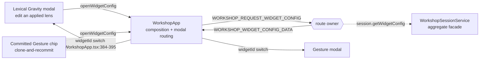
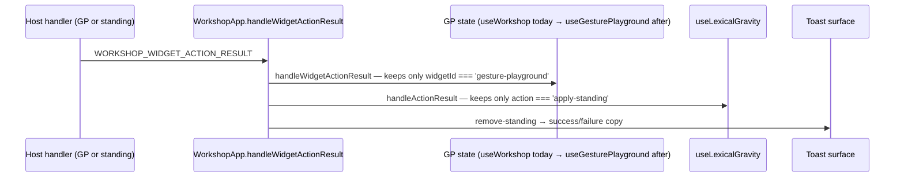

# Architecture Change Runway — Sprint 01: Feature-Slice Normalization

**Subject:** [`.todo/epics/epic-workshop-architecture-refactor-2026-08-03/sprints/01-feature-slice-normalization.md`](../../.todo/epics/epic-workshop-architecture-refactor-2026-08-03/sprints/01-feature-slice-normalization.md)

**Branch:** `sprint/workshop-architecture-refactor-01-feature-slices` → `epic/workshop-architecture-refactor` (Sprint 00 merged as PR #101)

**Altitude:** One sprint. The epic arc, the ADR's shape, and the Phase-0 witness design are settled in the [epic runway](2026-08-03-workshop-refactor-epic-runway.md) and the [semantic runway](2026-08-03-workshop-module-semantic-runway.md) and are not re-derived here. This runway asks only: *what does P1 actually move, and where does the pure-move promise strain?*

**Audience / task:** Decision owner (Okey) opening the P1 gate; implementer sequencing the moves.

**Date:** 2026-08-03 · **Status:** Approved for implementation · **Implementation gate:** **OPEN**

---

## Band 0 — Change Card (30 seconds)

### Thesis

Because Gesture Playground's ownership is spelled in family-generic names (`WorkshopWidgetHandler`, `useWorkshop`'s `widget*` cluster) while Lexical Gravity already has a named slice, change **the physical placement and names of both features' handler, hook, service, component, and test homes**, while preserving **every message name, route registration count, runtime flow, persisted shape, and rendered pixel**, so that **P2 has two symmetric slices to move family-generic routes *out of*, rather than one named feature and one anonymous one.**

### Architecture moves

| # | Move | Before | After | Confidence |
|---|---|---|---|---|
| 1 | Handler rename + package | `handlers/domain/WorkshopWidgetHandler.ts` (739) | `handlers/domain/workshop/widgets/gesturePlayground/WorkshopGesturePlaygroundHandler.ts` | STRONG |
| 2 | Sibling handler move | `handlers/domain/WorkshopLexicalGravityHandler.ts` (347) | `…/workshop/widgets/lexicalGravity/` | STRONG |
| 3 | Service packages | `services/workshop/widgets/GesturePlaygroundConfigCodec.ts` loose beside generics; `services/workshop/lexicalGravity/` a sibling of `widgets/` | `services/workshop/widgets/{gesturePlayground,lexicalGravity}/` | STRONG |
| 4 | Hook extraction | GP workflow inside `useWorkshop.ts` (1,176) | `hooks/domain/workshop/widgets/useGesturePlayground.ts` + `useLexicalGravity.ts` moved | MODERATE — see F2 |
| 5 | Component packages | both modals flat in `components/workshop/` | `components/workshop/widgets/<feature>/` (CSS follows in P3) | STRONG |

### Scope and highest risks

| Affected boundary | Why affected | Highest failure mode | Risk |
|---|---|---|---|
| Widget IPC route ownership | The renamed file registers 4 routes, one of which is family-generic | A generic route acquires a feature-named owner — a false *specific* replacing a false generic (**F1**) | **HIGH** |
| Webview message fan-out | `WORKSHOP_WIDGET_ACTION_RESULT` has two subscribers, composed in `WorkshopApp` | Hook extraction silently drops the Lexical subscriber; no test covers the composition point (**F2**) | **HIGH** |
| Phase-0 witnesses | Every witness path string names a file P1 moves | Witness edited in the same commit as the move it guards; a wrong string passes vacuously | MODERATE |
| Session/persistence | — | None. No aggregate, codec semantic, or stored shape is touched | LOW |
| Composition root | — | None. Both handlers are constructed *inside* `WorkshopHandler`, not `extension.ts` | LOW |

### Human decisions required

| Decision | Options | Recommendation | Needed by |
|---|---|---|---|
| **D1** Who owns `WORKSHOP_REQUEST_WIDGET_CONFIG` after the rename? | (a) new `WorkshopWidgetHostHandler` in P1; (b) leave on the Gesture-named file and add a P2 exception; (c) pull the fix into P2 wholesale | **(a)** — it is a pure move of one route method, keeps the exception ledger shrinking-only, and gives P2 a generic owner to build on | Slice 2 |
| **D2** What happens to `useWorkshop.widgetConfigs` (exposed, zero consumers)? | (a) delete under alpha rules; (b) park in `useWorkshop` pending P3's widget host | **(a)** — it is session-derived family data with no reader; migrating it into a Gesture hook would be a fresh mislabel | Slice 3 |
| **D3** Do hook members keep `widget*` vocabulary in P1? | (a) keep, rename in P2 with the message renames; (b) rename now | **(a)** — one `WorkshopApp` churn instead of two, and P1 stays reviewable as placement-only | Slice 3 |

### Gate

**State:** `OPEN` · **Blockers:** none. Okey accepted D1–D3 as option (a) on
2026-08-03, and slice 0 installs F2's characterization seam before the hook
extraction.

*Note:* the epic runway made P1 conditional on its **F1** (blind isolation witness). That is **resolved** on this branch — `boundaries.test.ts:108-111` pins the pre-rename Gesture paths and `:272` asserts the scanned set is non-empty; `:288-295` names missing exception files instead of throwing `ENOENT`. The epic's P1 condition is satisfied.

---

## Band 1 — Architecture Delta Map (~2 minutes)

### 1.1 Affected subtree — before

*`wc -l` on the branch head.*

```text
packages/core/src/
├── application/handlers/domain/
│   ├── WorkshopHandler.ts                       2,976  constructs + composes both feature handlers
│   ├── WorkshopSessionMessageHandler.ts           309  the sibling-handler mold P1 copies
│   ├── WorkshopWidgetHandler.ts                   739  ⚠ IS Gesture Playground; also owns the
│   │                                                     family-generic config-lookup route
│   └── WorkshopLexicalGravityHandler.ts           347
├── application/services/workshop/
│   ├── WorkshopPromptBuilder.ts                   669  ⚠ holds buildGestureDirective (:649)
│   ├── widgets/
│   │   ├── WorkshopWidgetConfigLedger.ts          188  [=] generic, exemplary
│   │   ├── WorkshopWidgetConfigOperations.ts      108  [=] closed dispatch over BOTH features
│   │   └── GesturePlaygroundConfigCodec.ts        286  ⚠ feature codec loose among generics
│   └── lexicalGravity/                                 ⚠ peer of widgets/, not a child
│       ├── LexicalGravityConfigCodec.ts           308
│       ├── LexicalGravityDirective.ts             110
│       └── LexicalGravityLenses.ts                157
├── presentation/webview/
│   ├── WorkshopApp.tsx                          1,795  composes both features' modals + fan-out
│   ├── hooks/domain/
│   │   ├── useWorkshop.ts                       1,176  ⚠ 96 `widget` hits; GP workflow lives here
│   │   └── useLexicalGravity.ts                   159  ✅ the shape P1 mirrors
│   ├── components/workshop/
│   │   ├── WorkshopGesturePlaygroundModal.tsx      873
│   │   ├── WorkshopLexicalGravityModal.tsx         722
│   │   └── schematic/…                                 [=] proven component-subpackage precedent
│   └── workshop.css                                    92 gesture/lexical lines (P3 owns the split)
└── __tests__/… WorkshopWidgetHandler.test.ts 670 · WorkshopLexicalGravityHandler.test.ts 279
             useWorkshop.test.ts 1,211 · GP modal 667 · LG modal 470
```

### 1.2 Target subtree

Legend: `[+]` add · `[~]` modify · `[>]` move/rename · `[-]` remove · `[=]` unchanged boundary

```text
packages/core/src/
├── application/handlers/domain/
│   ├── WorkshopHandler.ts                       [~] import paths + one new collaborator only
│   ├── WorkshopSessionMessageHandler.ts         [=] stays flat until P4 (documented deviation)
│   └── workshop/widgets/
│       ├── WorkshopWidgetHostHandler.ts         [+] D1 — owns WORKSHOP_REQUEST_WIDGET_CONFIG
│       ├── gesturePlayground/
│       │   └── WorkshopGesturePlaygroundHandler.ts  [>] was WorkshopWidgetHandler
│       └── lexicalGravity/
│           └── WorkshopLexicalGravityHandler.ts     [>] unchanged body (standing routes leave in P2)
├── application/services/workshop/
│   ├── WorkshopPromptBuilder.ts                 [~] loses buildGestureDirective
│   └── widgets/
│       ├── WorkshopWidgetConfigLedger.ts        [=]
│       ├── WorkshopWidgetConfigOperations.ts    [~] two import paths
│       ├── gesturePlayground/
│       │   ├── GesturePlaygroundConfigCodec.ts  [>]
│       │   └── GesturePlaygroundDirective.ts    [>] extracted from WorkshopPromptBuilder:649
│       └── lexicalGravity/{ConfigCodec,Directive,Lenses}  [>] 24 import statements / 15 files
├── presentation/webview/
│   ├── WorkshopApp.tsx                          [~] rewire to two feature hooks; fan-out preserved
│   ├── hooks/domain/
│   │   ├── useWorkshop.ts                       [~] −GP workflow, −widgetConfigs (D2)
│   │   └── workshop/widgets/{useGesturePlayground.ts [+], useLexicalGravity.ts [>]}
│   ├── components/workshop/widgets/{gesturePlayground,lexicalGravity}/…Modal.tsx  [>]
│   └── workshop.css                             [=] P3
└── __tests__/  mirrors every path above; useWorkshop.test.ts splits its GP describes out
```

### 1.3 Responsibility ledger — what changes hands

| Module | Before | After | Ownership delta | Pattern / smell |
|---|---|---|---|---|
| `WorkshopWidgetHandler` → `…GesturePlaygroundHandler` | Gesture generate/cancel/commit **+ generic config lookup** | Gesture generate/cancel/commit | **Loses** the family-generic config route (D1) | *False generic* removed; without D1 replaced by a *false specific* |
| `WorkshopWidgetHostHandler` (new) | — | `WORKSHOP_REQUEST_WIDGET_CONFIG` → `session.getWidgetConfig` → `WORKSHOP_WIDGET_CONFIG_DATA` | Gains the generic lookup ADR §3 says a generic module may own | Thin *feature-agnostic route owner*; no state, no model calls |
| `WorkshopLexicalGravityHandler` | LG catalog/preview/build/save **+ 2 standing routes** | identical body, new path | **Nothing** in P1. The standing routes stay until P2 — deliberately | Recorded P2 exception, unchanged |
| `useWorkshop` | Room + sessions + context + GP async workflow | Room + sessions + context | Loses 6 GP state fields, 10 GP actions, the `'gesture-playground'` filter (`useWorkshop.ts:581`) | Still broad; P3 owns the rest |
| `useGesturePlayground` (new) | — | GP menu/progress/config-fetch/commit-ack workflow | Gains everything above; mirrors `useLexicalGravity`'s tripartite shape | *Feature hook*, symmetric to its sibling |
| `WorkshopPromptBuilder` | Room prompt assembly **+ one Gesture directive builder** | Room prompt assembly | Loses `buildGestureDirective` (barrel export name preserved) | Feature envy removed |
| `WorkshopHandler` | — | — | **No responsibility change** — import paths and one added collaborator | Composition owner, untouched |

### 1.4 Structural view — where the false generic actually bites

**Question:** after the rename, which module answers a *Lexical Gravity* request?
**Scope:** widget-config lookup only. **Legend:** solid = message; dashed = in-process call.



**Reading it:** the `{{route owner}}` node is the whole decision. Today it is `WorkshopWidgetHandler` — wrong name, right generality. Rename it without carving the route out and the node becomes `WorkshopGesturePlaygroundHandler`, i.e. *Lexical Gravity's edit path is served by Gesture Playground's handler.* That is not a cosmetic complaint: it is exactly the cross-feature coupling the isolation witness exists to prevent, and the witness cannot see it because it scans **imports**, not **routes**.

### 1.5 Representative runtime flow — the acknowledgement fan-out

**Scenario:** the host finishes a widget action and posts one `WORKSHOP_WIDGET_ACTION_RESULT`.



**Notable:** one message, three consumers, two *different* discrimination keys (`widgetId` vs `action`), composed in `WorkshopApp.tsx:268-291`. P1 moves one of the three arms into a new hook. Nothing tests the composition — `WorkshopApp` has no test file. (The key asymmetry itself is P2's fitness function #9; P1 must only carry it across unchanged.)

### 1.6 Blast-radius summary

| Dimension | Direct | Indirect | Main failure | Witness | Risk |
|---|---|---|---|---|---|
| Structure | ~12 production files move; ~30 import statements rewrite | `WorkshopHandler` imports; core barrel `index.ts:102` | Broken path → compile error | `tsc` + jest | LOW |
| Runtime | Hook extraction rewires one fan-out arm | Lexical apply/remove acknowledgement, toasts | Silent dead arm | **none today** — F2 | **HIGH** |
| Contract (wire) | None — no message name, payload, or source string changes | — | — | route-owner ledger | LOW |
| Route ownership | 4 registrations change file; 1 should change *owner* | P2's starting position | False-specific ownership (F1) | ledger, if updated honestly | **HIGH** |
| Data / persistence | None | — | — | aggregate + ledger-bypass guards | LOW |
| Verification | 5 test files move/split; 3 witness path sets update | — | Witness edited to match a wrong move | Slice-0 characterization first | MODERATE |
| Coordination | Touches paused Conversation Widgets branches' whole surface | 02B-B, 03, 04 rebases | Merge pain later | epic-level, accepted | MODERATE |

---

## Band 2 — Reviewer Packet (~10 minutes)

### 2.1 The real job of this sprint

P1 buys one thing: **two features that look alike from the file tree**. It is the cheapest phase to review and the easiest to over-scope, because every file it touches is also touched by P2, P3, or P4. Its discipline is negative — no message renamed, no route re-owned *except where the rename would otherwise create a new lie*, no state consolidated, no CSS moved. Its output is a shape P2 can act on: a generic standing-route owner cannot be extracted from "the Lexical handler" until "the Gesture handler" is a thing that exists by name.

### 2.2 Declared vs observed

| Topic | [Declared] | [Observed] | [Inferred] / [Unknown] |
|---|---|---|---|
| "Pure moves, renames, and wiring only" | Sprint constraint 1 | True for 11 of 12 file moves | The config-route carve-out (D1) is a *route* move, not a behavior change — still pure, but it is a responsibility decision, so ADR §9 says record it (this document) |
| "`useWorkshop` no longer owns Gesture async workflow" | Sprint exit criterion 2 | `useWorkshop.ts:336-347, 528-592, 862-866` — 6 state fields, 10 callbacks, all named `widget*` | Only **one** literal is Gesture-specific (`:581`). The rest is generically *named* but singly *used* — extraction is right, the vocabulary question is D3 |
| "Move Gesture and Lexical codecs/directives/lens modules" | Sprint scope 3 | Lexical has `Directive` + `Lenses`; Gesture's directive is `WorkshopPromptBuilder:649`, exported from the barrel at `index.ts:102` | [Inferred] the sprint intends `GesturePlaygroundDirective.ts` per the destination tree — it is not named in the sprint doc (F5) |
| "Both features have named test homes" | Sprint exit criterion 1 | `useWorkshop.test.ts` (1,211) holds GP describes at `:430` and `:1137` | Test file *splits*, not just moves — worth naming so review expects a diff shaped like a split |
| Generic modules may own "generic config lookup" | ADR §3 | `handleRequestConfig` (`WorkshopWidgetHandler.ts:330-344`) is widget-agnostic | The destination tree has **no** generic handler for it — a genuine gap in the target architecture (F1) |

### 2.3 Contracts and invariants

| Contract / invariant | Current owner | Target owner | Change? | Failure if broken | Witness |
|---|---|---|---|---|---|
| `WORKSHOP_WIDGET_GENERATE` / `CANCEL_WIDGET_GENERATE_REQUEST` / `WORKSHOP_COMMIT_WIDGET` | `WorkshopWidgetHandler` | `WorkshopGesturePlaygroundHandler` | path only | Gesture generate/commit dead | route-owner ledger (cancel route absent — F3) |
| `WORKSHOP_REQUEST_WIDGET_CONFIG` → `…CONFIG_DATA` | `WorkshopWidgetHandler` | **D1** | ownership | LG edit *and* GP clone doors both break | ledger, once the owner is honest |
| 4 Lexical routes + 2 standing routes | `WorkshopLexicalGravityHandler` | same file, new path | path only | LG catalog/preview dead | route-owner ledger |
| One registration per message type | `MessageRouter.register` throws (`MessageRouter.ts:31-35`) | unchanged | no | duplicate route | runtime throw + ledger |
| `WORKSHOP_WIDGET_ACTION_RESULT` reaches GP state, LG state, and the toast | `WorkshopApp.tsx:268-291` | unchanged composition, one arm re-sourced | no | acknowledgement never settles; sheet hangs "committing" | **none** — F2 |
| No handler touches an internal ledger | `boundaries.test.ts:278-285` | unchanged (recursive scan) | no | aggregate bypass | live witness |
| `packages/core` free of `vscode` | `boundaries.test.ts:188` | unchanged | no | monorepo split broken | live witness |
| Core barrel export names | `index.ts:98-102` | unchanged names, one changed internal path | no | adapter build breaks | `tsc` on `apps/vscode-extension` |

### 2.4 Negative space

| Generic owner | May know | Must not know | Next-feature edit surface | Verdict |
|---|---|---|---|---|
| `WorkshopWidgetConfigOperations` | that gesture and lexical drafts exist; how to clone/summarize via their codecs | field grammar of either draft | one `case` per new widget | **Healthy** — the epic's exemplar; only import paths change |
| `WorkshopWidgetHostHandler` (D1) | config id syntax `wc-N`, aggregate lookup, the generic data message | which feature asked, what a draft contains | none | **Healthy if built**; without it the role has no home |
| `WorkshopGesturePlaygroundHandler` | Gesture menus, dictionaries, commit staging | anything Lexical | — | **Healthy only with D1** — otherwise it knows "how any widget's config is fetched", which is family knowledge under a feature name |
| `useWorkshop` (post-P1) | room, sessions, context, standing-directive summaries | GP workflow state | — | **Improved, not clean** — P3 finishes it |

### 2.5 Quality scenarios

| Type | Stimulus | Artifact | Expected response | Response measure |
|---|---|---|---|---|
| Change | P2 adds `WorkshopStandingDirectiveHandler` | handler package | New file beside two feature packages; no Gesture edits | Zero diff lines in `gesturePlayground/**` |
| Failure | Hook extraction drops the Lexical fan-out arm | `WorkshopApp` | Test fails | **Must be added** (F2) |
| Failure | A route silently changes file during the move | route ledger | Test fails naming the message type | `boundaries.test.ts:233-253` — after owner strings update |
| Failure | Cancel route's owner moves unnoticed | route ledger | Test fails | **Absent today** (F3) |
| Runtime | Writer clones a committed Gesture chip while a run is active | GP handler + host | Unchanged: clone opens, commit gated by `isRoomRunActive` | `WorkshopWidgetHandler.test.ts` (moves with owner) |
| Runtime | Writer reopens an applied Lexical lens | config-lookup route | Config returns, LG modal opens in `edit` | `WorkshopApp.tsx:384-395`; no automated coverage — manual check |
| Change | P1 completes | exception ledger | Both P1 entries gone, P2 entries intact | `boundaries.test.ts:287-310` |

**Sensitivity point:** D1. It decides whether P1 leaves the tree with zero false owners or trades one lie for another.
**Tradeoff point:** D3. Honest hook vocabulary now vs. a single `WorkshopApp` churn in P2. Placement-only reviewability wins.
**Risk theme:** every P1 witness update lives in the same commit as the move it guards — the failure mode is *vacuous green*, not red.

### 2.6 Alternatives

| Alternative | Shape | Benefits | Costs / risks | Verdict |
|---|---|---|---|---|
| **Minimal patch** | Rename the handler; leave hooks/components/services flat | Tiny diff; no App churn | Exit criterion 2 unmet; the P1 exception at `useWorkshop.ts:581` survives; P3 inherits a hook that still owns feature workflow | **Rejected** |
| **Recommended** | All five moves + D1's carve-out + a slice-0 fan-out test | Two symmetric slices; no false owners; P2 starts from a generic seat | ~12 file moves, ~30 import rewrites, one test-file split; large-but-mechanical diff | **Retained** |
| **More generalized** | Fold P2's message renames into P1 | One rebase for the paused branches instead of two | Mixes contract change with pure move — direct ADR §9 violation; destroys the "no expectation rewritten" review property | **Rejected** |

### 2.7 Principle and quality tensions

| Principle | Status | Support | Tension | Consequence | Witness |
|---|---|---|---|---|---|
| Naming truthfulness | `TENSION` → `STRONG` with D1 | Handler/hook/component names become feature-honest | Message names stay `WORKSHOP_WIDGET_*` until P2, so the hook's members read generic (D3) | A reviewer may read P1 as a half-rename — say so in the sprint doc | route ledger + this document |
| Responsibility / cohesion | `ACCEPTABLE` | `useWorkshop` sheds a whole workflow; `WorkshopPromptBuilder` sheds feature envy | `useWorkshop` is still room+sessions+context (P3) | Expected; P1 is not the fix | sprint exit criteria |
| Dependency direction | `STRONG` | No new inward dependency; `WorkshopHandler` stays the internal composition owner; `extension.ts` untouched | — | — | `boundaries.test.ts` construction guard |
| Change isolation | `TENSION` | Feature packages become copyable | Without D1, Lexical's edit path depends on a Gesture-named file — invisible to the import-based isolation witness | P2 inherits a coupling it has to undo twice | none for route-level coupling |
| Testability | `TENSION` | Tests move with owners; per-feature test homes appear | The one behavior P1 rewires (fan-out) is the one with no test | Regression would surface only in manual use | **F2 fix** |

### 2.8 Ranked findings

| ID | Sev | Finding | Evidence | Smallest fix | Blocks |
|---|---|---|---|---|---|
| **F1** | **HIGH** | The rename gives a family-generic route a feature-specific owner, and the epic's destination tree has no generic handler-side home for it. | `handleRequestConfig` is widget-agnostic (`WorkshopWidgetHandler.ts:330-344`); `WorkshopApp.tsx:384-395` fans its response to *both* modals; `WorkshopApp.tsx:546-556` routes Lexical's "edit applied lens" door through it; ADR §3 lists "generic config lookup" as a permitted generic responsibility; semantic runway §D lists no generic widget handler. | D1 option (a): move `handleRequestConfig` + its two message types into `handlers/domain/workshop/widgets/WorkshopWidgetHostHandler.ts`, constructed by `WorkshopHandler` on the same closure mold; update the route ledger; record as an ADR §7 documented deviation. | slice 2 |
| **F2** | **HIGH** | The one behavior P1 rewires — a three-way fan-out of a single message — has no test at its composition point. | `WorkshopApp.tsx:268-291` dispatches `WORKSHOP_WIDGET_ACTION_RESULT` to `workshop.handleWidgetActionResult`, `lexicalGravity.handleActionResult`, and the toast; there is no `WorkshopApp` test file; the only coverage is `useWorkshop.test.ts:430`, which *moves with the arm being extracted*. Dropping the Lexical arm leaves apply/remove acknowledgement and its toast silently dead. | Slice 0: a characterization test asserting all three consumers observe one action-result message (or a route-map assertion over `buildAppMessageRoutes`), landed **before** the extraction commit. | slice 3 |
| **F3** | MEDIUM | `CANCEL_WIDGET_GENERATE_REQUEST` is an inbound widget route with no entry in the Phase-0 route-owner ledger, and P1 moves its owning file. | Registered at `WorkshopWidgetHandler.ts:104`; enum at `base.ts:176`; absent from `WORKSHOP_WIDGET_ROUTE_OWNERS` (`boundaries.test.ts:65-103`). Corrects the epic runway's "all nine request-bearing types appear" — that count covered `base.ts:159-175` only. | Add the entry in the same commit that moves the file. | nothing |
| **F4** | MEDIUM | `useWorkshop.widgetConfigs` is exposed with zero presentation consumers; an unexamined extraction would carry family data into a Gesture-named hook. | Declared `:141`, set `:820` from the session snapshot, returned `:1050`; repo-wide grep finds no `workshop.widgetConfigs` reader in any component. | D2 option (a): delete it in the extraction commit (alpha rules) and let P3's widget host re-add a consumer-backed version if needed. | slice 3 |
| **F5** | MEDIUM | The sprint scope says "move … directives" but never names the Gesture directive, which is not a module — it is one exported function inside a 669-line shared prompt builder, re-exported from the core barrel. | `WorkshopPromptBuilder.ts:649`; barrel `index.ts:102`; consumed at `WorkshopWidgetHandler.ts:395`; 3 tests in `WorkshopPromptBuilder.test.ts:26-58`. | Name `GesturePlaygroundDirective.ts` in the sprint scope; keep the barrel export *name* identical; split its 3 tests with it. | nothing |
| **F6** | LOW–MED | After extraction the Gesture hook's public members still read `widget*` — a feature hook speaking family vocabulary. | `useWorkshop.ts:280-289, 1050-1057`; P2 owns the message renames (sprint 02 scope, line 21). | D3 option (a) + one line in the sprint doc stating the vocabulary lands in P2, so the survivors are not read as an incomplete rename. | nothing |
| **F7** | LOW | Modals move into feature packages while their 92 lines of CSS stay in `workshop.css` until P3. | `workshop.css` gesture/lexical selector lines: 92; `WorkshopApp.tsx:123-124` already imports a second stylesheet from `components/workshop/schematic/schematic.css`. | Record the deferral in the sprint doc, and cite `schematic/` as the proven precedent P3 follows. | nothing |
| **F8** | LOW | If D1 is deferred, P1 must *add* an entry to a ledger the ADR says "may only shrink". | `boundaries.test.ts:126-128` comment; `WORKSHOP_LEGACY_OWNERSHIP_EXCEPTIONS`. | Choose D1(a) and the conflict disappears; otherwise amend the rule's wording explicitly rather than growing the list silently. | slice 2 |

**What survived attack.** I tried to break these and could not:

- **The composition root is genuinely untouched.** Both feature handlers are constructed inside `WorkshopHandler` (`:339`, `:353`) over closure seams, and the only references to `WorkshopWidgetHandler` outside tests are `WorkshopHandler.ts:168, 275, 339` plus a doc comment in `shared/constants/workshopWidgets.ts:4`. `extension.ts` and `MessageHandler` need no edit. Constraint 3 holds without effort.
- **The core barrel is nearly inert here.** `index.ts` exports only `GesturePlaygroundService`, `LexicalGravityModelService`, `LexicalGravityLensRepository` (all infrastructure, all staying) plus `buildGestureDirective`. `apps/vscode-extension/src/extension.ts:49-51, 260-272` consumes only the first three. No adapter-visible contract changes.
- **The isolation witness survives P1 with a net simplification.** `/GesturePlayground/i` matches both `useGesturePlayground.ts` and `WorkshopGesturePlaygroundHandler.ts`, so `GESTURE_OWNERS_UNDER_MIGRATION` can simply be deleted at the end of P1 — and the `>= 5` assertion (`:272`) still holds exactly: codec, service, modal, handler, hook.
- **The epic runway's P1 condition is already met.** Its F1 and F2 landed in `44dc1ea` (`boundaries.test.ts:108-111, 272, 288-295`). The gate this runway opens is a *new* one, not the old one reasserted.
- **Recursive witnesses need no rewrite.** Route-owner and ledger-bypass guards walk `handlers/domain` recursively (`:56`, `:234`, `:280`), so the `domain/workshop/**` relocation costs owner strings only.
- **Baseline is green.** `npx jest packages/core/src/__tests__/architecture/boundaries.test.ts` → 8/8, 2.06s on this branch.
- **The `widgets/` generics stay generic.** `WorkshopWidgetConfigOperations` dispatches over both features by discriminated union (`:39-107`) and only changes import paths. P1 does not erode the epic's exemplar.

### 2.9 Implementation slices

| # | Purpose | Files | Behavior change | Verification | Depends on | Rollback seam |
|---|---|---|---|---|---|---|
| 0 | Characterize the fan-out; close the ledger gap | new App-level/route-map test; `boundaries.test.ts` (+cancel route) | none (test-only) | new test red-then-green against current code; full architecture suite | — | revert one test commit |
| 1 | Service packages | gesture codec + `GesturePlaygroundDirective` extraction; `lexicalGravity/` → `widgets/lexicalGravity/`; ~28 import sites; `index.ts:102`; move/split service tests | none | focused Workshop service suites + `tsc` all projects | 0 | independent commit |
| 2 | Handler packages | `handlers/domain/workshop/widgets/**`; rename; D1 carve-out; `WorkshopHandler` wiring; route-ledger + exception paths; move handler tests | none (route *ownership* moves within the same registration count) | `WorkshopHandler.test.ts` route assertions; architecture suite | 1, **D1** | independent commit |
| 3 | Presentation hooks | `useGesturePlayground` extraction; `useLexicalGravity` move; `WorkshopApp` rewire; `widgetConfigs` decision; split `useWorkshop.test.ts` | none | slice-0 test + both hook suites | 0, 2, **D2/D3** | independent commit |
| 4 | Components | both modals → `components/workshop/widgets/<feature>/`; test moves; CSS stays | none | modal test suites | 3 | independent commit |
| 5 | Close-out | delete `GESTURE_OWNERS_UNDER_MIGRATION`; P1 exceptions empty; sprint doc records F5–F7 deferrals | none | full architecture suite + full jest | 1–4 | — |

### 2.10 Unknowns that can reverse a decision

| Unknown | Why it matters | How to resolve | Impact |
|---|---|---|---|
| Does P2 intend `WORKSHOP_REQUEST_WIDGET_CONFIG` to stay family-generic, or to split per feature? | If it splits per feature, D1's host handler is throwaway work | Sprint 02 scope line 11 says "family-generic standing **and widget-host** contracts live under generic owners" → generic. Treated as **[Declared]**, low residual risk | Would change D1 to option (c) |
| Is any Lexical Gravity flow other than "edit applied lens" served by the Gesture-named handler? | More coupling than F1 documents | Read every `openWidgetConfig` call site during slice 2 | Widens F1, does not reverse it |
| Does `WorkshopApp` admit a testable seam, or must the fan-out test target `buildAppMessageRoutes`? | Determines slice-0 cost | 15-minute spike before slice 0 | Changes the *form* of F2's fix, not its necessity |

---

## Band 3 — Self-review and Re-plan Verdict

### 3.1 Contradictions found

| Artifact pair | Contradiction | Resolution |
|---|---|---|
| Sprint scope ↔ destination tree | Sprint says "move Gesture directives"; no Gesture directive module exists | F5 — name the extraction explicitly |
| Destination tree ↔ ADR §3 | ADR grants generic modules "generic config lookup"; the tree gives that route no generic owner | F1 / D1 — add `WorkshopWidgetHostHandler` as a documented §7 deviation |
| Exception-ledger rule ↔ deferring F1 | "May only shrink" vs. needing a new P2 entry | F8 — D1(a) removes the conflict |
| Epic runway ↔ route ledger | "All nine request-bearing types appear" | F3 — cancel route is a tenth, uncovered |

### 3.2 Prospective failure review

| Failure story | Cause | Missing evidence | Prevention |
|---|---|---|---|
| Six weeks on, applying a lens shows no confirmation and the rail looks stale | P1's hook extraction dropped `lexicalGravity.handleActionResult` from the App fan-out; suite stayed green | No test at the composition point | F2's slice-0 test |
| P2 tries to extract the standing handler and finds Lexical's edit path importing a Gesture package | D1 deferred; the false specific hardened across two phases | Isolation witness scans imports, not routes | D1(a) now |
| A route quietly changes owner during P1 and the ledger is edited to match | Witness and move in one commit | No independent check | Review the ledger diff as a *claim*, not a fixup; slice 0 lands the cancel entry first |
| P3 rebuilds `widgetConfigs` from scratch, unaware it existed | It was carried into the Gesture hook and forgotten there | — | D2(a): delete with a one-line note in the sprint doc |

### 3.3 Reproduction test (measured at end of P1, not end of epic)

**Next variant:** Prose Controller. **Adds:** feature handler package, feature hook, codec+directive package, modal, tests. **Must edit:** `WorkshopWidgetConfigOperations` (one case), the standing routes still on the Lexical handler (**until P2**), message enums (**until P2**). **Existing feature files edited:** Lexical's handler — *expected*; that is precisely what P2 removes. **Verdict:** P1 delivers the copyable *shape*; it does not yet deliver zero-edit extension, and should not claim to.

### 3.4 Re-plan verdict: **REFINED**

**Initial plan:** execute the sprint's five bullet moves as written — pure renames and relocations, tests following owners, witness paths updated in the same commits.

**Final plan:** the same five moves, plus (1) a slice-0 characterization test for the action-result fan-out before any hook extraction, (2) a generic `WorkshopWidgetHostHandler` carved out during the handler rename so the family-generic config route does not acquire a feature owner, (3) the cancel route added to the ledger, (4) `widgetConfigs` deleted rather than migrated, and (5) three deferrals (hook vocabulary, CSS, gesture-directive naming) written into the sprint doc so P1's survivors are not misread as incompleteness.

**What changed and why:** the sprint's own constraint — "pure moves … runtime behavior unchanged" — is true of eleven of twelve moves. The twelfth, the handler rename, is where a *name* carries *ownership*, and one of the four routes on that file is family-generic in both implementation and use. Reading `handleRequestConfig` against `WorkshopApp`'s modal routing turned "rename the file" into "decide who owns the family's config lookup."

**Evidence that caused the change:** `WorkshopWidgetHandler.ts:330-344` (widget-agnostic body) read together with `WorkshopApp.tsx:384-395` and `:546-556` (Lexical's edit door goes through it), against ADR §3's list of permitted generic responsibilities.

**Remaining uncertainty:** whether `WorkshopApp` offers a clean seam for F2's test or whether it must be asserted at the route-map level. Either satisfies the finding; the spike is 15 minutes.

### 3.5 Implementation gate

| Condition | Pass/fail | Evidence |
|---|---|---|
| No unaccepted critical unknown | **PASS** | Three unknowns, all MODERATE or resolved by declared P2 scope |
| Contract consumers / migration / tests identified | **PASS** | No wire contract changes; route ownership table in §2.3 |
| Persistence failure and rescue defined | **N/A — PASS** | No aggregate, codec semantic, or stored shape touched |
| Runtime flows owned and testable | **PASS** | Slice 0 characterizes the action-result fan-out before extraction |
| Negative-space and reproduction tests pass | **PASS** | D1(a) gives config lookup a generic owner (§2.4) |
| Tree / responsibilities / contracts / slices agree | **PASS** after the §3.1 resolutions are folded into the sprint doc |
| Human decisions assigned | **PASS** | Okey accepted option (a) for D1, D2, and D3 on 2026-08-03 |

**Final gate:** `OPEN` — D1–D3 are accepted and F2's witness precedes the hook extraction.

---

## Band 4 — Evidence Appendix

| Claim | Anchor |
|---|---|
| Handler is Gesture Playground | `WorkshopWidgetHandler.ts:19` (`GesturePlaygroundService`), `:140`, `:354` (`widgetId !== 'gesture-playground'` rejections) |
| …and owns a generic route | `WorkshopWidgetHandler.ts:107-110`, `:330-344` |
| Both feature handlers constructed in `WorkshopHandler` | `WorkshopHandler.ts:339`, `:353`; runtime bundle type `WorkshopWidgetRuntime` at `:252` |
| GP workflow inside `useWorkshop` | `:141-153` (state), `:280-289` (actions), `:528-592` (callbacks), `:581` (the P1 exception marker), `:862-866` |
| `useLexicalGravity` is the shape to mirror | 159 lines, tripartite interfaces at `:21-57` |
| Fan-out composition | `WorkshopApp.tsx:268-291`; router map `:296-315` |
| Lexical edit door via the generic route | `WorkshopApp.tsx:539-542`, `:546-556`, `:384-395` |
| `widgetConfigs` unread | declared `useWorkshop.ts:141`, set `:820`, returned `:1050`; no component reader repo-wide |
| Lexical service package fan-in | 24 import statements across 15 files (9 production) |
| Gesture codec fan-in | 4 files |
| Gesture directive | `WorkshopPromptBuilder.ts:649`; barrel `index.ts:102`; call site `WorkshopWidgetHandler.ts:395` |
| Witness recursion | `boundaries.test.ts:56`, `:234`, `:280` |
| Epic F1/F2 resolved | `boundaries.test.ts:108-111`, `:272`, `:288-295` (commit `44dc1ea`) |
| Baseline green | `npx jest …/boundaries.test.ts` → 8 passed, 2.06s |
| Component subpackage precedent | `components/workshop/schematic/` + `WorkshopApp.tsx:124` |

**Not inspected at this altitude:** `WorkshopGesturePlaygroundModal`'s internal state machine (P3), `workshop.css` selector-by-selector attribution (P3), `workshop.ts` message-family boundaries (P6).

---

## Band 5 — Reader Terms Appendix

### Technical

| Term | Local meaning in this change | Why the reader needs it | Status |
|---|---|---|---|
| **Route owner** | The single file whose body calls `router.register`/`registerMutation` for a message type. Ownership is *declared* in `boundaries.test.ts`'s ledger, not inferred. | F1, F3, and the whole gate are about ownership, not about imports | current |
| **Widget host** | The family-generic seat that answers "give me widget config `wc-N`" without knowing which feature asked. Exists today only *inside* a Gesture-specific file. | The sprint's sharpest decision (D1) is whether to give this role a name | **absent** — proposed as `WorkshopWidgetHostHandler` |
| **False specific** | The mirror of the epic's *false generic*: a feature-named module owning family-wide behavior. P1 can create one by renaming without carving. | Names the failure mode a "pure rename" can introduce | proposed (as a risk) |
| **Fan-out** | One inbound message dispatched to several independent consumers at a composition point (`WorkshopApp`), each filtering on a different key. | F2's failure mode is a dropped arm, not a thrown error | current |
| **Characterization test** | A test written to pin *current* behavior before a move, expected to pass unchanged after. Slice 0's whole job. | Distinguishes slice 0 from "adding coverage" | proposed |
| **Migration exception** | A phase-assigned entry in `WORKSHOP_LEGACY_OWNERSHIP_EXCEPTIONS` recording known false ownership. The list may only shrink; P7 requires it empty. | F8 is a conflict with that rule | current |
| **Pure move** | ADR §9: relocation and rewiring with no behavior change, never sharing a commit with a behavior change. *Divergent locally:* moving a **route registration between files** is still a pure move by this definition (registration count and runtime dispatch are unchanged), but it is a **responsibility decision** — so ADR §9 requires it be recorded before proceeding. That is what D1 is. | A reviewer who reads "pure move" as "no thinking required" will wave through the one decision in the sprint | current, divergent |
| **Tripartite hook interface** | Repo convention: every domain hook exports `State`, `Actions`, and `Persistence` interfaces (`CLAUDE.md`). `useGesturePlayground` must match `useLexicalGravity`'s version of it. | Defines what "symmetric hooks" concretely means | current |

### Domain

| Term | Local meaning | Why the reader needs it | Status |
|---|---|---|---|
| **Widget config (`wc-N`)** | A session-owned, revisioned snapshot of a widget's authoring draft. Generic identity/lifecycle; feature-specific draft body. Both features store one. | The generic/feature seam in F1 runs straight through it | current |
| **Gesture Playground** | The one-shot widget: generates a bounded gesture dictionary + menu, commits as a room artifact. Currently unnamed in its own handler and hook. | It is the subject of every rename in this sprint | current |
| **Lexical Gravity** | The standing widget: builds/previews project lenses biasing word choice, applied as a persistent prompt frame. Already named; already over-scoped (owns the family's standing routes until P2). | Its *edit* door depends on the generic config route — the F1 evidence | current |
| **Action result** | `WORKSHOP_WIDGET_ACTION_RESULT` — the host's acknowledgement for commit / apply-standing / remove-standing. One message type, three consumers, two discrimination keys. | F2's payload | current |
| **Standing route** | `WORKSHOP_APPLY_STANDING_WIDGET` / `…REMOVE…` — family-generic, currently registered by the Lexical handler. **P2's** job, deliberately untouched here. | Prevents a reviewer expecting P1 to fix it | current (P2 exception) |
