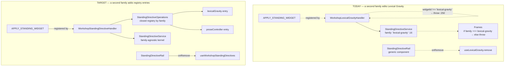
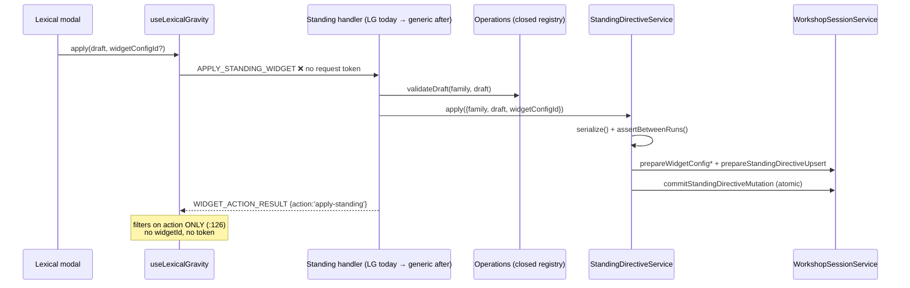

# Architecture Change Runway — Sprint 02: Shared Route and Contract Ownership

**Subject:** [`.todo/epics/epic-workshop-architecture-refactor-2026-08-03/sprints/02-shared-route-contract-ownership.md`](../../.todo/epics/epic-workshop-architecture-refactor-2026-08-03/sprints/02-shared-route-contract-ownership.md)

**Branch:** `sprint/workshop-architecture-refactor-02-shared-ownership` → `epic/workshop-architecture-refactor` (Sprint 00 = PR #101, Sprint 01 = PR #102, both merged; branch point `0f35294`)

**Altitude:** One sprint. The epic arc, the ADR, and the Phase-0 witness design are settled in the [epic runway](2026-08-03-workshop-refactor-epic-runway.md), the [semantic runway](2026-08-03-workshop-module-semantic-runway.md), and the [Sprint 01 runway](2026-08-03-workshop-sprint-01-feature-slice-runway.md) and are not re-derived here. This runway asks only: *what does P2 actually re-own, and where does "family-generic" stop being true?*

Repository-specific vocabulary is defined in the [Reader Terms Appendix](#band-5--reader-terms-appendix).

**Audience / task:** Decision owner (Okey) opening the P2 gate; implementer sequencing the moves.

**Date:** 2026-08-03 · **Status:** `IMPLEMENTED` — D1–D5 accepted by Okey and completed on 2026-08-03 · **Implementation gate:** **CLEARED**

---

## Band 0 — Change Card (30 seconds)

### Thesis

Because the family's standing apply/remove routes are registered by Lexical Gravity's handler and its transaction kernel narrows its request type to `family: 'lexical-gravity'`, change **route ownership, generic/feature dispatch, message naming, and action correlation** so that generic seams carry family mechanics and named slices carry feature semantics, while preserving **the session aggregate boundary, the serialized between-run standing transaction, persisted widget-config and directive shapes, and every rendered prompt frame**, so that **a second standing family (Prose Controller) is added by extending closed registries rather than by editing Lexical Gravity.**

### Architecture moves

| # | Move | Before | After | Confidence |
|---|---|---|---|---|
| 1 | Generic standing route owner | `WorkshopLexicalGravityHandler.ts:84-91` registers `APPLY`/`REMOVE_STANDING_WIDGET` | `handlers/domain/workshop/WorkshopStandingDirectiveHandler.ts` [+] | STRONG |
| 2 | Closed dispatch for standing operations | `WorkshopStandingDirectiveApplyRequest.family: 'lexical-gravity'` (`…Service.ts:16`); renderer is an `if`/`throw` (`…Frames.ts:22-30`) | `WorkshopStandingDirectiveOperations.ts` [+] — validate/render/summarize by family, mirroring `WORKSHOP_WIDGET_CONFIG_OPERATIONS` | MODERATE — see D4/F5 |
| 3 | Correlation + feature identity on the action result | `WorkshopWidgetActionResultPayload` has no request token; `useLexicalGravity:126` filters on `action` alone | Echoed request token + exact widget/family identity | MODERATE — see D3/F2 |
| 4 | Honest Gesture message names | `WORKSHOP_WIDGET_GENERATE` / `_GENERATION_PROGRESS` / `_MENU_RESULT` / `_COMMIT_WIDGET` / `CANCEL_WIDGET_GENERATE_REQUEST` | Rename the four Gesture-only generate/progress/menu/cancel contracts; keep commit family-generic because it is a rail mechanic (D2/F3) | MODERATE |
| 5 | Exact draft/message pairings | 4 payloads pair `widgetId: WorkshopWidgetId` (13 members) with a Gesture-only body | Discriminated unions keyed on `widgetId` | STRONG |

### Scope and highest risks

| Affected boundary | Why affected | Highest failure mode | Risk |
|---|---|---|---|
| Standing IPC route ownership | The two family routes change file | A generic handler that still defaults to `'lexical-gravity'` — a false generic reintroduced inside the fix (**F8**) | MODERATE |
| Webview standing ownership | `WorkshopStandingDirectiveRail` (generic) calls `lexicalGravity.remove`; the generic dispatcher hardcodes Lexical toast copy | Handler side becomes honest, presentation side stays a feature lie (**F1**) | **HIGH** |
| Action-result correlation | One message type, three consumers, no request token | A second standing family's result settles Lexical Gravity's modal (**F2**) | **HIGH** |
| Wire contract (message names + exact payloads) | 4 message renames + 4 literal-identity payload contracts + 1 new correlation field | Frontend/backend drift; paused feature branches rebase | MODERATE |
| Widget runtime composition | `WorkshopWidgetRuntime.lexicalGravity.directives` nests the generic service inside the feature bundle (`MessageHandler.ts:321-324`) | The route move compiles locally but leaves generic runtime ownership nested under Lexical unless both wiring files move together (**F6**) | MODERATE |
| Session / persistence | — | **None.** The standing ledger/snapshot/family union include `'prose-controller'`; the live widget-config union intentionally remains Gesture + Lexical only | LOW |
| Composition root | `extension.ts` already constructs the directive service as a top-level `CoreServices` entry | None — no `extension.ts` edit required | LOW |

### Human decisions — all accepted 2026-08-03

| ID | Decision | Accepted outcome | Rationale | Lands in |
|---|---|---|---|---|
| **D1** | Does the **presentation** side of the standing boundary get a generic owner in P2? | **Yes** — add `useWorkshopStandingDirectives` owning `remove`, generic action-result correlation, and the removal acknowledgement copy | Sprint 01's own D1 ruled that ownership applies to *both sides* of a message boundary, and `boundaries.test.ts:289-300` already witnesses that rule for widget config. Deferring re-opens a question this epic answered. | slice 3 |
| **D2** | Is `WORKSHOP_COMMIT_WIDGET` Gesture-specific or the family's one-shot rail mechanic? | **Family rail** — keep the message generic; narrow its current payload to an exact Gesture arm and keep the alias union-ready | `workshopWidgets.ts` declares six `rail: 'oneshot'` widgets and derives the thread-artifact `kind` from the id. Renaming commit Gesture-specific creates a false *specific* on the family's most reusable rail. | slice 3 |
| **D3** | Correlation token scope | **(a)** — all three action-bearing requests (commit, apply-standing, remove-standing) | Fitness #9 is family-generic, and GP's commit has the same defect. One contract change beats two. | slice 3 |
| **D4** | Does `WorkshopStandingDirectiveFrames` fold into `WorkshopStandingDirectiveOperations`? | **(b)** — keep both; record an ADR §7 documented deviation | `Frames` has five production call sites outside the directive slice; folding is a wider edit than this sprint's review boundary. The renderer entry lives in Operations; `Frames` becomes a thin caller. | slice 1 |
| **D5** | May newly discovered *pre-existing* false generics be added to the exception ledger? | **(a)** — yes, when documented with an owning phase; the "may only shrink" rule is amended to "may only shrink for a phase once that phase's exceptions are recorded" | Sprint 01 raised this as F8 and it recurs here (**F7**). A rule that forbids recording what you find rewards not looking. F7's two modules become P6 exceptions. | slice 0 |

### Gate

**State:** `CLEARED` · **Blockers:** none. D1–D5 landed; **F2** is closed by echoed request tokens plus exact action/widget/token filters and fitness witness #9.

### Implementation close-out

The implementation preserved the serialized standing transaction and changed
its ownership seams around it:

- `WorkshopStandingDirectiveHandler` now owns both generic standing routes.
  `WorkshopLexicalGravityHandler` shed those registrations and bodies.
- `WorkshopStandingDirectiveOperations` is the compile-time-complete family
  registry. Lexical validation, rendering, summary formatting, conflict copy,
  and diagnostic description live in the named Lexical operations slice;
  `Frames`, `Presentation`, the transaction service, and the rail are thin
  generic callers.
- The generic directive service moved out of the Lexical runtime bundle without
  changing `extension.ts` or the `CoreServices` composition contract.
- Gesture-only generate, progress, menu-result, and cancel message names now say
  Gesture Playground. Commit stays generic, with an exact Gesture payload arm.
- Commit/apply/remove requests mint tokens and every backend outcome—including
  mutation-gate rejection—echoes the token and exact widget identity. Gesture,
  Lexical, and standing presentation owners ignore stale or cross-feature
  acknowledgements.
- `useWorkshopStandingDirectives` owns remove, correlation, and catalog-derived
  acknowledgement copy. The fan-out dispatcher now contains no feature copy.
- The Prose Controller reproduction is intentionally structural and test-only.
  Contrary to an assumption in the pre-implementation analysis,
  `WorkshopWidgetConfigSnapshot` does **not** yet contain a Prose Controller arm;
  adding one would violate this sprint's no-persistence-change and feature-freeze
  constraints. The fixture drives the shared service through apply → aggregate
  commit → remove with injected operations and a fake config boundary.

No production behavior, persisted checkpoint shape, settings, secrets, or
extension composition-root wiring changed. The Phase-2 exception inventory is
empty; the two evidence-backed Phase-6 exceptions remain assigned to Phase 6.

Verification at close-out: `npm run typecheck` passed all three TypeScript
projects; `npm run lint` completed with zero errors (existing repository
warnings remain); `npm run build` produced both production bundles and passed
the bundle sentinel; and `npm test -- --runInBand` passed 168 suites / 1,810
tests / 1 snapshot.

---

## Band 1 — Architecture Delta Map (~2 minutes)

### 1.1 Affected subtree — before

*`wc -l` at branch point `0f35294`. The two commits after `c2321c3` touch only prompt-budget/model-sync files, so the inspected ownership slice is unchanged.*

```text
packages/core/src/
├── application/
│   ├── handlers/MessageHandler.ts                    :320-324 ⚠ directives nested under lexicalGravity
│   └── handlers/domain/
│       ├── WorkshopHandler.ts                        2,976  composes 4 widget/session handlers
│       └── workshop/widgets/
│           ├── WorkshopWidgetHostHandler.ts             50  ✅ P1's generic seat — the mold P2 copies
│           ├── gesturePlayground/…Handler.ts                  4 Gesture routes
│           └── lexicalGravity/…Handler.ts             347  ⚠ 4 LG routes + 2 FAMILY routes (:84-91)
├── application/services/workshop/
│   ├── directives/
│   │   ├── WorkshopStandingDirectiveService.ts       123  ⚠ ApplyRequest.family: 'lexical-gravity' (:16)
│   │   ├── WorkshopStandingDirectiveLedger.ts        133  ✅ fully family-generic
│   │   ├── WorkshopStandingDirectiveFrames.ts         64  ⚠ if/throw, not closed dispatch (:22-30)
│   │   └── WorkshopStandingDirectivePresentation.ts   70  ✅ closed registry WITH assertNever
│   └── widgets/WorkshopWidgetConfigOperations.ts     108  ✅ the exemplar P2's Operations mirrors
├── presentation/webview/
│   ├── components/workshop/WorkshopStandingDirectiveRail.tsx  60  ⚠ "generic" but imports LG formatter
│   │                                                              and `default: return ''` (:25)
│   └── hooks/domain/workshop/
│       ├── dispatchWorkshopWidgetActionResult.ts      37  ⚠ hardcodes "Lexical Gravity removed."
│       └── widgets/useLexicalGravity.ts              159  ⚠ owns apply/remove + action-result filter
├── shared/types/messages/workshop.ts               1,982  ⚠ 4 loose widgetId/draft pairings
├── shared/constants/workshopWidgets.ts                     ⚠ LG weight/reach grammar (unlisted — F7)
└── utils/workshopWidgetRecommendation.ts             532  ⚠ LG prompt copy + validation (unlisted — F7)
```

### 1.2 Target subtree

Legend: `[+]` add · `[~]` modify · `[>]` move/rename · `[=]` unchanged boundary

```text
packages/core/src/
├── application/handlers/
│   ├── MessageHandler.ts                            [~] widgetRuntime.directives lifted to top level (F6)
│   └── domain/
│       ├── WorkshopHandler.ts                       [~] constructs + registers the new handler
│       └── workshop/
│           ├── WorkshopStandingDirectiveHandler.ts  [+] sole APPLY/REMOVE owner, correlation, dispatch
│           └── widgets/
│               ├── WorkshopWidgetHostHandler.ts     [=]
│               ├── gesturePlayground/…Handler.ts    [~] message renames only
│               └── lexicalGravity/…Handler.ts       [~] −2 routes, −handleApply, −handleRemove (≈347→≈250–280)
├── application/services/workshop/directives/
│   ├── WorkshopStandingDirectiveService.ts          [~] family-agnostic ApplyRequest; no LG literals
│   ├── WorkshopStandingDirectiveOperations.ts       [+] closed registry: validateDraft/renderFrame/summarize
│   ├── WorkshopStandingDirectiveFrames.ts           [~] delegates rendering to Operations (D4)
│   ├── WorkshopStandingDirectivePresentation.ts     [~] summary arm re-homed into Operations (D4)
│   └── WorkshopStandingDirectiveLedger.ts           [=]
├── presentation/webview/
│   ├── components/workshop/WorkshopStandingDirectiveRail.tsx  [~] exhaustive dispatch, no silent default
│   └── hooks/domain/workshop/
│       ├── useWorkshopStandingDirectives.ts         [+] D1 — remove + generic correlation + toast copy
│       ├── dispatchWorkshopWidgetActionResult.ts    [~] loses the Lexical-only toast literal
│       └── widgets/useLexicalGravity.ts             [~] −remove, −generic action filter (≈159→≈130)
└── shared/types/messages/workshop.ts                [~] Gesture renames + 4 exact unions + correlation token
```

**The shape of the change in one line:** P1 made the two features *look* alike; P2 makes the seam between them *behave* generically — every place that says "lexical-gravity" inside a family-named module either becomes a registry entry or moves into the Lexical slice.

### 1.3 Responsibility ledger — what changes hands

| Module | Before | After | Ownership delta | Pattern / smell |
|---|---|---|---|---|
| `WorkshopStandingDirectiveHandler` [+] | — | `APPLY`/`REMOVE_STANDING_WIDGET`, correlation, closed dispatch by family, standing logging | Gains the family's IPC seat | *Feature-agnostic route owner*, mirroring `WorkshopWidgetHostHandler` |
| `WorkshopLexicalGravityHandler` | LG catalog/preview/build/save **+ 2 family routes + apply/remove bodies** | LG catalog/preview/build/save | **Loses** both family routes and ~70 lines of standing transaction glue | *False generic* removed — the epic's central correction |
| `WorkshopStandingDirectiveService` | Serialized kernel **narrowed to `family: 'lexical-gravity'`** (`:16`, `:48-57`) | Serialized between-run kernel: guard, frame replacement, atomic commit | Loses request narrowing and the LG "already active" copy | Kernel + *closed registry* seam |
| `WorkshopStandingDirectiveOperations` [+] | — | Per-family `validateDraft` / `renderFrame` / `summarize` | Gains the only generic→feature dispatch point for standing | `Closed Registry`, mold = `WORKSHOP_WIDGET_CONFIG_OPERATIONS` |
| `useLexicalGravity` | LG catalog/preview/build/save **+ apply + remove + action-result filter** | LG catalog/preview/build/save + apply (feature draft) | Loses `remove(family)` and the generic result filter (D1) | Presentation mirror of the handler correction |
| `useWorkshopStandingDirectives` [+] (D1) | — | `remove`, family-generic correlation, removal acknowledgement copy | Gains the presentation half of the family seat | Thin generic host hook, mirroring `useWorkshopWidgetHost` |
| `WorkshopStandingDirectiveRail` | Generic rail that imports Lexical's formatter and silently blanks unknown families | Generic rail over an exhaustive family formatter registry | Loses the silent `default` | Removes a *leaky abstraction* |
| `WorkshopHandler` | — | — | **No responsibility change** — one added collaborator + wiring | Composition owner, untouched |

### 1.4 Structural view — where "generic" currently stops being true

**Question:** for a *second* standing family, which modules must be edited?
**Scope:** standing apply/remove only. **Legend:** solid = deliberate target collaboration; dashed = current coupling that crosses the intended generic/feature boundary.



**Reading it:** the three dashed arrows on the left drove the ownership correction. The original sprint named the handler and service edges but missed the rail's remove path through the Lexical hook; D1 adds that third edge to the accepted plan (**F1**).

### 1.5 Representative runtime flow — apply, with the correlation gap



**Notable:** the kernel between `serialize()` and `commitStandingDirectiveMutation` is already family-agnostic and already atomic — P2 must not touch it. The defect is entirely at the two ends: who registers the route, and how the acknowledgement is correlated back.

### 1.6 Blast-radius summary

| Dimension | Direct | Indirect | Main failure | Witness | Risk |
|---|---|---|---|---|---|
| Structure | 1 new handler, 1 new service module, 1 new hook; 2 routes change file | `WorkshopHandler` wiring; `MessageHandler` runtime shape (F6) | Compile error | `tsc` + jest | LOW |
| Runtime | Standing apply/remove change owner; correlation added | LG modal settle path, removal toast | Silent mis-settle across families (**F2**) | **none today** | **HIGH** |
| Contract (wire) | 4 renames, 4 exact payload contracts, 1 correlation field | ≤5 production files per cluster (measured) | Frontend/backend drift | `tsc` across projects | MODERATE |
| Data / persistence | **None** — `WorkshopStandingDirectiveSnapshot` and the family union carry `'prose-controller'`; `WorkshopWidgetConfigSnapshot` remains the two-live-feature union | — | — | aggregate + ledger-bypass guards plus structural second-family fixture | LOW |
| Operations / security | Standing log ownership moves; no configuration, permission, secret, or trust boundary changes | Output loses useful feature detail if Operations cannot describe the applied config | A successful move leaves weaker manual diagnostics | Handler log assertions; Output Channel remains a manual signal with no alerting consumer | LOW–MODERATE |
| Route ownership | 2 registrations move to a generic owner | — | Ledger edited to match a wrong move | route-owner ledger (must update in the same commit) | MODERATE |
| Verification | 4 witnesses to install or complete (#2, #4, #8, #9); 7 test files touch standing | `WorkshopLexicalGravityHandler.test.ts` (279) splits | Vacuous green | slice-0 characterization | MODERATE |
| Coordination | Paused Conversation Widgets branches rebase across renamed messages | 02B-B, 03, 04 | Merge pain later | epic-level, accepted | MODERATE |
| Evolution | **The point.** Reproduction test measured at end of P2 | — | — | second-family fixture | **HIGH — intended** |

**Confidence:** structural, contract, route, and persistence conclusions are STRONG because direct code anchors and live witnesses agree. Runtime, verification, and evolution conclusions are MODERATE until the correlation and second-family fixtures exist.

---

## Band 2 — Reviewer Packet (~10 minutes)

### 2.1 The real job of this sprint

P2 is the first phase that changes *behavior contracts*, not just placement. Its discipline is the inverse of P1's: P1 was forbidden to decide anything; P2 exists to decide. The three decisions it actually owns are (1) where the family's seat is on **both** sides of the message boundary, (2) what "exact" means for a widget message's payload, and (3) how an acknowledgement finds the request that produced it. Everything else in the scope list is mechanical once those are settled.

Its success metric is not the checkbox list. It is: **after P2, adding Prose Controller's standing arm touches zero lines under `lexicalGravity/**`.**

### 2.2 Declared vs observed

| Topic | [Declared] | [Observed] | [Inferred] / decision state |
|---|---|---|---|
| "Generic standing routes are not registered by feature handlers" | Completion criterion 1 | `WorkshopLexicalGravityHandler.ts:84-91` registers both | Straightforward; the route-owner ledger already pins the expected new owner path |
| "`WorkshopStandingDirectiveService` contains no Lexical-only request type" | Completion criterion 2 | `:16` (`family: 'lexical-gravity'`), `:48-57` (narrowing + LG copy), `:51-56` (LG-worded errors) | The *errors* are also LG copy — "Lexical Gravity can edit only its currently active configuration." Generic kernels should not write a feature's writer-facing text (ADR §3) |
| "Invalid widget/draft pairings are hard to represent" | Completion criterion 3 | 4 payloads pair a 13-member `WorkshopWidgetId` with a Gesture-only body (`workshop.ts:1769`, `:1796`, `:1814`, `:1941`) | [Inferred] the fix is per-payload literal identity, with shared family rails represented as exact-arm aliases. The original criterion named neither the payloads nor the technique; the accepted sprint plan now names both (**F4**). |
| "Cross-feature/stale acknowledgements cannot settle another feature" | Completion criterion 4 | `useLexicalGravity.ts:126` filters on `action` only; `WorkshopWidgetActionResultPayload` has no token | [Inferred] exact correlation requires both an echoed request token and feature identity. **Resolved by D3** and now explicit in the sprint scope. |
| "Generic standing and **widget-host** contracts live under generic owners" | Sprint scope line 11 | Widget host landed in P1 on **both** sides (handler + hook + witness) | [Inferred] standing should match. **Resolved by D1**: P2 adds the presentation owner as well as the handler. |
| "The P2 migration exceptions are empty" | Completion criterion 5 | Ledger holds exactly 2 P2 entries (`boundaries.test.ts:151-162`) | Both are removable by the named moves. But two *unlisted* pre-existing violations exist (**F7**) |
| Fitness witnesses #2, #4, #8, #9 install here | Epic phase table | None exist yet | The original sprint compressed four witnesses into one fixture bullet; the accepted sprint plan now names each witness and its invariant. |

### 2.3 Contracts and invariants

| Contract / invariant | Current owner | Target owner | Change? | Failure if broken | Witness |
|---|---|---|---|---|---|
| `WORKSHOP_APPLY_STANDING_WIDGET` / `…REMOVE…` | `WorkshopLexicalGravityHandler` | `WorkshopStandingDirectiveHandler` | ownership | LG apply/remove dead | route-owner ledger (update in the same commit) |
| One registration per message type | `MessageRouter.register` throws (`MessageRouter.ts:31-35`) | unchanged | no | duplicate route | runtime throw + ledger |
| Standing mutation is serialized and between-runs only | `…Service.serialize()` + `assertBetweenRuns()` (`:112-122`) | unchanged | **no — must not change** | Concurrent apply corrupts prompt/session agreement | `WorkshopStandingDirectiveService.test.ts` |
| Prompt frames replaced *before* session commit | `…Service.ts:75-85`, `:102-107` | unchanged | **no** | Provider history and session history disagree | same suite |
| `commitStandingDirectiveMutation` atomicity | `WorkshopSessionService.ts:1097-1146` | unchanged | no | Directive without config, or marker without turn | session suite |
| Persisted `WorkshopStandingDirectiveSnapshot` / `WorkshopWidgetConfigSnapshot` | `workshop.ts:837-905` | unchanged | **no** | Checkpoint incompatibility | codec/normalization suites |
| `WorkshopWidgetActionResultPayload` | `workshop.ts:1966-1978` | **+ correlation token, exact identity** (D3) | **yes — wire** | Stale/cross-family settle | **none today** (**F2**) |
| Gesture generate/menu/progress payloads | `workshop.ts:1768-1830` | Gesture-named + exact unions | **yes — wire** | Frontend/backend drift | `tsc` |
| `WORKSHOP_COMMIT_WIDGET` | Wire contract in `workshop.ts:1940-1949`; route in `WorkshopGesturePlaygroundHandler` | Same feature route owner; generic message name retained and payload becomes an exact, union-ready Gesture arm (D2) | payload only | Renaming would close the one-shot rail to 5 declared future widgets; leaving the current loose payload would permit invalid pairs | catalog + fitness #8 |
| `packages/core` free of `vscode`; handlers never touch ledgers | `boundaries.test.ts:200`, `:302-309` | unchanged | no | boundary regression | live witnesses |

**D2 boundary note:** retaining a family-generic commit message does **not** make Gesture's preparation workflow generic. `WorkshopGesturePlaygroundHandler` remains the current commit route owner; only the rail contract name and its exact payload union are shared. A second one-shot workflow can justify a generic route owner later if its preparation contract truly matches. This preserves the semantic runway's feature-owned generation/preparation boundary rather than building a universal widget handler early.

### 2.4 Negative space

| Generic owner | May know | Must not know | Next-feature edit surface | Verdict |
|---|---|---|---|---|
| `WorkshopStandingDirectiveHandler` [+] | family key, widget id, config id, correlation token, the generic action-result envelope | lens fields, preview protocol, LG error copy | none | **Healthy if built** — provided F8's `'lexical-gravity'` defaults do not travel with the code |
| `WorkshopStandingDirectiveService` | between-run guard, serialization, frame replacement order, atomic commit | which family it is serving | none | **Healthy after criterion 2** — including its error strings |
| `WorkshopStandingDirectiveOperations` [+] | that families exist and each can validate/render/summarize | field grammar of any draft | one entry per family | **Healthy** — mold already proven at `WorkshopWidgetConfigOperations` |
| `WorkshopStandingDirectiveRail` | family identity, widget label, a formatter registry | how to format a lens | one formatter entry | **Currently unhealthy** — imports `formatLexicalGravitySummary` directly and blanks unknown families (`:25`) |
| `dispatchWorkshopWidgetActionResult` | that action results fan out to feature consumers | that removal means "Lexical Gravity removed." | none | **Currently unhealthy** — feature copy in a generic seam (**F1**) |
| `shared/constants/workshopWidgets.ts` | ids, labels, rails, availability | LG weight bounds, reach values, their validators | — | **Unhealthy and unlisted** (**F7**) |
| `utils/workshopWidgetRecommendation.ts` | recommendation parsing, id liveness | LG prompt copy (`:32`), LG field validation (`:436-441`) | — | **Unhealthy and unlisted** (**F7**) |

### 2.5 Quality scenarios

| Type | Source | Stimulus | Environment | Artifact | Expected response | Response measure |
|---|---|---|---|---|---|---|
| Change | Feature implementer | Prose Controller's standing arm is added | After the P7 feature gate opens | standing slice | Add Operations, Presentation, rail-formatter, contract, and feature entries | **Zero diff lines under `**/lexicalGravity/**`** |
| Change | Feature implementer | A second one-shot widget is added | Existing catalog and shared commit rail | commit route | No message rename required | D2 holds; the current catalog already has 6 `rail: 'oneshot'` entries |
| Failure | Host result stream | A `prose-controller` apply result arrives while the LG modal is open | Normal webview session | `useLexicalGravity` | Ignore the result | Exact `requestToken && widgetId` filter; **absent today** (**F2**) |
| Failure | Host result stream | A stale failed apply arrives after a newer apply | Two overlapping requests | LG modal | Ignore the stale result | Echoed token matches only the latest request; **absent today** (**F2**) |
| Failure | Hydrated session | A `prose-controller` directive reaches the rail | Family is known but feature behavior remains frozen | `WorkshopStandingDirectiveRail` | Render its summary or fail loudly | Never returns the current silent blank string (`:25`) (**F5**) |
| Failure | Contributor | A generic module imports feature behavior outside an approved registry | Build/test | generic standing files | Architecture test fails | Fitness #4; current path-selected guard cannot see generic files |
| Failure | Type consumer | `{widgetId:'lexical-gravity', draft: gestureDraft}` is constructed | Typecheck | commit payload | Compile error | Type-level fixture with `@ts-expect-error`; **compiles today** (**F4**) |
| Runtime | Writer | Applies a lens while a run is active | Active Workshop response | standing service | Reject with "A Workshop response is still running." | Existing `assertBetweenRuns()` test remains green |
| Change | Phase owner | P2 completes | Sprint close-out | exception ledger | Both P2 entries are gone | `boundaries.test.ts:311-332` |

**Sensitivity point:** D1. It decides whether P2 ends with one honest seam or two half-seams.
**Tradeoff point:** D2. Message-name honesty for Gesture vs. keeping the one-shot rail open to five declared future widgets.
**Risk theme:** every generic module that already exists in this slice was written *before* a second family existed, so its "genericness" is untested. The rail, the dispatcher, the frames renderer, and the constants module each encode Lexical Gravity as the default case.

### 2.6 Alternatives

| Alternative | Shape | Benefits | Costs / risks | Verdict |
|---|---|---|---|---|
| **Minimal patch** | Move the two routes; widen the ApplyRequest union; stop | Smallest diff; clears both exception entries | Criteria 3 and 4 unmet; presentation side still feature-owned; fitness #4/#8/#9 unbuilt and inherited by P6/P7 | **Rejected** |
| **Recommended** | Five moves + D1's presentation carve-out + D3's correlation token + four witnesses | One honest family seam on both sides; the reproduction test becomes measurable at P2 rather than P7 | Wire contract changes ripple into paused branches; ~10 production files | **Retained** |
| **More generalized** | Also fold `Frames`, `Presentation`, and the rail formatter into one Operations registry now, and clear F7's constants | One dispatch point for everything standing | `Frames` has 5 production call sites outside the slice; mixes a broad refactor into the phase that owns contract change | **Rejected for P2** — take D4(b), route F7 to P6 |

### 2.7 Principle and quality tensions

| Principle | Status | Support | Tension | Consequence | Witness |
|---|---|---|---|---|---|
| Naming truthfulness | `TENSION` → `STRONG` with D1+D2 | Routes, service, and messages all become honest | D2 could over-correct commit into a false specific | A future one-shot widget renames the rail again | route ledger + catalog |
| Responsibility / cohesion | `STRONG` | LG handler sheds ~70 lines of family glue; kernel keeps one job | — | — | sprint exit criteria |
| Open/closed | `ACCEPTABLE` → `STRONG` with Operations | Adding a family extends deliberate closed registries | A new family still edits shared registry entries by design; the false-generic constants remain deferred to P6 under D5 | Reproduction test permits closed-registry edits but requires zero edits to existing feature files | second-family fixture |
| Change isolation | `TENSION` | Handler side becomes isolated | Presentation side unresolved without D1 | Lexical hook remains the family's remove path | **F1 fix** |
| Make illegal states unrepresentable | `VIOLATION` → `ACCEPTABLE` | 4 loose pairings become literal-identity contracts | `WorkshopWidgetId` stays 13-wide in genuinely generic envelopes by design | Acceptable — catalog identity is genuinely family-wide | fitness #8 |
| Reliability (correlation) | `VIOLATION` | — | No token; one filter keys on `action` alone | Cross-family and stale settles are representable today | **F2 fix** + fitness #9 |
| Observability | `TENSION` | `[WorkshopStandingDirective]` log lines exist (`…LexicalGravityHandler.ts:269-271`, `:299-301`) | They are written by a feature handler and include a lens field | Moving them generic loses the lens detail unless Operations supplies a log summary | name a `describe(config)` entry in Operations |

### 2.8 Ranked findings

| ID | Sev | Finding | Evidence | Smallest fix | Blocks |
|---|---|---|---|---|---|
| **F1** | **HIGH** | The original sprint plan fixed only the host side of the standing boundary. In current code, a **generic** rail's remove button is wired to the **Lexical** hook, and a **generic** fan-out dispatcher owns Lexical's removal copy. | `WorkshopApp.tsx:1497` `onRemove={lexicalGravity.remove}`; `WorkshopStandingDirectiveRail.tsx:1` self-describes as "Generic composer-adjacent rail" yet `:11-13` imports `formatLexicalGravitySummary`; `dispatchWorkshopWidgetActionResult.ts:28-35` hardcodes "Lexical Gravity removed." / "…was already removed." / "…could not be removed."; P1 ruled the opposite for widget config and witnessed it at `boundaries.test.ts:289-300`. | **Accepted in D1:** add `useWorkshopStandingDirectives` owning `remove` + generic correlation + removal copy; extend the P1 presentation-ownership witness to the standing message pair. | slice 3 |
| **F2** | **HIGH** | Current code has no mechanism for the criterion that cross-feature or stale acknowledgements cannot settle another feature. Today a `prose-controller` apply result would settle the Lexical modal. | `useLexicalGravity.ts:125-127` — `if (action === 'apply-standing') setActionResult(...)`, no `widgetId`, no token; `WorkshopWidgetActionResultPayload` (`workshop.ts:1966-1978`) carries no request identity; contrast `useGesturePlayground.ts:97-99` which *does* check `widgetId`, and `:82` which uses a token for menu results. | **Accepted in D3:** add an echoed `requestToken` to commit / apply-standing / remove-standing and their action result; filter on `token && widgetId` in every consumer; install fitness #9 over the three consumers. | slice 3 |
| **F3** | **MED–HIGH** | The original scope included commit among the Gesture-specific renames, but commit is a **family rail**, not a Gesture concept. Renaming it would create a false specific on the mechanic five declared widgets will reuse. | `workshopWidgets.ts:17` `WorkshopWidgetRail = 'oneshot' \| 'standing' \| 'resource'`; six descriptors carry `rail: 'oneshot'` (`:84, :96, :107, :125, :137, :155`); `WorkshopThreadArtifactWidgetCommit` (`workshop.ts:~915`) is family-generic; only `WorkshopCommitWidgetPayload.draft: WorkshopGestureDraft` is Gesture-bound. | **Accepted in D2:** keep the message generic; narrow the payload to an exact, union-ready Gesture arm. The sprint scope now says "generate/progress/menu." | slice 3 |
| **F4** | **MED** | The original completion criterion did not name the four invalid pairing surfaces, making completion unreviewable. Current code still permits every invalid pairing. | `workshop.ts:1769` (`WorkshopWidgetGenerateBasePayload.widgetId: WorkshopWidgetId` + `menu: WorkshopGestureMenuGroup[]` at `:1784`), `:1796` (progress with Gesture-only `stage: 'dictionary' \| 'menu'`), `:1814` (`menuResult` with `dictionaryMarkdown`), `:1941` (`commit` with `draft: WorkshopGestureDraft`). All four permit `{widgetId:'lexical-gravity', …gesture body}`. | The accepted sprint plan now lists all four; key each to the literal Gesture identity, keep generic aliases union-ready, and install fitness #8 as a type-level fixture (`@ts-expect-error` on an invalid pairing). | slice 3 |
| **F5** | **MED** | Two of the four generic→feature dispatch points in current code are not closed registries: one is an `if`/`throw`, the other silently returns an empty string. | `WorkshopStandingDirectiveFrames.ts:22-30` — `if (family === 'lexical-gravity' && …) return …; throw` (no `assertNever`); `WorkshopStandingDirectiveRail.tsx:21-27` — `switch(family) { case 'lexical-gravity': …; default: return '' }`. Contrast the correct shape at `WorkshopStandingDirectivePresentation.ts:22-38, 68-70` (`assertNever`) and `WorkshopWidgetConfigOperations.ts:27-29` (`unsupportedConfig(value: never)`). | Make both exhaustive with a `never` guard or closed registry; the accepted sprint plan now defines fitness #4 as the failing-on-drift witness for every generic→feature dispatch. | slice 1 |
| **F6** | **MED** | The generic standing service is composed **inside the Lexical feature bundle** of the widget runtime, so the new generic handler cannot receive it without reshaping the runtime contract. | `MessageHandler.ts:320-324` — `widgetRuntime = { gesturePlayground, lexicalGravity: { model, repository, directives } }`; `WorkshopHandler.ts:253-260` declares that shape; `WorkshopHandler.ts:363` passes `widgetRuntime.lexicalGravity.directives` into the Lexical handler. `CoreServices` already holds it correctly as a top-level `workshopStandingDirectiveService` (`MessageHandlerContracts.ts:127`), and `extension.ts:221` constructs it generically — so no composition-root edit is needed. | Add `standingDirectives` as a sibling of `gesturePlayground`/`lexicalGravity` in `WorkshopWidgetRuntime`; the accepted sprint scope now names both runtime files. | slice 2 |
| **F7** | **MED** | The exception ledger claims to be "exact known false-generic ownership" and is not. Two generic modules own Lexical Gravity semantics, are unlisted, unassigned to a phase, and structurally invisible to the isolation witness (which selects candidate files by **path**). | `shared/constants/workshopWidgets.ts:19-40` — `LEXICAL_GRAVITY_WEIGHT`, `LEXICAL_GRAVITY_REACH`, `isLexicalGravityWeight`, `isLexicalGravityReach` in the *catalog* module; `utils/workshopWidgetRecommendation.ts:32` holds LG writer-facing prompt copy and `:436-441` LG field validation. Neither path matches `/LexicalGravity/i`, so `boundaries.test.ts:274-275` cannot see them. ADR §3 forbids a generic module owning "Lexical lens logic". | D5(a): record both as P6 exceptions with a one-line rationale, and amend the "may only shrink" wording to "may only shrink for a phase once that phase's exceptions are recorded." Alternatively move the LG grammar into `LexicalGravityConfigCodec` and re-export — but that is P6 scope, not P2. | slice 0 |
| **F8** | **LOW–MED** | The apply/remove bodies that move into the generic handler carry Lexical defaults with them. A generic handler that answers "which widget failed?" with `'lexical-gravity'` is a false generic reintroduced inside the fix. | `WorkshopLexicalGravityHandler.ts:304` — success path `widgetId: active?.widgetId ?? 'lexical-gravity'`; `:314` — failure path hardcodes `widgetId: 'lexical-gravity'` for a request that carries only `family`. Also `WorkshopStandingDirectiveService.ts:53, 56` embed LG writer copy in the generic kernel. | Derive widget identity from the family via the Operations registry; on failure echo the request's `family` and omit `widgetId` (or make the failure arm's identity `family`-keyed). Move the two error strings into the Lexical Operations entry. | slice 2 |
| **F9** | **LOW** | "A compile-time/minimal fixture proving a second standing family does not edit Lexical files" is ambiguous: `'prose-controller'` is *already* in the family union, and several closed dispatches deliberately `throw` for it. A fixture asserting "compiles" and a fixture asserting "behaves" are different tests. | `workshop.ts:58-60` — `WorkshopStandingDirectiveFamily = 'lexical-gravity' \| 'prose-controller'`; `WorkshopStandingDirectivePresentation.ts:33` throws "Prose Controller standing directives are not implemented" *by design*; `:53-60` already renders a generic marker for it. | State the fixture as: a stub `proseController` Operations entry registered in a test, driven through apply→commit→remove, asserting the diff-free property by inspection plus a route-owner assertion. Say explicitly it is a test-only registration, not shipped behavior (the feature freeze still applies). | slice 4 |

**What survived attack.** I tried to break these and could not:

- **The transaction kernel is genuinely family-agnostic already.** `serialize()` (`…Service.ts:112-116`), `assertBetweenRuns()` (`:118-122`), the frames-then-commit ordering (`:75-85`), and `commitStandingDirectiveMutation` (`WorkshopSessionService.ts:1097-1146`) contain no feature branch. Only the *request type* and the *pre-flight checks* narrow. Criterion 2 is a smaller change than it reads.
- **The ledger is already correct.** `WorkshopStandingDirectiveLedger` (133 lines) dispatches on `family` as data, mints `pd-N` generically, and has no feature literal anywhere. It needs zero edits.
- **The session facade is already correct.** `prepareStandingDirectiveUpsert/Removal`, `getStandingDirective(s)`, `prepareWidgetConfig*`, and `getWidgetConfig` (`WorkshopSessionService.ts:1045-1146`) are all family-generic. No aggregate widening is required, so locked constraints 4 and 5 are untouched.
- **The exemplar and the mold both exist in-repo.** `WORKSHOP_WIDGET_CONFIG_OPERATIONS` (closed registry with a `never` guard) and `WorkshopWidgetHostHandler` (50-line generic route seat from P1) are working precedents for both new modules. Nothing here is speculative design.
- **`WorkshopStandingDirectivePresentation` is already the right shape** — `switch` on family with `assertNever`, and a *generic* marker arm for `prose-controller`. It proves the pattern works for this exact family.
- **No persistence risk.** `'prose-controller'` is already a member of the persisted `WorkshopStandingDirectiveFamily` and `WorkshopStandingWidgetCommit.widgetId`. P2 changes no stored shape, so the codec-evolution rules in `CLAUDE.md` and ADR 2026-07-30 do not engage.
- **The composition root needs no edit.** `extension.ts:221` already builds the directive service from `(session, conversationSettings)` and exposes it as a top-level `CoreServices` member. Only `MessageHandler`'s local bundling is wrong (F6). Locked constraint 3 holds without effort.
- **Message renames are cheap.** Measured fan-in per cluster: ≤5 production files (`base.ts`, `workshop.ts`, one handler, one hook, one modal/router) plus 2–6 test files. `dist/` hits are build output.
- **Duplicate-route collision is already impossible.** `MessageRouter.register` throws (`MessageRouter.ts:31-35`), so half of the sprint's "does not collide in `MessageRouter`" fixture is enforced at runtime today; the fixture only needs to prove *ownership*, which the ledger does.
- **Baseline is green.** `npx jest packages/core/src/__tests__/architecture/boundaries.test.ts --runInBand` → **9/9, 1.9s** at branch point `0f35294`.

### 2.9 Implementation slices

| # | Purpose | Files | Behavior change | Verification | Depends on | Rollback seam |
|---|---|---|---|---|---|---|
| 0 | Record findings and close the ledger's honesty gap | sprint doc (F3–F5, F9 wording); `boundaries.test.ts` (F7 entries + rule wording) | none (docs/tests) | architecture suite | **D5** | revert one commit |
| 1 | Closed dispatch for standing operations | `WorkshopStandingDirectiveOperations.ts` [+]; `…Frames.ts` + `…Presentation.ts` delegate; rail formatter registry; fitness #4 witness | none — same frames, same summaries | `WorkshopStandingDirectiveService.test.ts`, rail test, architecture suite | **D4** | independent commit |
| 2 | Generic route ownership + kernel de-narrowing | `WorkshopStandingDirectiveHandler.ts` [+]; LG handler −2 routes; `…Service.ts` request union; `WorkshopHandler` + `MessageHandler` runtime shape (F6); route ledger; exception ledger −2 | route owner moves; LG defaults removed (F8) | handler tests split; route-owner witness; `tsc` all projects | 1 | independent commit |
| 3 | Contract exactness + correlation | 4 Gesture-only message renames; 4 exact payload contracts; `requestToken`; `useWorkshopStandingDirectives` [+]; `useLexicalGravity` −remove; dispatcher −LG copy; fitness #8 + #9 witnesses | **yes — wire contract** (alpha rules) | hook suites, router suite, dispatcher suite, `tsc` | 2, **D1/D2/D3** | independent commit |
| 4 | Second-family fixture | test-only `proseController` Operations stub driven apply→commit→remove | none (test-only) | new fixture + full architecture suite | 1–3, **F9 wording** | revert one test commit |
| 5 | Close-out | P2 exceptions empty; sprint doc records deviations (D4(b), F7 deferral) | none | full architecture suite + full jest | 1–4 | — |

### 2.10 Coordination map

| Workstream | Files owned | Shared lock points | Merge order | Owner |
|---|---|---|---|---|
| Decision and migration witnesses | Sprint doc, ADR §7, `boundaries.test.ts` exception wording/entries | `boundaries.test.ts` also changes in route ownership | Slice 0 first; route-ledger portion completes with Slice 2 | Sprint 02 branch |
| Standing operations seam | `WorkshopStandingDirectiveOperations.ts`, `…Frames.ts`, `…Presentation.ts`, formatter registry | Operations contract consumed by handler and test fixture | Slice 1 before handler extraction | Sprint 02 branch |
| Route and runtime ownership | `WorkshopStandingDirectiveHandler.ts`, `WorkshopLexicalGravityHandler.ts`, `WorkshopHandler.ts`, `MessageHandler.ts`, route ledger | `WorkshopHandler.ts` and `boundaries.test.ts` | Slice 2 after Operations | Sprint 02 branch |
| Wire and presentation ownership | `base.ts`, `workshop.ts`, `useWorkshopStandingDirectives.ts`, `useLexicalGravity.ts`, dispatcher, rail, app router/composition | Shared message barrel and action-result consumers | Slice 3 after route owner compiles | Sprint 02 branch |
| Reproduction fixture and close-out | Test-only Prose Controller stub, architecture/type fixtures, sprint close-out | Operations registry and all four witnesses | Slices 4–5 last | Sprint 02 branch |

Paused Conversation Widgets Sprints 02B-B, 03, and 04 do not co-edit this branch; they rebase only after the architecture epic closes. Within Sprint 02, the lock points above make the safe merge order explicit and keep contract changes from landing before their route owner exists.

### 2.11 Decision-reversal check

No unresolved unknown currently reverses D1–D5. The three candidates from the first investigation pass are settled by accepted decisions and source plans:

| Candidate uncertainty | Resolution | Evidence | Remaining impact |
|---|---|---|---|
| Where does the removal acknowledgement copy live in P2? | `useWorkshopStandingDirectives` owns generic correlation and acknowledgement copy now (D1). P3 may later re-home shell rendering without returning the copy to a feature hook. | accepted sprint scope and D1; current fan-out seam at `dispatchWorkshopWidgetActionResult.ts:10-36` | None for P2 architecture |
| Does paused Lexical Gravity v2 need a second apply arm carrying a separate lens IR? | No. Sprint 02B-B replaces the v1 lens with a required v2 `logic` object inside the existing Lexical draft/config flow; it does not introduce a parallel apply contract. | `02b-b-lexical-gravity-interpretive-grammar.md` “Locked decisions” and delivery steps 2–4; ADR 2026-08-01 §§1, 6 | The Lexical union arm evolves after P7; P2 need not invent a second arm |
| Should generation progress remain generic? | No. Its `dictionary`/`menu` stages and ownership are Gesture-specific; D2 therefore renames progress with generate/menu/cancel while retaining only commit as the generic rail contract. | `workshop.ts:1795-1806`; semantic runway “Transient state” and “Feature-owned one-shot flow”; D2 | Four message renames, not five |

---

## Band 3 — Self-review and Re-plan Verdict

### 3.1 Contradictions found

| Artifact pair | Contradiction | Resolution |
|---|---|---|
| Original sprint scope ("standing **and widget-host** contracts under generic owners") ↔ original move list (handler only) | The widget-host half landed on both sides in P1; the standing half was scoped to one side | **F1 / D1** |
| Sprint scope line 21 ("rename … commit messages honestly") ↔ `workshopWidgets.ts` rail catalog | Commit is a family rail with six declared members | **F3 / D2** |
| Semantic-runway destination (no `…Frames.ts`) ↔ `Frames`' five production call sites | Folding it is wider than this sprint's boundary | **D4(b)** + ADR §7 deviation note |
| Exception ledger "exact known" ↔ two unlisted generic modules owning LG grammar | The ledger under-reports | **F7 / D5** |
| Epic phase table (P2 installs #2, #4, #8, #9) ↔ original sprint scope (one fixture bullet) | Four witnesses, one bullet | Accepted sprint plan now names all four and their invariants |
| ADR §3 ("generic must not own … one feature's writer-facing copy") ↔ `…Service.ts:53,56` + dispatcher toast | Generic modules write Lexical's copy | **F8 / F1** |

### 3.2 Prospective failure review

| Failure story | Cause | Missing evidence | Prevention |
|---|---|---|---|
| Prose Controller ships in P8+; installing it shows the Lexical Gravity modal's success state | LG hook filters on `action` alone; no widget/family key | No correlation field exists | **F2** / D3(a) |
| Prose Controller's rail entry renders as a blank grey pill | `WorkshopStandingDirectiveRail.tsx:25` `default: return ''` | No exhaustiveness guard | **F5** |
| P7 audit finds two false generics nobody assigned | They were discovered in P2 and left unrecorded because the ledger "may only shrink" | — | **F7** / D5(a) |
| A second one-shot widget arrives and the commit message must be renamed *again* | P2 renamed it Gesture-specific | Catalog rail evidence not consulted | **F3** / D2(a) |
| The generic handler reports `widgetId: 'lexical-gravity'` on a Prose Controller removal failure | Lexical defaults travelled with the moved code | — | **F8** |
| P3 re-derives a standing presentation owner from scratch | D1 deferred; `useLexicalGravity` kept `remove` | — | D1(a) now |

### 3.3 Reproduction test (measured at end of P2)

**Next variant:** Prose Controller, standing arm only.
**Adds:** an Operations entry, a Presentation summary arm (the throw at `…Presentation.ts:33` becomes a real case), a rail formatter entry, a feature handler + hook + modal, an apply-payload union arm, its own tests.
**Must edit (generic, by design):** `WorkshopStandingDirectiveOperations`, `WorkshopStandingDirectivePresentation`, the rail formatter registry, the apply-payload union — **four closed-registry entries.**
**Must edit (feature-owned):** none — *provided* D1 lands. Without D1, it must also edit `useLexicalGravity`/`WorkshopApp` to unhook `remove`.
**Verdict:** P2 with D1 delivers the epic's headline property — **zero `lexicalGravity/**` diff lines** — three phases before P7. Without D1 it delivers half of it and hands the rest to P3.

### 3.4 Re-plan verdict: **REFINED**

**Initial plan:** execute the sprint's six scope bullets — new standing handler, split preparation from kernel, add correlation, rename Gesture messages, keep unions exact, add a second-family fixture.

**Final plan:** the same six, plus (1) a presentation-side generic standing owner so the boundary is honest on both sides (D1), (2) `WORKSHOP_COMMIT_WIDGET` **excluded** from the rename list and narrowed by union instead (D2), (3) a request token spanning all three action-bearing requests rather than standing alone (D3), (4) `…Frames.ts` retained as a documented ADR §7 deviation while its renderer entry moves into Operations (D4), (5) two newly discovered false generics recorded as P6 exceptions with the ledger rule amended to permit it (D5), and (6) fitness #2/#4/#8/#9 named individually in scope rather than compressed into one fixture bullet.

**What changed and why:** the sprint's completion criteria are correct and its named moves are correct; what they under-specify is *where the family boundary actually runs*. Three of the five modules that must be generic after P2 — the rail, the fan-out dispatcher, and the widget-runtime bundle — are not in the sprint's file list at all, and two of them are already generic in name while encoding Lexical Gravity in body. Reading the completion criteria against the presentation layer, rather than against the handler layer they were written for, turned "move two routes" into "make the family seam honest on both sides."

**Evidence that caused the change:** `WorkshopStandingDirectiveRail.tsx:1` (self-declared generic) read against `:11-13` (imports the Lexical formatter) and `WorkshopApp.tsx:1497` (`onRemove={lexicalGravity.remove}`); and `workshopWidgets.ts:84-162` (six `rail: 'oneshot'` descriptors) read against scope line 21's instruction to rename commit.

**Remaining uncertainty:** none that reverses the plan. P3 may later relocate generic toast rendering as part of shell decomposition, but D1 fixes the P2 owner as `useWorkshopStandingDirectives`; the copy cannot remain in a feature hook or the current generic fan-out dispatcher.

### 3.5 Implementation gate

| Condition | Pass/fail | Evidence |
|---|---|---|
| No unaccepted critical unknown | **PASS** | The three candidate reversal questions are resolved in §2.11; none remains open |
| Contract consumers / migration / tests identified | **PASS** | Fan-in measured per message cluster (≤5 production files); D2 keeps commit generic, D3 fixes the token scope |
| Persistence failure and rescue defined | **N/A — PASS** | No stored shape changes; the fixture does not add Prose Controller to the live widget-config union |
| Runtime flows owned and testable | **PASS** | D3(a) supplies the correlation field; fitness #9 witnesses the three consumers (sprint scope + completion criteria) |
| Negative-space and reproduction tests pass | **PASS** | D1 gives the standing boundary generic owners on both sides; reproduction target is zero `lexicalGravity/**` diff lines |
| Tree / responsibilities / contracts / slices agree | **PASS** | All six §3.1 contradictions resolved by D1–D5 and folded into the sprint doc |
| Human decisions assigned | **PASS** | D1–D5 accepted by Okey on 2026-08-03 and recorded in the sprint doc |
| Coordination / file ownership recorded | **PASS** | Sole active branch; paused Conversation Widgets branches rebase after the epic (accepted at epic level) |

**Final gate:** `CLEARED` — slices 0–5 completed; verification is recorded in the implementation close-out and sprint document.

---

## Band 4 — Evidence Appendix

### 4.1 Evidence index

| Claim | Anchor |
|---|---|
| Family routes registered by the Lexical handler | `WorkshopLexicalGravityHandler.ts:84-91` |
| Apply/remove bodies to be moved | `…LexicalGravityHandler.ts:248-318` (≈70 lines) |
| Kernel narrowed to Lexical | `WorkshopStandingDirectiveService.ts:16`, `:48-57` |
| Kernel is otherwise family-agnostic | `…Service.ts:75-85` (frames before commit), `:112-116` (serialize), `:118-122` (between-runs) |
| Ledger fully generic | `WorkshopStandingDirectiveLedger.ts:50-133` — no feature literal |
| Session facade fully generic | `WorkshopSessionService.ts:1045-1146` |
| Correct closed-registry shapes in-repo | `WorkshopWidgetConfigOperations.ts:27-29, 40-108`; `WorkshopStandingDirectivePresentation.ts:22-38, 68-70` |
| Incorrect dispatch shapes | `WorkshopStandingDirectiveFrames.ts:22-30`; `WorkshopStandingDirectiveRail.tsx:21-27` |
| Generic rail imports the Lexical formatter | `WorkshopStandingDirectiveRail.tsx:1, 11-13, 22-24` |
| Generic dispatcher owns Lexical copy | `dispatchWorkshopWidgetActionResult.ts:28-35` |
| Rail's remove wired to the Lexical hook | `WorkshopApp.tsx:1497`; hook at `useLexicalGravity.ts:107-109` |
| No correlation on the action result | `workshop.ts:1966-1978`; consumers `useLexicalGravity.ts:125-127`, `useGesturePlayground.ts:95-101`, `dispatchWorkshopWidgetActionResult.ts:16-24` |
| Four loose widgetId/draft pairings | `workshop.ts:1768-1785`, `:1795-1806`, `:1813-1827`, `:1940-1946` |
| Commit is a family rail | `workshopWidgets.ts:17`, `:84, 96, 107, 125, 137, 155` (six `rail: 'oneshot'`); generic `WorkshopThreadArtifactWidgetCommit` in `workshop.ts` |
| Generic service nested in the feature bundle | `MessageHandler.ts:320-324`; type at `WorkshopHandler.ts:253-260`; use at `:363` |
| Composition root already generic | `extension.ts:221-224`; `MessageHandlerContracts.ts:127` |
| Unlisted false generics | `shared/constants/workshopWidgets.ts:19-40`; `utils/workshopWidgetRecommendation.ts:32, 436-441` |
| Isolation witness is path-selected | `boundaries.test.ts:269-275` (`/GesturePlayground/i`, `/LexicalGravity/i` on the relative path) |
| Route-owner ledger pins the current (wrong) owners | `boundaries.test.ts:98-106` — commented "Legacy Phase-2 exceptions" |
| Exception ledger contents and rule | `boundaries.test.ts:146-162` |
| Duplicate registration already fatal | `MessageRouter.ts:31-35` |
| `'prose-controller'` already in the persisted union | `workshop.ts:58-60`, `:894`, `:923`, `:944` |
| Test surface touching standing | 7 files: LG handler (279), standing service, boundaries, rail, dispatcher, `useLexicalGravity`, app router |
| Message-cluster fan-in (production, excluding `dist/`) | 5 files per cluster for generate/menu/progress/commit/standing; 5 for action result |
| Relevant source slice unchanged since the earlier evidence SHA | `git diff --name-status c2321c3..0f35294` touches only `promptBudgets`, its test, `WorkshopWidgetConfigs.test.ts`, and `widgetModelsSync.test.ts` |
| Baseline green | `npx jest …/boundaries.test.ts --runInBand` → 9 passed, 1.9s at `0f35294` |

**Not inspected at this altitude:** `WorkshopGesturePlaygroundModal`'s internal state machine (P3), `workshop.css` (P3), `workshop.ts`'s full family boundaries (P6), `WorkshopHandler`'s non-widget route clusters (P4).

### 4.2 File and module cards

| Path / change | Layer / role | Responsibility and ownership delta | Critical entries / dependencies | Contract or state effect | Verification | Size / evidence |
|---|---|---|---|---|---|---|
| `application/handlers/domain/workshop/WorkshopStandingDirectiveHandler.ts` [+] | Application / family route owner | Gains apply/remove registration, request dispatch, generic result correlation, and standing-operation logs; must not own Lexical draft grammar or copy | `registerRoutes`, apply/remove handlers; calls Operations, directive kernel, session callbacks, transport | Moves two routes; echoes token + exact identity; no persistence change | New handler suite, route-owner ledger, fitness #2/#9 | New ≈100–170 LOC, MODERATE confidence; mold is 50-line `WorkshopWidgetHostHandler` plus ≈70 moved handler lines |
| `application/services/workshop/directives/WorkshopStandingDirectiveOperations.ts` [+] | Application / closed registry | Owns deliberate family dispatch for draft validation, widget identity, frame rendering, summary/log description | Registry entries call named feature codecs/renderers; consumed by handler, Frames, Presentation, rail formatter adapter | Exact family/draft pairing; no stored shape | Operations tests, exhaustive `never` witness #4, second-family fixture | New ≈80–140 LOC, MODERATE confidence; mold is 108-line `WorkshopWidgetConfigOperations` |
| `…/WorkshopStandingDirectiveService.ts` [~] | Application / serialized transaction kernel | Loses Lexical pre-flight grammar, literals, and request narrowing; retains queue, between-run guard, frame replacement ordering, atomic commit | `apply`, `remove`, private `serialize`, `assertBetweenRuns`; depends on session + conversation settings | Apply request becomes exact family union; persisted snapshots unchanged | Existing service suite must preserve ordering, rejection, and atomicity | 123 LOC → ≈80–110, MODERATE confidence; anchors `:42-122` |
| `…/WorkshopStandingDirectiveFrames.ts` [~] and `…Presentation.ts` [~] | Application / thin callers over Operations | Frames retains five public call sites but delegates feature rendering; Presentation delegates feature summary while retaining generic marker behavior (D4) | Existing render/summarize/marker functions remain callable | No frame or summary shape change | Existing service/session/rail tests + golden frame assertions | 64 + 70 LOC → similar or smaller, MODERATE confidence |
| `…/widgets/lexicalGravity/WorkshopLexicalGravityHandler.ts` [~] | Application / feature handler | Loses family routes, directive service dependency, apply/remove bodies, and generic failure defaults; retains lens catalog/build/preview/save | `registerRoutes` keeps four Lexical routes | No longer consumes generic standing requests | Split/move existing 279-line handler test; feature isolation witness | 347 LOC → ≈250–280, MODERATE confidence; moved body `:248-318` |
| `WorkshopHandler.ts` [~] + `MessageHandler.ts` [~] | Application / composition wiring | Lift directive runtime from `lexicalGravity` arm to sibling `standingDirectives`; construct/register new handler without changing composition-root ownership | `WorkshopWidgetRuntime`, Workshop handler constructor, MessageHandler local bundle | Internal DI contract only; `CoreServices` unchanged | Typecheck, Workshop assembly tests, forbidden-construction witness | Wiring-scale delta; current anchors `WorkshopHandler.ts:253-364`, `MessageHandler.ts:320-324` |
| `shared/types/messages/base.ts` [~] + `workshop.ts` [~] | Shared / wire contracts | Rename four Gesture-only messages; keep commit generic; make four payloads exact; add request correlation to three requests and shared result | Message enum, request/result payload unions, exported barrel consumers | **Breaking alpha wire change**; no persistence schema change | Cross-project typecheck, router tests, type fixture #8, correlation witness #9 | `workshop.ts` 1,982 LOC before; high review pressure due fan-in, not due algorithmic complexity |
| `hooks/domain/workshop/useWorkshopStandingDirectives.ts` [+] | Presentation / generic family hook | Gains remove request, removal correlation, acknowledgement copy; prevents generic rail from depending on Lexical hook | Posts remove message; consumes exact action result; composed by `WorkshopApp`/router | Ephemeral request token only; no persisted hook state | Hook + router + dispatcher tests; presentation half of fitness #2/#9 | New ≈50–90 LOC, MODERATE confidence; mold is `useWorkshopWidgetHost` |
| `useLexicalGravity.ts` [~], action-result dispatcher [~], rail [~], `WorkshopApp.tsx` [~] | Presentation / feature state + shell wiring | Lexical hook loses remove/generic result ownership; dispatcher loses Lexical copy; rail uses exhaustive formatting; app wires generic hook | Apply result remains feature-owned but exact; remove flows through generic hook | Ephemeral correlation only | Existing hook/rail/dispatcher/router suites | 159 LOC hook → ≈125–140; other deltas wiring-scale |
| `boundaries.test.ts` [~] + focused fixtures [+] | Test / architecture witnesses | Amend migration-ledger semantics, move route ownership, install #2/#4/#8/#9, prove test-only second family | Static source scans, type fixtures, router/handler exercise | No production contract | Each witness must fail on a deliberate local mutation before close-out | Test-only; exact size follows witness clarity, not a target LOC |

### 4.3 Genealogy and precedent

| Evidence | What changed historically | Architectural lesson | Confidence |
|---|---|---|---|
| `50a1f1f feat(widgets)` | Introduced registry, shared contracts, model scope, and session-owned config spine | The catalog and aggregate are intentionally shared; feature workflows are not automatically generic | STRONG |
| `bd44161 feat(workshop): add lexical gravity standing directive` + `a247a7a` review fix | Added the first standing feature before a second implementation could test the family seam | The present false generics are lineage from a one-member family, not evidence that Lexical should own the family | STRONG |
| `44dc1ea` / PR #101 | Installed Phase-0 architecture ledgers and migration exceptions | Route ownership and false-generic exceptions must change atomically with code | STRONG |
| `eeded7d`, `6ff30ed` / PR #102 | Normalized Gesture/Lexical feature slices and added generic widget-host owners on both sides | `WorkshopWidgetHostHandler` + `useWorkshopWidgetHost` are the verified P2 ownership mold | STRONG |
| `c2321c3..0f35294` | Added prompt-budget and model-sync safeguards only | The current P2 ownership evidence did not drift after the earlier analysis SHA | STRONG |

### 4.4 Fitness witnesses

| Rule | Automated witness | Failure signal |
|---|---|---|
| #2 — family standing routes and presentation mechanics have generic owners | Route-owner ledger plus a presentation scan forbidding the remove request and `remove-standing` result ownership in feature hooks | Exact offending route/message and owner path |
| #4 — every generic→feature dispatch is closed | Source/contract witness requiring a registry object or `never`-guarded exhaustive switch in the standing slice | File and uncovered family/dispatch site |
| #8 — feature identity and body cannot disagree | Type-level positive fixtures plus `@ts-expect-error` invalid generate/progress/menu/commit pairings | Typecheck unexpectedly accepts an invalid pair or rejects a valid arm |
| #9 — stale/cross-feature results cannot settle | Hook tests for commit/apply/remove using wrong token, wrong widget, and stale token; exact filter assertion | Consumer accepts any result without both token and identity |
| Second-family reproduction | Test-only Prose Controller Operations stub driven apply → commit → remove plus route-owner assertion | Lexical feature file edit required, duplicate route registration, or missing registry entry |
| Baseline architecture | Existing `boundaries.test.ts` suite | Any of the current 9 witnesses regresses during the refactor |

### 4.5 ADR amendment seed

**Context:** The accepted module-boundaries ADR defines generic family mechanics and feature-owned semantics, but its destination map omits `WorkshopStandingDirectiveFrames` and its migration-ledger wording forbids recording newly discovered pre-existing violations.

**Decision candidates:** (1) fold Frames now or retain it as a thin caller; (2) freeze the initial exception list or permit evidence-backed additions with an owning phase.

**Recommended / accepted direction:** Record D4(b) as a §7 deviation: retain Frames because of its five production consumers and move only renderer dispatch into Operations. Record D5(a): a phase may add a newly discovered pre-existing exception when it names the owning cleanup phase; after that phase's inventory is recorded, its list may only shrink.

**Consequences:** P2 stays within its contract/ownership boundary; P6 owns the two newly recorded false generics; the ledger remains an honest evidence inventory rather than a green-by-omission scorecard.

**Unresolved questions:** None for the amendment. The ADR edit itself belongs to Slice 0 and is not represented as landed by this runway.

---

## Band 5 — Reader Terms Appendix

### Technical

| Term | Local meaning in this change | Why the reader needs it | Status |
|---|---|---|---|
| **Standing route** | `WORKSHOP_APPLY_STANDING_WIDGET` / `…REMOVE…`. Family-generic by contract, registered by Lexical Gravity's handler today. Moving them is the sprint's headline. | The two lines the whole phase exists to relocate | current |
| **Transaction kernel** | The part of `WorkshopStandingDirectiveService` that serializes mutations, refuses to run mid-response, replaces prompt frames, then commits atomically. *Must not change* — only its request type does. | Prevents a reviewer reading "split the service" as "rewrite the transaction" | current |
| **Closed registry** | Explicit dispatch among a compile-time-known set of feature variants, guarded by a mapped `Record`/exhaustive type so a new family fails to compile. *Divergent from the conventional "registry":* nothing registers at runtime. | Fitness #4's subject and the implemented standing operations seam | implemented |
| **Operations module** | The repo's name for a closed registry supplying per-feature behavior to a generic owner (`WorkshopWidgetConfigOperations`). P2 adds the standing equivalent. | Names the shape of the new file | current (widgets) / proposed (directives) |
| **False generic / false specific** | A generic-named module encoding one feature (the epic's defect), and its mirror — a feature-named module owning family behavior (the risk P1 flagged). P2 can create the latter by moving Lexical defaults into a generic handler (F8). | Both failure modes are live in this sprint | current |
| **Action result correlation** | Matching an acknowledgement to the request that caused it, by echoed token plus feature identity. | Prevents stale and cross-feature UI settlement | implemented |
| **Route owner ledger** | The declared `messageType → file` map in `boundaries.test.ts`. It currently *records* the wrong owners as documented Phase-2 exceptions; P2 corrects the entries. | A green ledger today does not mean correct ownership | current |
| **Migration exception** | A phase-assigned entry recording known false ownership. Current code says the list may only shrink; D5's accepted target permits recording newly discovered pre-existing violations when an owning phase is named, then requires shrinkage within that phase. | F7 and slice 0 turn on this rule | current rule / accepted target |
| **Fitness witness** | An executable architecture assertion in `boundaries.test.ts`. P2 owns four: #2 generic standing ownership, #4 closed dispatch, #8 exact pairings, #9 correlation. | The original sprint compressed them; the accepted plan enumerates each one | #2 partial, #4/#8/#9 absent |
| **Fan-out** | One inbound message dispatched to several consumers at `dispatchWorkshopWidgetActionResult`. P1 gave it a testable seam; P2 must make its filters exact. | F2's surface | current |

### Domain

| Term | Local meaning | Why the reader needs it | Status |
|---|---|---|---|
| **Standing family** | A closed key (`lexical-gravity` \| `prose-controller`) naming one persistent prompt-frame slot. At most one active directive per family. | The generic axis P2 makes real | current (one live member) |
| **Rail** | How a widget joins the room: `oneshot` (commits a thread artifact), `standing` (installs a persistent frame), `resource`. Six catalog entries declare `oneshot`. | F3/D2 turn entirely on this | current |
| **Prompt frame** | The bounded text a standing directive injects into every subsequent run. Replaced *before* the session commit so provider history and session history cannot disagree. | The invariant P2 must not disturb | current |
| **Widget config (`wc-N`)** | A session-owned, revisioned snapshot of a widget's authoring draft. Standing widgets edit in place and increment; one-shot stays at revision 1. | The generic/feature seam runs through it | current |
| **Lexical Gravity** | The live standing widget: project lenses biasing word choice. Owns the family's routes today; loses them here. | The subject of every removal in this sprint | current |
| **Prose Controller** | The planned second standing family. Already present in the persisted family union and in several dispatches (as an explicit throw), but frozen as a feature. | The reproduction test's subject — a fixture, not shipped behavior | declared, unimplemented |
| **Feature freeze** | ADR §1 — no new Workshop feature behavior until P7 closes. A Prose Controller *test fixture* is refactor work; a Prose Controller *feature* is not. | Keeps F9's fixture on the right side of the freeze | current |
