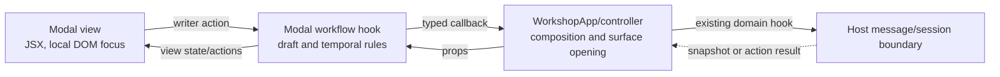

# Architecture Change Runway — Workshop Modal Workflow Ownership

**Date:** 2026-08-04  
**Status:** `READY FOR REVIEW` — deferred to a post-Sprint-03 presentation slice  
**Decision owner:** Okey  
**Scope:** Workshop overlays rendered by `WorkshopApp`, plus the two feature-widget authoring modals  
**Audience:** the maintainer planning the next presentation sprint  
**Implementation gate:** `CONDITIONAL` — Sprint 03 must first settle its own D1–D4 gate and land

## Band 0 — Change Card

### Thesis

Because several Workshop overlays contain independent local state machines alongside large JSX trees, move only the proven workflows into named, modal-local hooks while preserving host-owned truth, current message routes, draft-reset timing, and rendered behavior, so that a reviewer can locate an overlay action by filename without turning every sheet into a hook-shaped ceremony.

### Architecture moves

| Move | Before | After | Why | Confidence |
|---|---|---|---|---|
| Give modal components a named home | Most first-party overlays sit flat in `components/workshop/` | Add `components/workshop/modals/` as the sibling of `widgets/`; retain dedicated feature packages such as `schematic/` | Type/location makes surface ownership discoverable | STRONG |
| Extract six independent local workflows | State transitions live inline with modal JSX | One focused hook per proven workflow | Separate temporal behavior from rendering, not files from files | STRONG |
| Keep host transport separate | Widget transport hooks coexist with inline authoring state | Keep transport hooks; add feature-local authoring hooks | UI drafts and host correlation have different reasons to change | STRONG |
| Do not impose hooks on simple selection or display surfaces | All components could be treated uniformly because they are overlays | Keep lightweight state local | Avoid a false generic modal-controller layer | STRONG |

### Scope and highest risks

| Boundary | Highest failure mode | Risk |
|---|---|---|
| Draft reseeding | A prop or snapshot update overwrites text the writer is editing | HIGH |
| Async acknowledgement | A stale result closes or mutates the wrong authoring surface | HIGH |
| Session actions | A local rename/delete interaction bypasses the existing `useWorkshopSessions` host boundary | MODERATE |
| Folder move | Mechanical moves obscure behavioral changes in the same review | MODERATE |

### Decisions required before implementation

| ID | Decision | Recommendation |
|---|---|---|
| M1 | Is this a dedicated post-P3 slice or a standalone follow-up? | Dedicated behavior-preserving slice after P3. Do not enlarge P3's already-conditional scope. |
| M2 | Does `modals/` contain every Workshop overlay? | Yes for generic first-party overlays; leave `widgets/` and `schematic/` as feature packages. |
| M3 | Rename `WorkshopConversationBehaviorModal`? | Yes: it edits behavior, profile, and web-research settings, so `WorkshopConversationSettingsModal` tells the truth. |
| M4 | Split the two large widget modals now? | Yes, but only into feature-local authoring hooks; retain their existing host transport hooks. |

### Gate

**State:** `CONDITIONAL`. This plan makes no contract or persistence change. It may begin only after Sprint 03 closes and each extracted hook has characterization coverage for its reset, submit, and failure paths.

## Band 1 — Architecture Delta Map

### 1.1 Current shape

```text
components/workshop/
├── WorkshopConversationBehaviorModal.tsx     settings draft + host acknowledgement + tabs
├── WorkshopContextSelectorModal.tsx          browse/search/select/budget workflow
├── WorkshopInviteGuestModal.tsx              invite draft + locks + soft confirmation
├── WorkshopSessionBrowserModal.tsx           grouping + rename/delete interaction state
├── WorkshopTextSheet.tsx                     reusable text draft / delayed seed workflow
├── Workshop{ChooseHost,SaveSession,Tools,Widgets,Notice}Modal.tsx
├── Workshop{ConfirmDialog,ConfigureGuide,ModalShell}.tsx
├── schematic/WorkshopPersonaSchematicModal.tsx
└── widgets/
    ├── gesturePlayground/WorkshopGesturePlaygroundModal.tsx
    └── lexicalGravity/WorkshopLexicalGravityModal.tsx

hooks/domain/workshop/
└── widgets/
    ├── useGesturePlayground.ts                host transport and commit-result correlation
    └── useLexicalGravity.ts                   host transport and apply-result correlation
```

### 1.2 Proposed shape

```text
components/workshop/
├── modals/                                    [+] generic Workshop overlay home
│   ├── WorkshopModalShell.tsx                  [>] shared accessibility/dismiss shell
│   ├── WorkshopConfirmDialog.tsx               [>] stateless confirmation view
│   ├── WorkshopConfigureGuide.tsx              [>] read-only reference overlay
│   ├── WorkshopNoticeModal.tsx                 [>] tour view; local state remains inline
│   ├── chooseHost/WorkshopChooseHostModal.tsx  [>] simple selection remains inline
│   ├── contextSelector/WorkshopContextSelectorModal.tsx [>]
│   ├── conversationSettings/WorkshopConversationSettingsModal.tsx [>] rename
│   ├── inviteGuest/WorkshopInviteGuestModal.tsx [>]
│   ├── saveSession/WorkshopSaveSessionModal.tsx [>] simple title draft remains inline
│   ├── sessionBrowser/WorkshopSessionBrowserModal.tsx [>]
│   ├── textSheet/WorkshopTextSheet.tsx         [>]
│   ├── tools/WorkshopToolsModal.tsx            [>] simple selection remains inline
│   └── widgets/WorkshopWidgetsModal.tsx        [>] simple selection remains inline
├── schematic/WorkshopPersonaSchematicModal.tsx [=] persona-feature package stays put
└── widgets/                                    [=] feature packages stay put

hooks/domain/workshop/
├── modals/                                    [+]
│   ├── useWorkshopContextSelector.ts
│   ├── useWorkshopConversationSettings.ts
│   ├── useWorkshopInviteGuest.ts
│   ├── useWorkshopSessionBrowser.ts
│   └── useWorkshopTextSheetDraft.ts
└── widgets/
    ├── useGesturePlayground.ts                [=] host transport
    ├── useGesturePlaygroundAuthoring.ts       [+] modal-local draft/generation/commit workflow
    ├── useLexicalGravity.ts                   [=] host transport
    └── useLexicalGravityAuthoring.ts          [+] modal-local draft/preview/build/apply workflow
```

`modals/` is a component-location convention, not a generic runtime controller. The hooks are deliberately grouped by the temporal workflow they own rather than by the fact that their views happen to be overlays.

### 1.3 Inventory and recommendation

| Surface | Current local controls | Verdict | Proposed owner / reason |
|---|---|---|---|
| `WorkshopConversationBehaviorModal` (587 LOC) | Three committed-setting drafts; active tab and roving-tab focus; clear-profile confirmation; pending submission; reset-on-open; close only on matching host echo; release on error/conflict | **Extract** | `useWorkshopConversationSettings`. This is a settings transaction protocol, not just form state. Rename the component because it also edits writer profile and web research. |
| `WorkshopContextSelectorModal` (479 LOC) | Attachment selection map; browse group; query; names vs names+content mode; result filter; debounced content search; attachment/budget/cap calculations; three attach modes | **Extract** | `useWorkshopContextSelector`. It has a mode-dependent selection policy and a debounced host-search lifecycle. Keep row rendering in the component. |
| `WorkshopInviteGuestModal` (306 LOC) | Selected guest; generated opening text; writer-edited guard; default-message soft confirmation; lock reconciliation; timed attention flash | **Extract** | `useWorkshopInviteGuest`. The writer-edit preservation and live lock arrival are a coherent invitation workflow with failure-like state transitions. Keep textarea focus DOM code in the view. |
| `WorkshopSessionBrowserModal` (629 LOC) | Date/excerpt grouping; rename target/draft/cancel guard; delete confirmation; nested Escape precedence; focus-on-open | **Extract** | `useWorkshopSessionBrowser`. It owns transient browser interaction only; `useWorkshopSessions` remains the host request/action owner. |
| `WorkshopTextSheet` (387 LOC) | Text draft; edit/preview tab; one-seed-per-open guard; read-only initial tab; delayed focus; apply eligibility | **Extract** | `useWorkshopTextSheetDraft`. Its delayed-value and no-clobber contract is shared across five text-sheet modes and deserves a named, direct test seam. Keep focus refs and JSX local unless the hook API stays simpler with them included. |
| `WorkshopGesturePlaygroundModal` (873 LOC) | Full draft; source references; generation token/result filtering; menu/dictionary invalidation; selections; commit pending/result; nested model browser | **Extract** | `useGesturePlaygroundAuthoring` within the Gesture feature package. Existing `useGesturePlayground` remains the host transport/correlation hook; do not merge the two responsibilities. |
| `WorkshopLexicalGravityModal` (722 LOC) | Lens draft; field/library tabs; preview and build tokens; candidate selection/save lifecycle; apply acknowledgement; model browser | **Extract** | `useLexicalGravityAuthoring` within the Lexical feature package. Existing `useLexicalGravity` remains the host transport/correlation hook. |
| `WorkshopChooseHostModal` (134 LOC) | One selected host, reset-on-open, commit shortcut | **Keep inline** | A single ephemeral selection and one commit decision. A hook would hide a very small flow rather than isolate a state machine. |
| `WorkshopSaveSessionModal` (237 LOC) | Title, focus/select-on-open, normalization before save | **Keep inline** | One title draft with no async acknowledgement of its own; `useWorkshopSessions` and the parent already own save settlement. |
| `WorkshopToolsModal` (143 LOC) | Selected tool, reset-on-open | **Keep inline** | The shared `WorkshopSheetBrowser` already owns the view pattern; this is one selection passed to the parent. |
| `WorkshopWidgetsModal` (98 LOC) | Selected widget, reset-on-open, capability predicates | **Keep inline** | Same lightweight browser pattern as tools. The next widget adds registry data, not a modal hook. |
| `WorkshopNoticeModal` (569 LOC) | Tour page, do-not-show toggle, guide visibility | **Keep inline** | It is content-heavy (the first 413 lines are notice data/render helpers) and has only a small local tour state. Split static notice data if it grows; do not extract a controller yet. |
| `WorkshopConfirmDialog` (56 LOC) | None | **Keep inline** | Pure controlled view. Its parent controller owns the confirmation union and action semantics. |
| `WorkshopConfigureGuide` (193 LOC) | None beyond shared overlay dismissal | **Keep inline** | Read-only reference overlay; it already uses `useOverlayDismiss`. |
| `WorkshopModalShell` (98 LOC) | Shared close/focus behavior through `useOverlayDismiss` | **Keep inline** | Correct generic primitive; it must not learn feature workflows. |
| `schematic/WorkshopPersonaSchematicModal` (38 LOC) | None | **Keep in `schematic/`** | It belongs to the persona schematic feature, not a reusable generic modal family. |

### 1.4 Structural view

**Question answered:** Which owner settles a modal action without creating duplicate host state?  
**Scope:** one extracted workflow; the same division applies to each candidate.  
**Legend:** solid arrows are calls; dashed arrows are host snapshot/result updates.



The workflow hook does not post messages directly unless it is explicitly the existing feature transport hook. It receives callbacks from the current composition path, preserving the single visible message owner.

## Band 2 — Reviewer Packet

### Contracts that must survive

| Invariant | Current evidence | Required witness after extraction |
|---|---|---|
| Conversation settings reseed only on `open`, so unrelated session pushes do not erase drafts | `WorkshopConversationBehaviorModal.tsx:124-158`; component test `keeps drafts intact when an unrelated session-state push re-allocates web research` | Hook test for open-only reseed and matching host acknowledgement |
| Text sheet seeds once when delayed content arrives, then never clobbers the draft | `WorkshopTextSheet.tsx:189-203` | Hook test for delayed seed and later snapshot update |
| Context content search is debounced and only runs in names+content mode | `WorkshopContextSelectorModal.tsx:112-126` | Fake-timer hook test covering switch, clear, and close |
| A newly invalid guest selection is removed when room locks arrive | `WorkshopInviteGuestModal.tsx:129-141` | Hook test for selection followed by lock arrival |
| Session browser inline edits intercept Escape before the modal shell closes | `WorkshopSessionBrowserModal.tsx:204-219` | View or hook test for rename/delete/Escape precedence |
| Widget action results settle only the currently pending authored request | Gesture: `WorkshopGesturePlaygroundModal.tsx:178-229`; Lexical: `WorkshopLexicalGravityModal.tsx:250-324` | Feature hook tests for matching and stale tokens, success, and failure |
| Durable state remains host-owned | Existing `useGesturePlayground.ts` and `useLexicalGravity.ts` expose empty persistence; Sprint 03 runway Band 2.3 | No modal hook returns persisted state other than `{}` |

### Ranked findings

| ID | Severity | Finding | Smallest safe response |
|---|---|---|---|
| F1 | HIGH | The Gesture and Lexical modals contain their own async authoring protocols in addition to the existing host transport hooks. | Add feature-local authoring hooks; preserve the existing transport hooks and their result-correlation tests. |
| F2 | HIGH | Conversation settings and text-sheet drafts have deliberate anti-clobber timing rules that are easy to break during JSX editing. | Extract and characterize the hook lifecycle before moving rendering. |
| F3 | MEDIUM | Context selector and invite guest each combine independent, mode-sensitive workflow rules with several rendering concerns. | Move their state/reducer-like actions into modal hooks, leaving cards/rows and focus presentation in components. |
| F4 | MEDIUM | Session browser's local rename/delete semantics are distinct from `useWorkshopSessions`' host request and action settlement. | Add a UI-only browser hook; do not move filesystem/query/action transport into it. |
| F5 | LOW | Several lightweight overlays look structurally similar but do not have independent workflow state. | Move them under `modals/` if M2 is accepted, but retain their local selection state and avoid hooks. |

**What survived.** The existing transport boundary is sound: both widget hooks own outbound messages and request-token correlation, while modal code currently owns ephemeral authoring state. The extraction must sharpen that seam, not reunify it.

### Alternatives

| Alternative | Verdict |
|---|---|
| Leave every modal as-is | Reject: the seven recommended candidates already have time-dependent behavior hidden among hundreds of render lines. |
| One generic `useWorkshopModal` | Reject: it would need unions for settings, context, invitation, sessions, text, and two widgets—an abstraction doing theater, not work. |
| Extract only the seven proven workflows, keep simple overlays local | **Recommend.** Clear ownership without manufacturing a framework. |

### Deferred implementation slices

| Slice | Work | Verification |
|---|---|---|
| 0 — characterization | Freeze candidate behavior with existing component tests plus direct hook tests for reset, stale reply, cancellation, and failed acknowledgement paths | Focused modal suites before/after; no visual changes |
| 1 — generic modal package | Create `components/workshop/modals/` and mechanically move generic overlays/tests/imports | Typecheck, import path audit, unchanged focused tests |
| 2 — non-widget workflows | Extract conversation settings, context selector, invite guest, session browser, and text-sheet hooks one at a time | Each hook's lifecycle tests plus its component suite |
| 3 — feature authoring workflows | Add Gesture and Lexical authoring hooks within their feature packages | Existing token/action-result suites plus new stale-token and draft-reset hook tests |
| 4 — closure | Rename conversation-behavior surface, run a filename-first traceability audit | Full Workshop presentation test set, typecheck, lint, build, `git diff --check` |

### Re-plan verdict

**Verdict:** `REFINED`

**Initial plan:** Put every Workshop modal behind its own hook.

**Final plan:** Create a modal folder for generic overlay location, but extract hooks only for seven independently changing workflows. Keep widget transport distinct from widget authoring, and leave simple selection/display surfaces local.

**What changed and why:** Inspection showed that `WorkshopModalShell` already delegates generic dismissal, the tool/widget/host/save surfaces have only ephemeral selection or title state, and the widget hooks already own transport. The real seams are the workflows with reset, correlation, locking, or mode-dependent rules.

## Reader Terms Appendix

| Term | Local meaning |
|---|---|
| Modal workflow hook | A hook that owns one overlay's local draft and temporal rules. It does not become a generic modal framework or a persistence owner. |
| Host transport hook | Existing widget hooks that post messages, receive result messages, and correlate request tokens. Distinct from the modal's local authoring workflow. |
| Open-only reseed | Resetting a draft only when a surface opens, rather than when any snapshot prop gains a new object identity. It protects in-progress writer edits. |
| Authoring modal | A pre-commit feature surface such as Gesture Playground or Lexical Gravity, where the writer prepares a draft before the host commits it to room truth. |
