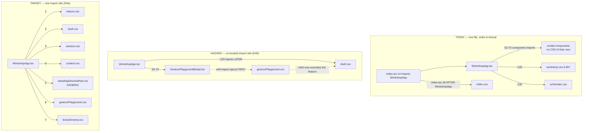
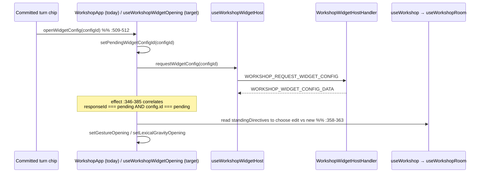

# Architecture Change Runway — Sprint 03: Presentation Responsibility Extraction

**Subject:** [`.todo/epics/epic-workshop-architecture-refactor-2026-08-03/sprints/03-presentation-responsibility-extraction.md`](../../.todo/epics/epic-workshop-architecture-refactor-2026-08-03/sprints/03-presentation-responsibility-extraction.md)

**Branch:** `sprint/workshop-architecture-refactor-03-presentation` → `epic/workshop-architecture-refactor` (Sprint 00 = PR #101, Sprint 01 = PR #102, Sprint 02 = PR #103, all merged; branch point `4d88d35`)

**Altitude:** One sprint. The epic arc, the ADR, and the fitness-witness design are settled in the [epic runway](2026-08-03-workshop-refactor-epic-runway.md), the [semantic runway](2026-08-03-workshop-module-semantic-runway.md), the [Sprint 01 runway](2026-08-03-workshop-sprint-01-feature-slice-runway.md), and the [Sprint 02 runway](2026-08-03-workshop-sprint-02-shared-ownership-runway.md), and are not re-derived here. This runway asks only: *what does P3 actually still have to build, and what protects the writer's eyes while it does?*

Repository-specific vocabulary is defined in the [Reader Terms Appendix](#band-5--reader-terms-appendix).

**Audience / task:** Decision owner (Okey) opening the P3 gate; implementer sequencing the moves.

**Date:** 2026-08-04 · **Status:** `READY FOR REVIEW` · **Implementation gate:** **CONDITIONAL** — four decisions (D1–D4) required before slicing

---

## Band 0 — Change Card (30 seconds)

### Thesis

Because `WorkshopApp.tsx` (1,767 lines) and `useWorkshop.ts` (1,036 lines) are the two hottest files in the repository (75 and 39 commits since 2026-05-01) and each holds several independent workflow state machines, change **presentation workflow ownership and stylesheet ownership** so that every UI action traces through one named hook or controller, while preserving **host-owned durable truth, the empty-persistence contract, every rendered pixel, and the assembled cascade order**, so that **a reviewer can find the owner of an action by filename and the next Workshop feature can add a surface without editing the room shell.**

### Architecture moves

| # | Move | Before | After | Confidence |
|---|---|---|---|---|
| 1 | Room hook split | `useWorkshop.ts` — 1,036 lines, 16 session-scoped state fields beside room/thread/context/streaming state | `useWorkshopRoom.ts` [+] and `useWorkshopSessions.ts` [+]; `useWorkshop` **retired** (D2) | STRONG |
| 2 | Named-session + scope + context-sheet + widget-opening controllers | 8 `useState` clusters and ~500 lines of callbacks inline in `WorkshopApp` (`:198-215`, `:506-1023`) | Named presentation controllers; `WorkshopApp` keeps shell, route composition, layout | MODERATE — D3 sets how many |
| 3 | Widget host confirmation, **not** creation | Sprint scope reads "Establish `useWorkshopWidgetHost`" | **Already exists** (`useWorkshopWidgetHost.ts`, 75 lines, witnessed at `boundaries.test.ts:329-341`). Scope is restated as two new hooks (**F1**) | STRONG |
| 4 | Fitness witness #5 installed, not earned | Epic phase table assigns #5 ("no feature async state in the room hook") to P3 as work | The invariant is **already true** — `useWorkshop.ts` contains zero Gesture/Lexical/widget references. P3 installs the guard (**F2**) | STRONG |
| 5 | Stylesheet split by responsibility with a pinned **import site** | `workshop.css`, 6,367 lines, 5 chronological banner tiers | 5–6 responsibility files, all imported from one composition point in documented order (**F4**) | MODERATE |

### Scope and highest risks

| Affected boundary | Why affected | Highest failure mode | Risk |
|---|---|---|---|
| `WorkshopApp` orchestration | 8 modal state fields, 4 workflow clusters, ~40 callbacks move | **There is no test file for `WorkshopApp.tsx`.** The largest behavioral surface in the sprint has manual inspection as its only witness (**F3**) | **HIGH** |
| Assembled CSS cascade | 6,367 lines split into N files under `style-loader` | Co-locating a feature stylesheet *and* importing it from its component silently moves it **before** the shell tier (**F4**) | **HIGH** |
| `useWorkshop` split | 1,036 lines → two hooks | `resetSession` / `handleSessionActionResult` mutate **room** state (`turns`, `totalTurns`) from inside the **sessions** workflow; the rollback contract crosses the proposed seam (**F7**) | MODERATE |
| Concurrent ownership | Semantic runway open question 5 is unresolved: *which presentation files, if any, are owned by Claude Design?* | Two lanes editing the repository's three hottest files (**F5**) | MODERATE–HIGH |
| Generic/feature CSS boundary | A generic block ("Standing rail + auditable thread markers — generic shell") sits inside the Lexical banner at `workshop.css:6251` | A banner-boundary split ships generic standing styles inside `lexicalGravity.css` — P2's false-generic error, repeated in CSS (**F6**) | MODERATE |
| Wire contracts / persistence / handlers | — | **None.** P3 is presentation-only; no message, payload, route, schema, or `extension.ts` change is implied | LOW |
| Message routing | `useWorkshopAppMessageRouter` (119 lines, 30 routes) already owns route composition and has a test | None — this half of "route composition" landed before P3 | LOW |

### Human decisions required

| ID | Decision | Options | Recommendation | Needed by |
|---|---|---|---|---|
| **D1** | What witnesses `WorkshopApp`'s extraction? | (a) a characterization test on the extracted controllers only; (b) (a) **plus** a first `WorkshopApp.test.tsx` render/smoke test; (c) manual visual pass only, as written | **(b)** — the criterion "a manual visual pass records no regression" is not a witness; nothing reads it after the sprint. A render test that mounts the shell with a stubbed message port and asserts each surface appears is cheap and permanent. | slice 0 |
| **D2** | `useWorkshop`: retire or facade? | (a) retire — split into `useWorkshopRoom` + `useWorkshopSessions`, re-point the 1,115-line test file; (b) keep a named facade with a removal plan | **(a) retire.** It has exactly **two** production references — `WorkshopApp.tsx:115` and a *type-only* import at `useWorkshopAppMessageRouter.ts:15`. A facade would exist to serve one test file, and the alpha rules forbid compatibility shims. | slice 1 |
| **D3** | How many presentation controllers? | (a) three (`sessions`, `contextSheet`, `widgetOpening`) with scope transitions staying inline; (b) four, adding a scope/path controller; (c) one per modal | **(a) three.** The sprint says "extract modal subcontrollers **only where independent workflow state proves the seam**." Scope transitions are two one-line posts (`WorkshopApp.tsx:797-804`) with no state of their own; a controller there is ceremony. | slice 2 |
| **D4** | Where are feature stylesheets **imported** from? | (a) all Workshop stylesheets imported from the single composition point in documented order, files co-located by feature; (b) each component self-imports its own stylesheet | **(a).** Precedent exists in-repo: `schematic.css` lives beside its component yet is imported at `WorkshopApp.tsx:130`, after `workshop.css`. Option (b) injects feature CSS before the shell tier because component imports sit at `WorkshopApp.tsx:52-73`. | slice 4 |

### Gate

**State:** `CONDITIONAL` · **Blockers:** D1–D4 unanswered; **F5** (concurrent-ownership assignment) unrecorded. No `CRITICAL` unknown. Nothing in this sprint touches persistence, wire contracts, or the composition root, so the epic's locked constraints 2–6 are untouched by construction.

---

## Band 1 — Architecture Delta Map (~2 minutes)

### 1.1 Affected subtree — before

*`wc -l` at branch point `4d88d35`.*

```text
packages/core/src/presentation/webview/
├── WorkshopApp.tsx                                 1,767  ⚠ shell + 8 modal states + 4 workflow clusters
│                                                          :198-215 modal state · :307-417 six effects
│                                                          :506-1023 ~40 workflow callbacks · :1064+ layout
├── workshop.css                                    6,367  ⚠ 5 chronological banner tiers, one conflict surface
├── components/workshop/                                   ✅ already symmetric (Sprint 01)
│   ├── schematic/schematic.css                       256  ✅ co-located file, imported at WorkshopApp:130
│   └── widgets/{gesturePlayground,lexicalGravity}/         ✅ feature modals in named packages
├── hooks/
│   ├── useWorkshopAppMessageRouter.ts                119  ✅ 30 routes, tested — route composition already out
│   ├── useWorkshopThreadAutoscroll.ts                 25  ✅ tested
│   └── domain/
│       ├── useWorkshop.ts                          1,036  ⚠ room + thread + context + streaming + 16 session fields
│       ├── useWorkshopExcerptVerify.ts                91  ✅
│       └── workshop/
│           ├── useWorkshopWidgetHost.ts              75  ✅ EXISTS — sprint scope says "establish" (F1)
│           ├── useWorkshopStandingDirectives.ts     176  ✅ landed in P2
│           └── widgets/use{GesturePlayground,LexicalGravity}.ts  ✅ landed in P1/P2
└── __tests__/.../WorkshopApp.test.tsx              ABSENT  ⚠ the file being halved has no test (F3)
```

### 1.2 Target subtree

Legend: `[+]` add · `[~]` modify · `[>]` move/rename · `[-]` remove · `[=]` unchanged boundary

```text
packages/core/src/presentation/webview/
├── WorkshopApp.tsx                                 [~] shell + route + layout composition (≈1,767 → ≈900–1,050)
│                                                       keeps: hook composition, persistence composition,
│                                                       error boundaries, layout JSX, stylesheet import order
├── styles/workshop/                                [+] (D4) one import site, documented order
│   ├── tokens.css                                  [>] from workshop.css:1-95      — surface tokens
│   ├── shell.css                                   [>] :96-3700                    — header/rail/thread/composer
│   ├── session.css                                 [>] :4504-5535                  — menu/browser/notices/guide
│   ├── context.css                                 [>] :3701-4503                  — open chat, scope, sheets
│   └── (feature CSS co-located, see below)
├── components/workshop/
│   ├── schematic/schematic.css                     [=] the precedent D4 generalizes
│   ├── standingDirectiveRail.css                   [+] workshop.css:6251-6367 — GENERIC, not Lexical (F6)
│   └── widgets/
│       ├── gesturePlayground/gesturePlayground.css [>] :5536-6110
│       └── lexicalGravity/lexicalGravity.css       [>] :6111-6250
├── hooks/domain/workshop/
│   ├── useWorkshopRoom.ts                          [+] thread, streaming, scope, context, participants, status
│   ├── useWorkshopSessions.ts                      [+] browser, named-session actions, save status, rollback
│   ├── useWorkshopWidgetHost.ts                    [=] already correct (F1)
│   └── controllers/                                [+] (D3)
│       ├── useWorkshopSessionSurfaces.ts           [+] menu/save/browser/confirm state + shortcuts
│       ├── useWorkshopContextSheet.ts              [+] the shared Edit│Preview sheet workflow
│       └── useWorkshopWidgetOpening.ts             [+] launch / recommend / reopen-by-config-id
├── hooks/domain/useWorkshop.ts                     [-] retired (D2)
└── __tests__/presentation/webview/
    ├── WorkshopApp.test.tsx                        [+] (D1) shell render witness
    ├── hooks/domain/workshop/useWorkshopRoom.test.ts      [>] from useWorkshop.test.ts
    └── hooks/domain/workshop/useWorkshopSessions.test.ts  [>] from useWorkshop.test.ts
```

**The shape of the change in one line:** P1 and P2 moved *feature* behavior into named slices; P3 moves *workflow* behavior into named owners — and the only genuinely new risk it carries is that the writer's eyes, not a type-checker, are the current acceptance test.

### 1.3 Responsibility ledger — what changes hands

| Module | Before | After | Ownership delta | Pattern / smell |
|---|---|---|---|---|
| `WorkshopApp` | Shell + layout **+ 8 modal state machines + toast + confirm + text sheet + widget opening + keyboard shortcuts + session-result fan-out** | Shell, hook composition, persistence composition, error boundaries, layout, stylesheet order | Sheds four workflow state machines | *God component* reduced to composition root of the surface |
| `useWorkshop` | Room + thread + streaming + context + participants **+ 16 session-browser fields** | — (retired, D2) | Split in two | *Use-case scattergories* resolved |
| `useWorkshopRoom` [+] | — | Thread, streaming, scope/shelf, context attachments, participants, todos, status/error | Gains the durable-mirror half | Host-mirror hook; `persistedState` stays empty by the same reasoning as today (`useWorkshop.ts:266-272`) |
| `useWorkshopSessions` [+] | — | Browser list + request-id staleness, named-session actions, save status, action-result settle, reset rollback | Gains the named-session half | Correlated-request hook; must declare its dependence on room state (**F7**) |
| `useWorkshopSessionSurfaces` [+] | — | Menu/save/browser/confirm open state, `⌘S` / `⌘⇧N`, mutual exclusion between the three session surfaces | Gains surface state from `WorkshopApp:209-212`, `:568-635`, `:1024-1062` | Modal subcontroller — the seam is proved by `sessionConfirm`'s four-variant union |
| `useWorkshopContextSheet` [+] | — | `textSheet` mode/seed/attachmentId, late-reply matching, apply/verify routing | Gains `WorkshopApp:663-843` | Modal subcontroller — the seam is proved by the late-reply correlation at `:828-831` |
| `useWorkshopWidgetOpening` [+] | — | Gesture/Lexical opening unions, `pendingWidgetConfigId`, the reopen effect | Gains `WorkshopApp:200-204`, `:346-385`, `:509-563` | Modal subcontroller — the seam is proved by the async config round-trip |
| `useWorkshopWidgetHost` | Widget-config request/response | **unchanged** | none | Already correct (**F1**) |
| `useWorkshopAppMessageRouter` | 30 routes, typed on `UseWorkshopReturn` | Retyped on the two new hooks | Type surface only | Already the right shape |
| `workshop.css` | One 6,367-line conflict surface | Five-to-seven responsibility files with a pinned import order | Splits ownership, **not** cascade | Removes a *merge hotspot* (70 commits) |

### 1.4 Structural view — where the cascade is actually decided

**Question:** after the stylesheet split, what determines which rule wins?
**Scope:** webview stylesheet assembly only. **Legend:** solid = injection order under `style-loader`; dashed = the hazard D4 closes.



**Reading it:** `webpack.config.js:82-85` uses `style-loader`, which injects one `<style>` per module in **module-evaluation order**. Import *site* — not file location — sets cascade position. The dashed path is the whole reason the sprint's order bullet exists, and the repo already has the answer in `schematic.css`.

### 1.5 Representative runtime flow — reopening a committed widget config

The single richest workflow in the sprint, because it is asynchronous, correlated, and currently spread across three regions of `WorkshopApp`.



**Notable change:** the correlation is already exact (id-matched on both sides) and must survive the move verbatim. But note the cross-hook read at `:358-363`: the widget-opening controller must consume `standingDirectives` from the room hook. That dependency direction (controller → room) is fine; the reverse would not be. It is the second place, after **F7**, where the new owners are not independent.

### 1.6 Blast-radius summary

| Dimension | Direct | Indirect | Main failure | Witness | Risk |
|---|---|---|---|---|---|
| Structure | 1 file retired, 6–7 hooks/controllers added, 5–7 CSS files | `useWorkshopAppMessageRouter` retype; test file split | Compile error | `tsc` × 3 projects | LOW |
| Runtime (behavior) | 4 workflow state machines change owner | Every modal, the toast, the confirm dialog, keyboard shortcuts | A moved effect fires at a different time and a modal fails to close or reopens | `useWorkshop.test.ts` covers the hook half; **nothing covers the `WorkshopApp` half** (**F3**) | **HIGH** |
| Visual / cascade | 6,367 CSS lines change file | Every Workshop pixel | A reordered tier silently changes one rule's winner | Byte-identity concatenation test (proposed, **W1**) + manual pass | **HIGH → LOW with W1** |
| Contract (wire) | **None** | — | — | — | LOW |
| Data / persistence | **None** — host owns all durable truth; `persistedState` stays empty | — | — | `usePersistence` composition + hook contracts | LOW |
| Operations / security | **None** — no configuration, permission, secret, trust boundary, or logging change | — | — | — | LOW |
| Verification | `useWorkshop.test.ts` (1,115 lines) splits; new hook tests; witness #5 installs | Existing 24 Workshop component tests unaffected | Vacuous green after a mechanical test split | slice-0 characterization run before any move | MODERATE |
| Coordination | The three hottest files in the repo (75 / 70 / 39 commits) all change | Paused Conversation Widgets branches rebase | Unresolvable merge if a second lane edits concurrently (**F5**) | explicit ownership record | MODERATE–HIGH |
| Evolution | The next Workshop surface gets a named home instead of `WorkshopApp` | — | — | filename-first traceability check | **HIGH — intended** |

**Confidence:** structural, contract, persistence, and operational conclusions are STRONG (direct anchors; nothing to change). Runtime and visual conclusions are MODERATE and depend entirely on whether D1 and **W1** are accepted.

---

## Band 2 — Reviewer Packet (~10 minutes)

### 2.1 The real job of this sprint

P3 is the first phase whose primary risk is **invisible to the type-checker**. P1 moved files, P2 changed contracts — both had `tsc` and route witnesses standing behind them. P3 moves React state machines and CSS rules, and the compiler is indifferent to whether a `useEffect` now fires one render later or whether a rule lost a cascade fight by two hundred lines.

So the sprint's real job is not "make `WorkshopApp` smaller." It is: **build the witnesses that make a presentation refactor reviewable, then do the refactor behind them.** The completion criteria as written invert that order — they end with "a manual visual pass records no regression," which is an activity, not a witness. Nothing reads it after the sprint closes.

Its success metric: **after P3, a reviewer names the owner of any Workshop UI action from the filename alone, and a second reviewer can re-run the sprint's own regression evidence without the first reviewer present.**

### 2.2 Declared intent vs observed behavior

| Topic | [Declared] | [Observed] | [Inferred] / decision state |
|---|---|---|---|
| "Establish `useWorkshopRoom`, `useWorkshopSessions`, and `useWorkshopWidgetHost`" | Sprint scope line 16 | `useWorkshopWidgetHost.ts` exists at 75 lines and is already witnessed (`boundaries.test.ts:128-131`, `:329-341`) | Two of three are new. Restate the scope so completion is reviewable (**F1**) |
| Witness #5, "no feature async state in the room hook", is P3 work | Epic phase table row 3 | `grep -niE "gesture\|lexical\|widget" useWorkshop.ts` → **zero matches** | The invariant is already true. P3 **installs the guard**; it does not perform an extraction to earn it (**F2**) |
| "`WorkshopApp` contains composition rather than independent workflow state machines" | Completion criterion 1 | `:198-215` — 8 modal state fields; `:589-595` — a four-variant confirm union; `:663-665` — the text-sheet union; `:816` — draft seed; `:215` — toast | Straightforward; D3 sets the number of owners |
| "`useWorkshop` is retired **or** reduced to an intentionally named compatibility facade" | Completion criterion 2 | Exactly two production references: `WorkshopApp.tsx:115` (value) and `useWorkshopAppMessageRouter.ts:15` (type only) | A facade would serve one test file. **D2 recommends retire.** Alpha rules forbid shims |
| "Feature styles live with feature surfaces" | Completion criterion 3 | `schematic.css` already does exactly this, imported at `WorkshopApp.tsx:130` | The criterion is about **file location**; the risk is about **import site**. D4 separates them (**F4**) |
| "The assembled stylesheet follows token → shell → session → context → feature order" | Completion criterion 4 | Today the order is chronological-by-sprint: A `1-3700` tokens+shell · B `3701-4503` open-chat/scope · C `4504-5535` sessions/notices/guide · D `5536-6110` gesture · E `6111-6367` lexical | The declared order **re-sequences B and C**. That is a real cascade change, not a relabeling — and it is exactly what W1 must prove safe |
| "A manual visual pass records no regression" | Completion criterion 5 | No visual-regression tooling exists; `docs/` has no precedent format for a recorded visual pass | An unwitnessed signal. **D1** adds something a later reviewer can re-run |
| "Representative UI actions are traceable by filename without broad search" | Completion criterion 6 | Achievable and the point of the sprint | Make it executable: name the actions in the sprint doc and check them at close-out |
| Phase 3 also "moves widget components into symmetric feature packages" | Semantic runway P3 bullet 4 | Already done in Sprint 01 — `components/workshop/widgets/{gesturePlayground,lexicalGravity}/` | Only the **stylesheets** remain from that bullet |

### 2.3 Contracts and invariants

| Contract / invariant | Current owner | Target owner | Change? | Failure if broken | Witness |
|---|---|---|---|---|---|
| Session is host truth; webview persists nothing durable | `useWorkshop.ts:266-272` (`persistedState` deliberately empty) | Both new hooks | **no — must not change** | A stale webview copy shadows the aggregate | Hook contract + `usePersistence` composition |
| Every domain hook returns `persistedState` (Tripartite Interface) | All 20 domain hooks | unchanged | no | Persistence composition breaks silently | `CLAUDE.md` pattern + hook tests |
| Live-run identity is ONE tracker `{requestId, phase}` with a ref mirror | `useWorkshop.ts:363-368` | `useWorkshopRoom` | **no — must not change** | Thread flickers text → spinner → turn (regression of PR #67 review #16) | `useWorkshop.test.ts:615-685` |
| Only the newest session-browser response paints | `useWorkshop.ts:748-751` (request-id ref) | `useWorkshopSessions` | no | A stale list overwrites a newer one | `useWorkshop.test.ts:238` |
| The active named-room identity survives a filtered browser search | `useWorkshop.ts:759-771` | `useWorkshopSessions` | no | Header name disappears during search | `useWorkshop.test.ts:284` |
| Reset rollback restores the exact client-side window on failure | `useWorkshop.ts:349-352`, `:595-610`, `:777-785` | **crosses the seam** — see **F7** | **no, but ownership must be decided** | New session silently loses the visible thread on host failure | `useWorkshop.test.ts:796` |
| A late attachment reply never paints into a reopened sheet | `WorkshopApp.tsx:828-831` | `useWorkshopContextSheet` | no | Wrong body appears in the open sheet | none today — add with the controller |
| A widget-config reply is matched on both `responseId` and `config.id` | `WorkshopApp.tsx:350-353` | `useWorkshopWidgetOpening` | no | Wrong widget opens | none today — add with the controller |
| Only one of {sessions menu, save modal, browser} is open | `WorkshopApp.tsx:574-586` | `useWorkshopSessionSurfaces` | no | Two stacked session surfaces | new controller test |
| Assembled cascade order | textual position in `workshop.css` | import order at one composition point | **yes — mechanism changes, result must not** | Silent visual regression anywhere | **W1** byte-identity test |
| `packages/core` free of `vscode`; core never imports the app | `boundaries.test.ts:240` | unchanged | no | Boundary regression | live witness |

### 2.4 Negative space

| Generic owner | May know | Must not know | Next-surface edit surface | Verdict |
|---|---|---|---|---|
| `WorkshopApp` [~] | Which hooks exist, layout, error boundaries, stylesheet order | How any single workflow settles its async state | Compose one more hook | **Healthy after the extraction** |
| `useWorkshopRoom` [+] | Thread, streaming, scope, context, participants, host status | Named-session browser mechanics; any widget family | none | **Healthy if F7 is resolved in the right direction** |
| `useWorkshopSessions` [+] | Session summaries, request correlation, action results | Turn content semantics, streaming, personas | none | **Conditional** — it currently needs `turns`/`totalTurns` for rollback (**F7**) |
| `useWorkshopWidgetOpening` [+] | Widget ids, config ids, opening unions, `standingDirectives` for edit-vs-new | Gesture menu state, Lexical lens grammar | one opening arm per new widget | **Healthy** — it already dispatches on `widgetId` only (`:355-363`, `:518-529`) |
| `styles/workshop/shell.css` [+] | Surface chrome, rail, thread, composer | Any `.pm-ws-gesture-*` or `.pm-ws-lg-*` selector | none | **Healthy** |
| `standingDirectiveRail.css` [+] | Generic standing rail + thread markers | Lexical summary formatting | one entry per standing family | **Healthy — and only if F6 is honored.** Today these rules live inside the Lexical banner (`workshop.css:6251`) |
| `useWorkshopWidgetHost` [=] | Config request/response | Feature draft shapes | none | **Already healthy** |

### 2.5 Quality scenarios

| Type | Source | Stimulus | Environment | Artifact | Expected response | Response measure |
|---|---|---|---|---|---|---|
| Change | Maintainer | "Where does the save-session modal close?" | Post-P3 | repo | One filename answers it | Named in the close-out traceability list; no cross-file search |
| Change | Feature implementer | A third widget family adds an opening arm | After P7 | `useWorkshopWidgetOpening` | One union arm, one branch | Zero edits to `WorkshopApp` |
| Change | Designer | A Gesture-only style tweak | Post-P3 | `gesturePlayground.css` | One feature file changes | Zero lines in shell/session/context files |
| Failure | Implementer | The CSS split reorders one rule | Build | assembled stylesheet | Test fails naming the moved bytes | **W1**: concatenating the split files in documented order equals the pre-split file byte-for-byte (banner headers excluded) |
| Failure | Implementer | A feature stylesheet is imported by its own component | Build | injection order | Guard fails | **W2**: no `.css` import outside the declared composition point (and `index.tsx`) |
| Failure | Host | `WORKSHOP_SESSION_ACTION_RESULT` reports `ok: false` for `new` | After optimistic clear | `useWorkshopSessions` | The exact prior thread window is restored | `useWorkshop.test.ts:796`, re-pointed |
| Failure | Host | A late `WORKSHOP_CONTEXT_ATTACHMENT_CONTENT` arrives for a closed pill | Sheet reopened on another pill | `useWorkshopContextSheet` | Ignored | New controller test (no coverage today) |
| Failure | Contributor | Feature async state is reintroduced into the room hook | Build | `useWorkshopRoom` | Architecture test fails | **W3** = fitness witness #5 |
| Runtime | Writer | `⌘S` while a run is in flight | Active response | session surfaces | No save modal | Controller test over `sessionMutationsDisabled` (`WorkshopApp.tsx:1037-1046`) |
| Runtime | Writer | Reopens a Lexical config that is currently standing | Directive active | widget opening | `kind: 'edit'`, not `'new'` | `WorkshopApp.tsx:358-363` behavior, moved verbatim + tested |

**Sensitivity point:** **D1.** It decides whether this sprint's regression evidence outlives the sprint.
**Tradeoff point:** **D4.** Co-located import sites read better and are the React idiom; a single import site is the only one that pins the cascade. The sprint's own order invariant forces (a).
**Risk theme:** every invariant that P3 must preserve in `WorkshopApp` is currently enforced by *nothing but the code being in one place*. Splitting the file is precisely the act that removes that enforcement, which is why the witnesses have to land first.

### 2.6 Alternatives

| Alternative | Shape | Benefits | Costs / risks | Verdict |
|---|---|---|---|---|
| **Minimal patch** | Split `useWorkshop` only; leave `WorkshopApp` and `workshop.css` alone | Smallest diff; fully covered by the existing 1,115-line test | Criteria 1, 3, 4, 5, 6 unmet; the god component and the 6,367-line merge hotspot survive into P4–P7, where handler and session extraction will collide with them | **Rejected** |
| **Recommended** | Witnesses first (W1–W3 + D1's render test), then hook split, then three controllers, then the stylesheet split behind W1 | Every criterion met; the two highest risks get executable witnesses; retires `useWorkshop` cleanly | Touches the three hottest files at once; requires **F5**'s ownership answer first | **Retained** |
| **More generalized** | Also introduce a Workshop presentation context/provider so controllers stop being prop-threaded through `WorkshopApp` | Removes prop drilling through the layout | Changes how *every* component receives state — a re-render-semantics change disguised as a refactor, with no test net and no ADR. Directly contradicts "no visual redesign disguised as component movement" | **Rejected for P3** — revisit at P6 if prop threading actually hurts |

### 2.7 Principle and quality tensions

| Principle | Status | Support | Tension | Consequence | Witness |
|---|---|---|---|---|---|
| Responsibility / cohesion | `VIOLATION` → `STRONG` | Four independent workflow state machines get named owners | More files to open for a cross-workflow change (e.g. confirm-then-open-sheet, `:701-725`) | A few flows legitimately span two owners | close-out traceability list |
| Naming truthfulness | `TENSION` → `STRONG` | `useWorkshop` is a catch-all name for a room+sessions hook | Retiring it renames every import in a 1,115-line test | One mechanical commit | D2 |
| Change isolation / evolvability | `TENSION` → `STRONG` | Feature styles stop sharing a 6,367-line conflict surface (70 commits) | The split lands on the branch with the most concurrent-edit exposure | Merge cost is front-loaded into this sprint | **F5** ownership record |
| Testability | `VIOLATION` | `useWorkshop.test.ts` is a genuine 40-case net | `WorkshopApp.tsx` has **no test at all**, and the sprint's only stated witness for it is a manual pass | The riskiest half of the change is unverifiable after the fact | **D1(b)** |
| Reliability (async correlation) | `ACCEPTABLE` | Both async correlations in `WorkshopApp` are already exact (`:350-353`, `:828-831`) | Neither is tested; a move could weaken either silently | Wrong body or wrong widget paints | new controller tests |
| Open/closed | `ACCEPTABLE` → `STRONG` | A new surface adds a hook, not a `WorkshopApp` edit | Layout JSX still changes for a genuinely new surface — correct and unavoidable | — | reproduction test §3.3 |
| Observability | `UNKNOWN` | Webview errors post `WEBVIEW_ERROR` through the boundary (`:420-433`) | A CSS cascade regression produces **no signal at all** — no error, no log, no failing test | Visual regressions are found by the writer, later | **W1** is the only mechanism that turns this into a signal |

### 2.8 Ranked findings

| ID | Sev | Finding | Evidence | Smallest fix | Blocks |
|---|---|---|---|---|---|
| **F3** | **HIGH** | The file the sprint exists to halve has **no test**, and the sprint's stated witness for it is a manual visual pass — an activity nobody can re-run. Every invariant `WorkshopApp` holds today is enforced only by the code being in one place; splitting it is exactly what removes that enforcement. | No `WorkshopApp.test.tsx` anywhere under `packages/core/src/__tests__/presentation/`; 24 sibling Workshop component tests exist, and `useWorkshop.test.ts` is 1,115 lines — so the gap is specific to this file, not the layer. `WorkshopApp.tsx` has 75 commits since 2026-05-01, the highest in the repo. Sprint completion criterion 5 names only a manual pass. | **D1(b)**: add `WorkshopApp.test.tsx` in slice 0 that mounts the shell against a stubbed message port and asserts each surface renders and each modal opens/closes; add per-controller tests as they are extracted. | slice 0 |
| **F4** | **HIGH** | The stylesheet invariant is written as a *file-ownership* rule but is actually an *import-site* rule. Co-locating a feature stylesheet and importing it from its own component silently injects it **before** the shell tier, inverting the documented order. | `webpack.config.js:82-85` uses `style-loader` (injects one `<style>` per module in evaluation order). `WorkshopApp.tsx:52-73` imports the modal components; `:129-130` imports the stylesheets — so a component self-import evaluates first. The repo already solved this: `components/workshop/schematic/schematic.css` is co-located but imported at `WorkshopApp.tsx:130`. | **D4(a)**: file location is per-feature, import site is one composition point in documented order. Add **W2**: no `.css` import outside that point and `index.tsx`. | slice 4 |
| **F5** | **MED–HIGH** | The semantic runway's open question 5 — *which presentation-refactor files, if any, are owned by Claude Design?* — is still unrecorded, and Sprint 03 is the sprint that touches all three of the repository's hottest files. | `2026-08-03-workshop-module-semantic-runway.md:385` (open question), `:232` and `:848` (concurrent-work rule requiring explicit file ownership before parallel presentation work). Churn since 2026-05-01: `WorkshopApp.tsx` 75, `workshop.css` 70, `useWorkshop.ts` 39. | Record the answer in the sprint doc's coordination section before slice 1. If any file is co-owned, sequence it rather than sharing it. | slice 0 |
| **F1** | **MED** | One third of the sprint's named scope is already built. "Establish `useWorkshopRoom`, `useWorkshopSessions`, and `useWorkshopWidgetHost`" reads as three new hooks; the third landed in P1/P2 and is already witnessed. | `presentation/webview/hooks/domain/workshop/useWorkshopWidgetHost.ts` — 75 lines, full Tripartite shape; `boundaries.test.ts:128-131` pins its path and `:329-341` witnesses that feature hooks do not own generic config lookup; `useWorkshopWidgetHost.test.ts` exists. | Restate scope line 16 as "establish `useWorkshopRoom` and `useWorkshopSessions`; confirm `useWorkshopWidgetHost`'s ownership is complete." | slice 0 |
| **F2** | **MED** | Fitness witness #5 is listed as P3 work, but the invariant it guards is **already true** — so the sprint could spend effort "achieving" a criterion that P1/P2 already delivered, or worse, justify churn with it. | `grep -niE "gesture\|lexical\|widget" packages/core/src/presentation/webview/hooks/domain/useWorkshop.ts` → zero matches. Gesture state moved to `useGesturePlayground` (P1) and standing correlation to `useWorkshopStandingDirectives` (P2). The epic phase table still assigns #5's installation to P3. | Install #5 as a guard over `useWorkshopRoom`/`useWorkshopSessions` in slice 1 and record in the sprint doc that the invariant pre-dates the sprint. | slice 1 |
| **F6** | **MED** | A naive banner-boundary CSS split ships **generic** standing-rail styles inside `lexicalGravity.css` — the exact false-generic error P2 just corrected on the handler side, reproduced in the stylesheet. | `workshop.css:6111` opens the Lexical Gravity banner; `:6251` inside it reads "Standing rail + auditable thread markers — **generic shell**, amber lifetime"; `:6311` "Committed-turn chip + persona recommend chip (both presentation-only)". These are family mechanics under a feature heading. Compare `WorkshopStandingDirectiveRail.tsx`, which P2 made generic on both sides. | Split `:6251-6367` into `standingDirectiveRail.css` beside its generic component, not into `lexicalGravity.css`. | slice 4 |
| **F7** | **MED** | The room/sessions seam is not clean: the **sessions** workflow mutates **room** state. `resetSession` optimistically clears `turns`/`totalTurns` and stashes them in a rollback ref that `handleSessionActionResult` restores on failure. Splitting naively either duplicates thread state or breaks the rollback. | `useWorkshop.ts:349-352` (`pendingResetRollbackRef`), `:595-610` (`resetSession` clears `turns`, `totalTurns`), `:777-785` (restore on `!ok`). Behavior is covered by `useWorkshop.test.ts:796` ("clears the visible thread immediately for New and restores it if replacement fails"). | Declare the direction: `useWorkshopSessions` **receives** a narrow room-thread port (`snapshotThread()` / `restoreThread()`) from `useWorkshopRoom`. Never the reverse. Assert the direction in witness #5's guard. | slice 1 |
| **F8** | **LOW–MED** | The session-action-result effect owns three unrelated workflows (toast, modal closing, re-listing) and depends on the entire `workshop` hook object, so it re-evaluates on every render of the room hook. Moving it as-is carries the coupling into the new owner. | `WorkshopApp.tsx:387-417` — one effect that shows a toast, closes the save modal, closes the browser, and decides between `requestSessions('')` and `requestSessions()`; dep array ends in `workshop` (whole object, new identity each render). | Split into a settle-and-relist step in `useWorkshopSessions` and a notify step in the surfaces controller; narrow deps to the specific fields. | slice 2 |
| **F9** | **LOW** | Completion criterion 6 ("representative UI actions are traceable by filename") has no defined list, so it cannot be checked at close-out. | Sprint doc line 43. Contrast Sprint 02, whose exit was the measurable "zero diff lines under `**/lexicalGravity/**`". | Name 8–10 representative actions in slice 0 and check each at close-out (e.g. "close the save modal", "reopen a Lexical config", "re-pin the shelved passage", "cancel the context wizard"). | slice 0 |

**What survived attack.** I tried to break these and could not:

- **The CSS banner boundaries are genuinely clean cut points.** Parsing all 6,367 lines (comments stripped, `@media` descended, selector lists comma-split) yields **1,061 distinct selectors, 75 declared more than once, and zero whose declarations span two banner tiers.** The five apparent cross-tier hits are `@keyframes` steps (`from`/`to`/`0%`/`50%`/`100%`), not selectors. A tier-boundary split cannot reorder a duplicated selector against itself.
- **`style-loader` order is deterministic.** `webpack.config.js:82-85` uses `style-loader` + `css-loader` with no `MiniCssExtractPlugin`, so there is no extraction-order warning class and no chunk-order ambiguity: module evaluation order is injection order, and ESM import order is evaluation order.
- **Route composition is already extracted.** `useWorkshopAppMessageRouter.ts` (119 lines, 30 `MessageType` routes) with `useWorkshopAppMessageRouter.test.ts` already owns the Strategy registry. The sprint does not need to build it, only retype it.
- **`useWorkshop` really is retirable.** Exactly two production references exist: `WorkshopApp.tsx:115` (value) and `useWorkshopAppMessageRouter.ts:15` (type-only). A compatibility facade would serve one test file and violate the alpha no-shim rule.
- **The persistence contract is already honest.** Every domain hook returns `persistedState`; `useWorkshop`'s is deliberately empty with the reason recorded in-file (`:266-272`), and `WorkshopApp:295-305` composes nine of them. "Keep hook persistence declarations honest" is a *preserve*, not a *fix*.
- **Feature component packages are already symmetric.** `components/workshop/widgets/{gesturePlayground,lexicalGravity}/` landed in P1, so the semantic runway's Phase-3 bullet "move widget components into symmetric feature packages" is complete; only stylesheets remain.
- **No persistence, wire, route, or composition-root risk.** P3 adds no message type, changes no payload, registers no route, and edits no file under `apps/vscode-extension/`. Epic locked constraints 2, 3, 5, and 6 are untouched by construction, and the codec-evolution rules in `CLAUDE.md` / ADR 2026-07-30 do not engage.
- **The room hook is already feature-free.** The extraction that witness #5 describes has already happened; only the guard is missing (**F2**).
- **The two async correlations in `WorkshopApp` are already exact.** The widget-config reopen matches on both `widgetConfigResponseId` and `config.id` (`:350-353`), and the attachment sheet matches on `attachmentId` (`:828-831`). They need moving and testing, not designing.
- **Baseline is green.** `npx jest packages/core/src/__tests__/architecture/boundaries.test.ts` passes at branch point `4d88d35`.

### 2.9 Implementation slices

| # | Purpose | Files | Behavior change | Verification | Depends on | Rollback seam |
|---|---|---|---|---|---|---|
| 0 | **Witnesses and scope corrections first** | Sprint doc (F1, F2, F9 wording; F5 ownership record); `WorkshopApp.test.tsx` [+] (D1); the traceable-action list | none | new render test green; full architecture suite | **D1, D3, F5** | revert one commit |
| 1 | Room/sessions hook split | `useWorkshopRoom.ts` [+], `useWorkshopSessions.ts` [+], `useWorkshop.ts` [-], router retype, test file split, witness #5 (**W3**) installed with F7's direction asserted | none — same posts, same handlers | `useWorkshopRoom.test.ts` + `useWorkshopSessions.test.ts` (split from the 1,115-line suite, no case dropped); `tsc` × 3 | 0, **D2** | independent commit |
| 2 | Session-surface + context-sheet controllers | `useWorkshopSessionSurfaces.ts` [+], `useWorkshopContextSheet.ts` [+]; `WorkshopApp` −~350 lines; F8's effect split | none | new controller tests incl. the late-reply case; `WorkshopApp.test.tsx` | 1, **D3** | independent commit |
| 3 | Widget-opening controller | `useWorkshopWidgetOpening.ts` [+]; `WorkshopApp` −~120 lines | none | controller test incl. edit-vs-new and id-matched reopen | 2 | independent commit |
| 4 | Stylesheet split behind W1 | `styles/workshop/{tokens,shell,session,context}.css` [+]; `standingDirectiveRail.css` [+] (**F6**); `{gesturePlayground,lexicalGravity}.css` [>]; `workshop.css` [-]; **W1** + **W2** witnesses | none — byte-identical assembly | W1 concatenation test; W2 import-site guard; production build + bundle sentinel | 0 (W1 before the split), **D4** | independent commit; W1 makes revert provable |
| 5 | Close-out | Sprint doc: traceability list checked, deviations recorded, witness inventory updated | none | full jest, `tsc` × 3, lint, build, `git diff --check`, manual visual pass **recorded against the named action list** | 1–4 | — |

**Note on slice order:** W1 must exist *before* slice 4 touches a byte of CSS. A concatenation-identity test written after the split proves only that the split matches itself.

### 2.10 Coordination map

| Workstream | Files owned | Shared lock points | Merge order | Owner |
|---|---|---|---|---|
| Witnesses and scope | Sprint doc, `WorkshopApp.test.tsx`, `boundaries.test.ts` (#5 entry) | `boundaries.test.ts` also changes in slice 1 | Slice 0 first | Sprint 03 branch |
| Hook split | `useWorkshopRoom.ts`, `useWorkshopSessions.ts`, `useWorkshop.ts`, `useWorkshopAppMessageRouter.ts`, both split test files | `WorkshopApp.tsx` (import + composition) | Slice 1 before controllers | Sprint 03 branch |
| Controllers | `useWorkshopSessionSurfaces.ts`, `useWorkshopContextSheet.ts`, `useWorkshopWidgetOpening.ts` | `WorkshopApp.tsx` — **the single hottest lock point in the sprint** | Slices 2–3, sequential, never parallel | Sprint 03 branch |
| Stylesheet | `workshop.css` → `styles/workshop/**` + two feature files + rail file | `WorkshopApp.tsx` import block | Slice 4, after W1 | **Unassigned — F5 must answer whether this is Claude Design's lane** |
| Close-out | Sprint doc, epic phase table | all of the above | Slice 5 last | Sprint 03 branch |

`WorkshopApp.tsx` is edited by four of the five slices. It must not be co-owned inside this sprint; if **F5** assigns the stylesheet lane to a second contributor, that lane's only `WorkshopApp` edit is the import block, and it lands last.

### 2.11 Unknowns that can reverse a decision

| Unknown | Why it matters | How to resolve | Owner | Decision impact |
|---|---|---|---|---|
| Is any presentation file co-owned by Claude Design? (**F5**) | Sprint 03 touches the three hottest files; concurrent editing is unresolvable | Record the answer in the sprint doc | Okey | Changes the coordination map and possibly the slice order; does **not** change the architecture |
| Does the declared token → shell → **session** → **context** → feature order re-sequence current tiers B and C? | The declared order puts session before context; today context/open-chat (`3701-4503`) precedes sessions (`4504-5535`) | W1 answers it empirically: if byte-identity holds under the declared order, no rule moved; if not, the declared order is the change and needs its own visual pass | Implementer, slice 4 | Could force the split to preserve the *current* order and document the deviation under ADR §7 |
| Does splitting hooks change React render batching anywhere visible? | Two hooks mean two state roots where there was one | The `WorkshopApp` render test plus the existing streaming cases (`useWorkshop.test.ts:615-685`) exercise the one flicker-sensitive path | Implementer, slice 1 | Low — the live-run tracker is self-contained in the room hook |

No unknown currently reverses the recommended architecture. The two that could change *sequencing* are recorded above.

---

## Band 3 — Self-review and Re-plan Verdict

### 3.1 Contradictions found

| Artifact pair | Contradiction | Resolution |
|---|---|---|
| Sprint scope line 16 ("establish … `useWorkshopWidgetHost`") ↔ `useWorkshopWidgetHost.ts` | The hook exists and is witnessed | **F1** — restate scope |
| Epic phase table (#5 installed in P3) ↔ `useWorkshop.ts` containing zero feature references | The invariant pre-dates the sprint | **F2** — install the guard, do not re-earn the invariant |
| Completion criterion 3 ("feature styles live with feature surfaces") ↔ the order invariant (lines 24-27) | File location and import site are different rules; only the second controls cascade | **F4 / D4** |
| Declared order (token → shell → session → context → feature) ↔ current file order (tokens+shell → context/open-chat → sessions → features) | The declared order re-sequences two tiers | Recorded as an unknown; **W1** resolves it empirically in slice 4 |
| Semantic runway P3 bullet 4 ("move widget components into symmetric feature packages") ↔ `components/workshop/widgets/**` | Already done in P1 | Only stylesheets remain from that bullet |
| Completion criterion 5 (manual visual pass) ↔ rubric "a signal is not a witness until something reads it" | The sprint's headline regression evidence is unrepeatable | **F3 / D1(b)** and **W1** |
| Proposed `useWorkshopSessions` ↔ `resetSession`'s thread rollback | The sessions workflow mutates room state | **F7** — declare a one-directional thread port |
| Sprint scope ("preserve host-owned durable truth and keep hook persistence declarations honest") ↔ current code | Already true, not a fix | Recorded as a preserve in §2.3 |

### 3.2 Prospective failure review

| Failure story | Cause | Missing evidence | Prevention |
|---|---|---|---|
| Two weeks after P3, the writer reports the Gesture modal's header looks subtly wrong on one theme | A feature stylesheet was imported from its component and now loses to shell rules | Nothing detects cascade changes | **F4 / D4(a)** + **W2** |
| A `New session` that fails host-side leaves the thread blank | The rollback ref stayed in the sessions hook while `setTurns` moved to the room hook | The behavior is tested, but the test moves with the hook — a naive split can move the test into the wrong file and stub the other half | **F7** + require the split test suites to together contain every original case |
| P4's handler extraction collides irreconcilably with an in-flight presentation branch | Concurrent ownership never recorded | Semantic runway question 5 | **F5** |
| P7's audit finds `standingDirectiveRail` styles inside `lexicalGravity.css` and reopens the false-generic ledger | The CSS split followed banner headings instead of responsibility | Banner heading at `:6111` implies Lexical owns `:6251` | **F6** |
| Someone "simplifies" `WorkshopApp` after P3 by re-inlining a controller | Nothing forbids it | Witness #5 covers the room hook, not the shell | Extend #5's guard, or accept and record it |
| A future reviewer cannot tell whether the P3 visual pass actually happened | The pass was an activity with no artifact | Criterion 5 as written | **D1(b)** + record the pass against the named action list (**F9**) |

### 3.3 Reproduction test

**Plausible next surface:** Prose Controller's pre-commit modal (paused Conversation Widgets Sprint 03), a third widget family with its own opening flow and stylesheet.

**Files it adds:** `useProseController.ts`; `components/workshop/widgets/proseController/{WorkshopProseControllerModal.tsx, proseController.css}`.

**Shared files it must edit:** `useWorkshopWidgetOpening.ts` (one opening arm), `WorkshopApp.tsx` (compose one hook, render one modal, add one stylesheet import), `standingDirectiveRail.css` (one family formatter's styles), the messages barrel.

**Existing feature files it must edit:** **none** — no line under `widgets/gesturePlayground/**` or `widgets/lexicalGravity/**`, and no line in `shell.css`, `session.css`, or `context.css`.

**Verdict:** **Passes.** The remaining shared edits are deliberate closed-registry and composition-root entries, which is the same standard P2 accepted. Note that the `WorkshopApp` layout edit is real and correct — a genuinely new surface has to be rendered somewhere; the test is that it adds a line rather than a state machine.

### 3.4 Re-plan Verdict

**Verdict:** `REFINED`

**Initial plan (the sprint as written):**

1. Establish three hooks, move four workflows behind presentation owners, split `workshop.css` by responsibility, retire or facade `useWorkshop`.
2. Verify with a manual visual pass and filename traceability.

**Final plan:**

1. **Correct the scope first:** two new hooks, not three (**F1**); witness #5 is a guard to install, not an extraction to perform (**F2**); record the concurrent-ownership answer (**F5**).
2. **Build the witnesses before the moves:** a `WorkshopApp` render test (**D1**), a CSS byte-identity concatenation test (**W1**), and a CSS import-site guard (**W2**) — because a presentation refactor is invisible to `tsc`.
3. Then split the hooks (retire `useWorkshop`, **D2**) with an explicit one-directional thread port (**F7**), extract three controllers (**D3**), and split the stylesheet by responsibility — with the generic standing-rail block extracted from under the Lexical banner (**F6**) and every stylesheet imported from one composition point (**D4**).

**What changed and why:** the sprint's move list survived essentially intact; its *verification* did not. Three of six completion criteria were already satisfied by P1/P2 or were about file placement rather than the mechanism that actually controls behavior, and the one criterion covering the largest risk surface — `WorkshopApp` — resolved to an unrepeatable manual activity.

**Evidence that caused the change:** the absent `WorkshopApp.test.tsx` beside 24 sibling component tests; the zero-match feature grep in `useWorkshop.ts`; the existing 75-line `useWorkshopWidgetHost.ts`; the `style-loader` configuration at `webpack.config.js:82-85` against the import positions at `WorkshopApp.tsx:52-73` versus `:129`; the generic comment at `workshop.css:6251` sitting inside the Lexical banner; and the 1,061-selector parse showing zero cross-tier duplicates — which is what makes W1 a realistic witness rather than a wish.

**Remaining uncertainty:** whether the declared tier order re-sequences the current context and session tiers (W1 answers it in slice 4), and who owns the presentation files concurrently (**F5**, human).

### 3.5 Implementation gate

| Gate condition | Pass / fail | Evidence |
|---|---|---|
| No unaccepted critical unknowns | **PASS** | Both open unknowns affect sequencing, not architecture (§2.11) |
| Contract consumers / migration / tests identified | **PASS** | No wire or persisted contract changes; hook consumers enumerated (2 for `useWorkshop`) |
| Persistence failure and rescue defined | **PASS — N/A** | Host owns all durable truth; `persistedState` stays empty |
| Runtime flows owned and testable | **CONDITIONAL** | Owners are named; testability depends on **D1** |
| Negative-space and reproduction tests pass | **PASS** | §2.4, §3.3 — with **F6** honored |
| Tree / responsibilities / contracts / slices agree | **PASS** | §1.2 ↔ §1.3 ↔ §2.3 ↔ §2.9 reconciled in §3.1 |
| Human decisions and coordination assigned | **FAIL** | D1–D4 unanswered; **F5** unrecorded |

**Final gate:** `CONDITIONAL` — open on acceptance of D1–D4 and the **F5** ownership record. Nothing further needs investigating.

---

## Band 4 — Evidence Appendix

### 4.1 Measurements taken at branch point `4d88d35`

| Measurement | Value | How |
|---|---|---|
| `WorkshopApp.tsx` | 1,767 lines | `wc -l` |
| `useWorkshop.ts` | 1,036 lines | `wc -l` |
| `workshop.css` | 6,367 lines | `wc -l` |
| `useWorkshop.test.ts` | 1,115 lines, ~40 cases | `wc -l`, `grep "it("` |
| `WorkshopApp` test coverage | **none** | no matching file under `__tests__/presentation/webview/` |
| Commits touching `WorkshopApp.tsx` since 2026-05-01 | 75 | `git log --since --name-only` |
| …`workshop.css` | 70 | same |
| …`useWorkshop.ts` | 39 | same |
| Feature references in `useWorkshop.ts` | **0** | `grep -niE "gesture\|lexical\|widget"` |
| `useWorkshop` production references | 2 (`WorkshopApp.tsx:115` value, `useWorkshopAppMessageRouter.ts:15` type) | `grep -rn "domain/useWorkshop'"` |
| Distinct top-level CSS selectors | 1,061 | comment-stripped brace parse, comma-split selector lists |
| Selectors declared more than once | 75 | same |
| Selectors spanning two banner tiers | **0** (5 apparent hits are `@keyframes` steps) | same |
| CSS banner tiers | A `1-3700` · B `3701-4503` · C `4504-5535` · D `5536-6110` · E `6111-6367` | `grep -n "^/\* ==="` |
| Generic block inside the Lexical tier | `workshop.css:6251` "generic shell" | `grep -n` |
| CSS pipeline | `style-loader` → `css-loader` → `postcss` (no MiniCssExtract) | `webpack.config.js:82-101` |
| Stylesheet import sites | `WorkshopApp.tsx:129`, `:130`; `index.tsx:18` | `grep -rn "\.css"` |
| Modal component import positions | `WorkshopApp.tsx:52-73` (before the CSS imports) | `grep -n "^import"` |
| Routes already extracted | 30 in `useWorkshopAppMessageRouter.ts` (119 lines, tested) | `grep -c "MessageType\."` |

### 4.2 `WorkshopApp.tsx` region inventory

| Region | Lines | Responsibility | Target owner |
|---|---|---|---|
| Imports | 1–131 | — | stays (import block is the stylesheet-order seam) |
| Tool catalogs (`RAIL_TOOLS`, `EMPTY_STATE_TOOLS`) | 132–182 | Prototype-order overrides with recorded provenance | stays — presentation constants, one reason to change |
| Hook composition + router + persistence | 183–306 | Composition | stays |
| Six effects (models, notice, api key, session list, browser debounce, widget-config reopen, session result) | 307–417 | Mixed | widget-config reopen → widget-opening controller; session list/debounce/result → sessions hook + surfaces controller (**F8**) |
| Error boundaries, refs, autoscroll | 419–455 | Shell | stays |
| Derived gates and labels | 456–505 | Shell/layout | stays |
| Modal open/close + workflow callbacks | 506–1023 | Four independent workflows | three controllers (**D3**) |
| Keyboard shortcuts | 1024–1062 | Session surfaces | surfaces controller |
| Layout JSX | 1064–1767 | Shell + layout | stays |

### 4.3 Fitness witnesses

| ID | Rule | Automated witness | Failure signal |
|---|---|---|---|
| **W1** | The split stylesheets, concatenated in the documented import order, equal the pre-split file byte-for-byte (banner headers excluded) | New test in `__tests__/architecture/` reading the CSS files from disk | "Assembled Workshop stylesheet differs at byte N — a rule changed cascade position" |
| **W2** | No `.css` import outside the declared composition point and `index.tsx` | Import scan over `presentation/webview/**` | "Feature stylesheet imported from its component — this injects before the shell tier (see D4)" |
| **W3** | Fitness witness #5 — the room hook owns no feature async state, and the sessions hook does not import the room hook's internals in reverse (**F7**) | Extend `boundaries.test.ts` with `useWorkshopRoom.ts` / `useWorkshopSessions.ts` paths and the existing feature-reference regexes | "Room hook references a Workshop feature" / "Reverse dependency between room and sessions hooks" |
| — | Existing #1/#3/#4/#6/#7/#8/#9 | `boundaries.test.ts` | unchanged by P3 |

### 4.4 ADR seed

**Context.** `WorkshopApp` and `useWorkshop` accumulated four independent presentation workflows and 16 session-scoped state fields, and `workshop.css` is a single 6,367-line conflict surface across shell, session, context, and two features. All three are the repository's highest-churn files.

**Decision candidates.** (1) Hook split only; (2) hook split + named workflow controllers + responsibility-split stylesheet behind byte-identity and import-site witnesses; (3) (2) plus a presentation context/provider.

**Recommended decision.** (2), with `useWorkshop` retired rather than faced, three controllers rather than one-per-modal, and the stylesheet split governed by import site rather than file location.

**Consequences.** Workflows become traceable by filename and feature styles stop sharing a merge hotspot. The cost is more files per cross-workflow change and a sprint that front-loads merge risk on three hot files. The novel assets are the two CSS witnesses, which give a presentation refactor the kind of executable evidence the type-checker cannot supply.

**Unresolved questions.** Concurrent presentation-file ownership (**F5**); whether the declared tier order re-sequences the current context and session tiers (**W1** answers empirically); whether ADR §7 needs a documented deviation if it does.

---

## Band 5 — Reader Terms Appendix

### 5.1 Technical terms

| Term | Local meaning in this change | Why the reader needs it | Status / evidence |
|---|---|---|---|
| `Tripartite Hook Interface` | Every domain hook exports `State`, `Actions`, and `Persistence`, and returns a `persistedState` object even when empty | Both new hooks must honor it; `useWorkshop`'s empty `persistedState` is a deliberate contract, not an oversight | current — `CLAUDE.md`; `useWorkshop.ts:266-272` |
| `Room hook` | The hook that mirrors host session truth for the Workshop tab — thread, streaming, scope, context, participants | The thing being split; "room" here means the Workshop conversation surface, not a React concept | current (`useWorkshop.ts`) → proposed (`useWorkshopRoom.ts`) |
| `Presentation controller` | A named hook owning one modal/workflow's *local* state — not host state, not rendering | The unit D3 counts; distinct from a domain hook, which mirrors host truth | proposed |
| `Fitness witness` | An executable architecture test that fails on boundary drift, numbered #1–#10 across the epic | The epic's unit of architectural protection; P3 owns #5 | current — `boundaries.test.ts` |
| `Import site` | The module whose import statement causes a stylesheet to be evaluated — and therefore injected | **Divergent from the usual reading.** "Where a stylesheet lives" (file location) is what the sprint text says; "where it is imported from" is what actually decides the cascade under `style-loader` | current mechanism — `webpack.config.js:82-85` |
| `Cascade order` | The order `<style>` elements are injected into `<head>`, which breaks ties between equal-specificity rules | The invariant the stylesheet split must preserve | current |
| `Byte-identity witness` (**W1**) | A test asserting that concatenating the split stylesheets in documented order reproduces the original file exactly | The only mechanism that turns a silent visual regression into a build failure | proposed |
| `Composition root` | The single place that constructs dependencies and threads them inward | Used at two scales here: `extension.ts` for the application (untouched by P3) and `WorkshopApp` for the webview surface | current — `CLAUDE.md`; ADR 2026-06-16 |
| `Closed registry` | Compile-time-complete dispatch table with a `never` guard, extended by adding an entry | The pattern P2 established; the widget-opening controller is its presentation analogue | current — `WorkshopStandingDirectiveOperations.ts` |
| `Characterization test` | A test written to pin *current* behavior before a refactor, not to specify desired behavior | What slice 0 produces and why it must precede slice 1 | proposed for `WorkshopApp` |

### 5.2 Domain terms

| Term | Local meaning in this change | Why the reader needs it | Status / evidence |
|---|---|---|---|
| `Workshop` | The full-tab conversational writing surface, distinct from the Prose Minion sidebar; both ship in one bundle, branched on `data-pm-surface="workshop"` | Everything in this runway is scoped to it; sidebar files are out of scope | current — `index.tsx:24-28` |
| `Scope` (session scope) | Whether the room is a **passage** session (an excerpt is pinned) or an **open** conversation; every surface keys off it explicitly rather than inferring it from whether an excerpt exists | One of the four workflows D3 evaluates; "scope" here is a product concept, not a variable's lexical scope | current — `useWorkshop.ts:106-111` |
| `Excerpt` / `shelved excerpt` | The passage under discussion; the shelf holds one set-aside passage that is re-pinnable and never deleted | The context-sheet controller's confirm logic exists because a hand-pasted shelved passage is unrecoverable | current — `useWorkshop.ts:112-113`; `WorkshopApp.tsx:678-699` |
| `Standing directive` | A host-owned prose instruction that persists across turns (Lexical Gravity applies one); rendered in the composer-adjacent rail | **F6** is about keeping its *generic* styles out of the Lexical stylesheet | current — P2; `WorkshopStandingDirectiveRail.tsx` |
| `Gesture Playground` | One-shot widget producing a gesture dictionary/menu, committed as a thread artifact | One of the two live widget families whose styles split out | current |
| `Lexical Gravity` | Standing widget applying a word-choice lens to the room | The other live family; its CSS banner currently contains generic rail styles (**F6**) | current |
| `Named session` | A session saved with a title under `prose-minion/sessions/`, browsable and re-openable; distinct from the always-present live room | The `useWorkshopSessions` half of the hook split | current — `useWorkshop.ts:186-199` |
| `Working set` | Excerpt + shelved excerpt + context attachments — what an ordinary "New session" deliberately keeps and a full reset discards | Explains why the confirm dialog has four variants and why its state proves the surfaces-controller seam | current — `WorkshopApp.tsx:601-623` |
| `Prompt frame` | A rendered instruction block inserted into provider history by a standing directive | Appears in P2 evidence; unchanged by P3, listed so the reader does not go looking | current |
| `Feature freeze` | No new Workshop feature behavior until P7 closes the architecture gate | Bounds what P3 may add: owners and witnesses, never new surfaces | current — epic non-goals |
