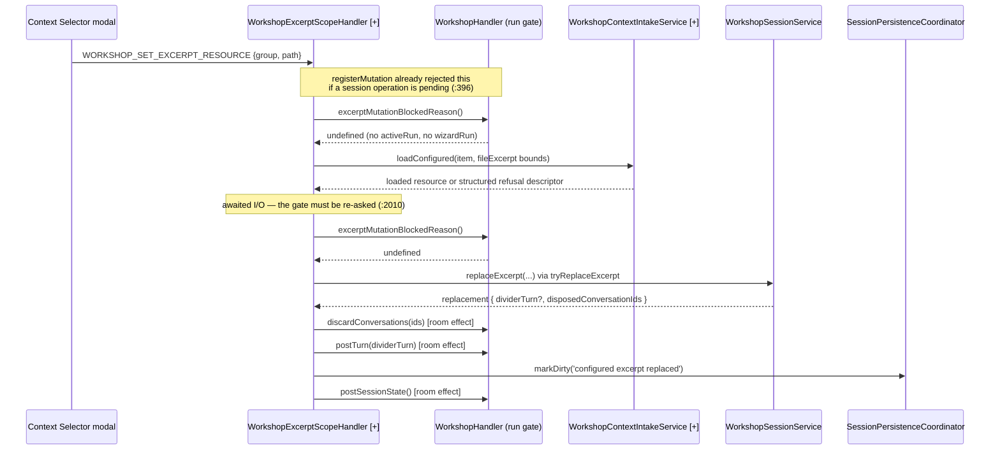

# Architecture Change Runway — Sprint 04: Application Handler Extraction

**Subject:** [`.todo/epics/epic-workshop-architecture-refactor-2026-08-03/sprints/04-application-handler-extraction.md`](../../.todo/epics/epic-workshop-architecture-refactor-2026-08-03/sprints/04-application-handler-extraction.md)

**Branch:** `sprint/workshop-architecture-refactor-04-handlers` → `epic/workshop-architecture-refactor` (Sprint 00 = PR #101, 01 = #102, 02 = #103, 03 = #104, all merged; branch point `04afb67`)

**Altitude:** One sprint. The epic arc, [ADR 2026-08-03](../adr/2026-08-03-workshop-feature-family-and-module-boundaries.md), and the fitness-witness design are settled in the [epic runway](2026-08-03-workshop-refactor-epic-runway.md), the [semantic runway](2026-08-03-workshop-module-semantic-runway.md), and the [Sprint 01](2026-08-03-workshop-sprint-01-feature-slice-runway.md) / [02](2026-08-03-workshop-sprint-02-shared-ownership-runway.md) / [03](2026-08-04-workshop-sprint-03-presentation-runway.md) runways, and are not re-derived here. This runway asks only: **where does `WorkshopHandler` actually cut, and what does the cut cost?**

Repository-specific vocabulary is defined in the [Reader Terms Appendix](#band-5--reader-terms-appendix).

**Audience / task:** Decision owner (Okey) opening the P4 gate; implementer sequencing the moves.

**Date:** 2026-08-04 · **Status:** `IMPLEMENTED AND VERIFIED` · **Implementation gate:** **SATISFIED**

---

## Band 0 — Change Card (30 seconds)

### Thesis

Because `WorkshopHandler.ts` is 2,995 lines that directly register **29 of the Workshop domain's 48 routes** and absorb 61 commits since 2026-05-01 — becoming the default owner for every Workshop IPC that is not a widget, a standing directive, or a session file operation — change **route-cluster ownership so each extracted sibling owns its complete helper closure**, while preserving **`executeMessage`, the single active-run/wizard-run lifecycle, the session-operation mutation gate and its ordering, every wire contract, and the `WorkshopSessionService` aggregate facade**, so that **a maintainer finds the owner of a Workshop action by filename, and the next Workshop feature adds a slice instead of a method.**

### Architecture moves

| # | Move | Before | After | Confidence |
|---|---|---|---|---|
| 1 | Cut by **helper closure**, not by the historical route list | Sprint scope inherits the superseded [Sprint 02C](../../.todo/epics/epic-conversation-widgets-2026-07-22/sprints/02c-workshop-scope-context-ipc-extraction.md) "eight-route" seam | Two clusters: **excerpt + scope** (6 routes) and **context + resources** (13 routes). The 02C list splits three shared helpers (**F1**) | STRONG — measured and accepted (D1=C) |
| 2 | Extract `WorkshopTodoHandler` | `handleTodoAction`, `WorkshopHandler.ts:2297-2370` | 1 route, zero shared helpers, pure `session` + effects — the cheapest proof of the seam | STRONG |
| 3 | Evolve the existing application service instead of adding a second intake owner | `WorkshopContextResourceService.ts:109-116` already owns fresh catalog creation and its catalog owns bounded loads/result variants (`:31-102`); disk intake and refusal rendering remain in `WorkshopHandler.ts:2244-2295,2499-2560,2655-2680` | Rename/evolve it to `WorkshopContextIntakeService`: one composition-root-owned, route-free service for disk/catalog reads, bounds, fingerprints/truncation, and structured refusal descriptors (**F10**) | STRONG — accepted (D1=C) |
| 4 | Make tests enter through the production router, then divide them by owner | `WorkshopHandler.test.ts` invokes public `handle*` methods directly at 100+ call sites | A small `WorkshopHandler + MessageRouter` dispatch fixture; focused room/run, excerpt/scope, context, todo, and assembly suites; no new production passthroughs (**F2**) | STRONG — accepted (D2=C, refined) |
| 5 | Name and land the handler family | The registrar type lives on a session sibling; two root-level Workshop handlers sit outside ADR §D | `WorkshopHandlerContracts.ts` [+], plus the D4 pure moves and a complete route-owner witness | STRONG — accepted (D4=A) |

### Scope and highest risks

| Affected boundary | Why affected | Highest failure mode | Risk |
|---|---|---|---|
| `WorkshopHandler.test.ts` (3,035 lines) | The behavior suite calls `handler.handle*` **directly** — 100+ call sites, not routed through `MessageRouter` | A partial conversion could test a different entry path than production or preserve direct-call passthroughs accidentally. D2=C therefore converts invocation through a small real-router fixture **and** splits focused suites by owner before route extraction (**F2**) | **HIGH** |
| Excerpt/scope mutation gate | `rejectExcerptMutationWhileRunning()` (`:2632`) reads **both** `activeRun` and `wizardRun`; 12 call sites across the 6 routes that move | A boolean-pair port lets the two refusal messages drift apart, or a race re-opens between the two `await` boundaries in `handleSetExcerpt` (**F3**) | **HIGH** |
| `CANCEL_WORKSHOP_REQUEST` | One route, two stream domains (`workshop`, `workshop-context`); `MessageRouter` permits one owner per type | A user cancel that clears the wizard slot immediately can admit a second wizard before the first run reaches `finally`; disposal has the opposite requirement and must clear immediately. D3=A preserves that lifecycle distinction through explicit methods (**F4**) | **HIGH** |
| Room effects surface | `postSessionState()` 35 call sites, `markDirty` 27, `postTurn` 14, `sendError` 101 | A sibling that rebuilds `postSessionState` locally drops `activeContextBudget()` (`:2903`), silently emptying the in-context manifest (**F6**) | MODERATE |
| Participants (`INVITE`/`DISMISS_GUEST`) | Look like a cohesive cluster; `handleInviteGuest` is 165 lines of run lifecycle | Extracting them moves the active-run lifecycle the sprint explicitly keeps central (**F8**) | MODERATE |
| Intake service / composition root | `WorkshopContextResourceService` is exported at `index.ts:95`, typed in `MessageHandlerContracts.ts:22,110-111`, constructed in `extension.ts:235`, and threaded through `MessageHandler.ts:179,315` | D1=C intentionally renames and broadens this **existing instance**. A second service, a sibling handler constructed at the root, or stale `CoreServices` naming would create duplicate ownership. The root changes, but remains the only composition root (**F10**) | MODERATE |
| Wire contracts / persistence | — | **None.** The `CoreServices` property/type rename is an internal assembly contract; no message type, payload, persisted schema, or `schemaVersion` changes | LOW |

### Accepted human decisions

| ID | Decision | Accepted option | Architectural consequence | Status |
|---|---|---|---|---|
| **D1** | Where do the cuts and intake mechanics fall? | **C** — helper-closure clusters **plus** a `WorkshopContextIntakeService` application service | Rename/evolve `WorkshopContextResourceService`; do not create a competing service. The service owns disk/catalog reads, bounding, fingerprints/truncation, and structured refusal descriptors while remaining route-, transport-, session-, and UI-effect-free. | **Accepted by Okey, 2026-08-04** |
| **D2** | What happens to the 3,035-line behavior suite? | **C, refined** — invoke behavior through `MessageRouter`, with focused suites split by owner | A shared fixture assembles only `WorkshopHandler + MessageRouter` and dispatches envelopes through registered routes. Tests are organized into room/run, excerpt/scope, context, todo, and thin assembly/cross-slice suites. No new production passthroughs. | **Accepted by Okey, 2026-08-04** |
| **D3** | Does the Context wizard move with the context cluster? | **A** — yes, behind `cancelRun(requestId): boolean`, `isRunning()`, and `dispose()` | `cancelRun` aborts a matching user-requested run but leaves the slot occupied until that run's `finally`; `dispose` aborts and clears immediately. Central `WorkshopHandler` remains the one owner of `CANCEL_WORKSHOP_REQUEST` and delegates the context branch. | **Accepted by Okey, 2026-08-04** |
| **D4** | Do the root-level Workshop handlers move into `handlers/domain/workshop/` this sprint? | **A** — yes, as a pure move before extraction | Move `WorkshopHandler.ts` and `WorkshopSessionMessageHandler.ts`, update imports and witness roots, and keep logic changes out of that commit. | **Accepted by Okey, 2026-08-04** |

### Gate

**State:** `SATISFIED` — D1–D4 were implemented and the repository baseline is green. The sprint changes the internal `CoreServices` name and composition-root construction for the evolved intake service, but preserves the stronger invariant: `extension.ts` remains the **only** composition root and does not learn Workshop sibling-handler topology. Persistence and wire contracts remain unchanged. The working tree is intentionally uncommitted; commit construction must still preserve epic constraint 1 by isolating the pure directory move and pure service rename from service evolution and route extraction.

---

## Band 1 — Architecture Delta Map (~2 minutes)

### 1.1 Affected subtree — before

```text
packages/core/src/
├── index.ts                                      [~] exports WorkshopContextResourceService
└── application/
    ├── handlers/
    │   ├── MessageHandlerContracts.ts                 [~] CoreServices resource-service property
    │   ├── MessageHandler.ts                          [~] imports root Workshop handler; threads service
    │   └── domain/
    │       ├── WorkshopHandler.ts                     [~] 2,995   29 routes registered directly
    │       ├── WorkshopSessionMessageHandler.ts       [~]   309    9 routes  (sibling precedent #1)
    │       └── workshop/
    │           ├── WorkshopStandingDirectiveHandler.ts       [=]   167    2 routes
    │           └── widgets/                                   [=] 8 routes across 3 siblings
    └── services/workshop/
        └── WorkshopContextResourceService.ts        [~]   117   catalog creation + bounded configured loads

apps/vscode-extension/src/extension.ts                  [~] constructs WorkshopContextResourceService
```

`WorkshopHandler` holds **62% of the Workshop route table** and **68% of the domain's handler lines**. Its nearest sibling is 4.1× smaller than it and 9.7× smaller than it will still be after the biggest planned cut.

### 1.2 Target subtree

```text
packages/core/src/
├── index.ts                                      [~] exports WorkshopContextIntakeService
└── application/
    ├── handlers/
    │   ├── MessageHandlerContracts.ts                 [~] CoreServices intake-service property/type
    │   ├── MessageHandler.ts                          [~] imports moved handler; threads renamed service
    │   └── domain/workshop/
    │       ├── WorkshopHandler.ts                     [>][~]   1,527   9 routes + slice composition
    │       ├── WorkshopHandlerContracts.ts            [+]         30   registrar + room effects + run gate
    │       ├── WorkshopSessionMessageHandler.ts       [>][~]     305   9 routes
    │       ├── WorkshopExcerptScopeHandler.ts         [+]        479   6 routes; delegates intake mechanics
    │       ├── WorkshopContextHandler.ts              [+]        861   13 routes + wizard; delegates intake mechanics
    │       ├── WorkshopTodoHandler.ts                 [+]         99   1 route
    │       ├── WorkshopStandingDirectiveHandler.ts    [=]       167
    │       └── widgets/                               [=]
    └── services/workshop/
        └── WorkshopContextIntakeService.ts          [>][~]    379   disk/catalog load + bounds + refusal descriptors

apps/vscode-extension/src/extension.ts                  [~] constructs the renamed/evolved intake service
```

`[>]` on both handlers is the accepted ADR §D directory move (D4=A). The session handler also carries `[~]` because the later extraction commit relocates its type-only mutation registrar into `WorkshopHandlerContracts.ts`; the dedicated move commit itself remains pure. `[>]` on the service is a rename/evolution of the existing composition-root-owned instance (D1=C), **not** a second service. Everything under `widgets/` is untouched.

The values above are the implemented measurements, not the pre-implementation
estimates. `WorkshopContextHandler` finished larger than estimated because all
thirteen route workflows and the cancellable wizard remain one cohesive owner;
disk/catalog policy is nevertheless absent and witnessed on the intake
service. Per ADR 2026-08-03 §8, the sprint did not manufacture another layer to
meet a numeric limit.

### 1.3 Route ownership ledger — the complete Workshop table

| Cluster | Routes | Count | Owner after | Shared helpers it takes with it |
|---|---|---:|---|---|
| **Room & run** | `RUN_TOOL`, `QUICK_ACTION`, `SEND_MESSAGE`, `CANCEL_WORKSHOP_REQUEST`, `SELECT_PERSONA`, `SET_CHAT_TARGET`, `INVITE_GUEST`, `DISMISS_GUEST`, `SET_CONVERSATION_SETTINGS` | 9 | `WorkshopHandler` `[=]` | `executeMessage`, `preemptActiveRun`, `settleActiveRun`, `activeContextBudget`, all stream senders |
| **Excerpt & scope** | `SET_EXCERPT`, `PICK_EXCERPT_FILE`, `REREAD_EXCERPT`, `SET_EXCERPT_RESOURCE`, `SET_SESSION_SCOPE`, `REPIN_EXCERPT` | 6 | `WorkshopExcerptScopeHandler` `[+]` | `tryReplaceExcerpt`, `applyScopeTransition`; delegates disk/catalog intake, provenance matching, bounding, and refusal descriptions to `WorkshopContextIntakeService` |
| **Context & resources** | `ADD_CONTEXT_TEXT`, `ADD_CONTEXT_FILE`, `REMOVE_CONTEXT_ATTACHMENT`, `UPDATE_CONTEXT_TEXT`, `REQUEST_CONTEXT_ATTACHMENT`, `OPEN_CONTEXT_ATTACHMENT_FILE`, `REQUEST_CONTEXT_CATALOG`, `SEARCH_CONTEXT_RESOURCES`, `ADD_CONTEXT_RESOURCES`, `ATTACH_MESSAGE_RESOURCES`, `ATTACH_MESSAGE_FILE`, `REMOVE_MESSAGE_ATTACHMENT`, `RUN_CONTEXT_WIZARD` | 13 | `WorkshopContextHandler` `[+]` | `applyContextAttachment`, `stageMessageAttachment`, `boundThreadArtifact`, `adoptWizardResult`, `wizardRun`; delegates disk/catalog intake, bounding, and refusal descriptions to `WorkshopContextIntakeService` |
| **Todos** | `WORKSHOP_TODO_ACTION` | 1 | `WorkshopTodoHandler` `[+]` | none |
| **Sessions** | 9 file/lifecycle routes | 9 | `WorkshopSessionMessageHandler` `[~]` | mutation registrar type relocated to the shared handler contract |
| **Widgets & standing** | 10 routes | 10 | 4 existing siblings `[=]` | — |
| | | **48** | | |

`WorkshopContextIntakeService` owns **zero routes**. Both intake-consuming handlers receive the same root-owned instance through `WorkshopHandler`; it returns data or structured refusal descriptors and never registers, sends, logs, mutates the session, or chooses UI effects.

### 1.4 Structural view — why the 02C boundary fails and this one does not

The question this diagram answers: **which private helpers does each candidate cut have to tear in half?** Scope: `WorkshopHandler`'s private helper graph only. Level: method. Solid arrow = calls; a helper touched by two clusters is a torn seam.

```mermaid
graph TD
    subgraph EXC["Excerpt + scope cluster — 6 routes"]
        R_SETEX["SET_EXCERPT"]
        R_PICK["PICK_EXCERPT_FILE"]
        R_REREAD["REREAD_EXCERPT"]
        R_EXRES["SET_EXCERPT_RESOURCE"]
        R_SCOPE["SET_SESSION_SCOPE"]
        R_REPIN["REPIN_EXCERPT"]
        H_TRY["tryReplaceExcerpt :2806"]
        H_WITH["withConfiguredResource :2738"]
        H_LOADEX["loadExcerptFromDisk :2499"]
        H_SCOPET["applyScopeTransition :1690"]
    end

    subgraph CTX["Context + resources cluster — 13 routes"]
        R_ADDTXT["ADD_CONTEXT_TEXT"]
        R_ADDFILE["ADD_CONTEXT_FILE"]
        R_ADDRES["ADD_CONTEXT_RESOURCES"]
        R_MSGRES["ATTACH_MESSAGE_RESOURCES"]
        R_MSGFILE["ATTACH_MESSAGE_FILE"]
        R_WIZ["RUN_CONTEXT_WIZARD"]
        H_APPLY["applyContextAttachment :2215"]
        H_LOADCTX["loadContextFileFromDisk :2244"]
        H_STAGE["stageMessageAttachment :1933"]
        H_ADOPT["adoptWizardResult :2114"]
    end

    H_FAIL["WorkshopContextIntakeService refusal descriptor [>][~]<br/>pure data — no route, transport, session, or UI effect"]
    H_GATE["rejectExcerptMutationWhileRunning :2632<br/>reads activeRun AND wizardRun"]

    R_SETEX --> H_WITH --> H_TRY
    R_PICK --> H_LOADEX --> H_TRY
    R_REREAD --> H_LOADEX
    R_EXRES --> H_TRY
    R_EXRES --> H_FAIL
    R_SCOPE --> H_SCOPET
    R_REPIN --> H_SCOPET

    R_ADDTXT --> H_APPLY
    R_ADDFILE --> H_LOADCTX --> H_APPLY
    R_ADDRES --> H_APPLY
    R_ADDRES --> H_FAIL
    R_MSGRES --> H_STAGE
    R_MSGRES --> H_FAIL
    R_MSGFILE --> H_LOADCTX
    R_MSGFILE --> H_STAGE
    R_WIZ --> H_ADOPT --> H_FAIL

    R_SETEX -.gate.-> H_GATE
    R_PICK -.gate.-> H_GATE
    R_REREAD -.gate.-> H_GATE
    R_EXRES -.gate.-> H_GATE
    R_SCOPE -.gate.-> H_GATE
    R_REPIN -.gate.-> H_GATE
    R_WIZ -.owns wizardRun.-> H_GATE
```



Read the diagram against the 02C list — `SET_SESSION_SCOPE`, `REPIN_EXCERPT`, `ADD_CONTEXT_TEXT`, `ADD_CONTEXT_FILE`, `REMOVE_CONTEXT_ATTACHMENT`, `UPDATE_CONTEXT_TEXT`, `REQUEST_CONTEXT_ATTACHMENT`, `OPEN_CONTEXT_ATTACHMENT_FILE`. It takes `ADD_CONTEXT_TEXT` and `ADD_CONTEXT_FILE` while leaving `ADD_CONTEXT_RESOURCES` behind, so `applyContextAttachment` has callers on both sides. It takes `ADD_CONTEXT_FILE` while leaving `ATTACH_MESSAGE_FILE` behind, so `loadContextFileFromDisk` and `toDisplayPath` do too. And it takes the two scope routes without the four excerpt routes that share the same gate. Three torn helpers, one torn gate.

The helper-closure cut shares exactly one behavior — the current `reportConfiguredResourceLoadFailure`, a pure decision over `(result, action, maxBytes)` whose only impurity is calling `sendError`. Under accepted D1=C, the decision and copy become a structured refusal descriptor returned by `WorkshopContextIntakeService`; each route owner chooses the UI effect. This removes the tear without giving the intake service transport authority.

### 1.5 Representative runtime flow — pinning a configured resource as the excerpt

Current, and target. The question: **what crosses the new seam on the hottest guarded path?**



Two properties must survive the move byte-for-byte: the gate is asked **twice** around the awaited catalog read (an existing race fix), and `discardConversations` reaches `AssistantToolService`, which the excerpt handler must **not** hold directly — it is a room effect, not a sibling dependency.

### 1.6 Blast-radius summary

| Dimension | Direct | Indirect | Confidence |
|---|---|---|---|
| Structural | 1 handler split into 4 owners; 2 handlers moved; 1 service renamed/evolved | `index.ts`, `CoreServices`, `extension.ts`, `MessageHandler.ts`, tests, and 3 sibling registrar imports | HIGH |
| Behavioral | 20 routes change owner; intake mechanics move behind a data-only service | Gate re-check ordering; wizard cancel/settlement/dispose fan-out; refusal descriptors must render identical copy | HIGH |
| Contract | **No wire change**; internal `CoreServices.workshopContextResourceService` becomes `workshopContextIntakeService` | Core barrel consumers and assembly tests compile against the new name | MODERATE |
| Data / persistence | **none** | `markDirty` reason strings must survive verbatim (they are logged, not persisted) | HIGH |
| Operational | Log prefixes `[WorkshopHandler]` → per-sibling prefixes | Output-channel greps in triage notes go stale (**F9**) | MODERATE |
| Verification | `WorkshopHandler.test.ts` 3,035 lines; `boundaries.test.ts` 3 witnesses | Route-driven conversion plus focused owner suites is the sprint's largest single work item (**F2**) | HIGH |
| Historical / coordination | `WorkshopHandler` is the #2 churn file in the repo (61 commits since 2026-05-01) | No parallel Workshop lane is assigned; the feature freeze holds | HIGH |
| Evolution | Next feature adds a slice + a registry entry | A third guarded-mutation cluster would want the run gate as a first-class port, which this sprint creates | MODERATE |

---

## Band 2 — Reviewer Packet (~10 minutes)

### 2.1 The real job of this sprint

The sprint document says "extract the planned scope/context route cluster" and then, in the same breath, "where dependency and helper analysis proves independent ownership." Those two clauses point at different cuts. The first inherits a superseded plan's boundary; the second is the actual instruction. This runway performs the helper analysis the second clause asks for and finds that the first clause's boundary does not survive it.

The job, restated: **cut the handlers from the helper graph, move reusable intake mechanics into the already-existing application service, and leave `WorkshopHandler` holding only what genuinely coordinates.** Everything else in the sprint — route-driven test conversion, witness update, directory move, `CoreServices` rename, and contracts module — makes those accepted ownership decisions executable and reviewable.

### 2.2 Declared intent vs observed state

| Claim | Source | Observed | Verdict |
|---|---|---|---|
| "Extract the planned scope/context route cluster" | Sprint 04 scope | The plan it points at is [02C](../../.todo/epics/epic-conversation-widgets-2026-07-22/sprints/02c-workshop-scope-context-ipc-extraction.md), marked *Superseded 2026-08-03 — mandatory work moved to Phase 4*, whose own "Out of Scope" list excludes the routes that share its helpers | **[Observed]** Partially adoptable. The intent transfers; the route list does not. |
| "`WorkshopHandler` remains the Workshop-internal composition owner … delegates cohesive IPC clusters to named sibling handlers" | ADR §4, `2026-08-03-…-boundaries.md:96` | Exactly the pattern in use: 4 siblings constructed at `:325-379` with closure-bound option objects | **[Observed]** Precedent verified part by part; adopted whole. |
| "No handler receives an internal session ledger directly" | ADR §4 | Witnessed at `boundaries.test.ts:413-420`, scanning all of `handlers/domain` | **[Observed]** Holds; new siblings inherit the guard automatically. |
| Sibling handlers are constructed inside `WorkshopHandler`, not at the composition root | `WorkshopGesturePlaygroundHandler.ts:8-10` ("the WorkshopSessionMessageHandler mold — so the composition root stays ignorant of workshop internals") | `MessageHandler.ts:304` passes services; siblings are built at `:325-379`. The existing context-resource service is separately root-owned (`extension.ts:235`; `CoreServices` at `MessageHandlerContracts.ts:87-127`). | **[Observed]** D1=C edits root wiring for the renamed/evolved service while preserving constraint 3: `extension.ts` remains the only composition root and knows no sibling-handler topology. |
| Sibling handlers own their own test suites | `workshop/WorkshopStandingDirectiveHandler.test.ts`, `widgets/**/…Handler.test.ts` | True for three `workshop/` siblings — **and false for `WorkshopSessionMessageHandler`**, which instead grew 9 passthroughs on `WorkshopHandler` (`:2563-2599`, comment: *"Public compatibility seam for focused tests"*) | **[Declared 2026-08-04]** D2=C resolves the inconsistency: behavior enters through the real router and suites split by owner; no new passthroughs. Existing session passthrough removal is in scope where route conversion makes them unused. |
| "Fitness witnesses #1, #6, #7 update for extracted owners" | Epic phase table | #6 and #7 scan directories and need no per-route edit. #1 is a hand-maintained 10-entry map covering only widget/standing routes | **[Observed]** #1 is the only real work, and it currently declares 21% of the route table. |

### 2.3 Contracts and invariants

**Preserved, verbatim:**

- **Mutation gate ordering.** `registerMutation` (`:386-401`) rejects during a pending session operation *before* the handler body runs. Siblings receive the registrar; they must never call `router.register` for a route that is a mutation today. Read routes (`REQUEST_CONTEXT_ATTACHMENT`, `OPEN_CONTEXT_ATTACHMENT_FILE`, `REQUEST_CONTEXT_CATALOG`, `SEARCH_CONTEXT_RESOURCES`) must stay reads — the comment at `:425-426` records why.
- **Double gate check around awaited I/O.** `handleSetExcerpt` (`:1432`, `:1440`), `handleSetExcerptResource` (`:1978`, `:2010`), `handlePickExcerptFile` (`:2380`, `:2394`, `:2410`), `handleRereadExcerpt` (`:2432`, `:2459`, `:2478`). Twelve call sites, six routes, all moving together.
- **Refusal copy.** `MID_RUN_EXCERPT_GUARD_MESSAGE` and `MID_WIZARD_EXCERPT_GUARD_MESSAGE` (`:185-188`) are distinct on purpose. The port must return the *message*, not two booleans.
- **`markDirty` reason strings** and every `outputChannel.appendLine` payload. Log prefixes change with the owner; the facts after the prefix do not.
- **Wire order.** `postTurn` → `postSessionState`, and on run completion `STREAM_COMPLETE` → `SESSION_STATE` → `STATUS` (`:1386-1389`).
- **Message envelope `source`.** Every Workshop message is emitted with `source: 'extension.workshop'`. Siblings keep that exact string; it is not per-handler.
- **Wizard cancellation lifecycle.** A matching user cancel only aborts. It does **not** clear the occupied wizard slot; `isRunning()` remains true until that run's guarded `finally` clears it (`WorkshopHandler.ts:1391-1398,2095-2106`). Disposal aborts and clears immediately, matching current `cancelWizardRun('dispose')` (`:489-503,2644-2652`), because the owner will accept no successor after disposal.

**New handler seams, and narrow:**

```ts
// WorkshopHandlerContracts.ts  [+]
export type WorkshopMutationRouteRegistrar = /* moved verbatim from WorkshopSessionMessageHandler.ts:33 */;

/** Room effects every Workshop slice needs. Callbacks, never copied methods. */
export interface WorkshopRoomEffects {
  postSessionState: () => void;          // composes activeContextBudget() — F6
  postTurn: (turn: WorkshopTurn) => void;
  markDirty: (reason: string) => void;
  reportError: (message: string, details?: string) => void;
  sendStatus: (message: string) => void;
}

/** The one guard that reads run state a sibling does not own. */
export interface WorkshopRunGate {
  /** Refusal copy when an excerpt/scope mutation must not land, else undefined. */
  excerptMutationBlockedReason: () => string | undefined;
}
```

`WorkshopHandler` implements `excerptMutationBlockedReason` as the single place two sources meet:

```ts
excerptMutationBlockedReason: () =>
  this.activeRun ? MID_RUN_EXCERPT_GUARD_MESSAGE
  : this.contextHandler.isRunning() ? MID_WIZARD_EXCERPT_GUARD_MESSAGE
  : undefined
```

The wizard contract is deliberately lifecycle-shaped rather than exposing its controller:

```ts
interface WorkshopContextRunControl {
  cancelRun(requestId: string): boolean; // matching run: abort only; do not clear
  isRunning(): boolean;                  // true through the run's finally
  dispose(): void;                       // abort + clear immediately; owner is terminal
}
```

**Evolved intake service contract (D1=C):** `WorkshopContextResourceService` is renamed in place to `WorkshopContextIntakeService` and receives the file-system capability needed for host-selected disk intake. It owns fresh catalog creation, configured-resource and disk reads, byte/word bounds, decoding, fingerprints/truncation, provenance matching, and structured refusal descriptors. It returns data; it does not decide which route requested the data or produce effects.

| `WorkshopContextIntakeService` may own | It must not own |
|---|---|
| `openCatalog`, bounded configured-resource/disk results, path/provenance derivation, truncation/fingerprint data, `{ message, details?, log? }` refusal descriptors | `MessageRouter`, `MessageType`, `postMessage`, `sendError`, `LogSink`, `WorkshopSessionService`, picker/modal flow, dirty marking, turn/session-state publication, wizard lifecycle |

The internal assembly contract changes from `CoreServices.workshopContextResourceService: WorkshopContextResourceService` (`MessageHandlerContracts.ts:110-111`) to `workshopContextIntakeService: WorkshopContextIntakeService`. The core barrel, `extension.ts`, `MessageHandler`, handlers, and test fixtures change together; no compatibility alias remains in alpha.

### 2.4 Negative space — what the generic owner must not know

`WorkshopHandler` after this sprint is a **generic name over a specific residue**, so the negative-space test applies to it directly.

| Question | Answer |
|---|---|
| What do all remaining members share? | They participate in the run lifecycle: they start, preempt, cancel, settle, or gate an in-flight model call, or they compose the slices that do. |
| What must it *not* know? | Attachment word budgets, catalog paths, truncation policy, todo action grammar, scope-transition logging, excerpt fingerprints. |
| What would the next feature edit? | Its own slice file, plus one line in `registerRoutes` and one entry in the route-owner witness. |
| Does the name still tell the truth? | **Not fully.** `WorkshopHandler` after extraction is a room/run orchestrator; `WorkshopRoomHandler` would be truer. Renaming it collides with the ADR §D tree, which names it `WorkshopHandler`. **Leave the name, record the tension** — Sprint 06 owns the contract/name normalization pass. |
| Does `WorkshopContextHandler` risk the same drift? | D1=C removes disk/catalog mechanics before the route move, targeting ~450 lines. The handler may know Workshop context/message-attachment workflow and wizard lifecycle; it must not reabsorb byte/word parsing or catalog policy. |

The generic-name test also applies to `WorkshopContextIntakeService`: every operation must turn an untrusted external text source into a bounded, provenance-bearing result or refusal descriptor. A future intake variant may add one data-returning method or result variant, but not a route registration or session mutation. If it needs `MessageType`, `MessageTransport`, `WorkshopSessionService`, or `LogSink`, the service name is being used to launder handler behavior across the boundary.

### 2.5 Quality scenarios

| # | Source | Stimulus | Environment | Artifact | Expected response | Response measure |
|---|---|---|---|---|---|---|
| Q1 | Writer | Pin a configured resource as the excerpt while a tool run is in flight | Active run, `SET_EXCERPT_RESOURCE` mid-catalog-read | `WorkshopExcerptScopeHandler` | Refusal with the *tool* message, no excerpt mutation | Test asserts refusal copy is `MID_RUN_EXCERPT_GUARD_MESSAGE` and `session.replaceExcerpt` is never called, for both the pre-await and post-await window |
| Q2 | Writer | Pin an excerpt while the Context wizard is running | Wizard active, no room run | `WorkshopExcerptScopeHandler` + `WorkshopContextHandler` | Refusal with the *wizard* message | Test drives the wizard through the sibling and asserts the excerpt handler receives the wizard copy — proves the gate crosses the seam intact |
| Q3 | Writer | Cancel the wizard, then immediately request another | First run has observed abort but has not reached `finally` | `WorkshopHandler` → `WorkshopContextHandler` | Cancel aborts the matching run; its slot remains occupied, the immediate second wizard is refused, `STREAM_COMPLETE { cancelled: true }` settles, and only then may a later wizard start | Route-driven test asserts cancel → immediate second refused → first `finally` settles → next request accepted; separate disposal assertion observes immediate clear |
| Q4 | Maintainer | Add a hypothetical fourth guarded-mutation cluster | Sprint 05+ | `registerRoutes` + witness | New slice file + 1 registration line + N witness entries; **zero edits to existing slices** | Reproduction test (§3.3) |
| Q5 | Reviewer | Trace "why did my attachment get refused?" | Any | Filenames | One file answers it | Filename audit: `WorkshopContextHandler.ts` holds all refusal copy for attachments |
| Q6 | On-call / triage | Read the output channel after a failed pin | Extension Development Host | Log lines | Prefix names the owner; the fact after the prefix is unchanged | Diff of log-line bodies before/after is empty except the bracketed prefix |
| Q7 | CI | Someone registers a Workshop route in the wrong file | Any PR | `boundaries.test.ts` | Build fails naming both the message type and the offending file | Witness covers all 48 routes, not 10 |
| Q8 | Maintainer | Add a disk/catalog intake outcome | Unit test or route extraction | `WorkshopContextIntakeService` | Service returns bounded data/refusal descriptors without route, transport, session, or logging dependencies; handler renders the effect | Import/constructor witness plus focused service tests; route-driven owner suite asserts unchanged error copy |

#### Implemented log-prefix map (F9)

| Behavior owner | Before | After | Preserved fact |
|---|---|---|---|
| Room/run orchestration | `[WorkshopHandler]` | `[WorkshopHandler]` | Existing room/run message body |
| Excerpt and scope | `[WorkshopHandler]` | `[WorkshopExcerptScopeHandler]` | Pin, re-read, provenance, scope, and error body after the prefix |
| Context, resources, attachments, wizard | `[WorkshopHandler]` | `[WorkshopContextHandler]` | Attachment, catalog, wizard, and error body after the prefix |
| Todo actions | `[WorkshopHandler]` | `[WorkshopTodoHandler]` | Task-action and error body after the prefix; wire error source remains `workshop.todo` |
| Session IPC and existing widget siblings | Existing sibling/central prefix | Unchanged | Out of the moved closure |

Sibling `reportError` effects still delegate envelope construction to the
central handler, but supply their owner label for the output-channel prefix.
The `ERROR` message contract, source, copy, details, and timestamp behavior are
unchanged.

**Sensitivity point:** the shape of `WorkshopRunGate`. A boolean-pair port makes Q1/Q2 pass today and drift tomorrow.
**Tradeoff point:** accepted D3=A buys cluster cohesion at the price of three explicit cross-slice edges; accepted D1=C adds composition-root/type churn while preventing a ~800-line context handler and duplicate intake policy.
**Risk theme:** every high-severity finding here is about *state a route reads but does not own* — run state, wizard state, budget composition. Route ownership is the easy half; state ownership is the sprint.

### 2.6 Alternatives

| Option | Shape | Retain? |
|---|---|---|
| **Minimal patch** | Extract only `WorkshopTodoHandler` and the literal 02C eight | **Reject.** Tears three helpers (**F1**), leaves `WorkshopHandler` ~2,500 lines, and burns the sprint's review budget on a boundary the next sprint must redo. |
| **Recommended / accepted** | Helper-closure clusters: excerpt/scope, context/resources, todos; rename/evolve the existing intake service; route-driven focused suites; contracts module; directory move; witness extension | **Retain (D1=C, D2=C refined, D3=A, D4=A).** Shared intake mechanics have one data-only owner, `WorkshopHandler` landed at 1,527 lines, and runtime behavior is tested through the route seam actually used in production. |
| **More generalized** | A Workshop *route-slice framework*: `WorkshopSlice` interface, dynamic slice registry, generated ownership metadata, generic cancellation coordinator | **Reject.** Five slices do not justify an abstraction over slices; the explicit registrations already make ownership visible. D1's intake service is retained because current code already contains that service and duplicated intake mechanics, not as the first member of a speculative framework. |

### 2.7 Principle and quality tensions

| Principle / quality | Status | Evidence of support | Tension or violation | Consequence | Planned witness | Confidence |
|---|---|---|---|---|---|---|
| Single responsibility | `ACCEPTABLE` | Room/run, context workflow, excerpt/scope workflow, todo behavior, and intake mechanics each have a named owner | `WorkshopContextIntakeService` serves two handler clusters, so its negative space must be enforced | Shared mechanics do not become shared UI orchestration | Route-free dependency witness + focused service tests (Q8) | MODERATE |
| Naming truthfulness | `TENSION` | Every new sibling is named for its cluster | `WorkshopHandler` no longer describes what it holds | Reader expects a facade, finds an orchestrator | Sprint 06 normalization | HIGH |
| Dependency direction | `STRONG` | Siblings stay built inside `WorkshopHandler`; the application intake service stays root-owned and injected | `CoreServices`/root wiring changes during the rename | Assembly churn, but no second composition root or inward host dependency | `boundaries.test.ts:260-266` + `MessageHandler` assembly tests | HIGH |
| Aggregate encapsulation | `STRONG` | No sibling touches an internal ledger | — | — | `boundaries.test.ts:413-420` (directory-scoped, inherits new files) | HIGH |
| Open/closed | `ACCEPTABLE` | New cluster = new file + 1 registration line | Witness map is hand-maintained; a 48-entry literal invites drift | A forgotten entry silently un-guards a route | Extend #1; prefer an inventory assertion over a literal | MODERATE |
| Testability | `ACCEPTABLE` | D2=C replaces direct method invocation with the production `MessageRouter` seam and splits suites by owner | A shared full-Workshop fixture is heavier than direct sibling unit tests | Route registration and mutation gating are exercised honestly; focused service/unit tests still cover pure mechanics | Route-driven dispatch fixture + thin cross-slice assembly suite | HIGH |
| Change isolation | `STRONG` | 61-commit hotspot becomes 5 files | — | Merge conflicts localize | Churn re-measure at close-out | MODERATE |
| Operability | `TENSION` | Logs keep their facts | Prefixes change; triage notes cite `[WorkshopHandler]` | Stale greps in `.memory-bank` and PR reviews | Close-out note listing prefix changes (**F9**) | HIGH |
| Reliability | `ACCEPTABLE` | Gate copy and double-check preserved as contract | Gate now crosses a process boundary in the code | A missed re-check re-opens a closed race | Q1/Q2 | MODERATE |

### 2.8 Ranked findings

| ID | Severity | Claim | Evidence | Smallest fix |
|---|---|---|---|---|
| **F1** | **HIGH** | The declared 02C eight-route seam tears three shared private helpers and one shared gate; taking it verbatim violates this sprint's own completion criterion *"sibling handlers own complete route/helper clusters, not arbitrary method fragments."* | `applyContextAttachment` (`:2215`) has callers at `:1456`, `:1486` (in the 02C list) and `:1821` (excluded by 02C's Out-of-Scope). `loadContextFileFromDisk` (`:2244`) at `:1482` (in) and `:1897` (out). `toDisplayPath` (`:2859`) at `:1481` (in) and `:1896` (out). Gate `:2632` has 12 call sites across 6 routes, only 2 of which 02C takes. | **Accepted D1=C:** cut excerpt/scope (6) and context/resources (13) by closure; place shared intake mechanics/refusal descriptions on the evolved intake service. |
| **F2** | **HIGH** | The 3,035-line behavior suite drives `WorkshopHandler` by direct method call. Leaving that shape would either require new passthroughs or stop exercising route registration and mutation gating. | `WorkshopHandler.test.ts` — 37 `handler.handleSendMessage`, 11 `handleSetChatTarget`, 7 `handleAddContextText`, 4 `handleTodoAction`, etc. `WorkshopHandler.ts:2563-2599` adds 9 passthroughs "for focused tests"; `workshop/**` siblings added none and own their suites instead. | **Accepted D2=C, refined:** first add a `WorkshopHandler + MessageRouter` dispatch fixture, then split focused suites by owner and keep one thin assembly/cross-slice suite. Add no new passthroughs. |
| **F3** | **HIGH** | `rejectExcerptMutationWhileRunning` reads two run states the excerpt cluster will not own, and the two refusal messages are behaviorally distinct. A naive `isRunning(): boolean` port collapses them. | `:2632-2642`; `MID_RUN_EXCERPT_GUARD_MESSAGE` vs `MID_WIZARD_EXCERPT_GUARD_MESSAGE` at `:185-188`; both asserted by existing tests | Port returns `string \| undefined`, not `boolean`. Q1 and Q2 pin both branches across the seam. |
| **F4** | **HIGH** | Moving the Context wizard creates three cross-slice edges for one route, and user cancellation and disposal have intentionally different slot-release semantics. | `handleCancelRequest` `:1391-1398` aborts without clearing; wizard `finally` clears at `:2095-2098`; `dispose()` `:503` calls `cancelWizardRun`, which aborts and clears at `:2644-2652`; the gate reads `wizardRun` `:2637` | **Accepted D3=A:** central route delegates to `cancelRun`; user cancel leaves `isRunning()` true through `finally`; `dispose()` clears immediately. Assert the complete Q3 sequence. |
| **F5** | MODERATE | ADR §D places `WorkshopHandler.ts` and `WorkshopSessionMessageHandler.ts` under `handlers/domain/workshop/`; both remain at `handlers/domain/`, and before D4 no sprint claimed the move. Sprint 06 owns tests/docs mirroring source, not the source move. | ADR §D tree; actual paths; Sprint 06 scope list | **Accepted D4=A:** Sprint 04 claims a pure `git mv` as slice 0, plus the `WORKSHOP_HANDLER_ROOT` constant at `boundaries.test.ts:56`, which today points at `domain/` and therefore also scans the 11 non-Workshop handlers. |
| **F10** | MODERATE | D1=C must evolve the existing root-owned configured-resource service; adding a separate intake service or constructing it inside a handler would create two policy owners and contradict the single-composition-root assembly model. | `WorkshopContextResourceService.ts:31-116` already owns catalog snapshots, bounds, hashes, and result variants; exported at `index.ts:95`, typed at `MessageHandlerContracts.ts:22,110-111`, constructed at `extension.ts:235`, threaded at `MessageHandler.ts:179,315`. Disk/refusal mechanics remain at `WorkshopHandler.ts:2244-2295,2499-2560,2655-2680`. | Pure-rename the existing class/property first, then move disk/provenance/bounding/refusal-description mechanics into it. Keep it route-, transport-, session-, and log-free; update barrel, `CoreServices`, root, assembly, and service tests atomically. |
| **F6** | MODERATE | `postSessionState()` is not a message send — it composes `activeContextBudget()`, which reads live conversation budgets and writer sources from `AssistantToolService`. A sibling that reimplements the send drops the in-context manifest silently. | `:2879-2901` → `:2903-2931`; the manifest has its own suite (`WorkshopHandler.test.ts:2656`, "In-context manifest projection (Phase 7)") | `postSessionState` crosses the seam only as a callback in `WorkshopRoomEffects`. Add a witness that no `workshop/` sibling constructs a `WORKSHOP_SESSION_STATE` message literal. |
| **F7** | LOW–MODERATE | `WorkshopMutationRouteRegistrar` — a family-wide contract — is exported from one sibling and imported by three others, so every slice depends on `WorkshopSessionMessageHandler` for a type that has nothing to do with sessions. Two more siblings would make it five. | `WorkshopSessionMessageHandler.ts:33`; imported at `WorkshopStandingDirectiveHandler.ts:5`, `WorkshopGesturePlaygroundHandler.ts:39`, `WorkshopLexicalGravityHandler.ts:5` | Move it to `WorkshopHandlerContracts.ts` with the new effects/gate types. Mechanical; four import edits. |
| **F8** | LOW–MODERATE | The participant routes look like a cluster but are not one: `handleInviteGuest` is 165 lines of `activeRun`, capability minting, streaming, and `completeWorkshopRun`. Extracting it moves the run lifecycle the sprint keeps central; leaving it strands `SELECT_PERSONA` + `SET_CHAT_TARGET` (~40 lines) with no home worth a file. | `:678-842` vs `:658-675`, `:868-888` | **Decline the participant cluster explicitly** in the sprint's implementation outcome, with this reason recorded, so Sprint 07's audit does not re-litigate it. |
| **F9** | LOW | Log prefixes move from `[WorkshopHandler]` to per-sibling prefixes. Existing PR reviews and `.memory-bank` triage notes grep the old prefix. | ~40 `appendLine` sites carrying `[WorkshopHandler]` | One close-out table mapping old prefix + subject → new prefix. |

### 2.9 What survived attack

Recorded so the decision owner knows which parts to stop re-litigating:

- **The sibling-handler pattern itself.** At the decision point it was verified part by part against all four existing route-owning siblings: constructor shape `(session?, service…, postMessage, outputChannel, options)`, closure-bound callbacks, `registerRoutes(router, registerMutation)`, composition inside `WorkshopHandler`. This sprint added the excerpt/scope, context, and todo siblings through the same seam; none reaches the composition root. D1=C added no handler to the root.
- **The single-composition-root and aggregate invariants.** D1=C **does edit** `extension.ts`/`CoreServices`; it does not create another root or another service instance. No `vscode` import enters core, the aggregate facade is unchanged, no wire contract or persisted shape moves, and `prose-minion/sessions/.gitignore` is not in scope. Constraint 1 requires active discipline, so directory and service renames land separately from behavior-moving slices.
- **Witnesses #6 and #7 need no per-route maintenance.** Both scan `handlers/domain` recursively (`boundaries.test.ts:260`, `:413`), so new siblings inherit the guards the moment they land. Only #1 is hand-maintained.
- **The room/run residue is genuinely cohesive.** The nine retained routes were tested against the question "would any of these be surprising in a file called *room and run orchestration*?" and none were. There is no fifth hidden cluster waiting in the remainder.
- **No `CRITICAL` unknown and no open human decision.** D1–D4 are accepted and implemented. The route witness is a literal grouped 48-entry ledger with exact owner and gate classification; the focused test topology is recorded in §3.6.

### 2.10 Implementation slices

| # | Slice | Architectural purpose / files | Contract or behavior change | Verification | Depends on | Rollback seam |
|---:|---|---|---|---|---|---|
| 0 | **D4 pure directory move** — `git mv` `WorkshopHandler.ts` + `WorkshopSessionMessageHandler.ts` into `domain/workshop/`; update `MessageHandler.ts:50`, sibling/test imports, and `WORKSHOP_HANDLER_ROOT` | None | Typecheck + focused/full Jest; diff contains path/import/witness-root changes only | D4=A | Revert one pure-move commit |
| 1 | **D1 pure service rename** — `WorkshopContextResourceService` → `WorkshopContextIntakeService`; atomically update `index.ts`, `CoreServices` property/type, `extension.ts`, `MessageHandler`, handler, and service/assembly fixtures | Internal application assembly name only; no compatibility alias | Typecheck, service tests under new name, `MessageHandler` assembly tests; behavior diff empty | 0, D1=C | Revert rename commit; no dual names |
| 2 | **D2 route-driven test topology** — add a small test fixture that assembles `WorkshopHandler + MessageRouter`, registers once, and dispatches real envelopes; split the 3,035-line suite into focused room/run, excerpt/scope, context, todo, and thin assembly/cross-slice suites | Test entry path changes from direct `handle*` calls to production route dispatch; remove test-only passthroughs once unused; no wire behavior change | All pre-extraction assertions green; explicit mutation-gate and duplicate/missing registration characterization | 1, D2=C refined | Revert test-only topology commit before production extraction |
| 3 | **Handler contracts module** — add `WorkshopHandlerContracts.ts`; move registrar (**F7**); define room effects and refusal-copy run gate | Internal types/callbacks only | Typecheck + existing route-driven suites; no route owner changes | 2 | Revert mechanical type/import commit |
| 4 | **`WorkshopTodoHandler`** — 1 route, zero shared helpers | First route owner changes; proves registrar/effects end to end | Focused route-driven todo suite + route-owner witness entry | 3 | Revert one closure move |
| 5 | **D1 intake evolution** — move disk/catalog reads, decoding, bounds, fingerprints/truncation, provenance matching, and structured refusal descriptions into `WorkshopContextIntakeService`; keep route/session/effect decisions in handlers | Internal application API broadens; user-facing copy and log facts stay byte-for-byte equivalent | Focused intake result-variant tests + existing route-driven excerpt/context assertions; route-free dependency witness (Q8) | 4 | Revert service-method move while handler still owns all consuming routes |
| 6 | **`WorkshopExcerptScopeHandler`** — 6 routes + aggregate transition closure; consumes intake service and `WorkshopRunGate` | Route owner changes; double gate checks remain on both sides of awaited intake | Q1/Q2 and route-driven excerpt/scope/re-read/resource suites | 5 | Revert one closure move |
| 7 | **`WorkshopContextHandler`** — 13 routes + attachment/wizard closure; central cancel route delegates context branch | Route owner and wizard-state owner change. User cancel aborts without clearing until `finally`; dispose aborts and clears immediately | Q2/Q3; route-driven context/wizard/message-attachment suites; cancellation lifecycle race test | 6, D3=A | Revert one closure move; central cancel remains single-owner |
| 8 | **Complete witnesses and close-out** — #1 covers all 48 routes; add no-session-state-literal (**F6**) and intake negative-space witness; record log-prefix map (**F9**) | Architecture enforcement only | `boundaries.test.ts`, typecheck, lint, full Jest, package/build baseline | 7 | Witness commit reverts independently, but merge is blocked without it |

Slices 0 and 1 are pure moves/renames and land separately. Slice 2 establishes the production-faithful test seam **before** any route owner changes, so slices 4, 6, and 7 move behavior without rewriting their assertions again. Slice 5 moves intake mechanics while the old handler still consumes them, isolating D1's service evolution from route extraction. Each closure move must contain no opportunistic cleanup.

### 2.11 Coordination map

| Workstream | Files owned | Shared lock points | Merge order |
|---|---|---|---|
| Handler family | `application/handlers/domain/{WorkshopHandler,WorkshopSessionMessageHandler}.ts` then `domain/workshop/**` | `MessageHandler.ts`; route-owner witness | slices 0, 3, 4, 6, 7 |
| Intake service | `application/services/workshop/WorkshopContext{Resource→Intake}Service.ts` and focused tests | `packages/core/src/index.ts`, `MessageHandlerContracts.ts`, `apps/vscode-extension/src/extension.ts`, `MessageHandler.ts`, Workshop test fixtures | slices 1 then 5; one owner across each atomic slice |
| Route-driven tests | `__tests__/application/handlers/domain/workshop/**` plus the transitional root suite | Production handler paths and constructor fixture | slice 2 before any route move; owner suites travel unchanged through 4/6/7 |
| Architecture close-out | `boundaries.test.ts`, sprint/runway close-out notes | Shared by every epic sprint | slice 8 last |

Sprint 04 is the sole owner of these surfaces while the Workshop feature freeze holds. Do not parallelize slices that both touch `MessageHandler.ts`, `CoreServices`, `extension.ts`, or the shared route fixture; those are lock points, not independent lanes. Sprint 05 begins only after slice 8 merges because it collides on the handler↔aggregate call surface.

### 2.12 Unknowns that could reverse the decision

| Unknown | Would reverse | Resolution |
|---|---|---|
No unresolved unknown reverses the accepted ownership plan.

| Remaining implementation uncertainty | Why it does **not** reverse the decision | Resolution |
|---|---|---|
| Exact focused-suite file boundaries after the direct-call census | D2 fixes both invocation (`MessageRouter`) and ownership organization; a few cross-slice assertions may live in the thin assembly suite without changing production ownership | Classify during slice 2; forbid cross-`describe` state leakage and keep one fresh fixture per test |
| Exact post-extraction LOC of `WorkshopContextHandler` and intake service | D1=C already separates intake policy from route workflow; size may prompt method-level cleanup later, not a second owner now | Measure after slices 5/7 and record without opportunistic refactoring |
| Literal 48-entry owner map versus derived exact-set assertion | Both witness the same accepted route ownership | Choose in slice 8; Q7 requires exact-once coverage and actionable failure text |

---

## Band 3 — Self-review and Re-plan Verdict

### 3.1 Contradictions found

1. **Sprint scope vs. its own completion criteria.** "Extract the planned scope/context route cluster" (the 02C list) and "sibling handlers own complete route/helper clusters, not arbitrary method fragments" cannot both be satisfied. Resolved by **F1** in favor of the criterion; the scope line is intent, not a boundary.
2. **Epic phase table vs. reality on witness #1.** The table says P4 "updates #1 for extracted owners," implying #1 already covers the handler's routes. It covers 10 of 48. Resolved by sizing the witness work honestly in slice 8.
3. **ADR §D tree vs. the file system.** Two files sit outside their declared home and no sprint owns the move. Resolved by **F5**/D4.
4. **Sibling test precedent vs. itself.** Passthroughs in one case, own-suite in three. Resolved by accepted D2=C: route-driven invocation plus focused owner suites, with no new passthroughs.
5. **Earlier root-unchanged claim vs. D1=C.** The existing intake service is composition-root-owned, so evolving/renaming it necessarily touches `CoreServices`, `extension.ts`, and `MessageHandler`. Resolved by distinguishing **one root remains** (the invariant) from **root text remains unchanged** (not required and now false).

### 3.2 Prospective failure review

Assume this merged and something went wrong six weeks later.

- **"Pinning an excerpt during the wizard stopped being refused."** Cause: the run gate was ported as a boolean and the wizard branch was dropped when the wizard moved. Missing evidence today: no single test asserts the *wizard* refusal message through the excerpt path. → Q2 exists for exactly this.
- **"Cancel, click Generate again, and two Context wizards overlap."** Cause: `cancelRun` both aborted and cleared the slot, unlike the current user-cancel path. → Q3 holds the slot through `finally`; disposal has a separate immediate-clear assertion.
- **"Configured files now fail differently depending on which handler loaded them."** Cause: a new intake service was added beside the existing resource service, or the evolved service emitted UI errors directly. → D1 pure rename, one root-owned instance, structured-refusal service tests, and Q8's negative-space witness.
- **"The in-context manifest is empty for everyone."** Cause: a sibling built its own `WORKSHOP_SESSION_STATE` message and never called `activeContextBudget()`. → **F6** witness.
- **"A new Workshop route silently has no guard."** Cause: added via `router.register` in a sibling, bypassing `registerMutation`; the 10-entry witness never noticed. → slice 8 must cover mutation-vs-read classification, not just file ownership.
- **"Nobody can review the extraction PR."** Cause: slices 3 and 4 landed as one commit with incidental renames. → epic constraint 1, enforced per slice.
- **"Sprint 05 conflicts constantly."** Cause: the aggregate sprint started before this merged. → §2.11.

### 3.3 Reproduction test

A hypothetical Sprint 08 adds **Passage Bookmarks**: a writer marks positions in the excerpt; marks are session-owned, mutation-gated, and refused while a run is in flight.

Against the target tree: add `WorkshopBookmarkHandler.ts` under `workshop/`, take `WorkshopRoomEffects` + `WorkshopRunGate` in its options, register through `registerMutation`, add its routes to the witness, add its route-driven suite. **Edits to existing slices: one registration line in `registerRoutes` and N witness entries.** No existing handler body changes, and the run gate it needs already exists as a port rather than as private state — which is only true *because* the excerpt cluster forced it into a contract in slice 6.

Against today's tree: the routes land in `WorkshopHandler`, which grows past 3,100 lines, and the gate stays private.

### 3.4 Re-plan Verdict: **REFINED**

**Initial plan (from the sprint document):** extract the planned scope/context route cluster; extract further file/resource, participant, settings, todo, and context-wizard clusters where analysis proves independence; keep `executeMessage`, run lifecycle, room delivery, and cross-slice orchestration central.

**Final plan:** extract **three** clusters chosen by private-helper closure — excerpt/scope (6 routes), context/resources including the wizard (13), and todos (1) — behind a named contracts module; rename/evolve the existing root-owned resource service into a route-free `WorkshopContextIntakeService`; keep the central cancel route while the context sibling owns the wizard lifecycle; move both remaining Workshop handler files into their ADR-declared directory; and make all behavior suites route-driven while splitting them by owner.

**What changed:**

| Aspect | Initial | Final | Why |
|---|---|---|---|
| Cluster boundary | The 02C eight | Helper closure: 6 + 13 + 1, with shared intake mechanics on the evolved service | **F1/F10**, accepted D1=C |
| Participants | "where analysis proves independent ownership" | Declined, with reason recorded | **F8** — `handleInviteGuest` is 165 lines of run lifecycle |
| Settings | Same clause | Declined for this sprint | Hidden temporal coupling: `settleActiveRun` (`:2691`) and `WorkshopSessionMessageHandler` both drive `flushDeferredConversationSettings`; a third caller wants an ordering test first |
| Wizard | Listed as a candidate | Moves **with** context under explicit cancel/dispose/isRunning semantics; cancel holds the slot through `finally`, dispose clears immediately | **F4**, accepted D3=A |
| Test suite | Unmentioned | Real-router invocation plus focused owner suites and one thin assembly suite | **F2**, accepted D2=C refined |
| Intake service / root | Unmentioned | Existing service is pure-renamed, then evolved; root/CoreServices change atomically while remaining the sole root | **F10**, accepted D1=C |
| Directory | Unmentioned | Slice 0 pure move | **F5**, accepted D4=A |
| Shared types | Unmentioned | `WorkshopHandlerContracts.ts` | **F7** — three siblings import a family contract from a fourth |

**Resolved implementation details:** owner-focused aggregate suites share one
real-router harness; the route-owner witness is a grouped 48-entry literal
checked as an exact set and classified by mutation/direct registration; final
line counts and verification are recorded in §1.2 and §3.6.

### 3.5 Implementation gate

| Requirement | State |
|---|---|
| No unaccepted `CRITICAL` unknown | ✅ none |
| Changed public contracts identify consumers, compatibility, tests | ✅ the only contract change is internal (`WorkshopHandlerContracts`); no wire contract moves |
| Persisted state changes define ownership/migration/rollback | ✅ **none exist** |
| Each runtime flow has an owner and a verification path | ✅ §1.5, Q1–Q7 |
| Generic owners pass negative-space and reproduction tests | ⚠️ passes, **with** the recorded naming tension on `WorkshopHandler` (§2.4) deferred to Sprint 06 |
| Target tree, responsibilities, contracts, slices mutually consistent | ✅ §1.2 / §1.3 / §2.3 / §2.10 reconciled |
| Human decisions explicit and assigned | ✅ **D1=C, D2=C refined, D3=A, D4=A accepted by Okey on 2026-08-04** |
| Coordination and file ownership recorded | ✅ §2.11 |

**Gate: SATISFIED.** Implementation introduced one renamed/evolved intake
service, kept sibling construction inside `WorkshopHandler`, routes all moved
aggregate behavior tests through `MessageRouter`, and preserves the distinct
cancel/finally/dispose lifecycle. Wire messages and persisted shapes did not
change. No commits were created; the pure move/rename rollback seams remain a
commit-construction requirement.

### 3.6 Implementation outcome — 2026-08-04

The global `MessageHandler`/`MessageRouter` remains the single extension ingress
and dispatcher. The Workshop family now owns its behavior at the narrowest
cohesive level:

| Owner | Route count | Responsibility |
|---|---:|---|
| `WorkshopHandler` | 9 | Room/run orchestration and the single cancel route |
| `WorkshopExcerptScopeHandler` | 6 | Excerpt and session-scope transitions |
| `WorkshopContextHandler` | 13 | Context/resources, message attachments, and wizard lifecycle |
| `WorkshopTodoHandler` | 1 | Todo actions |
| Existing session/widget/standing siblings | 19 | Existing cohesive owners |
| **Exact ledger** | **48** | **34 mutation-gated; 14 direct/read registrations** |

The evolved `WorkshopContextIntakeService` is constructed once in
`extension.ts` and shared inward. It has 17 focused result-variant tests and an
architecture negative-space witness forbidding route, transport, session, and
logging authority. `WorkshopContextHandler` exposes only `isRunning()`,
`cancelRun(requestId): boolean`, and `dispose()` for cross-slice wizard control.
The excerpt gate consumes refusal copy rather than collapsed booleans, keeping
the room-run and wizard-run messages distinct across both async guard windows.

The D2 topology became one shared `WorkshopHandlerTestHarness.ts` plus focused
aggregate suites for room/run (45 cases), assembly/cross-slice seams (16),
excerpt/scope (15), context (24), todo (4), and session messages (10): **114
aggregate cases**. All stimuli enter through the production router. The
assembly suite proves the wizard-to-excerpt gate and owner-aware error logging;
the architecture suite proves the exact route owner, registration class,
single session-state composer, and intake negative space.

F8 remains deliberately declined: `INVITE_GUEST` performs capability minting,
streaming, active-run settlement, and room delivery, so extracting the apparent
participant cluster would move the run lifecycle this sprint keeps central.
Conversation settings also remain central because deferred-flush ordering
crosses the central and session handlers. These are retained responsibilities,
not missed extractions.

Final measurements are `WorkshopHandler` 1,527 lines,
`WorkshopExcerptScopeHandler` 479, `WorkshopContextHandler` 861,
`WorkshopTodoHandler` 99, `WorkshopSessionMessageHandler` 305,
`WorkshopHandlerContracts` 30, and `WorkshopContextIntakeService` 379. The
larger-than-estimated context owner keeps the complete 13-route workflow while
the route-free intake policy remains separate; no extra layer was invented to
hit a cosmetic line target.

Verification passed: core/webview/adapter typecheck; 183 Jest suites with 1,877
tests and one snapshot; 174 Workshop handler/side-pass cases; 16 architecture
tests; ESLint with 0 errors and 921 existing warnings; production build and
bundle sentinels; and VSIX packaging (192 files, 11.19 MB). Webpack continues to
report its three pre-existing asset-size recommendations.

---

## Band 4 — Evidence Appendix

### 4.1 Measurements at branch point `04afb67`

| Measure | Value | Command / anchor |
|---|---|---|
| `WorkshopHandler.ts` | 2,995 lines | `wc -l` |
| Routes registered directly in it | 29 (24 mutations, 5 reads incl. cancel) | `:403-480` |
| Total Workshop routes | 48 across 6 files | per-file registration count |
| Commits since 2026-05-01 | 61 (`WorkshopSessionService.ts`: 54) | `git log --since=2026-05-01 --follow` |
| Behavior suite | 3,035 lines | `WorkshopHandler.test.ts` |
| Direct `handler.handle*` calls in the suite | 100+ across 40 distinct methods | grep tally |
| Constructor arity | 16 positional args + widget-runtime bundle | `:287-304` |
| Workshop application-layer total | 15,977 lines (handlers + services) | `wc -l` over both trees |

### 4.2 Private-helper call-site census

| Helper | Def | Call sites | Cluster |
|---|---|---:|---|
| `sendError` | `:2983` | 101 | shared effect |
| `postSessionState` | `:2879` | 35 | shared effect (composes `activeContextBudget`) |
| `markDirty` (via `sessionPersistence`) | — | 27 | shared effect |
| `sendStatus` | `:2969` | 17 | shared effect |
| `postTurn` | `:2869` | 14 | shared effect |
| `rejectExcerptMutationWhileRunning` | `:2632` | 12 (6 routes) | excerpt/scope + wizard gate |
| `tryReplaceExcerpt` | `:2806` | 4 | excerpt/scope |
| `reportConfiguredResourceLoadFailure` | `:2655` | 4 | **both** — pure, extract as module |
| `preemptActiveRun` | `:2620` | 4 | room/run |
| `applyContextAttachment` | `:2215` | 3 | context |
| `toDisplayPath` | `:2859` | 3 | context |
| `withConfiguredResource` | `:2738` | 3 | excerpt/scope |
| `settleActiveRun` | `:2682` | 3 | room/run |
| `executeMessage` | `:928` | 3 (+1 injected into the gesture sibling) | room/run |
| `loadContextFileFromDisk` | `:2244` | 2 | context |
| `loadExcerptFromDisk` | `:2499` | 2 | excerpt/scope |
| `stageMessageAttachment` | `:1933` | 2 | context |
| `applyScopeTransition` | `:1690` | 2 | excerpt/scope |
| `flushDeferredConversationSettings` | `:2711` | 2 | room/run + session sibling |
| `discardConversations` | `:2853` | 2 | room/run (called by excerpt cluster as an effect) |
| `commitTimeNotice` | `:2701` | 2 | room/run |
| `boundThreadArtifact` | `:1955` | 1 | context |
| `adoptWizardResult` | `:2114` | 1 | context |
| `cancelWizardRun` | `:2644` | 1 | context (after D3a) |
| `activeContextBudget` | `:2903` | 1 (inside `postSessionState`) | room/run |

### 4.3 Fitness witnesses

| # | Invariant | Where | P4 action |
|---|---|---|---|
| 1 | Declared route locations | `boundaries.test.ts:65-106`, asserted `:297-317` | **Extend** from 10 widget/standing entries to all 48, or replace with a set-coverage assertion |
| 3 | Feature isolation | `:319-339` | none |
| 6 | Composition direction | `:260-266` | Update path constant under accepted D4=A; add intake negative-space check under D1=C |
| 7 | Aggregate encapsulation | `:413-420` | none — directory-scoped, inherits new files |
| — | Legacy ownership exceptions | `:422-443` | none — P6 entries only |
| **new** | Session-state composition | — | Assert no `workshop/` sibling constructs a `WORKSHOP_SESSION_STATE` literal (**F6**) |

`WORKSHOP_HANDLER_ROOT` at `:56` currently resolves to `handlers/domain`, so witnesses 1 and 7 also scan the 11 non-Workshop handlers. That is harmless today and becomes precise after accepted D4=A.

### 4.4 Genealogy and precedent

- **ADR 2026-08-03 §4** (`:96`) — `WorkshopHandler` is the Workshop-internal composition owner delegating cohesive IPC clusters. Verified adopted.
- **Semantic runway §D** — names `WorkshopScopeContextHandler` in the destination tree. This runway supersedes that single name with two (`WorkshopExcerptScopeHandler`, `WorkshopContextHandler`) on the helper-closure evidence; the tree's *shape* is unchanged.
- **Sprint 02C** (superseded 2026-08-03) — source of the eight-route list. Read in full: its own Out-of-Scope section excludes catalog/search/resource attachment, the wizard, and the excerpt file pipeline, which is precisely where its helpers' other callers live. The list was a defensible *pure-move* boundary when the goal was "shrink the file safely"; it is not a responsibility boundary.
- **`WorkshopSessionMessageHandler`** (2026-07, 9 routes, 309 lines) — first sibling. Kept 9 passthroughs on `WorkshopHandler` for tests.
- **`WorkshopGesturePlaygroundHandler`** (`:1-11`) — states the mold explicitly: *"constructed inside WorkshopHandler with closures over the handler's private seams — the WorkshopSessionMessageHandler mold — so the composition root stays ignorant of workshop internals."* Adopted whole; the passthrough half was **not** adopted, which is the inconsistency **F2** must resolve.
- **Tech debt: [Workshop god files](../../.todo/tech-debt/2026-07-25-workshop-god-files.md)** — records `WorkshopHandler` at 2,959 lines on 2026-07-31 (now 2,995) and names the scope/context IPC cluster as candidate seam #2. Its own note that the seam "follows `WorkshopSessionMessageHandler` exactly" is the claim this runway tested and partly refuted.

### 4.5 ADR seed

**Context.** `WorkshopHandler` owns 62% of the Workshop route table. Prior extractions cut by *route list*; the helper graph shows route lists and responsibility boundaries diverge.

**Decision candidates.** (1) Cut by private-helper closure, evolve the existing resource service into a route-free intake service, and promote impure shared run state to named ports. (2) Cut by route list and accept torn helpers. (3) Introduce a slice framework or a second intake service.

**Tradeoffs.** (1) adds internal `CoreServices`/composition-root churn, a route-driven test conversion, and explicit cancellation edges, but yields honest ownership and one intake policy; (2) yields smaller initial diffs and predictable rework; (3) yields uniformity and duplicate ownership nothing yet demands.

**Accepted runway decision.** D1=C, D2=C refined, D3=A, and D4=A: helper-closure handlers; rename/evolve the existing intake service; real-router focused behavior suites; wizard moves with distinct cancel/finally/dispose semantics; directory move first.

**Resolved implementation detail.** A literal grouped ledger expands to an
exact 48-entry set and compares it with registrations derived from source. Each
entry also pins `registerMutation` versus direct `router.register` ownership.

**Status.** Human decision accepted on 2026-08-04. ADR 2026-08-03 §4 now
contains the Phase 4 refinement documenting two handlers plus the shared
route-free intake service.

---

## Band 5 — Reader Terms Appendix

### Technical

| Term | Local meaning in this change | Where it matters | State |
|---|---|---|---|
| **Sibling handler** | A per-webview IPC collaborator owning one route cluster, constructed *inside* `WorkshopHandler` (never at the composition root) with closure-bound callbacks | The whole sprint | implemented |
| **Helper closure** | The set of private methods reachable only from one route cluster. The unit this runway argues extraction should be measured in | F1, §1.4 | implemented extraction rule |
| **Room effects** | The callback bundle (`postSessionState`, `postTurn`, `markDirty`, `reportError`, `sendStatus`) a slice needs but must not own | §2.3, F6 | implemented contract |
| **Run gate** | Port returning refusal *copy* for a mutation blocked by an in-flight run or wizard — deliberately not a boolean | F3, Q1, Q2 | implemented contract |
| **Context intake service** | The renamed/evolved existing application service that turns disk/configured-resource inputs into bounded, provenance-bearing data or structured refusal descriptors. Despite `Context` in its local name, excerpt intake also consumes it; it owns no route or UI/session effect | D1, F10, Q8 | implemented rename/evolution |
| **Route-driven behavior test** | A focused test organized by route owner whose stimulus is dispatched through the production `MessageRouter` registration seam around `WorkshopHandler`, rather than a direct `handle*` call or the full twelve-domain `MessageHandler` | D2, F2, slice 2 | implemented topology |
| **Occupied wizard slot** | The `wizardRun` state remains present after user cancellation until the run's own guarded `finally`; this prevents a successor from overlapping settlement. Disposal is terminal and clears immediately | D3, F4, Q3 | implemented explicit contract |
| **Mutation registrar** | `registerMutation` — wraps a route so it is refused while a session file operation is pending, *before* the handler body runs | §2.3 | current |
| **Fitness witness** | An executable architecture test in `boundaries.test.ts`, numbered #1–#10 by the epic | §4.3 | current |
| **Closed registry** | Explicit `Record<Family, Operations>` dispatch over known variants; the epic's chosen alternative to dynamic plugins | §2.6 | current (standing directives) |
| **Passthrough / compatibility seam** | `divergent` — here it meant a public delegating method kept **solely so an existing test kept compiling**, not a versioned public API. The alpha rules forbid it as a shim | F2, D2 | removed by D2 |
| **Pure move / pure rename** | A commit that changes path or internal name without altering runtime behavior or control flow. Epic constraint 1 requires these be separate from service evolution and route extraction | slices 0 and 1 | current discipline |

### Domain

| Term | Local meaning in this change | Where it matters | State |
|---|---|---|---|
| **Room** | The Workshop session's shared conversational space — turns, participants, delivery offsets. "Room/run orchestration" is the residue `WorkshopHandler` keeps | §1.3, §2.4 | current |
| **Excerpt** | The single pinned working passage. Versioned; replacement retires sidecar conversations and may emit a divider turn | excerpt cluster | current |
| **Shelf / re-pin** | Where a passage goes when a session becomes an open conversation, and the action that brings it back. Guarded by the same gate as pinning | `REPIN_EXCERPT` | current |
| **Session scope** | `passage` vs `open`, chosen before participant memory exists and then locked (ADR 2026-07-25). Refusals name the new-session recovery path | `SET_SESSION_SCOPE` | current |
| **Context attachment** | Writer- or wizard-supplied prompt-bearing material under a shared 50,000-word budget. Distinct from a *message attachment* | context cluster | current |
| **Message attachment / thread artifact** | A one-shot artifact staged for exactly one composer send, then released — it does not persist into the standing prompt | `ATTACH_MESSAGE_*` | current |
| **Context wizard** | A one-at-a-time generation run on its own stream domain (`workshop-context`) that lands its output as ordinary wizard-tagged attachments | F4, D3 | current |
| **Configured resource** | A file reachable through the project's configured context paths, addressed by canonical `{ group, path }`; absolute paths never cross to the webview or a prompt | excerpt + context clusters | current |
| **Standing directive** | A persistent prompt contribution installed by a widget family, versus a one-shot artifact | untouched here | current |
| **Sidecar** | A retained per-tool or per-guest conversation, separate from the host conversation | room/run residue | current |
