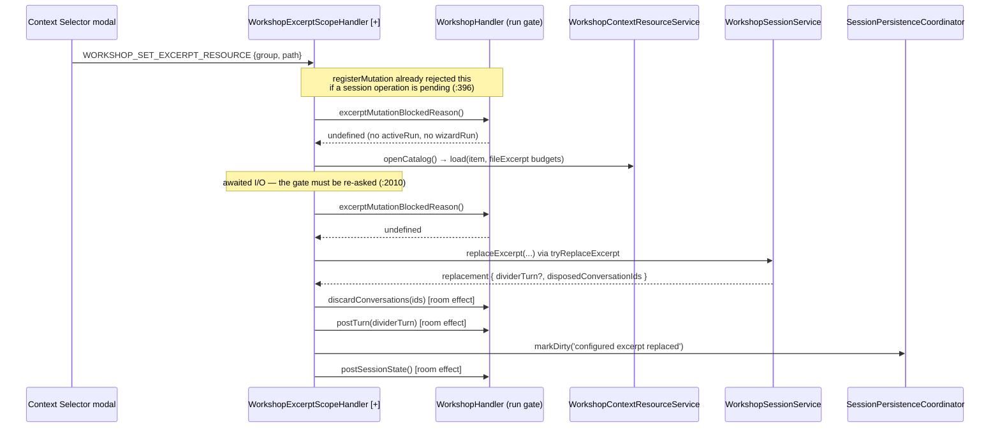

# Architecture Change Runway — Sprint 04: Application Handler Extraction

**Subject:** [`.todo/epics/epic-workshop-architecture-refactor-2026-08-03/sprints/04-application-handler-extraction.md`](../../.todo/epics/epic-workshop-architecture-refactor-2026-08-03/sprints/04-application-handler-extraction.md)

**Branch:** `sprint/workshop-architecture-refactor-04-handlers` → `epic/workshop-architecture-refactor` (Sprint 00 = PR #101, 01 = #102, 02 = #103, 03 = #104, all merged; branch point `04afb67`)

**Altitude:** One sprint. The epic arc, [ADR 2026-08-03](../adr/2026-08-03-workshop-feature-family-and-module-boundaries.md), and the fitness-witness design are settled in the [epic runway](2026-08-03-workshop-refactor-epic-runway.md), the [semantic runway](2026-08-03-workshop-module-semantic-runway.md), and the [Sprint 01](2026-08-03-workshop-sprint-01-feature-slice-runway.md) / [02](2026-08-03-workshop-sprint-02-shared-ownership-runway.md) / [03](2026-08-04-workshop-sprint-03-presentation-runway.md) runways, and are not re-derived here. This runway asks only: **where does `WorkshopHandler` actually cut, and what does the cut cost?**

Repository-specific vocabulary is defined in the [Reader Terms Appendix](#band-5--reader-terms-appendix).

**Audience / task:** Decision owner (Okey) opening the P4 gate; implementer sequencing the moves.

**Date:** 2026-08-04 · **Status:** `READY FOR REVIEW` · **Implementation gate:** **BLOCKED on D1–D4**

---

## Band 0 — Change Card (30 seconds)

### Thesis

Because `WorkshopHandler.ts` is 2,995 lines that directly register **29 of the Workshop domain's 48 routes** and absorb 61 commits since 2026-05-01 — becoming the default owner for every Workshop IPC that is not a widget, a standing directive, or a session file operation — change **route-cluster ownership so each extracted sibling owns its complete helper closure**, while preserving **`executeMessage`, the single active-run/wizard-run lifecycle, the session-operation mutation gate and its ordering, every wire contract, and the `WorkshopSessionService` aggregate facade**, so that **a maintainer finds the owner of a Workshop action by filename, and the next Workshop feature adds a slice instead of a method.**

### Architecture moves

| # | Move | Before | After | Confidence |
|---|---|---|---|---|
| 1 | Cut by **helper closure**, not by the historical route list | Sprint scope inherits the superseded [Sprint 02C](../../.todo/epics/epic-conversation-widgets-2026-07-22/sprints/02c-workshop-scope-context-ipc-extraction.md) "eight-route" seam | Two clusters: **excerpt + scope** (6 routes) and **context + resources** (13 routes). The 02C list splits three shared helpers (**F1**) | STRONG — measured |
| 2 | Extract `WorkshopTodoHandler` | `handleTodoAction`, `WorkshopHandler.ts:2297-2370` | 1 route, zero shared helpers, pure `session` + effects — the cheapest proof of the seam | STRONG |
| 3 | Name the sibling contract that already exists implicitly | `WorkshopMutationRouteRegistrar` is exported from `WorkshopSessionMessageHandler.ts:33` and imported by three unrelated siblings (**F7**) | `WorkshopHandlerContracts.ts` [+] holding the registrar, the room-effects bundle, and the run gate | STRONG |
| 4 | Land `WorkshopHandler` in its declared directory | `handlers/domain/WorkshopHandler.ts` | `handlers/domain/workshop/WorkshopHandler.ts` per ADR §D. **No sprint currently claims this move** (**F5**) | MODERATE — unclaimed |
| 5 | Extend fitness witness #1 from widget/standing routes to the whole Workshop route table | `WORKSHOP_WIDGET_ROUTE_OWNERS`, 10 entries, `boundaries.test.ts:65-106` | 48 entries, or a generated inventory assertion; plus a helper-closure witness | MODERATE |

### Scope and highest risks

| Affected boundary | Why affected | Highest failure mode | Risk |
|---|---|---|---|
| `WorkshopHandler.test.ts` (3,035 lines) | The behavior suite calls `handler.handle*` **directly** — 100+ call sites, not routed through `MessageRouter` | Every extracted route either grows a delegating passthrough (the `:2563-2599` session precedent, which the alpha rules forbid as a shim) or the suite must be split. **The sprint document does not mention this.** (**F2**) | **HIGH** |
| Excerpt/scope mutation gate | `rejectExcerptMutationWhileRunning()` (`:2632`) reads **both** `activeRun` and `wizardRun`; 12 call sites across the 6 routes that move | A boolean-pair port lets the two refusal messages drift apart, or a race re-opens between the two `await` boundaries in `handleSetExcerpt` (**F3**) | **HIGH** |
| `CANCEL_WORKSHOP_REQUEST` | One route, two stream domains (`workshop`, `workshop-context`); `MessageRouter` permits one owner per type | Moving the Context wizard creates three cross-slice edges — cancel, dispose, and the excerpt gate — for one route (**F4**) | MODERATE |
| Room effects surface | `postSessionState()` 35 call sites, `markDirty` 27, `postTurn` 14, `sendError` 101 | A sibling that rebuilds `postSessionState` locally drops `activeContextBudget()` (`:2903`), silently emptying the in-context manifest (**F6**) | MODERATE |
| Participants (`INVITE`/`DISMISS_GUEST`) | Look like a cohesive cluster; `handleInviteGuest` is 165 lines of run lifecycle | Extracting them moves the active-run lifecycle the sprint explicitly keeps central (**F8**) | MODERATE |
| Composition root | `MessageHandler.ts:304` constructs `WorkshopHandler` with 16 positional arguments | Siblings constructed **inside** `WorkshopHandler` (proven 4×) keep the root unchanged; a sibling promoted to the root breaks epic constraint 3 | LOW |
| Wire contracts / persistence | — | **None.** No message type, payload, schema, or `schemaVersion` change is implied by any move here | LOW |

### Human decisions required

| ID | Decision | Options | Recommendation | Needed by |
|---|---|---|---|---|
| **D1** | Where do the cuts fall? | (a) two helper-closure clusters — excerpt/scope (6) + context/resources (13); (b) the literal 02C eight; (c) (a) **plus** a `WorkshopContextIntake` application service owning disk/catalog load, bounding, and refusal descriptors | **(a).** (b) is measurably wrong (**F1**). (c) is the better end state but mixes an application-service extraction into a handler sprint; file it as the named follow-up if `WorkshopContextHandler` lands over ~800 lines. | slice 2 |
| **D2** | What happens to the 3,035-line behavior suite? | (a) split it by owner, no new passthroughs; (b) add delegating passthroughs like `:2563-2599` and leave the suite whole; (c) rewrite it to route through `MessageRouter` | **(a).** The alpha rules forbid compatibility shims, and the epic requires siblings that own complete clusters. (b) recreates the god file in the test tree and in the passthrough wall. (c) is the honest long-term shape but is a second sprint. | slice 1 |
| **D3** | Does the Context wizard move with the context cluster? | (a) yes, with an explicit `cancelRun(requestId): boolean` + `isRunning()` + `dispose()` on the sibling; (b) keep it in `WorkshopHandler` | **(a).** `adoptWizardResult` (`:2114`) is entirely catalog + attachment work; leaving it central re-splits the cluster. The three edges are real but nameable, and (a) forces them into an explicit contract instead of shared private state. | slice 4 |
| **D4** | Does `WorkshopHandler.ts` move into `workshop/` this sprint? | (a) yes, as slice 0, pure `git mv` + witness path update; (b) defer to Sprint 06 | **(a).** Sprint 06 owns *tests and docs mirroring source*, not the source move. Doing it first means every later slice is authored at its final path and no file moves twice. | slice 0 |

### Gate

**State:** `BLOCKED` — D1–D4 are unanswered, and **F2** (the behavior-suite split) is unbudgeted work that changes the sprint's size materially. No `CRITICAL` unknown remains: every question below is a decision, not an investigation. Nothing in this sprint touches persistence, wire contracts, or the composition root, so epic locked constraints 2, 3, 4, 6, and 7 are untouched by construction; constraint 1 (behavior-preserving moves separate from behavior changes) is the one this sprint must actively honor, and slice 0/1 are structured to make it checkable.

---

## Band 1 — Architecture Delta Map (~2 minutes)

### 1.1 Affected subtree — before

```text
packages/core/src/application/handlers/domain/
├── WorkshopHandler.ts                          [~] 2,995   29 routes registered directly
├── WorkshopSessionMessageHandler.ts            [>]   309    9 routes  (sibling precedent #1)
└── workshop/
    ├── WorkshopStandingDirectiveHandler.ts     [=]   167    2 routes  (sibling precedent #2)
    └── widgets/
        ├── WorkshopWidgetHostHandler.ts        [=]    50    1 route   (sibling precedent #3)
        ├── gesturePlayground/
        │   └── WorkshopGesturePlaygroundHandler.ts   737    3 routes  (sibling precedent #4)
        └── lexicalGravity/
            └── WorkshopLexicalGravityHandler.ts      239    4 routes
```

`WorkshopHandler` holds **62% of the Workshop route table** and **68% of the domain's handler lines**. Its nearest sibling is 4.1× smaller than it and 9.7× smaller than it will still be after the biggest planned cut.

### 1.2 Target subtree

```text
packages/core/src/application/handlers/domain/workshop/
├── WorkshopHandler.ts                  [>][~] ~1,150   9 routes + slice composition
├── WorkshopHandlerContracts.ts         [+]      ~70    registrar + room effects + run gate  (F7)
├── WorkshopSessionMessageHandler.ts    [>]       309   9 routes   (unchanged content)
├── WorkshopExcerptScopeHandler.ts      [+]      ~430   6 routes
├── WorkshopContextHandler.ts           [+]      ~800  13 routes   (D1; ~450 under D1c)
├── WorkshopTodoHandler.ts              [+]      ~110   1 route
├── workshopConfiguredResourceFailure.ts [+]      ~40   the one genuinely shared helper (F1)
├── WorkshopStandingDirectiveHandler.ts [=]       167
└── widgets/                            [=]
```

`[>]` on `WorkshopHandler.ts` and `WorkshopSessionMessageHandler.ts` is the ADR §D directory move (D4). Everything else under `widgets/` is untouched.

### 1.3 Route ownership ledger — the complete Workshop table

| Cluster | Routes | Count | Owner after | Shared helpers it takes with it |
|---|---|---:|---|---|
| **Room & run** | `RUN_TOOL`, `QUICK_ACTION`, `SEND_MESSAGE`, `CANCEL_WORKSHOP_REQUEST`, `SELECT_PERSONA`, `SET_CHAT_TARGET`, `INVITE_GUEST`, `DISMISS_GUEST`, `SET_CONVERSATION_SETTINGS` | 9 | `WorkshopHandler` `[=]` | `executeMessage`, `preemptActiveRun`, `settleActiveRun`, `activeContextBudget`, all stream senders |
| **Excerpt & scope** | `SET_EXCERPT`, `PICK_EXCERPT_FILE`, `REREAD_EXCERPT`, `SET_EXCERPT_RESOURCE`, `SET_SESSION_SCOPE`, `REPIN_EXCERPT` | 6 | `WorkshopExcerptScopeHandler` `[+]` | `tryReplaceExcerpt`, `withConfiguredResource`, `loadExcerptFromDisk`, `applyScopeTransition`, `discardConversations` |
| **Context & resources** | `ADD_CONTEXT_TEXT`, `ADD_CONTEXT_FILE`, `REMOVE_CONTEXT_ATTACHMENT`, `UPDATE_CONTEXT_TEXT`, `REQUEST_CONTEXT_ATTACHMENT`, `OPEN_CONTEXT_ATTACHMENT_FILE`, `REQUEST_CONTEXT_CATALOG`, `SEARCH_CONTEXT_RESOURCES`, `ADD_CONTEXT_RESOURCES`, `ATTACH_MESSAGE_RESOURCES`, `ATTACH_MESSAGE_FILE`, `REMOVE_MESSAGE_ATTACHMENT`, `RUN_CONTEXT_WIZARD` | 13 | `WorkshopContextHandler` `[+]` | `applyContextAttachment`, `loadContextFileFromDisk`, `toDisplayPath`, `stageMessageAttachment`, `boundThreadArtifact`, `adoptWizardResult`, `wizardRun` |
| **Todos** | `WORKSHOP_TODO_ACTION` | 1 | `WorkshopTodoHandler` `[+]` | none |
| **Sessions** | 9 file/lifecycle routes | 9 | `WorkshopSessionMessageHandler` `[=]` | — |
| **Widgets & standing** | 10 routes | 10 | 4 existing siblings `[=]` | — |
| | | **48** | | |

### 1.4 Structural view — why the 02C boundary fails and this one does not

The question this diagram answers: **which private helpers does each candidate cut have to tear in half?** Scope: `WorkshopHandler`'s private helper graph only. Level: method. Solid arrow = calls; a helper touched by two clusters is a torn seam.

```mermaid
graph TD
    subgraph EXC["Excerpt + scope cluster — 6 routes"]
        R_SETEX["SET_EXCERPT"]
        R_PICK["PICK_EXCERPT_FILE"]
        R_REREAD["REREAD_EXCERPT"]
        R_EXRES["SET_EXCERPT_RESOURCE"]
        R_SCOPE["SET_SESSION_SCOPE"]
        R_REPIN["REPIN_EXCERPT"]
        H_TRY["tryReplaceExcerpt :2806"]
        H_WITH["withConfiguredResource :2738"]
        H_LOADEX["loadExcerptFromDisk :2499"]
        H_SCOPET["applyScopeTransition :1690"]
    end

    subgraph CTX["Context + resources cluster — 13 routes"]
        R_ADDTXT["ADD_CONTEXT_TEXT"]
        R_ADDFILE["ADD_CONTEXT_FILE"]
        R_ADDRES["ADD_CONTEXT_RESOURCES"]
        R_MSGRES["ATTACH_MESSAGE_RESOURCES"]
        R_MSGFILE["ATTACH_MESSAGE_FILE"]
        R_WIZ["RUN_CONTEXT_WIZARD"]
        H_APPLY["applyContextAttachment :2215"]
        H_LOADCTX["loadContextFileFromDisk :2244"]
        H_STAGE["stageMessageAttachment :1933"]
        H_ADOPT["adoptWizardResult :2114"]
    end

    H_FAIL["reportConfiguredResourceLoadFailure :2655<br/>pure formatter — the ONLY genuinely shared helper"]
    H_GATE["rejectExcerptMutationWhileRunning :2632<br/>reads activeRun AND wizardRun"]

    R_SETEX --> H_WITH --> H_TRY
    R_PICK --> H_LOADEX --> H_TRY
    R_REREAD --> H_LOADEX
    R_EXRES --> H_TRY
    R_EXRES --> H_FAIL
    R_SCOPE --> H_SCOPET
    R_REPIN --> H_SCOPET

    R_ADDTXT --> H_APPLY
    R_ADDFILE --> H_LOADCTX --> H_APPLY
    R_ADDRES --> H_APPLY
    R_ADDRES --> H_FAIL
    R_MSGRES --> H_STAGE
    R_MSGRES --> H_FAIL
    R_MSGFILE --> H_LOADCTX
    R_MSGFILE --> H_STAGE
    R_WIZ --> H_ADOPT --> H_FAIL

    R_SETEX -.gate.-> H_GATE
    R_PICK -.gate.-> H_GATE
    R_REREAD -.gate.-> H_GATE
    R_EXRES -.gate.-> H_GATE
    R_SCOPE -.gate.-> H_GATE
    R_REPIN -.gate.-> H_GATE
    R_WIZ -.owns wizardRun.-> H_GATE
```



Read the diagram against the 02C list — `SET_SESSION_SCOPE`, `REPIN_EXCERPT`, `ADD_CONTEXT_TEXT`, `ADD_CONTEXT_FILE`, `REMOVE_CONTEXT_ATTACHMENT`, `UPDATE_CONTEXT_TEXT`, `REQUEST_CONTEXT_ATTACHMENT`, `OPEN_CONTEXT_ATTACHMENT_FILE`. It takes `ADD_CONTEXT_TEXT` and `ADD_CONTEXT_FILE` while leaving `ADD_CONTEXT_RESOURCES` behind, so `applyContextAttachment` has callers on both sides. It takes `ADD_CONTEXT_FILE` while leaving `ATTACH_MESSAGE_FILE` behind, so `loadContextFileFromDisk` and `toDisplayPath` do too. And it takes the two scope routes without the four excerpt routes that share the same gate. Three torn helpers, one torn gate.

The helper-closure cut tears exactly one helper — `reportConfiguredResourceLoadFailure`, a pure `(result, action, maxBytes) → boolean + error copy` formatter with no state. It becomes a shared module, not a callback.

### 1.5 Representative runtime flow — pinning a configured resource as the excerpt

Current, and target. The question: **what crosses the new seam on the hottest guarded path?**



Two properties must survive the move byte-for-byte: the gate is asked **twice** around the awaited catalog read (an existing race fix), and `discardConversations` reaches `AssistantToolService`, which the excerpt handler must **not** hold directly — it is a room effect, not a sibling dependency.

### 1.6 Blast-radius summary

| Dimension | Direct | Indirect | Confidence |
|---|---|---|---|
| Structural | 1 file split into 5; 2 files moved one directory | `MessageHandler.ts:50` import path; 3 sibling imports of the registrar type | HIGH |
| Behavioral | 20 routes change owner | Gate re-check ordering; wizard cancel/dispose fan-out | HIGH |
| Contract (wire) | **none** | — | HIGH |
| Data / persistence | **none** | `markDirty` reason strings must survive verbatim (they are logged, not persisted) | HIGH |
| Operational | Log prefixes `[WorkshopHandler]` → per-sibling prefixes | Output-channel greps in triage notes go stale (**F9**) | MODERATE |
| Verification | `WorkshopHandler.test.ts` 3,035 lines; `boundaries.test.ts` 3 witnesses | The suite split is the sprint's largest single work item (**F2**) | HIGH |
| Historical / coordination | `WorkshopHandler` is the #2 churn file in the repo (61 commits since 2026-05-01) | No parallel Workshop lane is assigned; the feature freeze holds | HIGH |
| Evolution | Next feature adds a slice + a registry entry | A third guarded-mutation cluster would want the run gate as a first-class port, which this sprint creates | MODERATE |

---

## Band 2 — Reviewer Packet (~10 minutes)

### 2.1 The real job of this sprint

The sprint document says "extract the planned scope/context route cluster" and then, in the same breath, "where dependency and helper analysis proves independent ownership." Those two clauses point at different cuts. The first inherits a superseded plan's boundary; the second is the actual instruction. This runway performs the helper analysis the second clause asks for and finds that the first clause's boundary does not survive it.

The job, restated: **decide the seam from the helper graph, take the whole closure across, and leave `WorkshopHandler` holding only what genuinely coordinates.** Everything else in the sprint — the witness update, the directory move, the contracts module — is bookkeeping that follows from that decision.

### 2.2 Declared intent vs observed state

| Claim | Source | Observed | Verdict |
|---|---|---|---|
| "Extract the planned scope/context route cluster" | Sprint 04 scope | The plan it points at is [02C](../../.todo/epics/epic-conversation-widgets-2026-07-22/sprints/02c-workshop-scope-context-ipc-extraction.md), marked *Superseded 2026-08-03 — mandatory work moved to Phase 4*, whose own "Out of Scope" list excludes the routes that share its helpers | **[Observed]** Partially adoptable. The intent transfers; the route list does not. |
| "`WorkshopHandler` remains the Workshop-internal composition owner … delegates cohesive IPC clusters to named sibling handlers" | ADR §4, `2026-08-03-…-boundaries.md:96` | Exactly the pattern in use: 4 siblings constructed at `:325-379` with closure-bound option objects | **[Observed]** Precedent verified part by part; adopted whole. |
| "No handler receives an internal session ledger directly" | ADR §4 | Witnessed at `boundaries.test.ts:413-420`, scanning all of `handlers/domain` | **[Observed]** Holds; new siblings inherit the guard automatically. |
| Sibling handlers are constructed inside `WorkshopHandler`, not at the composition root | `WorkshopGesturePlaygroundHandler.ts:8-10` ("the WorkshopSessionMessageHandler mold — so the composition root stays ignorant of workshop internals") | `MessageHandler.ts:304` passes services; siblings are built at `:325-379` | **[Observed]** Constraint 3 preserved by following it. |
| Sibling handlers own their own test suites | `workshop/WorkshopStandingDirectiveHandler.test.ts`, `widgets/**/…Handler.test.ts` | True for the three `workshop/` siblings — **and false for `WorkshopSessionMessageHandler`**, which instead grew 9 passthroughs on `WorkshopHandler` (`:2563-2599`, comment: *"Public compatibility seam for focused tests"*) | **[Observed]** The precedent is **inconsistent**. D2 must pick one; see **F2**. |
| "Fitness witnesses #1, #6, #7 update for extracted owners" | Epic phase table | #6 and #7 scan directories and need no per-route edit. #1 is a hand-maintained 10-entry map covering only widget/standing routes | **[Observed]** #1 is the only real work, and it currently declares 21% of the route table. |

### 2.3 Contracts and invariants

**Preserved, verbatim:**

- **Mutation gate ordering.** `registerMutation` (`:386-401`) rejects during a pending session operation *before* the handler body runs. Siblings receive the registrar; they must never call `router.register` for a route that is a mutation today. Read routes (`REQUEST_CONTEXT_ATTACHMENT`, `OPEN_CONTEXT_ATTACHMENT_FILE`, `REQUEST_CONTEXT_CATALOG`, `SEARCH_CONTEXT_RESOURCES`) must stay reads — the comment at `:425-426` records why.
- **Double gate check around awaited I/O.** `handleSetExcerpt` (`:1432`, `:1440`), `handleSetExcerptResource` (`:1978`, `:2010`), `handlePickExcerptFile` (`:2380`, `:2394`, `:2410`), `handleRereadExcerpt` (`:2432`, `:2459`, `:2478`). Twelve call sites, six routes, all moving together.
- **Refusal copy.** `MID_RUN_EXCERPT_GUARD_MESSAGE` and `MID_WIZARD_EXCERPT_GUARD_MESSAGE` (`:185-188`) are distinct on purpose. The port must return the *message*, not two booleans.
- **`markDirty` reason strings** and every `outputChannel.appendLine` payload. Log prefixes change with the owner; the facts after the prefix do not.
- **Wire order.** `postTurn` → `postSessionState`, and on run completion `STREAM_COMPLETE` → `SESSION_STATE` → `STATUS` (`:1386-1389`).
- **Message envelope `source`.** Every Workshop message is emitted with `source: 'extension.workshop'`. Siblings keep that exact string; it is not per-handler.

**New, and narrow:**

```ts
// WorkshopHandlerContracts.ts  [+]
export type WorkshopMutationRouteRegistrar = /* moved verbatim from WorkshopSessionMessageHandler.ts:33 */;

/** Room effects every Workshop slice needs. Callbacks, never copied methods. */
export interface WorkshopRoomEffects {
  postSessionState: () => void;          // composes activeContextBudget() — F6
  postTurn: (turn: WorkshopTurn) => void;
  markDirty: (reason: string) => void;
  reportError: (message: string, details?: string) => void;
  sendStatus: (message: string) => void;
}

/** The one guard that reads run state a sibling does not own. */
export interface WorkshopRunGate {
  /** Refusal copy when an excerpt/scope mutation must not land, else undefined. */
  excerptMutationBlockedReason: () => string | undefined;
}
```

`WorkshopHandler` implements `excerptMutationBlockedReason` as the single place two sources meet:

```ts
excerptMutationBlockedReason: () =>
  this.activeRun ? MID_RUN_EXCERPT_GUARD_MESSAGE
  : this.contextHandler.isWizardRunning() ? MID_WIZARD_EXCERPT_GUARD_MESSAGE
  : undefined
```

### 2.4 Negative space — what the generic owner must not know

`WorkshopHandler` after this sprint is a **generic name over a specific residue**, so the negative-space test applies to it directly.

| Question | Answer |
|---|---|
| What do all remaining members share? | They participate in the run lifecycle: they start, preempt, cancel, settle, or gate an in-flight model call, or they compose the slices that do. |
| What must it *not* know? | Attachment word budgets, catalog paths, truncation policy, todo action grammar, scope-transition logging, excerpt fingerprints. |
| What would the next feature edit? | Its own slice file, plus one line in `registerRoutes` and one entry in the route-owner witness. |
| Does the name still tell the truth? | **Not fully.** `WorkshopHandler` after extraction is a room/run orchestrator; `WorkshopRoomHandler` would be truer. Renaming it collides with the ADR §D tree, which names it `WorkshopHandler`. **Leave the name, record the tension** — Sprint 06 owns the contract/name normalization pass. |
| Does `WorkshopContextHandler` risk the same drift? | Yes, at ~800 lines. That is why D1c exists and why the follow-up is named rather than hoped for. |

### 2.5 Quality scenarios

| # | Source | Stimulus | Environment | Artifact | Expected response | Response measure |
|---|---|---|---|---|---|---|
| Q1 | Writer | Pin a configured resource as the excerpt while a tool run is in flight | Active run, `SET_EXCERPT_RESOURCE` mid-catalog-read | `WorkshopExcerptScopeHandler` | Refusal with the *tool* message, no excerpt mutation | Test asserts refusal copy is `MID_RUN_EXCERPT_GUARD_MESSAGE` and `session.replaceExcerpt` is never called, for both the pre-await and post-await window |
| Q2 | Writer | Pin an excerpt while the Context wizard is running | Wizard active, no room run | `WorkshopExcerptScopeHandler` + `WorkshopContextHandler` | Refusal with the *wizard* message | Test drives the wizard through the sibling and asserts the excerpt handler receives the wizard copy — proves the gate crosses the seam intact |
| Q3 | Writer | Cancel the wizard from the composer | `CANCEL_WORKSHOP_REQUEST { domain: 'workshop-context' }` | `WorkshopHandler` → context sibling | Wizard aborts; `STREAM_COMPLETE { cancelled: true, domain: 'workshop-context' }` | Existing wizard cancel test passes unchanged after the fan-out |
| Q4 | Maintainer | Add a hypothetical fourth guarded-mutation cluster | Sprint 05+ | `registerRoutes` + witness | New slice file + 1 registration line + N witness entries; **zero edits to existing slices** | Reproduction test (§3.3) |
| Q5 | Reviewer | Trace "why did my attachment get refused?" | Any | Filenames | One file answers it | Filename audit: `WorkshopContextHandler.ts` holds all refusal copy for attachments |
| Q6 | On-call / triage | Read the output channel after a failed pin | Extension Development Host | Log lines | Prefix names the owner; the fact after the prefix is unchanged | Diff of log-line bodies before/after is empty except the bracketed prefix |
| Q7 | CI | Someone registers a Workshop route in the wrong file | Any PR | `boundaries.test.ts` | Build fails naming both the message type and the offending file | Witness covers all 48 routes, not 10 |

**Sensitivity point:** the shape of `WorkshopRunGate`. A boolean-pair port makes Q1/Q2 pass today and drift tomorrow.
**Tradeoff point:** D3(a) buys cluster cohesion at the price of three explicit cross-slice edges. D3(b) buys one fewer edge at the price of a torn cluster — the exact failure this runway exists to prevent.
**Risk theme:** every high-severity finding here is about *state a route reads but does not own* — run state, wizard state, budget composition. Route ownership is the easy half; state ownership is the sprint.

### 2.6 Alternatives

| Option | Shape | Retain? |
|---|---|---|
| **Minimal patch** | Extract only `WorkshopTodoHandler` and the literal 02C eight | **Reject.** Tears three helpers (**F1**), leaves `WorkshopHandler` ~2,500 lines, and burns the sprint's review budget on a boundary the next sprint must redo. |
| **Recommended** | Helper-closure clusters: excerpt/scope, context/resources, todos; contracts module; directory move; witness extension | **Retain.** One torn helper, and it is pure. `WorkshopHandler` lands at ~1,150 lines holding one nameable job. |
| **More generalized** | A Workshop *route-slice framework*: a `WorkshopSlice` interface, a slice registry, generated witness entries, `WorkshopContextIntake` as a service (D1c) | **Reject the framework, retain D1c as a follow-up.** Five slices do not justify an abstraction over slices; the closed registry the epic already uses for standing directives is the proven idiom, and inventing a second one here would be premature generalization in a fake mustache. |

### 2.7 Principle and quality tensions

| Principle / quality | Status | Evidence of support | Tension or violation | Consequence | Planned witness | Confidence |
|---|---|---|---|---|---|---|
| Single responsibility | `TENSION` | Room/run job is nameable after extraction | `WorkshopContextHandler` at ~800 lines carries intake + catalog + wizard | Third-largest handler in the repo on day one | Named follow-up (D1c); no witness | MODERATE |
| Naming truthfulness | `TENSION` | Every new sibling is named for its cluster | `WorkshopHandler` no longer describes what it holds | Reader expects a facade, finds an orchestrator | Sprint 06 normalization | HIGH |
| Dependency direction | `STRONG` | Siblings built inside `WorkshopHandler`; root untouched | — | — | `boundaries.test.ts:260-266` | HIGH |
| Aggregate encapsulation | `STRONG` | No sibling touches an internal ledger | — | — | `boundaries.test.ts:413-420` (directory-scoped, inherits new files) | HIGH |
| Open/closed | `ACCEPTABLE` | New cluster = new file + 1 registration line | Witness map is hand-maintained; a 48-entry literal invites drift | A forgotten entry silently un-guards a route | Extend #1; prefer an inventory assertion over a literal | MODERATE |
| Testability | `TENSION` | Siblings are independently constructible | 3,035-line suite is coupled to `WorkshopHandler`'s method surface | The split is the sprint's biggest cost | D2 | HIGH |
| Change isolation | `STRONG` | 61-commit hotspot becomes 5 files | — | Merge conflicts localize | Churn re-measure at close-out | MODERATE |
| Operability | `TENSION` | Logs keep their facts | Prefixes change; triage notes cite `[WorkshopHandler]` | Stale greps in `.memory-bank` and PR reviews | Close-out note listing prefix changes (**F9**) | HIGH |
| Reliability | `ACCEPTABLE` | Gate copy and double-check preserved as contract | Gate now crosses a process boundary in the code | A missed re-check re-opens a closed race | Q1/Q2 | MODERATE |

### 2.8 Ranked findings

| ID | Severity | Claim | Evidence | Smallest fix |
|---|---|---|---|---|
| **F1** | **HIGH** | The declared 02C eight-route seam tears three shared private helpers and one shared gate; taking it verbatim violates this sprint's own completion criterion *"sibling handlers own complete route/helper clusters, not arbitrary method fragments."* | `applyContextAttachment` (`:2215`) has callers at `:1456`, `:1486` (in the 02C list) and `:1821` (excluded by 02C's Out-of-Scope). `loadContextFileFromDisk` (`:2244`) at `:1482` (in) and `:1897` (out). `toDisplayPath` (`:2859`) at `:1481` (in) and `:1896` (out). Gate `:2632` has 12 call sites across 6 routes, only 2 of which 02C takes. | Adopt D1(a). Cut excerpt/scope (6) and context/resources (13) by closure; make `reportConfiguredResourceLoadFailure` a shared pure module. |
| **F2** | **HIGH** | The 3,035-line behavior suite drives `WorkshopHandler` by direct method call, and the sprint does not budget for it. The in-repo precedent is contradictory, so "follow the precedent" is not an answer. | `WorkshopHandler.test.ts` — 37 `handler.handleSendMessage`, 11 `handleSetChatTarget`, 7 `handleAddContextText`, 4 `handleTodoAction`, etc. `WorkshopHandler.ts:2563-2599` adds 9 passthroughs "for focused tests"; `workshop/**` siblings added none and own their suites instead. | Decide D2 before slice 1. If (a), budget the suite split as a first-class slice with its own commit. |
| **F3** | **HIGH** | `rejectExcerptMutationWhileRunning` reads two run states the excerpt cluster will not own, and the two refusal messages are behaviorally distinct. A naive `isRunning(): boolean` port collapses them. | `:2632-2642`; `MID_RUN_EXCERPT_GUARD_MESSAGE` vs `MID_WIZARD_EXCERPT_GUARD_MESSAGE` at `:185-188`; both asserted by existing tests | Port returns `string \| undefined`, not `boolean`. Q1 and Q2 pin both branches across the seam. |
| **F4** | MODERATE | Moving the Context wizard creates three cross-slice edges for one route, because `CANCEL_WORKSHOP_REQUEST` is a single router entry serving two stream domains. | `handleCancelRequest` `:1391-1416` branches on `domain`; `dispose()` `:503` calls `cancelWizardRun`; the gate reads `wizardRun` `:2637` | D3(a) with an explicit three-method contract (`cancelRun`, `isRunning`, `dispose`), asserted by Q2/Q3 — or D3(b) and accept the torn cluster. |
| **F5** | MODERATE | ADR §D places `WorkshopHandler.ts` and `WorkshopSessionMessageHandler.ts` under `handlers/domain/workshop/`. They are still at `handlers/domain/`. **No sprint claims the move.** Sprint 06 owns tests/docs mirroring source, not the source move. | ADR §D tree; actual paths; Sprint 06 scope list | D4(a): pure `git mv` as slice 0, plus the `WORKSHOP_HANDLER_ROOT` constant at `boundaries.test.ts:56`, which today points at `domain/` and therefore also scans the 11 non-Workshop handlers. |
| **F6** | MODERATE | `postSessionState()` is not a message send — it composes `activeContextBudget()`, which reads live conversation budgets and writer sources from `AssistantToolService`. A sibling that reimplements the send drops the in-context manifest silently. | `:2879-2901` → `:2903-2931`; the manifest has its own suite (`WorkshopHandler.test.ts:2656`, "In-context manifest projection (Phase 7)") | `postSessionState` crosses the seam only as a callback in `WorkshopRoomEffects`. Add a witness that no `workshop/` sibling constructs a `WORKSHOP_SESSION_STATE` message literal. |
| **F7** | LOW–MODERATE | `WorkshopMutationRouteRegistrar` — a family-wide contract — is exported from one sibling and imported by three others, so every slice depends on `WorkshopSessionMessageHandler` for a type that has nothing to do with sessions. Two more siblings would make it five. | `WorkshopSessionMessageHandler.ts:33`; imported at `WorkshopStandingDirectiveHandler.ts:5`, `WorkshopGesturePlaygroundHandler.ts:39`, `WorkshopLexicalGravityHandler.ts:5` | Move it to `WorkshopHandlerContracts.ts` with the new effects/gate types. Mechanical; four import edits. |
| **F8** | LOW–MODERATE | The participant routes look like a cluster but are not one: `handleInviteGuest` is 165 lines of `activeRun`, capability minting, streaming, and `completeWorkshopRun`. Extracting it moves the run lifecycle the sprint keeps central; leaving it strands `SELECT_PERSONA` + `SET_CHAT_TARGET` (~40 lines) with no home worth a file. | `:678-842` vs `:658-675`, `:868-888` | **Decline the participant cluster explicitly** in the sprint's implementation outcome, with this reason recorded, so Sprint 07's audit does not re-litigate it. |
| **F9** | LOW | Log prefixes move from `[WorkshopHandler]` to per-sibling prefixes. Existing PR reviews and `.memory-bank` triage notes grep the old prefix. | ~40 `appendLine` sites carrying `[WorkshopHandler]` | One close-out table mapping old prefix + subject → new prefix. |

### 2.9 What survived attack

Recorded so the decision owner knows which parts to stop re-litigating:

- **The sibling-handler pattern itself.** Verified part by part against all four existing siblings: constructor shape `(session?, service…, postMessage, outputChannel, options)`, closure-bound callbacks, `registerRoutes(router, registerMutation)`, composition inside `WorkshopHandler`. Nothing about it is aspirational; it has shipped four times and none of the four reaches the composition root.
- **Epic constraints 2–7 are untouched by construction.** No `vscode` import enters core, the composition root is unchanged, the aggregate facade is unchanged, no wire contract or persisted shape moves, and `prose-minion/sessions/.gitignore` is not in scope. Only constraint 1 requires active discipline, and slices 0/1 are ordered to make violations visible in the diff.
- **Witnesses #6 and #7 need no per-route maintenance.** Both scan `handlers/domain` recursively (`boundaries.test.ts:260`, `:413`), so new siblings inherit the guards the moment they land. Only #1 is hand-maintained.
- **The room/run residue is genuinely cohesive.** The nine retained routes were tested against the question "would any of these be surprising in a file called *room and run orchestration*?" and none were. There is no fifth hidden cluster waiting in the remainder.
- **No `CRITICAL` unknown.** Every open item is a decision with a recommendation, not missing evidence.

### 2.10 Implementation slices

| # | Slice | Owns | Verification | Depends on |
|---:|---|---|---|---|
| 0 | **Directory move** — `git mv` `WorkshopHandler.ts` + `WorkshopSessionMessageHandler.ts` into `workshop/`; update `MessageHandler.ts:50`, three sibling imports, `WORKSHOP_HANDLER_ROOT` | zero logic change | Full Jest + typecheck; diff shows only path lines | D4 |
| 1 | **Contracts module + suite decision** — `WorkshopHandlerContracts.ts` [+]; move the registrar (**F7**); execute D2's answer for the existing suite before any route moves | the seam vocabulary | Suite green in its new shape *before* anything is extracted | D2 |
| 2 | **`WorkshopTodoHandler`** — 1 route, no shared helpers | proves the effects contract end to end | New focused suite; route-owner witness entry | 1 |
| 3 | **`WorkshopExcerptScopeHandler`** — 6 routes + closure + `WorkshopRunGate` | the double-gate contract | Q1, Q2; existing excerpt/scope/re-read/resource tests | 2, and D3 answered |
| 4 | **`WorkshopContextHandler`** — 13 routes + closure + wizard (D3a) + shared failure module | attachment intake and refusal copy | Q2, Q3; existing context/wizard/message-attachment tests | 3 |
| 5 | **Witness extension** — #1 to all 48 routes; the `postSessionState` guard (**F6**); close-out log-prefix table (**F9**) | regression protection | `boundaries.test.ts`; full verification baseline | 4 |

Slices 0 and 1 are behavior-preserving by construction and must land as their own commits (epic constraint 1). Slices 2–4 each move one closure and must contain **no** opportunistic cleanup — a renamed local variable in a moved method is the fastest way to make a 900-line diff unreviewable.

### 2.11 Coordination map

Sprint 04 is the **sole owner** of `application/handlers/domain/WorkshopHandler.ts`, `WorkshopSessionMessageHandler.ts`, everything new under `handlers/domain/workshop/`, and `__tests__/application/handlers/domain/**`. It touches `boundaries.test.ts` (shared with every sprint in this epic — the only file with cross-sprint contention) and `MessageHandler.ts` for one import line.

The Workshop feature freeze holds, so no feature lane competes. Sprint 05 (session aggregate) begins after this merges; the two would otherwise collide on the handler↔aggregate call surface.

### 2.12 Unknowns that could reverse the decision

| Unknown | Would reverse | Resolution |
|---|---|---|
| Does splitting `WorkshopHandler.test.ts` surface hidden coupling between context and run assertions (e.g. a context test that depends on run state set by an earlier `describe`)? | Would push toward D2(b) or a per-slice characterization test first | Grep the suite for cross-`describe` shared `session` mutations during slice 1, before extracting anything |
| Does `WorkshopContextHandler` actually land near 800 lines, or does the wizard push it past 1,000? | Past ~1,000 the cluster is a new god file and D1c becomes mandatory rather than a follow-up | Measure at the end of slice 4; the runway's estimate is arithmetic on current line counts, not a promise |
| Is the 48-entry route-owner map maintainable, or does it become the drift it was meant to prevent? | Would push toward an inventory assertion (scan `registerRoutes`, assert the *set* of Workshop message types is covered exactly once) | Decide during slice 5; both shapes pass Q7 |

---

## Band 3 — Self-review and Re-plan Verdict

### 3.1 Contradictions found

1. **Sprint scope vs. its own completion criteria.** "Extract the planned scope/context route cluster" (the 02C list) and "sibling handlers own complete route/helper clusters, not arbitrary method fragments" cannot both be satisfied. Resolved by **F1** in favor of the criterion; the scope line is intent, not a boundary.
2. **Epic phase table vs. reality on witness #1.** The table says P4 "updates #1 for extracted owners," implying #1 already covers the handler's routes. It covers 10 of 48. Resolved by sizing the witness work honestly in slice 5.
3. **ADR §D tree vs. the file system.** Two files sit outside their declared home and no sprint owns the move. Resolved by **F5**/D4.
4. **Sibling test precedent vs. itself.** Passthroughs in one case, own-suite in three. Resolved by forcing D2 rather than silently picking.

### 3.2 Prospective failure review

Assume this merged and something went wrong six weeks later.

- **"Pinning an excerpt during the wizard stopped being refused."** Cause: the run gate was ported as a boolean and the wizard branch was dropped when the wizard moved. Missing evidence today: no single test asserts the *wizard* refusal message through the excerpt path. → Q2 exists for exactly this.
- **"The in-context manifest is empty for everyone."** Cause: a sibling built its own `WORKSHOP_SESSION_STATE` message and never called `activeContextBudget()`. → **F6** witness.
- **"A new Workshop route silently has no guard."** Cause: added via `router.register` in a sibling, bypassing `registerMutation`; the 10-entry witness never noticed. → slice 5 must cover mutation-vs-read classification, not just file ownership.
- **"Nobody can review the extraction PR."** Cause: slices 3 and 4 landed as one commit with incidental renames. → epic constraint 1, enforced per slice.
- **"Sprint 05 conflicts constantly."** Cause: the aggregate sprint started before this merged. → §2.11.

### 3.3 Reproduction test

A hypothetical Sprint 08 adds **Passage Bookmarks**: a writer marks positions in the excerpt; marks are session-owned, mutation-gated, and refused while a run is in flight.

Against the target tree: add `WorkshopBookmarkHandler.ts` under `workshop/`, take `WorkshopRoomEffects` + `WorkshopRunGate` in its options, register through `registerMutation`, add its routes to the witness, add its suite. **Edits to existing slices: one registration line in `registerRoutes` and N witness entries.** No existing handler body changes, and the run gate it needs already exists as a port rather than as private state — which is only true *because* the excerpt cluster forced it into a contract in slice 3.

Against today's tree: the routes land in `WorkshopHandler`, which grows past 3,100 lines, and the gate stays private.

### 3.4 Re-plan Verdict: **REFINED**

**Initial plan (from the sprint document):** extract the planned scope/context route cluster; extract further file/resource, participant, settings, todo, and context-wizard clusters where analysis proves independence; keep `executeMessage`, run lifecycle, room delivery, and cross-slice orchestration central.

**Final plan:** extract **three** clusters chosen by private-helper closure — excerpt/scope (6 routes), context/resources including the wizard (13), and todos (1) — behind a named contracts module carrying the mutation registrar, a room-effects bundle, and a refusal-copy run gate; **explicitly decline** the participant and conversation-settings clusters as run-lifecycle work; move both remaining Workshop handler files into their ADR-declared directory; and split the 3,035-line behavior suite as first-class, budgeted work.

**What changed:**

| Aspect | Initial | Final | Why |
|---|---|---|---|
| Cluster boundary | The 02C eight | Helper closure: 6 + 13 + 1 | **F1** — measured tears in three helpers and the gate |
| Participants | "where analysis proves independent ownership" | Declined, with reason recorded | **F8** — `handleInviteGuest` is 165 lines of run lifecycle |
| Settings | Same clause | Declined for this sprint | Hidden temporal coupling: `settleActiveRun` (`:2691`) and `WorkshopSessionMessageHandler` both drive `flushDeferredConversationSettings`; a third caller wants an ordering test first |
| Wizard | Listed as a candidate | Moves **with** the context cluster under an explicit cancel/dispose/isRunning contract | **F4** — the alternative re-tears the cluster |
| Test suite | Unmentioned | A named slice with its own decision | **F2** — 100+ direct call sites; contradictory precedent |
| Directory | Unmentioned | Slice 0 pure move | **F5** — unclaimed ADR §D work |
| Shared types | Unmentioned | `WorkshopHandlerContracts.ts` | **F7** — three siblings import a family contract from a fourth |

**Remaining uncertainty:** the final size of `WorkshopContextHandler` (§2.12), and whether the route-owner witness is better as a 48-entry literal or a set-coverage assertion. Neither changes the architecture.

### 3.5 Implementation gate

| Requirement | State |
|---|---|
| No unaccepted `CRITICAL` unknown | ✅ none |
| Changed public contracts identify consumers, compatibility, tests | ✅ the only contract change is internal (`WorkshopHandlerContracts`); no wire contract moves |
| Persisted state changes define ownership/migration/rollback | ✅ **none exist** |
| Each runtime flow has an owner and a verification path | ✅ §1.5, Q1–Q7 |
| Generic owners pass negative-space and reproduction tests | ⚠️ passes, **with** the recorded naming tension on `WorkshopHandler` (§2.4) deferred to Sprint 06 |
| Target tree, responsibilities, contracts, slices mutually consistent | ✅ §1.2 / §1.3 / §2.3 / §2.10 reconciled |
| Human decisions explicit and assigned | ❌ **D1–D4 open** |
| Coordination and file ownership recorded | ✅ §2.11 |

**Gate: BLOCKED.** The smallest unblocking set is D1 and D2. D3 is needed before slice 3, D4 before slice 0.

---

## Band 4 — Evidence Appendix

### 4.1 Measurements at branch point `04afb67`

| Measure | Value | Command / anchor |
|---|---|---|
| `WorkshopHandler.ts` | 2,995 lines | `wc -l` |
| Routes registered directly in it | 29 (24 mutations, 5 reads incl. cancel) | `:403-480` |
| Total Workshop routes | 48 across 6 files | per-file registration count |
| Commits since 2026-05-01 | 61 (`WorkshopSessionService.ts`: 54) | `git log --since=2026-05-01 --follow` |
| Behavior suite | 3,035 lines | `WorkshopHandler.test.ts` |
| Direct `handler.handle*` calls in the suite | 100+ across 40 distinct methods | grep tally |
| Constructor arity | 16 positional args + widget-runtime bundle | `:287-304` |
| Workshop application-layer total | 15,977 lines (handlers + services) | `wc -l` over both trees |

### 4.2 Private-helper call-site census

| Helper | Def | Call sites | Cluster |
|---|---|---:|---|
| `sendError` | `:2983` | 101 | shared effect |
| `postSessionState` | `:2879` | 35 | shared effect (composes `activeContextBudget`) |
| `markDirty` (via `sessionPersistence`) | — | 27 | shared effect |
| `sendStatus` | `:2969` | 17 | shared effect |
| `postTurn` | `:2869` | 14 | shared effect |
| `rejectExcerptMutationWhileRunning` | `:2632` | 12 (6 routes) | excerpt/scope + wizard gate |
| `tryReplaceExcerpt` | `:2806` | 4 | excerpt/scope |
| `reportConfiguredResourceLoadFailure` | `:2655` | 4 | **both** — pure, extract as module |
| `preemptActiveRun` | `:2620` | 4 | room/run |
| `applyContextAttachment` | `:2215` | 3 | context |
| `toDisplayPath` | `:2859` | 3 | context |
| `withConfiguredResource` | `:2738` | 3 | excerpt/scope |
| `settleActiveRun` | `:2682` | 3 | room/run |
| `executeMessage` | `:928` | 3 (+1 injected into the gesture sibling) | room/run |
| `loadContextFileFromDisk` | `:2244` | 2 | context |
| `loadExcerptFromDisk` | `:2499` | 2 | excerpt/scope |
| `stageMessageAttachment` | `:1933` | 2 | context |
| `applyScopeTransition` | `:1690` | 2 | excerpt/scope |
| `flushDeferredConversationSettings` | `:2711` | 2 | room/run + session sibling |
| `discardConversations` | `:2853` | 2 | room/run (called by excerpt cluster as an effect) |
| `commitTimeNotice` | `:2701` | 2 | room/run |
| `boundThreadArtifact` | `:1955` | 1 | context |
| `adoptWizardResult` | `:2114` | 1 | context |
| `cancelWizardRun` | `:2644` | 1 | context (after D3a) |
| `activeContextBudget` | `:2903` | 1 (inside `postSessionState`) | room/run |

### 4.3 Fitness witnesses

| # | Invariant | Where | P4 action |
|---|---|---|---|
| 1 | Declared route locations | `boundaries.test.ts:65-106`, asserted `:297-317` | **Extend** from 10 widget/standing entries to all 48, or replace with a set-coverage assertion |
| 3 | Feature isolation | `:319-339` | none |
| 6 | Composition direction | `:260-266` | Path constant only, if D4(a) |
| 7 | Aggregate encapsulation | `:413-420` | none — directory-scoped, inherits new files |
| — | Legacy ownership exceptions | `:422-443` | none — P6 entries only |
| **new** | Session-state composition | — | Assert no `workshop/` sibling constructs a `WORKSHOP_SESSION_STATE` literal (**F6**) |

`WORKSHOP_HANDLER_ROOT` at `:56` currently resolves to `handlers/domain`, so witnesses 1 and 7 also scan the 11 non-Workshop handlers. That is harmless today and becomes precise after D4(a).

### 4.4 Genealogy and precedent

- **ADR 2026-08-03 §4** (`:96`) — `WorkshopHandler` is the Workshop-internal composition owner delegating cohesive IPC clusters. Verified adopted.
- **Semantic runway §D** — names `WorkshopScopeContextHandler` in the destination tree. This runway supersedes that single name with two (`WorkshopExcerptScopeHandler`, `WorkshopContextHandler`) on the helper-closure evidence; the tree's *shape* is unchanged.
- **Sprint 02C** (superseded 2026-08-03) — source of the eight-route list. Read in full: its own Out-of-Scope section excludes catalog/search/resource attachment, the wizard, and the excerpt file pipeline, which is precisely where its helpers' other callers live. The list was a defensible *pure-move* boundary when the goal was "shrink the file safely"; it is not a responsibility boundary.
- **`WorkshopSessionMessageHandler`** (2026-07, 9 routes, 309 lines) — first sibling. Kept 9 passthroughs on `WorkshopHandler` for tests.
- **`WorkshopGesturePlaygroundHandler`** (`:1-11`) — states the mold explicitly: *"constructed inside WorkshopHandler with closures over the handler's private seams — the WorkshopSessionMessageHandler mold — so the composition root stays ignorant of workshop internals."* Adopted whole; the passthrough half was **not** adopted, which is the inconsistency **F2** must resolve.
- **Tech debt: [Workshop god files](../../.todo/tech-debt/2026-07-25-workshop-god-files.md)** — records `WorkshopHandler` at 2,959 lines on 2026-07-31 (now 2,995) and names the scope/context IPC cluster as candidate seam #2. Its own note that the seam "follows `WorkshopSessionMessageHandler` exactly" is the claim this runway tested and partly refuted.

### 4.5 ADR seed

**Context.** `WorkshopHandler` owns 62% of the Workshop route table. Prior extractions cut by *route list*; the helper graph shows route lists and responsibility boundaries diverge.

**Decision candidates.** (1) Cut by private-helper closure, with pure shared helpers promoted to modules and impure shared state promoted to named ports. (2) Cut by route list and accept torn helpers. (3) Introduce a slice framework.

**Tradeoffs.** (1) yields larger individual slices and forces the run gate into a contract; (2) yields smaller reviewable diffs and predictable rework; (3) yields uniformity nothing yet demands.

**Unresolved.** Whether `WorkshopContextHandler` needs a companion intake *service* (D1c), and whether route-ownership witnesses should be enumerated or derived.

**Status.** Not accepted. This seeds an amendment to ADR 2026-08-03 §4 if D1 lands as (a) — the ADR names one `WorkshopScopeContextHandler` where the evidence supports two.

---

## Band 5 — Reader Terms Appendix

### Technical

| Term | Local meaning in this change | Where it matters | State |
|---|---|---|---|
| **Sibling handler** | A per-webview IPC collaborator owning one route cluster, constructed *inside* `WorkshopHandler` (never at the composition root) with closure-bound callbacks | The whole sprint | current — 4 exist |
| **Helper closure** | The set of private methods reachable only from one route cluster. The unit this runway argues extraction should be measured in | F1, §1.4 | proposed |
| **Room effects** | The callback bundle (`postSessionState`, `postTurn`, `markDirty`, `reportError`, `sendStatus`) a slice needs but must not own | §2.3, F6 | proposed |
| **Run gate** | Port returning refusal *copy* for a mutation blocked by an in-flight run or wizard — deliberately not a boolean | F3, Q1, Q2 | proposed |
| **Mutation registrar** | `registerMutation` — wraps a route so it is refused while a session file operation is pending, *before* the handler body runs | §2.3 | current (`:386`) |
| **Fitness witness** | An executable architecture test in `boundaries.test.ts`, numbered #1–#10 by the epic | §4.3 | current |
| **Closed registry** | Explicit `Record<Family, Operations>` dispatch over known variants; the epic's chosen alternative to dynamic plugins | §2.6 | current (standing directives) |
| **Passthrough / compatibility seam** | `divergent` — here it means a public delegating method kept **solely so an existing test keeps compiling**, not a versioned public API. The alpha rules forbid it as a shim; `:2563-2599` predates that reading | F2, D2 | current, contested |
| **Pure move** | A commit that relocates code without altering behavior, names, or control flow. Epic constraint 1 requires these be separate commits | slices 0, 3, 4 | current |

### Domain

| Term | Local meaning in this change | Where it matters | State |
|---|---|---|---|
| **Room** | The Workshop session's shared conversational space — turns, participants, delivery offsets. "Room/run orchestration" is the residue `WorkshopHandler` keeps | §1.3, §2.4 | current |
| **Excerpt** | The single pinned working passage. Versioned; replacement retires sidecar conversations and may emit a divider turn | excerpt cluster | current |
| **Shelf / re-pin** | Where a passage goes when a session becomes an open conversation, and the action that brings it back. Guarded by the same gate as pinning | `REPIN_EXCERPT` | current |
| **Session scope** | `passage` vs `open`, chosen before participant memory exists and then locked (ADR 2026-07-25). Refusals name the new-session recovery path | `SET_SESSION_SCOPE` | current |
| **Context attachment** | Writer- or wizard-supplied prompt-bearing material under a shared 50,000-word budget. Distinct from a *message attachment* | context cluster | current |
| **Message attachment / thread artifact** | A one-shot artifact staged for exactly one composer send, then released — it does not persist into the standing prompt | `ATTACH_MESSAGE_*` | current |
| **Context wizard** | A one-at-a-time generation run on its own stream domain (`workshop-context`) that lands its output as ordinary wizard-tagged attachments | F4, D3 | current |
| **Configured resource** | A file reachable through the project's configured context paths, addressed by canonical `{ group, path }`; absolute paths never cross to the webview or a prompt | excerpt + context clusters | current |
| **Standing directive** | A persistent prompt contribution installed by a widget family, versus a one-shot artifact | untouched here | current |
| **Sidecar** | A retained per-tool or per-guest conversation, separate from the host conversation | room/run residue | current |
