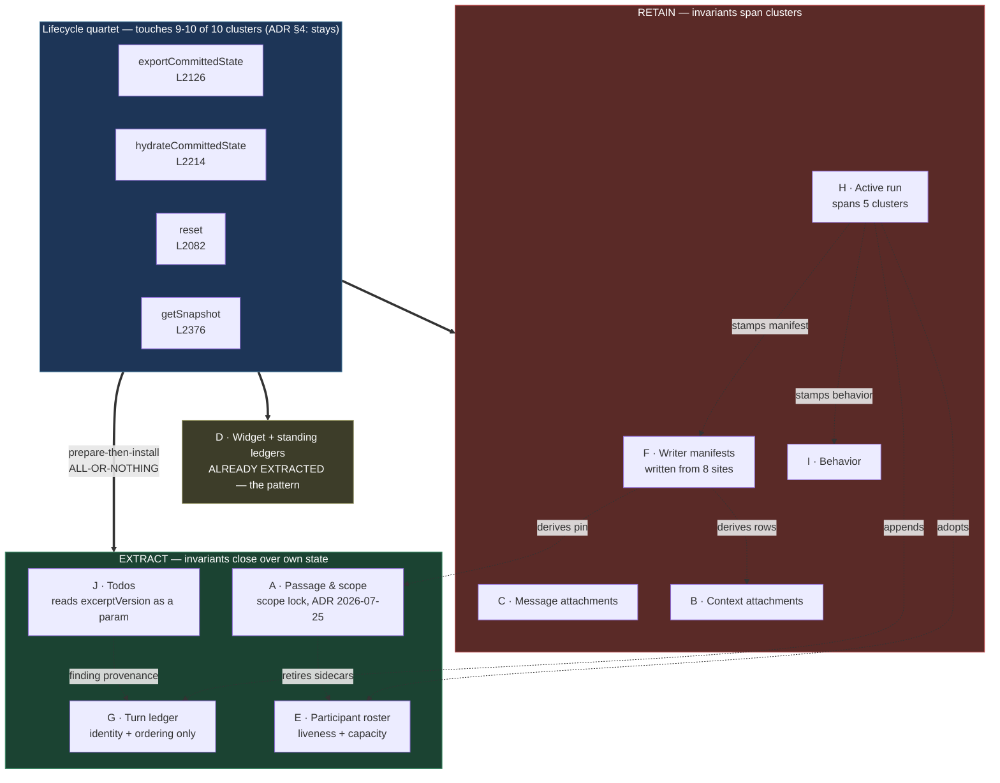

# Architecture Change Runway — Sprint 05: Session Aggregate Extraction

**Date:** 2026-08-05
**Sprint:** [`05-session-aggregate-extraction.md`](../../.todo/epics/epic-workshop-architecture-refactor-2026-08-03/sprints/05-session-aggregate-extraction.md)
**Epic:** [Workshop Architecture Refactor](../../.todo/epics/epic-workshop-architecture-refactor-2026-08-03/epic-workshop-architecture-refactor.md)
**Decision:** [ADR 2026-08-03 — Workshop Feature Family and Module Boundaries](../../docs/adr/2026-08-03-workshop-feature-family-and-module-boundaries.md) §4, §8
**Branch point:** `476afbf1` (Sprint 04 merged)
**Audience:** decision owner + implementer. **Task:** approve the extraction set, then implement.
**Status:** `READY FOR REVIEW` — one blocking decision (D1) and one required pre-slice (S0).

---

## Band 0 — Change Card (30 seconds)

### Thesis

Because `WorkshopSessionService` (2,894 lines, 104 methods, 26 state fields) holds **ten
distinct state clusters** but **30 of its methods read or write more than one of them** —
and its four lifecycle methods legitimately touch nine or ten — change **ownership of only
those clusters whose invariants close over their own state**, while preserving **the
aggregate facade, the prepare/install hydration contract, reset semantics, autosave
ordering, and cross-record integrity**, so that **a maintainer can find and test one session
concept without reading the whole aggregate, and the file's remaining size is honest
coordination rather than accumulated ownership.**

### Architecture moves

1. **Install the atomicity witness first.** `hydrateCommittedState` is also the
   failure-rollback path. Pin prepare-before-install ordering with an executable witness and
   a fault-injection test **before** moving any state (slice S0).
2. **Extract four ledgers**, each honoring the proven four-method state contract:
   `WorkshopTodoLedger`, `WorkshopTurnLedger`, `WorkshopPassageScope`,
   `WorkshopParticipantRoster`.
3. **Deliberately retain** writer-source manifests, the active-run state machine, message
   attachments, context attachments, and behavior inside the aggregate — with the reason
   recorded, not left implicit.
4. **Extend witness #7** so aggregate encapsulation covers every new collaborator instead of
   the two names hardcoded today.
5. **Close scope item 4 with evidence, not a split.** Store, search index, and persistence
   coordinator show no divergence pressure (5, 2, and 9 commits since 2026-05-01). Document
   their single responsibilities; do not split them.

### Scope and highest risks

| Risk | Consequence | Where |
|---|---|---|
| Prepare/install ordering broken by a new collaborator | A failed session replacement leaves a **permanently half-restored room** — data-loss class, not architecture class | §2.3, F1 |
| Extracting an entangled cluster (manifests, active run) | Duplicated invariants — the exact failure completion criterion 1 forbids | §1.3, F2 |
| Witness #7 not extended | Encapsulation guard silently stops covering the aggregate's internals | §2.3, F3 |
| Over-reading the sprint's own scope list | Seven named clusters, but two are already done and evidence supports at most four of the rest | §2.2, F2 |

### Accepted human decisions

- **D1 (blocking).** The sprint scope names seven clusters. Measurement supports four. Accept
  the narrowed set (§1.3) and record the retained clusters' reasons — or direct a different
  set. **Owner: Okey.**
- **D2 (non-blocking).** ~600 lines of the file are type declarations and module-private
  clone helpers, not behavior. Optional mechanical slice S5 (§2.10). **Owner: Okey.**

### Gate

**BLOCKED on D1.** Everything else in the implementation gate (§3.5) passes. No code moves
until D1 is answered and S0 has landed.

---

## Band 1 — Architecture Delta Map (~2 minutes)

### 1.1 The aggregate's ten state clusters — measured, not estimated

`WorkshopSessionService.ts` at branch point `476afbf1`: **2,894 lines**, 104 methods
(excluding constructors), 26 private state fields. Every count below comes from
`packages/core/src/application/services/workshop/WorkshopSessionService.ts` (method-span
analysis, §4.1).

| # | Cluster | State fields | Field refs | Single-cluster methods | Multi-cluster methods touching it |
|---|---|---|---|---:|---:|
| A | **Passage & scope** | `excerpt`, `shelvedExcerpt`, `scope`, `excerptVersion`, `replacementCount`, `pendingRevisionVersion` | 96 | 16 (~199L) | 11 |
| B | **Context attachments** | `contextAttachments`, `contextRevision`, `pendingContextRevision`, `attachmentCounter` | 35 | 6 (~108L) | 6 |
| C | **Message attachments & thread artifacts** | `pendingMessageAttachments`, `threadArtifacts`, `threadArtifactCounter` | 25 | 5 (~59L) | 4 |
| D | **Widget configs + standing directives** | `widgetConfigLedger`, `standingDirectiveLedger` | — | 11 (~59L, pure delegation) | 2 |
| E | **Participants** | `participants`, `selectedToolId` | 71 | 15 (~137L) | 9 |
| F | **Writer-source manifests** | `hostWriterSources`, `activeHostPin`, `toolWriterSources`, `guestWriterSources` | 36 | 3 (~46L) | 8 |
| G | **Turn ledger** | `turns`, `turnCounter` | 27 | 2 | 13 |
| H | **Active run** | `activeRun` | 23 | 3 (~57L) | 9 |
| I | **Behavior** | `behavior`, `lastCommittedPersonaBehavior` | 15 | 3 (~33L) | 2 |
| J | **Todos** | `todos`, `todoCounter` | 15 | 2 (+2) | 3 |

**Totals: 66 single-cluster methods, 30 multi-cluster, 8 stateless.**

Cluster D is **already extracted** — `WorkshopWidgetConfigLedger` (188L) and
`WorkshopStandingDirectiveLedger` (133L). Its eleven aggregate methods are pure
pass-throughs. That is the proven pattern this sprint reproduces, and the facade tax it
already pays.

The four methods that touch nine or ten clusters are exactly the four ADR §4 says must stay:

| Method | Line | Clusters touched |
|---|---:|---:|
| `exportCommittedState` | 2126 | **10 / 10** |
| `hydrateCommittedState` | 2214 | **10 / 10** |
| `reset` | 2082 | 9 |
| `getSnapshot` | 2376 | 9 |

That agreement is the most important structural fact in this sprint: **the ADR's locked
constraint is not a preference imposed on the code — it is a description of the code's
actual shape.**

### 1.2 Target subtree

```
packages/core/src/application/services/workshop/
├── WorkshopSessionService.ts                  [~] 2,894 → ~2,400  aggregate facade + lifecycle
│                                                   (retains F, H, C, B, I; coordinates all)
├── session/                                   [+] NEW — session-owned internal ledgers
│   ├── WorkshopTodoLedger.ts                  [+] ~150  task list, bounds, staleness input
│   ├── WorkshopTurnLedger.ts                  [+] ~110  turn identity, ordering, reads
│   ├── WorkshopPassageScope.ts                [+] ~230  scope/shelf state machine (ADR 2026-07-25)
│   └── WorkshopParticipantRoster.ts           [+] ~200  host/sidecar/guest roster + chat target
├── widgets/WorkshopWidgetConfigLedger.ts      [=] 188   the precedent — unchanged
├── directives/WorkshopStandingDirectiveLedger.ts [=] 133   the precedent — unchanged
├── WorkshopSessionStateV1Integrity.ts         [~] 450   gains the live-host-pin rule (F4)
├── WorkshopSessionStateV1Shape.ts             [=] 936   one documented responsibility already
├── WorkshopSessionPersistenceCoordinator.ts   [=] 1,022 no split — see §2.2
└── (optional, D2)
    └── WorkshopSessionRecords.ts              [+] ~600  types + defensive clone discipline

packages/core/src/infrastructure/storage/
├── WorkshopSessionStore.ts                    [=] 1,058 no split — see §2.2
└── WorkshopSessionSearchIndexV1.ts            [=] 228   no split — see §2.2

packages/core/src/__tests__/
├── architecture/boundaries.test.ts            [~] witness #7 widened; ordering witness added
└── application/services/workshop/session/     [+] one focused suite per extracted ledger
```

Legend: `[+]` add · `[~]` modify · `[=]` important unchanged boundary.

### 1.3 Cluster ownership ledger — the extraction decision, with evidence

This is the table D1 asks Okey to accept.

| Cluster | Verdict | Decisive evidence | Reason |
|---|---|---|---|
| **J — Todos** | **EXTRACT** | Only outward reads are `excerptVersion` (a scalar, passed in) and one turn lookup for finding provenance (`:1933`) | Closed invariants: unique `(turnId, findingKey)`, `WORKSHOP_TODO_BOUNDS.items` cap, text bounds, ordering. Staleness is *derived* from a parameter, never held. |
| **G — Turn ledger** | **EXTRACT (identity + ordering only)** | 24 `this.turns` sites, but 15 are `push`/`find`/`map` — mechanical. Turn *construction* stays with each cluster. | The ledger owns `nextTurnId`, append, `find(id)`, `head()`, `window(n)`, `all()`. It must **not** own turn shape — that would pull every cluster's vocabulary into a generic name. |
| **A — Passage & scope** | **EXTRACT (state machine)** | 16 single-cluster methods, ~199L, and a **pre-existing focused test suite** (`WorkshopSessionScope.test.ts`, 799L) already isolates it | The strongest documented invariant set in the file (ADR 2026-07-25 scope lock). The test surface is already separated — the seam is proven, not proposed. |
| **E — Participants** | **EXTRACT (roster only)** | 15 single-cluster methods, ~137L: liveness, capacity, chat-target validity, `conversationIds` | Room *offsets* (`readRoomDeliveryState`, `advanceRoomDeliveryOffset`) join roster + turns and stay in the aggregate as a genuine two-cluster read. |
| **F — Writer manifests** | **RETAIN** | Written from **8 sites across 5 other clusters** (`:639, 1013, 1018, 1188, 1193, 1294, 1455, 1470`); `collectWriterSources` reads A and B live | Extraction would either duplicate the pin/attachment derivation or hand the ledger the aggregate. Both violate completion criterion 1. |
| **H — Active run** | **RETAIN** | Touches G, E, F, A, I in 9 multi-cluster methods; `completeRun` alone spans 4 | The active run **is** the coordination. Extracting it yields either an anemic data holder or inverted feature envy. |
| **C — Message attachments** | **RETAIN** | 3 of 5 mutation paths write manifests (F) | Would carry F's coupling across a new boundary without resolving it. |
| **B — Context attachments** | **RETAIN** | `recordContextChange` (`:1198`) spans A + B + G + H in 19 lines | The budget/duplicate guard is coherent, but the revision-and-event-turn coupling is the majority of the value. Revisit in Phase 7 if it diverges. |
| **I — Behavior** | **RETAIN** | 3 methods, ~33L | A real concept (behavior-transition provenance) but below the size where a file earns its import cost. ADR §8: responsibility, not line count — and this responsibility is one paragraph. |
| **D — Widget/standing** | **DONE** | `WorkshopWidgetConfigLedger`, `WorkshopStandingDirectiveLedger` | Already extracted in prior work. Not remaining scope. |

### 1.4 Structural view — why this file is an aggregate, not a god object

**Question:** does `WorkshopSessionService` accumulate unrelated responsibilities (god
object → split aggressively), or coordinate genuinely coupled ones (aggregate → extract
narrowly)?
**Scope:** the class body only. **Abstraction:** state cluster.
**Legend:** solid = owns · dashed = reads · bold = the invariant that forbids separation.



**Reading:** the dashed edges all originate in RETAIN and terminate in another cluster.
That is the definition of a coupled invariant. The EXTRACT boxes have at most one dashed
edge each, and in every case the dependency is a **value that can be passed in** rather than
state that must be shared. That distinction is the whole extraction rule.

### 1.5 Representative runtime flow — hydration is also the rollback path

This is the flow that makes F1 critical. Scope: one failed "open named session" from the
sessions menu.

```mermaid
sequenceDiagram
    autonumber
    participant W as Webview
    participant PC as WorkshopSessionPersistenceCoordinator
    participant ATS as AssistantToolService
    participant S as WorkshopSessionService
    participant L as Extracted ledgers

    W->>PC: openNamed(sessionId)
    PC->>PC: captureRollback() — exportCommittedState + live bindings (L854)
    PC->>ATS: importWorkshopConversationArchive(...)
    ATS-->>PC: outcomes (imported / degraded)
    PC->>S: hydrateCommittedState(state, bindings, behavior) (L658)

    rect rgb(29, 53, 87)
    Note over S,L: PREPARE — every clone/validate that CAN throw (L2219-2336)
    S->>S: validate → normalize → validate again
    S->>L: prepareState(...) ← MUST be called here
    L-->>S: prepared state (cloned, safe)
    end

    rect rgb(27, 67, 50)
    Note over S,L: INSTALL — synchronous field replacement, MUST NOT throw (L2340-2367)
    S->>S: this.excerpt = … (26 fields)
    S->>L: installPreparedState(prepared)
    end

    alt replacement fails downstream
        PC->>PC: restoreRollback(rollback) (L877)
        PC->>S: hydrateCommittedState(previous state) ← SAME METHOD
        Note over S: If a ledger's prepare* sits BELOW the install barrier,<br/>this rollback throws mid-assignment and the writer's<br/>room is left half-restored, on disk, permanently.
    end
```



The prepare/install barrier is real today: `widgetConfigLedger.prepareState` is called at
`:2239`, one hundred lines above the first field assignment at `:2340`, and it **can** throw —
`cloneSnapshot` reaches `unsupportedConfig` for an unknown `widgetId`
(`WorkshopWidgetConfigOperations.ts:27-29, :83-92`). The discipline is load-bearing and it is
enforced by nothing but the author's placement of one line.

### 1.6 Blast-radius summary

| Dimension | Direct | Indirect | Confidence |
|---|---|---|---|
| **Structural** | 1 file split into 5; 15 non-test consumers of the aggregate | `MessageHandlerContracts.ts` (`CoreServices` type), `extension.ts` construction unchanged | HIGH |
| **Contract** | **None.** No public aggregate method signature changes | 73 distinct aggregate methods called from production; all retained verbatim (§4.2) | HIGH |
| **Behavioral** | Reset, snapshot, hydration, autosave ordering must be byte-identical | 4 lifecycle methods; 30 multi-cluster methods rewired | MODERATE |
| **Data/persistence** | **None.** `WorkshopSessionStateV1` shape unchanged; no `schemaVersion` bump | Counters for new ledgers must reuse existing `counters.*` fields, not new ones | HIGH |
| **Operational** | Rollback path shares hydration (§1.5) | `restoreRollback:877` and `openNamed:410` both depend on atomicity | HIGH |
| **Verification** | 27 workshop-service suites / 489 tests, all green at branch point | `boundaries.test.ts` witness #7 must widen | HIGH |
| **Historical** | `WorkshopSessionService.ts`: **63 commits since 2026-05-01** — the epic's highest-churn file | Coordinator 9, store 5, search index 2 | HIGH |
| **Evolution** | Next session-owned concept adds a ledger + one `counters` entry + one witness line | No edits to sibling ledgers | HIGH |

---

## Band 2 — Reviewer Packet (~10 minutes)

### 2.1 The real job of this sprint

Sprints 01–04 moved code that was in the **wrong place**. Sprint 05 is different: nothing in
`WorkshopSessionService` is misplaced. Every one of its 104 methods legitimately belongs to
the Workshop session. The problem is that **you cannot tell which of ten concepts a method
serves without reading it**, and 63 commits since May have landed in one file.

So the job is not "make the file smaller." ADR §8 explicitly forbids that framing. The job
is: **give the concepts whose invariants stand alone a name and a test file, and record —
in code, not in a doc — why the rest cannot be separated.** A retained cluster with a
written reason is a completed decision. A retained cluster with no reason is unfinished work
that the next maintainer will re-litigate.

### 2.2 Declared intent vs observed state

| Sprint scope says | Observed | Resolution |
|---|---|---|
| "Inventory state/method clusters for scope/shelf, attachments, participants, turns, todos, widget configs, and standing directives" — 7 clusters | Widget configs and standing directives are **already extracted** (188L + 133L, with the four-method contract). "Attachments" is two distinct clusters (B and C) with different coupling. | Inventory delivered (§1.1) covers **ten** clusters. Five remain candidates; four qualify. |
| "Extract only clusters with coherent invariants and focused tests" | Exactly the right rule. Applied literally, it excludes F, H, C, B, I. | **This is the sprint's own test, and it produces the narrowed set.** D1 confirms it. |
| "Preserve reset, snapshot, prepare/install hydration, cross-record integrity, and autosave ordering" | All four lifecycle methods measured at 9–10 clusters; ordering is unwitnessed (F1) | S0 installs the witness before anything moves. |
| "Reassess store, search/index, and persistence-coordinator responsibilities; split only genuinely independent policies" | Churn since 2026-05-01: store **5**, search index **2**, coordinator **9**. Store's header already declares one responsibility ("only filesystem concerns… does not hydrate a Workshop aggregate, import conversations, invoke a shell, or interpret IPC"). | **No split.** The semantic runway's own condition was "only if those policies *continue diverging*" (§F.2). They have not. Record the reassessment; change nothing. |
| Completion criterion: "Remaining large files have one documented cohesive responsibility" | `WorkshopSessionStateV1Shape.ts` (936L) header: "This module answers only 'does this raw value have the frozen V1 shape?'" — already satisfied | Criterion applies to `WorkshopSessionService` itself, which needs its header rewritten to name its retained clusters. |

### 2.3 Contracts and invariants

#### The state contract every extracted ledger must implement

Derived from `WorkshopWidgetConfigLedger.ts:160-187` and
`WorkshopStandingDirectiveLedger.ts:108-132`. This is not a suggestion; it is what makes
hydration atomic.

| Method | Contract | Failure if broken |
|---|---|---|
| `exportState()` | Returns deep clones. Called inside `exportCommittedState` while an active run is already refused. | Checkpoint aliases live state; a later mutation corrupts a written file. |
| `prepareState(state)` | **May throw.** Performs every clone and validation. Must be called **above** the install barrier. | **F1** — half-restored room on rollback. |
| `installPreparedState(prepared)` | **Must not throw.** Pure field assignment. | Same as above. |
| `reset()` | Returns to construction state. Called from `reset` (`:2105-2106`). | Stale rows survive a new-session boundary. |
| Counter ownership | Exports its counter into the existing `counters` record; never invents a new persisted field. | Persistence shape change → `schemaVersion` bump → out of sprint scope. |

#### Invariants that must not move, and must not be duplicated

| Invariant | Current home | Constraint on this sprint |
|---|---|---|
| Scope lock — path immutable once any participant holds memory | `hasRoomMemory:473`, `requireUnlockedScope:479` | `hasRoomMemory` reads **participants**, not turns (documented at `:457-472`). If both A and E are extracted, this predicate must have exactly one owner — the aggregate. |
| Exactly one live host pin | Maintained at `appendHostPin:1290`; **checked** at `hydrateCommittedState:2323` | Two halves, two locations, one rule. See F4. |
| Excerpt version belongs to the passage, survives shelving, returns to 0 only on full reset | `setExcerpt:585`, `reset:2091`, `WorkshopSessionStateV1Integrity.ts:46-60` | Todo staleness and capability correlation both read it. It must have **one** owner (A) and be passed everywhere else. |
| Room turn ↔ thread artifact referential integrity | `recordRoomThreadArtifacts:872-931` | Spans C and G. Stays in the aggregate. |
| Standing directive ↔ widget config linkage | `standingDirectiveSummaries:2415-2425` | Cross-ledger; stays in the aggregate. This is the model for how a retained cross-record rule should read. |
| Active run refuses persistence | `exportCommittedState:2127` | Unchanged. |
| Autosave ordering: init barrier + operation queue + revision compare | `WorkshopSessionPersistenceCoordinator.markDirty:286-292` | Untouched by this sprint. No extracted ledger may call `markDirty`. |

#### Witness #7 must widen

`boundaries.test.ts:606-613` hardcodes:

```ts
const INTERNAL_SESSION_LEDGER = /(?:WorkshopWidgetConfigLedger|WorkshopStandingDirectiveLedger)/;
```

Four new collaborators means four new names — or, better, derive the set from
`application/services/workshop/session/` so the guard cannot fall behind the tree. See F3.

### 2.4 Negative space — what an extracted session ledger must never know

A ledger under `application/services/workshop/session/` must not reference:

- `vscode`, `react`, `MessageType`, `MessageTransport`, `LogSink`, or any `@providers/*` type;
- `WorkshopSessionPersistenceCoordinator`, `WorkshopSessionStore`, or `markDirty`;
- another ledger's state or instance;
- `WorkshopTurn` **construction** (identity and ordering only, for the turn ledger);
- `excerptVersion` as owned state (it is A's, and a parameter everywhere else).

**Generic-name truthfulness.** `WorkshopTurnLedger` is the one at risk. Every family member
shares turn identity, append order, and lookup. It must not learn any turn's *artifact
vocabulary* — the moment it knows what `standing_directive_change` means, the name is
lying and the next feature edits it. If a turn-shaping helper is needed, it belongs to the
cluster that mints that turn.

### 2.5 Quality scenarios

| # | Source | Stimulus | Environment | Artifact | Expected response | Response measure |
|---|---|---|---|---|---|---|
| Q1 | Writer | Opens a named session; provider re-import succeeds but replacement fails downstream | Normal run | `restoreRollback` → `hydrateCommittedState` | Previous room fully restored | `exportCommittedState()` deep-equals the pre-attempt capture; **fault-injected** prepare throw leaves state unchanged (new test, S0) |
| Q2 | Writer | Full reset with `clearWorkingSet` | Normal run | `reset` + all ledgers | Empty room; `excerptVersion` back to 0 | `WorkshopSessionScope.test.ts` "full reset" suite stays green unmodified |
| Q3 | Maintainer | Adds a new session-owned concept (e.g. Prose Controller persisted state) | Post-sprint | `session/` package | New ledger + one `counters` entry + one witness line | **Zero edits** to sibling ledgers (§3.3) |
| Q4 | Writer | Adds a task from a finding on a stale excerpt turn | Normal run | Todo ledger + A | Refused with "stale excerpt turn" | `addTodoFromFinding` refusal preserved; ledger receives version as a parameter |
| Q5 | Operator | Autosave fires while a run is active | Normal run | Coordinator + aggregate | Deferred, logged, retried on flush | `WorkshopSessionActiveRunPersistenceError` path unchanged; coordinator suite green |
| Q6 | Reviewer | Reads `WorkshopSessionService.ts` header | Post-sprint | File header | Names its retained clusters and why | Header lists F, H, C, B, I with one-line reasons (completion criterion 4) |

**Sensitivity point.** The single line placing a ledger's `prepare*` call above the install
barrier. One line, and it decides whether Q1 is a clean rollback or permanent data loss.

**Tradeoff point.** Every extraction improves change isolation and costs facade
pass-throughs. Cluster D already shows the price: 11 methods, ~59 lines, delegating only.
Four more ledgers add roughly 20–30 more. The aggregate will **not** shrink by the amount
that moves.

**Risk theme.** Three of the four highest-severity findings (F1, F3, F4) are about a rule
being *maintained in one place and verified in another*. That is this file's characteristic
failure mode, and extraction multiplies the distance between the two halves.

### 2.6 Alternatives

| Option | What it is | Verdict |
|---|---|---|
| **Minimal patch** | Extract only todos (the cleanest cluster), leave the rest | **Rejected.** Satisfies no completion criterion. The scope/shelf machine already has its own 799-line test suite — leaving it inline wastes proven separation. |
| **Recommended** | Four ledgers + S0 atomicity witness + recorded retention reasons | **Retained.** Every extracted cluster's invariants close over its own state; every retained one has a written reason. |
| **More generalized** | A `SessionStateRegistry` all ledgers register into, with generic export/prepare/install fan-out | **Rejected.** Premature generalization with a fake mustache. The prepare/install ordering is currently *visible* in one method; a registry hides it behind iteration order and makes F1 harder to witness, not easier. Two collaborators today, six after this sprint — not enough variation to justify indirection that obscures the load-bearing rule. |
| **Extract everything named in scope** | All seven clusters including manifests and active run | **Rejected.** Would duplicate the pin-derivation and run-coordination invariants across boundaries — completion criterion 1 forbids exactly this. |

### 2.7 Principle and quality tensions

| Principle | Status | Evidence of support | Tension | Consequence | Planned witness | Confidence |
|---|---|---|---|---|---|---|
| Responsibility / cohesion | `TENSION` → `ACCEPTABLE` | 66 of 104 methods are single-cluster | 30 span clusters; 4 span nine or ten | Aggregate stays large by design | Header names retained clusters (Q6) | HIGH |
| Naming truthfulness | `ACCEPTABLE` | Existing ledger names are exact | `WorkshopTurnLedger` risks absorbing turn vocabulary | Generic name starts lying | §2.4 negative space; reproduction test | MODERATE |
| Aggregate integrity | `STRONG` | Prepare/install already proven across two ledgers | Enforced by line placement only | **Data loss on rollback** | **S0 ordering witness + fault-injection test** | HIGH |
| Dependency direction | `STRONG` | No handler names a ledger (`boundaries.test.ts:606`) | Guard hardcodes two names | Silent coverage loss | Witness #7 widened (F3) | HIGH |
| Open/closed | `ACCEPTABLE` | Next concept adds a ledger, not a method | Counters record is a closed shape | New persisted field → schema bump | Reproduction test (§3.3) | MODERATE |
| Testability | `STRONG` | `WorkshopSessionScope.test.ts` already isolates cluster A | — | — | One focused suite per ledger | HIGH |
| Change isolation | `TENSION` | 63 commits in one file since 2026-05-01 | Retained clusters keep concentrating churn | Merge pressure persists post-sprint | Re-measure at Phase 7 | MODERATE |
| Evolvability | `ACCEPTABLE` | Four named homes where there were zero | Retained clusters unchanged | Phase 7 may revisit B and C | Recorded reasons, not silence | MODERATE |

### 2.8 Ranked findings

---

**F1 · CRITICAL · `correctness` · Hydration atomicity is unwitnessed, and hydration is the rollback path**

`WorkshopSessionPersistenceCoordinator.restoreRollback:877-883` recovers a failed session
replacement by calling `session.hydrateCommittedState(...)` — the same method used for a
normal open. That method is atomic only because every throwing operation (validate,
normalize, clone, `widgetConfigLedger.prepareState:2239`, `standingDirectiveLedger.prepareState:2243`)
sits above the first field assignment at `:2340`. Nothing enforces that placement.

*Failure scenario:* a new `WorkshopTodoLedger.prepareState` is called at line 2350 —
naturally, next to `this.todos = todos`. A checkpoint with a malformed todo row throws
after 10 of 26 fields are assigned. `restoreRollback` propagates, the coordinator's catch
has already committed the failed replacement's identity, and the writer's room is
permanently half-restored with a `current.json` describing a room that never existed.

*Existing coverage does not catch this.* `WorkshopSessionPersistence.test.ts:619` and
`WorkshopWidgetConfigs.test.ts:500` both assert "validates completely before replacing the
live aggregate" — but both throws originate in `validateWorkshopSessionStateV1` at the very
top, so they pass regardless of where a *ledger's* prepare sits.

*Smallest fix (slice S0, before any state moves):*
1. A fault-injection test: stub one ledger's `prepareState` to throw, assert
   `exportCommittedState()` is unchanged.
2. An executable witness in `boundaries.test.ts` asserting that in
   `hydrateCommittedState`, every `.prepareState(` occurrence precedes the first
   `this.<field> =` assignment.

---

**F2 · HIGH · `scope-accuracy` · The sprint's cluster list overstates the extractable set**

Scope names seven clusters. Two (widget configs, standing directives) are already extracted.
Of the remaining five, measurement supports four — and the two most tempting, writer-source
manifests and the active run, are the two that cannot be separated without duplicating
invariants.

*Failure scenario:* an implementer reads the scope list as a work list, extracts a
`WorkshopWriterSourceLedger`, and to make `collectWriterSources` work passes it the current
excerpt and attachment list on every call — reintroducing pin-row derivation
(`pinEntry:1267`, `attachmentEntry:1298`) inside the ledger *and* leaving `adoptToolSidecar:2486`
building the same rows in the aggregate. Two owners, one rule. The sprint's own completion
criterion 1 fails, and the PR looks like progress.

*Smallest fix:* answer D1 and amend the sprint doc's scope bullet to the four-cluster set,
with the retained clusters and reasons written into the sprint's completion notes.

---

**F3 · HIGH · `test-coverage` · Witness #7 hardcodes two ledger names**

`boundaries.test.ts:607` matches only `WorkshopWidgetConfigLedger|WorkshopStandingDirectiveLedger`.

*Failure scenario:* `WorkshopTodoLedger` ships. A later handler imports it directly to read
the task list "just for a snapshot." The guard passes, because the new name is not in the
regex. Locked constraint 5 ("no handler receives an internal session ledger directly") is
now unwitnessed for four of six ledgers.

*Smallest fix:* build the forbidden set by reading exported class names from
`application/services/workshop/session/` plus the two existing ledger paths, so the guard
grows with the tree. Failing that, add each name in the same commit as its extraction.

---

**F4 · MEDIUM · `correctness` · The live-host-pin rule has two homes and neither is the integrity module**

Maintained at `appendHostPin:1290-1296` (stale-mark the previous, append the new); enforced
at `hydrateCommittedState:2320-2325` (throw if more than one non-stale pin). It is absent
from `WorkshopSessionStateV1Integrity.ts`, which is where every other cross-record rule
lives.

*Failure scenario:* a hand-edited or externally produced checkpoint with two live pins
passes `validateWorkshopSessionStateV1` cleanly, then throws from deep inside
`hydrateCommittedState` — after normalization, with a message that names a state shape the
validator just approved. Two definitions of "valid persisted state" disagree, and the
recovery path is the confusing one.

*Smallest fix:* move the check into `WorkshopSessionStateV1Integrity.ts` alongside the other
referential rules. This is independent of the extraction and can land first.

---

**F5 · MEDIUM · `correctness` · Todo staleness must stay a parameter, never ledger state**

Every todo read derives staleness from the current excerpt version —
`cloneTodo(todo, this.excerptVersion)` at `:1959, 1993, 2014, 2020, 2038, 2400`.

*Failure scenario:* `WorkshopTodoLedger` caches `excerptVersion` at construction or
hydration for convenience. A `replaceExcerpt` bumps A's version; the ledger's copy does not
follow; `collectOpenTodosForHost` then ships tasks written against a passage the host no
longer holds into the host's prompt. Silent wrong data — no throw, no log.

*Smallest fix:* the ledger's read methods take `excerptVersion: number`. Add a test that
bumping the version flips `stale` without touching the ledger.

---

**F6 · MEDIUM · `efficiency` · Budget the facade tax honestly**

Cluster D's eleven pass-through methods (`:1039-1091`) cost ~59 lines and deliver zero
behavior. Four more ledgers add roughly 20–30 more.

*Failure scenario:* the sprint is reviewed against an implicit "the file should get much
smaller" expectation. ~500 lines move out, ~25 come back as delegation, and the file lands
near 2,400 — which reads as failure against the wrong yardstick and invites a second,
worse round of cosmetic splitting that ADR §8 and the epic's non-goals forbid.

*Smallest fix:* state the expected post-sprint size and its composition in the sprint
completion notes, and evaluate against completion criterion 4 (one documented cohesive
responsibility), not against line count.

---

**F7 · LOW · `scope-accuracy` · Scope item 4 resolves to "document," not "split"**

Commits since 2026-05-01: `WorkshopSessionStore` **5**, `WorkshopSessionSearchIndexV1` **2**,
`WorkshopSessionPersistenceCoordinator` **9** — against `WorkshopSessionService`'s **63**.
The semantic runway's condition (§F.2) was "only if those policies *continue diverging*."
The store's header already declares a single responsibility.

*Failure scenario:* a well-meant `WorkshopSessionBrowserReader` split lands, adding a file
boundary and a test file to a policy that changed twice in three months, and Phase 7 has to
justify a deviation from the destination tree that bought nothing.

*Smallest fix:* record the reassessment and the churn evidence in the sprint completion
notes. Change no code.

---

### 2.9 What survived attack

These claims were attacked and held. They do not need re-litigating in review.

- **The aggregate facade constraint is correct and evidence-backed.** ADR §4's requirement
  that reset, checkpoint ordering, hydration install, and cross-record integrity stay in the
  aggregate is not a stylistic preference: the four methods that own them measure at 9–10 of
  10 clusters. No extraction plan changes that number without duplicating invariants.
- **The extraction pattern is proven, not proposed.** `WorkshopWidgetConfigLedger` and
  `WorkshopStandingDirectiveLedger` already implement the four-method state contract and
  already participate in atomic hydration. The precedent was verified at source, including
  the throw path (`WorkshopWidgetConfigOperations.ts:27-29`) that proves `prepareState` is a
  real barrier and not a decorative one.
- **No public contract changes.** All 74 aggregate methods called from production keep their
  signatures. No message type, payload, persisted field, or `schemaVersion` moves. The blast
  radius on the contract and data dimensions is genuinely zero.
- **The test surface is ready.** 27 workshop-service suites / 489 tests pass at the branch
  point, and `WorkshopSessionScope.test.ts` (799L) already isolates the largest proposed
  extraction. This sprint inherits characterization coverage rather than needing to build it.
- **Cluster A's entanglement is smaller than it looks.** `replaceExcerpt:608` reaching into
  participants and manifests appears to block scope extraction, but it is one method: the
  sidecar retirement can stay in the aggregate and call into an extracted
  `WorkshopPassageScope` for the pin/shelf transition. The scope *state machine*
  (`setSessionScope`, `repinShelvedExcerpt`, `adoptShelvedExcerpt`, `isIdempotentScopeRequest`,
  `scopeTransition`) is genuinely closed.
- **`hasRoomMemory` is correctly participant-based, not turn-based.** The comment at
  `:457-472` explains why a turn-based lock would strand the writer on the path chooser.
  Extraction must not "simplify" this into the turn ledger.

### 2.10 Implementation slices

Ordered. Each is independently reviewable. Slices S1–S4 are behavior-preserving moves and
must not share a commit with a behavior change (locked constraint 1).

| # | Slice | Content | Verification | Depends on |
|---|---|---|---|---|
| **S0** | **Atomicity witness** *(required first)* | Fault-injection test for a throwing `prepareState`; `boundaries.test.ts` ordering witness; F4's live-host-pin move into the integrity module | New tests fail before, pass after; full workshop suite green | — |
| **S1** | `WorkshopTodoLedger` | Cluster J. `excerptVersion` as a parameter (F5). Four-method state contract. Witness #7 widened (F3). | New focused suite; `WorkshopSessionService.test.ts` unmodified and green | S0 |
| **S2** | `WorkshopTurnLedger` | Cluster G, identity + ordering + reads only. 24 `this.turns` sites rewired. No turn shape knowledge (§2.4). | Focused suite; room-delivery and persistence suites unmodified | S1 |
| **S3** | `WorkshopPassageScope` | Cluster A state machine. `replaceExcerpt`'s sidecar retirement stays in the aggregate. | `WorkshopSessionScope.test.ts` (799L) green **unmodified** — the strongest signal in the sprint | S2 |
| **S4** | `WorkshopParticipantRoster` | Cluster E roster. Room offsets stay in the aggregate. | Focused suite; `WorkshopHandler.roomAndRun.test.ts` unmodified | S3 |
| **S5** | *(optional, D2)* `WorkshopSessionRecords` | ~600 lines of type declarations (`:114-333`) and module-private clone helpers (`:2622-2894`). Pure mechanical move; one reason to change (a record gains a nested mutable field). | Type check + full suite; zero behavior diff | S4 |
| **S6** | Closure | Rewrite the aggregate header naming retained clusters and reasons (Q6); record the store/index/coordinator reassessment (F7); record expected size composition (F6) | Sprint completion notes; ADR §7 deviation record if any | S1–S4 |

**Not in scope:** any change to `WorkshopSessionStore`, `WorkshopSessionSearchIndexV1`,
`WorkshopSessionPersistenceCoordinator`, `WorkshopSessionStateV1Shape`, message contracts,
or persisted shapes.

### 2.11 Coordination map

`WorkshopSessionService.ts` is the epic's highest-churn file (63 commits since 2026-05-01).
Slices S1–S4 all edit it. **They are strictly sequential, not parallel lanes.** Do not split
them across concurrent branches.

Sprint 05 is the sole owner of `application/services/workshop/**` and
`__tests__/architecture/boundaries.test.ts` while the feature freeze holds. Sprint 06
(contract/test/doc normalization) begins only after S6 merges — it collides on the
`@messages` barrel that the aggregate imports.

### 2.12 Unknowns that could reverse the decision

| # | Unknown | Why it matters | How to settle | Reverses? |
|---|---|---|---|---|
| U1 | Does `WorkshopPassageScope` need `hasRoomMemory` (participants) inside the state machine, or can the aggregate pass a `locked: boolean`? | If the scope machine needs the roster, S3 and S4 become one collaborator, not two | Prototype `setSessionScope` against a boolean during S3 | Would merge S3+S4; does not reverse the sprint |
| U2 | Does any extracted ledger need `now()` beyond construction? | Clock injection is per-ledger today (`WorkshopWidgetConfigLedger` takes it; the standing ledger takes it) | Follow the existing precedent: inject `now` | No |
| U3 | Will `counters` accommodate a turn-ledger counter without a shape change? | `counters.turn` already exists (`:2150`) | Confirmed at source — it does | No |
| U4 | Does Phase 7 want B and C extracted after all? | Retained-with-reason is a decision, not a deferral | Re-measure coupling at Phase 7 | No — this sprint's decision stands either way |

**No unknown is CRITICAL.** U1 is a shape question inside a slice, not a gate.

---

## Band 3 — Self-review and Re-plan Verdict

### 3.1 Contradictions found and resolved

1. **Target tree vs. retained clusters.** An earlier draft's target tree showed a
   `session/manifests/` directory while §1.3 marked manifests RETAIN. Removed — the tree now
   matches the ledger.
2. **"Extract seven clusters" vs. completion criterion 1.** The sprint's scope list and its
   own completion criterion are in tension. Resolved in favor of the criterion; surfaced as
   D1 rather than silently narrowed.
3. **LOC expectation vs. ADR §8.** An earlier framing implied the file should approach ~1,500
   lines. Contradicted by the facade-tax measurement. Replaced with F6's explicit budget.

### 3.2 Prospective failure review

*Assume this merged and caused an incident. What happened?*

- **Most likely (data):** F1. A ledger's `prepare*` sat below the install barrier, a writer
  opened a named session with one malformed row, replacement failed, rollback threw
  mid-assignment, and `current.json` was left describing a room that never existed.
  → **S0 is mandatory and ordered first.**
- **Most likely (silent):** F5. The todo ledger cached `excerptVersion`; stale tasks entered
  host prompts with no error anywhere. → parameter contract + test.
- **Most likely (architecture):** F3. Witness #7 fell behind, and a handler reached a ledger
  directly six weeks later. → derive the guard from the directory.
- **Most likely (review):** F2 + F6. The PR extracted manifests because scope listed them, and
  was reviewed against a line-count expectation nobody wrote down. → D1 + recorded budget.

*Missing evidence:* none blocking. U1 is answerable inside S3.

### 3.3 Reproduction test — adding the next session-owned concept

A Prose Controller lands and needs per-session persisted state. In the target shape:

1. Add `session/WorkshopProseControllerLedger.ts` implementing the four-method contract.
2. Add its counter to the existing `counters` record in `WorkshopSessionStateV1`.
3. Call `prepareState` **above** the install barrier and `installPreparedState` below it;
   add `exportState` to `exportCommittedState` and `reset()` to `reset`.
4. Add its name to witness #7 (or nothing, if F3's directory-derived guard lands).
5. Add one focused suite.

**Zero edits to sibling ledgers.** Four aggregate touch points, all in the lifecycle quartet
where whole-session coordination legitimately lives. That is the correct answer — a new
concept should cost exactly four lines in the coordinator of concepts.

### 3.4 Re-plan Verdict: **REFINED**

**Initial plan.** Extract the seven clusters the sprint scope names; reassess store,
search index, and coordinator; keep the facade.

**Final plan.** Install the atomicity witness first; extract **four** clusters whose
invariants close over their own state; **retain five with written reasons**; close the
store/index/coordinator reassessment with churn evidence and **no split**.

**What changed.**
1. Slice S0 added and ordered first — hydration atomicity is unwitnessed *and* is the
   rollback path.
2. Extraction set narrowed from seven to four; the two most tempting candidates (manifests,
   active run) are now explicitly retained.
3. "Reassess store/index/coordinator" resolved to a documented no-op.
4. Retention became a deliverable — written reasons in the aggregate header, not silence.

**Evidence that caused the change.**
- Method-span analysis: 30 of 104 methods are multi-cluster; manifests are written from 8
  sites across 5 clusters; the lifecycle quartet measures 9–10 of 10.
- `restoreRollback:877` reuses `hydrateCommittedState`, and `prepareState` can genuinely
  throw (`WorkshopWidgetConfigOperations.ts:27-29`).
- Churn: 63 vs. 9 vs. 5 vs. 2 commits since 2026-05-01.

**Remaining uncertainty.** U1 (scope machine's need for the roster) may merge S3 and S4. It
does not change the extraction set or the ordering.

### 3.5 Implementation gate

| Gate condition | Status |
|---|---|
| No unaccepted CRITICAL unknown | ✅ — F1 is a finding with a fix (S0), not an unknown |
| Changed public contracts identify consumers, compatibility, tests | ✅ — **no public contract changes**; 74 methods retained verbatim |
| Persisted state changes define ownership, migration, failure, rollback | ✅ — **no persisted shape change**; rollback path documented (§1.5) |
| Each representative runtime flow has an owner and verification path | ✅ — Q1–Q6 map to named suites |
| Generic owners pass negative-space and reproduction tests | ✅ — §2.4, §3.3 |
| Target tree, responsibilities, contracts, slices mutually consistent | ✅ — contradictions resolved (§3.1) |
| Human decisions explicit and assigned | ⛔ — **D1 open (Okey)**; D2 optional |
| Coordination / file ownership recorded | ✅ — §2.11, strictly sequential |

**Verdict: BLOCKED on D1.** On acceptance, S0 may begin immediately.

---

## Band 4 — Evidence Appendix

### 4.1 Measurements at branch point `476afbf1`

| File | Lines | Commits since 2026-05-01 |
|---|---:|---:|
| `application/services/workshop/WorkshopSessionService.ts` | **2,894** | **63** |
| `infrastructure/storage/WorkshopSessionStore.ts` | 1,058 | 5 |
| `application/services/workshop/WorkshopSessionPersistenceCoordinator.ts` | 1,022 | 9 |
| `application/services/workshop/WorkshopSessionStateV1Shape.ts` | 936 | 21 |
| `application/services/workshop/WorkshopSessionStateV1Integrity.ts` | 450 | 10 |
| `infrastructure/storage/WorkshopSessionSearchIndexV1.ts` | 228 | 2 |
| `application/services/workshop/widgets/WorkshopWidgetConfigLedger.ts` | 188 | — |
| `application/services/workshop/directives/WorkshopStandingDirectiveLedger.ts` | 133 | — |

Method-span analysis: 104 methods; **66 single-cluster, 30 multi-cluster, 8 stateless**.
Reproduced by assigning each method its line range and testing `this.<field>` references
against the cluster field map in §1.1.

Baseline: `npx jest packages/core/src/__tests__/application/services/workshop` →
**27 suites, 489 tests, all passing.**

### 4.2 Aggregate API census (production callers only, tests excluded)

74 distinct methods called from 15 non-test files. Highest-traffic:
`abandonRun` (11), `getExcerpt` (8), `getConversationBehavior` (7), `getSelectedPersonaId` (6),
`getContextAttachments` (6), `getWidgetConfig` (5), `getHostConversationId` (5),
`getSnapshot` (4), `getPersonaGuestConversationId` (4), `getContextAttachment` (4),
`getChatTarget` (4).

Consumers by call density: `WorkshopHandler.ts` (46), `WorkshopSessionPersistenceCoordinator.ts` (15),
`RunWorkshopToolSidePass.ts` (14), `WorkshopContextHandler.ts` (12),
`WorkshopStandingDirectiveService.ts` (11), `WorkshopConversationSettingsService.ts` (10).

**Every one of these signatures is preserved.** Presentation files reference the type only
(0 call sites) — the aggregate never crosses the IPC boundary.

### 4.3 Fitness witnesses

| # | Witness | Location | This sprint |
|---|---|---|---|
| 6 | Handlers do not construct infrastructure (`WorkshopSessionService` in the net) | `boundaries.test.ts:362-364, 395-401` | unchanged |
| 7 | Handlers cannot reach internal session ledgers | `boundaries.test.ts:606-613` | **widened (F3)** |
| — | Room-frame materializer / offset-advance single call site | `boundaries.test.ts:411-430` | must stay green after S2 and S4 |
| — | Migration exception inventory (P6 only; no P5 entries) | `boundaries.test.ts:330-349, 615-636` | must remain P6-only — this sprint adds no exception |
| **new** | Prepare-before-install ordering in `hydrateCommittedState` | — | **added (S0, F1)** |
| **new** | Fault-injected `prepareState` throw leaves aggregate unchanged | — | **added (S0, F1)** |

### 4.4 Genealogy and precedent

- **ADR 2026-08-03 §4** — aggregate facade constraint; §8 — responsibility over line count;
  §7 — destination tree with documented deviations.
- **Semantic runway §F "Closure audit"** (`2026-08-03-workshop-module-semantic-runway.md:716-719`)
  — the original phrasing already said "one at a time" and "only if those policies continue
  diverging." This runway applies that condition literally.
- **Epic runway** (`2026-08-03-workshop-refactor-epic-runway.md:140`) — "Nothing structural —
  the facade, reset semantics, checkpoint ordering, autosave ordering, and cross-record
  integrity **stay**."
- **Sprint 02 runway:352** verified the session facade was already family-generic for standing
  directives — no aggregate widening was needed then, and none is needed now.
- **Sprint 04 runway:443** — "Sprint 05 begins only after slice 8 merges because it collides
  on the handler↔aggregate call surface." Satisfied: Sprint 04 merged at `476afbf1`.
- **Precedent verified at source.** `WorkshopWidgetConfigLedger` and
  `WorkshopStandingDirectiveLedger` were read in full and compared part by part. Both
  implement `exportState`/`prepareState`/`installPreparedState`/`reset`, both take an
  injected clock, and both clone defensively at every boundary. The widget ledger adds
  prepare/install for *mutations* as well as state (`prepareCreation`/`installPreparedCreation`)
  because standing-directive commits must replace provider prompts before installing room
  state. New ledgers need the state contract; they need the mutation contract only if a
  caller must interleave provider I/O.

### 4.5 ADR seed

**Context.** `WorkshopSessionService` is 2,894 lines and the epic's highest-churn file, but
measurement shows it is a coupled aggregate rather than an accumulation: 30 of 104 methods
span clusters, and the four lifecycle methods span nine or ten.

**Decision candidates.**
1. Extract four clusters with closed invariants; retain five with written reasons. *(recommended)*
2. Extract only todos. *(insufficient)*
3. Extract all seven named clusters. *(duplicates invariants)*
4. Introduce a generic session-state registry. *(premature; hides the ordering rule)*

**Tradeoffs.** Change isolation and testability improve for four concepts; the facade pays
~20–30 lines of new delegation; the aggregate stays near 2,400 lines by design.

**Unresolved.** D1 (accept the narrowed set); U1 (whether scope and roster are one
collaborator or two).

**Not yet accepted.** This seed feeds a Phase 6/7 ADR amendment. ADR 2026-08-03 §4 already
governs the facade constraint and needs no change.

---

## Band 5 — Reader Terms Appendix

### Technical

| Term | Local meaning in this change | Where it matters |
|---|---|---|
| **Aggregate** | A consistency boundary: a cluster of records mutated only through one root object, so invariants spanning them cannot be violated by a partial write. `WorkshopSessionService` is the root. | §1.4, ADR §4 |
| **Aggregate facade** | The stable public API handlers call. Locked: no handler may reach an internal ledger. | Locked constraint 5; witness #7 |
| **Ledger** *(divergent)* | Here: a **session-owned internal collaborator** holding one state cluster and implementing the four-method state contract. **Not** the accounting/append-only sense, and not a general repository — a ledger performs no I/O and owns no identity beyond its own counter. | §2.3, §1.2 |
| **Prepare / install** | Two-phase mutation: `prepare*` may throw and does all cloning; `install*` must not throw and only assigns. What makes hydration all-or-nothing. | §1.5, F1 |
| **Install barrier** | The line in `hydrateCommittedState` (`:2340`) where synchronous field replacement begins. Everything that can throw must be above it. *Proposed name* — not yet in code. | F1, S0 |
| **State contract** | `exportState` / `prepareState` / `installPreparedState` / `reset` — the four methods every session ledger must implement. | §2.3 |
| **Cluster** | *(this runway's analysis unit)* A set of state fields that change together, plus the methods that touch only those fields. Ten measured. | §1.1 |
| **Multi-cluster method** | A method reading or writing fields from more than one cluster. 30 of 104. The extraction obstacle. | §1.1, §1.3 |
| **Facade tax** | Lines of pure pass-through delegation the aggregate pays per extracted collaborator. ~59 lines for two ledgers today. | F6 |
| **Fitness witness** | An executable test that fails the build when an architecture rule is violated — as opposed to a rule that lives only in a document. | §4.3 |
| **Negative space** | What a module must *not* know, stated explicitly, so a generic name keeps telling the truth. | §2.4 |
| **Characterization test** | A test written to pin current behavior before a refactor, without asserting that behavior is correct. | S0, Q2 |

### Domain

| Term | Local meaning in this change | Where it matters |
|---|---|---|
| **Room** | One Workshop conversation space: a host persona, optional persona guests, tool sidecars, and a shared visible turn ledger. | throughout |
| **Room memory** | True once **any** participant holds or has held a provider conversation. Deliberately participant-based, not turn-based — every session opens with a `session_start` turn, so a turn-based test would lock scope instantly. | `:457-476`, §2.9 |
| **Scope lock** | ADR 2026-07-25: the session path (passage vs. open) becomes immutable once room memory exists. | Cluster A |
| **Passage / excerpt** | The pinned prose under discussion. `excerptVersion` is its revision counter and belongs to the passage, not the session. | Cluster A, F5 |
| **Shelf** | A single slot holding one set-aside passage when the writer switches to open conversation. No history — a new pin destroys what is there, which is why `replaceExcerpt` returns the displaced passage. | `:599-604, 650-657` |
| **Writer-source manifest** | The "In context" record of what each participant was actually handed, and when. Rows are stamped at delivery and stale-marked, never rewritten. | Cluster F |
| **Live host pin** | The one non-stale `kind: 'pin'` row in the host's manifest. At most one may exist. | F4 |
| **Sidecar** | An isolated provider conversation for one tool, retained for direct follow-up. Retired when the passage is replaced. | Cluster E |
| **Standing directive** | A passage-scoped prose directive, one active entry per closed family, injected into every retained persona prompt. | Cluster D |
| **Thread artifact** | The prompt-bearing body behind a message attachment or widget commit. Turns carry display-safe refs; bodies stay host-side and are delivered once per participant. | Cluster C |
| **Room offset** | Per-participant cursor (`lastSeenRoomTurnId`) into the shared turn ledger, advanced only by compare-and-set after proven contiguous delivery. Joins clusters E and G — which is why it stays in the aggregate. | `:1386-1419` |
| **Rolling checkpoint** | `current.json` — the continuously autosaved live session, distinct from named sessions the writer saves deliberately. | §1.5, F1 |
| **Degraded participant** | One whose retained provider conversation could not be rebound on hydration. Degrades alone; does not fail the hydration. | `:2260-2307` |
