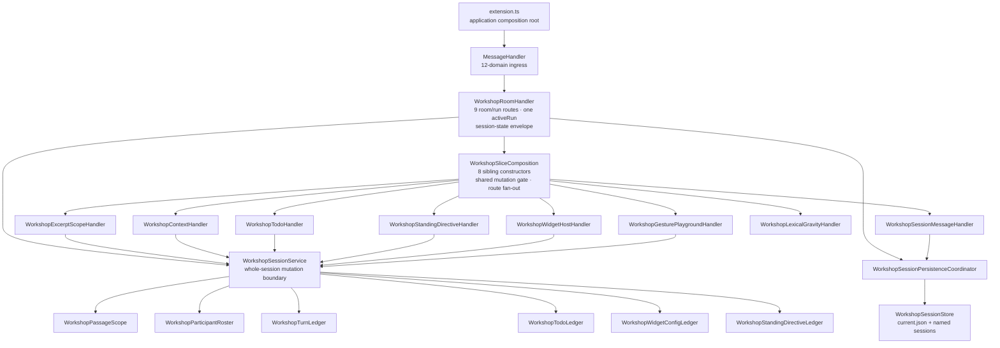

# Workshop Responsibility and Dependency Map

**Date:** 2026-08-06
**Status:** Phase 7 closure audit complete; feature freeze remains decision-owner controlled
**Scope:** Implemented Workshop architecture after Sprints 00–07

## Closure decisions

| Decision | Outcome | Evidence |
|---|---|---|
| Handler disposition (D7-A) | Extract the composition seam and rename the room/run owner to `WorkshopRoomHandler` | The former class was mostly room/run behavior but also constructed eight sibling handlers. `WorkshopSliceComposition` now owns only that assembly, the shared mutation gate, route fan-out, and slice disposal. |
| Reproduction reading (D7-B) | One explicit arm per closed generic seam, with zero edits to existing feature slices | The executable Prose Controller fixture pins 17 generic seams, one entry per seam, and no Gesture Playground or Lexical Gravity path. |
| Audit subjects (D7-C) | Audit all five feature-freeze facades | `WorkshopApp`, `useWorkshopRoom`, `useWorkshopSessions`, `WorkshopRoomHandler`, and `WorkshopSessionService` are covered below. |
| Feature freeze (D7-D) | Not lifted by implementation | The architecture evidence supports lifting it, but the epic requires Okey's explicit decision. |

No message type, route count, persisted shape, transport envelope, or product
behavior changed. The operationally visible rename is the log prefix
`[WorkshopHandler]` → `[WorkshopRoomHandler]`.

## Dependency map



Dependency direction stays inward: the VS Code adapter constructs concrete
services and ports; core handlers receive them; no handler receives an
aggregate-internal ledger; `packages/core` imports no `vscode` module.

## Five-facade audit

Line counts are pressure signals, not closure rules.

| Facade | Primary responsibility | Named collaborators / bounded local state | Verdict |
|---|---|---|---|
| `WorkshopApp.tsx` (1,485 lines) | Workshop shell composition, layout, and cross-surface wiring | Composes room, sessions, widget host, two feature hooks, standing directives, widget opening, excerpt verification, model/token/balance/startup hooks, message routing, persistence, and autoscroll. Its 11 `useState` calls are shell-open/selection/toast state; feature authoring and session state live elsewhere. | **Coherent composition facade** |
| `useWorkshopRoom.ts` (832 lines, 37 `useState`) | Mirror the host-owned `WORKSHOP_SESSION_STATE` envelope and expose room IPC actions | One live-run correlation slot, one replacement port, message handlers, and transport actions. It owns no feature authoring state and declares empty webview persistence. | **Coherent host-envelope facade** |
| `useWorkshopSessions.ts` (262 lines, 13 `useState`) | Named-session lifecycle, browser request correlation, and replacement rollback | Receives the one-way `WorkshopRoomReplacementPort`; owns no room or feature semantics and declares empty webview persistence. | **Coherent session-workflow facade** |
| `WorkshopRoomHandler.ts` (1,517 lines) | Cross-slice room/run orchestration | Exactly eight guarded room mutations plus cancel, one `activeRun` slot, one `WORKSHOP_SESSION_STATE` constructor, streaming/status/error envelopes, and named run/delivery/settings/time/persistence collaborators. Sibling construction is absent. | **Coherent room/run facade** |
| `WorkshopSessionService.ts` (2,121 lines) | Pure whole-session aggregate and cross-record integrity boundary | Six named state owners: passage/scope, participants, turns, todos, widget configs, and standing directives. The facade retains reset, atomic hydration, snapshot/export, active-run ordering, attachments/manifests, and cross-record commits because those invariants span collaborators. | **Coherent aggregate facade** |

The audit found no remaining responsibility with an independent invariant and
reason to change. Further splitting `executeMessage`, the session hydration
barrier, or cross-record attachment/manifests would divide one invariant merely
to lower a line count. That is precisely the extraction style the ADR rejects.

## Filename-first representative traces

Each trace names the shortest useful path from writer action to durable or
returned truth. A reviewer should not need to search an unrelated broad file.

| Flow | Trace | Durable / returned truth |
|---|---|---|
| Room send | `WorkshopComposer.tsx` → `WorkshopApp.tsx` → `useWorkshopRoom.ts` → `WorkshopRoomHandler.ts` → `WorkshopRoomDeliveryService.ts` + `WorkshopSessionService.ts` → `WorkshopSessionPersistenceCoordinator.ts` | Writer/participant turns, delivery offsets, attachments, autosave |
| Context attachment / wizard | `WorkshopContextSelectorModal.tsx` or `ContextPanel.tsx` → `useWorkshopRoom.ts` → `WorkshopContextHandler.ts` → `WorkshopContextIntakeService.ts` → `WorkshopSessionService.ts` → persistence coordinator | Bounded attachment provenance, event turn, autosave |
| Participant invite | `WorkshopInviteGuestModal.tsx` → `useWorkshopRoom.ts` → `WorkshopRoomHandler.ts` → `WorkshopParticipantRoster.ts` through `WorkshopSessionService.ts` → persistence coordinator | Participant adoption, conversation binding, room turn, autosave |
| Gesture Playground commit | `WorkshopGesturePlaygroundModal.tsx` → `useGesturePlayground.ts` → `WorkshopGesturePlaygroundHandler.ts` → `WorkshopSessionService.ts` → injected `WorkshopRoomHandler.executeMessage` seam → persistence coordinator | Widget config + artifact + room linkage committed in order |
| Lexical Gravity preview | `WorkshopLexicalGravityModal.tsx` → `useLexicalGravity.ts` → `WorkshopLexicalGravityHandler.ts` → `LexicalGravityModelService.ts` / `LexicalGravityLensRepository.ts` | Correlated preview/build result; no session mutation |
| Lexical standing apply | `WorkshopLexicalGravityModal.tsx` → `useWorkshopStandingDirectives.ts` → `WorkshopStandingDirectiveHandler.ts` → `WorkshopStandingDirectiveService.ts` → `WorkshopStandingDirectiveOperations.ts` → `WorkshopSessionService.ts` → persistence coordinator | Closed-dispatch directive upsert + marker turn + autosave |
| Save/open/recovery | `WorkshopSessionBrowserModal.tsx` / `WorkshopSaveSessionModal.tsx` → `useWorkshopSessions.ts` → `WorkshopSessionMessageHandler.ts` → `WorkshopSessionPersistenceCoordinator.ts` → `WorkshopSessionStore.ts` → `WorkshopSessionService.hydrateCommittedState` | `current.json` or named checkpoint; rollback/degradation evidence on failed restore |

## Ownership rules after closure

```text
WorkshopApp / useWorkshopRoom / useWorkshopSessions
    presentation composition + host-envelope/session workflow only

WorkshopRoomHandler
    room targeting + execution + transport envelopes only

WorkshopSliceComposition
    sibling construction + guarded route assembly only

Named sibling handlers
    one route family each

WorkshopSessionService
    whole-session mutation + cross-record integrity only

Named session collaborators
    one closed local state machine or ledger each
```

Generic modules may contain proven shared mechanics or explicit closed
dispatch. Gesture Playground and Lexical Gravity retain feature-owned messages,
handlers, services/codecs, hooks, components, styles, and tests. A new feature
may add one explicit arm to each applicable generic seam; it must not edit an
existing feature slice.

## Reproduction fixture

The architecture witness models Prose Controller, the next paused standing
feature:

- existing Gesture Playground files edited: **0**;
- existing Lexical Gravity files edited: **0**;
- generic seams receiving one explicit Prose Controller arm: **17**;
- duplicate, missing, unapproved, or feature-owned seam entries: **0**.

This is the cost of the ADR's closed-registry choice. “Exactly one generic file
total” would require an open plugin system and contradict the accepted design.

## Intentional destination deviations

| Runway destination | Implemented tree | Reason |
|---|---|---|
| One scope/context handler | Separate `WorkshopExcerptScopeHandler` and `WorkshopContextHandler`, sharing route-free `WorkshopContextIntakeService` | Excerpt/scope transitions and context/wizard workflows have distinct run guards and reasons to change; disk/catalog intake belongs to neither handler. |
| Room handler also composes slices | `WorkshopRoomHandler` + `WorkshopSliceComposition` | Room execution and sibling construction have disjoint fan-outs. The split makes both filenames honest without dividing the run engine. |
| Generic standing feature mechanics | `WorkshopStandingDirectiveOperations` closed registry plus named feature operations | Exact unions and reviewed variant support were chosen over dynamic discovery. |

All migration exceptions are empty. The architecture witnesses pin the 48-route
ledger, composition ownership, sole session-state envelope, feature isolation,
approved generic vocabulary, aggregate encapsulation, hydration barrier,
source/test/doc agreement, Prose Controller reproduction cost, and the empty
exception list.

## Closure verdict

The god-files debt is resolved: both formerly load-bearing files now have one
legible primary responsibility and named collaborators, and all five
feature-freeze facades trace by filename. The architecture supports resuming
feature development. The Workshop feature freeze nevertheless remains in place
until Okey explicitly lifts it, as required by the epic.

## Validation record

| Gate | Result |
|---|---|
| Full Jest | 189 suites / 1,939 tests / 1 snapshot passed |
| TypeScript | Core, webview, and extension projects clean |
| ESLint | Zero errors (`--quiet`) |
| Production build | Extension + webview compiled; bundle verifier found all 3 sentinels; existing size warnings only |
| Architecture witnesses | 23 passed, including composition ownership and Prose Controller reproduction |
| Whitespace | `git diff --check` clean |
