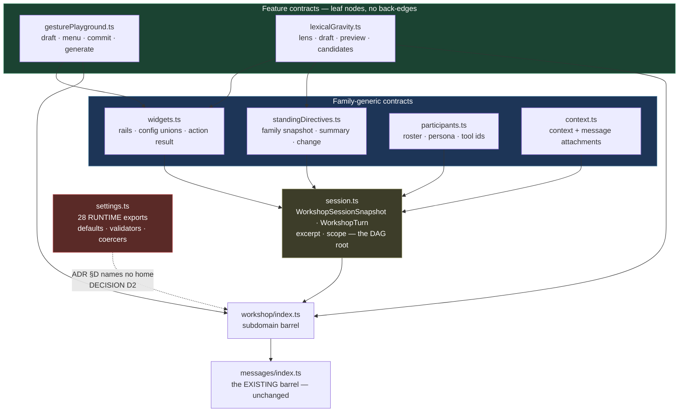
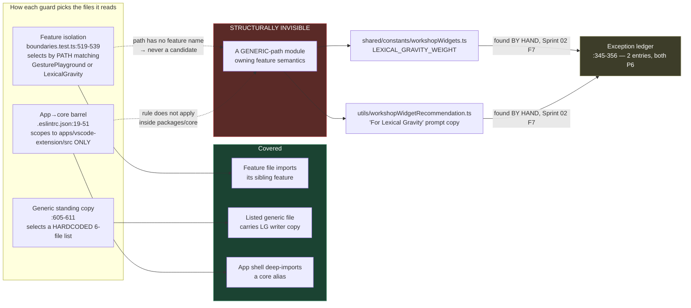

# Architecture Change Runway — Sprint 06: Contract, Test, and Documentation Normalization

**Date:** 2026-08-06
**Sprint:** [`06-contract-test-doc-normalization.md`](../../.todo/epics/epic-workshop-architecture-refactor-2026-08-03/sprints/06-contract-test-doc-normalization.md)
**Epic:** [Workshop Architecture Refactor](../../.todo/epics/epic-workshop-architecture-refactor-2026-08-03/epic-workshop-architecture-refactor.md)
**Decision:** [ADR 2026-08-03 — Workshop Feature Family and Module Boundaries](../adr/2026-08-03-workshop-feature-family-and-module-boundaries.md) §3, §7, §8
**Branch point:** `b577d60e` (Sprint 05 merged, PR #106)
**Audience:** decision owner + implementer. **Task:** approve the scope correction, then implement.
**Status:** `IMPLEMENTED AND VERIFIED 2026-08-06` — Okey accepted D1–D3; S0 preceded the contract moves; the full typecheck, test, lint, build, and bundle-verification gates pass.

---

## Band 0 — Change Card (30 seconds)

### Thesis

Because **`shared/types/messages/workshop.ts` is the only red-band file in the epic that has
not been touched — it *grew* from 1,982 to 2,014 lines while `WorkshopHandler` fell 45%,
`WorkshopSessionService` 27%, and `workshop.css` split into four** — and because **the two
recorded false generics that gate this sprint were found by hand, not by a witness, since
every feature-isolation guard selects candidate files by *path* and a false generic by
definition has a generic path**, change **module ownership of the Workshop protocol, the two
generic modules holding Lexical Gravity semantics, and the structural claims in the documents
agents read first**, while preserving **every wire shape, persisted shape, `MessageType`
value, and the `@messages` barrel as the single import surface**, so that **the source tree,
the test tree, the documents, and the executable guards describe the same architecture — and
the empty exception list Phase 7 requires is empty because nothing is wrong, not because
nothing is looking.**

### Architecture moves

1. **Invert the feature-isolation witness first** (S0). Today it asks "does a feature file
   import its sibling?" It must also ask "does a *non-feature* file contain feature
   vocabulary?" Without this, emptying the exception list proves nothing.
2. **Split `workshop.ts` into the ADR §D subdomain tree behind the existing barrel** — and
   deliberately place its **28 runtime exports** (19 functions, 9 frozen consts), which the
   §D tree has no named home for.
3. **Clear both Phase-6 exceptions** by moving Lexical Gravity's numeric grammar and prompt
   copy into the feature slice, reproducing the verified closed-registry precedent.
4. **Make two false-generic contract names exact** — delete the retired
   `WorkshopWidgetRecommendationSeed` alias, and settle `WorkshopGesture*` vs
   `WorkshopGesturePlayground*`.
5. **Correct the documents against measurement**, not against memory: CLAUDE.md's handler
   census and test counts are both wrong, and it disagrees with `docs/ARCHITECTURE.md`.

### Scope and highest risks

| Risk | Consequence | Where |
|---|---|---|
| Exception list emptied without an inverted witness | Phase 7 lifts the freeze on a guard that **structurally cannot see** the violation class it certifies | §2.3, **F1** |
| The sprint's hard gate is not in its scope bullets | The 532-line generic parser holding both features' prompt copy is discovered mid-sprint | §2.2, **F2** |
| §D tree has no home for 28 runtime exports | Settings codecs scatter by association; the "ONE parser" claim stops being locatable | §1.4, **F3** |
| Docs corrected by memory rather than measurement | CLAUDE.md is the first file every agent session reads; wrong structure there costs most | §2.2, **F6** |

### Accepted human decisions

- **D1 (accepted).** Adopt the inverted witness **before** emptying the exception list, at the
  cost of one extra slice? **Decision: yes.** **Owner: Okey.**
- **D2 (accepted).** The ADR §D message tree names 8 files, none of which houses settings
  defaults/validators. Add a 9th (`settings.ts`) as a recorded ADR §7 deviation, or place the
  runtime block inside `session.ts`/`participants.ts` by association? **Decision: 9th
  file.** **Owner: Okey.**
- **D3 (accepted).** Sprint 04 explicitly deferred the `WorkshopHandler` → `WorkshopRoomHandler`
  naming tension to "Sprint 06's contract/name normalization pass"
  ([sprint-04 runway:334](2026-08-04-workshop-sprint-04-handler-runway.md)). Sprint 06's scope
  never claims it. Claim it, or record it as a Phase 7 item? **Decision: record for Phase 7**
  — the rename collides with the ADR §D tree and is not a contract correction. **Owner: Okey.**

### Gate

**CLEARED 2026-08-06.** D1–D3 were accepted. S0 then landed red against exactly the two known
false generics before any contract move, satisfying the sequencing gate. The final witness
also covers camelCase identifiers and kebab-case wire ids, uses line-scoped approvals where
possible, and rejects stale allowlist entries.

---

## Band 1 — Architecture Delta Map (~2 minutes)

### 1.1 The epic's scoreboard — and the one file that went the wrong way

Semantic-runway red/amber band, measured then (`2026-08-03-workshop-module-semantic-runway.md:441-455`)
and now (branch point `b577d60e`):

| File | Epic start | Now | Δ | Owning sprint |
|---|---:|---:|---:|---|
| `presentation/webview/workshop.css` | 6,367 | **4 files, 5,532** | split | P3 |
| `application/handlers/domain/workshop/WorkshopHandler.ts` | 2,976 | **1,653** | −45% | P4 |
| `application/services/workshop/WorkshopSessionService.ts` | 2,894 | **2,121** | −27% | P5 |
| `presentation/webview/WorkshopApp.tsx` | 1,795 | **1,485** | −17% | P3 |
| `presentation/webview/hooks/domain/useWorkshop.ts` | 1,176 | **deleted** | −100% | P3 |
| **`shared/types/messages/workshop.ts`** | **1,982** | **2,014** | **+1.6%** | **P6 — this sprint** |

Every other red-band file has an owner and a completed reduction. `workshop.ts` absorbed the
epic's contract additions while waiting its turn. It is now the largest untouched
concentration in the Workshop surface: **202 exports — 137 interfaces, 37 type aliases, 19
functions, 9 frozen consts — plus 63 of the `MessageType` enum's Workshop entries defined
elsewhere in `base.ts`.**

### 1.2 Target tree

Legend: `[+]` add · `[~]` modify · `[>]` move/rename · `[-]` remove · `[=]` important unchanged boundary

```text
packages/core/src/shared/types/messages/
├── index.ts                            [~] barrel unchanged in shape; re-exports ./workshop/
├── workshop.ts                         [-] 2,014 → deleted, fully redistributed
└── workshop/                           [+] ADR §D destination tree
    ├── index.ts                        [+] subdomain barrel (the split is invisible above it)
    ├── session.ts                      [+] ~330  snapshot, turn, scope, excerpt  (:983-1224, :1052-1131)
    ├── context.ts                      [+] ~180  context + message attachments   (:1024-1051)
    ├── participants.ts                 [+] ~200  roster, persona, tool ids       (:492-560)
    ├── widgets.ts                      [+] ~250  generic rails, config unions    (:792-982)
    ├── standingDirectives.ts           [+] ~120  family snapshot/summary/change  (:892-950)
    ├── gesturePlayground.ts            [+] ~180  GP draft, menu, commit, generate
    ├── lexicalGravity.ts               [+] ~260  LG lens, draft, preview, lenses
    └── settings.ts                     [+] ~230  D2 — the 28 runtime exports (:168-400, :657-730)

packages/core/src/shared/constants/
└── workshopWidgets.ts                  [~] 307 → ~265; LG numeric grammar leaves (P6 exception 1)

packages/core/src/utils/
└── workshopWidgetRecommendation.ts     [>] 532 → generic frame parser + closed feature registry
                                             (P6 exception 2 — the sprint's largest real job)

packages/core/src/application/services/workshop/widgets/
├── gesturePlayground/                  [~] gains its recommendation registry entry
└── lexicalGravity/                     [~] gains LG grammar + its recommendation registry entry

packages/core/src/__tests__/
├── architecture/boundaries.test.ts     [~] inverted feature-vocabulary witness (S0);
│                                           exception list → empty (completion criterion 4)
├── application/handlers/domain/
│   └── WorkshopToolSidePass.integration.test.ts  [>] to services/workshop/, renamed to its subject
└── application/services/workshop/
    └── WorkshopWidgetFrames.test.ts    [>] renamed — names no module today (§2.2)

.ai/central-agent-setup.md              [~] CLAUDE.md AND AGENTS.md both symlink here — ONE edit
docs/ARCHITECTURE.md                    [~] retired `useWorkshop` row; handler census
.todo/tech-debt/2026-07-25-workshop-god-files.md  [=] NOT archived at P6 — see F8
```

### 1.3 Responsibility ledger

| Module | Role | Responsibility before | Responsibility after | Ownership delta | Pattern / smell |
|---|---|---|---|---|---|
| `messages/workshop.ts` | Contract | Every Workshop protocol family, plus settings codecs, in one file | *(deleted)* | All of it leaves | **God module** — 5 independently changing families |
| `messages/workshop/index.ts` | Barrel | — | Sole re-export surface for the subdomain tree | Gains dispatch-free aggregation | `Barrel` — keeps the split invisible to 100+ consumers |
| `messages/workshop/settings.ts` | Codec | — | Defaults, `*_SETTING` descriptors, validators, coercers, equality | Gains the runtime block | `Codec` — the one place a wire value becomes a trusted value |
| `constants/workshopWidgets.ts` | Registry | Widget catalog **+ LG weight/reach grammar** | Widget catalog only | Sheds LG semantics | **False generic** (P6 exception 1) |
| `utils/workshopWidgetRecommendation.ts` | Parser | Frame grammar **+ both features' prompt copy + LG parse arm** | Frame grammar + closed registry dispatch | Sheds both features' vocabulary | **False generic** (P6 exception 2) |
| `boundaries.test.ts` | Witness | Path-selected feature isolation | Path-selected **plus content-scanned** non-feature modules | Gains the blind spot | `Fitness witness` — inverted selection |
| `.ai/central-agent-setup.md` | Doc | Pre-Workshop handler census, 2026-06-24 test counts | Measured census, Workshop slice conventions | Gains the module tree | Stale-doc drift |

### 1.4 Structural view — is the split acyclic, and where does runtime live?

**Question:** can `workshop.ts` be cut along ADR §D's eight seams without circular imports,
and what happens to the code that is not a type?
**Scope:** the message module only. **Abstraction:** proposed file.
**Legend:** solid = type dependency (import direction) · dashed = the block §D does not name.



**Reading.** Every edge points one way: features → generic → session → barrel. Verified at
source — `WorkshopTurn` (`:1052-1131`) *consumes* `WorkshopTurnWidgetCommit`,
`WorkshopStandingDirectiveChange`, and `WorkshopMessageAttachmentSnapshot`, while nothing in
the widget or feature regions (`:790-1010`) references `WorkshopTurn`,
`WorkshopSessionSnapshot`, or `WorkshopParticipantsSnapshot`. **The split is acyclic as
declared.** The single unresolved node is the red one: 28 runtime exports the destination
tree never named.

### 1.5 Witness coverage — why the exception list can be empty and wrong

**Question:** what class of violation can the current guards not see?
**Scope:** `boundaries.test.ts` + `.eslintrc.json`. **Abstraction:** selection rule.
**Legend:** green = covered · red = structurally invisible.



**Reading.** Both recorded exceptions entered the ledger through a human reading code during
the Sprint 02 runway, not through a failing test. The ledger's own header calls itself "exact
known false-generic ownership" (`:338-344`) — *known* is doing load-bearing work. Emptying it
(completion criterion 4) removes the only record of a violation class nothing detects.

### 1.6 Blast-radius summary

| Dimension | Direct | Indirect | Confidence |
|---|---|---|---|
| **Structural** | 1 module → 9 files; 2 false generics shed feature code | 100+ consumers unaffected — only **5** files deep-import `messages/workshop` (all `shared/` constants, 2 type names: `WorkshopToolId`, `WorkshopWidgetId`) | HIGH |
| **Contract (wire)** | **None.** No `MessageType` value, payload field, or envelope shape changes | 63 Workshop `MessageType` entries stay in `base.ts`, untouched | HIGH |
| **Contract (type names)** | 2 renames: `WorkshopWidgetRecommendationSeed` (2 files), `WorkshopGesture*` family (max 11 files) | Compile-time only; `tsc` catches every miss | HIGH |
| **Data/persistence** | **None.** No `schemaVersion` bump; `WorkshopSessionStateV1` untouched | Alpha rules make type renames free (CLAUDE.md §Alpha) | HIGH |
| **Operational** | None — no runtime behavior moves | Settings defaults keep their values; only their file changes | HIGH |
| **Verification** | `boundaries.test.ts` gains one witness, loses the exception list | **187 suites / 1,922 tests green** at branch point; Workshop-scoped **45 / 704** | HIGH |
| **Docs** | CLAUDE.md + ARCHITECTURE.md structural claims; 1 debt record | CLAUDE.md and AGENTS.md are **the same file** via symlink — one edit | HIGH |
| **Coordination** | Sprint 05 runway §2.11: P6 "collides on the `@messages` barrel" | Correct but narrow — the barrel *shape* is unchanged; the collision is on `workshop.ts` itself | MODERATE |

---

## Band 2 — Reviewer Packet (~10 minutes)

### 2.1 The real job of this sprint

Sprints 01–05 moved code. Sprint 06 moves **claims**: what the protocol module says it owns,
what the guards say they check, what the documents say the tree looks like. Its output is not
a smaller file — it is the removal of every place where two artifacts describe the same
architecture differently.

That makes its failure mode unusual. A code sprint fails loudly, in a test. A normalization
sprint fails **silently and permanently**: an exception list is emptied, a document is
updated, Phase 7 audits both, the freeze lifts, and the discrepancy that survived is now
certified. The most valuable thing this sprint can produce is not the split — it is the
inverted witness that makes the split's cleanliness checkable by something other than the
person who did it.

### 2.2 Declared intent vs observed state

| Sprint scope says | Observed | Resolution |
|---|---|---|
| "Complete the Workshop message split behind the existing barrel" | The split has **not started**. No `messages/workshop/` directory exists; `workshop.ts` is one 2,014-line file that **grew** 1.6% during the epic. The barrel (`messages/index.ts`) already exists and needs no shape change. | "Complete" overstates prior progress. This is the whole split, from zero. Budget accordingly (§2.10 S2). |
| "Make feature-specific payload names exact and generic family unions explicit" | Sprint 02 **already did** the union work: `WorkshopCommitWidgetPayload` (`:1951`), `WorkshopApplyStandingWidgetPayload` (`:1966`), `WorkshopStandingDirectiveApplyRequest` all carry explicit family-rail comments. What remains is **two** items: a retired alias (`:964-965`) and a `Gesture` vs `GesturePlayground` split. | Narrow the bullet to the two measured items (F4, F5). |
| "Reorganize tests to mirror presentation, handler, service, and feature owners" | Measured: the test tree **already mirrors** source for 95+ of ~100 Workshop suites. Genuine mismatches: **2**. `WorkshopToolSidePass.integration.test.ts` sits under `handlers/domain/` while its subject `RunWorkshopToolSidePass.ts` is a service; `WorkshopWidgetFrames.test.ts` names **no module** — it tests `buildWorkshopThreadArtifactFrame` (`WorkshopPromptBuilder`) and `neutralizeReservedPersonaPromptDelimiters` (`utils/workshopPromptFrames`). | Not a sweep. Two moves plus the test files that follow the message split. |
| "Update `CLAUDE.md` (and its `AGENTS.md` alias)" | Both are symlinks to `.ai/central-agent-setup.md`. **One file, one edit** — there is no alias to keep in sync. | Good news; record it so nobody creates a divergent second file. |
| "Archive or supersede completed extraction debt with closure notes" | `2026-07-25-workshop-god-files.md` is the primary record. Its criteria include "one legible primary responsibility" — `WorkshopHandler` is still 1,653 lines with a naming tension **Sprint 04 deferred to Sprint 06** and Sprint 06 does not claim. | Archive the *superseded* records; **do not** archive god-files at P6 (F8, D3). |
| Completion criterion: "P0's migration exception list is empty or contains only a Phase 7 blocker" | Both entries are **P6** (`:345-356`), asserted by exact equality at `:711-714`. Clearing them is the sprint's hard gate — and the larger of the two is a 532-line generic parser with 7 consumers. **No scope bullet mentions it.** | Promote to a first-class scope item (F2). |

### 2.3 Contracts and invariants

| Invariant | Current owner | Constraint on this sprint | Witness |
|---|---|---|---|
| `@messages` is the single import surface for message contracts | `messages/index.ts` | The subdomain split must be **invisible** above `workshop/index.ts`. The 5 existing deep imports may be redirected to the barrel or repointed; no new deep import may appear. | `.eslintrc.json` covers the app only — needs a core-side check or a review rule |
| No wire shape changes | `base.ts` `MessageType` (63 Workshop entries) | Type names may change (alpha rules); **enum values may not**. | Full suite; `WorkshopHandler.seams.test.ts` |
| Settings defaults match `apps/vscode-extension/package.json` | `DEFAULT_WORKSHOP_CONVERSATION_BEHAVIOR`, `DEFAULT_WORKSHOP_WRITER_PROFILE`, `WORKSHOP_*_SETTING` | Moving them to `settings.ts` must not change values or `*_SETTING.section/key`. | `workshopConversationBehaviorDefaultsSync.test.ts`, `workshopWriterProfileDefaultsSync.test.ts` — **both import from `@messages`, so the split cannot break them** |
| "The ONE parser" for conversation-behavior and excerpt-source wire traffic | `coerceWorkshopConversationBehavior` (`:400`), `coerceWorkshopExcerptSource` (`:712`) | The file headers assert singularity. After the split, that claim must remain locatable in one named module. | D2 |
| Exception ledger may only shrink once a phase's entries are recorded | `boundaries.test.ts:338-344`, ADR §7 | Sprint 06 must **remove** both entries, not amend them. Removal and the enabling code change land in the same commit. | `:694-715` exact-equality assertion |
| Generic modules import feature code only through approved closed registries | Completion criterion 3 | **No automated check exists for this.** See F1. | **to be built (S0)** |

#### The closed-registry precedent — verified at source, part by part

`WorkshopStandingDirectiveOperations.ts` (139L) is the pattern the recommendation parser must
reproduce. Opened and compared in full:

- a `Readonly<Record<WorkshopStandingDirectiveFamily, …Entry>>` keyed by a closed union;
- one behavior interface (`prepareApply`, `render`, `summarize`, `markerContent`,
  `formatSummary`, `describe`) implemented per family;
- the live family imported from its feature slice
  (`LEXICAL_GRAVITY_STANDING_DIRECTIVE_OPERATIONS`);
- an **explicit placeholder** for the not-yet-live family (`proseControllerEntry`) whose
  methods throw via `unsupportedFamily` — except `markerContent`, which works generically;
- `unsupportedApplyWidget(widgetId: never)` for exhaustiveness at the `switch`.

The generic module therefore knows *family ids* and *nothing else*. That is the standard the
recommendation parser fails today, and the template it should be held to.

### 2.4 Negative space — what the generic modules must stop knowing

| Generic owner | May know | Must not know | Verdict today |
|---|---|---|---|
| `shared/constants/workshopWidgets.ts` | Widget ids, labels, rails, groups, `live` flags | Any feature's **value grammar** — `LEXICAL_GRAVITY_WEIGHT` min/max/step, reach values, their predicates | **VIOLATION** (`:19-40`) — P6 exception 1 |
| `utils/workshopWidgetRecommendation.ts` | The `<workshop-widget-recommendation>` frame grammar, marker ordering, budget, generic rejection reasons | Either feature's **prompt copy** (`:30-52`), LG's field markers (`:369-383`), LG's validation arm (`:391-467`) | **VIOLATION** — P6 exception 2 |
| `messages/workshop/widgets.ts` *(proposed)* | Rails, config-snapshot base, the explicit unions | Any feature's draft **shape** — those belong to `gesturePlayground.ts` / `lexicalGravity.ts` and are only *unioned* here | `PROPOSED` — must be built correct |
| `messages/workshop/settings.ts` *(proposed)* | Defaults, limits, setting descriptors, coercion | Widget or feature vocabulary of any kind | `PROPOSED` |

**Generic-name truthfulness.** `workshopWidgetRecommendation` is the one at risk after the
fix. Every widget shares: a frame envelope, a widget-id field, ordered markers, a budget, and
fail-closed rejection. It must not learn what `<lens-slug>` means. The moment a third widget
needs a marker, the correct edit is a registry entry — not a new branch in `inspect…`.

### 2.5 Quality scenarios

| # | Source | Stimulus | Artifact | Expected response | Response measure |
|---|---|---|---|---|---|
| Q1 | Maintainer | Adds Prose Controller's numeric grammar to `workshopWidgets.ts` "because that's where LG's was" | Inverted witness | Build fails naming the file and the vocabulary | **New witness (S0)** fails; today it passes |
| Q2 | Implementer | Splits `workshop.ts`; forgets to re-export one type from `workshop/index.ts` | `tsc` + full suite | Compile error at every consumer | `npm run compile`; 187 suites |
| Q3 | Implementer | Moves `DEFAULT_WORKSHOP_WRITER_PROFILE` and drops a field | Defaults-sync witnesses | Mismatch against `apps/vscode-extension/package.json` | `workshopWriterProfileDefaultsSync.test.ts` — unmodified |
| Q4 | Reviewer | Asks "does the exception list being empty mean anything?" | `boundaries.test.ts` | An inverted, content-scanning witness with an explicit allowlist | S0 lands **before** S4 |
| Q5 | Agent session | Reads CLAUDE.md to find where a new Workshop handler goes | `.ai/central-agent-setup.md` | Finds `handlers/domain/workshop/` and the slice convention | Doc names the tree; census matches `ls` |
| Q6 | Phase 7 auditor | Verifies source/test/doc agreement | All three trees | One story, no retired paths | Witness #10 (§4.3) |

**Sensitivity point.** The *order* of S0 and S4. Emptying the exception list before the
inverted witness exists converts an honest inventory into an unverified claim, and Phase 7 has
no way to tell the difference.

**Tradeoff point.** The inverted witness will produce false positives — a doc comment
mentioning "Lexical Gravity" in a generic module is not a violation. It needs an allowlist,
and an allowlist is a second thing to keep honest. That cost is worth paying because the
alternative (no detection) is what produced both current exceptions.

**Risk theme.** Every finding in this runway is a variant of one failure: **a claim and its
verification live in different artifacts, and only the claim gets updated.** The exception
list, the handler census, the test counts, the `useWorkshop` doc row, the "ONE parser" header.

### 2.6 Alternatives

| Option | What it is | Verdict |
|---|---|---|
| **Minimal patch** | Split `workshop.ts`, fix the two names, update the docs, delete the two exception entries | **Rejected.** Meets criterion 4's letter and defeats its purpose: the list would be empty and unguarded. Criterion 3 stays unwitnessed. |
| **Recommended** | S0 inverted witness first → split with a recorded 9th file → clear both exceptions via the verified closed registry → exact names → measured doc correction | **Retained.** Every emptied claim gains a guard in the same sprint. |
| **More generalized** | Generate the subdomain barrel and the witness allowlist from a manifest; add a codegen step keeping `MessageType`, payload map, and files in sync | **Rejected.** Premature. Nine files and one allowlist do not justify a build step, and codegen would hide the very seams this sprint exists to make visible. Revisit if a third feature family lands. |
| **Defer the split to Phase 7** | Do only the exceptions and docs now | **Rejected.** Phase 7 is an audit phase with no implementation budget, and `workshop.ts` is the file paused feature branches (LG v2, Prose Controller) rebase onto. Deferring maximizes their conflict. |

### 2.7 Principle and quality tensions

| Principle | Status | Evidence of support | Tension | Consequence | Planned witness | Confidence |
|---|---|---|---|---|---|---|
| Naming truthfulness | `TENSION` → `ACCEPTABLE` | Sprint 02's unions carry honest family-rail comments | Two generic modules own LG semantics; one alias is retired legacy | Copy path teaches the wrong lesson | Inverted witness (S0) | HIGH |
| Responsibility / cohesion | `TENSION` → `STRONG` | 8 acyclic subdomain seams verified at source | 28 runtime exports have no named home | Settings codecs scatter by association | D2 + `settings.ts` | HIGH |
| Dependency direction | `STRONG` | Features → generic → session → barrel; no back-edges (§1.4) | — | — | `tsc` + review | HIGH |
| Change isolation | `ACCEPTABLE` | Only 5 deep imports; barrel absorbs the split | Paused feature branches rebase onto `workshop.ts` | Merge cost concentrated in one sprint | Coordination map §2.11 | MODERATE |
| Testability | `STRONG` | 187/1,922 green; test tree already mirrors source | 2 genuine mismatches | Low | Test moves (S5) | HIGH |
| Open/closed | `TENSION` → `ACCEPTABLE` | Standing-directive registry is a verified precedent | Recommendation parser branches inline per feature | Third widget edits the generic parser | Closed registry (S3) | HIGH |
| Documentation fidelity | `VIOLATION` → `STRONG` | — | CLAUDE.md census wrong; counts 5× stale; ARCHITECTURE.md names a deleted hook | Every agent session starts from a false map | Measured correction (S6) | HIGH |
| Verifiability of the gate | `VIOLATION` | — | Criterion 3 has no automated check anywhere | Phase 7 certifies an unmeasured property | **S0 — the sprint's most important slice** | HIGH |

### 2.8 Ranked findings

---

**F1 · CRITICAL · `test-coverage` · The exception list is about to be emptied, and nothing can
detect the violation class it records**

Completion criterion 3 requires that "generic modules import feature code only through approved
closed registries." Nothing checks this. The feature-isolation witness
(`boundaries.test.ts:519-539`) builds its candidate set by **path**:

```ts
const gestureFiles = sourceFiles.filter((file) => /GesturePlayground/i.test(relativePath));
const lexicalFiles = sourceFiles.filter((file) => /LexicalGravity/i.test(relativePath));
```

A false generic has, by definition, a generic path — so it is never a candidate. The
generic-copy witness (`:605-611`) reads a **hardcoded six-file list**. And
`.eslintrc.json:19-51` scopes `no-restricted-imports` to `apps/vscode-extension/src/**`
only — nothing lints inside `packages/core`.

Both current exceptions confirm the gap empirically: `shared/constants/workshopWidgets.ts` and
`utils/workshopWidgetRecommendation.ts` were found **by a human reading code** during the
Sprint 02 runway (recorded there as F7), and Sprint 02's own analysis says so — "Neither path
matches `/LexicalGravity/i`, so `boundaries.test.ts` cannot see them."

*Failure scenario:* Sprint 06 clears both entries. `expect(observed).toEqual([...])` at `:711`
becomes `toEqual([])` and passes. Phase 7 audits an empty list and lifts the freeze. Prose
Controller then lands its weight/threshold grammar in `workshopWidgets.ts` — the file that
just taught it that is where such things go — and no test fails, because no test looks.

*Smallest fix (slice S0, before any exception is removed):* invert the selection. Scan every
source file whose path does **not** match a feature name for feature vocabulary
(`/Lexical\s*Gravity|LEXICAL_GRAVITY|Gesture\s*Playground|GESTURE_PLAYGROUND/`), with an
explicit allowlist of approved closed registries and their justification. Seed the allowlist
with the registries that legitimately name families
(`WorkshopStandingDirectiveOperations.ts`, `workshopWidgets.ts`'s label table). Confirm the
new witness **fails** against today's tree on exactly the two known exceptions — that is the
proof it works — then let S3 make it pass.

---

**F2 · HIGH · `scope-accuracy` · The sprint's hard gate is its largest job and appears in no
scope bullet**

Completion criterion 4 requires the P0 exception list to be empty or Phase-7-only. Both entries
are P6 (`boundaries.test.ts:345-356`). Clearing exception 2 means restructuring
`utils/workshopWidgetRecommendation.ts` — 532 lines, 7 consumers (`index.ts`,
`WorkshopRunCompletion`, `AssistantToolService`, `WorkshopApp.tsx`, and 3 test/witness files)
— which today holds both features' writer-facing prompt copy (`:28-83`), Lexical's field
markers (`:369-383`), and Lexical's validation arm (`:391-467`). The six scope bullets mention
messages, names, tests, docs, debt, and witnesses. They never mention this.

*Failure scenario:* an implementer works the six bullets, reaches the completion checklist, and
discovers the gate requires a restructure comparable in size to the message split — mid-sprint,
with the branch already carrying a contract move. Either the sprint doubles, or the entry is
"cleared" by relocating the marker string rather than the ownership, and the ledger becomes
green by evasion.

*Smallest fix:* add a seventh scope bullet naming both exceptions and their target owners, and
give exception 2 its own slice (S3). Note that exception 1 is genuinely small — four exports
move to `LexicalGravityConfigCodec` and are re-exported — exactly as Sprint 02's F7 proposed.

---

**F3 · HIGH · `correctness` · `workshop.ts` is not a type module, and the ADR §D tree has no
home for its runtime**

The destination tree (semantic runway `:628-636`) names eight files: `index`, `session`,
`context`, `participants`, `widgets`, `gesturePlayground`, `lexicalGravity`,
`standingDirectives`. But `workshop.ts` exports **19 functions and 9 frozen consts** alongside
its 174 type declarations:

- VS Code **settings contracts** — `DEFAULT_WORKSHOP_CONVERSATION_BEHAVIOR` (`:218`),
  `DEFAULT_WORKSHOP_WRITER_PROFILE` (`:251`), `DEFAULT_WORKSHOP_WEB_RESEARCH_SETTINGS`
  (`:272`), each with a `*_SETTING` descriptor pinned against
  `apps/vscode-extension/package.json` by an architecture witness;
- the modules the file's own headers call **"the ONE parser"** —
  `coerceWorkshopConversationBehavior` (`:400`), `coerceWorkshopExcerptSource` (`:712`);
- validators, equality predicates, and label maps (`:281-390`).

None of the eight §D names describes a settings default or a codec.

*Failure scenario:* an implementer distributes by association — behavior defaults into
`participants.ts` because personas interpret them, excerpt coercion into `context.ts` — and the
"ONE parser" claim survives in a header while its subject is in two files. The next reader
looking for where a wire value becomes trusted has three plausible places and no named one.

*Smallest fix (D2):* add `messages/workshop/settings.ts` as a recorded ADR §7 deviation with
its one-line reason ("the §D tree enumerated protocol families; the module also owns the
settings/codec boundary, which is a family of its own"). Place scope predicates with
`session.ts` and excerpt coercion with whichever file owns `WorkshopExcerpt`, and say so.

---

**F4 · MEDIUM · `naming` · `WorkshopGesture*` and `WorkshopGesturePlayground*` name the same
feature in the same file**

The widget id is `gesture-playground`. Its handler is `WorkshopGesturePlaygroundHandler`, its
codec `GesturePlaygroundConfigCodec`, its modal `WorkshopGesturePlaygroundModal`, and its
messages `WorkshopGesturePlaygroundGeneratePayload` (`:1778`) and
`WorkshopGesturePlaygroundCommitPayload` (`:1943`). But its **data** types are short-form:
`WorkshopGestureDraft` (`:813`), `WorkshopGestureMenuGroup` (`:792`),
`WorkshopGestureWidgetConfigSnapshot` (`:850`), `WorkshopGestureWidgetConfigSummary` (`:872`),
`WorkshopGestureRecommendationSeed` (`:956`). Lexical Gravity is never abbreviated.

*Failure scenario:* the epic's stated goal is that Workshop be "copyable by feature." A third
widget author reads the tree, sees two conventions for the older feature and one for the newer,
and picks by coin flip — after which the asymmetry is permanent and the next runway relitigates
it.

*Blast radius, measured:* `WorkshopGestureDraft` 11 files · `WorkshopGestureWidgetConfigSnapshot`
5 · `WorkshopGestureMenuGroup` 4 · `WorkshopGestureRecommendationSeed` 2 ·
`WorkshopGestureWidgetConfigSummary` 1. Compile-time only; `tsc` catches every miss.

*Smallest fix:* rename to `WorkshopGesturePlayground*` in the same commit as the split, so the
files move and the names settle once.

---

**F5 · MEDIUM · `naming` · One retired alias survives with a rationale the alpha rules forbid**

```ts
/** Backward-friendly name retained for the shipped Gesture modal contract. */
export type WorkshopWidgetRecommendationSeed = WorkshopGestureRecommendationSeed;
```
(`:964-965`)

CLAUDE.md §Alpha Development Guidelines is explicit: "Don't keep 'legacy routes' with comments
like 'keep for backward compatibility'." The contrast inside the same file is the tell — its
sibling one-arm unions carry *architectural* rationales ("Family rail contract; each supported
one-shot widget contributes one exact arm" `:1951`; "Each live standing feature contributes one
exact widget/draft arm" `:1966`). Those are deliberate extension points. This one is a
leftover, and a **generic name pointing at a single feature type is the exact smell this epic
exists to remove**.

*Failure scenario:* a widget author needing a recommendation seed imports the generic-sounding
name, receives Gesture Playground's shape, and either widens the Gesture type or adds a second
alias. Either way the family union that should have been created never is.

*Smallest fix:* delete the alias; repoint its 2 consumers to
`WorkshopGesturePlaygroundRecommendationSeed`. If a family union is genuinely wanted, declare it
as a one-arm union with the sibling rationale — not as an alias with a legacy one.

---

**F6 · MEDIUM · `documentation` · CLAUDE.md's structural claims are measurably wrong, and it
disagrees with `docs/ARCHITECTURE.md`**

CLAUDE.md is the file every agent session loads first. Measured against the tree at `b577d60e`:

| Claim | Location | Measured |
|---|---|---|
| "Domain-specific handlers (11)" + an 11-name list | `:49-60`, `:550`, `:680` | 11 files at `domain/*.ts` — but the list **omits the entire 10-file `domain/workshop/` tree**, including `WorkshopHandler` |
| "49 suites / 373 tests" (as of 2026-06-24) | `:673-674` | **187 suites / 1,922 tests** — 3.8× and 5.1× stale |
| `useWorkshop` → `WorkshopHandler` hook/handler mapping | `docs/ARCHITECTURE.md:149` | `useWorkshop.ts` was **deleted** in Sprint 03; `boundaries.test.ts:564-567` now asserts it does not exist |
| "12 domain handlers (including Workshop)" | `docs/ARCHITECTURE.md:66` | Disagrees with CLAUDE.md's 11 — **the two documents already contradict each other** |

The epic runway raised this and won the scope argument
(`2026-08-03-workshop-refactor-epic-runway.md:239-241` — "add `CLAUDE.md` to P6 scope. It is
the file every future agent session reads first"). The sprint adopted the bullet. The specific
defects were never enumerated.

*Note for the implementer:* `CLAUDE.md` and `AGENTS.md` are **both symlinks** to
`.ai/central-agent-setup.md`. One edit. Do not create a second file.

*Smallest fix:* correct the four rows above by measurement, add the `domain/workshop/` subtree
and the feature-slice convention to the handler section, and re-run the counts at S6 rather
than copying this runway's numbers.

---

**F7 · LOW · `test-coverage` · Two test/source mismatches — not the tree-wide reorganization
the scope implies**

Measured across ~100 Workshop suites, the test tree already mirrors source. The genuine
mismatches:

1. `__tests__/application/handlers/domain/WorkshopToolSidePass.integration.test.ts` — its
   subject is `application/services/workshop/RunWorkshopToolSidePass.ts`. Wrong layer **and**
   a name that drops the `Run` prefix.
2. `__tests__/application/services/workshop/WorkshopWidgetFrames.test.ts` — **no module of
   that name exists.** It imports `buildWorkshopThreadArtifactFrame` from
   `WorkshopPromptBuilder` and `neutralizeReservedPersonaPromptDelimiters` from
   `utils/workshopPromptFrames`.

*Failure scenario:* the sprint budgets a sweep, finds two files, and either pads the change
with churn that makes the diff unreviewable, or reports the criterion met without stating what
was actually checked.

*Smallest fix:* move and rename these two; let the message-split tests follow their modules;
record in the completion notes that the rest already mirrored.

---

**F8 · LOW · `scope-accuracy` · The god-files debt cannot be closed at Phase 6**

`2026-07-25-workshop-god-files.md` is marked "In progress — absorbed by the Workshop
Architecture Refactor epic." Its criteria include "Each broad file has one legible primary
responsibility or is a narrow facade over named collaborators." `WorkshopHandler` is 1,653
lines (from 2,976) and carries a naming tension Sprint 04 recorded and explicitly routed here:
"`WorkshopRoomHandler` would be truer… Sprint 06 owns the contract/name normalization pass"
(`2026-08-04-workshop-sprint-04-handler-runway.md:334`). Sprint 06's scope does not claim it.

*Failure scenario:* the "archive completed extraction debt" bullet sweeps this record into
`.todo/archive/`, closing the only tracking artifact for a criterion nobody has asserted is
met — and Phase 7's audit finds no open record to check against.

*Smallest fix:* D3 was accepted. Archive the genuinely superseded records
(`2026-07-24-workshop-session-responsibility-follow-ups.md`, marked "absorbed by Phases 3 and
5"); leave god-files open with a progress note citing the measured reductions, and let Phase 7
close it.

---

### 2.9 What survived attack

Attacked and held. These do not need re-litigating in review.

- **The `@messages` barrel genuinely absorbs the split.** Only **5** files deep-import
  `messages/workshop`, all under `shared/`, all for two type names (`WorkshopToolId`,
  `WorkshopWidgetId`). Both defaults-sync architecture witnesses import from `@messages`, not
  from the file path — verified at their import lines. The blast radius of a 2,014-line
  module split is genuinely near-zero above the barrel.
- **The ADR §D split is acyclic as declared.** Verified by reading the two hub types:
  `WorkshopTurn` (`:1052-1131`) consumes widget, standing, and attachment types; nothing in the
  widget/feature regions (`:790-1010`) references `WorkshopTurn`, `WorkshopSessionSnapshot`, or
  `WorkshopParticipantsSnapshot`. Features → generic → session → barrel, one direction.
- **The closed-registry precedent is real, complete, and reproducible.**
  `WorkshopStandingDirectiveOperations.ts` was opened in full: closed `Record` keyed by a union,
  one behavior interface, live entry imported from the feature slice, an explicit throwing
  placeholder for `prose-controller`, and `never`-typed exhaustiveness at the switch. The
  recommendation parser has a template, not a design problem.
- **The test tree is in far better shape than the scope implies.** ~100 Workshop suites, 2
  genuine mismatches. Sprints 01–05 kept tests with their subjects as they moved.
- **`boundaries.test.ts:564-567` is a live negative witness, not a stale path.** It asserts
  `hooks/domain/useWorkshop.ts` does **not** exist — pinning Sprint 03's deletion. It looks like
  a reference to a retired path and is the opposite.
- **The baseline is green and wide.** 187 suites / 1,922 tests pass at `b577d60e`; the
  Workshop-scoped subset is 45 suites / 704 tests. This sprint inherits a real net.
- **Sprint 02 already did the union work.** The "generic family unions explicit" bullet is
  mostly complete; the family-rail comments on `WorkshopCommitWidgetPayload` and
  `WorkshopApplyStandingWidgetPayload` are deliberate one-arm unions with architectural
  rationales, not oversights. Only the one *legacy* alias (F5) is out of place.

### 2.10 Implementation slices

Ordered. S1–S2 and S5 are behavior-preserving moves and must not share a commit with a behavior
change (locked constraint 1).

| # | Slice | Content | Verification | Depends on |
|---|---|---|---|---|
| **S0** | **Inverted feature-vocabulary witness** *(required first)* | Content-scan every non-feature-path source file for feature vocabulary, with an allowlist of approved closed registries. **Must fail on exactly the two known exceptions before S3.** | New witness red on today's tree, naming both files; full suite otherwise green | — |
| **S1** | Exact contract names | Delete `WorkshopWidgetRecommendationSeed` (F5); rename `WorkshopGesture*` → `WorkshopGesturePlayground*` (F4) | `tsc` all projects; 187 suites unmodified | — |
| **S2** | Message split | `workshop.ts` → `workshop/` per ADR §D **+ `settings.ts`** (D2). Barrel shape unchanged. Redirect or repoint the 5 deep imports. | `tsc`; 187 suites unmodified; defaults-sync witnesses green untouched | S1 |
| **S3** | Clear both P6 exceptions | (a) LG numeric grammar → `LexicalGravityConfigCodec`, re-exported. (b) `workshopWidgetRecommendation` → generic frame parser + closed feature registry, mirroring `WorkshopStandingDirectiveOperations`. | **S0's witness turns green**; `workshopWidgetRecommendation.test.ts` + `promptBudgets.test.ts` green | S0, S2 |
| **S4** | Empty the ledger | Remove both entries from `WORKSHOP_LEGACY_OWNERSHIP_EXCEPTIONS`; update the `:711` exact-equality assertion to `[]` | Exception witness green with an empty list **and** S0's witness green | S3 |
| **S5** | Test ownership | Move `WorkshopToolSidePass.integration.test.ts` to `services/workshop/`, rename to its subject; rename `WorkshopWidgetFrames.test.ts` (F7); message-split tests follow their modules | 187 suites; no count change | S2 |
| **S6** | Documents and debt | Correct CLAUDE.md's census/counts/Workshop tree (one symlinked file); fix `ARCHITECTURE.md:66,149`; archive superseded debt; **leave god-files open** (F8/D3); record the ADR §7 deviation for `settings.ts` | Counts re-measured at commit time, not copied from this runway | S1–S5 |

**Not in scope:** any `MessageType` enum value change, persisted shape change, `schemaVersion`
bump, `WorkshopHandler` rename (D3 → Phase 7), or presentation context/provider (Sprint 03
deferred it to "P6 if prop threading actually hurts"; no evidence gathered that it does —
leave it).

### 2.11 Coordination map

Sprint 05's runway (§2.11) says Sprint 06 "collides on the `@messages` barrel." Refined: the
barrel's **shape** is unchanged, so the collision is on `workshop.ts` itself — a single file
that every paused feature branch will rebase across.

| Workstream | Owns | Lock point | Order |
|---|---|---|---|
| Sprint 06 | `shared/types/messages/workshop*`, both exception files, `boundaries.test.ts`, CLAUDE.md/ARCHITECTURE.md | `workshop.ts` — **exclusive** during S2 | S0 → S1 → S2 → S3 → S4 → S5 → S6 |
| Paused: LG v2, Prose Controller | — | Both add contracts to `workshop.ts` | **Rebase after S2 merges**, not during |

S1 and S2 both rewrite `workshop.ts`; do not parallelize them. S0, S5, and S6 touch disjoint
files and could run concurrently, but S0's *result* gates S4 and S6's counts depend on S5.

### 2.12 Unknowns that could reverse the decision

| # | Unknown | Why it matters | How to settle | Reverses? |
|---|---|---|---|---|
| U1 | Will the inverted witness's allowlist be small enough to stay honest? | A 30-entry allowlist is a second ledger with the same rot risk | Prototype the scan in S0 and count hits before writing the allowlist | Would change the witness *design* (e.g. scan imports rather than vocabulary), not the sprint |
| U2 | Does `WorkshopExcerpt` belong in `session.ts` or its own file? | Sprint 05 established the passage as cluster A, owned by `WorkshopPassageScope` | Decide inside S2 by import count | No |
| U3 | Do the 5 deep importers want the barrel or a narrow subdomain import? | `shared/constants/*` importing `@messages` may create a cycle with `base.ts` | Compile both ways in S2 | No — a local shape question |
| U4 | Is `prose-controller`'s recommendation entry needed now? | The standing registry already carries a throwing placeholder for it | Mirror the precedent: add a placeholder | No |

**No unknown is CRITICAL.** U1 is a design question inside S0, not a gate.

---

## Band 3 — Self-review and Re-plan Verdict

### 3.1 Contradictions found and resolved

1. **"Complete the message split" vs. observed zero progress.** An earlier draft treated the
   split as a finishing pass. No `messages/workshop/` directory exists and the file *grew*.
   Rewritten as a full split with a line budget (§1.2).
2. **"Reorganize tests to mirror owners" vs. a tree that already mirrors.** An earlier draft
   planned a sweep. Measurement found 2 mismatches. Corrected in F7, and the slice shrank.
3. **`boundaries.test.ts:566` read as a stale path reference.** It is a *negative* witness
   asserting the file's absence. Removed from the findings and moved to "what survived" — a
   correction worth recording, since it is exactly the kind of plausible-but-wrong finding an
   unverified review ships.
4. **CLAUDE.md's "11 handlers" read as simply stale.** It is *correct* for
   `domain/*.ts` and wrong by omission of `domain/workshop/`. Restated precisely in F6, because
   "the number is wrong" would produce the wrong fix.

### 3.2 Prospective failure review

*Assume this merged and caused a problem. What happened?*

- **Most likely (architecture, silent):** F1. The list was emptied, Phase 7 certified it, the
  freeze lifted, and Prose Controller put its numeric grammar in `workshopWidgets.ts` — the
  file that had just been cleaned of exactly that. No test failed. → **S0 before S4, and S0's
  witness must be red before it is green.**
- **Most likely (schedule):** F2. The exception clearing was discovered mid-sprint to be
  comparable in size to the split. → seventh scope bullet + its own slice.
- **Most likely (structure):** F3. Settings codecs scattered across `session.ts` and
  `participants.ts`, and the "ONE parser" claim outlived its locatability. → D2.
- **Most likely (downstream):** F6. An agent session read CLAUDE.md, found no
  `handlers/domain/workshop/`, and added a Workshop handler to the flat `domain/` directory —
  reintroducing the exact placement error Sprint 04 spent a slice correcting.

*Missing evidence:* none blocking. U1 is answerable inside S0.

### 3.3 Reproduction test — adding the next feature's contract

Prose Controller lands. In the target shape:

1. Add `messages/workshop/proseController.ts`; export it from `workshop/index.ts`.
2. Add its arm to the explicit unions in `widgets.ts` / `standingDirectives.ts`.
3. Add its entry to `WORKSHOP_STANDING_DIRECTIVE_OPERATIONS` (replacing the throwing
   placeholder) and to the new recommendation registry.
4. Add its `MessageType` entries to `base.ts`.
5. Add its name to S0's witness allowlist **only if** a generic module must legitimately name
   it — which, if the registries are correct, it must not.

**Zero edits to `gesturePlayground.ts` or `lexicalGravity.ts`.** Every shared touch point is a
closed registry or an explicit union — a deliberate extension point, not a modification. Step 5
is the test: if it is needed for anything beyond a label, the registry leaked.

### 3.4 Re-plan Verdict: **REFINED**

**Initial plan.** Split the messages, reorganize the tests, update the docs, archive the debt,
strengthen the witnesses, empty the exception list.

**Final plan.** Build the inverted witness **first** and prove it red; split the messages into
nine files (not eight); clear both exceptions through the verified closed-registry precedent
and only then empty the ledger; correct two names; move two tests; correct the documents against
measurement; **leave god-files debt open for Phase 7**.

**What changed.**
1. S0 added and ordered first — criterion 3 has no witness anywhere, and criterion 4 would
   otherwise be satisfied by deletion rather than by resolution.
2. The exception clearing was promoted from an unstated completion checkbox to a named scope
   item with its own slice — it is the sprint's largest job.
3. The §D destination tree gained a ninth file for 28 runtime exports it never accounted for.
4. The test reorganization shrank from a sweep to two files, and the doc correction grew from
   "update" to four measured defects plus a cross-document contradiction.
5. Debt archiving narrowed: one record is genuinely superseded, one is not closeable here.

**Evidence that caused the change.**
- `boundaries.test.ts:519-539` selects by path; `:605-611` uses a hardcoded list;
  `.eslintrc.json:19-51` scopes to the app only — and Sprint 02's F7 states outright that
  neither exception's path matches the isolation regex.
- 19 exported functions + 9 frozen consts in a file under `shared/types/`, two of them pinned
  to `apps/vscode-extension/package.json` by architecture witnesses.
- Measured: 187/1,922 vs CLAUDE.md's 373; `domain/workshop/` absent from a doc that
  enumerates handlers; `ARCHITECTURE.md` and CLAUDE.md giving different handler counts.
- `workshop.ts` 1,982 → 2,014 while every sibling red-band file fell 17–100%.

**Remaining uncertainty.** U1 — whether the inverted witness is best expressed as a vocabulary
scan or an import scan. Answerable inside S0; does not change the slice order.

### 3.5 Implementation gate

| Gate condition | Status |
|---|---|
| No unaccepted CRITICAL unknown | ✅ — F1 is a finding with a fix (S0), not an unknown |
| Changed public contracts identify consumers, compatibility, tests | ✅ — no wire change; 2 type renames, blast radius measured (11 / 2 files) |
| Persisted state changes define ownership, migration, failure, rollback | ✅ — **no persisted change**; no `schemaVersion` bump |
| Each representative runtime flow has an owner and verification path | ✅ — Q1–Q6 map to named suites or to S0's new witness |
| Generic owners pass negative-space and reproduction tests | ✅ — §2.4 states the negative space; §3.3 requires zero feature-file edits |
| Target tree, responsibilities, contracts, slices mutually consistent | ✅ — contradictions resolved (§3.1) |
| Human decisions explicit and assigned | ✅ — **D1, D2, D3 accepted by Okey on 2026-08-06** |
| Coordination / file ownership recorded | ✅ — §2.11; S1/S2 strictly sequential on `workshop.ts` |

**Verdict: CLEARED.** D1–D3 were accepted; S0 began immediately and proved the witness red
before the contract split.

---

## Band 4 — Evidence Appendix

### 4.1 Measurements at branch point `b577d60e`

| Artifact | Measure |
|---|---|
| `shared/types/messages/workshop.ts` | **2,014 lines**; 202 exports = 137 interfaces + 37 types + 19 functions + 9 consts |
| Workshop `MessageType` entries in `base.ts` | **63** |
| Deep (non-barrel) importers of `messages/workshop` | **5** — `shared/types/workshopCapabilities.ts`, `shared/constants/{workshopQuickActions,workshopWidgets,workshopTools,resultToolNames}.ts` |
| `utils/workshopWidgetRecommendation.ts` | 532 lines, 7 consumers |
| `shared/constants/workshopWidgets.ts` | 307 lines; LG grammar at `:19-40` |
| `application/handlers/domain/workshop/WorkshopHandler.ts` | 1,653 (from 2,976) |
| `application/services/workshop/WorkshopSessionService.ts` | 2,121 (from 2,894) |
| `presentation/webview/WorkshopApp.tsx` | 1,485 (from 1,795) |
| `styles/workshop/` | 4 files, 5,532 total (from one 6,367-line file) |
| Migration exceptions | **2**, both P6, asserted by exact equality at `:711-714` |
| Full suite | `npx jest` → **187 suites, 1,922 tests, 1 snapshot — all passing** |
| Workshop-scoped | `npx jest …/services/workshop …/handlers/domain/workshop` → **45 suites, 704 tests passing** |

Epic-start figures from the semantic runway's change-pressure table
(`2026-08-03-workshop-module-semantic-runway.md:441-455`).

### 4.2 Region anchors for the split (S2 budget)

| Anchor | Line | Proposed home |
|---|---:|---|
| `WorkshopLexicalGravityLens` | 88 | `lexicalGravity.ts` |
| `isWorkshopSessionScope` | 174 | `session.ts` |
| `DEFAULT_WORKSHOP_CONVERSATION_BEHAVIOR` | 218 | `settings.ts` (D2) |
| `coerceWorkshopConversationBehavior` | 400 | `settings.ts` (D2) |
| `WorkshopParticipantsSnapshot` | 492 | `participants.ts` |
| `workshopExcerptSourcePath` … `coerceWorkshopExcerptSource` | 657–730 | with `WorkshopExcerpt` (U2) |
| `WorkshopGestureMenuGroup` | 792 | `gesturePlayground.ts` |
| `WorkshopStandingDirectiveSnapshot` | 892 | `standingDirectives.ts` |
| `WorkshopExcerpt` | 983 | `session.ts` (U2) |
| `WorkshopContextAttachmentSnapshot` | 1024 | `context.ts` |
| `WorkshopTurn` | 1052 | `session.ts` |
| `WorkshopSessionSnapshot` | 1132 | `session.ts` |
| `WorkshopGesturePlaygroundGenerateMessage` | 1786 | `gesturePlayground.ts` |

Regions are **interleaved, not contiguous** — the split is an untangling, not a sequence of
cuts. Budget accordingly.

### 4.3 Fitness witnesses

| # | Witness | Location | This sprint |
|---|---|---|---|
| 1 | Declared route locations | `boundaries.test.ts:439-486` | unchanged |
| 3 | Feature isolation (path-selected) | `:519-539` | **complemented by the inverted witness (S0)** |
| 4 | Closed standing dispatch | `:591-603` | unchanged; the template for S3 |
| 6 | Handlers do not construct infrastructure | `:402-408` | unchanged |
| 7 | Aggregate encapsulation (directory-derived) | `:613-657` | unchanged — Sprint 05 made it self-widening |
| — | Prepare-before-install ordering | `:659-692` | unchanged (Sprint 05) |
| — | `useWorkshop.ts` absence | `:564-567` | unchanged negative witness |
| — | Settings defaults ↔ `package.json` | `workshop{ConversationBehavior,WriterProfile}DefaultsSync.test.ts` | must stay green **unmodified** through S2 — both import via `@messages` |
| — | Migration exception inventory | `:694-715` | **emptied (S4), after S0** |
| **new** | Non-feature modules carry no feature vocabulary | — | **added (S0, F1)** |
| **10** | Source / test / documentation ownership agreement | — | **added (S6)** — the epic's declared P6 witness |

### 4.4 Genealogy and precedent

- **Semantic runway §D** (`:628-636`) — the eight-file destination tree, verified as the
  literal source of §1.2. Its omission of a settings/codec home is F3.
- **Semantic runway §A** (`:446`) — `workshop.ts` classified **Red**: "Multiple independently
  changing protocol families in one file; false-generic widget contracts live here." The
  diagnosis was correct and has aged 32 lines worse.
- **Epic runway** (`:239-241`) — argued CLAUDE.md into P6 scope: "It is the file every future
  agent session reads first, so stale structure there costs more than stale prose elsewhere."
  The bullet was adopted; F6 supplies the specifics it lacked.
- **Epic runway** (`:171`) — "P6 splits the module behind the existing barrel. Alpha rules make
  this free, but paused feature branches will conflict." Confirmed: 5 deep importers, and the
  conflict is on `workshop.ts`, not the barrel (§2.11).
- **Sprint 02 runway D5/F7** (`:344`) — recorded both exceptions and *named this sprint's fix*:
  "move the LG grammar into `LexicalGravityConfigCodec` and re-export — but that is P6 scope,
  not P2." S3(a) executes that instruction.
- **Sprint 04 runway** (`:334`, `:384`) — deferred the `WorkshopHandler` naming tension to
  "Sprint 06's contract/name normalization pass." Sprint 06 does not claim it → **D3**.
- **Sprint 05 runway** (§2.11) — "Sprint 06 begins only after S6 merges." Satisfied at
  `b577d60e` (PR #106).
- **Precedent verified at source.** `WorkshopStandingDirectiveOperations.ts` read in full
  (139L) and compared part by part against what S3(b) needs: closed `Record` over a union type,
  one behavior interface per family, live entry imported from the feature slice, explicit
  throwing placeholder for the unbuilt family, `never`-typed exhaustiveness. **Adopted
  entirely; nothing omitted.**

### 4.5 ADR seed

**Context.** After five sprints, Workshop's source tree matches ADR 2026-08-03. Three artifacts
do not: the protocol module (never split, now the largest untouched concentration), two
generic modules holding Lexical Gravity semantics, and the documents agents read first.
Separately, the completion criterion requiring generic modules to reach features only through
closed registries has no automated witness — both known violations were found by hand.

**Decision candidates.**
1. Invert the feature-isolation witness, then split into nine files, then clear the exceptions,
   then empty the ledger. *(recommended)*
2. Split and clear without the inverted witness. *(satisfies the criterion's letter; leaves the
   class undetected)*
3. Generate the barrel and allowlist from a manifest. *(premature; hides the seams)*
4. Defer the split to Phase 7. *(maximizes paused-branch conflict; Phase 7 has no build budget)*

**Tradeoffs.** The inverted witness costs one slice and introduces an allowlist that must stay
honest; it buys the only detection for the violation class this epic exists to remove. The
ninth message file is an ADR §7 deviation and must be recorded as one.

**Resolved 2026-08-06.** D1: witness before ledger. D2: `settings.ts` as a recorded deviation.
D3: the `WorkshopHandler` naming question remains owned by Phase 7.

**Not yet accepted.** This seed feeds a Phase 7 ADR amendment. ADR §3 (generic modules hold no
feature logic) and §7 (destination tree with documented deviations) already govern; neither
needs replacing.

---

## Band 5 — Reader Terms Appendix

### Technical

| Term | Local meaning in this change | Status / where |
|---|---|---|
| **Barrel** | A module that re-exports a directory so consumers import one path. `messages/index.ts` is *the existing barrel*; `messages/workshop/index.ts` is the new subdomain barrel beneath it. Its whole job here is to make a nine-file split invisible to 100+ consumers. | `current` + `proposed` · §1.4 |
| **Closed registry** *(divergent)* | Here: a `Readonly<Record<Union, Entry>>` keyed by a **finite, compile-checked** union, with one entry per family — including explicit throwing placeholders for families that exist in the type but not yet in code. **Not** a plugin registry: nothing registers at runtime, and adding a family is a deliberate edit the compiler demands. | `current` · `WorkshopStandingDirectiveOperations.ts` |
| **False generic** | A module whose name and path promise family-generic mechanics while its body owns one feature's vocabulary. The epic's central smell. Detectable only by reading the body — which is precisely why F1 matters. | `current` · both P6 exceptions |
| **Fitness witness** | An executable test that fails the build when an architecture rule is violated, as opposed to a rule that lives in a document. This epic numbers them #1–#10. | `current` · §4.3 |
| **Negative witness** | A witness asserting something does **not** exist — e.g. `expect(fs.existsSync('…/useWorkshop.ts')).toBe(false)`. Reads like a stale path reference and is the opposite: it pins a completed deletion. | `current` · `boundaries.test.ts:564-567` |
| **Inverted witness** | *(this runway's proposal)* A guard that selects candidates by the **absence** of a feature path and scans their content for feature vocabulary — the complement of today's path-selected isolation check. | `proposed` · S0, F1 |
| **Migration exception ledger** | The executable inventory of accepted, phase-assigned false generics at `boundaries.test.ts:345-356`. Entries may only shrink once a phase's list is recorded; Phase 7 requires it empty. Asserted by **exact equality**, so removing an entry and changing the code must land together. | `current` · §2.3 |
| **One-arm union** | A union type with a single member today and a stated rationale for the second arm's arrival — a deliberate extension point. Distinct from a **legacy alias**, which has the same syntax and no future. Telling them apart requires reading the comment; F5 is the case where the comment gives it away. | `current` · `:1951`, `:1966` vs `:964` |
| **Facade tax** | Lines of pure delegation paid per extracted collaborator. Named here because Sprint 05 budgeted it; this sprint pays none — a split of a *type* module adds imports, not delegation. | `current` · Sprint 05 §F6 |

### Domain

| Term | Local meaning in this change | Status / where |
|---|---|---|
| **Workshop** | The extension tab hosting a persona-led conversation over a pinned passage, with tool sidecars, attachments, and widgets. The subject of the whole epic. | `current` |
| **Family / feature family** | The set of sibling Workshop features sharing a mechanic — the widget family (Gesture Playground, Lexical Gravity, Prose Controller) and the standing-directive family. "Generic" means *family-generic*, never *universal*. | `current` · ADR §3 |
| **Gesture Playground** | The one-shot widget exploring a single embodied beat. Widget id `gesture-playground`; its contract types are inconsistently abbreviated to `WorkshopGesture*` — F4. | `current` |
| **Lexical Gravity** | The standing widget installing a writer-approved lexical field that biases prose composition. Widget id `lexical-gravity`. Its numeric grammar and prompt copy are the two P6 exceptions. | `current` |
| **Prose Controller** | The next standing widget, not yet built. Present in the code as an explicit throwing placeholder in the standing registry — the reproduction test's subject (§3.3). | `absent, deliberately` |
| **Standing directive** | A passage-scoped prose directive, one active entry per closed family, injected into every retained persona prompt. Contrast **one-shot**, which commits once to a turn. | `current` |
| **Rail** | Which lifecycle a widget commit joins: `oneshot` (thread artifact) or `standing` (directive). The discriminant on `WorkshopTurnWidgetCommit`. | `current` · `:938-940` |
| **Recommendation seed** | Persona-supplied prefill for a widget the persona suggests. Every field editable; the writer always confirms. The generic-sounding `WorkshopWidgetRecommendationSeed` is Gesture Playground's shape wearing a family name — F5. | `current` · `:951-965` |
| **Writer profile / conversation behavior / web research settings** | Three VS Code settings contracts whose defaults live in `workshop.ts` and are pinned against `apps/vscode-extension/package.json` by architecture witnesses. They are settings, not messages — which is why the §D tree has no home for them (F3). | `current` · `:218-300` |
| **Feature freeze** | The epic-wide hold on new Workshop behavior, lifted only when Phase 7's audit passes and Okey says so. The empty exception list is one of its conditions — and F1 is about what that condition actually proves. | `current` · epic §Feature-resume criteria |
