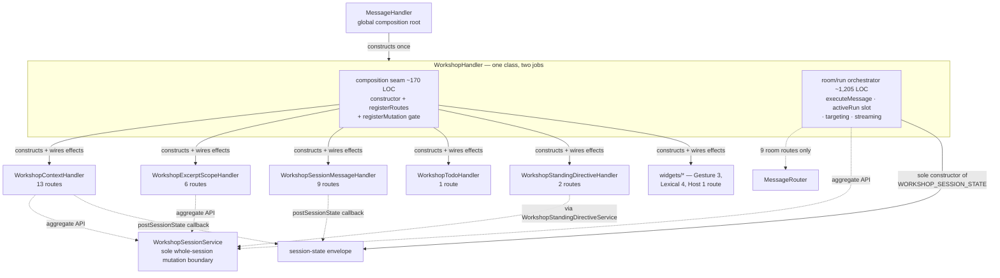
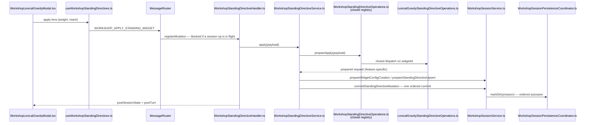

# Architecture Change Runway — Sprint 07: Architecture Closure

**Date:** 2026-08-06
**Status:** Accepted and implemented — final freeze decision remains with Okey
**Decision owner:** Okey
**Prepared by:** Ada Forge
**Scope:** The Workshop closure audit — the `WorkshopHandler` retain-or-rename verdict, the
[god-files debt](../../.todo/tech-debt/2026-07-25-workshop-god-files.md) disposition, the final
responsibility map, and the feature-freeze recommendation. No feature behavior.
**Branch / epic:** `claude/sprint-07-architecture-closure-orzxq9` →
[`epic/workshop-architecture-refactor`](../../.todo/epics/epic-workshop-architecture-refactor-2026-08-03/epic-workshop-architecture-refactor.md)
**Audience and reading budget:** Decision owner (Band 0, 30s) · architecture reviewer (Band 1–2,
~12 min) · implementer of the audit (Band 2.10 + Band 4)
**Base commit:** `0a742ca` (merge of PR #107, Sprint 06)

> **Implementation outcome (2026-08-06).** The implementation applied the
> runway recommendations D7-A(c), D7-B(b), and D7-C(b). The implementing commit
> does not independently prove that the decision preceded the fixture; PR #108
> F-10 therefore leaves explicit decision-owner confirmation as a review action
> rather than manufacturing a sequence from “ready to implement.” The tree
> separates `WorkshopRoomHandler` from `WorkshopSliceComposition`, audits all
> five freeze-gate facades, and derives the 20-seam Prose Controller fixture.
> See the [final responsibility map](2026-08-06-workshop-responsibility-map.md).
> D7-D remains explicitly unmade; implementation does not lift the freeze.

> **What is different about this sprint.** Phases 0–6 moved code. Phase 7 moves almost none. Its
> deliverable is *evidence*: two recorded verdicts and a published map that let a human decide
> whether the freeze lifts. That makes the usual runway question — "what could this change break?" —
> the wrong one. The right one is **"what could this audit conclude falsely?"** Everything below is
> organized around that.

---

## Band 0 — Change Card (30 seconds)

### Thesis

> Because six sprints relocated Workshop's responsibilities but deferred the two decisions that
> would prove the relocation *worked* — [Observed] the `WorkshopHandler` name and the god-files
> disposition are both still open at `0a742ca` — change **the epic's claims into audited
> measurements**, while preserving **every route, contract, persisted shape, and behavior**, so
> that the feature-freeze lift rests on evidence rather than on the fact that six sprints shipped.

### Architecture moves

| # | Move | Before | After | Why now | Confidence |
|---|---|---|---|---|---|
| 1 | Resolve the handler-name verdict from the observed responsibility split | `WorkshopHandler` = composer **and** room/run owner, name says neither | One recorded verdict with source/test/witness/doc alignment | D3 deferred it here explicitly ([debt L66-68](../../.todo/tech-debt/2026-07-25-workshop-god-files.md)) | STRONG |
| 2 | Reconcile the god-files record against the post-extraction tree | Debt open, 7 unchecked criteria | Evidence-backed close **or** documented hold | Debt gates the freeze, not the phase | STRONG |
| 3 | Publish the final responsibility + dependency map | Ownership readable only by reading 21 witnesses | One map a newcomer reads first | Traceability is a freeze-lift criterion | STRONG |
| 4 | Settle the reproduction-test criterion's *meaning* before measuring it | Criterion admits two readings with opposite verdicts | One agreed reading, then one measurement | Ambiguity here authors its own verdict (**F1**) | MODERATE |
| 5 | Record the already-satisfied criteria as satisfied | Sprint reads as if all 10 criteria are open | Sprint shrinks to its two real decisions | Validation + exceptions already pass at HEAD (**F5**) | STRONG |

### Scope and highest risks

| Affected boundary | Why affected | Highest failure mode | Risk |
|---|---|---|---|
| `WorkshopHandler` identity (source, 5 test files, 2 witnesses, log prefix ×27) | Move 1 | A cosmetic rename is mistaken for the closure the debt record forbids (`L85-86`) | **HIGH** |
| God-files debt record | Move 2 | Debt closes on 2 of the 5 facades the epic's gate actually names (**F3**) | **HIGH** |
| Reproduction-test criterion | Move 4 | Literal reading fails 20:1 after review correction; per-registry reading passes — auditor picks (**F1**) | **HIGH** |
| Architecture witnesses (21 invariants) | Moves 1, 3 | Rename desynchronizes `WORKSHOP_HANDLER_OWNER` paths and witness #10 | MODERATE |
| Feature freeze | All | Freeze lifts on an audit that measured the wrong thing | **CRITICAL** (consequence, not likelihood) |

### Human decisions required

| # | Decision | Options | Recommendation | Needed by |
|---|---|---|---|---|
| **D7-A** | `WorkshopHandler` disposition | (a) retain · (b) rename to `WorkshopRoomHandler` · **(c) extract the ~170-line composition seam, then rename the remainder** | **(c)** — see **F2**; (a) is defensible, (b) alone is the weakest of the three | Before any source edit |
| **D7-B** | Reading of "exactly one generic closed-registry entry" | (a) literal, one file total · (b) one entry *per* closed registry, zero edits to existing feature slices | **(b)** — (a) is unsatisfiable and was never achievable (**F1**) | Before the fixture is built |
| **D7-C** | Audit subject list | (a) the 2 files the debt record names · (b) the 5 the epic's freeze gate names | **(b)** — otherwise the gate is answered for 2 of 5 subjects (**F3**) | Before the map is published |
| **D7-D** | Freeze lift | Lift · hold · lift-with-conditions | Deferred to the audit's result — this runway does not pre-empt it | End of sprint |

### Gate

**State:** `READY FOR REVIEW` — implementation gate **CONDITIONAL**
**Blockers:** D7-A, D7-B, D7-C are all *decisions*, not investigations. Each is answerable from the
evidence in Band 2. None requires new code to resolve. The audit may not begin until D7-B is
answered, because the fixture's verdict is a function of the reading (**F1**).

---

## Band 1 — Architecture Delta Map (~2 minutes)

### 1.1 Where the epic actually stands at `0a742ca`

[Observed] Every number below was measured on the base commit, not carried from a prior document.

| Claim the epic makes | Measured at `0a742ca` | Verdict |
|---|---|---|
| Migration exceptions empty by Phase 7 | `WORKSHOP_LEGACY_OWNERSHIP_EXCEPTIONS = []` — `boundaries.test.ts:575` | **Already true** |
| Full validation passes | Jest 189 suites / 1,937 tests · 3 tsc projects clean · ESLint 0 errors (923 warnings) · webpack + `verify-bundle` OK · `git diff --check` clean | **Already true** |
| Every route has a declared owner | 48 routes / 9 owners / 34 mutation + 14 direct, pinned in `boundaries.test.ts:93-211` | **Already true** |
| `WorkshopHandler` retains "only the nine room/run responsibilities" (ADR §4) | Exactly 9: 8 mutation + `CANCEL_WORKSHOP_REQUEST` | **Already true** |
| Handler name verdict recorded | Absent | **Open — this sprint** |
| God-files debt disposition | 7 criteria unchecked | **Open — this sprint** |
| Final responsibility map published | Absent | **Open — this sprint** |
| Prose Controller reproduction fixture | Absent; criterion ambiguous | **Open — blocked on D7-B** |

**The consequence.** Five of Sprint 07's ten completion criteria are satisfied by inherited work.
The sprint is not "audit everything"; it is **two verdicts, one map, one fixture** — and one of
those four is blocked on a definition. Sizing it honestly is what keeps the audit from becoming a
ceremony that ratifies itself (**F5**).

### 1.2 The affected subtree — before

```text
application/handlers/domain/workshop/
├── WorkshopHandler.ts                  1,653  ← composer + room/run owner + envelope owner
├── WorkshopContextHandler.ts             861     13 routes
├── WorkshopExcerptScopeHandler.ts        472      6 routes
├── WorkshopSessionMessageHandler.ts      305      9 routes
├── WorkshopStandingDirectiveHandler.ts   172      2 routes
├── WorkshopTodoHandler.ts                103      1 route
├── WorkshopHandlerContracts.ts            30
└── widgets/
    ├── WorkshopWidgetHostHandler.ts       50      1 route
    ├── gesturePlayground/WorkshopGesturePlaygroundHandler.ts  742   3 routes
    └── lexicalGravity/WorkshopLexicalGravityHandler.ts        249   4 routes

application/services/workshop/
├── WorkshopSessionService.ts           2,121  ← aggregate facade, 7 named collaborators
└── session/{WorkshopPassageScope,WorkshopParticipantRoster,
            WorkshopTodoLedger,WorkshopTurnLedger}.ts

presentation/webview/
├── WorkshopApp.tsx                     1,485  ← 14 composed hooks, 11 local useState
└── hooks/domain/workshop/
    ├── useWorkshopRoom.ts                832  ← 37 useState (host-envelope mirror)
    └── useWorkshopSessions.ts            262
```

### 1.3 Target tree — under recommendation D7-A(c)

Legend: `[+]` add · `[~]` modify · `[>]` move/rename · `[-]` remove · `[=]` important unchanged boundary

```text
application/handlers/domain/workshop/
├── [>] WorkshopRoomHandler.ts        ~1,480   room/run orchestration only; log prefix
│                                              [WorkshopRoomHandler]
├── [+] WorkshopSliceComposition.ts     ~180   constructs the 8 siblings, owns the shared
│                                              registerMutation gate, registers all routes
├── [=] WorkshopContextHandler.ts               unchanged
├── [=] WorkshopExcerptScopeHandler.ts          unchanged
├── [=] WorkshopSessionMessageHandler.ts        unchanged
├── [=] WorkshopStandingDirectiveHandler.ts     unchanged
├── [=] WorkshopTodoHandler.ts                  unchanged
└── [=] widgets/**                              unchanged

__tests__/application/handlers/domain/workshop/
├── [>] WorkshopRoomHandler.roomAndRun.test.ts     from WorkshopHandler.roomAndRun
├── [>] WorkshopRoomHandler.seams.test.ts          from WorkshopHandler.seams
├── [>] WorkshopRoutes.context.test.ts             from WorkshopHandler.context      ← see F2
├── [>] WorkshopRoutes.excerptScope.test.ts        from WorkshopHandler.excerptScope ← see F2
├── [>] WorkshopRoutes.sessions.test.ts            from WorkshopHandler.sessions     ← see F2
├── [>] WorkshopRoutes.todos.test.ts               from WorkshopHandler.todos        ← see F2
└── [~] WorkshopHandlerTestHarness.ts → WorkshopRouteTestHarness.ts

[~] __tests__/architecture/boundaries.test.ts   WORKSHOP_HANDLER_OWNER path, the
                                                session-state-envelope witness owner, and the
                                                approved-generic-surface entry
[+] docs/architecture/2026-08-06-workshop-responsibility-map.md   the published map
[~] .todo/tech-debt/2026-07-25-workshop-god-files.md              disposition + evidence
[~] docs/adr/2026-08-03-...-module-boundaries.md                  §4 amendment recording D7-A
```

[Proposed] Everything marked `[+]` and `[>]` is a candidate under D7-A(c). Under D7-A(a) the tree is
unchanged and only the three documents move.

### 1.4 Responsibility ledger — the file the whole sprint is about

| Region | Lines | What it owns | Is that "room"? |
|---|---|---|---|
| Sibling construction (`constructor`) | 253–385 (**132**) | Builds all 8 siblings; supplies each its effect callbacks | **No — composition** |
| `registerRoutes` + `registerMutation` | 390–428 (**38**) | The shared session-operation mutation gate; delegates registration to 8 siblings | **No — composition** |
| `dispose` | 436–452 (17) | Fan-out teardown + run abort | Mixed |
| Room routes (run tool, quick action, send, persona, target, guests, settings) | 456–873 (**418**) | The 8 room mutations | **Yes** |
| `resolveMessageTarget` | 874–1010 (**138**) | Room targeting, catch-up, host-update policy | **Yes** |
| `executeMessage` | 1011–1379 (**369**) | The run engine: capability, delivery, streaming, commit/retain | **Yes** |
| Cancel + run-state guards | 1380–1520 (**141**) | Single active-run slot, preemption, cross-slice block reasons | **Yes** |
| Transport envelope + streaming + status/error | 1522–1660 (**139**) | Sole constructor of `WORKSHOP_SESSION_STATE`; stream/status/error senders | Mixed — family-wide |

**The arithmetic.** ~1,205 lines (73%) are unambiguously room/run. ~170 lines (10%) are
composition. ~156 lines (10%) are transport plumbing used by every sibling. [Inferred] The name
`WorkshopHandler` describes the 10%, not the 73% — and the 10% is the part the epic wants a reader
to *stop* looking for in this file.

### 1.5 Structural view — why the name is contested

**Question answered:** which of `WorkshopHandler`'s two roles does each arrow represent?
**Scope:** Workshop application layer only. **Abstraction:** module.
**Legend:** solid = composition/ownership · dashed = runtime delegation.



**What the picture shows.** Every solid arrow leaves the composition seam. Every dashed arrow
leaves the room orchestrator or a sibling. They are two disjoint fan-outs that happen to share a
`this`. That is the whole case for D7-A(c) — and the whole case against D7-A(b) on its own, because
a class named `WorkshopRoomHandler` would still own six solid arrows to handlers that have nothing
to do with the room.

### 1.6 Representative runtime flow — "writer pins a Lexical Gravity lens"

**Scenario:** the trace Sprint 07 must prove a reviewer can follow by filename.
[Observed] Verified by reading each file; every hop is a distinct, aptly-named module.



**Notable.** Eight named files, zero god-file reads, and the only feature-specific hop is behind an
explicit closed registry. [Inferred] This trace is the epic's thesis working. It is also the
strongest single piece of evidence *for* closing the god-files debt — and it is why **F1**'s
measurement matters so much: the trace is beautiful, and the review-hardened
reproduction cost is still 20 files.

### 1.7 Blast-radius summary

| Dimension | Direct | Indirect | Main failure | Witness | Risk |
|---|---|---|---|---|---|
| Structure | 1 class → 2 (D7-A(c)); or 0 (D7-A(a)) | 8 siblings' construction site moves | Composition seam becomes a second god file | `boundaries.test.ts` slice-isolation witness | LOW |
| Runtime | None intended | `activeRun` slot must stay single-owner across the split | Two run slots → double-send | `WorkshopHandler.roomAndRun.test.ts` (1,219 LOC) | MODERATE |
| Contract | None — 48 routes, all message shapes frozen | — | Route silently changes owner during the move | 48-route ledger witness | LOW |
| Data/state | None | — | — | Persisted-shape witnesses unchanged | LOW |
| Ops/security | 27 log prefixes + 2 test expectations | Triage greps for `[WorkshopHandler]` go stale | On-call grep misses | Sprint 04 precedent (F9 map) already accepted this class | MODERATE |
| Tests/docs | 6 test files rename; 2 witness constants; 3 documents | ~90 historical markdown files mention the old name | Rewriting history to match the present | **Do not touch PR reviews, archived epics, `.memory-bank`** | MODERATE |
| Coordination | Sole branch; epic is quiet | — | — | — | LOW |
| Evolution | The reproduction fixture defines the next feature's cost | Prose Controller, lens blending | Freeze lifts on an unmeasured extension cost | **F1** | **HIGH** |

---

## Band 2 — Reviewer Packet (~10 minutes)

### 2.1 The real job of this sprint

Sprint 07 is the only phase whose output is a *judgement* rather than a diff. Its risk profile is
inverted: the code is already correct (1,937 tests, five gates green), so nothing it does is likely
to break production. What it can break is **the epic's credibility** — by recording a closure that
the evidence does not support, or by holding one the evidence does.

The debt record anticipated exactly this and wrote the guard itself:

> "Phase 7 must not manufacture closure through a cosmetic rename or arbitrary line-count
> extraction." — [`2026-07-25-workshop-god-files.md:85-86`](../../.todo/tech-debt/2026-07-25-workshop-god-files.md)

Everything in this packet is in service of that sentence.

### 2.2 Declared intent, observed behavior, and open meaning

| Topic | [Declared] | [Observed] | [Inferred] | [Unknown] |
|---|---|---|---|---|
| Handler name | ADR §4: "`WorkshopHandler` remains the Workshop-internal composition owner **and** the owner of cross-slice room/run orchestration" | Both roles present; 73% room/run, 10% composition | The ADR states the dual role plainly — the *name* is what omits it | Which role Okey wants the filename to advertise |
| Room scope | ADR §4 Phase-4: "only the nine room/run responsibilities" | Exactly 9 routes | Held precisely | — |
| Facade cohesion | Debt: "narrow facades over named collaborators" | `WorkshopSessionService` delegates to 7 named collaborators; `WorkshopHandler` to 8 named siblings | Both are facades by structure | Whether 1,653 / 2,121 lines *reads* as narrow to a newcomer — a human judgement, not a measurement |
| Reproduction cost | Sprint: "exactly one generic closed-registry entry" | 20 generic surfaces would need a new arm after PR #108 review correction | The criterion cannot mean what it literally says | Which reading Okey intended (**D7-B**) |
| Freeze subjects | Epic gate names 4 facades | Sprint + debt track 2 | Two subjects are unowned | Whether that was deliberate (**D7-C**) |
| Witness trust | Sprint 06 review F-01/F-02: witnesses had blind spots | Both repaired in `ace148a`; `allowedToken` now required + anchored | The empty exception list is now certified by a token-level scan | — |

### 2.3 Contracts and invariants this sprint must not disturb

| Contract / invariant | Owner | Change? | Failure if broken | Witness |
|---|---|---|---|---|
| 48 inbound routes, exact owner + gate class | `boundaries.test.ts:93-211` | Owner *path string* only, under D7-A(b)/(c) | Duplicate or orphaned route | The ledger witness itself |
| Sole `WORKSHOP_SESSION_STATE` constructor | `WorkshopHandler` | Constant renames | Two envelope shapes diverge | `boundaries.test.ts:706` |
| Single active-run slot | `WorkshopHandler.activeRun` | **Must not split** under D7-A(c) | Concurrent runs, double delivery | `WorkshopHandler.roomAndRun.test.ts` |
| Shared `registerMutation` session gate | `WorkshopHandler.registerRoutes` | Moves to the composition seam under (c) | Mutations land mid-session-operation | 48-route ledger records gate class per route |
| No handler receives an internal session ledger | Epic constraint 5 | No | Aggregate integrity bypassed | `boundaries.test.ts:908` |
| Persisted shapes | `WorkshopSessionStateV1*` | **No** | Data loss on hydration | Shape + integrity suites |
| `packages/core` is `vscode`-free | monorepo ADR | No | Portability lost | `boundaries.test.ts:613` |

### 2.4 Negative space — does the generic name still tell the truth?

| Generic owner | May know | Must not know | Next-feature edit surface | Verdict |
|---|---|---|---|---|
| `WorkshopHandler` | Sibling handler + port **type names** only (`gesturePlayground(Handler)?`, `lexicalGravity(Handler)?` — `boundaries.test.ts:325`) | Gesture dictionary fields, lens logic, modal state, output grammars | +1 construction site per feature | **PASSES** — its feature vocabulary is composition-only |
| `WorkshopSessionService` | Config identity, revision, commit linkage, hydration | Any feature draft's *shape* | 0 — delegates to the config registry | **PASSES** |
| `WorkshopWidgetConfigOperations` | Clone/summarize dispatch | Draft internals | +1 arm × 4 switches | **PASSES** (closed dispatch, as designed) |
| `WorkshopStandingDirectiveOperations` | Family → entry dispatch | Feature copy | Replace the existing `proseControllerEntry` throwing stub | **PASSES** |
| `useWorkshopRoom` | Host-envelope mirror (37 `useState`) | Feature async workflow state | +0 | **PASSES** witness #5; see **F3** for the cohesion question |

[Observed] The negative-space test is the one Sprint 07 criterion that passes cleanly and without
interpretation. Every generic owner's feature vocabulary is dispatch or composition, never semantics.

### 2.5 Quality scenarios

| Type | Source | Stimulus | Environment | Artifact | Expected response | Response measure |
|---|---|---|---|---|---|---|
| Change | Implementer | Add Prose Controller | Post-freeze | Whole Workshop tree | New feature slice + one arm per closed registry | **Measured**: 0 edits to Gesture/Lexical slices; 20 generic files gain an arm after review hardening (**F1**) |
| Change | Newcomer | "Where does a standing-directive apply happen?" | Cold read | Source tree | 8 named files, no god-file read | **Verified** — §1.6 |
| Failure | Auditor | Runs the audit with D7-B unanswered | This sprint | Fixture | Auditor must not choose the reading | **Blocked by gate** — D7-B precedes the fixture |
| Failure | Reviewer | Rename lands, `WorkshopRoomHandler.context.test.ts` exists | Post-rename | Test tree | Filename must not lie | Witness #10 source/test/doc agreement (**F2**) |
| Runtime | Writer | Cancels a run mid-stream after the split | Post-D7-A(c) | `activeRun` slot | Exactly one slot, one owner | `WorkshopHandler.seams.test.ts` cancel suite |
| Operational | On-call | Greps `[WorkshopHandler]` in the output channel | Post-rename | Output channel | Prefix maps to a findable file | Sprint 04 F9 precedent — accepted MODERATE |
| Security | Persona | Emits a recommendation naming an unsupported widget | Runtime | Recommendation registry | Rejected by `isLiveWorkshopWidgetId` | `WorkshopWidgetRecommendationOperations.ts:66,126` |

**Sensitivity points.** D7-B (a definition that flips the fixture's verdict); the single `activeRun`
slot (any split of `WorkshopHandler` touches it).
**Tradeoff points.** Name honesty vs. log/test/doc continuity; audit thoroughness vs. Phase 7 being
an audit rather than an eighth refactor.
**Risk themes.** *Interpretation authoring its own verdict* (F1, F3); *closure by ceremony* (F2, F6).

### 2.6 Alternatives and tradeoffs

| Alternative | Shape | Benefits | Costs / risks | Verdict |
|---|---|---|---|---|
| **Minimal patch** | Record "retain `WorkshopHandler`", check the boxes, lift the freeze | Zero code risk; ships today | The sprint's own guard (`debt:85-86`) is about manufactured closure — this is its mirror image, closure by assertion. The name still hides 73% of the file | **Rejected** as the default; **acceptable** as D7-A(a) *if* Okey records why the dual name is honest |
| **Recommended — D7-A(c) + D7-B(b) + D7-C(b)** | Extract the ~170-line composition seam, rename the remainder to `WorkshopRoomHandler`, audit all 4 facades, measure the fixture under the per-registry reading | Every filename tells the truth; the map is complete; the fixture measures something achievable | One behavior-preserving move in an audit phase; 6 test renames; 27 log prefixes | **Recommended** |
| **More generalized** | Also decompose `executeMessage` (369) and `resolveMessageTarget` (138) into a run-engine package | Would make `WorkshopRoomHandler` genuinely small | ADR §8 forbids extraction without an independent reason to change; the run engine has *one* reason to change. This is line-count extraction wearing a boundary's coat | **Rejected** — and rejecting it is itself evidence for the debt's closure |

### 2.7 Principle and quality tensions

| Principle / quality | Status | Support | Tension / violation | Consequence | Witness | Confidence |
|---|---|---|---|---|---|---|
| Naming truthfulness | **TENSION** | Siblings are all named by slice | The one file that is *not* named by its slice is the one the epic exists to de-mystify | A newcomer reads `WorkshopHandler` as "the Workshop handler" — the god file | D7-A verdict + witness #10 | STRONG |
| Responsibility / cohesion | **ACCEPTABLE** | 8 named siblings, 7 named collaborators; both are structurally facades | 1,653 / 2,121 lines still concentrate change | Merge pressure stays real | Trace test §1.6 | STRONG |
| Dependency direction | **STRONG** | One composition root; `core` is `vscode`-free; siblings don't import each other | — | — | `boundaries.test.ts:613,723` | STRONG |
| Change isolation / evolvability | **TENSION** | 0 edits to existing feature slices for a new feature | 20 generic surfaces still gain an arm | The "copyable pattern" costs more than the sprint claims | **F1** | STRONG |
| Testability | **STRONG** | 189 suites; route-driven behavior tests through the real router | — | — | Measured green | STRONG |
| Operability | **ACCEPTABLE** | Per-sibling log prefixes since Sprint 04 | A rename restarts prefix churn | Stale triage greps | Sprint 04 F9 map | MODERATE |

### 2.8 Ranked findings

| ID | Severity | Finding | Evidence | Smallest fix | Blocks |
|---|---|---|---|---|---|
| **F1** | **CRITICAL** | The reproduction-test criterion admits two readings that produce opposite verdicts, and the sprint does not say which one governs — so whoever runs the audit authors the freeze-lift result | Sprint `07-architecture-closure.md:63-65`; initial runway measurement: 32 approved surfaces / 17 arms; PR #108 review correction: 33 approved / **20 arms** | Answer **D7-B** in the sprint doc *before* the fixture is built | The fixture, and therefore the freeze lift |
| **F2** | **HIGH** | The retain-or-rename binary is false: `WorkshopHandler` is 73% room/run and 10% composition, so *both* offered options leave a lying filename | §1.4 line map; `boundaries.test.ts:325` names the dual role verbatim: `'room coordinator and feature-slice composition owner'` | Add option (c) to **D7-A**: extract the composition seam, then rename | The handler verdict |
| **F3** | **HIGH** | The epic's freeze gate names **5** facades; the sprint's inherited decision and the debt record track **2**. `WorkshopApp.tsx` (1,485), `useWorkshopRoom.ts` (832 / 37 `useState`), and `useWorkshopSessions.ts` (262) have no owner in this sprint | Epic `:117-120` lists all five; sprint `:14-28` and debt `:20-21` list two | Answer **D7-C**; add the three to the audit subject list and the published map | The map, and the completeness of the gate |
| **F4** | **MEDIUM** | A rename would make `WorkshopHandler.context.test.ts` / `.excerptScope.test.ts` / `.sessions.test.ts` / `.todos.test.ts` into `WorkshopRoomHandler.*` — filenames claiming a *room* handler owns context, excerpt, session, and todo routes. Witness #10 requires source/test/doc agreement | 4 route-driven suites named for the composer; unit suites for the same slices already exist alongside them | Rename those four to `WorkshopRoutes.*.test.ts` (they test the composed router surface, not the room) | Witness #10 |
| **F5** | **MEDIUM** | Five of ten completion criteria are already satisfied at `0a742ca`. Reading the sprint as ten open items inflates it into an eighth refactor and dilutes the two decisions that matter | §1.1 measurements | Mark them satisfied-on-entry with the base commit as evidence | Nothing — but it protects the sprint's focus |
| **F6** | **MEDIUM** | The debt's criterion *"behavior-preserving moves and behavior changes use separate commits"* is a **process** property spanning Phases 1–6 that Sprint 07 must certify with no witness for it | Debt `:108`; epic constraint 1 | Certify by commit inspection over the phase range and record the result in the debt record, or explicitly downgrade the criterion | Debt closure |
| **F7** | **LOW** | 27 `[WorkshopHandler]` log prefixes + 2 test expectations churn under a rename | Measured; Sprint 04 already ran this migration and mapped it (F9), rating it MODERATE and accepting it | Reuse the Sprint 04 log-prefix map format | Nothing — precedent exists |

### 2.9 What survived attack

These were challenged with evidence and held. They should not be re-litigated in review.

- **The migration-exception list is genuinely empty, and now genuinely trustworthy.** PR #107's two
  High findings (F-01 name-vs-semantics blind spot; F-02 whole-file approvals returning before
  reading) were both repaired in `ace148a`. `ApprovedGenericFeatureSurface.allowedToken` is now
  **required**, not optional; `matchesApprovedFeatureToken` anchors with `^(?:…)$` against
  *extracted tokens*, not lines; `collectWorkshopFeatureSemanticOccurrences` extracts semantic
  tokens with an explicit `lexicalDensity` collision guard. I tried to reproduce the reported
  paste-back escape and could not — the whole-file tier no longer exists. **This was the single
  biggest threat to Sprint 07's evidence base, and Sprint 06 closed it.**
- **`WorkshopHandler` passes the negative-space test.** Its approved feature vocabulary is
  restricted to sibling handler and port *type names*. It knows no gesture field and no lens rule.
  The name is imprecise; the boundary is not.
- **The by-filename trace works.** §1.6 crosses 8 named files with no god-file read. The epic's
  central promise is observably delivered.
- **"Zero edits to Gesture/Lexical feature files" is structurally guaranteed**, not merely likely —
  the feature-isolation witness (`boundaries.test.ts:738`) already forbids cross-feature imports,
  and neither slice appears in Prose Controller's path. Clause (a) of the criterion is safe; only
  clause (b) is in dispute.
- **`WorkshopSessionService` at 2,121 lines is a facade, not a god object.** Seven named
  collaborators, no ledger exposed to handlers, and the aggregate retains exactly the four
  responsibilities ADR §4 assigns it. I looked for a responsibility with an independent reason to
  change that could still be extracted and did not find one — which is the debt's own stop rule
  (`debt:94-96`).
- **The 9-route claim in ADR §4 is exact**, not approximate: 8 mutation + 1 cancel.

### 2.10 Implementation slices

Ordered. Slice 0 is the only one that may run before D7-A/B/C are answered.

| # | Purpose | Files | Contract change | Verification | Depends on | Rollback seam |
|---|---|---|---|---|---|---|
| **0** | **Record the entry baseline** — measurements in §1.1, the five satisfied criteria, and the three open decisions | Sprint doc, this runway | None | Numbers reproduce at `0a742ca` | — | Doc-only |
| **1** | **Decisions** — Okey answers D7-A, D7-B, D7-C | Sprint doc, debt record | None | Each decision has a recorded rationale | 0 | Doc-only |
| **2** | **Reproduction fixture** under the agreed reading; publish the measured cost either way | New fixture test + map | None | Fixture asserts the agreed property; the derived 20-file figure is published even if reading (b) wins | 1 (**D7-B**) | Test-only |
| **3** | **Facade audit** across all subjects from D7-C; publish the responsibility + dependency map | `docs/architecture/…responsibility-map.md` | None | Every audited facade has a named-collaborator list and one traced action | 1 (**D7-C**) | Doc-only |
| **4** | **Handler disposition** per D7-A. If (b)/(c): one behavior-preserving commit — source, 6 test files, 2 witness constants, 27 log prefixes, harness — and **no** behavior change | Handler tree, `boundaries.test.ts` | Log prefix only | Full Jest green with identical assertions apart from prefix strings; 48-route ledger unchanged | 1 (**D7-A**) | Single revertable commit |
| **5** | **Debt disposition** — close with evidence per criterion, or hold with the unmet ones named | Debt record | None | Every criterion cites a file, test, or measurement | 2, 3, 4 | Doc-only |
| **6** | **Full validation + freeze recommendation** | — | None | Jest · 3× tsc · ESLint 0 errors · build + bundle · `git diff --check` | 5 | — |

**Commit discipline.** Slice 4 is the only code commit and must contain no behavior change (epic
constraint 1). If any part of it requires a product decision, it stops (ADR §9).

### 2.11 Coordination map

| Workstream | Files owned | Merge order | Owner |
|---|---|---|---|
| Runway + decisions | `docs/architecture/…closure-runway.md`, sprint doc | First | Ada Forge → Okey |
| Audit + map | `docs/architecture/…responsibility-map.md` | After decisions | Implementer |
| Handler disposition | handler tree + witnesses | After the map | Implementer |
| Debt disposition | `.todo/tech-debt/2026-07-25-…` | Last | Okey |

No concurrent work on `epic/workshop-architecture-refactor` at `0a742ca`. The branch is quiet.

### 2.12 Unknowns that can reverse the decision

| Unknown | Why it matters | How to resolve | Owner | Impact |
|---|---|---|---|---|
| Intended reading of the reproduction criterion | Flips the fixture's verdict, which gates the freeze | **D7-B** — decision, not investigation | Okey | **Reverses the freeze-lift recommendation** |
| Whether `WorkshopApp` / `useWorkshopRoom` / `useWorkshopSessions` are in scope | Determines whether the gate is fully answered | **D7-C** | Okey | Changes audit size, not architecture |
| Whether 1,653 / 2,121 lines *read* as narrow facades to a newcomer | The debt's closure criterion is a human judgement, and only Okey can render it | Cold-read the §1.6 trace | Okey | Reverses the debt disposition |
| Whether Phases 1–6 actually separated move-commits from behavior-commits | Debt criterion `:106` | Inspect commits over `785b49d..0a742ca` | Implementer | Blocks debt closure only |

---

## Band 3 — Self-review and Re-plan Verdict

### 3.1 Contradictions found and resolved

| Artifact pair | Contradiction | Resolution |
|---|---|---|
| Sprint criteria ↔ base commit | Sprint reads as 10 open items; 5 are already satisfied | **F5** — record them satisfied-on-entry with `0a742ca` as evidence |
| Sprint scope ↔ epic freeze gate | Sprint audits 2 facades; the gate names 5 | **F3** → **D7-C** |
| Sprint criterion ↔ measured tree | "exactly one generic closed-registry entry" vs 20 after review correction | **F1** → **D7-B**; the criterion is ambiguous, not the architecture broken |
| Sprint options ↔ observed responsibilities | retain/rename binary vs a 73/10 split | **F2** → **D7-A(c)** |
| Proposed rename ↔ test tree | `WorkshopRoomHandler.context.test.ts` would lie | **F4** — rename those suites to `WorkshopRoutes.*` |
| My first read ↔ PR #107 | I initially carried F-01/F-02 forward as open risks | **Corrected** — both were repaired in `ace148a`; verified in the current witness source. Recorded under §2.9, not as findings |
| My first verification run ↔ reality | `npx jest` and `npx tsc` appeared to run but `node_modules` was absent, so both fetched foreign toolchains | **Corrected** — installed the pinned toolchain and re-ran everything. §1.1's numbers are from the real run |

### 3.2 Prospective failure review

Assume this merged and the freeze lifted. What breaks?

| Failure story | Cause | Evidence / missing evidence | Prevention |
|---|---|---|---|
| Prose Controller lands and touches 20 generic files; the team concludes the epic failed | The fixture measured the per-registry property while everyone remembered the literal promise | Measured: 20 after PR #108 review correction | **F1** — publish the derived figure *even when reading (b) wins*. Slice 2 requires this |
| Six months on, `WorkshopRoomHandler` has quietly re-absorbed slice composition | The composition seam was never extracted; the rename made the file *feel* solved | §1.4 | **D7-A(c)**, plus a witness asserting the composition seam owns the sibling constructions |
| A writer's cancel races a completing run and double-delivers | Slice 4 split `activeRun` across two objects | Single-slot invariant (§2.3) | Slice 4 must not move `activeRun`; the `roomAndRun` + `seams` suites gate it |
| The debt closes; a later reviewer finds `WorkshopApp.tsx` at 1,485 lines and reopens everything | The audit covered 2 of 5 named facades | **F3** | **D7-C(b)** |
| A witness is green but the property is false | The Sprint 06 failure mode, repeated | Repaired in `ace148a` and re-verified here | Slice 4 must not weaken `allowedToken` to make a rename pass |
| The freeze lifts on a runway rather than an audit | This document is *analysis*, not the audit itself | — | Slice 6 requires the audit's own verification run |

### 3.3 Reproduction test — adding Prose Controller

**Plausible next feature:** Prose Controller (standing rail, `live: false` in the catalog today).
**Files it adds:** a feature slice mirroring `lexicalGravity/` — messages, config codec, directive,
handler, model service, hook, modal, styles, tests.
**Existing *feature* files it must edit:** **0** — guaranteed by the feature-isolation witness.
**Generic files it must edit:** **20** of the 33 approved generic surfaces.
**Already prepared for it:** **6** — `widgets.ts`, `standingDirectives.ts`, `workshopWidgets.ts`
(flip `live`), `workshopWidgetIcons.ts`, `WorkshopSessionStateV1Shape.ts`, and
`WorkshopStandingDirectiveOperations.ts`, which already carries a `proseControllerEntry` **throwing
stub** at `:86-101` — a real implementation *replaces* it rather than adding an entry.

**PR #108 review correction:** the original 17-file snapshot omitted
`dispatchWorkshopWidgetActionResult.ts` and the centralized `promptBudgets.ts`
catalog. Moving the new composition contracts to `WorkshopRouteContracts.ts`
adds that contracts module as an explicit generic seam. The executable fixture
now partitions all 33 approved surfaces into 20 applicable seams and 13
reasoned exclusions, so a newly approved generic surface cannot remain
silently unclassified.

**Verdict:** **PASSES** the "no existing-feature edits" clause and the "closed dispatch, one arm per
registry" clause. **FAILS** the literal "exactly one generic closed-registry entry" clause, 20:1.
[Inferred] The literal clause was never achievable in a closed-registry architecture — closed
dispatch means every registry names every variant, which is the property that makes variants
reviewable. The criterion is describing a *plugin* architecture the ADR explicitly rejected
(§"Build a universal open widget plugin framework — Rejected"). **This is why D7-B must be answered
by the decision owner and not by the auditor.**

### 3.4 Re-plan Verdict: **REFINED**

**Initial plan (before reading the tree):**

1. Audit the room/run boundary, pick retain or rename, align source/tests/witnesses/docs.
2. Reconcile the god-files debt against the post-extraction tree and close it if the traces hold.
3. Run full validation and publish the map.

**Final plan:**

1. Record the entry baseline: **five of ten criteria are already satisfied**; the sprint is two
   verdicts, one map, one fixture.
2. Get **three decisions** from Okey first (D7-A/B/C) — the retain-or-rename binary is false, the
   reproduction criterion is ambiguous, and the audit subject list is short by three facades.
3. Then audit, measure, dispose, and validate.

**What changed and why.** Three things, all from measurement rather than opinion:

- The **binary became a trichotomy**. I expected to weigh "is the name honest?" and instead found a
  file that is two files (73% room/run, 10% composition) — with the codebase's own witness at
  `boundaries.test.ts:325` naming both roles in one string. Neither offered option fixes that.
- The **reproduction criterion became the sprint's critical path**. I set out to verify it and found
  it unsatisfiable as literally written — not because the architecture is bad, but because closed
  dispatch and "one generic edit" are mutually exclusive by construction. That reframed it from a
  checkbox into the decision most likely to produce a false freeze-lift.
- The **sprint got smaller and sharper**. Five criteria were already green at the base commit. Saying
  so is not deflation; it is what stops Phase 7 from becoming Phase 8.

**What I attacked and could not break.** Sprint 06's witness repair (`ace148a`) genuinely closed the
blind spots PR #107 reported — I tried the reported escape and it now fails. The by-filename trace
holds across 8 named files. `WorkshopSessionService` has no remaining extractable responsibility
with an independent reason to change. The epic's core thesis is delivered.

**Remaining uncertainty.** Whether a cold reader experiences 1,653 and 2,121 lines as "narrow
facades" — a judgement only Okey can make, and deliberately not one this runway makes for him.

### 3.5 Implementation gate

| Gate condition | Pass / fail | Evidence |
|---|---|---|
| No unaccepted critical unknowns | **FAIL** | **F1**/D7-B is unresolved and gates the fixture |
| Contract consumers / migration / tests identified | **PASS** | 48-route ledger; rename surface fully enumerated (§1.7, Band 4) |
| Persistence failure and rescue defined | **PASS (n/a)** | No persisted-state change in any slice |
| Runtime flows owned and testable | **PASS** | §1.6 trace; `roomAndRun` (1,219 LOC) + `seams` (667 LOC) suites |
| Negative-space and reproduction tests pass | **PARTIAL** | Negative space passes cleanly; reproduction is measured but its criterion is ambiguous |
| Tree / responsibilities / contracts / slices agree | **PASS** | §1.2–1.4 reconciled against §2.10 |
| Human decisions and coordination assigned | **PASS** | D7-A/B/C assigned to Okey with recommendations; branch uncontended |

**Final gate:** **CONDITIONAL** — Slice 0 may proceed now. Slices 2–6 unblock the moment D7-A, D7-B,
and D7-C are recorded. No investigation is outstanding; only judgement.

---

## Band 4 — Evidence Appendix

### 4.1 Verification baseline at `0a742ca`

Measured on this branch with the repository's pinned toolchain (`npm ci`), 2026-08-06.

| Gate | Command | Result |
|---|---|---|
| Jest | `npm test` | **189 suites / 1,937 tests / 1 snapshot — all pass**, 57.6 s |
| Types | `npm run typecheck` | **Clean** across core, webview, extension |
| Lint | `npm run lint` | **0 errors**, 923 warnings (criterion is zero *errors*) |
| Build + bundle | `npm run build` | webpack OK; `verify-bundle` — 3 sentinel utilities present |
| Whitespace | `git diff --check` | Clean |
| Migration exceptions | `boundaries.test.ts:575` | `[]` |

> **Correction worth recording.** An earlier attempt at this baseline ran `npx jest` / `npx tsc`
> with `node_modules` absent. Both silently fetched foreign toolchains — Jest never started, and
> `tsc` reported two `tsconfig` deprecations from a TypeScript major the repo does not pin. Neither
> result was real. The table above is from the pinned toolchain after `npm ci`. If a future reader
> sees a "typecheck fails on baseUrl" claim about this commit, it is that artifact.

### 4.2 The rename surface, exactly

Under D7-A(b) or (c). Source and tests only — **historical documents are excluded by design**.

| Kind | Count | Files |
|---|---|---|
| Source rename | 1 | `WorkshopHandler.ts` (1,653 LOC) |
| Log prefixes in that file | 27 | `[WorkshopHandler] …` |
| Composition-root references | 3 | `MessageHandler.ts:50,79,304` |
| Witness constants + one test title | 3 | `boundaries.test.ts:67,325,706` |
| Test harness | 4 refs | `WorkshopHandlerTestHarness.ts` |
| Test files to rename | 6 | `WorkshopHandler.{roomAndRun,seams,context,excerptScope,sessions,todos}.test.ts` |
| Log-prefix expectations in tests | 2 | `roomAndRun.test.ts:518`, `seams.test.ts:547` |
| Incidental source references | 5 | `AgentRunPolicies.ts`, `ConversationManager.ts`, `WorkshopRunCompletion.ts`, `workshopTools.ts`, `useWorkshopRoom.ts` |
| Live documents to update | 4 | `docs/ARCHITECTURE.md`, ADR §4, epic, debt record |
| **Historical documents — do not edit** | ~90 | `docs/pr-reviews/**`, `.todo/archive/**`, `.memory-bank/**`, prior runways |

The last row is a finding in miniature: witness #10 requires source/test/**doc** agreement, and a
literal reading would sweep 90 historical records into a rename. PR reviews and archived sprints are
*records of what was true then*. Slice 4 must scope witness #10 to live documents.

### 4.3 Route ledger

48 inbound routes · 9 owners · 34 mutation-gated + 14 direct (`boundaries.test.ts:93-211`).

| Owner | Routes |
|---|---|
| `WorkshopContextHandler` | 13 |
| `WorkshopHandler` | **9** — 8 room mutations + `CANCEL_WORKSHOP_REQUEST` |
| `WorkshopSessionMessageHandler` | 9 |
| `WorkshopExcerptScopeHandler` | 6 |
| `WorkshopLexicalGravityHandler` | 4 |
| `WorkshopGesturePlaygroundHandler` | 3 |
| `WorkshopStandingDirectiveHandler` | 2 |
| `WorkshopTodoHandler` | 1 |
| `WorkshopWidgetHostHandler` | 1 |

ADR §4's "nine room/run responsibilities" is exact.

### 4.4 Reproduction-cost measurement

Of the 33 entries in `WORKSHOP_APPROVED_GENERIC_FEATURE_SURFACES` after PR #108 remediation:

- **24** name `lexical-gravity` — the nearest sibling and the correct analogue, both standing-rail widgets;
- **6** already name `prose-controller`;
- **20** would need a new arm;
- **13** are classified with a checked reason for requiring no new arm.

Already prepared: `messages/workshop/widgets.ts`, `messages/workshop/standingDirectives.ts`,
`constants/workshopWidgets.ts` (`live: false` → `true`), `workshopWidgetIcons.ts`,
`WorkshopSessionStateV1Shape.ts`, `WorkshopStandingDirectiveOperations.ts` (throwing stub at `:86-101`).

Would need a new arm: `MessageHandler.ts`, `MessageHandlerContracts.ts`,
`WorkshopRouteContracts.ts`, `WorkshopSliceComposition.ts`,
`WorkshopSessionRecords.ts`, `WorkshopWidgetConfigLedger.ts`, `WorkshopWidgetConfigOperations.ts`
(4 switches), `WorkshopWidgetRecommendationOperations.ts`, `index.ts`, `WorkshopApp.tsx`,
`WorkshopTurnBubble.tsx`, `useWorkshopWidgetOpening.ts`,
`dispatchWorkshopWidgetActionResult.ts`, `useWorkshopStandingDirectives.ts`,
`useWorkshopAppMessageRouter.ts`, `workshopWidgetAskPrefill.ts`, `promptBudgets.ts`,
`messages/base.ts`, `messages/index.ts`, `messages/workshop/index.ts`.

### 4.5 Fitness witnesses

`boundaries.test.ts` holds **21** invariants (18 Workshop-scoped), alongside 9 further architecture
suites (`workshopStyles`, `promptBudgets`, `resourceStaging`, four `*Sync`,
`noticeScreenshotRedaction`, `widgetModelsSync`).

| Rule | Witness | Sprint 07 effect |
|---|---|---|
| Every route → declared owner + gate class | `:658` | Owner path constant renames |
| Sole session-state envelope constructor | `:706` | Owner constant + test title rename |
| Extracted slices don't import each other | `:723` | Must still hold after any split |
| Feature slices don't import siblings | `:738` | Guarantees the fixture's clause (a) |
| Generic modules name features only at approved seams | `:784` | Token-anchored since `ace148a` |
| Handlers can't bypass the aggregate | `:908` | Unchanged |
| Hydration prepares collaborators before install | `:954` | Unchanged |
| Source / test / docs agree | `:989` | **Scope to live documents** (§4.2) |
| Migration exceptions exact | `:1068` | Already `[]` |

**Proposed additions for Slice 4** — the composition seam owns every sibling construction; no
`new Workshop*Handler(` outside it.

### 4.6 Genealogy and precedent

| Evidence | What changed | Lesson |
|---|---|---|
| Phases 1–6 (`785b49d..0a742ca`) | Slices, routes, presentation, handlers, aggregate, contracts | Every phase = runway → refactor → review → fix. This runway follows that rhythm |
| Sprint 04 F9 log-prefix map | `[WorkshopHandler]` split into per-sibling prefixes | Prefix migration is a **precedent, not a novelty**; rated MODERATE and accepted (**F7**) |
| PR #107 F-01 / F-02 | Name-level scan → token-level scan; optional → required `allowedToken` | A green witness whose property is false is worse than no witness. Slice 4 must not weaken `allowedToken` to make a rename pass |
| ADR §7 | Deviations from the destination tree are allowed **with a recorded reason** | D7-A(c) is a deviation and needs an ADR §4 amendment |
| Debt `:85-86` | "must not manufacture closure through a cosmetic rename" | The sprint's own guard, and the reason **F2** matters |

### 4.7 ADR seed

**Context.** Phases 0–6 delivered the Workshop module boundaries. Two decisions were deferred to
Phase 7: whether `WorkshopHandler` still names its responsibility, and whether the god-files debt
may close. At `0a742ca` the tree passes all five validation gates, holds an empty migration-exception
list certified by a token-level scan, and traces representative actions across named files. It also
shows a handler that is 73% room/run orchestration and 10% slice composition under a name that
advertises neither.

**Decision candidates.**

- **A1** Retain `WorkshopHandler`, recording that the dual role is deliberate and the name deliberately generic.
- **A2** Rename to `WorkshopRoomHandler`.
- **A3** *(recommended)* Extract the ~170-line composition seam, rename the remainder to
  `WorkshopRoomHandler`, and rename the four route-driven suites to `WorkshopRoutes.*`.
- **B1** Read the reproduction criterion literally (one generic file total) — **unsatisfiable under closed dispatch**.
- **B2** *(recommended)* Read it as one entry per closed registry plus zero existing-feature edits, and publish the derived 20-file cost.

**Consequences of the recommendation.** Every filename tells the truth; the composition seam gains
its own witness; one behavior-preserving commit in an audit phase; 27 log prefixes churn against an
accepted precedent; the freeze lift rests on a measured extension cost rather than an aspirational one.

**Unresolved.** D7-A, D7-B, D7-C, and D7-D — all Okey's.

---

## Band 5 — Reader Terms Appendix

### 5.1 Technical terms

| Term | Local meaning in this change | Why the reader needs it | Status / evidence |
|---|---|---|---|
| `Facade` | A file that keeps one boundary (aggregate mutation, room orchestration) while delegating internals to named collaborators. **Not** a size claim — the debt explicitly retired line-count targets | The debt closes on "narrow facade," so what counts as one decides the verdict | current · ADR §4, §8 |
| `Slice composer` | The ~170 lines that construct the 8 sibling handlers and register their routes. Distinct from the room orchestrator that shares the class | The heart of **F2** | current · `WorkshopHandler.ts:253-428` |
| `Closed registry` | Dispatch among an explicitly enumerated set of feature variants, chosen over dynamic plugin discovery to keep variants reviewable and unions exact. Its defining cost: **every registry names every variant** | Directly causes the review-hardened 20-file reproduction cost — the cost is the design working, not failing | current · ADR §3 |
| `Mutation route` / `registerMutation` | A route wrapped in the shared gate that refuses room mutations while a session operation is in flight. 34 of 48 routes | The gate class is half of what the route ledger pins | current · `WorkshopHandler.ts:391-406` |
| `Architecture witness` / `fitness function` | An executable test asserting a structural property. Ten were promised; 21 invariants exist | Sprint 07's evidence rests on them | current · `boundaries.test.ts` |
| `Migration exception` | An entry recording a known, accepted violation during migration. Phase 7 requires the list empty | Already `[]` — a criterion satisfied on entry | current · `boundaries.test.ts:575` |
| `Negative space` | What a generic module must *not* know. A generic name is honest only if its feature vocabulary is dispatch or composition, never semantics | The one criterion that passes without interpretation | current · §2.4 |
| `Approved generic feature surface` | A generic file permitted to name a feature at an explicit family seam, with a token-anchored allowance. 32 today | The denominator of the reproduction measurement | current · `boundaries.test.ts:313+` |
| `Reproduction test` | Simulating the next feature's cost as an architecture verdict | **F1** — the sprint's critical path | proposed · sprint `:63-65` |

### 5.2 Domain terms

| Term | Local meaning in this change | Why the reader needs it | Status / evidence |
|---|---|---|---|
| `Workshop` | The multi-persona writing room: an editor tab where a writer converses with personas over a scoped excerpt, with context, todos, and widgets | The subsystem this epic exists for | current |
| `Room` / `run` | *Room* = the shared conversation surface and its participants. *Run* = one in-flight request occupying the single `activeRun` slot. Together, the 73% of `WorkshopHandler` a rename would name | **divergent** — "run" here is a *conversational turn's execution*, not a test run or a CI run. Reviewers fluent in CI vocabulary consistently mis-read this | current · `WorkshopHandler.ts:233-241` |
| `Conversation Widget` | A writer-facing tool attached to the room on one of two rails: **one-shot** (produces an artifact and finishes) or **standing** (pinned, weighing on every turn until removed) | The rail decides the extension surface a new feature touches | current · `workshopWidgets.ts` |
| `Standing directive` | A pinned widget config that participates in every subsequent turn's prompt frame | The trace in §1.6, and Prose Controller's rail | current · `directives/` |
| `Gesture Playground` | The first Conversation Widget — one-shot; generates a gesture dictionary/menu for a passage | One of the two live features; the reproduction test's "must not edit" set | current |
| `Lexical Gravity` | Standing widget pulling a passage's lexis toward an interpretive lens (Photography, Mathematics, Music) with *weight* and *reach* | The nearest sibling to Prose Controller; the 23-file measurement analogue | current |
| `Prose Controller` | Standing widget over diction, sentence architecture, rhythm, density, figurative texture, punctuation | **divergent** — it reads like a component name, but it is a *product feature*, and it is **not absent**: the id already exists in the catalog (`live: false`), both protocol unions, the icon registry, the persisted validator, and as a throwing stub in the standing registry. Only its feature slice is missing | partially current · §4.4 |
| `Lens Logic` / `lens blending` | Paused Lexical Gravity v2 work — interpretive grammar and weighted multi-lens blending | Named in the freeze; not in this sprint | absent · ADR §1 |
| `Feature freeze` | No new Workshop feature behavior until Phase 7 closes and Okey explicitly lifts it | The thing this sprint exists to inform | current · ADR §1 |
| `D3` | Sprint 06's accepted decision to defer the handler naming verdict and god-files closure to Phase 7 | Why these two decisions are here at all | current · debt `:66-68` |
