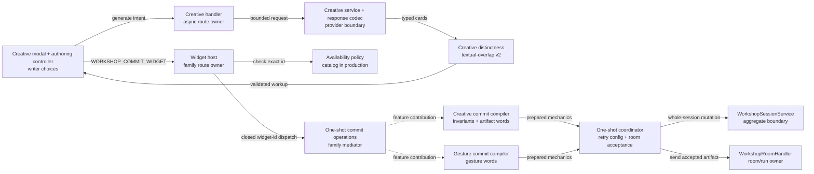
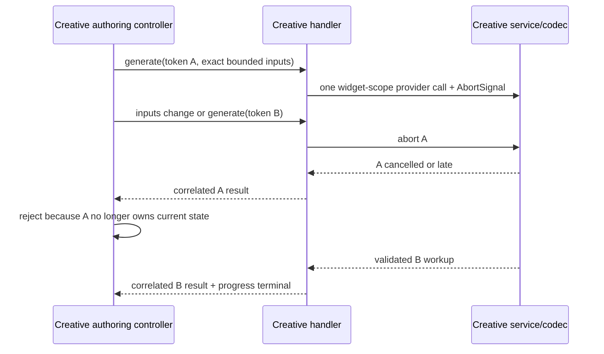

# Architecture Change Runway — Creative Variations Explorer

**Date:** 2026-08-10
**Status:** Approved for implementation; Slice 0 ready for review
**Decision owner:** Okey
**Prepared by:** Ada
**Scope:** Sprint 03 one-shot commit ownership, Creative Variations feature slice,
typed generation, persisted authoring state, and presentation workflow
**Branch:** `sprint/conversation-widgets-03-creative-variations` →
`epic/conversation-widgets`
**Audience / reading budget:** decision owner, implementer, and reviewers;
30-second change card, 2-minute maps, 10-minute reviewer packet
**Implementation gate:** **OPEN** — Okey accepted D1–D3 on 2026-08-10; every
implementation slice stops for review before the next begins

**Primary requirement:** [Sprint 03 — Creative Variations](../../.todo/epics/epic-conversation-widgets-2026-07-22/sprints/03-creative-variations.md)
**Governing decisions:** [Conversation Widgets ADR](../adr/2026-07-22-conversation-widgets.md),
[Widget State Ownership ADR](../adr/2026-07-31-workshop-widget-state-ownership.md),
and [Workshop Feature Family ADR](../adr/2026-08-03-workshop-feature-family-and-module-boundaries.md)

---

## 0. Change Card — 30 seconds

### Change thesis

> Because **the second one-shot widget has arrived while the family commit route
> and room-send contract are still Gesture-owned**, change **one-shot route and
> transaction ownership to the generic widget host plus a mechanical
> coordinator**, while preserving **the durable retry config, atomic
> turn/artifact acceptance, exact persisted variants, writer authority, and zero
> editor mutation**, so that **Creative Variations ships as a named feature and
> Show vs. Tell can follow without editing either existing feature slice**.

### Architecture moves

| Move | Before | After | Why now | Confidence |
|---|---|---|---|---|
| One-shot commit ownership | `WorkshopGesturePlaygroundHandler` registers `WORKSHOP_COMMIT_WIDGET` and types the room effect | `WorkshopWidgetHostHandler` owns the family route; `WorkshopOneShotWidgetCommitCoordinator` owns the transaction; named feature contributors validate and render | The second one-shot proves the shared rail mechanic | STRONG |
| Availability | Handlers and recommendation operations read catalog liveness directly | One injected policy, catalog-backed in production and exact-id enabled in route tests | Dormant contributions must exercise real routes before the final live flip | STRONG |
| Creative feature slice | Catalog-only id and planning documents | Named contracts, handler, services/codecs, prompt bundle, hook/controller, components, styles, and tests | Sprint 03 is the active feature slice | STRONG |
| Selection intake | Workshop `SELECTION_DATA` fan-out serves excerpt verification only | Exact Creative subject target, closed dispatcher, and display-safe provenance conversion | Selected editor text is a primary product input | STRONG |
| Generation boundary | Human-readable tool reports and an illustrative ZIP prototype | One sentinel-framed, exact-key, bounded JSON result plus rejected-response recovery | Wild outputs contain truncation and format drift | STRONG |
| Comparison authority | Prototype fixture scores and prose-first carry | Versioned deterministic textual overlap; writer-owned per-card direction/prose carry and risk acceptance | The implementation must make the design claims true | STRONG |
| Future analysis handoff | Creative-variation prose embedded in many analysis reports | Deferred typed, analysis-owned intent/preset handoff; no Markdown inference | Fourteen report families vary along different dimensions | STRONG |

### Scope and highest risks

| Affected boundary | Why affected | Highest failure mode | Risk |
|---|---|---|---|
| Family commit route | Its current owner and type are feature-specific | Creative dispatch is routed through Gesture or duplicate registration fails composition | HIGH |
| Availability gate | Catalog correctly keeps Creative dormant until complete | Lower-level tests pass while live route rejects generation/commit/recommendation | HIGH |
| Selection intake | The Workshop router has one current selection consumer | Creative never receives text or persists a host URI as provenance | HIGH |
| Persisted widget config | Creative stores inputs, results, selections, carry, and accepted risks | A malformed or mismatched config hydrates and changes what the writer appears to have accepted | HIGH |
| Async model run | Generate is cancellable and supersedable | A stale result settles after inputs or request ownership changed | HIGH |
| Invariant authority | Model-produced prose can add facts or cross a hard constraint | Unaccepted risk or explicit conflict reaches the room as writer-owned context | HIGH |
| Distinctness readout | Deterministic lexical evidence is narrower than semantic sameness | UI overclaims meaning or an average hides one collapsed pair | MODERATE |
| Editor boundary | Source text may originate in the editor | A comparison widget becomes an unreviewed write-back path | HIGH |

### Accepted decisions

| ID | Decision | Accepted contract |
|---|---|---|
| D1 | First-release aim | One optional `custom-aim` intent plus verbalized `Familiar`, `Adjacent`, `Tail`, or `Far tail`; blank projects as `Generate at random.` and distance defaults to `Tail`. No bound frame or analysis preset menu. |
| D2 | Commit selection | At least one card. Carry is per selected card, defaults to direction, and requires explicit promotion to full prose. |
| D3 | Risk authority | Advisory risks require per-risk acceptance. A card carrying a model-declared `hard-conflict` flag against `must not change` remains visible but cannot commit. Regeneration replaces risk identities and clears acceptance. |

### Gate

**State:** `APPROVED`
**Blockers:** none. Flag shape, workup identity, invalidation, and overlap protocol
are frozen below. Exact numeric input/output budgets and the high-overlap warning
threshold are Slice 2/3 calibration constants; neither can reverse ownership or
the persisted contract.

---

## 1. Architecture Delta Map — 2 minutes

### 1.1 Affected tree before

```text
packages/core/src/
├── application/handlers/domain/workshop/
│   ├── WorkshopRouteContracts.ts                 room send typed through Gesture
│   ├── WorkshopSliceComposition.ts               constructs feature handlers
│   └── widgets/
│       ├── WorkshopWidgetHostHandler.ts          config lookup only
│       └── gesturePlayground/
│           └── WorkshopGesturePlaygroundHandler.ts
│                                                   generate + cancel + family commit
├── application/services/workshop/widgets/
│   ├── WorkshopWidgetConfig{Ledger,Operations}.ts
│   ├── WorkshopWidgetPersistenceLifecycle.ts     two exact persisted variants
│   └── {gesturePlayground,lexicalGravity}/
├── infrastructure/api/services/widgets/
│   ├── GesturePlaygroundService.ts
│   └── LexicalGravityModelService.ts
├── presentation/webview/
│   ├── WorkshopApp.tsx
│   └── hooks/components/.../widgets/{gesturePlayground,lexicalGravity}/
└── shared/{constants,types/messages/workshop}/
```

### 1.2 Target tree

Legend: `[+]` add · `[~]` modify · `[>]` move responsibility · `[=]` unchanged

```text
packages/core/
├── resources/system-prompts/creative-variations/                    [+]
└── src/
    ├── application/handlers/domain/workshop/
    │   ├── WorkshopRouteContracts.ts                               [~] generic send type
    │   ├── WorkshopSliceComposition.ts                             [~] composition only
    │   └── widgets/
    │       ├── WorkshopWidgetHostHandler.ts                        [>] family commit route
    │       ├── gesturePlayground/
    │       │   └── WorkshopGesturePlaygroundHandler.ts            [~] generation only
    │       └── creativeVariations/
    │           └── WorkshopCreativeVariationsHandler.ts            [+]
    ├── application/services/workshop/widgets/
    │   ├── WorkshopWidgetAvailabilityPolicy.ts                    [+] catalog-backed gate
    │   ├── WorkshopOneShotWidgetCommitCoordinator.ts              [+] rail transaction
    │   ├── WorkshopOneShotWidgetCommitOperations.ts               [+] closed dispatch
    │   ├── gesturePlayground/
    │   │   └── GesturePlaygroundOneShotCommit.ts                   [+] feature compiler
    │   └── creativeVariations/
    │       ├── CreativeVariationsConfigCodec.ts                    [+]
    │       ├── CreativeVariationsArtifact.ts                       [+]
    │       ├── CreativeVariationsDistinctness.ts                   [+]
    │       ├── CreativeVariationsOneShotCommit.ts                  [+] feature compiler
    │       └── CreativeVariationsRecommendation.ts                 [+]
    ├── infrastructure/api/services/widgets/creativeVariations/
    │   ├── CreativeVariationsResponseCodec.ts                      [+]
    │   └── CreativeVariationsService.ts                            [+]
    ├── presentation/webview/
    │   ├── hooks/domain/workshop/
    │   │   ├── dispatchWorkshopSelectionData.ts                    [+] exact target fan-out
    │   │   └── widgets/creativeVariations/
    │   │       ├── useCreativeVariations.ts                        [+] IPC/correlation
    │   │       └── useCreativeVariationsAuthoring.ts               [+] local state machine
    │   └── components/workshop/widgets/creativeVariations/
    │       ├── WorkshopCreativeVariationsModal.tsx                 [+]
    │       ├── CreativeVariationCard.tsx                           [+]
    │       ├── CreativeVariationsComparison.tsx                    [+]
    │       └── creativeVariations.css                              [+]
    └── shared/types/messages/
        ├── ui.ts                                                   [~] subject selection target
        └── workshop/creativeVariations.ts                          [+]
```

### 1.3 Responsibility ledger

| Owner | Responsibility before | Responsibility after | Must not absorb | Evidence |
|---|---|---|---|---|
| `WorkshopWidgetHostHandler` | Fetch config by id | Fetch config; own the single family commit route and action refusal | Feature validation or writer-facing artifact prose | `WorkshopWidgetHostHandler.ts:13-49`; Feature Family ADR §3 |
| `WorkshopWidgetAvailabilityPolicy` | Liveness read directly from catalog at several call sites | One injected policy; production delegates to catalog, tests enable exact dormant ids | Feature semantics or a production bypass | current handler/recommendation liveness checks |
| `WorkshopOneShotWidgetCommitOperations` | Absent | Closed dispatch from exact widget id/draft arm to its feature compiler | Dynamic plugin discovery or feature semantics | Feature Family ADR §3 and §4 |
| `WorkshopOneShotWidgetCommitCoordinator` | Gesture handler performs transaction inline | Create durable retry config, mint artifact, send room turn, link accepted identities, publish state | `gesture`, `invariant`, `tradeoff`, `prose`, or feature failure copy | `WorkshopGesturePlaygroundHandler.ts:338-473` |
| Named feature commit compiler | Gesture validation/rendering is in its handler; Creative absent | Mirrored application-service owners validate an exact feature draft and produce a mechanical prepared commit | Room state, counters, persistence ordering | `WorkshopGesturePlaygroundHandler.ts:475+`; proposed Creative sibling |
| `WorkshopCreativeVariationsHandler` | Absent | Generate/cancel/result routes, availability, and correlation | Family config ledger, provenance interpretation, or editor writes | Sprint 03 deliverables 2–3 |
| Creative service/codec | Absent | One provider call; exact response protocol; raw rejection recovery | Report Markdown parsing or session mutation | `GesturePlaygroundService.ts:85-149,332-576` precedent |
| Creative authoring controller | Absent | Input invalidation, workup selection, comparison, carry, risk acceptance, commit eligibility | VS Code transport or durable storage | presentation-controller rule in project guide |
| Workshop selection dispatcher | Workshop routes all `SELECTION_DATA` to excerpt verification | Closed target fan-out for excerpt verification and Creative subject intake | Provenance interpretation or feature state | `useWorkshopAppMessageRouter.ts:86` |
| Creative config codec | Absent | Checkpoint shape, normalization, current shape, semantic integrity, clone/summary | Generic lifecycle dispatch | Widget State Ownership ADR; Sprint 02D pipeline |

### 1.4 Structural view

**Question:** Which owner knows mechanics, and which owner knows literary meaning?
**Scope:** one-shot generation and commit.
**Abstraction:** components and application services.
**Legend:** solid arrows are calls; dashed arrows are closed contributions.



### 1.5 Representative runtime flows

#### Selection or clipboard intake

```mermaid
sequenceDiagram
    participant UI as Creative authoring controller
    participant Host as UIHandler
    participant Router as Workshop selection dispatcher
    UI->>Host: REQUEST_SELECTION(workshop_creative_variations_subject)
    Host->>Host: read active selection; otherwise clipboard fallback
    Host-->>Router: SELECTION_DATA(content, display-safe source fields)
    Router->>UI: exact target only
    UI->>UI: editor fields → editor-selection provenance<br/>no fields → pasted provenance
```

Only `relativePath` and optional 1-based line bounds persist for an editor
selection; `sourceUri` is deliberately discarded. Clipboard fallback persists as
`{ kind: 'pasted' }`. The dispatcher owns target fan-out, while the Creative
authoring controller owns that feature-specific provenance conversion.

#### Generate and supersede



#### Commit and retry token

```mermaid
sequenceDiagram
    participant UI as Creative modal
    participant Host as Widget host
    participant Feature as Creative commit compiler
    participant Coord as One-shot coordinator
    participant Session as Session aggregate
    participant Room as Room handler
    UI->>Host: commit(exact draft, request token)
    Host->>Feature: closed dispatch + validate/render
    Feature-->>Coord: prepared mechanical commit
    Coord->>Session: create wc-N durable retry config
    Coord->>Session: mint ta-N
    Coord->>Room: send writer turn + artifact, no composer attachments
    alt room accepts writer turn and artifact
        Room-->>Coord: onRoomAccepted(turn id)
        Coord->>Session: link config ↔ turn ↔ artifact; publish state
        Coord-->>UI: success
    else room refuses before acceptance
        Coord-->>UI: failure + reachable wc-N retry config
    end
```

The atomic unit is the writer turn plus artifact publication. Config creation
precedes it deliberately and may survive refusal as the durable retry token.

Every generate, commit, and recommendation entry checks the injected availability
policy before model spend or mutation. Production composition binds that policy
to the catalog's `live` bit. Focused route tests may bind an exact dormant-id
allowlist; there is no environment flag or production bypass. Slice 7 flips the
catalog entry and reruns the route matrix through the production policy.

### 1.6 Blast-radius summary

| Dimension | Direct | Main failure | Witness | Risk |
|---|---|---|---|---|
| Structure | Route owner, composition, new vertical slice | Generic owner retains Gesture vocabulary | boundary negative-space scan | HIGH |
| Runtime | Generation and one-shot commit | stale settle or double route | correlation, cancellation, route-ledger tests | HIGH |
| Contract | Messages, result schema, persisted draft | mismatched widget/draft or unknown response key | type pairing + exact codec tests | HIGH |
| Data/state | Config lifecycle and cross-record links | corrupt reopen or orphaned linkage | lifecycle compiler + semantic integrity tests | HIGH |
| Operations/security | Provider spend, rejected output, source provenance | overspend, lost malformed evidence, exposed host URI | pre-spend bounds, recovery-store test, display-safe snapshot test | MODERATE |
| Presentation | Intake, cards, comparison, commit projection | inaccessible selection or hidden over-budget state | component/a11y interaction tests | MODERATE |
| Evolution | Show vs. Tell next-feature path | generic `VariationExplorer` absorbs continuum semantics | reproduction fixture | HIGH |

---

## 2. Reviewer Packet — 10 minutes

### 2.1 Working definition and real job

Creative Variations is a local, writer-controlled comparison studio. It owns a
optional custom creative aim, optional declared invariants, one bounded generated workup,
the writer's card/risk/carry choices, and the compact artifact wording those
choices create. It does not own report analysis, editor mutation, standing
prose behavior, persona behavior, cross-run variation history, or Show vs.
Tell's continuum.

### 2.2 Declared intent, observed behavior, and remaining calibration

| Topic | [Declared] | [Observed] | [Inferred] | [Unknown] |
|---|---|---|---|---|
| One-shot lifecycle | Sprint 03 follows Gesture and clone-and-recommit | Config ledger, thread-artifact rail, chip fetch, and retry behavior exist | Reuse the rail; do not create another lifecycle | — |
| Open aim | Optional custom aim with explicit random fallback plus approved verbalized distance | ZIP contains the four-distance control; wild reports contain analysis-owned axes | Distance is creative pressure, not an analysis preset | Final placeholder/example copy |
| Result shape | 3–5 exact typed cards | Wild Markdown cardinality and shape drift; prototype uses fixtures | Provider boundary must reject partial/unknown/malformed results | Exact field character caps, calibrated in Slice 2 |
| Distinctness | Pairwise deterministic diagnosis; no ranking/removal | No current algorithm; prototype averages fixture numbers | Name it textual overlap and preserve the full pair matrix | Warning threshold fixture calibration in Slice 3 |
| Risk authority | Advisory acceptance; model-declared `must not change` hard conflicts cannot commit | Prototype conflates accepted risk with canon and prose carry | Persist exact v1 flags and host-derived ids defined below | — |
| Reopen | Exact authoring truth | Current widget config lifecycle supports exact feature codecs | Persist semantic state, not focus/scroll/expanded panels | — |
| Analysis handoff | Report-prefill is deferred | Fourteen report families vary along distinct dimensions | Future presets must be emitted by each analysis owner | Future prompt-owner agreement |

### 2.3 Contracts and invariants

| Contract / invariant | Current owner | Target owner | Change? | Failure if broken | Witness |
|---|---|---|---|---|---|
| Exactly one `WORKSHOP_COMMIT_WIDGET` route | Gesture handler | Widget host | Yes, pure ownership move | composition rejects duplicate registration or the wrong compiler handles the id | route-ledger and router duplicate tests |
| Durable retry config may precede room acceptance | Gesture handler + session | Generic coordinator + session | Ownership only | writer loses recoverable draft or history contains an orphan turn | coordinator failure tests |
| Exact widget id ↔ draft pairing | message union + codecs | expanded exact union | Add Creative arm | sibling draft crosses route | compiler/type fixture |
| Catalog liveness gates every route | direct catalog checks | injected availability policy, catalog-backed in production | Consolidate | dormant code spends or mutates; tests cannot exercise real routes safely | policy and post-flip route matrix |
| Generation never mutates session | Gesture precedent | Creative handler/service | New feature | cancelled exploration dirties durable room | session snapshot equality test |
| Invalid/partial result never renders | absent for Creative | response codec | New | incomplete prose looks writer-selectable | strict codec matrix |
| Current request alone settles | Gesture token correlation | Creative handler + hook | New feature | stale model result replaces newer inputs | cancellation/supersession tests |
| Exact selection target and display-safe provenance | Workshop excerpt verification only | Workshop selection dispatcher + Creative controller | Add target | selection is lost, misrouted, or persists host URI | dispatch/provenance tests |
| Editor is read-only | UI selection route | Creative intake | New consumer only | unreviewed document replacement | negative-space import/message scan |
| Persisted config reopens semantic authoring truth | feature codec lifecycle | Creative codec | New exact variant | chip displays choices the writer did not make | clone/current/integrity tests |
| Artifact contains selected content only | Gesture directive precedent | Creative artifact compiler | New | discarded generation cloud consumes context | exact artifact snapshots + one-over bound |

### 2.4 Proposed Creative contract

```text
WorkshopCreativeVariationsDraft
├── subject { text, display-safe provenance }
├── surroundingContext { writerText, sourceReferences }
├── invariants { mustSurvive: optional, mustNotChange: optional }
├── intent { kind: custom-aim, aim: optional author input / explicit random request fallback, distance }
├── requestedCount: 3 | 4 | 5
├── workup: null | {
│   ├── workupId + generationProtocolVersion: 1
│   ├── cards[]
│   │   ├── stable position
│   │   ├── approach + portable direction + prose
│   │   ├── tradeoff { gain, cost }
│   │   └── invariantFlags[]
│   │       └── { id, invariantField, advisory-risk | hard-conflict, note }
│   └── overlap { algorithmVersion, every unordered pair, maximumPair }
│   }
├── selections[] { position, direction | full-prose, acceptedAdvisoryRiskIds[] }
└── note
```

Parallel arrays and maps are rejected: one selection record owns its card
position, carry mode, and accepted risks, making impossible pairings easier for
the codec to reject. The Workshop session schema remains the sole persistence
migration clock; `generationProtocolVersion` identifies only the provider-result
grammar and never authorizes independent widget checkpoint migration.

The handler mints a fresh `cvw-${randomUUID()}` through an injectable id factory
for every full generation attempt; cancelled and failed attempt ids are never
reused. The model response contains no ids. After strict decoding, deterministic
code derives each flag id as
`<workupId>:card-<position>:flag-<one-based-array-ordinal>`. A flag contains exactly:

- `invariantField: 'must-survive' | 'must-not-change'`;
- `kind: 'advisory-risk' | 'hard-conflict'`; and
- one bounded nonblank `note`.

A settled workup contains exactly `requestedCount` cards with contiguous,
one-based positions in array order. Missing, duplicate, or gapped positions and
unknown response keys reject the whole response before ids or overlap are derived.

Every flag must reference a writer field whose trimmed value is nonblank;
otherwise the response codec rejects the workup rather than letting the model
invent an invariant. `hard-conflict` is additionally valid only for
`must-not-change`. V1 has no additional risk-category taxonomy. On commit, every
selected card must reference exactly all of its advisory-risk ids—no missing,
extra, duplicate, or sibling-card ids—and no selected card may contain a hard
conflict. Response-codec and persisted-integrity suites both exercise the blank-
field rejection.

Changing subject, surrounding context, either invariant, aim, distance, or count
invalidates the current workup and clears selections, carry modes, and risk
acceptances. Starting whole-workup regeneration does the same before spend, then
mints a fresh workup id. The note is commit metadata and does not invalidate the
workup. These rules prevent positional choices from silently transferring to new
model output.

### 2.5 Textual-overlap v2

`textual-overlap-v2` is deterministic evidence of surface reuse, not a semantic
similarity claim:

1. Normalize with JavaScript `normalize('NFKC').toLowerCase()`. Replace
   `U+2018`, `U+2019`, and `U+02BC` with ASCII apostrophe and every
   `\p{Dash_Punctuation}` code point with ASCII hyphen. Extract tokens with the
   exact Unicode regex `/[\p{L}\p{N}]+/gu`; punctuation is therefore a boundary.
2. Reject a workup when any two normalized prose token arrays are element-for-
   element equal.
3. `gramSet(tokens, n)` is the set of lowercased, space-joined contiguous
   `n`-token windows. When `tokens.length < n`, it is the set of individual
   tokens. Any prose or direction whose normalized token array is empty is
   invalid at the response boundary.
4. For prose, build `gramSet(tokens, 3)` and remove members also present in the
   source subject's three-token set. Compare both the residual sets and the
   unadjusted sets; the settled score is the greater of residual Jaccard and
   95% of unadjusted Jaccard (rounded). That floor discounts expected source
   language without letting one disjoint trailing trigram make near-identical
   takes score zero.
5. For portable directions, compare `gramSet(tokens, 2)` without source removal.
6. Jaccard is `intersection.size / union.size`; persist
   `Math.round(100 * ratio)` as an integer `0..100`. For every unordered pair,
   persist prose and direction scores plus their maximum diagnostic score.
7. The set summary reports the maximum pair, never an average. Slice 3 calibrates
   and freezes the high-overlap warning threshold; `80` is only the initial
   prototype-derived fixture. Cards remain visible and unranked.
8. A changed algorithm requires a new version. Integrity recomputes persisted
   versioned scores rather than trusting checkpoint numbers.

This detects copied phrasing and repeated declared moves while discounting
source language every valid variation may need to preserve. It cannot prove two
paraphrases mean the same thing, and the UI must not say that it can.

### 2.6 Negative space

| Generic owner | May know | Must not know | Show vs. Tell edit surface | Verdict |
|---|---|---|---|---|
| Widget host | message type, widget id, mutation gate, action correlation | invariants, prose, tradeoffs, continuum positions | one closed dispatch arm | Honest generic |
| One-shot operations | exact supported ids and feature compiler callbacks | feature validation or artifact wording | one explicit arm | Honest closed registry |
| One-shot coordinator | config input, room/display text, artifact envelope, acceptance callbacks | Gesture dictionary, Creative flags/carry, Show/Tell vocabulary | none after its mechanical request fits | Honest family mechanic |
| Config lifecycle registry | codec's four operations and exact widget id | feature field meaning | one lifecycle entry | Honest closed registry |
| Creative feature slice | its own aim, cards, flags, overlap, artifact | Show/Tell continuum, analysis prompt semantics | zero | Correctly specific |

No generic `VariationExplorer`, open plugin API, arbitrary metadata map, or
Markdown variation parser is introduced.

### 2.7 Alternatives and tradeoffs

| Alternative | Shape | Benefit | Cost / risk | Verdict |
|---|---|---|---|---|
| Minimal patch | Keep the family route in Gesture and branch to Creative | Smallest first diff | False-specific owner, duplicate transaction logic, existing feature learns its sibling | Rejected |
| Recommended | Widget host route + closed operations + coordinator + named feature compilers | Names tell the truth; transaction tested once; feature meaning stays local | One behavior-preserving enabling slice before feature code | Accepted |
| Dynamic plugin system | Self-registering widget definitions own routes/codecs/UI metadata | New widgets touch fewer central unions | Contradicts accepted closed-registry architecture; weakens exact persisted/message variants | Rejected |
| Universal variation framework | Shared card, prompt, invariant, and comparison engine | Maximum nominal reuse | Absorbs Show/Tell and analysis-family semantics before they agree | Rejected |

### 2.8 Principle and quality tensions

| Principle / quality | Status | Support | Tension / consequence | Witness | Confidence |
|---|---|---|---|---|---|
| Responsibility / cohesion | STRONG | host, coordinator, and feature compilers have separate invariants | more named files and explicit wiring | negative-space scan | STRONG |
| Naming truthfulness | TENSION → STRONG | target removes Gesture from family contract | Slice 1 must touch Gesture once | route ownership test | STRONG |
| Dependency direction | STRONG | core services depend on ports; extension remains composition root | new runtime bundle arm | no-`vscode` architecture test | STRONG |
| Persisted exactness | STRONG target | feature codec owns all four lifecycle operations | larger exact draft shape | lifecycle compiler + codec tests | STRONG |
| Reliability | STRONG target | strict parser, raw recovery, stale rejection, host-side commit validation | provider can still produce semantically weak prose | failure matrix | MODERATE |
| Evolvability | ACCEPTABLE | one arm per applicable closed seam; zero sibling edits | deliberate central registry edits remain | Show vs. Tell reproduction fixture | STRONG |
| Performance / cost | ACCEPTABLE | one bounded provider call, no embeddings, no partial regeneration | 3–5 full variants can be output-heavy | budgets and token-usage assertions | MODERATE |

### 2.9 Ranked findings

| ID | Severity | Finding | Evidence | Smallest fix | Blocks |
|---|---|---|---|---|---|
| F1 | HIGH | The family commit route and room-send effect are still Gesture-owned. | `WorkshopGesturePlaygroundHandler.ts:42-66,103-128`; `WorkshopRouteContracts.ts:117` | Slice 1 host/coordinator extraction | Creative wiring |
| F2 | HIGH | A Creative config must join four closed persistence operations and stronger cross-record pairing. | `WorkshopWidgetPersistenceLifecycle.ts:23-86`; Sprint 02D | Slice 2 codec/lifecycle/integrity arm | commit/reopen |
| F3 | HIGH | Direct catalog checks prevent safe route-level staging while Creative remains non-live. | `WorkshopGesturePlaygroundHandler.ts:146,346`; `WorkshopWidgetRecommendationOperations.ts:64,126` | injected catalog-backed availability policy | Slices 3, 5, 6 |
| F4 | HIGH | Workshop selection routing has no Creative target or fan-out. | `ui.ts:20-26`; `useWorkshopAppMessageRouter.ts:86` | exact target + dispatcher + provenance conversion | Slice 4 intake |
| F5 | HIGH | The prototype cannot serve as runtime behavior: it fakes scores and omits exact state/constraint projection. | ZIP `pm-cvx.js:147-217,231-245` | strict contracts and real controller/service | live flip |
| F6 | HIGH | Wild reports are too irregular and incomplete to parse into cards. | 260 free sections; malformed `chapter-2.12/engagement-check-1.md:326` | sentinel JSON response codec | generation |
| F7 | MODERATE | “Similarity” overstates deterministic lexical evidence and averages can hide a duplicate pair. | Sprint requirement; prototype set average | textual-overlap v2 full matrix + max pair | presentation copy |
| F8 | MODERATE | The committed chip currently contains Gesture-specific presentation copy. | `WorkshopTurnBubble.tsx:302-315,507-524` | catalog-derived label/icon and neutral selection summary | Creative reopen UX |
| F9 | MODERATE | Registry roadmap tags and older architecture prose are stale after resequencing/refactor. | `workshopWidgets.ts:82-91,160-179`; `docs/ARCHITECTURE.md:151-155` | update only when implementation makes target current | Slice 7 |

**What survived.** The session-owned config ledger, four-operation codec
lifecycle, widget model scope, room execution seam, durable retry-token behavior,
thread-artifact rail, chip config fetch, clone-and-recommit rule, and named
feature-slice architecture all matched current code and accepted decisions.
They are reused rather than re-litigated.

### 2.10 Implementation slices

| Slice | Architectural purpose | Principal owners | Verification | Rollback seam |
|---|---|---|---|---|
| 0 | Freeze accepted behavior, owners, flows, and witnesses | sprint/concept/epic + this runway and characterization tests | focused green baseline, Markdown links, `git diff --check`; no production behavior | revert contract-and-characterization slice |
| 1 | Correct family one-shot ownership without behavior change | Widget host, availability policy, operations, coordinator, mirrored Gesture compiler, composition | existing Gesture handler/service/session tests + policy/route/negative-space witnesses | revert pure extraction |
| 2 | Establish Creative exact contracts and durable grammar | messages, budgets, workup-id factory, config codec, lifecycle, session integrity | codec boundary matrix, lifecycle compiler, cross-record fixtures | catalog remains non-live; remove new union arms |
| 3 | Stage bounded probabilistic generation behind deterministic validation | dormant handler route, prompt bundle, service/response codec, overlap | availability-enabled route tests; malformed/recovery, one-over, cancellation, stale, pair matrix | no Creative commit contribution yet |
| 4 | Add writer-owned intake, authoring, and comparison | selection target/dispatcher, provenance conversion, transport hook, controller, modal/cards/comparison/CSS | dispatch/provenance/hook/component/a11y tests; no editor-write witness | catalog remains non-live |
| 5 | Stage one-shot commit and exact clone lifecycle | dormant Creative compiler/artifact, host dispatch, chip/opening | availability-enabled artifact/budget/retry/accept/reopen/clone route tests | remove Creative commit arm; configs still fail closed |
| 6 | Stage writer-controlled persona recommendation/prefill | dormant recommendation codec/registry, prompt frame, opening controller | availability-enabled parser/budget/permission/correlation route tests | remove one recommendation arm |
| 7 | Prove the family and enable it | architecture fixtures, registry/docs, production availability policy | flip live, rerun real-route matrix, then full test/typecheck/lint/build/diff | flip `live` back to false |

Every slice uses the same Sprint 03 branch and stops for commit-by-commit review.
Production availability remains false until Slice 7.

### 2.11 Coordination map

| Workstream | Files owned | Shared lock points | Merge order |
|---|---|---|---|
| One-shot rail | widget host/contracts/composition/availability/Gesture compiler | `WorkshopRouteContracts`, route ledger | 1 |
| Persistence spine | messages/config/lifecycle/session integrity | `widgets.ts`, lifecycle registry | 2 |
| Generation | prompt/service/response codec/handler | runtime bundle, message enum | 3 |
| Presentation | selection dispatcher/hook/controller/components/styles | `ui.ts`, `WorkshopApp`, message router, CSS order | 4 |
| Commit/reopen | feature artifact/compiler/chip/opening | host dispatch, widget turn contract | 5 |
| Persona handoff | recommendation parser/frame/opening | recommendation registry and budget | 6 |
| Hardening | architecture tests/catalog/docs | all closed registries | 7 |

### 2.12 Unknowns that do not reverse the architecture

| Unknown | Why it matters | Resolution owner / slice | Decision impact |
|---|---|---|---|
| Exact field/output token caps | Spend, latency, and usable passage size | implementer calibrates with provider/test fixtures in Slices 2–3 | constants only |
| High-overlap warning threshold | warning usefulness | calibrate `80` against prototype and synthetic fixtures in Slice 3 | presentation policy; score/version unchanged |
| Narrow layout details | comparison readability | responsive component tests in Slice 4 | presentation only |

Report-specific preset ids, partial regeneration, bound frames, history, and
editor apply are not unknowns in this sprint; they are explicitly absent.

---

## 3. Self-review and Re-plan Verdict

### 3.1 Contradictions found

| Artifact pair | Contradiction | Resolution |
|---|---|---|
| Concept ↔ Sprint | Concept allowed zero selections and optional creative pressure | Sprint requires one-or-more only at commit; authoring pressure remains optional and blank generation uses the explicit random fallback |
| “Atomic” prose ↔ current behavior | Some comments imply config + turn + artifact “or nothing”; current accepted tests retain an uncommitted config | Define atomic unit as turn + artifact; config is a durable retry token |
| Sprint duplicate rule ↔ no-discard rule | “Duplicate cannot settle” could also reject merely similar cards | Exact normalized duplicate rejects; high non-identical overlap warns and remains |
| Prototype ↔ Sprint | Prototype defaults to prose and omits `must not change` from commit projection | Contract defaults per card to direction and projects both declared invariant fields |
| Tree ↔ future family | A generic variation layer looked attractive | Only the already-proven one-shot transaction becomes generic; Creative semantics remain named |
| Dormant catalog entry ↔ route tests | Production liveness correctly blocks Creative through Slice 6 | Inject one availability policy, keep production catalog-backed, and use exact-id test policy until the Slice 7 flip |
| Selection promise ↔ current router | Current Workshop fan-out recognizes excerpt verification only | Add one exact `SelectionTarget`, dispatcher arm, and display-safe Creative provenance conversion in Slice 4 |
| Workup protocol ↔ session schema | A nested `schemaVersion` would create a second migration clock | Persist `generationProtocolVersion: 1`; only the Workshop session schema controls migration |
| Commit compiler placement | Initial tree put Gesture and Creative equivalents in different layers | Mirror both under feature-owned application services; handlers retain IPC only |

### 3.2 Prospective failure review

| Failure story | Cause | Prevention / witness |
|---|---|---|
| Creative commit invokes Gesture validation | Family route moved without exact closed dispatch | compiler pairing test and route ledger |
| Dormant Creative code passes unit tests but fails its real route | Lower-level tests bypass the production liveness gate | injected exact-id policy in route tests; post-flip production-policy matrix |
| Editor URI leaks into persisted authoring truth | Selection payload is copied wholesale | dispatcher target test and provenance conversion that drops `sourceUri` |
| Old generation overwrites cards after an edit | token ownership cleared only on a second request, not every input mutation | authoring-controller invalidation and stale-result tests |
| Reopened chip shows accepted risks that no longer exist | loose ids or parallel state arrays | card-local stable ids; codec referential-integrity test |
| Writer commits a conflict by acknowledging it as “risk” | one undifferentiated flag type | closed advisory vs hard-conflict union; host validation repeats UI rule |
| One duplicate pair hides behind a healthy average | set score averages all cards | persist/display full matrix and maximum pair |
| Future Show vs. Tell imports Creative card semantics | premature universal variation component | pairwise feature-isolation and reproduction tests |
| Provider returns useful but malformed prose and evidence disappears | parser only throws/logs | rejected-response recovery store plus user-facing recovery notice |
| Full-prose selection bypasses the UI meter | budget enforced only in React | same artifact compiler and host validation own the ceiling |

### 3.3 Reproduction test

**Plausible next feature:** Show vs. Tell Playground.
**Adds:** its own messages, handler, prompt/service/codec, config codec, commit
compiler, hook/controller, components/styles, and tests.
**Shared edits:** one exact arm in applicable message/config/persistence/route,
recommendation, presentation-composition, and catalog registries.
**Existing feature edits:** zero under `gesturePlayground/`, `lexicalGravity/`,
or `creativeVariations/`.
**Verdict:** healthy closed-family reproduction. A requirement to edit Creative
means a supposedly mechanical seam has absorbed its vocabulary and fails.

### 3.4 Re-plan Verdict

**Verdict:** `REFINED`

**Initial plan:**

1. Add Creative as a sibling using Gesture's one-shot precedent.
2. Share a variation workup seam if Show vs. Tell appeared compatible.

**Final plan:**

1. First extract only the now-proven family commit route and transaction from
   Gesture; then add Creative through exact closed contributions.
2. Keep comparison, overlap, invariant, prompt, and card semantics in Creative;
   prove Show vs. Tell through a reproduction fixture before sharing more.

**What changed and why:** current code showed the family route is Gesture-typed,
while the Show vs. Tell plan still leaves carry/workup questions unresolved.
The second one-shot earns the transaction abstraction but not a universal
variation framework.

**Remaining uncertainty:** field budgets, overlap-warning calibration, and
responsive details; none changes the owner map or persisted variant.

### 3.5 Implementation gate

| Gate condition | Pass / fail | Evidence |
|---|---|---|
| No unaccepted critical unknowns | PASS | D1–D3 accepted; remaining unknowns are local constants/copy |
| Contract consumers/migration/tests identified | PASS | delta tree, contracts table, slice/test map |
| Persistence failure and rescue defined | PASS | four codec operations, fail-closed integrity, rejected-response recovery, retry config |
| Runtime flows owned and testable | PASS | generate/supersede and commit/retry sequences |
| Negative-space and reproduction design complete | PASS | §2.6 and §3.3; executable witnesses land with relevant owners |
| Tree/responsibilities/contracts/slices agree | PASS | cross-artifact review in §3.1 |
| Human decisions and coordination assigned | PASS | D1–D3 and §2.11 |

**Final gate:** `OPEN`

---

## 4. Evidence Appendix

### 4.1 Current file cards

#### `WorkshopGesturePlaygroundHandler.ts` — `[~]`

- **Role:** named feature handler.
- **Current responsibility:** Gesture generation/cancellation plus the generic
  commit route and inline one-shot transaction.
- **Delta:** loses family route/transaction; keeps generation and supplies a
  Gesture-specific commit compiler.
- **Critical evidence:** lines 42–66, 103–128, 338–473.
- **Verification:** preserve every current commit acceptance, refusal, retry,
  re-entrancy, and later-inference-failure test.

#### `WorkshopWidgetHostHandler.ts` — `[~]`

- **Role:** family IPC handler.
- **Current responsibility:** display-safe config fetch.
- **Delta:** gains the one generic commit route, mutation refusal, and closed
  dispatch orchestration.
- **Must not know:** feature draft fields or artifact prose.
- **Verification:** route ownership, cross-widget action correlation, unknown id
  rejection.

#### `WorkshopOneShotWidgetCommitCoordinator.ts` — `[+]`

- **Role:** application transaction coordinator.
- **Responsibility:** durable retry config creation, artifact identity, room-send
  acceptance milestone, cross-record linkage, dirty/state publication.
- **Tradeoff:** makes temporal ordering explicit at the cost of one additional
  collaborator.
- **Verification:** exact ordering and all failure milestones.

#### Creative Variations named slice — `[+]`

- **Role:** feature vertical slice across shared, application, infrastructure,
  and presentation layers.
- **Responsibility:** everything whose reason to change is Creative Variations
  product meaning.
- **State/contracts:** new exact message/result/draft variant and persisted codec;
  no compatibility arm because the feature has never shipped.
- **Verification:** mirrored tests beside every owner plus architecture fitness
  witnesses.

### 4.2 Genealogy and precedent

| Evidence | What it proves | Lesson |
|---|---|---|
| Conversation Widgets ADR §Sprint 01 | Gesture proved pre-commit → retry config → artifact/turn → chip → clone | Preserve behavior, move ownership |
| Widget State Ownership ADR | Session aggregate remains root; feature codecs own exact variants | Creative adds four lifecycle operations, not generic field logic |
| Feature Family ADR §3 | Generic modules may own rail mechanics and closed dispatch, not feature vocabulary | Host/coordinator extraction is authorized; plugin framework is not |
| Sprint 02D | raw checkpoint → shape → clone → normalize → current → integrity → hydrate | Creative must enter the same pipeline completely |
| Design ZIP SHA-256 `58d1ef8c…f6f060` | interaction hierarchy and intended states | Treat labels/layout as design evidence, not JS as behavior |
| 313-file wild-output survey | report families and format drift | Derive prompts/fixtures; never parse reports into runtime cards |

### 4.3 Fitness witnesses

| Rule | Automated witness |
|---|---|
| One family commit route, owned by Widget Host | Workshop route ledger + router duplicate-registration test |
| Dormant code and production use the same route gates | availability-policy suite + post-flip production-policy matrix |
| Generic coordinator contains no feature vocabulary/copy | architecture token/import negative-space scan |
| Every implemented persisted feature joins architecture checks | lifecycle-id ↔ feature-descriptor inventory test |
| Existing features never import one another | descriptor-driven pairwise feature-isolation scan |
| Show vs. Tell needs no Creative/Gesture/Lexical edits | one-shot next-feature reproduction fixture |
| Exact message/draft pairs | TypeScript compile fixture and runtime wrong-arm rejection |
| Every persisted feature supplies four lifecycle operations | `workshopWidgetPersistenceLifecycle.test.ts` |
| Creative cannot mutate editor or use report Markdown parser | import/message/port negative-space scan |
| Creative selection drops host URI and keeps display-safe provenance | exact-target dispatcher and controller conversion tests |
| Invalid/stale provider output cannot settle | response-codec and request-correlation suites |
| Artifact budget is host-enforced | exact/one-over compiler and handler tests |
| Live entry follows complete route | catalog/model/style/message synchronization witnesses |

### 4.4 ADR seed

**Context:** the second one-shot widget reveals that the family commit route and
room effect remain owned by Gesture.
**Decision candidates:** keep Gesture ownership, extract a closed generic
transaction, or introduce a dynamic widget plugin system.
**Recommended decision:** the accepted Feature Family ADR already chooses the
middle path: generic rail mechanics and closed dispatch, feature-owned meaning.
**Consequence:** no new ADR is required. This runway records the concrete second-
one-shot realization; implementation updates current architecture documentation
only after the ownership move exists.
**Unresolved questions:** none at ADR altitude.

---

## 5. Reader Terms Appendix

### 5.1 Technical terms

| Term | Local meaning | Status / evidence |
|---|---|---|
| Closed dispatch | An exhaustive switch/registry over exact supported widget ids; adding a feature adds one reviewed arm rather than runtime discovery. | current architecture; expanded here |
| Availability policy | Injected `isAvailable(widgetId)` boundary; production reads catalog liveness, while focused tests may enable an exact dormant id through the same routes. | proposed family mechanic |
| Feature compiler | A feature-owned validator/renderer that converts an exact draft into a feature-neutral prepared one-shot commit. It is not a source-code compiler. | proposed; locally divergent term |
| Generation protocol version | Version of the strict provider-response grammar and overlap algorithm inputs; not a checkpoint migration clock. | proposed Creative contract |
| One-shot commit coordinator | Mechanical application service owning retry-config, artifact, room-acceptance, and linkage ordering for thread-artifact widgets. | proposed |
| Semantic integrity | Feature validation after current persisted shape validation: ids/references and writer choices must agree, not merely have valid JSON types. | current lifecycle; expanded variant |
| Vertical slice | One named feature's contracts, handler, services/codecs, presentation, prompts, and tests across layers. | current Feature Family ADR |

### 5.2 Domain terms

| Term | Local meaning | Status / evidence |
|---|---|---|
| Authoring truth | Durable inputs and writer decisions needed to reopen the same editable widget state; excludes focus, scroll, and expanded panels. | approved Sprint 03 contract |
| Advisory risk | Model-declared additive uncertainty that may commit only after the writer explicitly accepts it. | proposed Creative variant |
| Hard conflict | A model-declared typed flag against the writer's nonblank `must not change` field; visible for comparison but its card is commit-ineligible. Deterministic code validates the flag contract, not the prose's semantics. | proposed Creative variant |
| Workup id | Fresh host-minted `cvw-<UUID>` for one full-generation attempt; it namespaces derived card/flag identities and is never supplied by the model. | proposed Creative contract |
| Textual overlap | Versioned deterministic surface-reuse score; it does not claim semantic equivalence. | `textual-overlap-v2` |
| Thread artifact | One-turn host-minted payload delivered with a writer turn and never edited in history. | current one-shot rail |
| Durable retry config | A persisted `wc-N` authoring draft created before room acceptance and retained if acceptance fails. | current behavior; clarifies “atomic” |
| Clone-and-recommit | Reopening a historical one-shot config as a new draft and committing fresh config/artifact/turn identities. | current invariant |
| Analysis preset | Future analysis-owned typed intent tied to an originating finding; absent from Sprint 03 and never inferred from Markdown. | explicitly absent |
