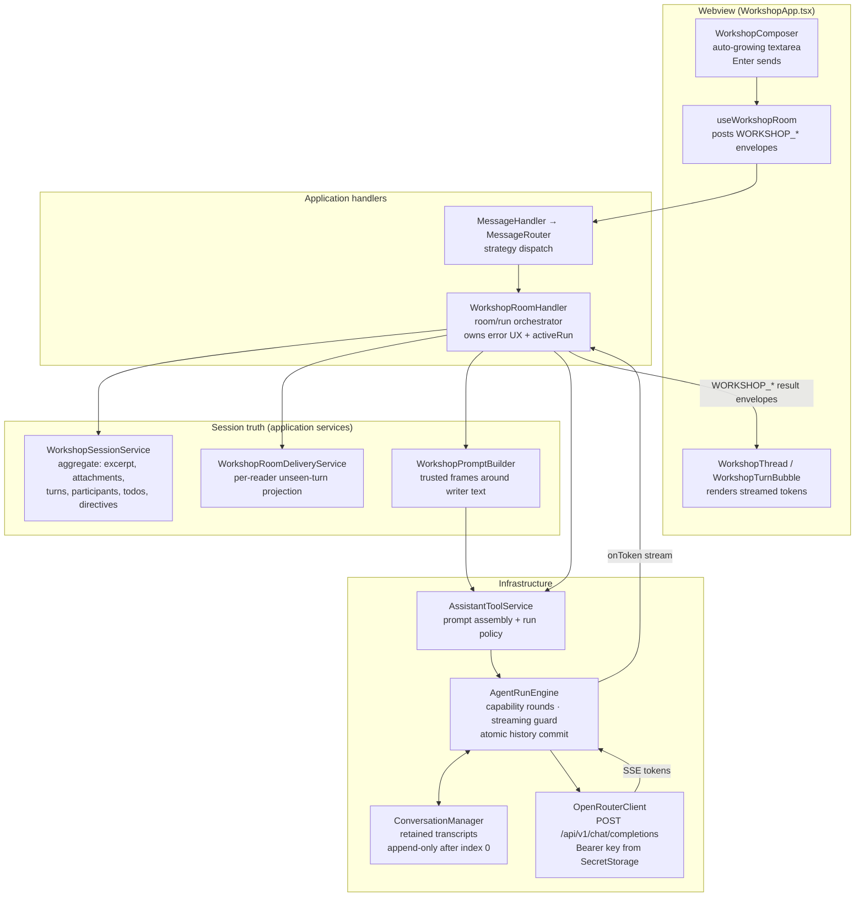
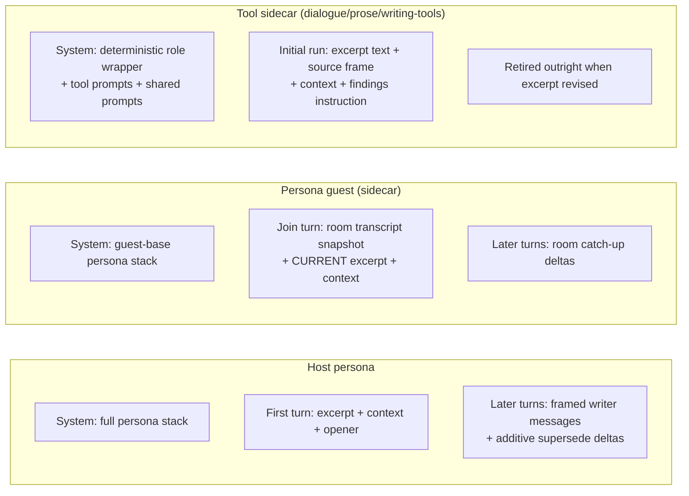

# Workshop Prompt Assembly — 01: Lifecycle Overview

> Part of the [Workshop Prompt Assembly illustration series](README.md).
> Companion docs: [02 System Prompt](02-system-prompt-assembly.md) ·
> [03 Excerpt & Context](03-excerpt-and-context-lifecycle.md) ·
> [04 Per-Turn Frames](04-per-turn-frame-anatomy.md) ·
> [05 Widgets](05-widget-contributions.md)

This doc is the satellite view: how one writer message travels from the
Workshop composer to OpenRouter and back. The rest of the series zooms into
each stage.

## The full round trip



## What each layer decides — and refuses to decide

| Layer | Owns | Explicitly does NOT own |
|---|---|---|
| `WorkshopComposer` / `useWorkshopRoom` | Raw writer text, UI state, message attachments picked for this turn | Any prompt framing |
| `WorkshopRoomHandler` | Which participant answers (host / guest / tool sidecar), run lifecycle, error UX (`ConversationNotFoundError` → "conversation expired") | Prompt text, transport |
| `WorkshopSessionService` | Durable truth: excerpt, context attachments, room ledger, delivery offsets, pending host updates | Audience decisions at render time |
| `WorkshopRoomDeliveryService` | Which room turns each reader has not yet seen (contiguous-prefix acknowledgement, 1M-char runaway guard) | Frame wording |
| `WorkshopPromptBuilder` | Trusted XML-ish frames around writer material, delimiter neutralization | Which turns to include (receives them pre-selected) |
| `AssistantToolService` | System prompt assembly, run policy selection, web-search tool wiring | Turn mechanics |
| `AgentRunEngine` | Capability rounds, streaming visibility, cancellation, token accounting, **atomic** history commit | Protocol/IO of capabilities (adapters own that) |
| `OpenRouterClient` | HTTP + SSE to `https://openrouter.ai/api/v1/chat/completions` | Everything else |

## One turn, in time

```mermaid
sequenceDiagram
    participant W as Writer (Composer)
    participant RH as WorkshopRoomHandler
    participant SS as WorkshopSessionService
    participant PB as WorkshopPromptBuilder
    participant ATS as AssistantToolService
    participant EN as AgentRunEngine
    participant OR as OpenRouter

    W->>RH: WORKSHOP_SEND_MESSAGE (raw text)
    RH->>SS: collect pending host updates (excerpt/context deltas)
    RH->>SS: prepare room delivery (unseen turns for this reader)
    RH->>PB: build frames (time · transition · interaction ·<br/>host-update · catch-up · todos · artifacts · activation)
    PB-->>RH: framed user message with &lt;writer-message&gt; last
    RH->>ATS: continueConversation(conversationId, framed message)
    ATS->>EN: policy + capability adapter + streaming options
    EN->>OR: history + new user turn (SSE)
    OR-->>EN: tokens (visibility guard withholds tool-call XML)
    alt model emits a validated capability call
        EN->>EN: fulfill via adapter → evidence as instructed user turn
        EN->>OR: continue (bounded by policy.maxCapabilityRounds)
    end
    EN->>EN: commit user+evidence+assistant turns atomically
    EN-->>RH: ExecutionResult (content, usage, citations)
    RH->>SS: commit delivery offsets + pending-update generation
    RH-->>W: assistant turn appended to room ledger
```

Two commit disciplines to notice, both load-bearing:

- **Provider history commits atomically at the engine.** A cancelled or failed
  turn leaves the retained transcript untouched — no partial turns, ever
  ([AgentRunEngine.ts](../../../packages/core/src/infrastructure/api/orchestration/AgentRunEngine.ts)).
- **Session-side receipts commit only after success at the handler.** Delivery
  offsets advance only through the exact contiguous prefix that shipped, and
  pending host updates clear only for the exact generation delivered — a
  failed run retries the same deltas next turn
  ([WorkshopRoomDeliveryService.ts](../../../packages/core/src/application/services/workshop/WorkshopRoomDeliveryService.ts),
  [WorkshopRoomHandler.ts](../../../packages/core/src/application/handlers/domain/workshop/WorkshopRoomHandler.ts)).

## The three participant kinds

Every Workshop conversation is one of three retained provider transcripts,
each with its own prompt discipline (detailed in docs 02–04):



## Where to go next

- How the system message is layered and when it is rebuilt →
  [02-system-prompt-assembly.md](02-system-prompt-assembly.md)
- Where the excerpt/context live and what happens when they change →
  [03-excerpt-and-context-lifecycle.md](03-excerpt-and-context-lifecycle.md)
- Every frame that rides a user turn, and what repeats →
  [04-per-turn-frame-anatomy.md](04-per-turn-frame-anatomy.md)
- What each widget injects and where its interpreting prompts live →
  [05-widget-contributions.md](05-widget-contributions.md)
