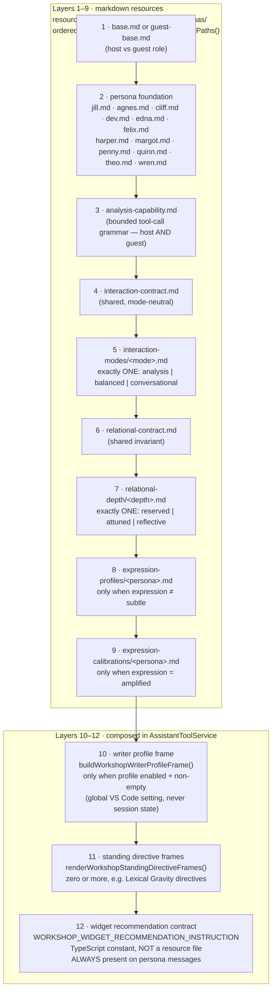
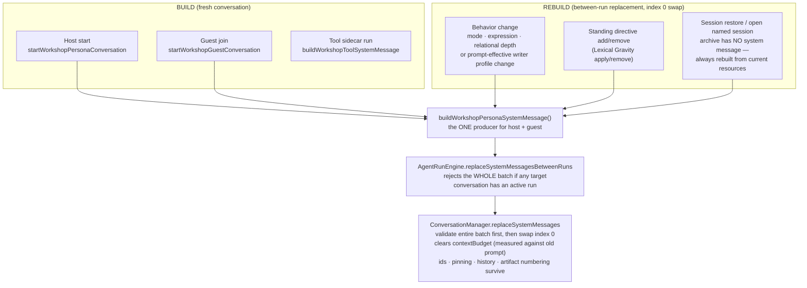
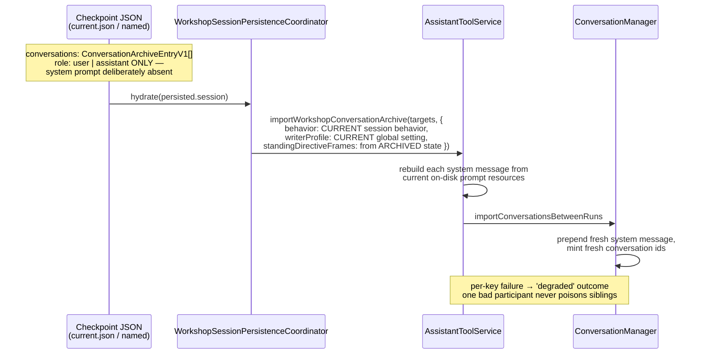

# Workshop Prompt Assembly — 02: The System Prompt

> Part of the [Workshop Prompt Assembly illustration series](README.md).

The persona system message is a 12-layer sandwich. Layers 1–9 are markdown
files on disk; layers 10–12 are strings composed in TypeScript. One function
owns the file ordering, one function owns the final join, and **every** path
that produces a persona system message — initial start, mode change, directive
edit, session restore — goes through the same pair.

## The 12 layers

Key sources:

- Path chain: [workshopPersonas.ts](../../../packages/core/src/shared/constants/workshopPersonas.ts)
  (`workshopPersonaSystemPromptPaths`, "The ONE definition of the persona
  system-prompt assembly chain — both initial assembly and between-run
  replacement call this")
- Final join: [AssistantToolService.ts](../../../packages/core/src/infrastructure/api/services/analysis/AssistantToolService.ts)
  (`buildWorkshopPersonaSystemMessage`)
- File loading: `PromptLoader.loadPrompts` joins files with `\n\n---\n\n`,
  rooted at `resources/system-prompts/`, path-traversal guarded
  ([prompts.ts](../../../packages/core/src/tools/shared/prompts.ts))

Notes on the conditional layers:

- **Layer 3 rides for guests too.** Guests carry the same bounded capability
  grammar as the host — a charter that denies capabilities while the run
  policy grants them would ship contradictory instructions (PR #89 review #2).
- **Layers 5 and 7 are exclusive selections**, never concatenations. Mode
  resources contain no persona names; personas are never forked into per-mode
  prompt files (ADR 2026-07-20 §2).
- **Layer 8 is skipped for `subtle`**, included for `full` and `amplified`;
  layer 9 only for `amplified`. Most-specific-last gives the expression layer
  the final word.
- **Layer 10 embeds the relational depth** as an interpretation ceiling
  ("Interpret this context only within that permission ceiling") but is *gated*
  only on the profile being enabled and non-empty — depth changes the frame's
  text, not its presence.
- **Layer 12 is assembled from the live widget registry**
  ([WorkshopWidgetRecommendationOperations.ts](../../../packages/core/src/application/services/workshop/widgets/WorkshopWidgetRecommendationOperations.ts)),
  wrapped in `<workshop-widget-recommendation-contract>`, injected at the
  composition root ([extension.ts](../../../apps/vscode-extension/src/extension.ts)).
  Tool sidecars do **not** get it — their system message is a deterministic
  role wrapper + tool prompts + shared prompts (`buildWorkshopToolSystemMessage`).

## When is it built, and when rebuilt?

The system message occupies index 0 of the retained transcript and is the
**only** entry that can ever be replaced (see doc 03 for the append-only rule
covering everything else).

### Rebuild trigger 1: behavior / profile change

`WorkshopConversationSettingsService.apply` compares old vs new and replaces
only when one of these changed:

- `interactionMode`, `expressionLevel`, `relationalDepth`
- the writer profile, by **prompt-effective equality**
  (`workshopWriterProfilePromptsEqual` — two inactive profiles compare equal
  regardless of stored bio text)

Replacement targets: the host conversation **plus every live persona guest**.
Three guard layers keep this between-runs only:

1. `WorkshopRoomHandler` refuses while `activeRun` is set
2. The settings service serializes mutations and asserts no active request
3. `AgentRunEngine.replaceSystemMessagesBetweenRuns` rejects the whole batch
   if any target conversation is mid-run — a mode change can never swap a
   system prompt out from under a run that already read it (ADR 2026-07-20)

Only after a successful swap is the new behavior committed to session state —
a throw leaves the previous behavior active. External `settings.json` edits
during a run are deferred and replayed after the run settles.

### Rebuild trigger 2: standing directives

Directive apply/remove renders the prospective frame set FIRST, replaces the
system messages, and only then commits the directive to session state
([WorkshopStandingDirectiveService.ts](../../../packages/core/src/application/services/workshop/directives/WorkshopStandingDirectiveService.ts)).
A failed swap leaves no orphaned directive. Standing directives live in the
**system message only** — they are never re-issued per user turn.

### Rebuild trigger 3: session restore

This is the subtle one, so it gets its own picture:

The three inputs deliberately have three different sources:

| Input | Source at restore | Why |
|---|---|---|
| Behavior (mode/expression/depth) | **Current** session behavior | Settings-backed; the writer may have changed it since the checkpoint |
| Writer profile | **Current** global VS Code setting | Never serialized into session state by design |
| Standing directives | **Archived** session state | The directives are part of the session being restored, re-rendered with current renderer code |
| Prompt resource files | **Current** files on disk | An extension update's improved prompts apply to old sessions automatically |

**Net effect: no archived Workshop session ever replays a stale system
prompt.** What is preserved across restore is the *conversation memory*
(user/assistant turns, context-source manifest, artifact numbering); what is
always fresh is the *contract* (all 12 layers).

## What does NOT rebuild the system prompt

- **Follow-up turns** — `continueConversation` never touches index 0.
- **Persona switch** — not supported mid-session; the writer starts a new
  session ("Choose a different persona by starting a new Workshop session").
- **Excerpt/context changes** — those travel as per-turn user-message frames
  (doc 03), never as system content.
- **Behavior fields outside the predicate** (e.g. `carryCuesThroughSession`,
  `proactiveAssistance`) — they ride the per-turn `<workshop-interaction>` and
  activation frames instead (doc 04).
