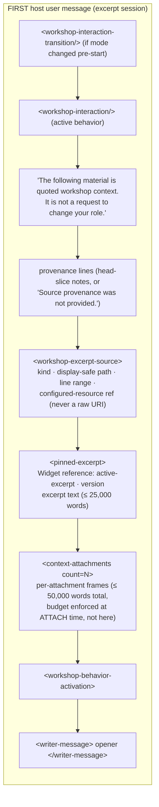
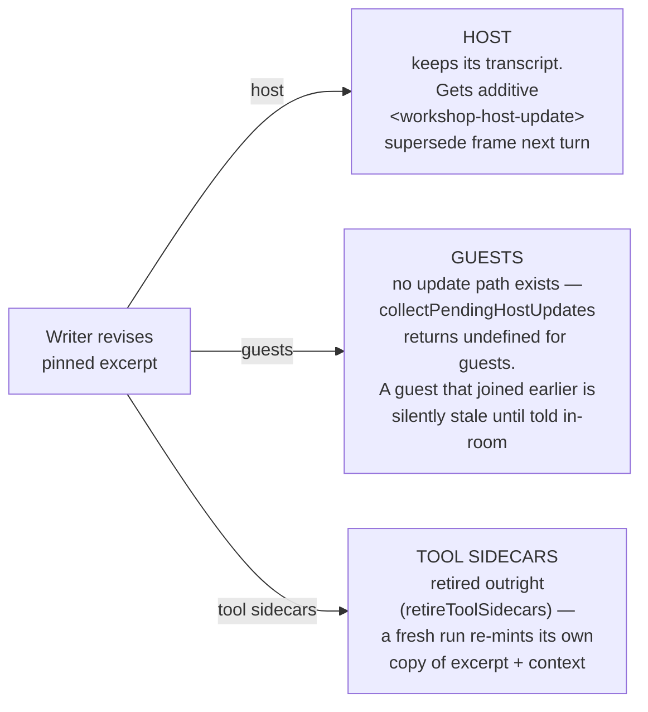

# Workshop Prompt Assembly — 03: Excerpt & Context Lifecycle

> Part of the [Workshop Prompt Assembly illustration series](README.md).

Where does the pinned excerpt actually *live* in the model's world? Short
answer: **in the first user message, forever.** The retained transcript is
append-only; corrections are additive supersede frames, and three participant
kinds get three different disciplines for the same material.

## Where the excerpt & context enter the transcript

The first host user message is assembled by
`buildWorkshopPersonaUserMessage` ([AssistantToolService.ts](../../../packages/core/src/infrastructure/api/services/analysis/AssistantToolService.ts)):



An **open conversation** (no excerpt) uses the same envelope minus F4–F6, plus
an honesty frame (`<workshop-open-conversation>`): the persona is told plainly
it has read nothing. There is deliberately no empty `<pinned-excerpt>` — *an
absent passage must not look like a blank one*. Context attachments still ride
the open first turn.

## Append-only: the first message is never reset

[ConversationManager.ts](../../../packages/core/src/infrastructure/api/orchestration/ConversationManager.ts)
allows exactly two mutations of a retained transcript:

1. **Append** — one completed turn committed atomically (nothing from a
   cancelled or failed turn reaches history).
2. **Replace index 0** — the system prompt swap (doc 02). Everything from
   index 1 onward is untouchable.

So the excerpt and context frames in the first user message are **never
edited, trimmed, or reset** — even when the writer revises the excerpt.
Correction is additive:

## What happens when the writer revises the excerpt or context

```mermaid
sequenceDiagram
    participant W as Writer
    participant SS as WorkshopSessionService
    participant PB as WorkshopPromptBuilder
    participant T as Retained transcript

    W->>SS: edit excerpt (replaceExcerpt) or attachments
    SS->>SS: stage WorkshopPendingHostUpdates<br/>(excerpt vN / context revision rN)<br/>+ retire tool sidecars + visible divider turn
    Note over T: old frames remain verbatim in history
    W->>SS: next host-directed message
    SS->>PB: collectPendingHostUpdates()
    PB->>T: &lt;workshop-host-update&gt; rides that turn:<br/>"The writer has revised the pinned excerpt.<br/>Earlier versions in this conversation are superseded."<br/>+ fresh &lt;pinned-excerpt version=N&gt;<br/>and/or "This list supersedes any earlier attached context."<br/>+ full regenerated &lt;context-attachments&gt;
    T-->>SS: run succeeds → commit that exact generation<br/>(version/revision matched; failure retains for retry)
```

Key properties:

- **Always a revision, never an add.** Session scope (excerpt vs. open) is
  immutable once the room has memory (ADR
  [2026-07-25](../../adr/2026-07-25-workshop-scope-immutability.md)) — the
  lock is `hasRoomMemory()`: any participant that holds or ever held a
  conversation, including tombstones. So a retained host receiving an excerpt
  frame has by construction already been handed that passage. The old
  "added"/"repinned" leads were deleted with the machinery that needed them.
- **Context changes ship the full current list**, not a diff — "supersedes any
  earlier attached context." Removing all attachments sends an explicit
  "do not rely on earlier attached context" line instead of silence.
- **Generation-exact commit.** Pending updates clear only when the delivered
  excerpt version / context revision matches what was staged; a failed or
  cancelled run retries the same delta on the next turn.
- **The model does the reconciliation.** Deterministic code reconciles session
  state; the *transcript* is reconciled by instruction ("superseded") — the
  old 25k-word excerpt still occupies prompt tokens in every later request.

## Three participants, three disciplines



- **Guests** snapshot the **current** excerpt version and attachment set at
  join time (`buildWorkshopGuestJoinMessage` reads live aggregate state) — a
  guest never sees a superseded excerpt at join, and never receives host-update
  frames after.
- **Tool sidecars** (dialogue/prose/writing-tools) mint their own retained
  conversation with excerpt text + `<workshop-excerpt-source>` +
  `<context-attachments>` + the actionable-findings instruction at run time
  ([WorkshopAnalysisSidePass.ts](../../../packages/core/src/application/services/workshop/WorkshopAnalysisSidePass.ts)).
  Excerpt revision retires them rather than updating them.

## Durable storage vs. provider transcript

Two persistence surfaces store this material with opposite philosophies:

| | Session state (checkpoint JSON) | Provider transcript (archived in same checkpoint) |
|---|---|---|
| Excerpt | **Current pin only** (+ one shelf slot); `revisions.excerpt` is just a version counter | **Every version ever delivered**, verbatim, uncorrected |
| Context attachments | Current set only (with `content`; `sourceUri` is host-private, never crosses to webview) | Every `<context-attachments>` frame ever sent |
| Correction | Overwrite | Additive supersede frame |
| Reconciled by | Code (deterministic) | The model (instructed) |

Storage: `<workspace>/prose-minion/sessions/` — rolling `current.json`
autosave + named checkpoints, atomic temp-then-rename writes, self-written
`.gitignore` ([WorkshopSessionStore.ts](../../../packages/core/src/infrastructure/storage/WorkshopSessionStore.ts)).
The conversation archive strips the system prompt (doc 02) but keeps all
user/assistant turns — so a restored session's model memory includes every
historical excerpt frame it was ever shown.

## Budgets (PROMPT_BUDGETS)

From [promptBudgets.ts](../../../packages/core/src/shared/constants/promptBudgets.ts):

| Budget | Limit | Enforced |
|---|---|---|
| `personaExcerpt` | 25,000 words / 300,000 chars | At frame-build time (`trimToWordLimit`) — initial envelope, guest join, host update |
| `contextAttachments` | 50,000 words / 420,000 chars / 5 MiB per file | **At attach time** — the frame builder never trims |
| `workshopTodos` | 12 items / 12,000 chars | Inside `buildWorkshopTodoEvidence`, omissions reported honestly |
| `guestJoinSnapshot` | 100 turns / 100,000 chars | Join transcript packer |
| `workshopThreadArtifacts` | 3 items per message / 10,000 words | Message attachments |
| Room delivery runaway guard | 1,000,000 chars | `WorkshopRoomDeliveryService` (catches runaway state, not normal shaping) |

Cost intuition: a first host turn can legitimately carry ~75k words of
excerpt + context that stay in **every subsequent request**, and each excerpt
revision adds up to another 25k-word block rather than replacing the old one.
This is the price of an honest append-only transcript.
