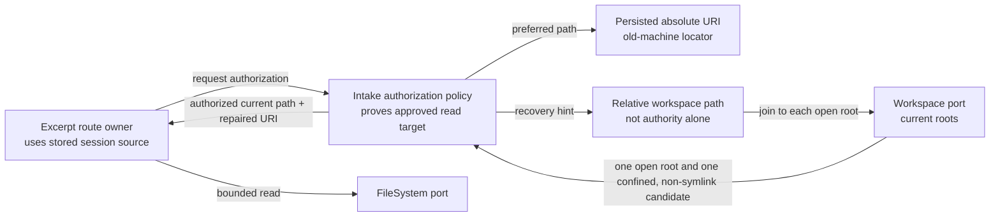
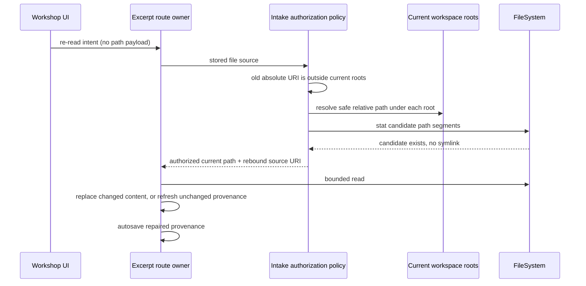

# Portable Workshop excerpt re-read

**Date:** 2026-08-31
**Status:** Approved for implementation
**Decision owner:** Okey Landers
**Prepared by:** Ada Forge
**Scope:** File-backed Workshop excerpts resumed under a different workspace root
**Branch:** `fix/workshop-portable-excerpt-reread`
**Audience and reading budget:** Maintainer, implementer, security reviewer; 30 seconds / 2 minutes / 10 minutes
**Implementation gate:** Open

## 0. Change Card — 30 seconds

### Change thesis

> Because a persisted excerpt's absolute `sourceUri` becomes stale when its
> workspace moves to another computer, change re-read authorization to recover
> an unambiguous current-workspace candidate from its display-safe relative
> path, while preserving containment, symlink, URI, catalog, and no-read-on-
> refusal invariants, so resumed sessions can re-read the same workspace file.

### Architecture moves

| Move | Before | After | Why now | Confidence |
|---|---|---|---|---|
| 1 | Absolute URI is the only workspace locator | Exact URI remains first choice; a stale URI may fall back to a confined relative candidate | Cross-machine resume exposed the portability gap | High |
| 2 | Relative path is display-only | Relative path is a recovery hint, never authority by itself | Current workspace plus containment supplies authority | High |
| 3 | First matching workspace wins | Recovery requires exactly one open workspace root and one verifiable candidate | The persisted display path carries no multi-root identity | High |
| 4 | Successful re-read preserves stale URI | Recovery returns a current URI; unchanged content refreshes host-private provenance without minting a passage revision | The next autosave repairs provenance naturally | High |

### Scope and highest risks

| Affected boundary | Why affected | Highest failure mode | Risk |
|---|---|---|---|
| Workspace authorization | It decides whether disk I/O may occur | Traversal or symlink escapes the workspace | High |
| Persisted provenance | Old absolute paths are machine-specific | A session binds to the wrong same-named file | High |
| Multi-root workspaces | Relative names need a root | Silent selection of one of two valid files | High |
| Configured resources | External paths have a separate authority | Workspace recovery weakens external-file policy | Moderate |

### Human decisions required

No additional decision is required. The user's report establishes that a
workspace-relative excerpt is intended to follow the opened project between
computers. External picker files remain non-portable without a fresh gesture.

### Gate

**State:** `APPROVED`
**Blockers:** None. No persisted schema change is required.

## 1. Architecture Delta Map — 2 minutes

### 1.1 Affected tree before

```text
WorkshopExcerptScopeHandler
└── WorkshopContextIntakeService.authorizeExcerptReread
    ├── persisted sourceUri -> absolute path
    ├── current workspace containment
    └── exact configured-catalog match
```

### 1.2 Target tree

Legend: `[+]` add · `[~]` modify · `[=]` unchanged

```text
[~] WorkshopExcerptScopeHandler
└── [~] WorkshopContextIntakeService.authorizeExcerptReread
    ├── [=] persisted sourceUri -> preferred absolute path
    ├── [=] current workspace containment + symlink validation
    ├── [+] stale URI -> safe relative-path candidate discovery
    ├── [+] single-root recovery rule
    └── [=] exact configured-catalog match for external paths
[~] WorkshopSessionService / WorkshopPassageScope
    └── [+] refresh host-private file provenance without a content revision
[~] WorkshopRoutes.excerptScope.test.ts
[~] WorkshopContextIntakeService.test.ts
```

### 1.3 Responsibility ledger

| Module / file | Role | Responsibility before | Responsibility after | Ownership delta | Evidence |
|---|---|---|---|---|---|
| `WorkshopContextIntakeService.ts` | Host authorization policy | Prove persisted URI belongs to an approved boundary | Also recover a moved workspace source without weakening that proof | Relative recovery enters the existing policy owner | `authorizeExcerptReread()` lines 369–417 |
| `WorkshopExcerptScopeHandler.ts` | Route owner | Ask for authorization, read, replace | Refresh rebound provenance when bytes are unchanged | Coordinates a host-private maintenance mutation | `handleRereadExcerpt()` lines 229–289 |
| `WorkshopSessionService.ts` / `WorkshopPassageScope.ts` | Aggregate facade / passage owner | Own excerpt content, version, and provenance | Add a version-guarded provenance refresh that does not mint a content revision | Narrow maintenance operation enters the aggregate | `replaceExcerpt()` delegation and passage state |
| Route/service tests | Fitness witnesses | Cover traversal, URI, symlink, catalog policy | Add cross-machine, ambiguity, and invalid-hint cases | Verification only | Existing re-read suite |

### 1.4 Structural view

**Question answered:** Where does authority come from after the old URI fails?
**Scope:** One file-backed re-read.
**Abstraction:** Application services and platform ports.
**Legend:** Solid arrows are existing calls; the recovery branch is proposed.



### 1.5 Representative runtime flow

**Scenario:** Resume on another computer and click **Re-read from file**.



**Notable change:** The webview still cannot nominate a re-read target; the
handler ignores message payload and authorizes the host-stored source.

### 1.6 Blast-radius summary

| Dimension | Direct | Indirect | Main failure | Witness | Risk |
|---|---|---|---|---|---|
| Structure | Policy, handler, passage owner | Existing facade | Ownership leakage | Diff review | Moderate |
| Runtime | Authorization branch | Replacement/autosave | Wrong file chosen | Route tests | High |
| Contract | Returned source URI may change | Persisted checkpoint self-repairs | Stale URI retained | State assertion | Moderate |
| Data/state | No schema change | Next autosave writes current URI | Existing checkpoints rejected | Persistence regression suite | Moderate |
| Security | Relative recovery | Workspace file exposure | Traversal/symlink escape | Negative tests | High |
| Tests/docs | Two suites + this runway | None | False confidence | Targeted Jest | Low |

## 2. Reviewer Packet — 10 minutes

### 2.1 Working definition and real job

`WorkshopContextIntakeService` is the host-owned intake and authorization
boundary. For re-read, its job is to turn persisted provenance into one current,
approved filesystem target before any content read. It does not own session
mutation, UI messages, or checkpoint migration.

### 2.2 Declared intent, observed behavior, and open meaning

| Topic | Evidence |
|---|---|
| [Declared] Persisted re-read must fail closed before `readFile` | `.todo/tech-debt/2026-08-05-workshop-excerpt-source-uri-confinement.md:21–27` |
| [Observed] Current authorization recognizes only the persisted absolute URI or an exact catalog path | `WorkshopContextIntakeService.ts:369–417` |
| [Observed] `relativePath` is described as a workspace-relative display path | `shared/types/messages/workshop/session.ts:181–194` |
| [Observed] The handler uses the host aggregate's source, not message payload | `WorkshopExcerptScopeHandler.ts:229–249` |
| [Inferred] A moved project preserves relative identity but invalidates absolute identity | Reported cross-machine reproduction plus current path comparison |
| [Unknown] Whether two open workspace roots contain the same relative file | Must be detected at authorization time, not assumed |

### 2.3 Contracts and invariants

| Contract / invariant | Current owner | Target owner | Change? | Failure if broken | Witness |
|---|---|---|---|---|---|
| No disk read outside current workspace or exact catalog | Intake service | Same | No | Host file disclosure | Existing traversal/catalog tests |
| No symlink component in workspace reads | Intake service | Same | No | Boundary escape | Existing and recovered-path symlink tests |
| Re-read target comes from host session, not webview payload | Handler | Same | No | Forged target mutation | Route flow inspection |
| Multi-root recovery is refused | Absent | Intake service | Yes | Wrong manuscript edited/read | New multi-root test |
| Successful recovery repairs `sourceUri` | Absent | Intake service + passage aggregate | Yes | Every reread relies on fallback | New state assertion |
| Provenance-only repair does not mint a content revision | Absent | Passage aggregate | Yes | False revision/history event | New unchanged-content test |
| Existing checkpoint schema remains readable | Codec | Same | No | Session loss | No shape change; persistence tests |

### 2.4 Negative space

| Generic owner | May know | Must not know | Next-feature edit surface | Verdict |
|---|---|---|---|---|
| Intake authorization policy | URI, roots, relative path, catalog, symlinks | Session UI, Jill, chapter naming | New authority kind would extend this policy deliberately | Pass |
| Excerpt route owner | Authorized target and replacement/provenance refresh | How moved paths are recovered | None for another workspace move | Pass |

### 2.5 Multidimensional blast radius

| Dimension | Direct impact | Indirect path | Failure modes | Detection | Confidence | Risk |
|---|---|---|---|---|---|---|
| Structural | Policy helper plus narrow aggregate operation | Handler consumes same result union | Split authority ownership | Code review | High | Moderate |
| Runtime | Fallback after old URI fails | Read and replace existing flow | Wrong root, missing path, symlink | Route tests | High | High |
| Contract | Authorized source may carry new URI | Autosave persists it | Unexpected version/schema churn | Equality and persistence tests | High | Moderate |
| Data / persistence | Existing fields gain portable semantics | Old V1/V2 sessions benefit immediately | Decoder incompatibility | No shape edit; codec suite | High | Low |
| Operational / security | Workspace boundary broadens from exact old URI to current relative identity | File can enter prompt after authorization | Traversal or ambiguity | No-read assertions | High | High |
| Verification | Add use/change/failure cases | Full package suite | Mock stats hide file absence | Seed exact candidates | Moderate | Moderate |
| Historical | Extends August confinement fix | Must preserve its completion criteria | Security regression | Re-run original suite | High | High |
| Evolution | Same recovery works for future machines | Multi-root identity pressure remains explicit | Guessing by root order | Ambiguity refusal | High | Moderate |

### 2.6 Quality scenarios

| Type | Source | Stimulus | Environment | Artifact | Expected response | Response measure |
|---|---|---|---|---|---|---|
| Use | Writer | Re-read after moving repository | One open root, matching relative file | Stored excerpt | Read current file and repair URI | One read at current absolute path; version increments if changed |
| Security | Compromised checkpoint | `../private.md` hint | Old URI outside root | Authorization | Refuse before read | `readFile` call count zero |
| Failure | Writer | Re-read moved source | Multiple open roots | Authorization | Refuse as ambiguous | Error plus zero reads |
| Security | Workspace layout | Relative target crosses symlink | One matching root | Authorization | Refuse before read | Symlink error plus zero reads |
| Compatibility | Existing session | Open old checkpoint | Current released schema | Codec | No migration needed | Existing persistence suite stays green |

**Sensitivity points:** Single-root rule and relative-path validation.
**Tradeoff points:** Portability improves while path identity becomes relative to
the currently opened project; ambiguity refusal preserves correctness over
convenience.
**Risk themes:** Never let a display hint become authority without current-host
containment and filesystem verification.

### 2.7 Alternatives and tradeoffs

| Alternative | Architecture shape | Benefits | Costs / risks | Verdict |
|---|---|---|---|---|
| Minimal patch | Join `relativePath` to the first workspace root | Small | Root-order guessing; traversal and symlink risk | Reject |
| Recommended | Existing policy recovers under one open root, returns a repaired URI, and the aggregate refreshes host-private provenance | No schema migration; fail-closed; self-healing without a false revision | A little policy and aggregate complexity | Adopt |
| More generalized | Add persisted locator union and schema V3 migration for workspace/catalog/external identities | Explicit long-term model | Unnecessary migration and broader change for one established recovery case | Defer until external/configured portability is requested |

### 2.8 Principle and quality tensions

| Principle / quality | Status | Support | Tension / violation | Consequence | Witness | Confidence |
|---|---|---|---|---|---|---|
| Responsibility / cohesion | Strong | Recovery stays in authorization service | Helper growth | One policy owner remains | File-level diff | High |
| Naming truthfulness | Acceptable | `relativePath` remains a hint plus display value | Type docs currently say only display | Update docs | Type review | High |
| Dependency direction | Strong | Core uses `Workspace` and `FileSystem` ports | None | Host agnostic | Architecture tests | High |
| Change isolation | Strong | Handler/result union remain stable | None | Small blast radius | Targeted tests | High |
| Reliability / security | Tension | Current-host proof replaces stale-host identity | Same relative path can denote different content | Ambiguity and symlink refusal; explicit writer-opened workspace | Route tests | High |

### 2.9 Ranked findings

| ID | Severity | Finding | Evidence | Smallest fix | Blocks |
|---|---|---|---|---|---|
| F1 | High | Machine-specific absolute provenance makes legitimate resumed workspace reads fail | Authorization lines 369–417 and cross-machine reproduction | Safe current-root recovery | Merge |
| F2 | High | Naive relative fallback could escape or select the wrong root | Existing confinement criteria lines 21–27; multi-root possibility | Validate hint and segments; require one root; recheck containment and symlinks | Merge |
| F3 | Medium | An unchanged recovered read must repair provenance without inventing a passage revision | Handler currently returns early on equal fingerprints | Add version-guarded host-private provenance refresh | Merge |

**What survived.** The route's stored-source ownership, the configured-resource
exact-match rule for external files, the symlink refusal, the bounded loader,
and the current persisted schema all remain correct and need no redesign.

### 2.10 Implementation slices

| Slice | Purpose | Files / owners | Behavior change | Verification | Rollback seam |
|---|---|---|---|---|---|
| 0 | Characterize cross-machine failure | Route/service tests | Red test only | Targeted Jest | Remove test |
| 1 | Add confined single-root recovery | Intake service | Authorize one current candidate | Targeted Jest | Revert helper/branch |
| 2 | Add provenance-only self-healing | Passage owner, facade, handler | Persist current URI without a content revision | Targeted Jest | Revert narrow method/branch |
| 3 | Prove regressions | Route tests + docs | Preserve all refusal behavior | Targeted + full validation | Revert branch |

### 2.11 Coordination map

| Workstream | Files owned | Shared lock points | Merge order | Owner |
|---|---|---|---|---|
| Portable reread | Intake service, excerpt route tests, runway | Existing mixed worktree items are excluded | Single branch | Ada Forge |

### 2.12 Unknowns that can reverse the decision

None. Cross-platform separator normalization may affect convenience but does
not reverse the architecture; unsupported or ambiguous forms fail closed.

## 3. Self-review and Re-plan Verdict

### 3.1 Contradictions found

| Artifact pair | Contradiction | Resolution |
|---|---|---|
| Initial persistence concern ↔ target tree | A schema migration seemed necessary, but current fields already preserve the relative locator | Keep schema V2; repair URI after successful read |
| Portability ↔ security direction | The debt note says not to trust `relativePath` as proof | Use it only to propose candidates; current roots, containment, unique existence, and no-symlink checks provide proof |
| Flow ↔ catalog policy | Relative fallback could accidentally replace external catalog identity | Try exact current URI/catalog policy first; fallback only into current workspace boundaries |
| Flow ↔ aggregate contract | Unchanged bytes previously returned before repaired provenance could enter the aggregate | Add a version-guarded provenance-only refresh and autosave |

### 3.2 Prospective failure review

| Failure story | Cause | Prevention / witness |
|---|---|---|
| Wrong chapter from another root is loaded | First-root selection | Refuse portable recovery whenever multiple roots are open |
| `../` reads a private file | Relative hint treated as path authority | Segment and containment rejection test |
| Symlink points outside root | Only lexical containment checked | Stat every recovered path segment |
| Session rereads but stays machine-bound | Equal content returns before persistence | Assert URI repair with unchanged version and no revision turn |

### 3.3 Reproduction test

**Plausible next variant:** Repository moved to a third computer.
**Files it adds:** None.
**Shared files it must edit:** None.
**Existing feature files it must edit:** None.
**Verdict:** The repaired relative identity repeats without migration or new
feature code.

### 3.4 Re-plan Verdict

**Verdict:** `REFINED`

**Initial plan:**

1. Add an explicit persisted workspace locator.
2. Migrate old checkpoints and authorize from that locator.

**Final plan:**

1. Keep the released checkpoint grammar and treat its normalized relative path as a recovery hint.
2. Authorize a current, confined, non-symlink candidate only when one workspace root is open.
3. Refresh rebound host-private provenance without minting a passage revision, then autosave it.

**What changed and why:** Inspection showed the existing `relativePath` already
contains the needed stable identity, while the passage aggregate can refresh
host-private provenance without manufacturing a content revision. A schema
migration would add risk without adding proof.
**Remaining uncertainty:** Cross-OS filename separator edge cases fail closed.

### 3.5 Implementation gate

| Gate condition | Pass / fail | Evidence |
|---|---|---|
| No unaccepted critical unknowns | Pass | None identified |
| Contract consumers/migration/tests identified | Pass | Handler is sole consumer; no migration |
| Persistence failure and rescue defined | Pass | Existing session remains intact on refusal; successful replacement autosaves |
| Runtime flows owned and testable | Pass | Intake policy + route suite |
| Negative-space and reproduction tests pass | Pass | Authorization stays in intake; passage mutation stays in aggregate |
| Tree/responsibilities/contracts/slices agree | Pass | Self-review above |
| Human decisions and coordination assigned | Pass | User requested implementation on new branch |

**Final gate:** `OPEN`

## 4. Evidence Appendix — details on demand

### 4.1 File cards

#### `packages/core/src/application/services/workshop/WorkshopContextIntakeService.ts` — `[~]`

- **Layer / role:** Application service; host authorization policy.
- **Primary responsibility:** Bound file intake and prove re-read targets.
- **Ownership delta:** Adds portable single-workspace candidate recovery.
- **Pattern:** Policy object — centralizes multiple authority proofs at the cost of explicit branching.
- **Critical entry point:** `authorizeExcerptReread()`.
- **Dependencies:** `Workspace`, `FileSystem`, configured-resource provider.
- **State / contract effects:** Returns a repaired source; no schema change.
- **Verification:** Service and composed-route tests.
- **Size:** 521 LOC before; estimated +40–70 LOC.
- **Evidence / confidence:** Direct code inspection; high.

#### `packages/core/src/__tests__/application/handlers/domain/workshop/WorkshopRoutes.excerptScope.test.ts` — `[~]`

- **Layer / role:** Composed route integration witness.
- **Primary responsibility:** Prove authorization, read, and aggregate mutation together.
- **Ownership delta:** Adds cross-machine and refusal scenarios.
- **Verification:** Jest.
- **Evidence / confidence:** Existing security suite; high.

#### `packages/core/src/application/services/workshop/session/WorkshopPassageScope.ts` — `[~]`

- **Layer / role:** Application aggregate component; passage-state owner.
- **Primary responsibility:** Own excerpt content, version, source, and scope.
- **Ownership delta:** Adds version-guarded host-private provenance refresh.
- **State / contract effects:** Changes source metadata only; no passage revision.
- **Verification:** Aggregate and composed-route tests.
- **Evidence / confidence:** Direct state ownership; high.

### 4.2 Method inventory

| File | Method | Current job | Proposed job | State effects | Test |
|---|---|---|---|---|---|
| Intake service | `authorizeExcerptReread` | Authorize old URI | Also recover safe current candidate | Returned source URI may change | Route suite |
| Intake service | proposed candidate helper | Absent | Validate and locate one single-root workspace candidate | None | Service/route suite |
| Intake service | `validateWorkspaceRereadPath` | Reject symlink/unverifiable path | Reused unchanged or factored for candidate classification | None | Existing + new tests |
| Passage scope | proposed provenance refresh | Absent | Replace file source metadata when expected version still owns the slot | Host-private source only | Aggregate/route suite |

### 4.3 Genealogy and precedent

| Evidence | History | Lesson | Confidence |
|---|---|---|---|
| Commit `17736164` | Added fail-closed reread authorization | Preserve its negative tests and ownership | High |
| August source-URI debt note | Explicitly rejects trusting webview claims | Relative recovery must be host-proven | High |
| Current session V1→V2 migration | Released codec migrations are deliberate | Avoid schema churn when current grammar suffices | High |

### 4.4 Fitness witnesses

| Rule | Automated witness | Failure signal |
|---|---|---|
| Moved workspace file rereads and self-heals | New composed-route test | No read/current URI mismatch or false version bump |
| Traversal never reads | Existing + new relative traversal test | `readFile` called |
| Symlink never reads | Existing + recovered-path test | `readFile` called |
| Ambiguity never guesses | New multi-root test | Any read occurs |
| External policy remains exact | Existing catalog/case tests | Outside file read |

### 4.5 ADR seed

**Context:** Absolute file URIs are valid authority locators but poor portable
identities for persisted workspace content.
**Decision candidates:** First-root join; confined single-root recovery; schema V3
locator union.
**Recommended decision:** Confined single-root recovery using the existing
relative path as a hint, followed by canonical URI repair without a content
revision.
**Consequences:** Same-project sessions become portable; ambiguous or external
files continue to require explicit resolution.
**Unresolved questions:** Whether a future product flow should explicitly
rebind external picker files.

## 5. Reader Terms Appendix — fast reference

### 5.1 Technical terms

| Term | Local meaning | Why it matters | Status / evidence |
|---|---|---|---|
| Authorization policy | The intake service method that proves a disk target belongs to an approved boundary | It is the only gate before reread I/O | Current |
| Recovery hint | Persisted relative text used to propose, but never independently authorize, a target | Separates portable identity from authority | Proposed |
| Canonical URI repair | Replacing the old-machine URI with the authorized current file URI after a successful reread | Makes the checkpoint self-healing | Proposed |
| Fail closed | Refuse without reading when safety or identity is uncertain | Preserves the security enhancement | Current |

### 5.2 Domain terms

| Term | Local meaning | Why it matters | Status / evidence |
|---|---|---|---|
| File-backed excerpt | The one pinned passage whose source kind is `file` | Only this kind exposes **Re-read from file** | Current |
| Configured resource | A file freshly enumerated by the configured context catalog | It is the separate approved boundary for external files | Current |
| Resumed session | A durable Workshop room hydrated on extension startup or explicit open | It carries the stale absolute URI across computers | Current |
