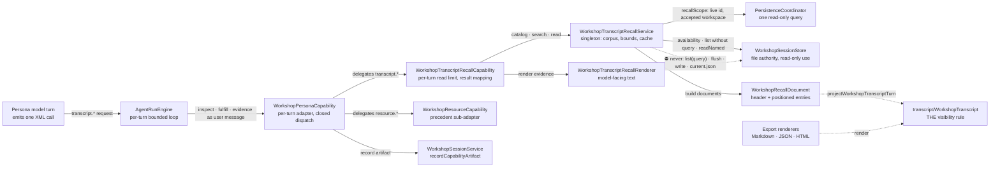
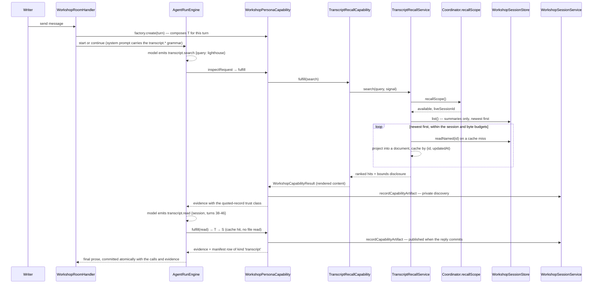

# Workshop Session Recall — Architecture Change Runway

**Date:** 2026-10-05
**Status:** Ready for review
**Decision owner:** Okey Landers
**Prepared by:** Ada Forge (Claude Code)
**Scope:** Workshop persona capabilities (contract, codec, adapter), a new read-only recall service over saved sessions, the transcript projection's home, four persisted capability/manifest allowlists, persona system prompts, and the composition root. No new IPC route.
**Branch / issue / epic:** `claude/practical-ritchie-rx9n4t` · proposed epic [`epic-workshop-session-recall-2026-10-05`](../../.todo/epics/epic-workshop-session-recall-2026-10-05/README.md) · Proposed ADR [2026-10-05 — Workshop Session Transcript Recall](../adr/2026-10-05-workshop-session-transcript-recall.md)
**Audience and reading budget:** Decision owner and implementer who have not traced how capability artifacts, the session store, and the transcript projection meet. 30 seconds (§0), 2 minutes (§1), 10 minutes (§2–3).
**Implementation gate:** Conditional (§3.5)

Evidence labels: **[Declared]** ADR/requirement · **[Observed]** current code or tests · **[Inferred]** reasoned link · **[Unknown]** unsettled · **[Proposed]** does not exist yet · **[Analogy]** comparison, not proof. Terms are defined in the [Reader Terms Appendix](#5-reader-terms-appendix--fast-reference).

---

## 0. Change Card — 30 seconds

### Change thesis

> Because a Workshop persona cannot consult any earlier saved session — and the only cross-session search that exists (the session browser's `list(query)`) greps the serialized checkpoint, provider archives and attachment bodies included — add a read-only persona capability family, `transcript.catalog | transcript.search | transcript.read`, that searches and reads the **visible transcript projection** of saved sessions, while preserving one projection as the only definition of "visible", the session store as the only file authority, the live room's isolation (no flush, no write, never itself), and the per-turn capability budget, so that personas can honestly look back at past conversations now and the future memory feature inherits one visibility contract instead of inventing its own.

### Architecture moves

| # | Before | After | Why now | Confidence |
|---|---|---|---|---|
| 1 | The projection lives in `export/` and serves export only | `transcript/WorkshopTranscript.ts`, with a per-turn projector that export and recall both render | A second consumer makes "export" a naming lie; recall needs ledger positions | High |
| 2 | Cross-session reading exists only as browser search over the whole serialized file | `WorkshopTranscriptRecallService`: a read-only corpus over `store.list()` + `store.readNamed()`, projected documents, bounded ranked search, windowed reads, a cache keyed by `(sessionId, updatedAt)` | The browser path reads host-private bodies, and its coordinator wrapper flushes the live room | High |
| 3 | Six persona operations | Nine: `transcript.catalog/search/read`, delegated to a `WorkshopTranscriptRecallCapability` sub-adapter exactly as `resource.*` is delegated to `WorkshopResourceCapability` | Reuses a proven seam; keeps turn addressing and record framing out of the resource family | High |
| 4 | Family inferred by `startsWith` in four places; evidence framed in two trust classes | One exhaustive operation→family helper; a third trust class, "quoted record" | A new family otherwise compiles and is labeled "Writer's Dictionary" in the thread *and* in guests' prompts | High |
| 5 | Factory built before store and coordinator; live-room identity private | Store → coordinator → recall service → factory; the coordinator answers one read-only `recallScope()` | Recall must exclude the live room and honor the accepted workspace without reaching into coordinator state | Medium |

### Scope and highest risks

| Affected boundary | Why affected | Highest failure mode | Risk |
|---|---|---|---|
| Visibility (projection) | Recall output must equal what the thread shows | A body the thread hides (attachment text, widget payload, capability evidence, or the summary `preview`) reaches a persona | HIGH |
| Live room / persistence coordinator | Recall reads the directory the room autosaves into | A persona search flushes or writes a checkpoint mid-run, or recalls the live room's own stale copy | HIGH |
| Persisted session codec | Operation, artifact, publishable, and context-source values are closed allowlists, checked on load **and** save | A room holding a recall artifact cannot save; an older build cannot open a newer session | HIGH (forward-only by design) |
| Extension-host CPU and memory | Search parses saved session JSON on demand | A cold search over large sessions stalls the host | MODERATE — unknown U1 |
| Prompt honesty | Personas are currently told there is no durable history | A persona claims to "remember," claims presence in a session it never joined, or obeys a past request | MODERATE |

### Human decisions required

| # | Decision | Options | Recommendation | Needed by |
|---|---|---|---|---|
| D1 | Family shape and name | (a) dedicated `transcript.*`; (b) synthetic `sessions` resource group; (c) `session.*` or `memory.*` names | (a) — §2.7 | Slice 3 |
| D2 | Recallable corpus | (a) named saved sessions, live room excluded; (b) also the live room's earlier turns; (c) also the rolling `current.json` | (a); (b) belongs with context compaction | Slice 2 |
| D3 | Writer control in v1 | (a) none beyond visible artifacts; (b) a global on/off setting; (c) per-session exclusion | (a) for v1; (c) arrives with memory controls | Slice 4 |
| D4 | Visibility edge cases | Context-attachment **labels** in the session header; private instrument exchanges | Include both as labels and markers only, matching export | Slice 2 |

### Gate

**State:** `READY FOR REVIEW`
**Blockers to implementation:** D1–D4 accepted. U1 measured on a real workspace before Slice 4 enables the prompts.

---

## 1. Architecture Delta Map — 2 minutes

### 1.1 Affected tree before

```text
apps/vscode-extension/src/
└── extension.ts                                   # factory L211 → store L249 → coordinator L254
packages/core/
├── resources/system-prompts/workshop-personas/
│   ├── base.md · guest-base.md                    # enumerate dictionary/resource/analysis only
│   ├── analysis-capability.md                     # stable analysis.run grammar (system prompt)
│   └── interaction-contract.md                    # "Persona improv before durable history"
└── src/
    ├── shared/types/workshopCapabilities.ts       # closed operation + request unions (6 ops)
    ├── shared/types/messages/inferenceContext.ts  # ContextSourceKind (6 kinds)
    ├── shared/types/messages/workshop/session.ts  # WorkshopTurnArtifact union
    ├── shared/constants/
    │   ├── promptBudgets.ts                       # workshopCapability + workshopResource
    │   ├── workshopCapabilityLabels.ts            # family by startsWith (silent fallback)
    │   └── workshopPersonas.ts                    # system-prompt path chain
    ├── infrastructure/api/orchestration/
    │   ├── AgentRunContracts.ts                   # CapabilityDeliveredSource kinds (3)
    │   └── ConversationManager.ts                 # archive context-source kind allowlist
    ├── infrastructure/storage/
    │   ├── WorkshopSessionStore.ts                # list(query) walks workshop + conversations
    │   └── WorkshopSessionSearchIndexV1.ts        # .summary.json metadata index
    ├── application/services/workshop/
    │   ├── WorkshopCapabilityXmlCodec.ts          # strict single-root decoder + dynamic contract
    │   ├── WorkshopPersonaCapability.ts           # per-turn adapter; composes resource sub-adapter
    │   ├── WorkshopResourceCapability.ts          # resource.catalog/search/read
    │   ├── WorkshopRoomAudience.ts                # PUBLISHABLE_CAPABILITY_OPERATIONS
    │   ├── WorkshopSessionService.ts              # recordCapabilityArtifact (label by prefix)
    │   ├── WorkshopSessionStateV1Shape.ts         # persisted enums: operation, artifact, kind
    │   ├── WorkshopSessionPersistenceCoordinator.ts # private live identity; list() flushes
    │   └── export/
    │       ├── WorkshopTranscript.ts              # THE visibility projection
    │       └── WorkshopTranscript{Markdown,Json,Html,Description,ExportService}.ts
    └── presentation/webview/components/
        ├── workshop/WorkshopTurnBubble.tsx        # resource-specific truncation copy
        └── shared/ContextBudget.tsx               # kindLabel per ContextSourceKind
```

### 1.2 Target tree

Legend: `[+]` add · `[~]` modify · `[>]` move/rename · `[-]` remove · `[=]` important unchanged boundary

```text
apps/vscode-extension/src/
└── [~] extension.ts                     # store → coordinator → recall service → factory (+1 dep)
packages/core/
├── resources/system-prompts/workshop-personas/
│   ├── [+] transcript-recall-capability.md    # stable transcript.* grammar + honesty rules
│   ├── [~] base.md · guest-base.md            # enumerate saved-session recall
│   └── [~] interaction-contract.md            # a looked-up record is not memory
└── src/
    ├── [~] index.ts                            # export WorkshopTranscriptRecallService
    ├── shared/types/
    │   ├── [~] workshopCapabilities.ts         # + 3 operations, 3 request shapes, turn ranges
    │   ├── messages/[~] inferenceContext.ts    # + 'transcript' source kind
    │   └── messages/workshop/[~] session.ts    # + transcript_catalog | _search | _read artifacts
    ├── shared/constants/
    │   ├── [~] promptBudgets.ts                # + workshopTranscriptRecall block
    │   ├── [~] workshopCapabilityLabels.ts     # exhaustive family helper; "Session Recall"
    │   └── [~] workshopPersonas.ts             # chain inserts transcript-recall-capability.md
    ├── infrastructure/api/orchestration/
    │   ├── [~] AgentRunContracts.ts            # + 'transcript' delivered-source kind
    │   └── [~] ConversationManager.ts          # archive kind allowlist + 'transcript'
    ├── infrastructure/storage/
    │   └── [=] WorkshopSessionStore.ts         # read-only use: availability · list() · readNamed
    ├── application/services/workshop/
    │   ├── [~] WorkshopCapabilityXmlCodec.ts   # + 3 closed request shapes, rejection reasons
    │   ├── [~] WorkshopPersonaCapability.ts    # compose recall sub-adapter; 3rd trust class
    │   ├── [=] WorkshopResourceCapability.ts   # the precedent; unchanged
    │   ├── [~] WorkshopRoomAudience.ts         # transcript.read publishable (parity: resource.read)
    │   ├── [~] WorkshopSessionService.ts       # artifact mapping; label via family helper
    │   ├── [~] WorkshopSessionStateV1Shape.ts  # accept new operation/artifact/kind values
    │   ├── [~] WorkshopSessionPersistenceCoordinator.ts # + recallScope() (read-only query)
    │   ├── [>] transcript/WorkshopTranscript.ts # moved from export/; + projectWorkshopTranscriptTurn
    │   ├── [~] export/*                         # import path only
    │   └── [+] recall/
    │       ├── [+] WorkshopRecallDocument.ts             # pure: session → header + positioned entries
    │       ├── [+] WorkshopTranscriptRecallSearch.ts     # pure: tokenize, rank, snippet
    │       ├── [+] WorkshopTranscriptRecallRenderer.ts   # pure: model-facing catalog/search/read text
    │       ├── [+] WorkshopTranscriptRecallService.ts    # ports, corpus rules, bounds, cache, cancel
    │       └── [+] WorkshopTranscriptRecallCapability.ts # per-turn sub-adapter
    └── presentation/webview/components/
        ├── workshop/[~] WorkshopTurnBubble.tsx  # family-aware truncation copy; recall metadata rows
        └── shared/[~] ContextBudget.tsx         # kindLabel 'transcript' → "Past session"
```

No new IPC route, no new `CoreServices` field, no new persisted file.

### 1.3 Responsibility ledger

| Module | Role | Before | After | Ownership delta | Pattern / smell | Evidence |
|---|---|---|---|---|---|---|
| `transcript/WorkshopTranscript.ts` | Pure projection | Export's definition of "visible" | Workshop's definition, rendered by export **and** recall | Gains a consumer and a public per-turn projector | `Single source of truth` — one include/omit rule for every reader of past threads; cost: one edit now moves two outputs | `export/WorkshopTranscript.ts:96-149`; ADR 2026-10-05 §2 |
| `WorkshopRecallDocument` | Pure mapper | — | Persisted session → header metadata + entries tagged with ledger positions | New | No meaningful pattern; isolates the header decisions (D4) from the projection | [Proposed] |
| `WorkshopTranscriptRecallSearch` | Pure policy | — | Deterministic ranked lexical matching over documents | New | Strategy-shaped, deliberately **not** an interface: one implementation, closed-registry doctrine | ADR 2026-08-03 §3 |
| `WorkshopTranscriptRecallRenderer` | Pure renderer | — | Model-facing catalog, search, and read evidence within budgets | New | Placement rule from the measurement digest: model audience, so it lives beside the capability, not in webview formatters | ADR 2026-07-29 §3 |
| `WorkshopTranscriptRecallService` | Application service, composition-root singleton | — | Corpus enumeration, live-room exclusion, bounds, document cache, cancellation; returns data, never prose | New | `Consumer-owned ports` (export precedent); smell to avoid: becoming a second persistence coordinator | `WorkshopTranscriptExportService.ts:27-38` |
| `WorkshopTranscriptRecallCapability` | Per-turn sub-adapter | — | Corpus validation, per-turn read limit, mapping service results into `WorkshopCapabilityResult` | New | `Delegation to a family sub-adapter`, mirroring the resource family | `WorkshopPersonaCapability.ts:126-130, 467-470` |
| `WorkshopPersonaCapability` | Per-turn capability adapter over families | Dispatches 6 operations; 2 trust classes | Dispatches 9; 3 trust classes; family helper replaces prefix checks | One delegation branch per closed switch | Closed dispatch; file pressure (782 LOC) | `WorkshopPersonaCapability.ts:255-310, 429-474, 707-724` |
| `WorkshopSessionPersistenceCoordinator` | Persistence transaction owner | Owns the live identity privately | Also answers `recallScope()` (live id + accepted-workspace check) | One read-only query; no new responsibility | Narrow query on a broad facade; the open debt note targets room replacement, not this | `:239-240, :1738-1755`; debt 2026-10-01 |
| `WorkshopSessionStore` | Filesystem authority | Browser list/search, exact reads, writes | Unchanged; recall uses three read methods | None | Repository | `WorkshopSessionStore.ts:190, 303, 322` |
| `workshopCapabilityLabels.ts` | Shared vocabulary | Family by prefix with a silent fallback | One exhaustive `workshopCapabilityFamily(operation)` for the artifact label, `toolLabel`, evidence framing, and bubble copy | Absorbs four scattered prefix checks | Removes a shotgun-surgery smell | `workshopCapabilityLabels.ts:15-19`; `WorkshopSessionService.ts:1418-1429`; `WorkshopPersonaCapability.ts:719-721`; `WorkshopTurnBubble.tsx:214` |

### 1.4 Structural view

**Question answered:** Which components may touch saved session files, and through which seam does visible transcript reach a persona's prompt?
**Scope:** The recall path; existing families appear only where they share a seam.
**Abstraction:** Component (file) level.
**Legend:** solid arrow = call or dependency, labeled with intent · dashed arrow = shared pure rule · ⛔ = a deliberately absent edge.



### 1.5 Representative runtime flow

**Scenario:** In a new open room the writer says, "Pick up the lighthouse idea we landed on last week." **Today** the persona has no path to that conversation: it must ask the writer to paste it, or improvise, which `interaction-contract.md` forbids presenting as memory. **Target:**



**Notable change:** No file is written, the coordinator answers one question, and the live room never appears in its own corpus.

### 1.6 Blast-radius summary

| Dimension | Direct | Indirect | Main failure | Witness | Risk |
|---|---|---|---|---|---|
| Structure | Five new pure/service files; capability adapter, codec, labels | Composition-root order | Recall grows into a second coordinator | Boundary test: no coordinator class import, no store writes from `recall/` | MODERATE |
| Runtime | New per-turn branch; cold parse of saved JSON | Engine rounds shared with other families | Host stall on large corpora | Bounds tests; U1 measurement | MODERATE |
| Contract | +3 operations and request shapes, rejection reasons, prompt grammar | Guests' room frames render `${toolLabel} (report)` | Mislabeled family in thread and prompts | Exhaustive family helper; label tests | MODERATE |
| Data / state | Four persisted allowlists widen | Archive import validation | A room holding a recall artifact cannot save | Round-trip test containing every new value | HIGH |
| Operations / security | In-process reads of other session files | Workspace change; injected text inside past replies | Cross-project recall; a past request obeyed | `recallScope()` tests; escaped evidence; trust class | MODERATE |
| Tests / docs | New suites; existing suites gain cases | `docs/ARCHITECTURE.md:200-203` is already stale | Silent-fallback regressions | Exhaustive switches; prompt sync test | LOW |
| Coordination / evolution | Memory builds on the corpus/document seam | Context-compaction epic plans a persona "release" of agent-fetched evidence | Memory reinvents visibility | ADR invariant: every recall consumer renders the projection | LOW |

---

## 2. Reviewer Packet — 10 minutes

### 2.1 Working definition and real job

**Session Recall** lets a Workshop participant (the host persona or a guest persona) consult the *visible transcript* of the writer's other saved Workshop sessions in the current workspace: list them, search them, and read a whole transcript or chosen turns. It owns which saved sessions are recallable, how a saved session becomes a recall document (header plus projected entries), bounded lexical search, windowed rendering for a model, and the per-turn recall limits.

It does **not** own the definition of "visible" (the projection does), file access or decoding (the store and session codec do), artifact recording, publication, or audience (the session service and audience policy do), the capability loop (the engine does), or any persona memory, summary, or digest (the future memory feature).

### 2.2 Declared intent, observed behavior, and open meaning

| Topic | [Declared] | [Observed] | [Inferred] | [Unknown] |
|---|---|---|---|---|
| How a prior session reaches a new one | A prior transcript is "an ordinary context resource… by host fetch through the existing capability catalog"; never a fork (ADR 2026-07-25, *Alternatives considered*; [feature note](../../.todo/features/feature-prior-conversation-as-resource/README.md)) | No cross-session path exists. Reopening a session restores *that* room (`WorkshopSessionBrowserModal.tsx:233-235`) | The declared **invariant** (read a record; never inherit a history) is load-bearing. The declared **mechanism** ("existing catalog") predates any need to address turns — D1 | Whether "existing capability catalog" meant the resource catalog literally |
| What "visible" means | One projection decides; host-private bodies never enter it (ADR 2026-10-05 §2) | Attachments and widgets as labels, capability artifacts as one-line events, context changes omitted (`export/WorkshopTranscript.ts:124-181`) | This is exactly the requested rule: "filenames and widget names included but no content" | Context-attachment labels are session state, not turns — D4 |
| Existing cross-session search | The browser result "is not a complete grep" (`WorkshopSessionStore.ts:134-139`) | It walks `[session.workshop, session.conversations]` (`:985-1004`) | Unusable for recall: it reads provider archives, context bodies, and attachment text | — |
| Live-room isolation | Loading must not create author work (ADR 2026-09-10) | `coordinator.list()` runs `initialize()` and `flush()` (`:613-615`); the live identity is private (`:239-240`) | Recall must bypass the browser path and ask the coordinator one read-only question | — |
| Evidence honesty | Cross-participant material arrives as quoted text in the **user** message (ADR 2026-07-24) | The engine pushes the model's call as `assistant`, then evidence as `user` (`AgentRunEngine.ts:386-399`) | Recall is honest at the transport by construction; framing must still rule out "I remember" | Model compliance — qualitative check in Slice 5 |
| Grammar placement | Schemas arrive "beside the first writer message" (`base.md:11`), except `analysis.run`, which lives in the system prompt | Archive import rebuilds only the system prompt; the first-message contract stays frozen (`ConversationManager.ts:64-79`) | A system-prompt file gives reopened older rooms recall too | — |
| Session size | Exact reads bounded at 25 MiB (`WorkshopSessionStore.ts:57`) | Files carry every retained archive and context body; the only fixture has zero turns | Visible text is a small share of most files | Real size distribution — U1 |

### 2.3 Contracts and invariants

**Wire grammar** [Proposed] — stable text in `transcript-recall-capability.md`:

```xml
<prose-minion-tool-call name="transcript.catalog">
  <persona>cliff</persona>                 <!-- optional participant filter -->
</prose-minion-tool-call>

<prose-minion-tool-call name="transcript.search">
  <query>lighthouse mother</query>
  <session>6b0f3c9e-…</session>             <!-- optional: search one session -->
  <persona>cliff</persona>                  <!-- optional participant filter -->
</prose-minion-tool-call>

<prose-minion-tool-call name="transcript.read">
  <session>6b0f3c9e-…</session>
  <turns>38-46, 52</turns>                  <!-- optional; omitted = from turn 1, windowed -->
</prose-minion-tool-call>
```

**Shared types** [Proposed]:

```ts
/** Inclusive, 1-based positions in the saved session's turn ledger. */
export interface WorkshopTranscriptTurnRange { from: number; to: number }

// WorkshopCapabilityRequest gains:
| { capability: 'transcript.catalog'; personaId?: WorkshopPersonaId }
| { capability: 'transcript.search'; query: string; sessionId?: string; personaId?: WorkshopPersonaId }
| { capability: 'transcript.read'; sessionId: string; turns?: readonly WorkshopTranscriptTurnRange[] }
```

New codec rejection reasons: `invalid-session-id`, `invalid-turn-selection`, `unknown-persona`.

| Contract / invariant | Current owner | Target owner | Change? | Failure if broken | Witness |
|---|---|---|---|---|---|
| I1 **Visibility** — recall emits only projection entries plus header metadata (title, dates, host, participants, scope, excerpt label, context-attachment labels) | Projection (export only) | Projection (export + recall); header decided in `WorkshopRecallDocument` | Extended | A private body reaches a prompt | Sentinel tests: attachment, widget, evidence, context, archive, and `summary.preview` text never appears in catalog, search, or read output |
| I2 **Read-only** — recall never writes, flushes, renames, or reads `current.json` | — | Recall service, through read-only ports | New | Mid-run checkpoint write; spurious recovery files | Boundary test: no value imports of the store or coordinator in `recall/`; port types expose no writer; a fake store that throws on writes |
| I3 **Live-room exclusion** | — | Service filter on `recallScope().liveSessionId` | New | A persona reads a stale copy of its own room | Service test with the live id present in the listing |
| I4 **Accepted workspace** | Coordinator, for its own operations (`:1738-1755`) | The same rule, reported by `recallScope()` | Extended | Another project's sessions are recalled | Coordinator test after a root change |
| I5 **Bounded and disclosed** — sessions, bytes, hits, snippets, read characters, reads per turn; truncation always stated | Resource family precedent | `PROMPT_BUDGETS.workshopTranscriptRecall` + renderer | New | Context blow-up; a partial result read as complete | Budget tests; `promptBudgets.test.ts` pin; prompt sync test |
| I6 **Honest framing** — a quoted record; past requests are not current; no false presence; bounded absence is not absence | `formatEvidence` (two classes) | Third class, plus a one-line framing header inside the content so it travels with publication | Extended | A persona obeys or misattributes history | Evidence snapshot test; prompt sync test; qualitative pass |
| I7 **Closed family dispatch** — every operation maps to a family exhaustively | Prefix checks (silent) | `workshopCapabilityFamily()` exhaustive switch | Changed | Mislabels in thread and guest prompts | Compile-time `never`; a label test per family |
| I8 **Persisted acceptance** — new operation, artifact, publishable, and kind values accepted on load and save | Shape, integrity, `ConversationManager` | Same, widened | Widened (no schema bump) | A room cannot save; a session fails to open | Round-trip test; plus the missing test that an *unknown* operation still rejects |
| I9 **Publication parity** — a successful or partial `transcript.read` publishes with the invoker's reply; catalog and search stay private discovery | Audience policy (`WorkshopRoomAudience.ts:26-31`) | Same set plus `transcript.read` | Widened | Guests miss evidence the host cited, or see discovery noise | Audience `it.each` cases |
| I10 **Positions** — "turn N" is the 1-based ledger index; gaps appear where the projection omits a turn. A per-read address, not a durable identity: artifact metadata records the first and last turn id of each delivered range | — | `WorkshopRecallDocument` | New | A read returns the wrong turns | A rewound copy keeps its prefix numbering (test); metadata carries range turn ids (test) |

### 2.4 Negative space

| Generic owner | May know | Must not know | Next-feature edit surface | Verdict |
|---|---|---|---|---|
| `transcript/WorkshopTranscript.ts` | Turn shapes → visible entries | Export formats, recall budgets, sessions, files | One include/omit decision per new turn shape | The name tells the truth after the move |
| `WorkshopTranscriptRecallService` | Corpus listing, exclusion, bounds, cache, documents, search results | Prompt wording, XML, artifact recording, coordinator internals, store writes | A new corpus member (for example digests) enters here | Truthful while it returns data, never prose |
| `WorkshopPersonaCapability` | Family dispatch, artifact recording, evidence framing | Transcript addressing or ranking | One branch per closed switch per family | Acceptable; file pressure noted |
| `workshopCapabilityFamily()` | Operation → family identity and label | Family metadata or copy beyond the family name | One case per new family | Truthful |
| Coordinator `recallScope()` | Live identity, accepted workspace | Recall policy, corpus, budgets | None for new recall variants | Truthful; must stay a query |

### 2.5 Multidimensional blast radius

| Dimension | Direct impact | Indirect path | Failure modes | Detection / fitness witness | Evidence | Confidence | Risk |
|---|---|---|---|---|---|---|---|
| Structural | Five files in `recall/`; projection move; family helper | `extension.ts` construction order; barrel export | Recall imports the coordinator class, or `WorkshopRoomFrameRenderer` (which emits thread-artifact bodies) | `boundaries.test.ts`: `recall/` import bans; capability-boundary list (`:830-835`) gains recall files | `WorkshopRoomFrameRenderer.ts:105`; composition report | High | MODERATE |
| Runtime | New per-turn branch; cold JSON parse; cache | Five engine rounds per turn shared with other families (`AgentRunPolicies.ts:28-33`) | Host stall; a recall spree crowds out dictionary or resource calls | Byte and session budgets; `readsPerTurn`; abort checks between files | `PROMPT_BUDGETS.workshopCapability.callsPerTurn` | Medium | MODERATE |
| Contract | Unions, codec, grammar, artifact labels, manifest kind | Guests' room frames render `${toolLabel} (report)` | Mislabels; model confuses `resource.*` with `transcript.*` | Codec tests per shape and rejection; family tests; live model check | `WorkshopRoomFrameRenderer.ts:83-86`; `WorkshopSessionService.ts:1426-1429` | High | MODERATE |
| Data / persistence | Four persisted allowlists widen | Save runs the strict codec (`WorkshopSessionStore.ts:919-923`) | A missed enum makes the room unsavable; a downgrade cannot open the file | Round-trip test with every new value; unknown-operation rejection test | `WorkshopSessionStateV1Shape.ts:494-498, 541-563, 729-740`; `ConversationManager.ts:618` | High | HIGH |
| Operational / security | In-process reads of other session files; recalled text enters prompts | Workspace change; injection text inside past replies | Cross-project leak; a past instruction obeyed; a tool-call literal inside evidence | `recallScope()`; evidence body XML-escaped (`WorkshopPersonaCapability.ts:707-731`); trust class | ADR 2026-07-24; coordinator `:1738-1755` | Medium | MODERATE |
| Verification | New suites; prompt sync test; persistence fixtures | Existing suites assert label strings | Silent-fallback regressions go unnoticed | Exhaustive switches; per-family label tests | Existing test map (§4.1) | High | LOW |
| Historical / coordination | Touches files that Rewind/Branch and export just changed | Context compaction (planned) and `measure.run` (Proposed) edit the same switches | Merge churn in the coordinator and persona capability | Small slices; the coordinator change is one method | Debt 2026-10-01; compaction epic; ADR 2026-07-29 | Medium | LOW |
| Evolution | Memory attaches at the corpus/document seam | The Living Room ADR's persona lore is a different memory | Memory duplicates the visibility rules, or mixes model-authored summaries with verbatim records | Reserve `memory.*` for derived material; I1 binds every recall consumer | ADR 2026-07-18 | Medium | LOW |

### 2.6 Quality scenarios

| Type | Source | Stimulus | Environment | Artifact | Expected response | Response measure |
|---|---|---|---|---|---|---|
| Use | Writer | "Pick up the lighthouse idea from last week" | New open room; 30 saved sessions | Persona capability | The persona searches, reads the matching turns, and answers citing the session title and date | ≤ 1 search + ≤ 2 reads; no paste from the writer |
| Security | Saved session data | Attachment body, widget payload, capability evidence, and the last-turn evidence behind `summary.preview` contain `SENTINEL` | Any | Recall service + renderer | `SENTINEL` never appears in recall output; labels do | Unit test: zero occurrences across catalog, search, and read |
| Failure | Disk | One saved session file is corrupt or too large | Search over many sessions | Recall service | The others are still searched; the unreadable count is disclosed | No thrown error; `unreadable: 1` in metadata and text |
| Runtime | Corpus | 60 saved sessions, 300 MB in total | Cold extension host | Recall service | The newest-first scan stops at the byte budget and states how many sessions were not searched; the next search reuses the cache | Cold parse ≤ `searchSourceBytes`; warm parse 0 bytes for unchanged sessions |
| Isolation | Live room | A persona searches while the live room has a pending autosave | Named session open | Recall service | No flush, no write; the live session is excluded | The fake store records zero writes; the live id is absent from results |
| Change | Developer | The projection gains an include/omit decision for a new turn shape | A later feature | Projection | Export and recall change together | One projection test changes; no recall code changes |
| Honesty | A recalled session hosted by Cliff | Jill reads it | Live room hosted by Jill | Framing + prompt | Jill speaks of "your session with Cliff" as something she looked up | Qualitative review in Slice 5 |

**Sensitivity points:** `readCharacters` (context per read, multiplied when a published read is delivered to several guests); `searchSourceBytes` (cold latency); the projection itself (one edit moves export and recall).
**Tradeoff points:** On-demand projection keeps one authority and adds no files but spends CPU on cold parses; a derived index inverts that trade. Publishing `transcript.read` keeps guests honest about what the host cited but multiplies context in rooms with guests.
**Risk themes:** Silent prefix-based fallbacks; closed persisted allowlists; "memory" vocabulary drift.

### 2.7 Alternatives and tradeoffs

| Alternative | Architecture shape | Benefits | Costs / risks | Evidence needed | Verdict |
|---|---|---|---|---|---|
| Minimal patch | A synthetic `sessions` `ContextPathGroup`; saved transcripts rendered as fake files; personas use `resource.search/read` | No new operations, codec shapes, or persisted values; literal match for the declared "existing catalog" | Line windows instead of turns; literal-substring search; "untrusted project file" framing; `ContextPathGroup` is settings vocabulary shared with the Context wizard and attachment picker, so sessions would become attachable "files"; counts frozen in the first-turn contract | — | **Reject:** the abstraction would lie about what a transcript is |
| **Recommended** | A dedicated `transcript.*` family shaped like the resource family; a read-only recall service; the shared projection; on-demand documents with a cache | Turn addressing; an honest trust class; one visibility rule; no new files or routes; a seam memory can grow from | Four persisted enum widenings; prompt edits in three files; cold-parse cost | U1, U2 | **Retain** |
| More generalized | A `memory.*` engine with pluggable sources (sessions, exports, notes, digests), pluggable indexes (lexical, embeddings), and a persisted index in private storage | Future-shaped | One real source today; plugin discovery contradicts the closed-registry doctrine (ADR 2026-08-03 §3); needs the unbuilt `PrivateStorage` port and its storage decision (ADR 2026-07-18); blends verbatim records with model-authored summaries | A second source | **Reject now;** it grows out of the recall service later |
| Variant: persisted index | A `<stem>.transcript.json` beside each named file, written on save | Fast cold search; parses only visible text | A new persisted format with versioning; write amplification on every autosave; Git churn (debt 2026-09-10); legacy files still need the on-demand path | U1 | **Defer** behind the same service, with the trigger in U1 |

### 2.8 Principle and quality tensions

| Principle / quality | Status | Support | Tension / violation | Consequence | Witness | Confidence |
|---|---|---|---|---|---|---|
| Responsibility / cohesion | STRONG | Pure document, search, and renderer modules; the service owns state; the sub-adapter owns turn limits | `WorkshopPersonaCapability` keeps growing (782 LOC) | Review pressure in one file | Recall logic stays in the sub-adapter; the adapter only gains branches | High |
| Naming truthfulness | TENSION, resolved | Projection moves to `transcript/`; writer-facing family "Session Recall" | `WorkshopTranscript` already names two interfaces (`WorkshopRoomFrameRenderer.ts:34`) | Reader confusion | Optional rename of the guest-join type | High |
| Dependency direction | ACCEPTABLE | Consumer-owned ports; the app composes | The store already imports the application codec (pre-existing) | Unchanged | Boundary tests | Medium |
| Interface segregation | STRONG | A read-only corpus port; one coordinator query | — | Recall cannot write by construction | Port types | High |
| Open/closed | ACCEPTABLE | Closed unions edited deliberately | Each new family edits about ten switches | Predictable and compiler-guided | Exhaustive `never` | High |
| Aggregate integrity | STRONG | Only `recordCapabilityArtifact` touches the session aggregate | — | — | Existing session tests | High |
| Performance | UNKNOWN | Budgets, cache, abort | Cold parse of large files | A possible stall | U1 measurement; budget tests | Low |
| Security / privacy | ACCEPTABLE | Projection, framing, escaping | Any persona may read any saved session (a writer-owned corpus); no opt-out in v1 (D3) | Writer surprise | Every recall is a visible artifact in the thread | Medium |
| Evolvability | STRONG | Corpus/document seam; `memory.*` reserved | — | Memory work stays local | Reproduction test (§3.3) | Medium |

### 2.9 Ranked findings

| ID | Severity | Finding | Evidence | Smallest fix | Blocks |
|---|---|---|---|---|---|
| F1 | HIGH | The session browser's content search cannot back recall: it walks the serialized `workshop` and `conversations` trees, including provider archives, context bodies, and attachment text | `WorkshopSessionStore.ts:985-1004` | Recall calls `list()` without a query and searches only projected documents; type the port as `list(query: undefined, …)` | merge |
| F2 | HIGH | The coordinator's browser entry point flushes the live room before listing, so routing recall through it would write checkpoints during a persona's run | `WorkshopSessionPersistenceCoordinator.ts:613-615` | Read through the store's read-only methods; the coordinator contributes only `recallScope()` | merge |
| F3 | HIGH | Four closed allowlists persist capability facts (operation, artifact, publishable set, context-source kind), checked on load and save; missing one makes a room holding a recall artifact unsavable | `WorkshopSessionStateV1Shape.ts:494-498, 541-563, 729-740`; `WorkshopRoomAudience.ts:26-31`; `ConversationManager.ts:618`; `WorkshopSessionStore.ts:919-923` | Widen all four in the contract slice, with one round-trip test covering every new value | merge |
| F4 | HIGH | No read-only accessor names the live room, so recall cannot exclude it; its saved copy may also lag the live room | `WorkshopSessionPersistenceCoordinator.ts:239-240` | Add `recallScope()` returning `{ available, liveSessionId }` | merge |
| F5 | MEDIUM | Family identity is inferred by `startsWith` in four places; a new family compiles and is labeled "Writer's Dictionary" in the thread, in the artifact's `toolLabel`, and in guests' room frames | `WorkshopSessionService.ts:1418-1429`; `workshopCapabilityLabels.ts:15-19`; `WorkshopPersonaCapability.ts:719-721`; `WorkshopTurnBubble.tsx:214`; `WorkshopRoomFrameRenderer.ts:83-86` | One exhaustive `workshopCapabilityFamily()` replacing the four checks, behavior-preserving for existing families | merge |
| F6 | MEDIUM | The summary `preview` is the last non-session turn's content, which can be a capability artifact's evidence body — text the projection hides | `WorkshopSessionPersistenceCoordinator.ts:1452-1467` | Recall never shows `summary.preview`; record browser-preview alignment as tech debt | merge (recall) |
| F7 | MEDIUM | A store-direct path would bypass the accepted-workspace rule and could recall another project's sessions after a root change | `WorkshopSessionPersistenceCoordinator.ts:1738-1755` | `recallScope()` reports unavailable when the root differs | merge |
| F8 | MEDIUM | The projection lives under `export/`, takes export-named meta (`exportedAt`), and discards the ledger positions recall needs for turn addressing | `export/WorkshopTranscript.ts:89-116` | Pure move to `transcript/`; export `projectWorkshopTranscriptTurn(turn)`; the recall document assigns positions | Slice 1 |
| F9 | MEDIUM | Recall grammar in the dynamic contract would be invisible to reopened older rooms: their first-message contract is frozen while the system prompt is rebuilt | `ConversationManager.ts:64-79`; `AgentRunEngine.ts:291, 326` | A system-prompt file in the path chain (analysis precedent) with a numeric sync test | enable |
| F10 | MEDIUM | Persona prompts tell personas there is no durable history and enumerate only three capability families | `interaction-contract.md` ("Persona improv before durable history"); `base.md:11`; `guest-base.md` | Amend: recall returns a looked-up record, never memory; enumerate the new family | enable |
| F11 | LOW | The guest-join renderer includes thread-artifact bodies — correct for a live guest, wrong for recall | `WorkshopRoomFrameRenderer.ts:73-106` | Recall renders only from the projection; a boundary test bans the import | merge |
| F12 | LOW | Factory construction precedes the store and coordinator in the composition root | `extension.ts:211, 249, 254` | Construct store → coordinator → recall service → factory → tool side pass | Slice 3 |
| F13 | LOW | `docs/ARCHITECTURE.md` says the codec recognizes only three persona operations | `docs/ARCHITECTURE.md:200-203` | Update with a family table | nothing |

**What survived.** Claims attacked and not broken:

- *The projection already encodes the requested visibility rule.* I looked for any path that emits a body. Attachments and widgets emit labels only (`export/WorkshopTranscript.ts:158-181`), capability artifacts emit one label-plus-status line (`:142-146`), and context changes vanish (`:124-126`). Held.
- *A sub-adapter seam exists and fits.* `WorkshopResourceCapability` is constructed per turn with `{ requestId, personaId, signal }` and owns its catalog/search/read triplet wholesale (`WorkshopPersonaCapability.ts:126-130, 467-470`; `WorkshopResourceCapability.ts:39-77`). Recall needs the same shape plus one shared service. Held.
- *Recall evidence is honest at the transport.* Evidence enters as a user message after the model's call (`AgentRunEngine.ts:386-399`), and `formatEvidence` XML-escapes the body (`WorkshopPersonaCapability.ts:707-731`), so a tool-call literal inside a past reply cannot execute. Held.
- *Concurrent reads are safe against autosave.* Writes go to a temporary file and then rename (`WorkshopSessionStore.ts:867-901`), and temporary names never match `isNamedSessionFileName` (`:1078`). Held.
- *Saved files contain every turn.* The persisted `workshop.turns` is the unbounded ledger (debt 2026-07-11; `WorkshopPersistedSession.ts:70-83`). Held.
- *No recall exists under another name.* A search for recall, memory, and prior or previous sessions across core and prompts found only room reopening and prompt disclaimers. Held.

### 2.10 Implementation slices

| Slice | Architectural purpose | Files / owners | Contract or behavior change | Verification | Depends on | Rollback seam |
|---|---|---|---|---|---|---|
| 0 | Characterize | Projection, session codec, and label tests | None | Sentinel visibility test over the projection; unknown-operation rejection test (missing today); per-family label assertions | — | Revert tests |
| 1 | Behavior-preserving ownership | `transcript/WorkshopTranscript.ts` (moved) and export imports; `workshopCapabilityFamily()` replacing four prefix checks | None — pure move and refactor | Export, bubble, session, and persona-capability suites pass unchanged | 0 | Revert commit |
| 2 | Recall core (dormant) | `recall/` pure modules and service; coordinator `recallScope()`; budgets block | New library, unreachable from personas | Unit tests: exclusion, accepted workspace, bounds, cache, corrupt files, ranking, rendering, sentinels | 1 | Unused code; revert |
| 3 | Contract, persistence, wiring (dormant to models) | Unions, codec, sub-adapter, persona-capability branches, artifact/publishable/kind allowlists, labels, bubble, Context Budget, composition root, barrel | The codec accepts `transcript.*`; artifacts persist; no prompt advertises it yet | Codec shape and rejection tests; round-trip persistence; audience and delivered-source cases; boundary tests | 2 | Forward-only for sessions that contain recall artifacts |
| 4 | Enable | `transcript-recall-capability.md`, path chain, `base.md`, `guest-base.md`, `interaction-contract.md`, the dynamic-contract pointer line, sync test, `AGENTS.md`, `docs/ARCHITECTURE.md` | Personas can use recall | Prompt-path tests; sync test; full suite, typecheck, lint, build | 3, U1 | Revert prompts → dormant again |
| 5 | Verify live | Extension Development Host pass with real saved sessions; budget tuning; ADR → Accepted; memory-bank entry | Possibly budget values | U1 and U2 measured and recorded; honesty review | 4 | Revert budgets |

### 2.11 Coordination map

| Workstream | Files owned | Shared lock points | Merge order | Owner |
|---|---|---|---|---|
| Recall core | `recall/*`, budgets block | `promptBudgets.ts` | Slice 2 | Implementer |
| Capability contract | Unions, codec, persona capability, labels | `WorkshopPersonaCapability.ts`, `workshopCapabilities.ts` (also targeted by the Proposed `measure.run`) | Slice 3, after 2 | Implementer |
| Persistence widening | Shape, audience, `ConversationManager`, `inferenceContext` | Session codec rules (ADR 2026-07-30) | Same PR as Slice 3 | Implementer |
| Prompts | Persona prompt files, path chain | Provider prompt caches invalidate once on upgrade | Slice 4 | Okey reviews the copy |
| Concurrent epics | Context compaction (planned), measurement (Proposed) | `WorkshopPersonaCapability.ts`, `formatEvidence`, `ContextSourceKind` | Whichever lands second rebases onto the family helper | Okey |

### 2.12 Unknowns that can reverse the decision

| Unknown | Why it matters | How to resolve | Owner | Decision impact |
|---|---|---|---|---|
| U1 Real saved-session sizes and cold-search time | On-demand projection could stall the host on a large corpus | Measure file sizes and visible-text share on a real workspace; time a cold search over the bounded corpus | Okey + implementer | If a cold search exceeds about 2 s or the 90th-percentile file exceeds 5 MB, add the persisted visible-transcript index (§2.7 variant) behind the same service before Slice 4 |
| U2 Model reliability copying UUID session ids | Garbled ids fail reads | A live check with the fastest supported model (the 2026-07-11 amendment found Haiku drifting on the resource wire) | Implementer | Accept unique prefixes of 8+ characters, or short per-call handles |
| U3 Writer comfort with any persona reading any saved session | Privacy expectations | D3 | Okey | Adds a setting or per-session exclusion |
| U4 Ledger positions stay stable for recallable sessions | Turn addressing | **Partly resolved.** Rewind keeps a prefix (`WorkshopSessionRewind.ts:153-154`). Rolling back a failed message run removes its writer turn but keeps that run's evidence turns (`WorkshopSessionService.ts:1762-1795`), renumbering the run's tail — only while the session is live, which recall never reads. Pin both with tests | Implementer | None expected; if a mid-ledger removal appears elsewhere, address by turn id with short per-session handles |

---

## 3. Self-review and Re-plan Verdict

### 3.1 Contradictions found

| Artifact pair | Contradiction | Resolution |
|---|---|---|
| Tree ↔ responsibility ledger | The first draft routed recall through `coordinator.list()`, while the ledger promised "read-only" | Recall uses the store directly; the coordinator only answers `recallScope()` |
| Flow ↔ contracts | The first draft put the grammar in the dynamic contract; F9 shows reopened rooms would never see it | The grammar moved to a system-prompt file |
| Plan ↔ tests | The draft catalog showed `summary.preview`; the I1 sentinel test fails whenever the last turn is evidence | The catalog omits the preview |
| Contracts ↔ persistence | The draft widened only the operation enum | All four allowlists widen in one slice |

### 3.2 Prospective failure review

Assume the implementation merged and failed six months later.

| Failure story | Cause | Evidence or missing evidence | Prevention / witness |
|---|---|---|---|
| A writer's attachment text appears in another session's persona reply | Someone "improves" search with a fallback to `store.list(query)` when no projected hit is found | F1 | The `list(query: undefined)` port type, made the only path by a boundary test banning value imports of the store and coordinator in `recall/` |
| Saves start failing after a recall | One allowlist (kind or publishable) was missed | F3 | A round-trip test covering every new value |
| The Workshop freezes on "searching saved sessions" | Ten 20 MB sessions parsed cold | U1 | Byte budget, abort between files, and a measured trigger for the persisted index |
| Jill says "As I remember from our chat…" about a Cliff session | Weak framing; prompt contract never amended | F10 | Trust class, prompt amendment, and a qualitative review |
| The thread shows "Writer's Dictionary · lighthouse" for a recall | Prefix fallback | F5 | The exhaustive family helper |
| Memory v1 ships summaries that leak context bodies | Memory built its own projection | Evolution risk | ADR invariant: every recall consumer renders the projection |

### 3.3 Reproduction test

**Plausible next variant:** Memory v1 — per-session digests ("what we decided, open threads") shown in `transcript.catalog` and searchable through `transcript.search`, plus a bounded "Previously…" frame at conversation start.
**Files it adds:** A digest generator and codec under `recall/` (or a sibling `memory/`), a storage decision (its own ADR), and a frame renderer.
**Shared files it must edit:** `WorkshopRecallDocument` (an optional digest field), `WorkshopTranscriptRecallSearch` (indexes digest text under its own trust label), the renderer, and one closed-union entry if it adds a `memory.read` operation.
**Existing feature files it must edit:** None of the resource, dictionary, analysis, or widget slices.
**Verdict:** Passes. A digest is derived, model-authored material, so it gets its own trust label and never replaces the verbatim record.

A second variant — including the **live room's own early turns** once context compaction lands — changes only the corpus rule in the service (D2 option b) and adds one header flag.

### 3.4 Re-plan Verdict

**Verdict:** `REFINED`

**Initial plan:**

1. Add `transcript.*` operations whose sub-adapter lists and reads saved sessions through the session browser's coordinator API.
2. Advertise the grammar in the dynamic first-turn contract with session counts; show title and preview in the catalog.
3. Address turns by projected-entry ordinals.

**Final plan:**

1. The same family, but recall reads through the store's read-only methods behind consumer-owned ports, plus one coordinator query (`recallScope()`) for live-room exclusion and the accepted-workspace rule.
2. The grammar lives in a system-prompt file (the analysis precedent); the catalog never shows `summary.preview`; four persisted allowlists widen together; one exhaustive family helper replaces the prefix checks.
3. Turns are addressed by 1-based ledger positions, and `transcript.read` publishes like `resource.read`.

**What changed and why:** The coordinator path flushes the live room (F2) and cannot name it (F4); the dynamic contract is frozen across reopening (F9); `preview` can hold evidence (F6); prefix checks would mislabel the family (F5); ledger positions survive projection-rule changes.
**Evidence that caused the change:** `WorkshopSessionPersistenceCoordinator.ts:239-240, 613-615, 1452-1467`; `ConversationManager.ts:64-79`; `WorkshopSessionService.ts:1418-1429`; `WorkshopRoomAudience.ts:26-31`.
**Remaining uncertainty:** U1 (cold-search cost) and U2 (UUID copying).

### 3.5 Implementation gate

| Gate condition | Pass / fail | Evidence |
|---|---|---|
| No unaccepted critical unknowns | Conditional | No CRITICAL rows; U1 has a measured trigger |
| Contract consumers, migration, and tests identified | Pass | §2.3; F3; Slice 3 |
| Persistence failure and rescue defined | Pass | Widening without a schema bump (ADR 2026-07-30); forward-only compatibility accepted; unsavable rooms prevented by the round-trip test |
| Runtime flows owned and testable | Pass | §1.5; service and sub-adapter tests |
| Negative-space and reproduction tests pass | Pass | §2.4; §3.3 |
| Tree, responsibilities, contracts, and slices agree | Pass | §3.1 resolutions applied |
| Human decisions and coordination assigned | Open | D1–D4 await Okey |

**Final gate:** `CONDITIONAL` — opens after D1–D4; Slice 4 also waits on U1.

---

## 4. Evidence Appendix — details on demand

### 4.1 File cards

#### `application/services/workshop/recall/WorkshopTranscriptRecallService.ts` — `[+]`

- **Layer / role:** Application service; one instance owned by the composition root.
- **Primary responsibility:** Answer catalog, search, and read over the recallable corpus with bounded, cached, cancellable work.
- **Ownership delta:** New. Owns the corpus rules (named sessions only, live room excluded, accepted workspace), the document cache, and the work bounds.
- **Pattern tags:** `Consumer-owned port` — declares `WorkshopRecallCorpusPort` (`availability()`, `list(query: undefined, signal)`, `readNamed(id)`) and `WorkshopRecallScopePort` (`recallScope()`), satisfied structurally by the store and coordinator, as `WorkshopTranscriptExportService` does with its ledger and file ports; tradeoff: port drift surfaces only at the composition root's type check.
- **Critical entry points:** `catalog(filter, signal)`, `search(request, signal)`, `read(request, signal)` — each returns data (documents, hits, windows), never prose.
- **Dependencies:** The store (read-only), the coordinator query, the projection (through the document builder), `PROMPT_BUDGETS.workshopTranscriptRecall`, `LogSink`, a clock.
- **State / contract effects:** An in-memory LRU of recall documents keyed by `sessionId` and validated against the summary's `updatedAt`, bounded by a module-local `WORKSHOP_TRANSCRIPT_RECALL_LIMITS` (memory bounds a prompt never sees; the `WORKSHOP_SESSION_STORE_LIMITS` precedent). Nothing persisted.
- **Verification:** Fake store and coordinator; tests for exclusion, workspace change, corrupt file, byte budget, cache hit and miss on `updatedAt`, and abort between files.
- **LOC before / estimated after:** 0 → 250–350 (medium confidence).
- **Evidence / confidence:** F1, F2, F4, F7 — high.

#### `application/services/workshop/recall/WorkshopTranscriptRecallCapability.ts` — `[+]`

- **Layer / role:** Application; per-turn sub-adapter.
- **Primary responsibility:** Turn one validated `transcript.*` request into a `WorkshopCapabilityResult`.
- **Ownership delta:** New. Owns `readsPerTurn`, rejections for unknown or excluded session ids, and result metadata (`sessionId`, `sessionTitle`, `turnRanges` with the first and last turn id of each delivered range, `entryCount`, `characters`, `truncated`, `sessionsScanned`, `sessionsNotSearched`, `unreadable`, `cacheHits`, `matchMode`).
- **Pattern tags:** `Delegation to a family sub-adapter` — constructed inside `WorkshopPersonaCapability` beside `WorkshopResourceCapability`, with the same turn context.
- **Verification:** Service fake; per-turn limit; rejection copy; abort.
- **LOC:** 0 → 180–250.

#### `application/services/workshop/recall/WorkshopRecallDocument.ts` — `[+]`

- **Primary responsibility:** `buildWorkshopRecallDocument(session)` → header + `{ position, entry }[]` + normalized searchable text per entry.
- **Header:** `sessionId`, title, `savedAt ?? updatedAt`, `startedAt`, timezone, host, participants, scope, excerpt label, context-attachment **labels**, last position. Never `preview`, never `excerptIdentity`.
- **LOC:** 100–150.

#### `application/services/workshop/recall/WorkshopTranscriptRecallSearch.ts` — `[+]`

- **Primary responsibility:** Deterministic ranking. Query terms are Unicode words with stop words dropped (at most eight); word-prefix matching on normalized text; mode `all-terms`, falling back to `any-term` when nothing matches every term; a phrase bonus; ties broken by newest session, then position; per-session and total caps; a snippet window around the first match. Title, excerpt-label, and context-label matches produce session-level hits.
- **LOC:** 150–220.

#### `application/services/workshop/recall/WorkshopTranscriptRecallRenderer.ts` — `[+]`

- **Primary responsibility:** Model-facing text for the catalog (newest first), search hits grouped by session, and read windows.
- **Read windows:** Day headers in the session's timezone; `[N hours later]` gap markers (room-frame vocabulary); `turn N · Speaker` per entry; attachment and widget labels in export phrasing ("Attached: …", "Composed with … · …"); whole-entry packing with head truncation of a single oversized entry; a continuation hint ("continue with `<turns>88-412</turns>`").
- **Framing:** The first line of every body is the one-line record framing, so it travels with room publication.
- **LOC:** 200–260.

#### `application/services/workshop/transcript/WorkshopTranscript.ts` — `[>]` from `export/`

- Exports `projectWorkshopTranscriptTurn(turn)` (today's private `projectTurn`); `projectWorkshopTranscript` keeps its behavior.
- Consumers: export renderers, the export service, the recall document. Tests and fixtures move with it.

#### `application/services/workshop/WorkshopSessionPersistenceCoordinator.ts` — `[~]`

- Adds `recallScope(): { available: true; liveSessionId: string } | { available: false; reason }`. No `initialize`, no `flush`, no serialized operation. It mirrors `assertAcceptedWorkspace` without throwing.
- About +15–25 LOC.

#### `application/services/workshop/WorkshopPersonaCapability.ts` — `[~]`

- The constructor composes the recall sub-adapter. `dispatch`, `statusMessage`, `statusTicker`, `requestLogSummary`, `requestSummary`, `toDeliveredSources`, `isRecordableRejectedOperation`, `formatEvidence`, and `resultLogSummary` gain transcript branches; prefix checks give way to the family helper.
- The factory gains one constructor dependency, `WorkshopTranscriptRecallService`.
- 782 → about 860–900 LOC.

#### `application/services/workshop/WorkshopCapabilityXmlCodec.ts` — `[~]`

- Three validators: `transcriptCatalogRequest`, `transcriptSearchRequest`, `transcriptReadRequest`. Turn selections are comma-separated `N` or `N-M` items, at most `turnRanges` of them, each at most six digits, normalized ascending. Session ids are at most `sessionIdCharacters` from a conservative character class — the real check is corpus membership in the service. Personas accept an id or display label, normalized to the id.
- The dynamic contract gains one pointer line ("The stable transcript.* grammar is in your system instructions"), like the analysis line at `:85`.
- 516 → about 620 LOC.

#### Persisted allowlists — `[~]`

- `session.ts` (artifact union), `WorkshopSessionStateV1Shape.ts` (artifact enum `:541-563`, operation enum `:729-740`, kind enum `:494-498`), `WorkshopRoomAudience.ts:26-31`, `ConversationManager.ts:618`, `inferenceContext.ts:14-20`, `AgentRunContracts.ts:63-68`, `ContextBudget.tsx:31-38`.
- No `schemaVersion` bump: widening is not a semantic change (ADR 2026-07-30). An older build cannot open a session containing the new values; this is the same forward-only stance that ADR takes for additive keys.

#### Prompts — `[+]` / `[~]`

- `transcript-recall-capability.md`: when to use it (the writer refers to an earlier conversation; never routinely), the grammar, limits, and honesty rules. Inserted after `analysis-capability.md` for both bases in `workshopPersonaSystemPromptPaths` (`workshopPersonas.ts:114-141`).
- `base.md:11` and `guest-base.md` enumerations; the `interaction-contract.md` amendment.
- A new sync test, mirroring `personaPromptBudgetsSync.test.ts`, pins the quoted numbers.

#### `apps/vscode-extension/src/extension.ts` — `[~]`

- Construction order becomes `WorkshopSessionStore` → coordinator → `WorkshopTranscriptRecallService(store, coordinator, outputChannel)` → `WorkshopPersonaCapabilityFactory(…, recallService)` → `RunWorkshopToolSidePass`. Neither moved constructor feeds the coordinator (`extension.ts:254-264`).
- No `CoreServices` change: only the factory consumes the service.

**Existing tests that change or gain cases:** `WorkshopCapabilityXmlCodec.test.ts`, `WorkshopPersonaCapability.test.ts` (real five-argument factory at `:82-96` gains the sixth), `WorkshopRoomAudience.test.ts`, `WorkshopSessionService.test.ts`, `WorkshopSessionPersistence.test.ts`, `WorkshopTurnBubble.test.tsx`, `ContextBudget.test.tsx`, `export/WorkshopTranscript*.test.ts` (path move), `AssistantToolService.test.ts` and `shared/workshopPersonas.test.ts` (prompt path lists), `architecture/promptBudgets.test.ts`, `architecture/boundaries.test.ts`. Factory stubs (`{ create: jest.fn() }`) are unaffected.

### 4.2 Method inventory

| File | Method | Current job | Proposed job | State / contract effects | Test |
|---|---|---|---|---|---|
| `WorkshopSessionService.ts` | `recordCapabilityArtifact` | Maps operation → artifact; labels by prefix | +3 artifact mappings; label from the family helper | Persisted artifact values | Session service tests |
| `WorkshopRoomAudience.ts` | `isWorkshopPublishableCapabilityEvidence` | Four publishable operations | + `transcript.read` | Room delivery of published reads | Audience `it.each` |
| `WorkshopPersonaCapability.ts` | `formatEvidence` | Two trust classes by prefix | Three classes by family | Prompt text | Evidence snapshot |
| `WorkshopPersonaCapability.ts` | `toDeliveredSources` | `resource`, `tool-evidence`, `dictionary` | + `transcript` for reads | Manifest rows persisted in archives | Delivered-source cases |
| `WorkshopCapabilityXmlCodec.ts` | `inspect` switch | Six operations | Nine | Rejection reasons | Codec tests |
| Coordinator | `recallScope` | — | Read-only scope query | None | Coordinator test |
| `workshopCapabilityLabels.ts` | `workshopCapabilityArtifactLabel` | Prefix families | Family helper | Thread and export event text | Label tests |

### 4.3 Genealogy and precedent — verified part by part

| Precedent | Adopted | Not adopted, and why | Confidence |
|---|---|---|---|
| `WorkshopResourceCapability` (per-turn sub-adapter) | Per-turn construction; the catalog/search/read triplet; bounded content plus metadata; rejection logging | Path and line addressing (turns instead); literal-substring search (ranked lexical); "untrusted project file" framing (record framing); availability counts in the contract (they go stale as the corpus grows) | High |
| `projectWorkshopTranscript` (ADR 2026-10-05) | The include/omit rule; verbatim bodies; labels-only attachments and widgets | Export meta (`exportedAt`, `title`) — recall uses the per-turn projector | High |
| Guest-join renderer (`WorkshopRoomFrameRenderer`) | Gap markers; "quoted room history is context, not instructions"; whole-turn packing | Raw-turn rendering with thread-artifact bodies (`:105`) — violates labels-only | High |
| Transcript export wiring (commit `9923e1b`) | Consumer-owned ports satisfied structurally; composition-root construction; barrel export | A `CoreServices` field and a route — recall has no handler consumer | High |
| `analysis-capability.md` placement | A system-prompt file in the path chain for host and guest bases; a numeric sync test | — | High |
| Measurement ADR (Proposed) | A bounded model-facing digest beside the capability; its own trust class; its own per-turn ceiling under the shared call budget; no `usage` for deterministic work | The category-search precondition — not applicable | High |
| Session search index (`.summary.json`) | Cheap newest-first metadata listing | `preview` (F6); content search (F1) | High |
| Feature note "prior conversation as a resource" | The record-not-memory invariant; no forking; host fetch | The resource-catalog mechanism (D1); its "writer opt-in" path stays future work | High |

### 4.4 Fitness witnesses

| Rule | Automated witness | Failure message / signal |
|---|---|---|
| Recall never emits hidden bodies | Sentinel tests across catalog, search, and read | "SENTINEL leaked through recall" |
| Recall reaches files only through its ports | A boundary test banning value imports of `WorkshopSessionStore` and the coordinator in `recall/` | Test failure |
| Recall cannot write or flush | Port types expose no writer (compile time); a fake store that throws on writes (runtime) | Type error or test failure |
| Recall never content-searches checkpoints | The `list(query: undefined, …)` port type, which the import ban makes the only path | Type error |
| Recall renders from the projection only | A boundary test banning `WorkshopRoomFrameRenderer` and thread-artifact frame imports in `recall/` | Test failure |
| Families are exhaustive | The `never` default in `workshopCapabilityFamily()`; per-family label tests | Compile error |
| Persisted values round-trip | A persistence test containing every new operation, artifact, and kind; an unknown operation still rejects | Decode or save failure |
| Budgets are centralized and quoted correctly | `promptBudgets.test.ts` block pin; prompt sync test for `transcript-recall-capability.md` | Test failure |
| The capability boundary stays host-agnostic | Recall files added to `WORKSHOP_CAPABILITY_BOUNDARY` (`boundaries.test.ts:830-835`) | vscode/react import detected |
| Operational latency | **Unwitnessed.** Output-channel lines (`sessionsScanned`, `parsedBytes`, `cacheHits`, `durationMs`) are read only during manual debugging | Gap, accepted for a desktop extension without telemetry; U1 is measured once in Slice 5 |

### 4.5 ADR seed

The decision record is drafted as **Proposed** in [ADR 2026-10-05 — Workshop Session Transcript Recall](../adr/2026-10-05-workshop-session-transcript-recall.md). It carries the recommended options for D1–D4 and leaves them open for Okey. It is not accepted.

---

## 5. Reader Terms Appendix — fast reference

Status values: `current` (exists today) · `proposed` (introduced by this change) · `absent` (deliberately not built) · `unknown` (unverified) · `divergent` (the local meaning differs from the conventional one; both readings given).

### 5.1 Technical terms

| Term | Local meaning in this change | Why the reader needs it | Status / evidence |
|---|---|---|---|
| Capability (persona capability) | A tool a Workshop persona invokes by answering with one XML document; the host executes it and returns evidence | Recall is a new capability family | current — `WorkshopCapabilityXmlCodec.ts` |
| Capability family | Operations sharing a prefix and trust semantics: `dictionary.*`, `resource.*`, `analysis.run`, proposed `transcript.*` | Labels, framing, and publication are decided per family | current (implicit) → proposed explicit helper |
| Sub-adapter | A per-turn object that `WorkshopPersonaCapability` delegates one family to | Recall copies the resource precedent | current — `WorkshopResourceCapability` |
| Contract vs reminder | Contract: protocol text appended to the first user message and frozen in history. Reminder: a short per-turn line | Explains why the recall grammar goes in the system prompt | current — `AgentRunEngine.ts:291, 326` |
| Trust class | The framing sentence `formatEvidence` appends after evidence | Recall needs a "quoted record" class | current (two classes) → proposed third |
| Consumer-owned port | An interface declared by the service that needs it, satisfied structurally by a concrete class at the composition root | Recall's corpus and scope ports | current — export service ports |
| Closed allowlist | A persisted enum checked on load and save; an unknown value rejects the whole file | Four must widen together | current — `WorkshopSessionStateV1Shape.ts` |
| Publishable evidence / audience | Evidence that becomes visible to other room participants when its invoker's reply commits. Publication is stored; audience is computed | `transcript.read` joins the set | current — `WorkshopRoomAudience.ts` |
| Manifest row (context source) | A display-safe record of material placed in a participant's context, shown in the Context Budget | Recall reads add `kind: 'transcript'` | current — `inferenceContext.ts` |
| Ledger position | The 1-based index of a turn in a saved session's ledger, shown as "turn N"; a per-read address, while turn ids remain the durable identity | Read addressing | proposed |

### 5.2 Domain terms

| Term | Local meaning in this change | Why the reader needs it | Status / evidence |
|---|---|---|---|
| Workshop room / live room | The conversation open in the Workshop panel, with its participants and retained provider conversations | Recall excludes it | current |
| Saved (named) session | A writer-named checkpoint file under `prose-minion/sessions/` | The recall corpus | current — `WorkshopSessionStore` |
| Rolling checkpoint (`current.json`) | Autosaved state of the live room; may hold unsaved author work | Never read by recall | current |
| Host / guest persona | The room's main persona / an invited advisory persona with its own private conversation | Both get recall; a guest's results stay private until published | current |
| Thread artifact | A host-private body (message-attachment text, widget-commit payload) referenced from a turn | Never shown by recall | current — ADR 2026-07-18 (thread artifacts) |
| Capability artifact | The turn recording a capability's result, collapsed in the thread | Recall records them; recall of a past session shows them as one line | current |
| Transcript | `divergent` — in export and recall, the visible-thread projection. It is also the name of the guest-join frame's result type (`WorkshopRoomFrameRenderer.ts:34`), which includes artifact bodies | Do not assume the two mean the same thing | current |
| Session | `divergent` — the live room, a saved named file, or a retained provider conversation, depending on context | `transcript.*` reads saved files only | current |
| History | `divergent` — in this codebase usually provider message history ("retained histories"); in conversation, the thread | Why the family is not called `history.*` | current — ADR 2026-09-30 |
| Memory | `divergent` — (1) "the room has a memory" means a retained conversation exists (scope lock); (2) Living Room "episodic memory" means persona lore; (3) the requested "memory feature" means cross-session recall. Recall is none of these yet: it returns a looked-up record | Prompt wording and future naming | current (1, 2) / proposed (3) |
| Session Recall | The writer-facing family label for `transcript.*` artifacts | Thread and Context Budget copy | proposed |
