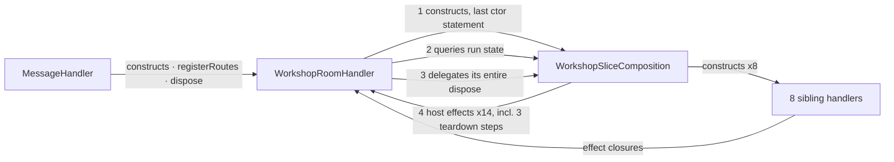

# MR Review v2 — refactor(workshop): close architecture boundaries

**Author:** Okey Landers · **PR:** [#108](https://github.com/okeylanders/prose-minion-vscode/pull/108) · **Branches:** `claude/sprint-07-architecture-closure-orzxq9` → `epic/workshop-architecture-refactor`
**Reviewed:** 2026-08-06 15:51 CDT · **Head:** `676eeec` · **Mode:** Full (10 specialists + 4 runway scouts + Sensei)

## Resolution ledger

Status legend: **Open** = act before merge · **Deferred** = accepted follow-up with reason ·
**Addressed** = fixed · **Partially addressed** = fixed with remainder · **N/A** = praise,
superseded, or not actionable.

| ID | Sev | Finding | Reviewers | Discovery | Signal | Status |
| --- | --- | --- | --- | --- | --- | --- |
| F-01 | 🟠 High | Prose Controller fixture cannot fail on the drift it names; the count of 17 is contestable | Sam, Cal | 1 independent · 2 runway-prompted | 🧭 Corroborated Runway | **Open** |
| F-02 | 🟡 Standard | Sibling-construction witness cannot see `MessageHandler.ts`, the documented wiring site | Sam, Marcus | 1 independent | — | **Open** |
| F-03 | 🟡 Standard | Seam contracts live in the implementation file; the ADR shipped in this PR says they don't | Marcus, Stan, Parker | 3 runway-prompted | 🧭 Corroborated Runway | **Open** |
| F-04 | 🟡 Standard | Disposal sequence split across two files is pinned by one pairwise assertion | Cal, Marcus | 2 independent | 🎯 Consensus | **Open** |
| F-05 | 🟡 Standard | Documentation inside the split files still describes the pre-split shape | Parker, Marcus | 2 independent | 🎯 Consensus | **Open** |
| F-06 | 🟡 Standard | Session-gate refusals stamped with a file that owns neither the gate nor the routes | Oliver | 1 runway-prompted | — | **Open** |
| F-07 | 🟡 Standard | Ninth sibling meets an unguarded disposal slot and a misleading sort coupling | Sam | 1 runway-prompted | — | **Open** |
| F-08 | 🟡 Standard | Host effects handed to sibling constructors before the field they dereference is assigned | Blake | 1 runway-prompted | — | **Open** |
| F-09 | 🟡 Standard | Debt-closure criterion rewritten from falsifiable rule to past-tense report; guard deleted | Bria | 1 runway-prompted | — | **Open** |
| F-10 | 🟡 Standard | D7-B attested only by the implementing commit's own prose | Bria | 1 runway-prompted | — | **Open** |
| F-11 | 🔵 Nit | Current ADR still instructs against adding state to `WorkshopHandler` | Stan, Bria | 2 runway-prompted | — | **Open** |
| P-01 | 🟢 Praise | Behavior preservation verified end-to-end, not asserted | Blake, Tim, Patricia | 3 independent | — | N/A — preserve |
| P-02 | 🟢 Praise | Sibling-construction witness derives actuals and fails in both directions | Marcus, Cal | 2 independent | — | N/A — preserve |
| P-03 | 🟢 Praise | Five sibling `reportError` owner tags survived a 230-line relocation | Oliver | 1 independent | — | N/A — preserve |
| P-04 | 🟢 Praise | D7-D left genuinely unmade in all five artifacts | Bria | 1 independent | — | N/A — preserve |

## Review coverage

- **Read fully:** `WorkshopSliceComposition.ts`, `WorkshopRoomHandler.ts`, `WorkshopRouteContracts.ts`, `MessageHandler.ts`, `MessageRouter.ts`, `boundaries.test.ts`, `WorkshopRouteTestHarness.ts`, the six renamed suites, `0a742cac:WorkshopHandler.ts` (baseline), the eight sibling handlers, `dispatchWorkshopWidgetActionResult.ts`, `useLexicalGravity.ts`.
- **Diff reviewed:** all 40 changed files.
- **Governance artifacts read fully:** Sprint 07 runway, responsibility map, ADR 2026-08-03 (+ amendment), sprint doc, debt record, `docs/ARCHITECTURE.md`, `.ai/central-agent-setup.md`, `CLAUDE.md`, and the base-commit versions of the sprint and debt documents.
- **Precedent consulted:** `docs/pr-reviews/` PR #103, #105, #107 findings; commits `ace148a`, `9d47729b`, `c21e83b8`, `5deaaf1a`.
- **Independently re-run:** `boundaries.test.ts` (23/23 pass), `__tests__/application/handlers` (26 suites / 268 tests pass), set arithmetic over the 32 approved generic surfaces vs. the 17 seam entries.
- **Not reviewed:** ~90 historical documents (`docs/pr-reviews/**`, `.todo/archive/**`, `.memory-bank/**`) — excluded by design per the PR's own scoping; the 728-line unrelated feature plan in `e866e939` (noted, not assessed).
- **Blast radius:** 40 files, +2,362 / −465. Zero message types, routes, persisted shapes, or wire envelopes changed. One operationally visible delta: log prefix across 27 sites.

---

# Part I — Semantic Runway

**PR:** #108 · **Author:** Okey Landers (assisted) · **Branches:** `claude/sprint-07-architecture-closure-orzxq9` → `epic/workshop-architecture-refactor` (merge base `0a742cac`)
**Evidence date:** 2026-08-06 · **Commits:** `ea6025fa` (runway doc), `e866e939` (unrelated feature plan), `676eeece` (the change)
**Blast radius:** 40 files, +2,362 / −465. Source: 1 file renamed + reshaped (`WorkshopHandler.ts` 1,653 → `WorkshopRoomHandler.ts` 1,517), 1 new file (`WorkshopSliceComposition.ts`, 282), 1 pure rename (`WorkshopHandlerContracts.ts` → `WorkshopRouteContracts.ts`), 8 comment/import-only edits. Tests: 6 renames + 1 harness rename + 2 new architecture witnesses (1,937 → 1,939). Docs: 6 governance artifacts edited, 2 published. **Zero** message types, routes, persisted shapes, or wire envelopes changed.

**Runway thesis.** This is the seventh and final phase of a seven-sprint architecture epic, and it is the only phase whose primary deliverable is *evidence* rather than behavior. It does two things at once: it performs a genuine, behavior-preserving responsibility split of the last Workshop god file, and it certifies — in the same commit — that the epic's completion criteria and a Critical-priority tech-debt record are satisfied. The code half is verifiable and holds up. The certification half is where the review pressure lives, because several of the criteria being checked were reworded by the same commit that checks them, and two of the three new fitness artifacts assert hand-authored lists rather than measuring the codebase.

---

## 1. Working Definition & Real Job

**Literal code change.** The class `WorkshopHandler` had two disjoint jobs. ~1,205 of its lines were room/run orchestration (`executeMessage`, `resolveMessageTarget`, the single `activeRun` slot, preemption, streaming/status/error envelopes, and the sole constructor of the `WORKSHOP_SESSION_STATE` message). ~170 lines constructed eight sibling route handlers, owned the shared `registerMutation` session-operation gate, and fanned out route registration and disposal. This PR keeps the first job in a renamed `WorkshopRoomHandler` and moves the second into a new `WorkshopSliceComposition`, connected by a 14-member `WorkshopSliceHostEffects` callback interface.

**Functional capability.** None added. [Observed] `git diff` shows no change under `shared/types/messages/`, no persisted-codec change, and no route-table change. The 48-route / 9-owner ledger witness (`boundaries.test.ts:699`) passes unchanged apart from two owner path strings. The only operationally visible delta is the output-channel prefix `[WorkshopHandler]` → `[WorkshopRoomHandler]` across 27 sites.

**Business / operational problem.** [Declared] `.todo/tech-debt/2026-07-25-workshop-god-files.md` filed two files as Critical debt because they "absorbed every new Workshop feature instead of shedding any," creating concentration risk — "a single file is becoming the place every Workshop change has to touch." The escalation attached to that debt is a **Workshop feature freeze** (`epic-workshop-architecture-refactor.md:131-136`) pausing four named writer-facing features, Prose Controller among them. Closing the debt is the gate on resuming Workshop feature work.

**What the wording and structure emphasize.** The PR body leads with the code split and lists the documentation last. The commit history inverts that weighting: `676eeece` contains one genuine structural change and six governance documents whose combined effect is to move a Critical debt record to `Resolved` and check nine of ten epic completion boxes. The word "close" in the PR title is doing two jobs — closing a boundary, and closing a record.

**What must survive any valid alternative.** The single `activeRun` slot with exactly one owner; the exact disposal sequence; the 48-route ownership and gate classification; the sole `WORKSHOP_SESSION_STATE` constructor; zero persisted-shape change; `packages/core` free of `vscode`; and — the epic's own stated guard — that Phase 7 "must not manufacture closure through a cosmetic rename or arbitrary line-count extraction."

**Competing interpretation.** A reviewer could read this PR as *primarily* a documentation change with a supporting refactor: 6 of 40 files are source, and the structural move is ~230 lines relocated with no behavior delta, while the governance edits determine whether a feature freeze can lift. Under that reading the code is the evidence and the documents are the deliverable — which inverts where review attention normally goes. Both readings are supportable; the review should test both.

> This PR is not merely a rename-and-extract. Its real job is **converting a seven-sprint epic's architectural claims into recorded, executable evidence sufficient for a human to lift a feature freeze**, while preserving every route, contract, persisted shape, and runtime behavior.

---

## 2. Declared Intent, Observed Behavior & Open Meaning

| Topic | [Declared] | [Observed] | [Inferred] | [Unknown] |
|---|---|---|---|---|
| Behavior preservation | PR body: "no Workshop route, wire-message, persistence, or visible user behavior changes… preserves the single active-run owner and the established disposal sequence" | Verified. Dispose runs the same 8 steps in the same order (old `WorkshopHandler.dispose():436-452` vs `WorkshopSliceComposition.ts:254-262` + three host callbacks). `activeRun` exists at exactly one site (`WorkshopRoomHandler.ts:204`); grep finds no second handler-level slot. All 26 handler suites (268 tests) and 23 boundary witnesses pass on this branch. | The claim is accurate and independently reproducible | — |
| Handler disposition (D7-A) | Runway recommended option (c): extract composition, then rename | Implemented as (c) | Substantive, not cosmetic — the debt's own anti-cosmetic guard is honored in spirit | Whether the resulting parent/child shape is what "two disjoint fan-outs" meant |
| Reproduction criterion (D7-B) | Sprint criterion at base `0a742ca`: "exactly one **generic closed-registry entry**" | The same commit rewrites it to "exactly one entry **per applicable** generic closed registry" and marks it `[x]` | The rewrite's *rationale* is measured and was published in advance (runway §3.3): the literal reading is unsatisfiable under closed dispatch. The *procedure* — amend and satisfy in one commit — is the open question | Whether Okey answered D7-B before the fixture was built, as the runway required (`:74`, `:485-486`) |
| Docs-consistency criterion | Base: "source, tests, witnesses, log-prefix expectations, and **docs** consistently use `WorkshopRoomHandler`" | Rewritten to add "in the implemented/**live** architecture"; debt record similarly gains "**live** architecture document" | The qualifier narrows a criterion the diff does not otherwise meet | Whether "live" was intended to exclude two ADRs that are themselves normative and current |
| Debt-closure guard | Base debt `:84-86`: "Phase 7 must not manufacture closure through a cosmetic rename… If the evidence does not support closure, this record stays open" | That paragraph and the three "Remaining closure questions" are **deleted** by the closing commit | The guard was substantively honored; the record of the guard was not preserved | Whether a resolved debt record should retain the test it was measured against |
| Freeze lift (D7-D) | "leaves the Workshop feature freeze in place until Okey explicitly lifts it" | Honored consistently: sprint, epic, debt, map, and ADR all leave D7-D open | Clean. The one decision reserved for the human was in fact reserved | — |
| Audit scope (D7-C) | Audit all five freeze-gate facades | `WorkshopApp.tsx` (1,485), `useWorkshopRoom.ts` (832 / 37 `useState`), `useWorkshopSessions.ts` (262) are certified "Coherent … facade" in the map with **zero code change** in this PR | Line/`useState` counts in the map are accurate; the *verdicts* are documentary | Whether the epic intended those three to be audited by the implementer or judged by the decision owner |

---

## 3. Business Story & Rulebook

**Actors.** *Decision owner:* Okey — named for D7-A/B/C/D and for the human judgement of whether 1,653/2,121 lines "read as narrow facades" (runway `:436`, `:522`). *Implementer/auditor:* the same agent that wrote the runway, then implemented it, then flipped the runway's own status header from `READY FOR REVIEW / gate CONDITIONAL` to `Accepted and implemented`. *Beneficiaries:* Workshop maintainers (concentration risk) and, downstream, writers (four paused features). *Subject:* the debt record.

**Trigger and preconditions.** Sprint 06 accepted decision D3 — deferring the naming verdict and debt closure to Phase 7 rather than smuggling them into a normalization diff (debt `:66-68`). At base `0a742ca`, five of the sprint's ten criteria were already satisfied by inherited work (runway §1.1).

**Rules the process wrote for itself, and their status:**

| Rule | Source | Status |
|---|---|---|
| No closure by cosmetic rename or line-count extraction | debt `:84-86` (pre-change) | **Substantively honored** — split is by responsibility. Rule text deleted by the closing commit. |
| Debt closes only when the map evidences *every* criterion | debt `:81-82` | Map published; all 7 criteria checked in the same commit. |
| Freeze is not lifted implicitly | epic `:136`, map `:14` | **Honored** in all five documents. |
| Behavior-preserving moves and behavior changes use separate commits | debt `:103` | Checked `[x]`. The move and the operationally visible log-prefix change ship in one commit `676eeece`. |
| One arm per applicable closed generic seam, zero feature-slice edits | D7-B(b) | Encoded as a 17-path literal in `boundaries.test.ts`. |
| `apps/vscode-extension` is the **only** composition root | `CLAUDE.md` / `.ai/central-agent-setup.md:28`; ADR 2026-06-18 | The ADR and `docs/ARCHITECTURE.md` record the new intra-domain tier; `CLAUDE.md` was **not** amended and still says "only." |

**Exceptional but legitimate state.** A debt record marked `Resolved` while its escalation (the freeze) remains in force. That is deliberate and correctly represented — but it means the record's status field and its gate are now decoupled, and a future reader must read both.

---

## 4. Narrative Flow: Beginning, Development, Turn & Ending

**Beginning.** PR #86's review files the god-files debt (2026-07-25). Six sprints relocate responsibility. Sprint 06 explicitly defers the last two decisions.

**Development.** `ea6025fa` adds a 706-line pre-implementation runway that measures the base commit honestly, finds the retain-or-rename binary false (73% room / 10% composition), finds the reproduction criterion unsatisfiable as literally written, finds the audit list short by three facades, and rates its own implementation gate **CONDITIONAL — FAIL on "no unaccepted critical unknowns"** because D7-B is unresolved. It assigns all four decisions to Okey and writes, of D7-B: "This is why D7-B must be answered by the decision owner and not by the auditor."

**Turn.** `676eeece` does everything simultaneously: the code split, the map, the ADR amendment, the criterion rewrites, and the checkbox flips. The same commit edits the runway's own status header and inserts the sentence asserting that Okey's "ready to implement" accepted D7-A(c), D7-B(b), and D7-C(b). That sentence is the sole artifact of the human decision in the diff. **This is the commitment point**: after it, the debt is `Resolved`, nine of ten epic boxes are checked, and the freeze is blocked only by a signature.

**Ending.** Verified state: full Jest green (reproduced locally: 23/23 boundary witnesses, 268/268 handler tests), typecheck/lint/build claimed clean, `WorkshopHandler` gone from all live source and from `docs/ARCHITECTURE.md`, `CLAUDE.md`, `.ai/`. The freeze remains, correctly, unlifted.

**Unresolved threads.** Two current, normative ADRs still name `WorkshopHandler` as a live owner (§7). Nine approved generic surfaces sit outside the 17-seam fixture with their applicability judgment recorded nowhere (§12). The disposal ordering is now split across two files with no test pinning the interleave. The PR carries an unrelated 728-line feature plan (`e866e939`).

---

## 5. Codebase Genealogy & Controlling Precedent

**Controlling precedent — composition.** Eleven flat domain handlers are each constructed once in `MessageHandler`'s constructor and self-register (`MessageHandler.ts:199-304`, `:345-356`). No other domain has an intra-domain composition class; `WorkshopSliceComposition` is the first `*Composition` in a repo whose extraction vocabulary is Service / Handler / Ledger / Operations / Coordinator / Registrar / Contracts.

**Distinguishing fact.** ADR 2026-06-18 diagnosed `MessageHandler` as "a de-facto second composition root" — but its three cited symptoms were all *infrastructure* construction (TTL cache, debounce timer, listener set). The enforcing witness (`boundaries.test.ts:629-631`) is a nine-name blocklist of *services*, so handler-constructs-handler has never been in the net. The old `WorkshopHandler` already constructed eight siblings; this PR does not create the exception, it names it. [Inferred] The rule as enforced is "handlers don't `new` services"; the rule as written in `CLAUDE.md` is "only one composition root," and the gap between them widened here without `CLAUDE.md` being updated.

**Conflicting authority — test naming.** PR #105 finding F-14 (raised by Stan) rejected "new test-suffix vocabulary defined by no ADR or guide," and was resolved by adopting *owner* names (`WorkshopHandler.<owner>.test.ts`). This PR introduces `WorkshopRoutes.{context,excerptScope,sessions,todos}.test.ts` — a prefix naming no source module, documented only inside a sprint runway. The directory now holds three competing conventions driven by one harness.

**Witness genealogy.** Sprint 06's review (PR #107) found two witnesses that were green while their property was false; `ace148a` repaired them by making `allowedToken` required and adding an inverse `unusedApprovedSurfaces` check that fails when an approval stops earning its exemption. PR #107 F-04 specifically repaired a "list is generated, count is prose" pattern by deriving the count. [Observed] The new `PROSE_CONTROLLER_GENERIC_SEAM_ENTRIES` witness reintroduces both shapes: a hand-authored list and a hand-authored `genericSeamCount: 17` beside it.

**Mirrored-test precedent.** Sprint 05 gave four extracted collaborators four mirrored suites; PR #107 F-11 required the same of two feature slices. `WorkshopSliceComposition.ts` (282 lines, owner of the mutation gate and the disposal sequence) ships with no mirrored suite. Suite count went 189 → 189.

**New precedent this PR creates.** (1) A domain handler may own a `*Composition` that constructs its siblings. (2) `Composition` enters the suffix vocabulary. (3) Test filenames may name a *surface* with no corresponding module. (4) A 282-line extracted module may ship without a mirrored suite if reachable through an existing harness. (5) An architecture witness may assert a hand-curated list against itself. (6) ADR amendment-in-place rather than supersession.

---

## 6. Structural & Causal Map

Four edge kinds cross the new seam — this is the shape that makes the "two disjoint fan-outs" claim contestable:



**Disposal.** [Observed] `WorkshopRoomHandler.dispose()` has no body — it is one delegating line. The composition's `dispose()` runs: gesture → lexical → `host.disposeRoomSubscriptions()` → sessionMessage → `host.disposeActiveRoomRun()` → context → `host.flushPersistence()`. Steps 3, 5 and 7 are the *parent's* teardown, interleaved between the *child's*. Order is byte-equivalent to the pre-change single method. The only regression test (`WorkshopRoomHandler.roomAndRun.test.ts:59-83`) asserts one pairwise ordering (`abandonRun` before `flush`); it does not pin the interleave.

**Route registration.** `MessageRouter.register` **throws** on duplicate (`MessageRouter.ts:32-34`) and `route()` is a Map lookup, so registration order has no dispatch consequence. `CANCEL_WORKSHOP_REQUEST` moved from last to ninth; inert today, observable only in a partial-registration failure.

**Mutation gate.** Moved verbatim to `WorkshopSliceComposition.ts:264-281`. Branch reachability traced across all 34 `registerMutation` sites: `onBlocked` → 3 routes; `sessionAction` → 6 routes; generic `reportError(owner: 'WorkshopRoomHandler')` → **25 routes**, 17 of which belong to `WorkshopContextHandler`, `WorkshopExcerptScopeHandler`, `WorkshopTodoHandler`, and `WorkshopLexicalGravityHandler`. The owner string is now a hardcoded literal naming a sibling module, written from a third module.

**Pass-through parameters.** Four of `WorkshopRoomHandler`'s 14 constructor parameters carry no `private readonly` — `contextAssistantService`, `shell`, `contextIntakeService`, `widgetRuntime`. The room never reads them; it forwards them. Correspondingly `WorkshopWidgetRuntime` is defined in the *child* and imported *upward*, so the parent's public type surface depends on the child's.

---

## 7. Contracts, Invariants & Negative Space

**Preserved (verified):** 48 routes / 9 owners / 34 mutation + 14 direct; one `activeRun` slot at one site; sole `WORKSHOP_SESSION_STATE` constructor; persisted shapes; `packages/core` `vscode`-free; the public core barrel exports neither new class.

**Newly asserted:** all eight `new Workshop*Handler(` occurrences under `handlers/domain/workshop/` belong to `WorkshopSliceComposition` (`boundaries.test.ts:756-770`); and a 17-path Prose Controller seam ledger (`:891-916`).

**Negative space — what this PR deliberately does not do.** It does not lift the freeze. It does not touch the three presentation facades it audits. It does not decompose `executeMessage` (369 lines) or `resolveMessageTarget` (138) — the ADR forbids extraction without an independent reason to change, and rejecting that extraction is itself part of the evidence. It does not rewrite ~90 historical documents (PR reviews, archived epics, `.memory-bank`), by explicit design.

**Documentation consistency — measured.** [Observed] `WorkshopHandler` is absent from all live source, `docs/ARCHITECTURE.md`, `CLAUDE.md`, and `.ai/`. It survives in `docs/adr/` at 13 sites across 8 ADRs. Nine of those are in older ADRs where a historical reading is natural. Two are not:
- `docs/adr/2026-08-03-…-module-boundaries.md:120` — "`WorkshopHandler` is the slice composer and retains only the nine…" and `:140` — "`WorkshopHandler` remains the only…". These sit in the **same ADR this PR amends**, above the amendment, with no inline supersession marker.
- `docs/adr/2026-07-31-workshop-widget-state-ownership.md:91` — normative and forward-looking: new widget state "must not be added directly to `WorkshopHandler`." A reader following that instruction today cannot find the class.

This is exactly the surface the sprint criterion was reworded to exclude ("live architecture document").

---

## 8. Forces, Tensions & Design Tradeoffs

**`WorkshopSliceHostEffects` is the honest measure of separability.** 14 members (`WorkshopSliceComposition.ts:68-88`), spanning five unlike clusters: transport envelopes (4), persistence proxies (2), run-state predicates (3), room execution (3), parent teardown (3). Compare `WorkshopRoomEffects` (6 members, `WorkshopRouteContracts.ts:18-25`), a genuine narrow port whose docblock documents a `Pick` discipline. The split removed ~132 lines of constructor from the room and re-imported 14 named couplings through an interface with no cap, no `Pick` rule, and no membership witness. `markDirty` and `flushPersistence` are pure pass-throughs to a `sessionPersistence` the composition **already holds and calls directly** at `:268`.

**Simplicity vs. honest naming.** Deleting the composition and keeping only the rename leaves one irreducible need: `registerMutation` must close over both `isSessionOperationPending()` *and* `sessionMessageHandler.postActionResult(...)`, so one object must know both. Everything else folds back for ~230 lines. The composition's earned value is (a) a name a witness can point at and (b) keeping the room at 1,517 rather than 1,750 lines. It does not decouple anything the type system was straining against — room and composition are mutually dependent by construction.

**Alternatives not evaluated in the runway's table** (which considered only retain / rename / rename+extract / decompose-`executeMessage`):
1. **`MessageHandler` holds the composition; room and siblings are peers.** Removes the cycle, removes the four pass-through parameters, puts teardown ordering in one owner. Costs the "12 domains, 12 handlers" symmetry and requires publishing the room's seams as a real port.
2. **Composition owns construction + registration only; the room keeps `dispose()`.** Removes 3 of 14 host members and the teardown inversion; makes the interleave explicit — a gain if it is load-bearing, a loss if incidental.
3. **Extract the ~156 lines of shared transport envelopes** into a `WorkshopTransport` injected into both. Drops 4 more host members and makes `reportError`'s owner a caller-supplied fact; costs a third object and re-anchors the session-state witness.

**Evidence vs. self-certification.** The mechanical gates (Jest, tsc, lint, build, migration exceptions, route ledger, composition-ownership witness) are independently re-runnable and I reproduced the two most load-bearing. The five-facade *coherence verdicts*, the "no remaining responsibility with an independent reason to change" conclusion, and the assertion of Okey's acceptance are certified only by the same commit's prose.

---

## 9. Failure, Recovery & Operational Truth

**On-call view.** Triage greps for `[WorkshopHandler]` now return nothing; 27 log sites moved to `[WorkshopRoomHandler]`. Sprint 04 ran this migration before and published a prefix map; that precedent is cited and accepted.

**Attribution.** The mutation gate's majority branch (25 of 34 routes) stamps errors with a hardcoded `'WorkshopRoomHandler'` from inside `WorkshopSliceComposition`, for routes owned by five other classes. Pre-existing as behavior; newly visible as a literal. `WorkshopSliceComposition` contains **zero** `appendLine` calls while owning a writer-visible refusal path.

**Dispose failure.** `MessageHandler.ts:853-858` wraps handler disposal in `try { } catch { /* noop */ }`. If an early step throws, later steps — including both listener unsubscribes and the persistence flush — are skipped silently. Pre-existing shape; the chain is now one frame deeper.

**Construction failure.** The room subscribes two listeners before constructing the composition. If any sibling constructor throws, both subscriptions leak with no unsubscriber and `dispose()` is unreachable. Byte-identical to the pre-change ordering; the split makes it one indirection harder to see.

**Double dispose.** No `disposed` flag in either version. `WorkshopSliceComposition.dispose()` is now public and separately reachable — two doors to the same teardown where there was one, though no caller uses the second today.

---

## 10. Security, Trust & Misuse Surface

Little bearing. No authentication, authorization, tenancy, secret, or attacker-controlled input surface is touched. `packages/core` remains `vscode`-free (witness `:613`). The one adjacent invariant — persona-emitted recommendations naming an unsupported widget are rejected by `isLiveWorkshopWidgetId` — is untouched. The mutation gate is a concurrency guard, not an authorization boundary; its relocation does not change who may call what. Reviewers should not manufacture scope here.

---

## 11. Data, Time, Scale & Concurrency Horizon

**Concurrency.** The single-`activeRun`-slot invariant is the one runtime property a split of this class could plausibly break, and it did not: one field, one owner, read-only predicates across the seam. Two webviews (sidebar + Workshop panel) each build a `MessageHandler`; post-change each instantiates one additional object. Both compositions register their own `registerMutation` closure over the *same shared* `isSessionOperationPending()` predicate — exactly as the two `WorkshopHandler`s did.

**Scale of the object graph, not of data.** This change carries no data-volume, retention, latency, or query-cost dimension. The relevant "scale" axis is *sibling count*: the seam's cost is a monotonic function of how many slices Workshop grows.

**Growth horizon.** A ninth sibling touches two files at the seam instead of one (composition + possibly `WorkshopSliceHostEffects` **and** the room's 14-member host literal), plus three hand-maintained ledgers in `boundaries.test.ts` (`WORKSHOP_COMPOSED_SLICE_HANDLER_NAMES`, `WORKSHOP_ROUTE_OWNERS` with its 48/34/14 literals, and `PROSE_CONTROLLER_GENERIC_SEAM_ENTRIES`), none of which derives from another. `WORKSHOP_COMPOSED_SLICE_HANDLER_NAMES` must be kept in alphabetical position because the actuals are `localeCompare`-sorted and compared with `toEqual` — an out-of-order append fails as though it were an architecture violation.

---

## 12. The Change Genome: Variation & Reproduction

**Cousin: a ninth sibling route handler** (`WorkshopProseControllerHandler`), varying exactly one axis — sibling count 8 → 9.

| Contact point | Class | Note |
|---|---|---|
| Composition ctor + field | **Reuse** | One `new`, one field. The seam working as designed. |
| `WorkshopWidgetRuntime` | **Extension** | Gains a 4th member. [Observed] The old docblock explaining *why* the bundle exists ("Adding another widget extends this seam; it does not add another positional argument") did not survive the move; the new comment is one line. Rationale erosion. |
| `WorkshopSliceHostEffects` | **Extension, monotonic** | Grows; nothing prunes a member orphaned by a removed slice. No witness, no cap, no `Pick` rule. |
| Composition `dispose()` | **Fork risk** | A hand-ordered 7-step interleave with no stated phase contract and no ordering test. The ninth slot is chosen by whoever is closest to the keyboard. |
| Witness 1 (`WORKSHOP_COMPOSED_SLICE_HANDLER_NAMES`) | **Extension, brittle** | Alphabetical-position coupling (above). |
| Witness 2 (Prose Controller fixture) | **Contradiction** | If the cousin *is* Prose Controller, the fixture must be rewritten wholesale. It predicts its own obsolescence. |

**The reproduction fixture, measured.** [Observed] Of its five assertions, four are about the literal array itself — `genericSeamCount: entries.length === 17`, `duplicateEntries`, `siblingFeatureEntries` (regex over its own strings), and `unapprovedEntries` (literal ⊆ literal). Only `missingEntries` touches the filesystem, and it only checks that 17 paths exist.

I computed the set difference. There are **32** approved generic surfaces and **17** seam entries, leaving **15** excluded. Checking each for an existing `prose-controller` reference:

- **6 already carry one** — `WorkshopSessionStateV1Shape.ts` (5 hits), `WorkshopStandingDirectiveOperations.ts` (8), `workshopWidgetIcons.ts` (1), `workshopWidgets.ts` (1), `messages/workshop/standingDirectives.ts` (4), `messages/workshop/widgets.ts` (2). These are legitimately "already prepared."
- **9 carry none** — `WorkshopSessionCheckpointNormalization.ts`, `WorkshopRunCompletion.ts`, `SettingsOverlay.tsx`, `dispatchWorkshopWidgetActionResult.ts`, `promptBudgets.ts`, `resultToolNames.ts`, `streamingCancelMessages.ts`, `messages/streaming.ts`, `workshopPromptFrames.ts`.

Those nine are excluded on an *applicability* judgment — the sprint's reworded criterion says "one arm per **applicable** closed generic seam" — and that judgment is recorded nowhere in the fixture, the map, or the ADR. Several are non-obvious: `dispatchWorkshopWidgetActionResult.ts` is an explicit per-feature consumer fan-out (`handleGestureActionResult`, `handleLexicalActionResult`, `handleStandingDirectiveActionResult`); `promptBudgets.ts` carries nine `gesture*` budget fields; `streamingCancelMessages.ts` maps `'workshop-gesture-playground'` to a cancel message type. Each is plausibly inapplicable if Prose Controller is standing-directive-only — and plausibly applicable if it streams, prompts, or emits an artifact.

**The sensitivity question this raises for the panel:** if a new generic seam requiring a Prose Controller arm were added tomorrow, or if one of the nine turned out to need an arm after all, would `boundaries.test.ts:891` go red? Reviewers should determine this from the source rather than from this runway.

**Copy pressure.** Three hand-maintained ledgers that agree only by discipline; a monotonic effects interface with no shrink path; disposal ordering as folklore; and no independent test of the composition — a mis-wired host effect (wrong `owner` string, `postTurn` where `postSessionState` was meant) is caught only if a room-level assertion happens to cross that path.

---

## 13. Comparative Models & Borrowed Vocabulary

**Internal parallel — the repaired witness (`ace148a`).** The strongest comparison is in this repo's own history. Sprint 06's review found witnesses that were green while their property was false; the repair added `unusedApprovedSurfaces`, an *inverse* check that fails when an approval entry stops earning its exemption. That is the template for a witness that resists drift. **Question it contributes:** does each new witness here have an inverse, or only a forward assertion?

**[Analogy] Evolutionary architecture / fitness functions.** The distinction between a *fitness function* (computes a property from the system and fails on drift) and a *conformance snapshot* (asserts a curated list) is the vocabulary this change most needs. Both are legitimate; they protect different things and decay differently. A snapshot answers "what did we believe on 2026-08-06"; a fitness function answers "is it still true." **Question:** for each of the two new witnesses, which is it, and is that the intended kind?

**[Analogy] Chain of custody.** The governance half of this PR is an evidence-handling problem: can a later investigator reconstruct who decided what, when, and under whose authority? Three artifacts bear on it — the criterion rewrites, the deleted anti-cosmetic guard, and the single prose sentence recording the human's acceptance. **Question:** if this record is read in six months by someone deciding whether to reopen the debt, does it contain the test it was measured against?

I considered and discarded parallels to plugin architectures and to legal supersession doctrine — the first is already settled by the ADR, and the second adds vocabulary without a new question beyond §7's concrete finding.

---

## 14. Creative Counterfactuals

**Inversion.** If `WorkshopSliceComposition` owned `WorkshopRoomHandler` rather than the reverse, the callback cycle disappears and disposal becomes one flat list with a single owner. The room must still be constructed first (all 14 host effects close over its private state). The current direction buys `MessageHandler` uniformity and pays with the cycle.

**Deletion.** Remove the composition, keep the rename: ~230 lines return to the room (1,517 → ~1,750). The only irreducible need is the gate's dual knowledge. What is genuinely lost is a *nameable* boundary a witness can assert — which is not nothing, given the whole sprint is about evidence.

**Time-lapse (two years, four more widgets).** `WorkshopWidgetRuntime` → ~7 members; `WorkshopSliceHostEffects` → ~18–20 and never shrinking; the composition constructor → several hundred lines of wiring, which is the exact smell the `WorkshopWidgetRuntime` bundle was introduced to prevent, reappearing one layer down. And `WorkshopRoomHandler` is still 1,517 lines against this repo's own 500-line anti-pattern threshold.

**Boring alternative.** Rename only, record the dual role as deliberate, and close the debt on the strength of the eight named siblings that already exist. The runway called this defensible (D7-A(a)). It ships today with zero structural risk and leaves one filename imprecise.

---

## 15. Evidence Confidence & Unresolved Questions

**Repository-grounded (verified by me on this branch):** dispose-order equivalence; single `activeRun` site; `MessageRouter.register` throws on duplicate; 23/23 boundary witnesses and 268/268 handler tests pass; `WorkshopHandler` absent from live source, `ARCHITECTURE.md`, `CLAUDE.md`, `.ai/`; present at 13 sites in `docs/adr/`, two of them normative-and-current; 32 approved surfaces vs. 17 seam entries with the 15-file difference enumerated and each checked for existing `prose-controller` references; witness #10's scan scope; the base-commit text of the rewritten criteria.

**Material inferences:** that the nine zero-reference exclusions rest on an applicability judgment; that `WorkshopSliceHostEffects`'s size measures residual coupling rather than a designed port; that the composition's earned value is naming rather than decoupling.

**Missing / unknown:** whether Okey answered D7-B before the fixture was built; whether the criterion rewrites were approved as amendments; whether the dispose interleave is load-bearing or incidental; whether the nine exclusions were individually adjudicated; whether `WorkshopRoutes.*` is intended as a repo-wide convention; whether the three presentation facades were meant to be audited by the implementer or judged by the decision owner; whether the sprint's "fresh maintainability review" (`:59`) was performed, dropped, or is this review.

**Needs author/owner confirmation, not code inspection:** every item in the previous sentence except the dispose interleave.

---

## 16. Past → Present → Horizon Synthesis

**Past.** Seven sprints of relocation under a feature freeze, governed by an ADR with explicit anti-patterns (no dynamic plugin framework; no extraction without an independent reason to change) and a debt record that pre-wrote its own anti-cosmetic guard. Two prior reviews taught this codebase that a green witness whose property is false is worse than no witness.

**Present.** A behavior-preserving responsibility split that is real, verifiable, and honest about what it does not decouple — delivered inside a commit that also rewrites three acceptance criteria, deletes the guard clause it was measured against, closes a Critical debt, and certifies three untouched facades. The structural work would survive most scrutiny on its own. The certification apparatus is what a reviewer must weigh, because the epic's stated output for this phase is *evidence*, and evidence is exactly where self-reference is most costly.

**Horizon.** The seam's cost curve is a function of sibling count, concentrated in a 14-member effects interface with no shrink mechanism and three hand-maintained ledgers that agree by discipline. The next feature to land — Prose Controller, already half-present in six generic files — is simultaneously the thing the fixture predicts and the thing that will invalidate it. Whether the freeze lifts on this evidence is D7-D, and the PR is scrupulously correct to leave it unmade.

---

## 17. Runway Synthesis Brief

**Invariants the implementation must preserve.** One `activeRun` slot, one owner. The exact disposal sequence and the order of its interleaved room steps. 48 routes / 9 owners / 34 mutation + 14 direct. Sole `WORKSHOP_SESSION_STATE` constructor. Zero persisted-shape and wire-envelope change. `packages/core` free of `vscode`. No handler receives an aggregate-internal ledger.

**Anchors.** `WorkshopSliceComposition.ts:68-88` (effects interface), `:214-244` (gate + registration), `:254-262` (dispose), `:278` (hardcoded owner string). `WorkshopRoomHandler.ts:204` (`activeRun`), `:253-298` (host literal), `:304-325` (room route arm), `:333-335` (dispose delegation). `boundaries.test.ts:756-770` and `:891-916` (the two new witnesses), `:497-513` (the 17 seam entries), `:334-338` (approved-surface entry moved from the room to the composition). `MessageRouter.ts:32-34`. `docs/adr/2026-08-03-…:120,140,159-188`; `docs/adr/2026-07-31-…:91`. Sprint criteria at `0a742ca` vs. HEAD. Debt record `:84-86` at `0a742ca`.

**Tensions (tradeoffs, not defects).** Naming honesty vs. a 14-member coupling surface. `MessageHandler` uniformity vs. the parent/child cycle. A snapshot witness that is cheap and readable vs. a derived one that resists drift. Amending a criterion whose literal reading was measured unsatisfiable vs. amending it in the commit that satisfies it. Auditing three facades documentarily vs. leaving the gate unanswered for them.

**Unknowns.** Listed in §15; all but one require the author or decision owner, not more code reading.

**Legitimate variation points.** `WorkshopWidgetRuntime` (per-feature collaborators). `WorkshopSliceHostEffects` (per-slice room facts). The 17-seam ledger (per-feature arms). The composition's sibling list.

**Predicted pressures.** *Near:* a ninth sibling touches two seam files and three ledgers. *Middle:* Prose Controller lands and either validates or falsifies the 17. *Far:* the effects interface reaches ~20 members with no shrink path while the room remains at 1,517 lines.

**Questions for the panel** (investigate from source; do not take these as conclusions):
1. Is the disposal interleave load-bearing or incidental — and does any test fail if steps 3/5/7 move relative to 1/2/4/6?
2. For each of the two new witnesses: what is the smallest change to production code that leaves it green while making its claimed property false?
3. Do the nine zero-reference excluded approved surfaces have a defensible applicability judgment, and should it be recorded where the witness can check it?
4. Is the hardcoded `'WorkshopRoomHandler'` owner string the right attribution for the 25 routes that reach that branch?
5. Should `WorkshopSliceHostEffects` and `WorkshopWidgetRuntime` live in `WorkshopRouteContracts.ts` beside `WorkshopRoomEffects`, and does the effects interface need a `Pick` discipline or a cap?
6. Do the two normative `WorkshopHandler` references in current ADRs (`2026-08-03:120,140`; `2026-07-31:91`) satisfy the criterion as reworded, and would a one-line supersession marker resolve it?
7. Does a 282-line module owning the mutation gate and the disposal sequence warrant its own suite, given this repo's mirrored-test precedent?
8. Which test-naming convention does the ninth slice copy, and is `WorkshopRoutes.*` intended as a documented convention?
9. Is `CLAUDE.md`'s "only one composition root" statement now inaccurate, or is the tiered rule implicit and worth stating?

**Do not overread.** The behavior-preservation claim is true — verify it, but do not hunt for a runtime regression that the tests and the trace both rule out. The composition-root "violation" is not new; the old handler constructed the same eight siblings. `WorkshopSessionService` at 2,121 lines is outside this PR's diff. Security, performance, and data-scale lanes have genuinely little bearing here; grade them on that basis rather than manufacturing scope. And the freeze was *not* lifted — do not treat the checked boxes as if it were.
---

# Part II — The Review

## Executive Briefing

**Verdict:** **Nearly there** — the code half is sound and independently verified; the evidence half, which is this phase's actual deliverable, has one fixture that cannot fail on the drift it exists to detect.

- 🟠 **F-01 · The Prose Controller reproduction fixture cannot fail on the drift it names, and its count of 17 is contestable** `🧭 Corroborated Runway` — four of its five assertions compare a hand-authored literal against itself, and `dispatchWorkshopWidgetActionResult.ts` (an approved generic surface excluded from the 17) already carries a dedicated arm for the only other standing-rail widget. The number 17 is quoted as evidence in four governance documents. Add the inverse check that already exists fifty lines above it, and re-adjudicate that one file.

No Blocking findings. Behavior preservation was traced statement-by-statement by three reviewers and holds: dispose order is byte-equivalent, the single `activeRun` slot is one field with one owner, and the mutation gate moved line-for-line with all three branches intact.

## Report Card

| Domain | Grade | Rationale |
| --- | --- | --- |
| Architecture — Marcus | **B** | The split is real and the construction witness is genuine; the seam's return edge is undocumented and contradicted by the ADR shipped in the same commit. |
| Critical Correctness — Blake | **A−** | Behavior preservation verified step-by-step rather than accepted; one construction-order hazard that is unreachable today. |
| Edge Cases — Sam | **B−** | Both new witnesses have side doors; one is already open, and the ninth-sibling path meets two hand-maintained traps. |
| Code Quality — Parker | **B** | `WorkshopSliceComposition`'s docblock is the best in the module; the files around it still tell the pre-split story. |
| Tests — Cal | **B−** | Gate and construction ownership are well covered; the disposal fan-out this PR created is untestable through the harness as written. |
| Codebase Fit — Stan | **B−** | Contract placement runs against two established precedents, a third test convention enters one directory, and the debt index contradicts the debt record. |
| Performance — Tim | **A** | Measured, not asserted: constructor closures dropped 29 → 22, no indirection added to the per-token stream path, new witnesses cost ~0.7 ms. |
| Security — Patricia | **A** | Gate relocation verified line-by-line against base; the `owner` string terminates in the output channel and never enters the wire envelope. |
| Observability — Oliver | **B−** | Per-sibling owner-tag discipline survived the relocation everywhere except the one branch the new file authors — which covers 25 of 34 mutation routes. |
| Domain Logic — Bria | **B** | The freeze is correctly and consistently unlifted; one criterion changed from rule to report with no published rationale. |

## Findings

### F-01 · 🟠 High — The Prose Controller reproduction fixture cannot fail on the drift it names, and its count of 17 is contestable `🧭 Corroborated Runway`

**Raised by:** Sam, Cal
**Discovery:** 1 independent (the undercount) · 2 runway-prompted (the sensitivity)
**Confidence:** High
**Evidence:** `packages/core/src/__tests__/architecture/boundaries.test.ts:904-916` — `genericSeamCount: entries.length, duplicateEntries, missingEntries, unapprovedEntries, siblingFeatureEntries` → `{ genericSeamCount: 17, … }`
**Affected contract:** Test/evidence contract — the executable half of sprint decision D7-B, cited as proof in the sprint doc, the responsibility map, the ADR amendment, and the debt record

**What the five assertions read.** `entries` is a spread of a 17-string literal declared 400 lines above. `genericSeamCount` compares `entries.length` to the literal `17`. `duplicateEntries` runs `indexOf` over the literal. `unapprovedEntries` asks whether the literal is a subset of a second literal in the same file. `siblingFeatureEntries` runs a regex over the literal's own path strings. **Four of five never touch the filesystem.** Only `missingEntries` does, and it asks one question: do these 17 paths still exist? That is a path-rot check, not a change-cost check.

**No inverse, so the drift it exists to catch is invisible.** Add a generic file tomorrow with a closed per-feature dispatch. The neighbouring witness at `:841` *will* force it into `WORKSHOP_APPROVED_GENERIC_FEATURE_SURFACES`, because that one scans every source file. Nothing then forces it into `PROSE_CONTROLLER_GENERIC_SEAM_ENTRIES`: approvals grow to 33, the 17 stays 17, and `entries ⊆ approved` still holds because the subset test only runs one way. The witness stays green while "one arm per applicable seam" is false.

Fifty lines above, at `:848`, sits `unusedApprovedSurfaces` — the exact inverse-check shape commit `ace148a` added in response to PR #107's F-01/F-02, which found witnesses green while their property was false. PR #107's F-04 separately repaired a "hand-maintained list beside a hand-maintained count" by deriving the count. Both repairs are reversed in this fixture, in the same file.

**The count is already contestable, not merely unverifiable.** `dispatchWorkshopWidgetActionResult.ts` is an approved generic surface (`:412-414`) **excluded** from the 17. It is a per-feature consumer fan-out: `handleGestureActionResult` / `handleLexicalActionResult` / `handleStandingDirectiveActionResult`. Lexical Gravity is a **standing-rail** widget and still owns a *dedicated* arm there alongside the generic standing-directive consumer, because it does its own request-token correlation — `useLexicalGravity.ts:134,138` filters `action !== 'apply-standing'` then `widgetId !== 'lexical-gravity'`. Prose Controller is the next standing-rail widget, in the same catalog group, with the same modal shape. Reproducing the nearest precedent means a fourth interface member, a fourth call in the dispatcher, and a fourth key at the call site — and that call site (`useWorkshopAppMessageRouter.ts`) *is* entry #13 of the 17 while its callee is not.

**The applicability judgment is recorded nowhere checkable.** There are 32 approved generic surfaces and 17 seam entries. Of the 15 excluded, 6 already carry a `prose-controller` reference and are legitimately "already prepared." The other 9 carry none — `WorkshopSessionCheckpointNormalization.ts`, `WorkshopRunCompletion.ts`, `SettingsOverlay.tsx`, `dispatchWorkshopWidgetActionResult.ts`, `promptBudgets.ts`, `resultToolNames.ts`, `streamingCancelMessages.ts`, `messages/streaming.ts`, `workshopPromptFrames.ts`. Searched the fixture docblock, the responsibility map, the sprint doc, the ADR, and the runway for the applicability rationale — **not found.** Some exclusions are genuinely sound (`streamingCancelMessages.ts` is a `Record<CancellableStreamingDomain, …>`, so TypeScript is the enforcer). That reasoning is invisible, so a future maintainer cannot distinguish a considered exclusion from an oversight.

This is High rather than Standard because the fixture *is* the evidence D7-B closes on, and the number it produces is quoted in four governance documents that a human will read when deciding whether to lift a feature freeze. The consequence is evidentiary, not runtime — nothing breaks at execution.

**Recommendation:** Add the inverse that already exists at `:848`. Partition all 32 approved generic surfaces into `PROSE_CONTROLLER_GENERIC_SEAM_ENTRIES` ∪ `PROSE_CONTROLLER_INAPPLICABLE_SURFACES` (each with a one-line `reason`), and assert the partition is total and disjoint. Drop the literal `genericSeamCount: 17` in favor of the derived length. Then re-adjudicate `dispatchWorkshopWidgetActionResult.ts`: either it earns an 18th entry, or it earns a recorded reason stating that Prose Controller routes solely through `handleStandingDirectiveActionResult` — which would itself be a real design commitment worth writing down. Roughly 20 lines.

---

### F-02 · 🟡 Standard — The sibling-construction witness cannot see the file the project instructions tell maintainers to wire handlers in

**Raised by:** Sam (Marcus independently noted the same scope limit as an accepted caveat)
**Discovery:** 1 independent
**Confidence:** High
**Evidence:** `packages/core/src/__tests__/architecture/boundaries.test.ts:758` — `const constructions = collectSourceFiles(WORKSHOP_HANDLER_ROOT).flatMap((file) =>`
**Affected contract:** Architecture/test contract — this PR's new guard on "sibling construction lives in `WorkshopSliceComposition`"

`WORKSHOP_HANDLER_ROOT` is `application/handlers/domain/workshop` — 11 files. `application/handlers/MessageHandler.ts` is not among them. So the smallest production change that leaves the witness green while making its claimed property false is a single line anywhere outside that directory:

```ts
// MessageHandler.ts — invisible to the witness
this.workshopTodoHandler = new WorkshopTodoHandler(session, outputChannel, { … });
```

The composition still constructs exactly its eight, alphabetically sorted, so `toEqual` passes.

**The blind spot is already occupied and the convention points into it.** `MessageHandler.ts:304` contains `this.workshopHandler = new WorkshopRoomHandler(` — a live, regex-matching construction the witness cannot see. And `CLAUDE.md` step 4 of "Adding a New Analysis Tool" instructs: *"In `MessageHandler`, instantiate the domain handler with its injected services and call its `registerRoutes()`."* A maintainer adding a ninth Workshop slice who follows the documented convention lands precisely in the unscanned region, and the one artifact meant to catch exactly this stays green.

**Recommendation:** Scan `HANDLERS_ROOT` instead of `WORKSHOP_HANDLER_ROOT` and expect the two-owner truth — eight siblings owned by `WorkshopSliceComposition`, plus `WorkshopRoomHandler` owned by `MessageHandler.ts`. That turns the witness from "the composition builds eight things" into "these are the only places a Workshop handler is constructed," which is the property its name claims. One-line scope change plus one expected entry.

---

### F-03 · 🟡 Standard — The seam's contracts live inside the implementation file, and the ADR shipped in this same PR says they don't `🧭 Corroborated Runway`

**Raised by:** Marcus, Stan, Parker
**Discovery:** 3 runway-prompted
**Confidence:** High
**Evidence:** `docs/adr/2026-08-03-workshop-feature-family-and-module-boundaries.md:175` — ``- `WorkshopRouteContracts` names the effects and guarded registrar shared across that seam.`` against `packages/core/src/application/handlers/domain/workshop/WorkshopSliceComposition.ts:68` — `export interface WorkshopSliceHostEffects {`
**Affected contract:** Maintenance / module-boundary convention — and the architectural documentation that is this PR's declared deliverable

The ADR amendment this PR writes asserts that `WorkshopRouteContracts` names the seam's effects. It does not. That file (`:12-25`) holds `WorkshopRoomEffects` — six members with a docblock stating a real discipline, *"A slice receives only the effects it actually uses via Pick,"* honored by three slices. The seam this PR actually built — `WorkshopSliceHostEffects`, 14 members spanning transport, persistence proxies, run predicates, room execution, and parent teardown — is declared inside the 282-line implementation class, with no `Pick` rule, no cap, and no witness. Searched `docs/` for `WorkshopSliceHostEffects` — **not found.** For a phase whose deliverable is evidence, the largest new coupling surface it introduced is named in no governance artifact and is actively contradicted by one.

Three concrete costs, each independently traced:

1. **Upward import.** `WorkshopRoomHandler.ts:106-109` imports `WorkshopWidgetRuntime` from `WorkshopSliceComposition`, so the parent's public constructor signature (`:230`) depends on a type defined in its child's implementation module. At `0a742cac` that type lived with the constructor. `WorkshopRouteTestHarness.ts:3` and `RunWorkshopToolSidePass.integration.test.ts:5` inherit the path.
2. **Two interfaces now claim to be the room-effects contract.** The first six members of `WorkshopSliceHostEffects` are the same six names as `WorkshopRoomEffects`, and two have drifted: `reportError` takes four parameters instead of two, `discardConversations` takes `readonly string[]` instead of `string[]`. An engineer adding a ninth slice guesses based on which file they opened first.
3. **Two of the 14 members are avoidable indirection.** `markDirty` (`WorkshopRoomHandler.ts:267`) and `flushPersistence` (`:294-296`) are unwrapped pass-throughs to a `WorkshopSessionPersistenceCoordinator` the composition **already holds and already calls directly** at `WorkshopSliceComposition.ts:268`. Inside one file, "how to reach persistence" is expressed two ways with no rule about which to copy.

The repo answered this twice already: `MessageHandlerContracts.ts` (ADR 2026-06-18) and then `WorkshopHandlerContracts.ts` (Sprint 04) exist so a composer's dependency bundle and ports live *beside* it. This PR renamed the second one to `WorkshopRouteContracts.ts` — narrowing its charter — and put the new tier's four contracts in the class file.

**Recommendation:** Move `WorkshopWidgetRuntime`, `WorkshopSliceCompositionDependencies`, `WorkshopSliceHostEffects`, and `WorkshopRoomRouteRegistration` into `WorkshopRouteContracts.ts` beside `WorkshopRoomEffects` — which is what the ADR already claims, and which deletes the upward import. Consider `WorkshopSeamContracts` as the filename if "Route" now reads as over-narrow. Drop `markDirty`/`flushPersistence` in favor of `dependencies.sessionPersistence` (14 → 12 members). Add one sentence stating the admission rule so the ninth slice has a criterion rather than a precedent, and reconcile or explain the `reportError`/`discardConversations` divergence.

---

### F-04 · 🟡 Standard — The disposal sequence this PR split across two files is pinned by one pairwise assertion `🎯 Consensus`

**Raised by:** Cal, Marcus (Blake independently disputes half of it — see below)
**Discovery:** 2 independent
**Confidence:** High
**Evidence:** `packages/core/src/__tests__/application/handlers/domain/workshop/WorkshopRoomHandler.roomAndRun.test.ts:79-82` — `expect(abandonRun.mock.invocationCallOrder[0]).toBeLessThan(persistence.flush.mock.invocationCallOrder.at(-1)!);`
**Affected contract:** Test contract for a declared behavior-preservation invariant; operational teardown

`WorkshopSliceComposition.dispose():254-262` runs seven steps, three of them callbacks closing over `WorkshopRoomHandler` private state. `WorkshopRoomHandler.dispose()` (`:333-335`) has no body of its own. The order is byte-equivalent to the pre-change single method — verified independently by three reviewers. What changed is the owner: the sequence in which the room's listeners are released and its in-flight run aborted now lives in a file whose own docblock disclaims room execution state.

**The gap is deletion, not reordering.** `handler.dispose()` appears at exactly one place in the entire test tree. Concrete regressions that stay green today:

- **Delete `host.disposeRoomSubscriptions()` entirely.** The session-save status listener (`WorkshopRoomHandler.ts:243-252`) posts `WORKSHOP_SESSION_SAVE_STATUS` unconditionally. `WorkshopSessionPersistenceCoordinator` is shared across both `MessageHandler` instances (sidebar + Workshop panel), so a closed panel keeps receiving posts forever against a disposed transport. No assertion can currently be written: the harness returns both disposers as anonymous throwaways — `WorkshopRouteTestHarness.ts:143` `addStatusListener: jest.fn(() => jest.fn())` and `:204` `addSessionSaveStatusListener: jest.fn().mockReturnValue(() => undefined)` — neither reachable from the harness's return surface.
- **Delete any of the four sibling `dispose()` calls.** All four abort in-flight work; a Context wizard would survive panel close.

**Blake's dissent, recorded because it narrows the claim usefully.** He traced the same code and argues the interleave has exactly one load-bearing constraint — `abandonRun` before `flush`, or the abandoned run is flushed as live — and that constraint *is* asserted; reversing steps 3 and 5 would be *safer*, not less safe, since the status listener is gated on `activeRun`. Both accounts are correct: reordering is benign, deletion is undetected. That is a sharper statement of the gap than "the ordering is folklore."

**Recommendation:** Have `createWorkshopRouteTestHarness` return the two listener disposers currently discarded at `:143`/`:204`, spy the four sibling `dispose` methods, and add one case asserting the seven `invocationCallOrder` values are strictly increasing. One test, roughly 15 lines. Add a one-line phase comment above `dispose()` stating what the interleave encodes, so the ninth slot is chosen by contract rather than proximity.

---

### F-05 · 🟡 Standard — Documentation inside the split files still describes the pre-split shape `🎯 Consensus`

**Raised by:** Parker, Marcus
**Discovery:** 2 independent
**Confidence:** High
**Evidence:** `packages/core/src/application/handlers/domain/workshop/WorkshopRoomHandler.ts:328-332` — `Release the shared-service subscription and abort any in-flight run` above a body that is one delegating line
**Affected contract:** Maintenance — a file's local self-description versus its actual responsibility

The header docblock (`:1-20`) is byte-identical to the pre-split `WorkshopHandler`; the first diff hunk in this file starts at import line 30. Three sites now describe the old shape:

1. `:5` — "The 12th domain. Routes the Workshop editor tab's messages" — the class registers nine routes and delegates thirty-nine.
2. `:302` — `/** Register message routes for the workshop domain */` above a method that hands the router to `sliceComposition.registerRoutes` and passes back a nine-route arm.
3. `:328-332` — the dispose comment above `this.sliceComposition.dispose()`. The two actions it names are now steps 3 and 5 of a seven-step sequence owned elsewhere.

Both docblocks drifted in the same commit, in opposite directions: the composition's says it has no room execution state while it sequences the room's teardown; the room's promises teardown it no longer performs. A maintainer reading either file is told the work lives in the other one. Nothing in the room's header mentions that eight sibling handlers exist — you discover it from a `new WorkshopSliceComposition(` forty lines into a constructor.

A related erosion in the same commit: the `WorkshopWidgetRuntime` docblock at `0a742cac:WorkshopHandler.ts:214-220` explained *why* the bundle exists — *"Adding another widget extends this seam; it does not add another positional argument to the already broad controller constructor."* What survived is one line stating the *what*. That rule is now load-bearing in two files, since the type is defined in the child and imported upward by the parent whose signature it protects.

This belongs in this MR because this MR's thesis is that a filename should tell the truth. A docblock is a name with more room.

**Recommendation:** Rewrite the `WorkshopRoomHandler` header in the shape `WorkshopSliceComposition` already models — what the room owns (`activeRun`, preemption, transport envelopes, the sole `WORKSHOP_SESSION_STATE` constructor) and what it does not, with a pointer to the composition. Fix `:302` and `:328`. Restore the second sentence of the `WorkshopWidgetRuntime` docblock verbatim. About fifteen lines of prose, zero behavior.

---

### F-06 · 🟡 Standard — Session-gate refusals are stamped with the name of a file that owns neither the gate nor the routes

**Raised by:** Oliver (Parker and Patricia independently confirmed the mechanism; Patricia verified it is log-only)
**Discovery:** 1 runway-prompted
**Confidence:** High
**Evidence:** `packages/core/src/application/handlers/domain/workshop/WorkshopSliceComposition.ts:277-279` — `} else {` / `this.host.reportError('workshop', message, undefined, 'WorkshopRoomHandler');`
**Affected contract:** Operational — output-channel attribution

At base this was `this.sendError('workshop', message)` inside `WorkshopHandler` (`0a742cac:1422`), falling through to a default `owner = 'WorkshopHandler'`. The prefix was correct *by construction* — the class emitting it owned the gate. This PR moves the gate into `WorkshopSliceComposition` and replaces the implicit default with an explicit literal naming a different file.

Traced across all `registerMutation(` call sites, the `else` branch fires for **25 routes**: `WorkshopContextHandler` (9), `WorkshopExcerptScopeHandler` (6), `WorkshopRoomHandler` (8), `WorkshopTodoHandler` (1), `WorkshopLexicalGravityHandler` (1). So for 17 of 25, a writer who attaches a context file during a session save gets `[WorkshopRoomHandler] ERROR [workshop]: Wait for the current session save…`, and a maintainer greps into a 1,517-line orchestrator containing neither the message string nor the gate. `WorkshopTodoHandler` is the sharpest case: its own failures log `[WorkshopTodoHandler] ERROR [workshop.todo]`, but the same route logs `[WorkshopRoomHandler] ERROR [workshop]` when the gate refuses it.

PR #105's F-11 raised this exact shape — *"anything through them logs as `[WorkshopHandler]` — a 2am grep lands you in the 1,517-line orchestrator instead of the real file"* — and was resolved by wiring per-sibling owner tags. That repair is preserved everywhere in this file except the one branch the composition itself authors. Searched the test tree for coverage of this refusal (`grep -rn "Wait for the current session save" packages/core/src/__tests__/`) — **not found** except in an unrelated webview component test with different copy.

Patricia confirmed `owner` is log-only: `sendError` (`:1500-1515`) interpolates it into the output-channel prefix and never places it in the `ErrorMessage` payload. Nothing crosses to the webview that did not before.

**Recommendation:** Thread the owner through rather than hardcoding it — `registerMutation` already knows which sibling registered the route. Failing that, `'WorkshopSliceComposition'` is at least true. Add one route-driven assertion on the refusal line while the gate is being moved.

---

### F-07 · 🟡 Standard — A ninth sibling meets an unguarded disposal slot and a sort coupling that fails as if it were an architecture violation

**Raised by:** Sam
**Discovery:** 1 runway-prompted
**Confidence:** High
**Evidence:** `packages/core/src/__tests__/architecture/boundaries.test.ts:764` — `.sort((left, right) => left.handler.localeCompare(right.handler));` compared against the declaration-ordered `WORKSHOP_COMPOSED_SLICE_HANDLER_NAMES` (`:252-261`)
**Affected contract:** Maintenance/test contract at the seam's only stated growth axis

**Trap 1 — teardown completeness is unenforced.** The composition constructs 8 siblings; exactly 4 declare `dispose()` and all 4 are disposed. Complete today. Nothing enforces it: no `Disposable` interface on the sibling fields, no witness (the new one guards `new`, not teardown), and searched `packages/core/src/__tests__/` for a `WorkshopSliceComposition` suite — **not found** (suite count 189 → 189). When `WorkshopWidgetHostHandler` acquires a subscription next sprint and grows a `dispose()`, nothing requires the composition to call it — and with two `MessageHandler` instances the leak is per surface. This PR added a witness for construction and left the symmetric half unwitnessed in the same file.

**Trap 2 — the witness fails misleadingly on a correct append.** Both lists are alphabetical today, so the coupling is invisible. Append `'WorkshopProseControllerHandler'` at the end of the literal — the natural edit — and the sorted actual places it fifth while the expected places it ninth. Every element from index 4 on mismatches, and the failure reads `keeps Workshop sibling construction inside WorkshopSliceComposition — FAILED` with a five-element array diff. The maintainer's first hypothesis will be "I wired the composition wrong," not "I typed the name on the wrong line."

**Recommendation:** Sort the expected side too — `[...WORKSHOP_COMPOSED_SLICE_HANDLER_NAMES].sort((l, r) => l.localeCompare(r))` — so list position stops being load-bearing (two-word change, worth doing now). Add a phase comment above `dispose()`. A composition suite asserting the full seven-step order and that every disposable sibling is reached is the durable version and is reasonable as follow-up.

---

### F-08 · 🟡 Standard — Host effects are handed to sibling constructors before the field they dereference is assigned

**Raised by:** Blake
**Discovery:** 1 runway-prompted
**Confidence:** High
**Evidence:** `packages/core/src/application/handlers/domain/workshop/WorkshopRoomHandler.ts:253` — `this.sliceComposition = new WorkshopSliceComposition(` (last statement of the constructor) against `:1295` — `return this.sliceComposition.isContextRunActive() ? 'wizard' : undefined;`
**Affected contract:** Construction-order invariant

Three of the 14 host effects reach `this.sliceComposition`: `activeRunLabel` (`:276`) and `excerptMutationBlockedReason` (`:272`) both route through `currentRunKind()` (`:1291-1296`). Those closures are passed into sibling constructors while the field is still `undefined`.

**Not reachable today** — all eight sibling constructors are parameter-property-only with empty bodies, verified file by file. That is why this is Standard, not Blocking.

What changed is the hazard surface. Pre-change, the room assigned `this.contextHandler` *first* (`0a742cac:289`) and `excerptMutationBlockedReason` read it at `:305` — construction order made every seam safe by the time a sibling could touch it. Post-change there is one field assigned last, so any sibling constructor that calls `activeRunLabel()` or `excerptMutationBlockedReason()` throws `TypeError: Cannot read properties of undefined` inside `new MessageHandler(...)`, killing webview construction outright. That is a new, unstated, unwitnessed invariant on the seam this MR introduces — *"no slice may invoke a host effect from its constructor"* — and the ninth slice is the natural place it gets violated.

**Recommendation:** Smallest repair is a docblock line on `WorkshopSliceHostEffects` stating that host effects are call-after-construction only. To enforce it, make the read lazy (`currentRunKind()` guarding `this.sliceComposition?.isContextRunActive() ?? false`) or split construction from wiring. The docblock belongs in this MR; enforcement can be follow-up.

---

### F-09 · 🟡 Standard — A debt-closure criterion was rewritten from a falsifiable rule into a past-tense self-report, and the guard it was measured against was deleted in the same commit

**Raised by:** Bria
**Discovery:** 1 runway-prompted
**Confidence:** High
**Evidence:** `.todo/epics/epic-workshop-architecture-refactor-2026-08-03/sprints/07-architecture-closure.md:71-72` — `- [x] The Workshop god-files record stayed open until every completion / criterion was evidenced; it is closed by the final audit.`
**Affected contract:** Governance — the evidentiary record backing a Critical debt closure and a feature-freeze gate

At `0a742cac` the criterion read: *"The Workshop god-files record **stays open until** its criteria are evidenced; **an unmet criterion blocks** debt closure **and the feature freeze lift**."* That is a conditional with a failure mode — it can be false, and its falsity has a named consequence. The HEAD text narrates what the author concluded; a statement of the form "it stayed open until it was evidenced; it is closed" is true whenever the person checking the box says so. It also drops the *"and the feature freeze lift"* coupling.

The same commit deletes from the debt record the paragraph the sprint was measured against (`0a742cac:.todo/tech-debt/2026-07-25-workshop-god-files.md:84-86` — *"Phase 7 must not manufacture closure through a cosmetic rename or arbitrary line-count extraction"*) and the three "Remaining closure questions."

**The substance was honored, and that was checked rather than assumed.** The split is by responsibility, not line count. Closure questions 1 and 2 are answered by the map's five-facade audit; question 3 is answered verbatim in the debt's new disposition section. The rule form also survives at the epic level (`epic-…:125-126`), so the coupling is not gone from the governance set. This is a record-integrity loss, not a manufactured closure.

**Why it still matters.** The two *other* criterion rewrites in this commit both published their rationale in advance in the preceding commit — the reproduction criterion at runway §3.3 with its 17:1 measurement, and the "live architecture" narrowing at §4.2/§4.5. Searched the runway, map, epic, ADR, and debt for a rationale for this one (`stays open` / `blocks debt closure` / `unmet criterion`) — **not found** outside the rewritten line. It is the only rewrite in the commit that changes a criterion's grammatical mode with no published justification, in the artifact whose entire job is to be re-checkable.

**Recommendation:** Restore the measured-against text rather than replacing it. Keep the checked box and quote the original rule beneath it (`> Measured against: "…an unmet criterion blocks debt closure and the feature freeze lift."`). In the debt record, retain the three closure questions as a `## Closure questions — answered` section pointing at the map sections that answer each.

---

### F-10 · 🟡 Standard — The one decision the runway reserved for the human is attested only by the implementing commit's own prose

**Raised by:** Bria
**Discovery:** 1 runway-prompted
**Confidence:** High
**Evidence:** `docs/architecture/2026-08-06-workshop-sprint-07-architecture-closure-runway.md:16-17` — `> **Implementation outcome (2026-08-06).** Okey's "ready to implement" accepted / > the runway recommendations: D7-A(c), D7-B(b), and D7-C(b).`
**Affected contract:** Decision authority / chain of custody on freeze-gate evidence

The runway is explicit about who may answer D7-B and when: *"**This is why D7-B must be answered by the decision owner and not by the auditor**"* (`:486`), and *"The audit may not begin until D7-B is answered, because the fixture's verdict is a function of the reading"* (`:74`). It rated its own implementation gate **CONDITIONAL — FAIL on 'no unaccepted critical unknowns'** on exactly that basis.

Commit `676eeece` then does all of it at once: writes the acceptance sentence into the runway's header, rewrites the criterion encoding D7-B, builds the 17-entry fixture, and checks the box. A future reader cannot separate *"Okey read D7-B's two options and chose (b)"* from *"Okey said 'ready to implement' and the auditor applied its own recommendation."* The runway itself named that second reading as the failure mode.

**Mitigating, and checked.** `ea6025fa` (the runway) is authored by `Claude <noreply@anthropic.com>`; `676eeece` is authored by `Okey Landers`. The commit asserting the acceptance is the decision owner's own commit — weak but real attestation. The decision is also substantively defensible: the literal reading was measured unsatisfiable at 17:1 and describes the plugin architecture the ADR explicitly rejects. Searched `.todo`, `docs`, and `.ai` for any other record of the D7 answers — only the runway header.

**Recommendation:** No code change. Confirm D7-B on the PR — a one-line comment naming option (b) suffices — and cite that comment from the runway header in place of the reported-speech sentence. If the same-commit sequencing is acknowledged as unverifiable, say so in the header rather than asserting the order.

---

### F-11 · 🔵 Nit — A current, un-superseded ADR still instructs that widget state must not be added to `WorkshopHandler`

**Raised by:** Stan, Bria (both surfaced this while *narrowing* the review's broader documentation charge)
**Discovery:** 2 runway-prompted
**Confidence:** High
**Evidence:** `docs/adr/2026-07-31-workshop-widget-state-ownership.md:91` — `collaborators; they must not be added directly to \`WorkshopHandler\` or`
**Affected contract:** Documentation — a normative, forward-looking instruction pointing at a class that no longer exists

`WorkshopHandler` survives at 13 sites across 8 ADRs. Both reviewers examined them and agreed nine are clearly historical, and that the two in `docs/adr/2026-08-03-…:120,140` are covered by that document's own established in-place-refinement pattern — the Phase 7 amendment sits immediately below the Phase 4 section it names and supersedes, mirroring how Phase 4 was handled. This one is different: it is `Accepted`, un-superseded, and forward-looking. A maintainer following it today cannot find the class.

The repo's convention for exactly this is a `**Supersedes:**` header in the superseding document (`2026-08-05-whats-new-notice-ledger.md:5`; `2026-07-25-workshop-scope-immutability.md:6`, which even scopes it to specific sections). The 2026-08-03 ADR lists 2026-07-31 under `**Extends:**`, not supersedes.

**Recommendation:** One line — either add a scoped `**Supersedes:**` note to the 2026-08-03 ADR covering `2026-07-31:91`, or update that line to `WorkshopRoomHandler` / `WorkshopSliceComposition`.

---

## Praise

**P-01 · Behavior preservation was verified end-to-end, not asserted** *(Blake, Tim, Patricia — 3 independent)*. Blake walked the disposal chain statement-by-statement against `0a742cac` and confirmed every step present, once, in position; confirmed `activeRun` remains one field at `WorkshopRoomHandler.ts:204` with every reader hitting that slot; and confirmed the gate moved line-for-line with all three branches. Patricia independently verified the gate closes over the *same* coordinator instance passed by reference, and that all 48 routes retain their gate classification. Tim counted constructor closure allocations and found they *dropped* from 29 to 22, because the host literal is built once and passed by reference rather than re-allocated per sibling. Splitting a teardown sequence across a file boundary without losing a step is the part that usually goes wrong. It didn't.

**P-02 · The sibling-construction witness is a genuine fitness function** *(Marcus, Cal — 2 independent)*. `boundaries.test.ts:758-770` derives its actuals from the filesystem — every `new Workshop*Handler(` with its owning file — and `toEqual`s the full sorted list, so it fails in both directions: construct a sibling in the wrong file and the owner mismatches; add one without declaring it and the list mismatches. That is the difference between a fitness function and a conformance snapshot, and it expresses an ownership property the pre-change shape could not state at all. F-02 asks for its scope to be widened, not for its design to change.

**P-03 · Five sibling `reportError` owner tags survived a 230-line relocation intact** *(Oliver)*. Re-threading `WorkshopContextHandler`, `WorkshopExcerptScopeHandler`, `WorkshopSessionMessageHandler`, `WorkshopGesturePlaygroundHandler`, and `WorkshopTodoHandler` through a brand-new 14-member interface without losing a label — including Todo's distinct wire source `'workshop.todo'` — is exactly where a careless move regresses silently. Two of those five were the gaps PR #105's F-11 repaired. It held because three route suites assert the *rendered log prefix*, not just the behavior. That is the pattern worth copying, and it is also precisely why the one un-asserted branch (F-06) drifted.

**P-04 · D7-D is genuinely left unmade, with recommendation cleanly separated from authority** *(Bria)*. Every artifact that could have quietly granted the freeze lift leaves it open — sprint, epic, debt, ADR, and map. Nine of ten sprint boxes and eight of nine epic boxes are checked; the unchecked ones are the freeze. The map's line is the model: *"The architecture evidence supports lifting it, but the epic requires Okey's explicit decision"* — an opinion stated and then declined to act on, in one sentence. That is the correct shape for an auditor with a view and no authority.

## What the Panel Changed About the Runway

**Affirmed.** The behavior-preservation claim held under three independent traces. The runway's framing — that the code half is sound and the pressure lives in the certification half — was borne out across every lane. Its measurement of the reproduction fixture's assertion structure was reproduced exactly.

**Refined.** Sam turned the runway's *question* about fixture sensitivity into a *proof*, and found a concrete undercount the runway had listed only as one of nine unadjudicated files. Parker refined "the 14-member interface measures residual coupling" into something more actionable: twelve are honest room facts, two are removable in six lines — which converts a re-litigation of the split into a repair. Tim showed the interface *reduced* allocation, so the argument about it should be about coupling and drift, not cost. Bria refined "three criterion rewrites" into two patterns: two published their rationale in advance and are defensible; one changed a rule into a report with no rationale, and only that one needs repair. Cal sharpened the disposal gap from "ordering is unpinned" to "deletion is undetectable, and the harness discards the disposers so no assertion is even writable."

**Rejected.** Stan rejected the runway's charge that `CLAUDE.md`'s "only one composition root" is now inaccurate: that rule was always about `apps/vscode-extension` versus `packages/core`, the enforcing witness is a nine-name *service* blocklist, and `WorkshopSliceComposition.ts:1-9` opens by restating the boundary correctly. Handler-constructs-handler was never in the net, and the old `WorkshopHandler` already did it. Stan and Bria jointly rejected the runway's broad ADR-staleness charge, narrowing 13 sites to one genuine gap (F-11) — the 2026-08-03 references are covered by that document's own in-place-refinement pattern. Blake rejected two runway framings outright: the "two doors to the same teardown" (the field is private and neither class is exported from the core barrel, so there is no second caller) and "the interleave is folklore" (one edge is load-bearing and it *is* pinned; reordering steps 3 and 5 would be safer, not less safe).

**Still unknown.** Whether Okey answered D7-B before the fixture was built — unrecoverable from the record as committed, since both land in one commit. Whether the nine excluded approved surfaces were each individually adjudicated. Whether the disposal interleave encodes an invariant beyond abandon-before-flush. Whether `WorkshopRoutes.*` is intended as a repo-wide convention.

---

# Part III — Lessons & Horizon

## Sensei's Lessons

### Lesson — A witness that cannot be surprised is a photograph, not a guard

**Illuminated by:** F-01 (Sam, Cal), F-02 (Sam, Marcus), F-07 (Sam), and its counterexample P-02

A test that compares a hand-authored list against itself will pass forever, and a scan that stops at a directory boundary is silently asserting that nothing outside that directory can violate the rule. Both feel like fitness functions and behave like conformance snapshots: they record the shape of the world on the day they were written and lose the ability to notice it changing. The distinguishing property is not coverage but *derivation* — the good witness in this same PR earns its name by reading actuals off the filesystem and comparing the full sorted set, so it fails in both directions.

**Carry forward:** Before committing any new guard, write the one-line change it exists to catch, apply it, and watch the guard go red. If you can't make it fail, you haven't written a guard — and while you're there, name in a comment what the guard deliberately cannot see.

### Lesson — What structure used to guarantee, a split leaves to convention

**Illuminated by:** F-06 (Oliver), F-08 (Blake), F-04 (Cal, Marcus, Blake), F-05 (Parker, Marcus), and P-03

Before the split, several facts here were true *by construction*: the class that emitted a log prefix was the class that owned the gate, and the field a callback dereferenced was assigned before any callback could run, because everything sat in one constructor in one file. Moving a responsibility across a file boundary doesn't break those facts — it converts them from properties of the structure into properties of a convention nobody wrote down. That's why a correct log tag becomes a string that is merely *currently* accurate, why a seven-step sequence becomes a protocol only one assertion remembers, and why a docblock becomes a fossil. Same mechanism, different symptoms.

**Carry forward:** When you move code across a boundary, enumerate every fact the old location proved *by position* — emission identity, ordering, assignment sequence, "this comment is next to the thing it describes" — and for each one decide explicitly whether it becomes a passed-in value, a test, or a stated invariant. Facts you don't convert, you've silently demoted.

### Lesson — The import that points upward is telling you where the contract lives

**Illuminated by:** F-03 (Marcus, Stan, Parker)

When a parent has to reach into its child to import the type of its own constructor parameter, the code is naming the seam's owner for you, and it isn't the child. A contract declared inside one of the two implementations it joins can only be depended on by depending on that implementation — which is how two interfaces end up sharing six member names with quietly drifted signatures. The same reading applies member by member: an effect that merely forwards a call to an object the caller already holds isn't a contract term, it's a detour with a name.

**Carry forward:** After introducing any callback or effects interface, ask two questions — does the parent import this type from the child (if so, extract it to a contracts module), and for each member, does the caller already have the object it delegates to?

### Lesson — Repairs travel with the code they touched, not with the person who made them

**Illuminated by:** F-01, F-03, F-06 read together

Three prior review repairs are visible in this diff, and all three behave the same way. The per-sibling owner tags from PR #105 survive a 230-line relocation intact; the derived count and the inverse check from PR #107 sit fifty lines from where they were needed. The distinction is not care or memory — relocated code carries its repairs as text, while newly authored code starts from whatever the author holds in working memory. Which means the *newest* file in a refactor, written under the most pressure, is systematically the one least protected by everything the team has already learned there.

**Carry forward:** When you author a new file beside code you just moved, spend two minutes reading the review history of the file it came from and ask which of those repairs the new file also needs. The lesson lives in the neighborhood, not in the diff.

### Lesson — When the work is also the evidence, separate the hands

**Illuminated by:** F-09 (Bria), F-10 (Bria), F-01's count quoted in four documents, and P-04

This PR's deliverable is partly a code split and partly an argument that a debt record can close. That's legitimate and valuable to ship — and it means a governance artifact stops being a description of the work and becomes a *load-bearing* part of it. A single commit that rewrites a criterion, deletes the guard that criterion was measured against, builds the fixture, and checks the box has collapsed four roles into one hand, even when every individual step is defensible and the substance is honored. The PR itself shows the correction: two other criterion rewrites published their rationale in the preceding commit, and D7-D is left conspicuously unmade in five artifacts with the reasoning stated out loud.

**Carry forward:** If a commit both changes what a criterion says and supplies the evidence for it, split it — rationale first, in its own commit, before the change that benefits from it. And treat any number quoted in a governance document as a claim that needs a derivation, not a value.

*The most encouraging thing in this review isn't any single finding — it's that the runway's own predictions were tested rather than confirmed, with two upheld, one sharpened, and two refuted outright; a method that can grade itself down is the same discipline these lessons are asking of the code.*

## Horizon Watchlist

Not merge blockers. Carried forward because the panel supported them as real future pressure.

- **`WorkshopSliceHostEffects` grows monotonically.** No cap, no `Pick` discipline, no membership witness, and no mechanism to prune a member orphaned by a removed slice. At four more widgets it projects to ~18–20 members. The sibling contract next door (`WorkshopRoomEffects`) documents exactly the discipline this one lacks.
- **Three hand-maintained ledgers now agree only by discipline for one of them.** `WORKSHOP_ROUTE_OWNERS` and `WORKSHOP_COMPOSED_SLICE_HANDLER_NAMES` are checked against derived actuals; `PROSE_CONTROLLER_GENERIC_SEAM_ENTRIES` is not. A ninth slice edits all three.
- **`WorkshopRoomHandler` remains 1,517 lines** against this repo's own 500-line anti-pattern threshold in `CLAUDE.md`. The panel agrees with the ADR that further splitting `executeMessage` would divide one invariant to lower a count — but the pressure signal has not gone away, and the debt record now records it as resolved.
- **Test-naming convention.** Three patterns coexist in one directory (`Workshop<Slice>Handler.test.ts`, `WorkshopRoomHandler.<aspect>.test.ts`, `WorkshopRoutes.<slice>.test.ts`), and the third names no module. Stan and Parker independently proposed the same resolution: `WorkshopSliceComposition.<slice>.test.ts`, since the module those suites actually exercise now exists. Whichever wins, write the rule down where the next test author looks.
- **`.todo/tech-debt/README.md:68`** still lists Workshop god files as `Medium | Open` while the record it links reads `Resolved`. Two lines. Precedent exists for a resolved record staying put pending merge (`2026-07-31-widget-config-counter-integrity.md:5` says so explicitly) — this one carries no such note.
- **Commit `e866e939`** adds an unrelated 728-line Workshop feature plan to a closure PR. Planning during a freeze is presumably legal; it just doesn't belong in this diff.

## The Closer

🐾 **The MR as an animal: a leafcutter ant.**

It carries a piece of the colony three times its own size across a boundary without dropping it — the disposal sequence, the run slot, the gate, all intact, verified step by step. And like a leafcutter it doesn't eat the leaf; it files it away to grow the thing that actually feeds the colony, which here is the evidence. The one place to watch is that ants navigate by trail markers they lay themselves. This one laid a marker reading `17` and another reading `[WorkshopRoomHandler]`, and neither can tell the colony when the ground underneath has moved.

## Final Assessment

**Nearly there.** The structural work is genuinely good and survives scrutiny: the split is by responsibility rather than line count, behavior preservation was independently traced by three reviewers rather than accepted, and the sibling-construction witness is a real fitness function that expresses a property the old shape could not state. The freeze was correctly left unlifted, with the recommendation stated and the authority declined — exactly right.

What needs attention before merge is the evidence layer, because that is this phase's actual product. **F-01** is the one to fix: add the inverse check that already exists fifty lines above it, and re-adjudicate `dispatchWorkshopWidgetActionResult.ts`, because the number 17 is quoted as proof in four governance documents and the fixture cannot currently notice when it stops being true. **F-03** is a file move the ADR shipped in this same PR already promises. **F-02**, **F-05**, **F-06**, and **F-07**'s sort fix are each small and land naturally alongside it. **F-09** and **F-10** need no code — a restored quotation and a one-line confirmation on the PR — but they are what makes this record re-auditable by whoever reads it next, which is the whole point of the phase.

---

*Reviewed by Marcus 🏛️ · Blake 🔥 · Sam 🔍 · Parker 📖 · Cal 🧪 · Stan 🗂️ · Tim ⚡ · Patricia 🛡️ · Oliver 🌙 · Bria 🎯 · Sensei 🎓*
