# Dictionary | Looking Up Phrases and Requesting Alternatives

This guide demonstrates how to use the Writer's Dictionary to look up a phrase and get context-aware alternative phrasings for your prose.

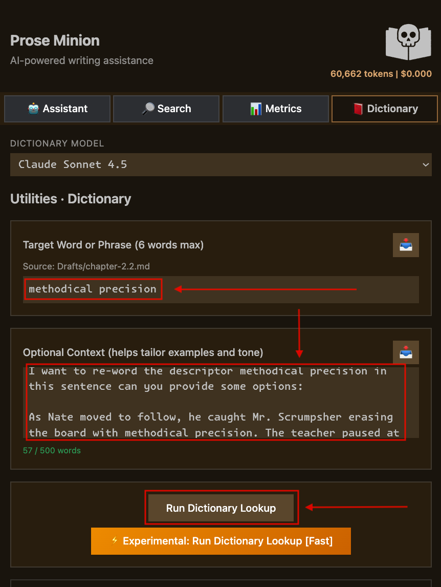

## Purpose

The Writer's Dictionary goes beyond standard definitions to provide:
- **Deep semantic analysis** of words and phrases
- **Context-aware alternatives** tailored to your specific sentence
- **Craft-focused insights** including tonal sliders, genre pointers, and cliche warnings
- **Character voice variations** showing how different narrators might express the same idea

This is particularly useful when you want to:
- Freshen overused phrases in your manuscript
- Find alternatives that match a specific tone or mood
- Explore the full semantic range of a descriptor
- Get AI-powered suggestions based on your actual sentence context

## Instructions

### Step 1: Enter the Target Phrase

In the **Target Word or Phrase** field, enter the word or phrase you want to look up (maximum 6 words).

**Tip**: If you select text in your editor before opening the Dictionary tab, it will auto-populate this field and show the source file.

### Step 2: Add Optional Context

In the **Optional Context** field, provide:
- The sentence where you're using the phrase
- What you're trying to achieve (e.g., "I want to re-word this descriptor")
- Any specific tone or effect you're going for

This context helps the AI tailor its alternatives to your specific use case.

**Example context from the screenshot:**
> *I want to re-word the descriptor surgical precision in this sentence can you provide some options:*
>
> *"She reached over without warning and plucked at his arm hair with surgical precision"*

### Step 3: Run the Lookup

Click **"Run Dictionary Lookup"** to generate the full entry.

**Note**: Use the standard "Run Dictionary Lookup" button (not the experimental fast mode) when requesting alternatives. The single-LLM-call approach produces more cohesive results when one model is responsible for the entire entry, especially for "re-word" instructions.

The experimental mode splits work across multiple agents for faster results, which works well for standard lookups but may produce less unified suggestions when you need alternatives.

---

## Results: What Each Section Provides

The Dictionary generates a comprehensive writer's reference with the following sections:

### Definition
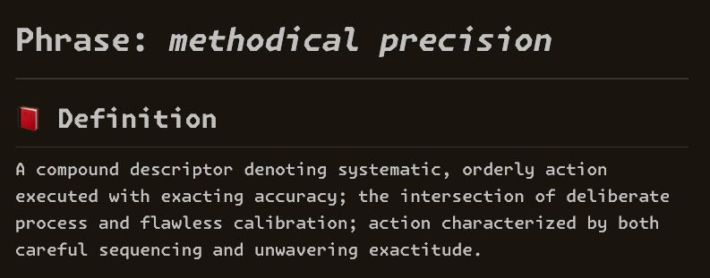

A craft-focused definition emphasizing the phrase's connotations, implications, and literary utility rather than just denotative meaning.

### Pronunciation & Parts of Speech
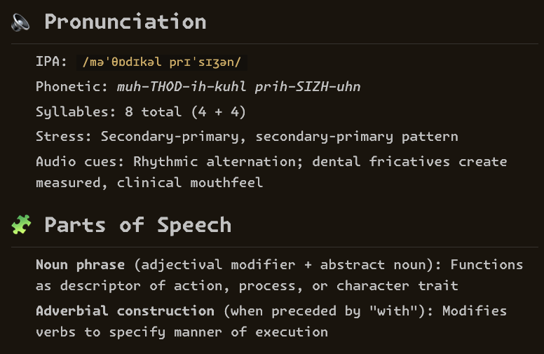

- **IPA and phonetic pronunciation** for audiobook writers and dialogue crafting
- **Syllable breakdown** with stress patterns
- **Audio cues** describing the sonic profile (useful for prose rhythm)
- **Parts of speech** showing how the phrase functions grammatically

### Sense Explorer
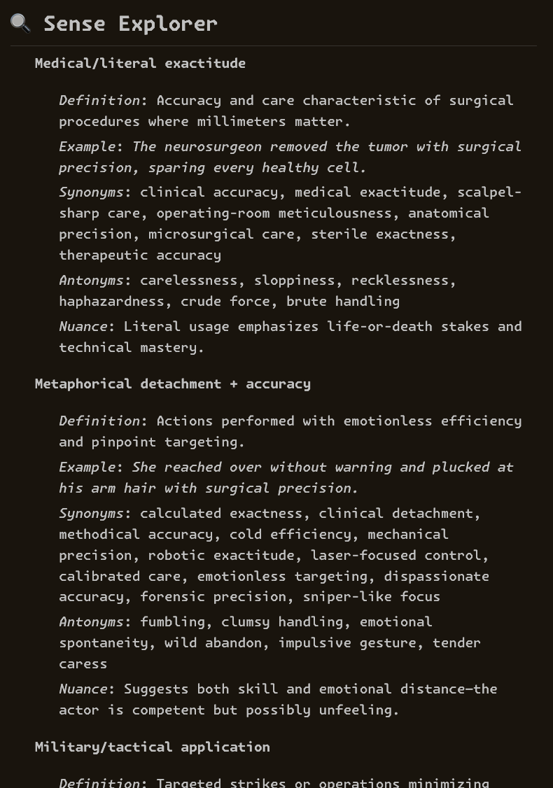

Multiple sense definitions with:
- Context-specific examples
- Extensive synonym lists
- Antonyms for contrast
- Nuance notes explaining subtle differences

This is invaluable for understanding the full semantic range of your phrase.

### Register & Connotation
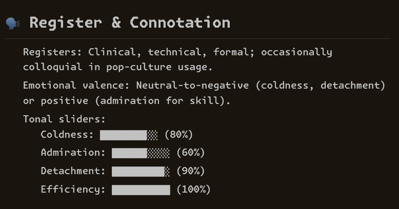

**Tonal sliders** provide at-a-glance insight into the phrase's emotional weight:
- Coldness, Admiration, Detachment, Efficiency (in this example)
- Helps you quickly assess if the phrase matches your intended tone

### Narrative Texture
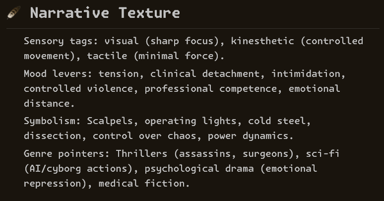

Craft-specific guidance including:
- **Sensory tags**: Which senses the phrase evokes
- **Mood levers**: Emotional effects it creates
- **Symbolism**: Associated imagery and metaphors
- **Genre pointers**: Where this phrase works best

### Collocations & Idioms
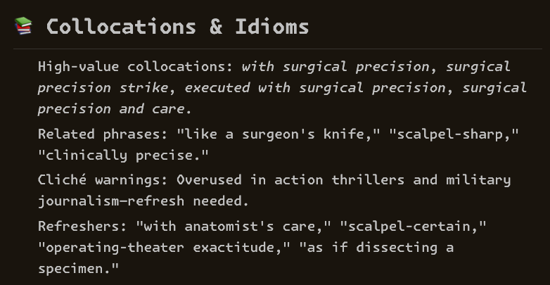

- **High-value collocations**: Common pairings that sound natural
- **Cliche warnings**: When the phrase is overused
- **Refreshers**: Fresh alternatives to worn-out phrasing

### Morphology & Family
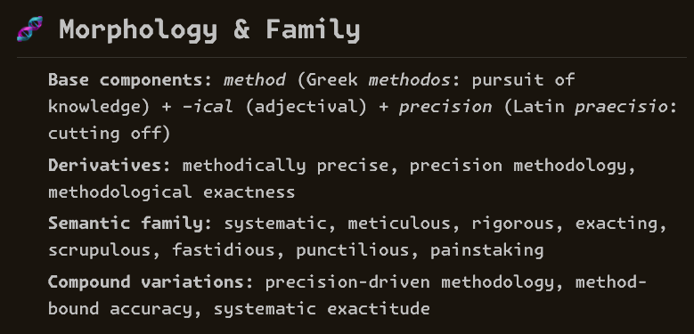

Related forms and compound variations to expand your vocabulary options.

### Character Voice Variations
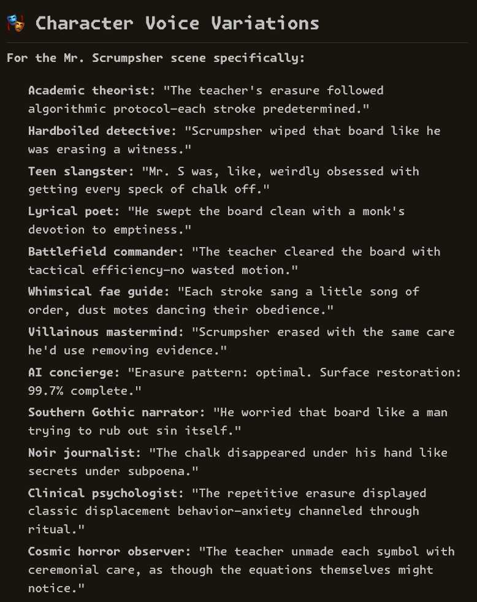

The same idea expressed through different character lenses:
- Academic theorist, Hardboiled detective, Teen slangster
- Lyrical poet, Battlefield commander, Gothic narrator
- And many more...

Excellent for:
- Finding the right voice for a POV character
- Adding variety to your prose
- Breaking out of your default writing patterns

### Soundplay & Rhyme
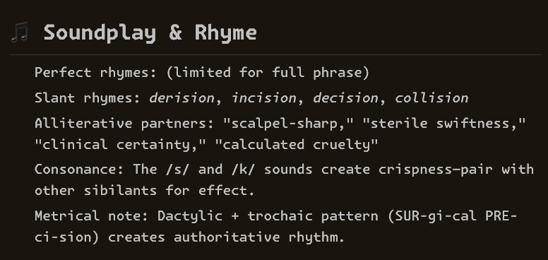

For poets and prose stylists:
- Slant rhymes and perfect rhymes
- Alliterative partners
- Consonance patterns
- Metrical notes

### Usage Watchpoints
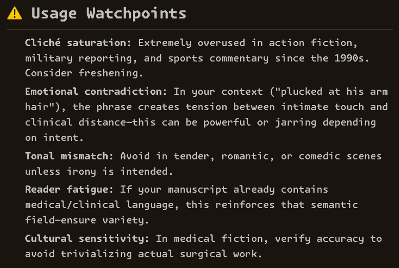

Critical warnings including:
- **Cliche saturation**: Is this phrase overused?
- **Emotional contradiction**: Does it create unintended tension?
- **Tonal mismatch**: Where should you avoid using it?
- **Reader fatigue**: How it interacts with your manuscript's existing patterns

### Semantic Gradient
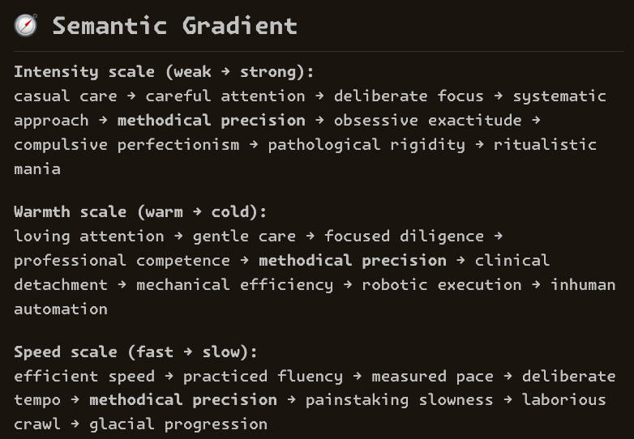

Visual scales showing where your phrase sits on relevant spectrums:
- Coldness/Detachment Scale
- Accuracy Scale

Helps you find alternatives that shift the intensity in either direction.

### AI Advisory Notes
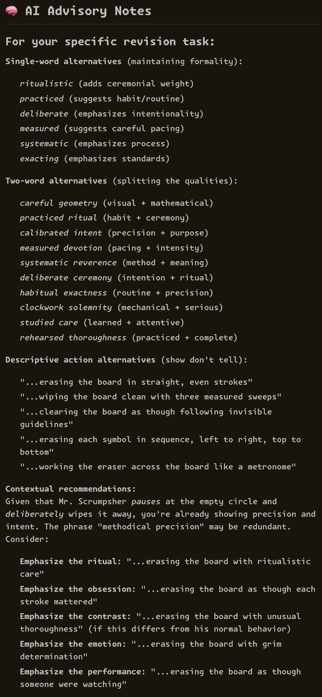

Context-aware analysis of your specific sentence:
- How the phrase interacts with other elements
- What it emphasizes or undermines
- Suggestions for what to consider

### Alternative Phrasings for Your Context
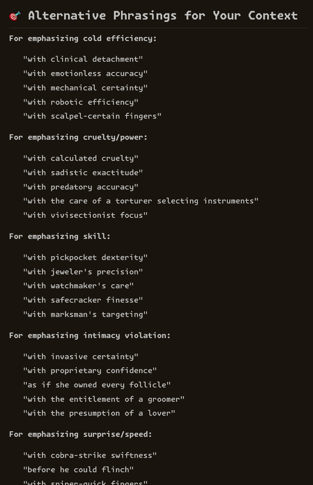

**The key deliverable when requesting alternatives.** Organized by emphasis:
- For cold efficiency
- For cruelty/power
- For skill
- For intimacy violation
- For surprise/speed
- For sensory freshness
- For humor/absurdity
- For gothic/dark romance

### Final Recommendation
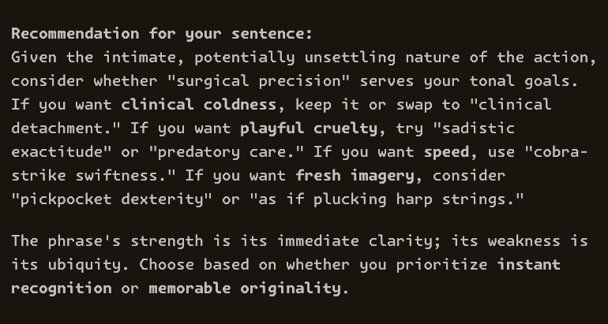

A synthesized recommendation based on your specific context, weighing the trade-offs between instant recognition and memorable originality.

---

## Output

The full output for this example is shown below. You can copy this to your notes or export it using the clipboard buttons in the Dictionary panel.

---

# Prose Minion | Writer's Dictionary Lookup

# Phrase: *surgical precision*

## Optional Context ( user provided )

*I want to re-word the descriptor surgical precision in this sentence can you provide some options?

"She reached over without warning and plucked at his arm hair with surgical precision"*

## Definition
A compound metaphorical descriptor denoting extreme accuracy, clinical detachment, and controlled exactitude in action; implies methodical care, zero margin for error, and often a cold or impersonal efficiency borrowed from the operating theater.

## Pronunciation
- IPA: `/ˈsɜːrdʒɪkəl prɪˈsɪʒən/`
- Phonetic: *SUR-jih-kuhl prih-SIH-zhun*
- Syllables: 6 total (sur·gi·cal pre·ci·sion)
- Stress: Primary on SUR-, secondary on -SI-
- Audio cues: Sibilant opening, hard /k/ in middle, liquid /zh/ near end—creates clinical, crisp sonic profile

## Parts of Speech
- **Noun phrase**: Functions as descriptor or adverbial modifier
- **Adjectival compound**: Modifies manner of action (e.g., "with surgical precision")

## Sense Explorer

1. **Medical/literal exactitude**
   - *Definition*: Accuracy and care characteristic of surgical procedures where millimeters matter.
   - *Example*: *The neurosurgeon removed the tumor with surgical precision, sparing every healthy cell.*
   - *Synonyms*: clinical accuracy, medical exactitude, scalpel-sharp care, operating-room meticulousness, anatomical precision, microsurgical care, sterile exactness, therapeutic accuracy
   - *Antonyms*: carelessness, sloppiness, recklessness, haphazardness, crude force, brute handling
   - *Nuance*: Literal usage emphasizes life-or-death stakes and technical mastery.

2. **Metaphorical detachment + accuracy**
   - *Definition*: Actions performed with emotionless efficiency and pinpoint targeting.
   - *Example*: *She reached over without warning and plucked at his arm hair with surgical precision.*
   - *Synonyms*: calculated exactness, clinical detachment, methodical accuracy, cold efficiency, mechanical precision, robotic exactitude, laser-focused control, calibrated care, emotionless targeting, dispassionate accuracy, forensic precision, sniper-like focus
   - *Antonyms*: fumbling, clumsy handling, emotional spontaneity, wild abandon, impulsive gesture, tender caress
   - *Nuance*: Suggests both skill and emotional distance—the actor is competent but possibly unfeeling.

3. **Military/tactical application**
   - *Definition*: Targeted strikes or operations minimizing collateral damage.
   - *Example*: *The drone strike eliminated the target with surgical precision.*
   - *Synonyms*: pinpoint targeting, tactical exactitude, zero-collateral efficiency, sniper accuracy, guided-missile precision, calculated strike, clean elimination
   - *Antonyms*: carpet bombing, scorched earth, indiscriminate fire, messy engagement
   - *Nuance*: Often euphemistic in military contexts—implies clean outcomes that may obscure complexity.

4. **Artistic/performance control**
   - *Definition*: Flawless execution in creative or athletic domains.
   - *Example*: *The pianist's fingers moved with surgical precision across the keys.*
   - *Synonyms*: virtuosic control, technical mastery, flawless execution, meticulous accuracy, perfect timing, disciplined grace
   - *Antonyms*: improvisation, emotional abandon, raw expression, unpolished spontaneity
   - *Nuance*: Can imply coldness or lack of soul if overemphasized—balance with warmth descriptors.

## Register & Connotation
- Registers: Clinical, technical, formal; occasionally colloquial in pop-culture usage.
- Emotional valence: Neutral-to-negative (coldness, detachment) or positive (admiration for skill).
- Tonal sliders:
  - Coldness: ████████░░ (80%)
  - Admiration: ██████░░░░ (60%)
  - Detachment: █████████░ (90%)
  - Efficiency: ██████████ (100%)

## Narrative Texture
- Sensory tags: visual (sharp focus), kinesthetic (controlled movement), tactile (minimal force).
- Mood levers: tension, clinical detachment, intimidation, controlled violence, professional competence, emotional distance.
- Symbolism: Scalpels, operating lights, cold steel, dissection, control over chaos, power dynamics.
- Genre pointers: Thrillers (assassins, surgeons), sci-fi (AI/cyborg actions), psychological drama (emotional repression), medical fiction.

## Collocations & Idioms
- High-value collocations: *with surgical precision*, *surgical precision strike*, *executed with surgical precision*, *surgical precision and care*.
- Related phrases: "like a surgeon's knife," "scalpel-sharp," "clinically precise."
- Cliché warnings: Overused in action thrillers and military journalism—refresh needed.
- Refreshers: "with anatomist's care," "scalpel-certain," "operating-theater exactitude," "as if dissecting a specimen."

## Morphology & Family
- Base components: *surgical* (adj.) + *precision* (noun)
- Related forms: surgically precise, precision surgery, surgical strike, precision instrument
- Semantic family: clinical, methodical, exact, calculated, calibrated, targeted, controlled
- Compound variations: laser precision, mechanical precision, mathematical precision, military precision

## Character Voice Variations

- **Academic theorist**: "Her movements exhibited the exacting calibration one associates with microsurgical interventions."
- **Hardboiled detective**: "She plucked the hair like a coroner lifting evidence—cold, clean, no wasted motion."
- **Teen slangster**: "She yanked that hair like some kind of robot assassin, zero chill."
- **Lyrical poet**: "Fingers descended with scalpel-certainty, a sterile theft of keratin."
- **Battlefield commander**: "Target acquired. Extraction executed with zero collateral."
- **Whimsical fae guide**: "One hair claimed with the tidy cruelty of a spider spinning silk."
- **Villainous mastermind**: "Each follicle removed with the exactitude I demand from all operations."
- **AI concierge**: "Follicle removal: optimized trajectory, minimal tissue disturbance, 99.7% efficiency."
- **Gothic narrator**: "Her touch was the surgeon's—intimate yet merciless, precise as a blade finding bone."
- **Sports commentator**: "That's textbook execution—absolutely clinical, no margin for error."
- **Noir femme fatale**: "She took what she wanted with the cold efficiency of a woman who's cut deeper before."
- **Tech entrepreneur**: "Like debugging code—identify the error, isolate, extract, zero downtime."

## Soundplay & Rhyme
- Perfect rhymes: (limited for full phrase)
- Slant rhymes: *derision*, *incision*, *decision*, *collision*
- Alliterative partners: "scalpel-sharp," "sterile swiftness," "clinical certainty," "calculated cruelty"
- Consonance: The /s/ and /k/ sounds create crispness—pair with other sibilants for effect.
- Metrical note: Dactylic + trochaic pattern (SUR-gi-cal PRE-ci-sion) creates authoritative rhythm.

## Translations & Cognates
- French: *précision chirurgicale* (direct equivalent, same connotations)
- Spanish: *precisión quirúrgica* (clinical contexts), *precisión milimétrica* (general accuracy)
- German: *chirurgische Präzision* (identical structure and usage)
- Japanese: 外科的精密さ (*geka-teki seimitsu-sa*), or メスのような正確さ (*mesu no yō na seikaku-sa*, "scalpel-like accuracy")
- Italian: *precisione chirurgica*
- Nuance: Romance and Germanic languages preserve medical metaphor; Japanese often opts for tool-based imagery ("like a scalpel") over procedural framing.

## Usage Watchpoints
- **Cliché saturation**: Extremely overused in action fiction, military reporting, and sports commentary since the 1990s. Consider freshening.
- **Emotional contradiction**: In your context ("plucked at his arm hair"), the phrase creates tension between intimate touch and clinical distance—this can be powerful or jarring depending on intent.
- **Tonal mismatch**: Avoid in tender, romantic, or comedic scenes unless irony is intended.
- **Reader fatigue**: If your manuscript already contains medical/clinical language, this reinforces that semantic field—ensure variety.
- **Cultural sensitivity**: In medical fiction, verify accuracy to avoid trivializing actual surgical work.

## Semantic Gradient (Coldness/Detachment Scale)
gentle touch → careful handling → methodical removal → **surgical precision** → clinical detachment → robotic efficiency → mechanical ruthlessness → cold brutality

## Semantic Gradient (Accuracy Scale)
approximate → careful → meticulous → **surgical precision** → atomic accuracy → quantum-level exactitude → impossible perfection

## AI Advisory Notes
- The phrase has become a **dead metaphor** in many contexts—readers may gloss over it without registering the imagery.
- In your specific sentence, the juxtaposition of "without warning" + "surgical precision" creates interesting cognitive dissonance: planned vs. spontaneous.
- Consider whether you want to emphasize **speed** (sniper-like), **coldness** (clinical), **skill** (virtuosic), or **cruelty** (sadistic control).
- The action (plucking arm hair) is inherently minor and intimate—pairing it with "surgical precision" elevates it to psychological warfare or power-play territory.

---

## Alternative Phrasings for Your Context

**For emphasizing cold efficiency:**
- "with clinical detachment"
- "with emotionless accuracy"
- "with mechanical certainty"
- "with robotic efficiency"
- "with scalpel-certain fingers"

**For emphasizing cruelty/power:**
- "with calculated cruelty"
- "with sadistic exactitude"
- "with predatory accuracy"
- "with the care of a torturer selecting instruments"
- "with vivisectionist focus"

**For emphasizing skill:**
- "with pickpocket dexterity"
- "with jeweler's precision"
- "with watchmaker's care"
- "with safecracker finesse"
- "with marksman's targeting"

**For emphasizing intimacy violation:**
- "with invasive certainty"
- "with proprietary confidence"
- "as if she owned every follicle"
- "with the entitlement of a groomer"
- "with the presumption of a lover"

**For emphasizing surprise/speed:**
- "with cobra-strike swiftness"
- "before he could flinch"
- "with sniper-quick fingers"
- "in one fluid snatch"
- "with pickpocket suddenness"

**For sensory freshness:**
- "plucking each hair like harp strings"
- "extracting follicles like a botanist collecting specimens"
- "harvesting hairs with tweezers-precision"
- "selecting hairs as if choosing threads from a tapestry"

**For tonal humor/absurdity:**
- "with the solemnity of a bomb defuser"
- "with NASA-engineer focus"
- "as if performing microsurgery on a grape"
- "with the gravitas of a diamond cutter"

**For gothic/dark romance:**
- "with the intimacy of a vampire counting heartbeats"
- "with possessive certainty"
- "with the thoroughness of a collector cataloging treasures"

---

**Recommendation for your sentence:**
Given the intimate, potentially unsettling nature of the action, consider whether "surgical precision" serves your tonal goals. If you want **clinical coldness**, keep it or swap to "clinical detachment." If you want **playful cruelty**, try "sadistic exactitude" or "predatory care." If you want **speed**, use "cobra-strike swiftness." If you want **fresh imagery**, consider "pickpocket dexterity" or "as if plucking harp strings."

The phrase's strength is its immediate clarity; its weakness is its ubiquity. Choose based on whether you prioritize **instant recognition** or **memorable originality**.
